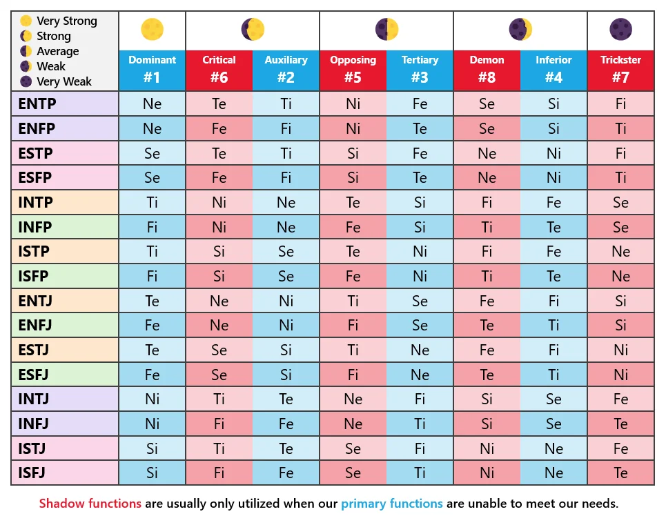

# Leo的另一个主页

## Cheat sheet

- 正则表达式：[PDF1](_asset/cheat-sheet/regex1.pdf ':ignore') [PDF2](_asset/cheat-sheet/regex2.pdf ':ignore')
- 终端：
  - Mac: [terminal-mac-cheatsheet](https://github.com/0nn0/terminal-mac-cheatsheet/tree/master/) 
  - Bash: [Bash Shortcuts](https://gist.github.com/tuxfight3r/60051ac67c5f0445efee) [PDF1]( /_asset/cheat-sheet/bash1.pdf ':ignore') [PDF2](/_asset/cheat-sheet/bash2.pdf ':ignore')
- 搜索引擎： [Google Search Operators](_asset/cheat-sheet/google1.pdf) 
- 英语：[雅思、托福总分换算表](_asset/cheat-sheet/english1.pdf ':ignore')

## 图片

- John Bebee模型中十六人格的八功能排序

  

----

