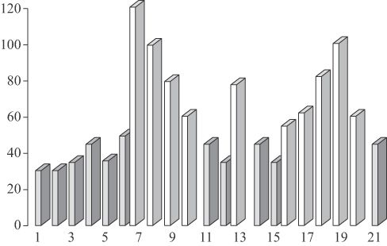

# 第四章 分析心理学的主要方法

在我们的理解中，弗洛伊德的贡献不仅仅在于他对人类潜意识的发现，更为重要的是，在临床的实践意义上，是他提供了发现潜意识的方法。在这种双重的意义上，人们给予其《梦的解析》以改变历史的殊荣。荣格也是如此，他提出的集体无意识和原型等理论固然重要，但是其词语联想和积极想象等方法和技术具有同样重要的意义。在塔维斯托克诊所的讲演中，荣格曾向听众提出问题：**如何才能接近无意识或发挥无意识的治愈作用？**接着他自己十分自信地说，有三种方法：词语联想、梦的分析和积极想象。这也是荣格一向介绍的分析心理学方法与技术的主要内容。

## 一、对于心理分析方法的理解

心理分析方法与技术的运用，具有其特殊的专业特点，其作用的有效发挥总是需要满足一些基本的条件。除了作为心理分析师本身的素质条件之外，最重要的在于对无意识、象征性和感应性的把握与理解。

### （一）无意识水平的工作

无意识是心理分析的核心概念，也是心理分析工作的重要氛围，其本身也具有心理分析方法与技术的内涵。我们把“无意识”（unconscious）作为一个开放性的概念，它既包括弗洛伊德的个体潜意识（personal unconscious）、荣格的集体无意识（collective unconscious）、弗洛姆的社会潜意识（social unconscious）和汉德森的文化无意识（cultural unconscious），也透示着某种东方的“道”、“太极”和“禅”的意境。对无意识的理解之所以重要，是因为做好心理分析的最基本的条件之一，就是要求在“无意识水平”上来进行工作。

通过弗洛伊德与荣格，我们已经有了对无意识理解的机会，个体潜意识与集体无意识也可以成为互补性的概念。不管是弗洛伊德所强调的压抑与检查机制下的潜意识特性，还是荣格所注重的原型、意象的集体无意识内容，都具有十分重要的方法论的意义。比如，就弗洛伊德精神分析之“三大方法”而言，自由联想、梦的解析、移情与暗示，都与其个体潜意识观念有着必然的联系。自由联想包含着受压抑的潜意识的运作，梦的解析中最重要的是要识破潜意识试图通过检查机制的化装，而移情与暗示则是要化解由于受压抑而导致的潜意识中“里比多”的固着。同样，就荣格分析心理学的三大方法而言，词语联想、梦的意象象征分析和积极想象，都与无意识尤其是集体无意识观念密切相关。词语联想所涉及的情结主要是无意识的内容，荣格梦的分析以其原型意象和象征性为基础，积极想象更是充分地体现了与无意识的沟通以及集体无意识意义的反映。

心理分析所注重的无意识水平的工作，首先需要对无意识有一种容纳与接受的态度。这也要求培养一种更加敏感和更为开放的心胸，倾听自己内心深处的表达，让无意识自发地涌现。同时，也要求有一种更加积极的意识准备和更加成熟的心态，来面对和承受来自无意识的内容。因为在无意识中，有远古的智慧，也有被压抑的内容；有对意识与自我的充实，也会有对意识与自我的挑战。

因此无意识水平上的心理分析，意味着在无意识和意识自我之间搭建起一种更为本质、更加确定的关系。就许多心理分析的方法与技术的使用而言，诸如自由联想、积极想象、梦的分析、移情与反移情以及沙盘游戏和音乐治疗等，实际上都是为了帮助被分析者接近无意识，接触与感受无意识的真实和潜力。其中不但包含着真正的治愈的因素与力量，而且包含着本性自我与自性化发展的条件与机会。

在这种意义上，我们可以把心理分析之无意识的具体意义，纳入老子道的哲学思想之中，或者是把老子深远的思想，作为心理分析之无意识水平工作的指导。《老子》第一章说：“道可道非常道，名可名非常名。无名天地之始，有名万物之母。故常无欲以观其妙；常有欲以观其徼。此两者同出而异名，同谓之玄。玄之又玄，众妙之门。”这众妙之门，也是心理分析之门，也是意识与无意识玄妙结合之门。

### （二）象征性的分析原理

荣格曾用一种简明的形式来定义象征，认为**当一个字或形象超出了一般和其直接的含义时，便有了某种象征性或象征的意义**。而所有的象征也都具有深远的无意识的特征。或者说，象征正是无意识的语言或其表达方式。于是，在无意识水平上工作的心理分析，在很大的程度上也是在分析象征所包含的意义，也即象征所包含的无意识的消息。

不仅仅是一个字或一个形象，任何事物都具有象征性，都能呈现出象征性的意义，包括任何事件。而从所面对的事物或发生的事件中感受与领会其象征性的意义，是从事心理分析的基本功，也是一种根本的心理学的努力。看似一个车轮，不管是出现在梦中还是沙盘上，除了其现实的车轮的功能及作用之外，还具有深远的宗教与神圣的象征性意义。称其为神圣的象征意义，本身已超越了意识与理性的范畴，深入到集体无意识的层面。因此，在心理分析的工作中，对于这种象征性的理解以及对于所象征内容的感受与体验，都是非常重要的工作与努力。

实际上，许多精神与心理的病症本身便具有象征性的意义，有经验的临床医生对此都会有所体察。比如，面临不堪忍受的生活僵局的时候，病人可能会出现吞咽阻碍的症状，吃任何东西都显得困难，于是这症状本身也是在用象征性的语言表达他已经不能再接受或承受任何东西了。同样，面对重大的心理压力，也可能产生气喘的病症，但这病症所表达的，也正是他已经不能正常喘气了；或产生的是腿部关节炎的病症，那么其象征性的表达，则是形象地在说明，他已经不堪重负，不能正常行走了。于是，病人的病症，正是在运用这种象征性的语言，来陈述其背后病因的存在及其作用。

《易经》是充满象征意义的宝贵资源。荣格也曾把“太极图”作为“可读的原型”，十分注重其中所包含的象征性的意义和作用。正所谓“易者象也”。《易经·系辞上》中说，“圣人有以见天下之赜，而拟诸其形容，象其物宜，是故谓之象”。而“拟之在心，象之在画”。学者们多认同《易经》之初先有象而后有卦，设卦也本为观象，其中本为心会。

李光地在其《周易折中》中曾有案评说，孔子传《大象》之意，便是要读者感悟伏羲立象之初衷。如《乾》之纯阳六爻，其中包含着至诚无息，天行健之象，而君子也应有自强不息之精神。《坤》之纯阴六爻，其中彰显着大地至厚无所不载之意，而君子也应有厚德载物的效法。于是，天地山泽雷风水火不仅仅有其自然的属性，也有人文的精神，更有心地的本质。

### （三）感应性的转化机制

心理分析的关键在于感应。有感应就会有转化，就会有心理分析治愈与发展的效果。荣格曾在其对于《易经》研究的基础上，阐述了一种“共时性原则”（synchronicity），用以表达那些超越了因果关系而同时发生的充满意义的巧合事件，而在这种“共时性现象”的背后，便蕴涵着感应与转化的心理机制。

我把“感应”作为中国文化心理学的第一原理，并且曾将其与西方心理学之“刺激—反应”原理作比较，突出“感”、“应”中心性的内涵。同样，感应也是心理分析过程中最重要的工作原理。借用中国文化原型，我也把感应性的转化机制，在实际的心理分析过程中体现为如下的实践：命名与启蒙（naming and initiating），驯化与滋养（tmaing and nurturing），时机与转化（timing and transforming）。实际上，感应影响或决定着麦斯麦之催眠术的治疗效果，或者说是其中治愈的关键。同样，感应也是弗洛伊德自由联想以及荣格积极想象方法背后的重要机制。在整个心理分析的过程中，感应是方法中的方法，治疗中的治愈，转化与发展中的关键。

《易经·咸卦》开“下经”之首，与乾坤合为“天地人”之象征。《易经·咸·彖》中说：“‘咸’，感也。柔上而刚下，二气感應以相与……天地感而万物化生，圣人感人心而天下和平。观其所感，则天地万物之情可见矣。”观其卦象，咸卦以艮兑相配，所表达的是山泽气息相通，万物皆互相感应之道理；但象中亦有情，艮为少男，兑为少女，男女相感之纯真至情，亦见于此咸之卦象之中。综观咸卦六爻，初阴四阳，二阴五阳，三阳六阴，皆含阳感而阴应，阴感而阳应之象。“感”中有心，咸取其无心而感之深意，包含着意识与无意识之心理分析的根本。“應”中亦有心，且寓意“雁鸟”之深情。

《易经·中孚》之九二爻辞：“鸣鹤在阴，其子和之。我有好爵，吾与尔靡之。”包含着诚孚以至感应的道理。中孚之九二，阳刚充实，象征诚孚之志，孚则能生感应与感通。《诗经》中有云：“鹤鸣于九皋，声闻于天下。”也是同样的意象。故《易经·系辞》中有：“是以君子将有为也，将有行也，问焉而以言，其受命也如响，无有远近幽深，遂知来物，非天下之至精，其孰能与于此。”接着，《系辞》中还明确地阐释其中的感应心法：“易无思也，无为也，寂然不动，感而遂通天下之故，非天下之至神，其孰能与于此。”受命如响之天下至精，感而遂通之天下之至神，也就留给我们这深怀感应的精神。以此精神而极深研几，故能不疾而速，不行而至，体现一种真正的心理分析的境界。

## 二、荣格与词语联想方法

词语联想（word association）看起来是十分简明的方法，几乎不包含任何神秘或深奥的色彩。让被试按照一种简单的规则，对一些特定的刺激性词语做出自己的联想与反应。在荣格之前，高尔顿和冯特等人，在其心理学的研究中都曾使用了形式极为类似的词语联想法。

尽管荣格并非第一个使用这种词语联想技术的人，但是，他却是第一个利用词语联想的技术来研究反应障碍的心理学家。在种种反应差异的背后，尤其是被试反应障碍的背后，到底是什么因素在起着作用？觉察到这样的问题，以及努力去寻求问题的答案，使得荣格有机会把词语联想方法作为一种研究心理疾病根源或病源的临床技术。

通过词语联想技术及其临床应用，荣格发现了情结的存在及其作用，尤其是与情结有关的无意识事实。芭芭拉·汉娜在其《荣格的生活与工作》中评论说：“（词语联想法的使用）致使荣格认识到了情结的存在，并且在没有弗洛伊德影响的条件下，独立地发现了无意识的存在。”

这当然是富有感情色彩的称赞。但是，1909年荣格被邀请去美国参加克拉克大学的校庆，则正是由于他对于词语联想研究与应用所做出的贡献。人们多以为荣格那次去美国是由于弗洛伊德的缘故。实际上荣格是独立被邀请的，被邀请的理由主要就是他的词语联想研究。

荣格自己曾在塔维斯托克诊所介绍其心理分析方法的时候，重点阐述其词语联想的技术及应用。根据他当时讲演的内容，我们整理出以下对其词语联想法的介绍：

> 词语联想的工具，是一份写有100个词的一张纸。测试的指导语，只是让被试听到刺激词之后，尽可能快地做出由此刺激词所联想到的反应，也即一个或几个联想反应词。当确信被试懂得这个词语联想的意思之后，就可以开始正式的测验。用一只秒表就可以记录下被试对每一个刺激词反应所需要的时间。

这确实是十分简明的测验方法，尽管进一步的分析需要依据更多的反应指标。在被试的反应时之外，被试反应回答词的词义及其联想、反应回答的错误或口误以及被试对刺激词反应时的面部表情及有关的非言语线索等，都可以作为深入分析的情结指标。

荣格自己曾这样来阐述其词语联想技术的使用。荣格说，这个实验最初并未考虑到它目前的运用，而是专门用来研究心理联想的……但是，当专门用来研究心理联想的实验失败的时候，当被试回答出错的时候，你却能学到别的东西。你问一个连孩子都能回答的普通单词，而一个智力正常的成年人却不能回答。这是为什么呢？荣格说：“因为那个单词击中了我称之为情结的东西，这情结是一种经常隐匿的，以特定的情调或痛苦的情调为特征的心理内容的集合物。这个单词有如一枚炮弹，能够穿透厚厚的人格伪装层而打进暗层之中。例如，当你说‘购买’、‘钱’这类单词的时候，那些具有金钱情结（money complex）的人就会被击中。”

荣格在其塔维斯托克诊所的讲演中，介绍了自己使用词语联想测验的几个临床个案。其中有一个是这样的。

荣格所介绍的病人对词语联想测验的反应记录

在这个词语联想测验的图标中，柱子的高度表示被试的实际反应时间。竖柱中的50为平均反应时间。50以下的深色柱表示没有干扰迹象的反应。而高出“平均反应时间”的浅色柱则表示有干扰以及干扰的强度。在对刺激词7、8、9、10的反应中，是连续的一串干扰，而对于刺激词7（刀）的反应则更为关键。对于刺激词13（矛）的反应是一个孤立的干扰。但接着在对刺激词16～20的反应中，又出现了一串连续的干扰，其中反应最为强烈的是对刺激词18（尖）和19（瓶子）。

荣格说这个被试是一位大约35岁的男子，是一位正常被试而不是病人。荣格在其讲演中，具体地描述了他对于该被试词语联想结果的分析：

> 开始的单词是“刀”，它引起4个干扰反应。接下来的干扰是“矛”（或枪），其后是“打”，再后是“尖锐的”，最后是“瓶子”。这只是连续50个刺激词中的少许几个，但足够我用来使被试把事情和盘托出。我说：“我不知道你曾有过如此不愉快的经历。”他盯着我说：“我不懂你在谈些什么。”我说：“你明白。你曾因为喝醉酒，有过一桩用刀伤人的不愉快纠葛。”他说：“你是怎么知道的？”随后便讲述了整个事情的经过。他出身于受人尊敬的单纯而正派的家庭，有一次因为喝醉酒与人发生争执，用刀刺伤了对方，结果被判刑一年。这是一件他不想提起的重大秘密，因为这会给他的生活罩上阴影。但是，这情结就在其词语联想的测验中表现了出来。

尽管现在很多人都认为词语联想只是荣格早期从事心理分析的方法，认为它过于简单，甚至已经过时，但是，在词语联想形式下所包含的方法论的意义，却仍然像弗洛伊德的自由联想那样，具有潜在的深意和价值。荣格在为其苏黎世荣格研究院制定训练章程的时候，将词语联想作为重点课程以及必考的科目，自有他的道理。一旦你理解了那简单形式背后的意义，那么也就能够继续发挥它有效的作用。

## 三、梦的分析与工作

荣格自己的分析心理学理论，不仅仅是其分析梦的必然基础，而且也是其释梦方法的主要特点。那就是在集体无意识的框架中，在对原型以及原型意象的理解中来对梦进行分析。实际上，荣格的情结理论、人格类型理论，以及自性化过程理论等，也都被他有效地运用到了梦的分析中。

尽管荣格与弗洛伊德一样，都是以梦为其心理分析的主要内容，但是，两人对于梦的理解却颇有差异。弗洛伊德以其个人潜意识的理论为基础，认为梦主要是一种隐匿的，不被承认的欲望（主要是性欲）的歪曲性表现。由于这种欲望与我们的意识自我相抵触，为了不被意识自我所识别，为了表现自己的存在，梦就乔装打扮以图逃避意识自我的“检查”。于是，弗洛伊德的释梦，就是要剥去梦的伪装，抛弃你的意识偏见并自由地发挥你的联想，从显梦中获得隐梦的真正意义。

但是，在荣格看来，弗洛伊德这样做的结果，所探寻与发现的只是情结。对于荣格来说，若是为了探寻与发现情结而分析梦的话，就太浪费梦的价值了；何况通过他的词语联想法，能够更加简明与准确地获得发现情结的效果。因此，对于荣格来说，他在释梦工作中所要探求的，是无意识对于情结做了些什么，是梦背后更加深远的集体无意识以及原型和原型意象的渊源和意义。

梦根本不需要伪装，梦是一种自然而然的心理现象。梦没有伪装，也没有说谎，也没有歪曲与掩饰，它们总是在尽力表达其意义，只是它们所表达的意义不被我们的意识自我认识和理解。

荣格曾这样写道：

> 这一新的想法是我分析心理学发展中的转折点。这意味着我逐渐放弃了那种顺着自由联想，越来越远离梦本身的做法。我选择了关注于梦本身，而不是由梦引发的自由联想。我相信梦所表达的正是无意识想要说的某种特别的内容。

荣格接着说：

> “对梦态度的转变包含了一种释梦方法的转变，新的释梦技术可以囊括梦所有宽广的层面。”于是，原型意象及其象征，也就成为这一新的释梦技术的重要内容。

荣格曾用过这样一个个案来阐述他的梦的分析方法与技术。病人是一位男性，梦到一个醉醺醺、披头散发的泼妇。梦中的这位女人似乎是他自己的妻子，尽管与现实中他的妻子完全不同。荣格说，从表面上看，这个梦完全失实。梦者也认为是很荒唐的一个梦。若是让他开始自由联想，那么他肯定会愈加偏离梦的不愉快的一面，并且以其情结而告终。那样，尽管我们能够找到病人的情结，但却无法了解这梦的特殊意义。

对此，荣格解释说梦中的“失实的妻子”，正是他的内在原型意象阿尼玛，也就是其内在的女性形象。而这个内在的女性不仅仅没有得到良好的发展，而且有了堕落的表现，这也就是病人问题的根本所在。无意识通过梦境，表达了这么一种十分重要的信息和意义。

无意识通过梦和我们说话与沟通，但用的是一种象征性的“语言”和方式。因而，荣格的释梦方法，在强调象征的同时，充分地运用了其原型和原型意象的理论，发挥神话、宗教以及童话寓言的意义和作用，这都是荣格梦的分析方法的特点，也是荣格所说的梦的分析中“扩充”（amplification）的根据与基础。

原型意象和象征性在荣格梦的分析的方法中具有十分重要的作用，但是荣格也曾留下这样的教诲。他说：“我常常告诫我的学生，尽可能多地学习象征性的理论，而当你分析一个梦的时候，就要把它们全部忘记。”
荣格自己一生中分析了他自己以及病人的8万多个梦，可见其专业的积累与对梦的执著程度，也可以联想到那熟中生巧以及得心应手的道理。

弗舍里（Henry Fuseli）所画的《梦境》，弗洛伊德将这幅画挂在其接待室中

达利：《蜜蜂飞过的梦境》，被用作弗洛伊德《梦的解析》的插图

就荣格及其分析心理学的梦的工作而言，联想分析、扩充分析和积极想象是三种主要的方法与技术。通过联想分析，可以获得具体的个人资料以及有关个人潜意识的内容；通过扩充分析，则可以把梦的内容放在更为广阔的集体无意识和原型及其象征的水平来进行工作；通过积极想象，则注重于梦对于梦者的直接影响，尤其是融会身心的体验与感受。

### （一）联想分析法

梦的工作中的联想分析法包括两方面的联想技术，其一是自由联想，其二是直接联想。经典的精神分析家仍然是喜欢从自由联想开始对梦的分析。当病人向你陈述了一个梦境或梦的内容之后，可以使用自由联想的技术，让梦者的个人潜意识充分显现。

比如，有梦者梦到了一头母牛在吃草，那么若是从母牛开始自由联想，则可能会引发出牛奶—母亲—父亲等等，然后将自由联想所获得的所有链接内容进行分析。而一旦发挥了自由联想的作用，梦中的母牛可能就不再重要，因为那是弗洛伊德所说的“显梦”，而母亲或父亲，以及梦者与母亲或父亲的关系就特别重要，因为那是自由联想的引导，是所谓“隐梦”的内容。这仍然是基于弗洛伊德自由联想技术上的运用。

而联想分析法中的直接联想，则是吸收了荣格对于弗洛伊德自由联想技术的批评，认为自由联想有可能会导致远离或脱离梦的本源，只是引向了梦者的情结，而非梦的本意。于是，就梦中出现母牛的例子而言，直接联想法仍然可以发挥联想的作用，比如陈述或捕捉任何由母牛所联想到的词语、意念等等，但是，不是由母牛—牛奶—母亲—父亲等自由联想法逐渐远离母牛，而是让梦者把所有联想到的内容回归到母牛的意象或其象征意义进行分析的工作。因此，梦的工作的直接联想法，则更多地反映着荣格分析心理学的思想。

### （二）扩充分析法

扩充分析（amplification）是荣格提出的梦的分析方法，也可看做直接联想的进一步发展，旨在将梦的内容与分析工作提升至原型与集体无意识的水平。一般来说，梦的分析中的联想分析，主要是构建梦者的个人信息与背景，受压抑的个体潜意识仍然是工作的重点；而扩充分析，则是要在深远的原型以及原型意象的水平上工作，集体无意识是工作的关键。

因此，扩充分析也就意味着在神话、历史和文化等水平上解析梦中的比喻、隐喻和象征。尽管扩充分析与自由联想并非必然有冲突，但是，在荣格心理分析家看来，进行扩充分析的时候，要促使被分析者放弃对梦中意象纯粹个人与个体的态度，让被分析者体验自己作为原型能量中的存在，而非原型的“客体”，发挥原型及其意象的治愈功能。

若是用梦中出现母牛的比喻，那么扩充分析法就不是顺着任何个人的联想进行梦的工作，而是针对母牛以及牛本身，追溯其深远的文化背景以及原型水平上所具有的象征性意义。比如，在中国文化的背景中，牛是十二生肖之一，与十二地支相配为“丑牛”；牛之吃苦耐劳，不管是耕种还是产奶，都与人的生活有着密切的关系，这些都是扩充分析所重视的内容。

### （三）积极想象法

积极想象在梦的工作中的运用，除了以梦中的意象为重点，从意象中获得生动的意义之外，所注重的是梦者从梦中所获得的体验与感受，包括身体的反应以及身体的感觉，或者说是注重让梦者去体验与感受梦。

比如，仍然是用梦中出现的母牛为例子，若是使用联想分析，那么可以获得从“母牛”引申出来的联想，或者是有关母牛的所有个人的联系；而用扩充分析，则可以获得母牛本身在文化与原型层面上的意义；但若是使用积极想象的话，那么，工作的内容就会集中在梦中母牛的意象及其背景和气氛上，让梦者利用积极想象去与梦中的对象直接沟通和对话，或者去感受那母牛的情感，便是梦的工作中的积极想象。

于是，让梦者去描述整个梦境，形容梦中的任何细节，比如牛的颜色、大小，甚至是牛吃草的动作与神态等等，以及顺着其中某一线索而进入无意识的气氛，让梦中的意象生动与丰富起来，让梦者在这种生动与丰富的梦的工作过程中获得治愈，都是梦的工作中积极想象法的实践意义和作用。

## 四、积极想象技术

在荣格看来，词语联想以及梦的分析，都还是“间接沟通”无意识的方法，而积极想象则是直接获取无意识的技术。许多荣格心理分析家都把积极想象称为“睁着眼睛做梦”。在达里尔·沙珀（Daryl Sharp）的《荣格心理学词典》中，积极想象被定义为通过自我表达的形式来吸收无意识的方法。

1915年前后，荣格曾获得这样一个意象：他自己像是一个10岁左右的孩子，在客厅的地板上玩积木。那类似梦境的意象是如此的清晰与真切，使得荣格产生了这样一种理解：那梦中的孩子仍然“活着”。很自然，荣格便想到要与这梦中玩耍的孩子建立一种联系，以便进行直接的沟通。于是，荣格一方面使自己进入想象的世界，一方面开始像孩子一样玩耍，要在一种象征而真实的情景中，与活在自己内心深处的孩子进行交流。1935年左右，荣格正式使用积极想象这一术语，并且称之为“一种睁着眼睛做梦的过程”
。但这种积极想象与白日梦不同，后者多少是个人主观的发挥，总是停留在个人日常体验的水平；而积极想象与意识性的发挥正相反，由积极想象所导演的剧情，似乎是“要迫使观众的参与；一种新的情景被推出，其中潜意识内容被展现在清醒的意识状态中”
。荣格从中发现了一种超越性的机制，也即一种意识与潜意识因素之间的合作性，并且认为想象性的意象，自身具有其在心灵生活有序发展与转化中所需要的所有因素。

荣格在其塔维斯托克的讲演中，把积极想象作为他用来探索或接触无意识的主要方法之一（词语联想，梦的分析），并准备做一次专门的讲座。但是，由于时间的关系，他只是讲述了词语联想和梦的分析，最后一讲以移情为主要内容。不过，在整个系列讲座结束之前，有一位叫海菲尔德的医生向荣格提问：“积极想象是一种什么样的技术？”荣格对此做了长达12页的回答。

荣格在这次讲述他的积极想象技术的时候，首先给出一个病人的例子。病人是一位年轻的艺术家，荣格曾向他介绍积极想象的方法。但这位病人开始的时候怎么努力都无法理解荣格所说的积极想象。

后来，这位病人在火车站等车的时候，无意中端详着墙上的一幅广告画。画面上是阿尔卑斯山的伯尔尼，有色彩鲜艳的瀑布，碧绿的草地和一座山峰，山坡上有几头牛在吃草。

病人坐在那里等车，一边端详着这幅广告画，一边在心里想着自己为什么就是不懂荣格所说的积极想象。病人每次去看荣格都要在这个车站上等车。

有一天，病人在等车的时候，照旧端详着那幅画，他自言自语地说，也许我可以从这幅画开始，试试荣格所说的积极想象。比如，病人跟自己说，我想象自己在这幅画中，这画中的风景变成了我身临其境的地方，我在牛群中走向山坡，然后眺望山的另外一面的景色，我也许能看到山坡背后有些什么。

于是，他想象自己置身于画面的风景之中。他看到了草地、小路，经过牛群向山上走去，到达山顶之后，朝山的另一面望去：那里还是草地，缓缓的山坡，不远处有一排篱笆。于是他走了过去，越过篱笆，有一条被人踩出的小道，绕着山沟和一块大岩石。他从岩石边绕过去，看到前面有一座小教堂。教堂的大门半开半掩着。他心想，最好是进去看看。于是便推开门走了进去。在缀满鲜花的祭坛上，立着一尊圣母的木雕像。他抬头端望她的面容……就在这个时候，某种有尖耳朵的东西闪了一下就消失在祭坛后面，病人像做梦一样醒来，心里嘀咕：“嗨，这全是胡思乱想。”随即，他的“幻想剧场”一下子也就消失了。

火车到站了，病人乘车离开了火车站，而他心里一直还念叨着：“我还是不明白积极想象是怎么回事。”就在这时，一个念头突然出现了：“噫，那东西也许真的在那里，圣母像的后面也许真的有过一个尖耳朵的东西，闪了一下就不见了。”于是，病人自己对自己说，“作为试验，我不妨再从头来一遍，看看会怎么样。”于是，病人想象自己回到了车站，仍然是端详着那幅广告画。然后，他置身于那幅画面中，沿着山坡上了山。到了山顶之后，仍旧是好奇地想象着山背后有些什么。他又看到了那篱笆和缓缓的山坡。这时，他告诉自己说：“嘿，不错，看来这些东西还在那里。”然后，他绕过大岩石，看到了那座教堂。他对自己说：“教堂就在前面，那至少不是幻觉。一切都秩序井然。”教堂的门还是半开半掩，他犹豫了片刻对自己说，“现在，我把门推开，会看到祭坛上的圣母。然后，那个尖耳朵的东西会从圣母像后面跳下来……如果不是这样，这一切便全是幻想而已。”于是，他推门走了进去，抬头看到圣母像，刹那间，那个尖耳朵的东西像上次一样跳下去不见了。于是，这病人获得了某种让他自己信服的经验。

荣格说，从那时起，他找到了钥匙，学会了积极想象。

荣格曾用自己的童年经历，来解释积极想象的自然发生。在荣格的姑妈家里，有他爷爷的一幅像：作为主教的爷爷，配带着徽章，走出房门，站在台阶上……荣格说，他常常跪在一把椅子上凝视着这幅画像，直到觉得他走下了台阶。而他姑妈每次看到荣格在那里看得出神，总是说：“嗨，乖孩子，他不会动的，还站在那里呐。”荣格说，1935年在塔维斯托克讲演的时候，“但我知道我看见他走了下来”。荣格接着说，你们看，就这样，那幅画像开始动了起来。同样，当我们全神贯注于头脑中的一幅图景的时候，它会开始动起来，意象会变得更加丰富，还会变化发展下去。

在这次讲座中，荣格还说，由于通过积极想象，所有的意象都产生在有意识的思维中，这些意象比起不确定的梦更加完整。这些意象也比梦有更丰富的内容。于是，积极想象意味着意象有自己独立的生命，意味着象征性事件的发展有自己的逻辑根据，意味着通过某种方式，我们可以与这些具有生命的意象进行直接的沟通。

对于积极想象的理解，可以有两种基本的途径，其一是从其西方心理分析技术的发展线索来进行分析。正如弗洛伊德的自由联想与催眠术中的谈疗法与宣泄法有着密切的关系，而它们又有其独到的发展一样，荣格的积极想象，与弗洛伊德的自由联想也有着内在的联系或发展性的关系。荣格自己曾把积极想象看做自由联想的直接扩展。

但是，在这种扩展中，产生了其独特的思想与创造。而这种独特思想的来源，也就构成理解积极想象的另外一个途径，也即从其与中国文化的关系入手。

荣格在与卫礼贤合著的《金花的秘密》（《太乙金华密旨》）的评论中，首次系统地阐述了关于“积极想象”的思想。而正是在这次合作中，卫礼贤为荣格开启了中国文化的大门。这是对于荣格整个分析心理学发展至关重要的事件，卫礼贤把荣格从与弗洛伊德分裂后的抑郁和孤独中拯救了出来，并且赋予其创造的机会与力量。

通过对道家内丹功法的阐释，荣格表达了这样的思想：道家的无为，是获得自身解放的关键。荣格说：“让事物自发地表现的艺术，道家为无为的教诲……成为我打开无意识大门的钥匙。我们必须要让它们在心灵深处出现。对于我们来说，这是很少有人知道的一种艺术。”而这种很少有人知道的艺术，也就演化为荣格的积极想象。荣格接着说，意识总是与心灵的发展掺和在一起，吹毛求疵，好为人师，从未让心灵在平静的环境中质朴地发展。而这也就是进行积极想象时所面临的最大困难。

接着，荣格描述了积极想象的程序与步骤：

首先，尽量客观地观察一个意象的任何细节的发展与变化。这看起来很简单，但实际上也非常困难。其困难之处便在于意识的干扰与抵触。因而，避免意识的干扰与抵触，也就成为开始积极想象的关键。

其次，赋予内在的意象以某种适当的表现形式。可以用文字来描述它们，也可以通过绘画来表达，甚至是通过诸如舞蹈形式的身体表现等。

最后，若是坚持这种积极想象的练习，直到意识不再任意控制想象与意象，直到一个人能够达到无为的境界而让事物自发地出现，那么也就获得了积极想象的目标，也就意味着获得了一种新的心理态度。这种态度能够接受与容纳非理性甚至是“不可信”的事物，因为它们本来就是如此自然出现的事物。

荣格把积极想象所获得的这种态度与转变，称为意识的升华，人格的扩展、提升与丰富或心理发展的高境界。荣格说：“一个人必须完全投入这条全新的道路，因为只有其完整的人格才能使他思深行远，也只有其人格完整才能保障他的所作所为不是荒谬可笑的冒险。”

荣格曾反复告诉他的学生，凡是他做关于“积极想象”的讲座或报告，都必然要先讲一个中国古代的故事。我们可以把这个故事称为“求雨的人”，其大致梗概是这样的：

故事发生在中国古代的农村，当地的居民遇到了严重的干旱，于是派人到远处的深山请人求雨。当被请的人到来之后，他发现整个村子混乱不堪，牲畜濒临渴死，农作物近于干枯，村子里的人也受这种气氛的影响，个个浮躁不安。村民们围着他，急切地要看他如何求雨。但他说，“在村头给我一间茅屋，任何人都不要打搅我。”就这样，“求雨的人”进了他的小屋，而村民们等待着。等到第三天，天果然开始下雨；“求雨的人”从那茅屋走了出来。村民们不约而同地问他：“你是如何办到的呢？”“喔，很简单，”他说，“我什么也没有做。”村民们说，“你看啊！天已经下雨了。这怎么可能呢？”于是，“求雨的人”做了这样的解释：“我来自道的故乡，那里单纯而自然；天会下雨，也会有阳光；一切都自然而和谐。当我来到你们的村子时，顿时感到混乱与不安，这里的生活节奏已经失调，而我也受其影响，心神不定。这样我又能做什么呢？于是我要有一个安静的处所来面对我的内在自我，通过沉静来调整自己。而当我恢复了自然与和谐的时候，这种自然与和谐也就会影响到我所处的环境。有了这种转变与调整，有了合乎自然的心境与状态，我们失去的雨也就回来了。”

荣格曾告诉他的学生，若是懂了这个故事的道理，也就自然理解了积极想象的奥秘。

## 五、“沙盘游戏”治疗

“沙盘游戏”（sandplay therapy）是由多拉·卡尔夫（Dora Maria Kalff）命名的心理治疗方法。卡尔夫是荣格的学生，曾接受荣格的夫人爱玛·荣格的心理分析，并且在瑞士荣格心理分析研究院学习6年左右，因而“沙盘游戏”治疗基本上属于荣格分析心理学方法的一种发展。

### （一）“沙盘游戏”的定义

如何对“沙盘游戏治疗”做一个全面的定义和规范，是2003年美国西雅图国际沙盘游戏治疗大会上的一个重要议题。此后经过2年多的讨论和酝酿，在2005年意大利罗马国际沙盘游戏治疗大会上，大家一致通过了以下对沙盘游戏疗法的表述：

沙盘游戏治疗是一种以荣格心理学原理为基础，由多拉·卡尔夫发展创立的心理治疗方法。沙盘游戏是运用意象（积极想象）进行治疗的创造形式，“一种对身心生命能量的集中提炼”（荣格）。其特点，是在医患关系和沙盘的“自由与保护的空间”（卡尔夫）中，把沙子、水和沙具运用于意象的创建。沙盘中所表现的系列沙盘意象，营造出沙盘游戏者心灵深处意识和无意识之间的持续性对话，以及由此而激发的治愈过程和人格（及心灵与自性的）发展。

以上的中文表述，既是对沙盘游戏治疗的定义的翻译，也包含了我们自己的特殊理解。比如，强调沙盘游戏治疗的荣格分析心理学基础，意象及积极想象在沙盘游戏疗法中的重要作用，以及将沙盘游戏作为创造疗法等，都是我们与茹思·安曼（Ruth Ammann，国际沙盘游戏治疗学会主席）多次通信讨论沙盘游戏疗法定义时所特别关注的。我也参加了2003年西雅图国际沙盘游戏大会的讨论，以及2005年罗马国际沙盘游戏大会的表决。以上定义中括号内的文字和注解是我特意加上的。此外，其中作为沙盘游戏疗法基础的“荣格心理学”、意象和积极想象、身心生命能量、自由与保护的空间、意识和无意识、治疗与治愈，以及心灵与自性，同时也包括沙子、水和沙盘与沙具等，都是需要我们进一步思考与理解的重要内容。

我在讲解有关沙盘游戏疗法定义的时候，会展开阐释荣格分析心理学的基本原理，以及卡尔夫创立沙盘游戏疗法的基础，包括卡尔夫所依赖的中国文化基础，以及在这种基础上的创造性发展。卡尔夫自幼学习中文，在其成长过程中精读《易经》和道家哲学，精研周敦颐的哲学体系，并将其整合为沙盘游戏疗法的基石，以及其自性化发展的指引。

大部分心理咨询和心理治疗，都只是以语言沟通和文本叙事为主要形式。但沙盘游戏疗法则同时重视身心两个层面，重视“身体”的表达和“手”的说话。当来访者将双手放在沙盘上，或轻轻抚摸沙子，或用力将沙子堆起，或选取不同材质和形状的沙具……这都已经是在“说话”，身心同时在感受，身心同时在表达，身心的生命能量获得提炼，心灵的治愈效果由此发端。我们常用中国文化中的“体认—体会—体现—体验—体悟”来描述沙盘游戏疗法的治愈过程。得之于心，应之于手，此之谓也。

对于卡尔夫来说，沙盘游戏疗法之所以会有治愈的效果，首先在于其“自由与保护”的空间。这既是沙盘游戏的临床治疗基础，也是其中的治愈和转化的条件。

自由与保护，看似简单的描述但却寓意非凡。自由，尤其是心灵的自由，是人类的不懈追求。可以这样说，许多心理疾病，其本身则正是缺乏了心灵与思想的自由。陈寅恪之“海宁王观堂先生碑文”中说：“士之读书治学，盖将以脱心志于俗谛之桎梏，真理因得以发扬。思想而不自由，毋宁死耳。”匈牙利诗人裴多菲的《自由与爱情》也被广为传颂：“生命诚可贵，爱情价更高，若为自由故，两者皆可抛。”心灵的自由，同样是沙盘游戏疗法的要义所在。

自由并且具有保护，我们还可以加上安全，组成了沙盘游戏疗法所强调的治疗师与来访者的基本关系。这种关系随时体现为治疗的工作气氛，转化为治愈的重要元素。需要指出的是，“自由与保护的空间”需要治疗师努力去营造，能够在你的工作室，在你和来访者之间，营造出这种“自由与保护的空间”和气氛，正是心理分析师的素质和功力体现。

若是问卡尔夫这样一个问题，沙盘游戏疗法的目的是什么，沙盘游戏疗法能够治疗什么样的心理疾病，那么，卡尔夫会告诉你：沙盘游戏疗法不仅能够起到基本的心理治疗的作用，其目的是心灵的治愈，是为了“自性化”的过程。

我们已经知道，卡尔夫将其沙盘游戏疗法的奠基性著作取名为《沙盘游戏：治愈心灵的途径》，突出的是心灵。国际沙盘游戏治疗学会（ISST）的另外一个主要奠基者凯·布莱德威（Kay Bradway）的代表作用的标题是：《沙盘游戏：心灵的默默耕耘》（Sandpla—Silent Workshop of the Psyche），而国际沙盘游戏治疗学会的现任主席茹思·安曼的代表作：《沙盘游戏中的治愈与转化》（Healing and Transformation in Sandplay, Creative Processes become Visible），均突出了“心灵”（psyche）的意义。

于是，沙盘游戏治疗与心灵有关，与自性化有关。这也是我们反复强调的，心理分析和沙盘游戏体验的过程，也是我们自我探索的过程；真正的治愈因素，存在于我们每个人的内心深处；真正的治愈力量，也存在于我们每个人的内心深处。

西方心理学的源头可以回溯到古希腊特尔斐神殿的箴言：“认识自己”。以此为基础，作为深度心理治疗的心理分析，可以加上对“自性”的体验，以及发挥自己的天赋与“成为自己”的自性化目标。自性化，实际上也就是成为与成就我们自己，这也是我们心灵的自由之道。

### （二）“沙盘游戏”的演化

在“沙盘游戏治疗”作为一种心理分析的方法与技术形成与发展的过程中，有三位重要的人物为此倾注了他们的智慧与创造。他们分别是威尔斯、洛温菲尔德和卡尔夫。对于他们构建有关沙盘游戏背景的介绍，可以加深我们对于沙盘游戏治疗本身的理解。

1．威尔斯与“地板游戏”

威尔斯（H.G.Wells）曾以其《时间机器》（1895）一书而成为有名的作家，同时也曾以其《世界史纲》（1920）而奠定了其思想家和学者的声誉，但是人们一般不太注意他在1911年出版的《地板游戏》。而正是此书，使“沙盘游戏治疗”开始了它的历史。

威尔斯（Herbert George Wells, 1866—1946）

在《地板游戏》一书中，威尔斯描述了他和他的两个小儿子的游戏过程，尤其是他们所玩的“地板上的游戏”，用各种各样的玩具，在地板上搭建着不同的游戏内容。孩子们玩得开心而投入，表现出了令人兴奋的想象力和创造性。威尔斯在其书中曾写道：就在这块地板上，不断地涌现出数不清的富有想象力的游戏内容，它们不但使孩子们每天都在一起玩得高兴，而且还为他们以后的生活开创了一种广阔的、激励人心的思维模式。任何一个人都可以从这块幼儿游戏的地板上获得启发与力量。

威尔斯与妻子简在观望两个儿子玩地板游戏

《地板游戏》的初版（1911年）是一种大开本的较为原始的印刷，直接使用了威尔斯自己勾画的许多图案，以及他儿子在玩地板游戏时的实际照片。就当时的情形来说，这地板游戏也具有一个容纳性的空间，地板和地毯，并且具备了装有房屋、人物、建筑建材、交通工具和各种动物模型或玩具的许多箱子。于是，一旦这地板游戏发生，也就把一个普通的“地板空间”，转化成了探险的岛屿和想象的城堡。而岛屿与城堡，也正是威尔斯在其《地板游戏》中所侧重介绍的两类游戏主题：“神奇岛屿游戏”和“城市建筑游戏”。在介绍其地板游戏的过程中，威尔斯还对游戏中所涉及的历史背景、各类城堡、发生过的战争、使用的玩具模型、游戏环境本身等许多细节作了独到的描述与分析，甚至还阐述了自己鼓励孩子们玩这些游戏的理由。

尽管威尔斯并非专业的心理学家，但是对于幼儿自发的游戏和创造性想象很感兴趣，并且付诸了大量的考察与研究。他在其独立的研究中发现，荣格的集体无意识和原型理论，能够提供对于他所感兴趣的问题研究的合理解释。而通过他自己的独立研究，也能提供许多支持荣格分析心理学理论的依据。1923年，荣格在英国讲课的时候，威尔斯曾与荣格共进晚餐，一起分享和探讨了有关思想，彼此都留下很深的印象，获得了启发。于是，30年后作为分析心理学学生的卡尔夫再度发现威尔斯的地板游戏的意义，本来也是有着内在的学术上的渊源的。

2．洛温菲尔德与“游戏王国技术”

玛格里特·洛温菲尔德（Margaret Lowenfeld, 1890—1973）1890年出生于英国伦敦，自幼喜欢读威尔斯的作品，尤其是那本《地板游戏》。1928年当洛温菲尔德建立了自己的儿童诊所，准备开始儿童心理治疗的时候，威尔斯的《地板游戏》体现出了新的意义和作用。

玛格里特·洛温菲尔德

洛温菲尔德所面对的问题是，如何与那些患有神经症的孩子们有效地沟通。她需要一种表达与沟通的中介或载体，患病的儿童既可以通过这个中介来表达，治疗者也可以由此载体来观察与诊断。于是，在《地板游戏》的启发下，洛温菲尔德在自己的诊所里放置了一些玩具和模型，随后不久，她又添置了两个可以放沙和水的托盘。1929年的某一天，来洛温菲尔德诊所看病的孩子，被墙架上那么多的玩具与模型所吸引，自发地选择了一些玩具和模型，放在盛着水和沙的盘子里玩耍，于是，洛温菲尔德的“沙盘游戏”就此诞生了。

儿童自发地游戏，自发地创造，同时，也自发地给予了一个名称：“游戏王国”（the world）。被父母送来“医治”的孩子在这个“游戏王国”中得到了他们所需要的东西，自然地游戏并自发地表达；洛温菲尔德也从中得到了她一直在寻找的东西，一种与前来看病的孩子们沟通的有效工具。它之所以有效，首先是孩子们喜欢。同时，它能够作为一种语言来表现孩子们的问题，起到交流与沟通的作用。孩子们就在这样有沙有水的盘子里，摆放着他们喜欢的各种玩具与模型，表现着他们的情绪与心理状态，表达着他们所遇到的问题以及应付问题的方式。于是，一种有效的儿童心理诊断与治疗工具和方法由此产生，洛温菲尔德顺着孩子们的声音，称其为“游戏王国技术”（the world technique）。

洛温菲尔德在工作

1935年，洛温菲尔德出版了自己的第一部专著：《童年游戏》（Play in Childhood）。洛温菲尔德认为游戏对于童年是至关重要的，涉及儿童的适应过程，与一个人的成长与发展密切相关。童年的游戏，将深深地影响着人们适应现实生活的能力。洛温菲尔德十分肯定地说：“若是没有充分游戏的机会，那么就不会有正常与和谐的情感发展。”
把游戏本身作为心理治疗与治愈的因素与源泉，这是洛温菲尔德的洞见与贡献。

3．多拉·卡尔夫与“沙盘游戏”

多拉·卡尔夫1904年12月21日出生于瑞士。1944年，通过孩子之间的交往，卡尔夫结识了荣格的女儿格莱特（Gret Jung-Baumann），并保持着终生的友谊。通过格莱特的介绍与安排，卡尔夫认识了荣格。

多拉·卡尔夫（Dora Kalff, 1904—1990）

1949年，作为两个孩子的单亲母亲，卡尔夫开始了她在瑞士苏黎世荣格研究院6年的学习，并由荣格的夫人爱玛·荣格为其进行心理分析。为了靠近研究院方便学习，她买下了昭里孔(Zollikon)的一栋古老的房子。该房子始建于1485年，庭院中有着美丽的喷泉，“沙盘游戏”有了一个理想的出生地。卡尔夫让荣格的儿子皮特·荣格来帮助装修房子。皮特是一位建筑师，并带有心理分析的灵感。装修后的房子让荣格本人都十分羡慕，并开玩笑地说要和卡尔夫互换彼此的房屋。

1954年，卡尔夫参加洛温菲尔德在苏黎世的讲座，深受启发，也由此引发了一种内在的梦想，寻找一种能够有效帮助儿童心理分析的方法与途径。于是，卡尔夫决定去伦敦跟随洛温菲尔德学习其“游戏王国技术”，并把自己的想法告诉了荣格。荣格回忆起他自己曾在1937年听过洛温菲尔德的有关报告，并且同样有着深刻的印象，于是对卡尔夫的计划给予了鼓励和支持。

1956年，完成了苏黎世荣格研究院所有课程与要求的卡尔夫，由于没有大学文凭，不能获得荣格心理分析家的资格。于是，卡尔夫写信给洛温菲尔德，前往英国伦敦洛温菲尔德的诊所开始了她的“游戏王国技术”的学习。在此期间，卡尔夫还师从维尼考特一段时间。英国的荣格心理分析家，以其儿童发展理论而著称的麦克尔·弗德汉姆，承担了对卡尔夫的指导。

一年后卡尔夫从英国返回瑞士，她把洛温菲尔德的“游戏王国技术”与荣格分析心理学相结合，同时，也致力于把东方的思想融会在更为有效的儿童心理治疗实践中。为了区别于洛温菲尔德的“游戏王国技术”，卡尔夫用了“沙盘游戏”来命名自己的理论与实践。

### （三）“沙盘游戏”的内涵

尽管“沙盘游戏”治疗的最初表现形式源自西方，但其内涵正是某种超越性的心理存在，冥冥之中回归于东方的智慧。在卡尔夫创立沙盘游戏的过程中，曾受到两个大梦的启迪，那也正是她所接受的中国文化的感召。

1．“沙盘游戏”的寓意

“沙盘游戏”（sand-tray and sand-play）的名称给了我们三个“关键词”：“沙”、“盘”和“游戏”。首先，儿童喜欢沙，似乎是对沙具有某种出乎天性的情感。几乎所有的幼儿园里都有“玩沙池”和“玩水池”，同样是一种天然的沙的游戏。

哲学家像孩子一样对沙着迷。“一粒沙就是一个世界”，说得并不夸张，看上去细微的沙粒，又有谁能知道百万年之前它的模样呢？又有谁能经历如此悠久的时光而依然保持着如此实在的触感呢？于是，远古的先民们赋予沙许多神性，用沙来占卜，用沙来表达心愿，用沙来治疗与治愈。藏传佛教中有用沙来表现“曼荼罗”仪式的，那是神圣的心灵接触与升华。

英国诗人威廉·布莱克曾用这样四行诗句作为其长诗《天真的预兆》（Auguries of Innocence）的开始：从一粒沙看世界，从一朵花看天堂；把永恒纳进一个时辰，把无限握在自己手心。（王佐良译）

我则更喜欢如下的翻译：一沙一世界，一花一天堂；手中拥有无限，此刻化作永恒。

两个盘子，一个盛沙，一个盛水。洛温菲尔德开始的时候就这样做了。卡尔夫改造后的沙盘，两个都放上了沙子，但其中一个用做“干沙游戏”，另外一个则可以加水进去，被称作“湿沙沙盘”。湿的沙盘更容易玩出搭建城堡、挖洞建桥等游戏效果。

华人心理分析联合会（CFAP）、广东东方心理分析研究中心和广州市灵性教育机构联合会推出的“沙盘游戏治疗专业系列”，包括沙盘、沙具和沙架，以及操作手册和管理软件等

游戏是儿童的天性。因而，游戏中包含着天性的恢复，若是这种天性受到了阻碍或压制。于是，游戏中也就包含了治疗与治愈的条件和机会。当有人问维尼考特如何才能把一个“病人”治好的时候，维尼考特说，教会他玩就行了。许多病症的背后，都包含着某种失去了游戏的兴趣，失去了童真的天性。

于是，我们可以看到这“沙盘游戏”中所包含的“天时”、“地利”与“人和”。沙粒中浓缩着百万年的时光，正如“沙漏”象征着时间的流动。沙盘所呈现的空间，如同大地的承载，山川河流尽显其中。而当游戏使其生动的时候，正是在这天地之间所表现的人及其心理的意义。

“天”、“地”、“人”及其变化，也正是《易经》的内涵。当你踏上北京故宫太和殿台阶的时候，最先看到的便是右面的“日晷”和左边的“量器”，同样是包含着乾坤的象征，以及乾坤之中人的意义。乾卦之自强不息，坤卦之厚德载物以及咸卦之无心之感，正是沙盘游戏中最重要的寓意与内涵。

2．“沙盘游戏”的结构

有了对“沙盘游戏”寓意的理解，我们可以来分析沙盘游戏的结构或结构性内涵。首先，“沙盘游戏”是由沙盘游戏者、沙盘分析者、沙盘游戏室（包括沙盘以及沙盘玩具模型）以及“沙盘游戏”的气氛（包括沙盘游戏者与沙盘分析者的动态关系，以下简称游戏者和分析者）等诸要素构成的整体。专业的学者们总是喜欢用“自由、安全、保护和共情”来形容“沙盘游戏”的感觉与氛围。实际上，治愈的作用也包含其中了。

其次，是沙盘中的时空概念。前面我们从天时、地利与人和来解析沙盘游戏的寓意，已经是在进行结构或结构性内涵的分析。游戏者会在沙盘上追溯往事，恢复记忆，带有很强的时间含义。而矩形的沙盘，上下左右中间，以及沙面、沙底和四角等等，也都具有结构性的意义。比如，从理论的意义上来说，对于右利手者，左面多表示过去，右面多表示未来，而中间多表示现在或自我的现实感等。

再次，“沙盘游戏”摆上去的沙盘玩具模型，也可以有结构性的分析。比如，动物与植物在整体上的不同寓意，自然物质与人造物质的不同属性，所使用人物的年龄性别等差异以及各自角色的象征意义等。卡尔夫本人接受了诺伊曼的心理发展阶段理论，倾向于从动物采集、冲突争斗和适应集体三个方面或阶段来观察游戏者内在的心理发展，其中也包含了对沙盘中玩具模型的结构性分析与发挥。

最后，当面对游戏者最终完成的沙盘图画的时候，则需要把“沙盘游戏”的结构性内涵进行整合与发挥。不同象征意义的玩具模型，出现在不同位置的时候，也就有了新的组合性意义。连续的沙盘或系列性沙盘图画，本身也具有结构性的特点。某一重复使用的玩具模型，在不同的沙盘图画中位置的变换，往往是分析者关注的重点。对此沙盘游戏治疗师往往用“主题”和“主题”的变化来对沙盘进行分析，以探寻其中表现的受伤内容和治愈的象征。一般来说，初始沙盘多表现出问题以及表现游戏者应付问题的方式；终结沙盘多反映心理分析的效果以及游戏者的转变，这些都增加了“沙盘游戏”结构性内涵的意义。

3．卡尔夫与东方思想

我基本上仍然是从中国文化心理学和整合的心理分析的角度，来对“沙盘游戏”的寓意进行解释，对“沙盘游戏”的结构进行分析。实际上，“沙盘游戏”本身，正是这种东西方整合性心理分析的一个例证，卡尔夫在创立其“沙盘游戏”治疗的过程中，深受东方思想的影响与启迪。

根据卡尔夫儿子的介绍，卡尔夫曾有过两个与其发展“沙盘游戏”治疗至关重要的梦。其一，当卡尔夫还在苏黎世荣格心理分析研究院学习的时候，梦到自己到了西藏。有两个和尚在梦中向她走来，交给她一个金制的矩形工具。卡尔夫在梦中挥动了这个金制的矩形工具，顿时，大地裂开了一个门，呈现出两边的世界，并且在西方出现了太阳。卡尔夫当时在与荣格的妻子爱玛·荣格作心理分析，当她把这个梦告诉爱玛·荣格的时候，爱玛通过其自身的东方知识与修养，帮助卡尔夫理解其中所包含的整合东方与西方的寓意，鼓励她努力探索中国文化的心理学内容。

另外一个梦，是在荣格去世的当天做的，那是1961年6月6日。在梦中，荣格邀请卡尔夫一起吃晚饭。在餐桌的中间有一堆大米，荣格指着这一堆大米对卡尔夫说，她应该继续她对于东方思想尤其是中国文化的探索。

于是，西藏和尚交给她的金色“矩形工具”，以及荣格让她继续探索东方思想、中国文化的“餐桌上的大米”，犹如沙盘和沙盘里的沙子，如此美妙地预示了她的工作与努力。1962年，卡尔夫开始通过讲演和报告来发表其关于沙盘游戏治疗的思想与体系，其中便包含在这些梦中呈现出来的源自中国文化的启示。

在卡尔夫的第一部也是唯一一部关于“沙盘游戏”的专著《沙盘游戏：治愈心灵的途径》（1966，1980，2003）中，她用中国宋代理学家周敦颐的“太极图”，作为其“沙盘游戏”治疗的重要理论基础。因而，太极四象阴阳五行，一直是卡尔夫所追求的“沙盘游戏”治疗的本质性内涵，并将其作为沙盘游戏方法技术的内在核心结构。在该书的许多章节中，卡尔夫反复引用《易经》和《老子》来分析与解释其个案的治疗和转化；在该书结束的时候，卡尔夫用《易经》的坎卦作了全书的总结：“心灵的运作可以比喻为水的流动。《易经》的坎卦便是最好的写照：‘习坎，有孚，维心亨，行有尚……水流而不盈，行险而不失其信。维心亨，乃以刚中也。’”卡尔夫最后说：“只有当我们能够获得如此的体验，获得内心的和谐之后，我们才能够谈论恩赐和完美。”

### （四）“沙盘游戏”的运作

“沙盘游戏”是心理分析的一种形式，但它本身也包含着心理分析之“安其不安：医心与心理治疗”、“安其所安：安心与心理教育”、“安之若命：明心与心性发展”的三种水平的意义和作用。因而，“沙盘游戏”的操作或运作，是在心理分析的基础上进行的。心理分析之“无意识原则”、“象征性原则”和“感应性原则”，仍然都是“沙盘游戏”治疗的关键。

然而，相比较催眠、自由联想、积极想象，以及移情和梦的分析等心理分析的基本方法而言，“沙盘游戏”也有其自身的特点。

1．得之于心

如何开始“沙盘游戏”，往往会成为首先遇到的问题。一般来说，心理分析者可以向被分析者来介绍沙盘以及沙盘室的模型，包括沙盘的特性，干的沙盘和湿的沙盘，以及推开沙子之后呈现的蓝色底面。但是，是否做沙盘，则完全是由被分析者自己决定的。避免任何迫使被分析者做沙盘的因素，则是“沙盘游戏”治疗的第一守则。

若是被分析者表现出了对沙盘游戏的兴趣，那么已经是有所动心了。作为分析者的指导语往往应该简单且灵活，所表达的意思大致是：“这里是沙盘，这里是玩具模型，你可以随意去玩，做任何你想做的事情；或你可以在沙盘上摆放任何你想摆放的玩具模型，构建任何你想构建的画面。”

若是被分析者想做，而表示自己也不知道做什么的时候，那么，分析者不妨让他把手放到沙盘的沙子上，用心去感受一下……然后去表现自己内在的感受。

有了某种感受和感觉，那么被分析者一般就会去架子上挑选玩具模型。若是用《易经》之“感而遂通”的原理来说明的话，那么这种挑选是双向的。也即不仅仅是你在挑选玩具模型，那看似沉默不语的玩具模型，也在冥冥之中挑选你。至少，是无意识透过那沉默的玩具模型，让你来表现其存在的意义和作用。

于是，这已经是一种心灵的感应，从双手触及沙盘中的沙子开始。那沙子的背后，积蕴着沙与水的象征性的意义，积蕴着与大地母亲的联系，积蕴着与集体无意识和原型的沟通，积蕴着心的灵性与创造……而“沙盘游戏”的治愈意义，也包含其中了。

治愈的力量与决定性因素来自游戏者的内心深处，而非外在的治疗或影响。作为游戏分析者，其作用不是指导或引导治愈，而是唤醒游戏者内在的指引者，起到关怀与守护的作用，发挥陪同与共情的效果。

2．应之于手

得之于心而应之于手。有了心的感应，那么手的表现就有了深远的意义和背景，可以说是手在表现，在操作，而“心”在倾诉，在表达。俗话说的“十指连心”、“心灵手巧”也就有了其“沙盘游戏”治疗的独特意义。

在“沙盘游戏”的过程中，游戏者就用他的双手，在构画着无形的内在感受。他可能从沙盘室的架子上拿起了某一玩具模型，用手感触着，挑选着，拿起来又放下。他也可能会在沙盘上，把某一玩具模型细心地放在适合它的位置，左右上下移动着。或者，用手去抚摸某一玩具模型中所包含的记忆。实际上，游戏者使用的所有的沙盘玩具模型，都可能包含着个人心理层面或无意识层面的痕迹与记忆。而这种感性的接触，也是在一种自由、保护与安全的心理分析气氛中记忆的恢复与重新体验。

实际上，有的时候，游戏者可能并没有选择与使用任何玩具模型，而只是用手在沙上抚摸或堆起某种沙的形状。但是，对于分析者来说，这亦然是心在表达。从沙盘上留下的手的印记，到由手的触动所形成的沙的流动与沙的形状，都属于沙盘游戏之心理分析的内容。就像梦的分析那样，透过那些形式的背后，就是心理的意义，或者是无意识的存在与表现。

3．形之于沙

游戏者最终会在沙盘上留给我们一幅图画，这正是许多有关“沙盘游戏”治疗的著述中所重点分析的内容。既然有“得之于心而应之于手”的酝酿，那么“有心之器，其无文欤”。有了对中国文化基础之上的心理分析内涵的理解，我们知道这“文”与“理”是互通的，而金文之“文”寓心其内。“纹理”之线索、心理之深蕴以及理心之妙用也会尽显其中。

面对一幅沙盘图画的时候，我们是透过那图画的形式，在感受游戏者发自心底的表述，在感受其无意识的自发显现。有的时候，游戏者在完成其沙盘图画之后，甚至是在其游戏的过程中，会给你讲述其中的故事。但也可能只是给你留下了他的沙盘图画以及他的非言语的表达。

我们首先需要注意的是游戏者搭建沙盘的时候所处的位置以及分析者所在的位置。其次是沙盘图画所呈现的方向，是面向自己呢，还是面向分析者。然后是沙盘图画中能量的流动性，可以从游戏者留在沙上的手动痕迹以及沙盘中玩具模型的动感等予以观察。

尽管我们把沙盘称为“非言语的心理治疗”，但是沙盘图画在“说话”，它使用的是符合无意识心理学的象征性语言。比如，游戏者在沙盘中放了一只青蛙，那么青蛙所包含的神话与文化的意义以及青蛙自身转化的象征性意义，都在沙盘图画中以及游戏者的心理分析过程中，具有十分重要的意义和作用。而这只青蛙在沙盘中的位置、它与其周围的玩具模型的关系以及在多次沙盘图画中的出现、转移与消失等等，都展现着游戏者内心变化及其治愈与发展的过程。

### （五）“沙盘游戏”治疗在中国

卡尔夫所建立的沙盘游戏治疗是在荣格分析心理学基础上的一种发展。国际分析心理学会（IAAP）1994年对于中国的正式访问，同时也开启了沙盘游戏治疗在中国的发展。

这也是我对于沙盘游戏治疗的最初接触。1995年前往瑞士苏黎世参加第13届国际分析心理学大会的时候，我也参加了美国沙盘游戏治疗学会主席哈里特·弗里德曼（Harriet Friedman）关于沙盘游戏治疗的工作坊，实地参观了瑞士沙盘游戏治疗师的工作室，带回了有关的专业资料和书籍，开始了沙盘游戏治疗的系统研究和学习。

北京师范大学儿童心理与发展研究所的张日昇教授，在赴日学习期间接触到沙盘游戏治疗，曾于1998年撰文介绍日本的“箱庭疗法”（《心理科学》，1998年第6期）。一些国外沙盘游戏治疗师和日本箱庭疗法学者曾于1996年陆续到我国做有关的介绍与讲座。山西大学教科院心理学教授范红霞曾于1997年在《中国临床心理学杂志》上撰文介绍“沙盘游戏疗法”，并探讨其在中国发展的意义。

1998年和2002年的心理分析与中国文化国际论坛，都有沙盘游戏治疗师的参与，如美国沙盘游戏治疗学会主席哈里特·弗里德曼和国际沙盘游戏治疗学会副主席瑞·米切尔（Rie Mitchell），国际沙盘游戏治疗学会秘书长伊娃·帕蒂丝·肇嘉(Eva Pattis Zoja)和国际沙盘游戏治疗杂志主编乔西·考宁汉(Joyce Cunningham)等，同时开始了国际沙盘游戏治疗学会授权的专业培训。

2003年，作者受邀请参加了在美国西雅图举行的第17届国际沙盘游戏治疗大会，并作了“沙盘游戏与中国文化”的大会报告。会议期间，国际沙盘游戏治疗学会专门召开了“沙盘游戏在中国”的特别会议，由茹思·安曼主持，国际沙盘游戏治疗学会前任主席黑格曼(Gretchen Hegeman)、国际沙盘游戏治疗学会副主席瑞·米切尔、美国沙盘游戏治疗学会主席哈里特·弗里德曼及高岚等人参加，商议制订了沙盘游戏治疗在中国发展的正式计划。

随后，在国际分析心理学会和国际沙盘游戏治疗学会的支持下，由广东东方心理分析研究中心组织，茹思·安曼、哈里特·弗里德曼、瑞·米切尔、伊娃·帕蒂丝·肇嘉、乔西·考宁汉和鲁伊基·肇嘉(Luigi Zoja)等，每年都会前来中国进行心理分析与沙盘游戏治疗的专业培训。在第18届国际沙盘游戏治疗大会期间（意大利罗马，2005年），国际沙盘游戏治疗学会副主席瑞·米切尔介绍了沙盘游戏治疗在中国的发展，高岚作了“沙盘游戏治疗在中国”的大会报告，我向国际沙盘游戏治疗学会理事会作了“沙盘游戏治疗在中国及其发展”的特别报告。

在北京大学举办的第一届“中国荣格学术周”（2006）和在复旦大学举办的第二届“中国荣格学术周”（2008），都把心理分析与沙盘游戏作为主要的专业培训内容。2009年，第四届心理分析与中国文化国际论坛在复旦大学召开，心理分析与沙盘游戏治疗仍然是大会最吸引人的内容。

国际沙盘游戏治疗学会主席茹思·安曼在写给第四届心理分析与中国文化国际论坛的信函中说：“国际沙盘游戏治疗学会为拥有申荷永和高岚作为沙盘游戏治疗在中国的如此优秀代表而感到骄傲……感谢申荷永教授为国际沙盘游戏治疗学会和沙盘游戏治疗所做出的努力和贡献。”

2006年9月，国际分析心理学会和国际沙盘游戏治疗学会在广州天麓湖洗心岛共同举行一次特别高峰会议，参加人员有国际沙盘游戏治疗学会主席茹思·安曼，秘书长伊娃·帕蒂丝·肇嘉，国际分析心理学会主席克里斯琴·盖亚尔，秘书长乔·凯布雷，国际分析心理学会／国际沙盘游戏治疗学会中国发展组织负责人申荷永等。此次会议达成了一项重要决议，国际分析心理学会正式将沙盘游戏治疗列为分析心理学的应用分支，这对于分析心理学和沙盘游戏在21世纪的发展都至关重要。