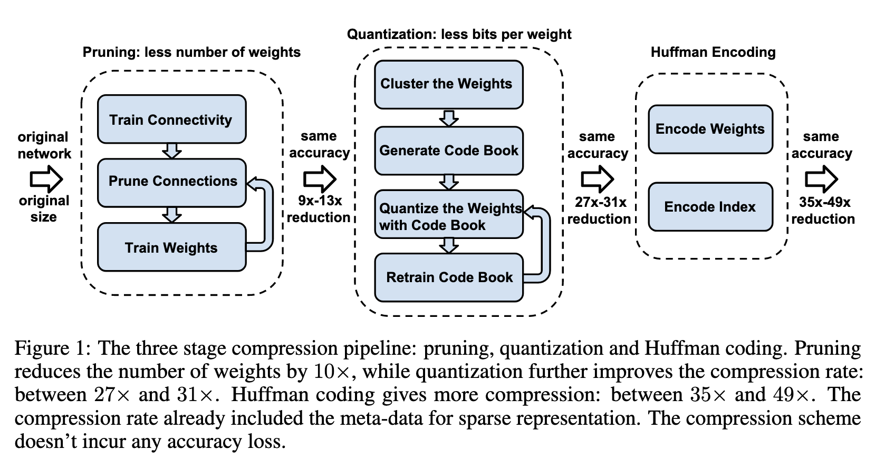

# Deep Compression: Compressing Deep Neural Networks with Pruning, Trained Quantization and Huffman Coding

> Neural networks are both computationally intensive and memory intensive, making them difficult to deploy on embedded systems with limited hardware resources. To address this limitation, we introduce "deep compression", a three stage pipeline: pruning, trained quantization and Huffman coding, that work together to reduce the storage requirement of neural networks by 35x to 49x without affecting their accuracy. 
>
> - Our method first prunes the network by learning only the important connections. 
> - Next, we quantize the weights to enforce weight sharing, 
> - finally, we apply Huffman coding. 
>
> After the first two steps we retrain the network to fine tune the remaining connections and the quantized centroids. Pruning, reduces the number of connections by 9x to 13x; Quantization then reduces the number of bits that represent each connection from 32 to 5. On the ImageNet dataset, our method reduced the storage required by AlexNet by 35x, from 240MB to 6.9MB, without loss of accuracy. Our method reduced the size of VGG-16 by 49x from 552MB to 11.3MB, again with no loss of accuracy. This allows fitting the model into on-chip SRAM cache rather than off-chip DRAM memory. Our compression method also facilitates the use of complex neural networks in mobile applications where application size and download bandwidth are constrained. Benchmarked on CPU, GPU and mobile GPU, compressed network has 3x to 4x layerwise speedup and 3x to 7x better energy efficiency.

## INTRODUCTION

Deep neural networks have evolved to the state-of-the-art technique for computer vision tasks (Krizhevsky et al., 2012) (Simonyan & Zisserman, 2014). Though these neural networks are very powerful, the large number of weights consumes considerable storage and memory bandwidth. For example, the AlexNet Caffemodel is over 200MB, and the VGG-16 Caffemodel is over 500MB (BVLC). This makes it difficult to deploy deep neural networks on mobile systems.

First, for many mobile-first companies such as Baidu and Facebook, various apps are updated via different app stores, and they are very sensitive to the size of the binary files. For example, App Store has the restriction "apps above 100 MB will not download until you connect to Wi-Fi". As a result, a feature that increases the binary size by 100MB will receive much more scrutiny than one that increases it by 10MB. Although having deep neural networks running on mobile has many great features such as better privacy, less network bandwidth and real-time processing, the large storage overhead prevents deep neural networks from being incorporated into mobile apps.

The second issue is energy consumption. Running large neural networks requires a lot of memory bandwidth to fetch the weights and a lot of computation to do dot products—which in turn consumes considerable energy. Mobile devices are battery constrained, making power-hungry applications such as deep neural networks hard to deploy.

Energy consumption is dominated by memory access. Under 45nm CMOS technology, a 32-bit floating point add consumes 0.9pJ, a 32-bit SRAM cache access takes 5pJ, while a 32-bit DRAM memory access takes 640pJ, which is 3 orders of magnitude of an add operation. Large networks do not fit in on-chip storage and hence require the more costly DRAM accesses. Running a 1 billion connection neural network, for example, at 20fps would require $(20\,\text{Hz})(1\,\text{G})(640\,\text{pJ}) = 12.8\,\text{W}$ just for DRAM access—well beyond the power envelope of a typical mobile device.

Our goal is to reduce the storage and energy required to run inference on such large networks so they can be deployed on mobile devices. To achieve this goal, we present "deep compression": a three-stage pipeline (Figure 1) to reduce the storage required by neural networks in a manner that preserves the original accuracy. First, we prune the network by removing the redundant connections, keeping only the most informative connections. Next, the weights are quantized so that multiple connections share the same weight, thus only the codebook (effective weights) and the indices need to be stored. Finally, we apply Huffman coding to take advantage of the biased distribution of effective weights.

Our main insight is that pruning and trained quantization are able to compress the network without interfering with each other, thus leading to surprisingly high compression rates. It makes the required storage so small (a few megabytes) that all weights can be cached on chip instead of going to off-chip DRAM which is energy consuming. Based on "deep compression", the EIE hardware accelerator Han et al. (2016) was later proposed that works on the compressed model, achieving significant speedup and energy efficiency improvement.

## NETWORK PRUNING

Network pruning has been widely studied to compress CNN models. In early work, network pruning proved to be a valid way to reduce the network complexity and over-fitting (LeCun et al., 1989; Hanson & Pratt, 1989; Hassibi et al., 1993; Strom, 1997). Recently Han et al. (2015) pruned state-of-the-art CNN models with no loss of accuracy. We build on top of that approach. As shown on the left side of Figure 1, we start by learning the connectivity via normal network training. Next, we prune the small-weight connections: all connections with weights below a threshold are removed from the network. Finally, we retrain the network to learn the final weights for the remaining sparse connections. Pruning reduced the number of parameters by 9x and 13x for AlexNet and VGG-16 model.

We store the sparse structure that results from pruning using compressed sparse row (CSR) or compressed sparse column (CSC) format, which requires $2a + n + 1$ numbers, where $a$ is the number of non-zero elements and $n$ is the number of rows or columns.

To compress further, we store the index difference instead of the absolute position, and encode this difference in 8 bits for conv layer and 5 bits for fc layer. When we need an index difference larger than the bound, we use the zero padding solution shown in Figure 2: in case when the difference exceeds 8, the largest 3-bit (as an example) unsigned number, we add a filler zero.

## 3 TRAINED QUANTIZATION AND WEIGHT SHARING

Network quantization and weight sharing further compresses the pruned network by reducing the number of bits required to represent each weight. We limit the number of effective weights we need to store by having multiple connections share the same weight, and then fine-tune those shared weights.

Weight sharing is illustrated in Figure 3. Suppose we have a layer that has 4 input neurons and 4 output neurons, the weight is a $4 \times 4$ matrix. On the top left is the $4 \times 4$ weight matrix, and on the bottom left is the $4 \times 4$ gradient matrix. The weights are quantized to 4 bins (denoted with 4 colors), all the weights in the same bin share the same value, thus for each weight, we then need to store only a small index into a table of shared weights. During update, all the gradients are grouped by the color and summed together, multiplied by the learning rate and subtracted from the shared centroids from last iteration. For pruned AlexNet, we are able to quantize to 8-bits (256 shared weights) for each CONV layer, and 5-bits (32 shared weights) for each FC layer without any loss of accuracy.

To calculate the compression rate, given $k$ clusters, we only need $\log_2(k)$ bits to encode the index. In general, for a network with $n$ connections and each connection is represented with $b$ bits, constraining the connections to have only $k$ shared weights will result in a compression rate of:

$$
r = \frac{n b}{n \log_2(k) + k b} \tag{1}
$$
For example, Figure 3 shows the weights of a single layer neural network with four input units and four output units. There are $4 \times 4 = 16$ weights originally but there are only $4$ shared weights: similar weights are grouped together to share the same value. Originally we need to store 16 weights each has 32 bits, now we need to store only 4 effective weights (blue, green, red and orange), each has 32 bits, together with 16 2-bit indices giving a compression rate of $16 \times 32 / (4 \times 32 + 2 \times 16) = 3.2$.

### WEIGHT SHARING

We use k-means clustering to identify the shared weights for each layer of a trained network, so that all the weights that fall into the same cluster will share the same weight. Weights are not shared across layers. We partition $n$ original weights $W = \{w_1, w_2, \ldots, w_n\}$ into $k$ clusters $C = \{c_1, c_2, \ldots, c_k\}$, $n \gg k$, so as to minimize the within-cluster sum of squares (WCSS):

$$
\underset{C}{\arg\min} \sum_{i=1}^k \sum_{w \in c_i} |w - c_i|^2 \tag{2}
$$
Different from HashNet (Chen et al., 2015) where weight sharing is determined by a hash function before the network sees any training data, our method determines weight sharing after a network is fully trained, so that the shared weights approximate the original network.

### INITIALIZATION OF SHARED WEIGHTS

Centroid initialization impacts the quality of clustering and thus affects the network's prediction accuracy. We examine three initialization methods: Forgy (random), density-based, and linear initialization. In Figure 4 we plotted the original weights' distribution of conv3 layer in AlexNet (CDF in blue, PDF in red). The weights form a bimodal distribution after network pruning. On the bottom it plots the effective weights (centroids) with 3 different initialization methods (shown in blue, red and yellow). In this example, there are 13 clusters.

Forgy (random) initialization randomly chooses $k$ observations from the data set and uses these as the initial centroids. The initialized centroids are shown in yellow. Since there are two peaks in the bimodal distribution, Forgy method tends to concentrate around those two peaks.

Density-based initialization linearly spaces the CDF of the weights in the y-axis, then finds the horizontal intersection with the CDF, and finally finds the vertical intersection on the x-axis, which becomes a centroid, as shown in blue dots. This method makes the centroids denser around the two peaks, but more scattered than the Forgy method.

Linear initialization linearly spaces the centroids between the [min, max] of the original weights. This initialization method is invariant to the distribution of the weights and is the most scattered compared with the former two methods.

Larger weights play a more important role than smaller weights (Han et al., 2015), but there are fewer of these large weights. Thus for both Forgy initialization and density-based initialization, very few centroids have large absolute value which results in poor representation of these few large weights. Linear initialization does not suffer from this problem. The experiment section compares the accuracy of different initialization methods after clustering and fine-tuning, showing that linear initialization works best.

### FEED-FORWARD AND BACK-PROPAGATION

The centroids of the one-dimensional k-means clustering are the shared weights. There is one level of indirection during feed-forward phase and back-propagation phase looking up the weight table. An index into the shared weight table is stored for each connection. During back-propagation, the gradient for each shared weight is calculated and used to update the shared weight. This procedure is shown in Figure 3.

We denote the loss by $\mathcal{L}$, the weight in the $i$-th column and $j$-th row by $W_{ij}$, the centroid index of element $W_{i,j}$ by $I_{ij}$, the $k$-th centroid of the layer by $C_k$. By using the indicator function $1(\cdot)$, the gradient of the centroids is calculated as:

$$
\frac{\partial \mathcal{L}}{\partial C_k} = \sum_{i,j} \frac{\partial \mathcal{L}}{\partial W_{ij}} \frac{\partial W_{ij}}{\partial C_k} = \sum_{i,j} \frac{\partial \mathcal{L}}{\partial W_{ij}} 1(I_{ij} = k)\tag{3}
$$
