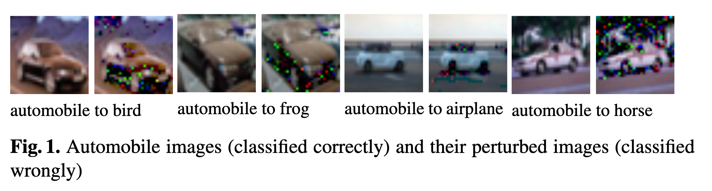

# Safety Verification of Deep Neural Networks

Xiaowei Huang, Marta Kwiatkowska, Sen Wang and Min Wu

Deep neural networks have achieved impressive experimental results in image classification, but can surprisingly be unstable with respect to adversarial perturbations, that is, minimal changes to the input image that cause the network to misclassify it. With potential applications including perception modules and end-to-end controllers for self-driving cars, this raises concerns about their safety. 

We develop a novel automated verification framework for feed-forward multi-layer neural networks based on Satisfiability Modulo Theory (SMT). We focus on safety of image classification decisions with respect to image manipulations, such as **scratches** or **changes to camera angle** or **lighting conditions** that would result in the same class being assigned by a human, and define safety for an individual decision in terms of invariance of the classification within a small neighbourhood of the original image. We enable exhaustive search of the region by employing discretisation, and propagate the analysis layer by layer. Our method works directly with the network code and, in contrast to existing methods, can guarantee that adversarial examples, if they exist, are found for the given region and family of manipulations. If found, adversarial examples can be shown to human testers and/or used to fine-tune the network. 

We implement the techniques using Z3 and evaluate them on state-of-the-art networks, including regularised and deep learning networks. We also compare against existing techniques to search for adversarial examples and estimate network robustness.

## Introduction

Deep neural networks have achieved impressive experimental results in image classification, matching the cognitive ability of humans[23] in complex tasks with thousands of classes. Many applications are envisaged, including their use as perception modules and end-to-end controllers for self-driving cars[15]. Let $\mathbb{R}^{n}$ be a vector space of images (points) that we wish to classify and assume that $f: \mathbb{R}^{n}\rightarrow C$, where $C$ is a (finite) set of class labels, models the human perception capability, then a neural network classifier is a function $\hat{f}(x)$ which approximates $f(x)$ from $M$ training examples $\{(x^{i},c^{i})\}_{i=1,\ldots,M}$. For example, a perception module of a self-driving car may input an image from a camera and must correctly classify the type of object in its view, irrespective of aspects such as the angle of its vision and image imperfections. Therefore, though they clearly include imperfections, all four pairs of images in Figure 1 should arguably be classified as automobiles, since they appear so to a human eye.

Classifiers employed in vision tasks are typically **multi-layer networks**, which propagate the input image through a series of linear and non-linear operators. They are high-dimensional, often with millions of dimensions, non-linear and potentially discontinuous: even a small network, such as that trained to classify hand-written images of digits 0-9, has over 60,000 real-valued parameters and 21,632 neurons (dimensions) in its first layer. At the same time, the networks are trained on a finite data set and expected to generalise to previously unseen images. To increase the probability of correctly classifying such an image, regularisation techniques such as dropout are typically used, which improves the smoothness of the classifiers, in the sense that images that are close (within $\epsilon$ distance) to a training point are assigned the same class label.

Unfortunately, it has been observed in[13,36] that deep neural networks, including highly trained and smooth networks optimised for vision tasks, are unstable with respect to so called adversarial perturbations. Such adversarial perturbations are (minimal) changes to the input image, often imperceptible to the human eye, that cause the network to misclassify the image. Examples include not only artificially generated random perturbations, but also (more worryingly) modifications of camera images [22] that correspond to resizing, cropping or change in lighting conditions. They can be devised without access to the training set [29] and are transferable [19], in the sense that an example misclassified by one network is also misclassified by a network with a different architecture, even if it is trained on different data. Figure 1 gives adversarial perturbations of automobile images that are misclassified as a bird, frog, airplane or horse by a highly trained state-of-the-art network. This obviously raises potential safety concerns for applications such as autonomous driving and calls for automated verification techniques that can verify the correctness of their decisions.

Safety of AI systems is receiving increasing attention, to mention[33,10], in view of their potential to cause harm in safety-critical situations such as autonomous driving.Typically, decision making in such systems is either solely based on machine learning,through end-to-end controllers, or involves some combination of logic-based reasoning and machine learning components, where an image classifier produces a classification,say speed limit or a stop sign, that serves as input to a controller. A recent trend towards "explainable AI" has led to approaches that learn not only how to assign the classification labels, but also additional explanations of the model, which can take the form of a justification explanation(why this decision has been reached, for example identifying the features that supported the decision) [17,31]. In all these cases, the safety of a decision can be reduced to ensuring the correct behaviour of a machine learning component. However, safety assurance and verification methodologies for machine learning are little studied.

The main difficulty with image classification tasks, which play a critical role in perception modules of autonomous driving controllers, is that they do not have a formal specification in the usual sense: ideally, the performance of a classifier should match the perception ability and class labels assigned by a human. Traditionally, the correctness of a neural network classifier is expressed in terms of **risk** [37], defined as the probability of misclassification of a given image, weighted with respect to the input distribution $\mu$ of images. Similar(statistical) robustness properties of deep neural network classifiers, which compute the average minimum distance to a misclassification and are independent of the data point, have been studied and can be estimated using tools such as DeepFool[25] and cleverhans[27]. However, we are interested in the safety of an individual decision, and to this end focus on the key property of the classifier being invariant to perturbations at a given point. This notion is also known as pointwise robustness[18,12] or local adversarial robustness [21].

Contributions. In this paper we propose a general framework for automated verification of safety of classification decisions made by feed-forward deep neural networks. Although we work concretely with image classifiers, the techniques can be generalised to other settings. For a given image x (a point in a vector space), we assume that there is a (possibly infinite) region η around that point that incontrovertibly supports the decision, in the sense that all points in this region must have the same class. This region is specified by the user and can be given as a small diameter, or the set of all points whose salient features are of the same type. We next assume that there is a family of operations A, which we call manipulations, that specify modifications to the image under which the classification decision should remain invariant in the region η. Such manipulations can represent, for example, camera imprecisions, change of camera angle, or replacement of a feature. We define a network decision to be safe for input x and region η with respect to the set of manipulations A if applying the manipulations on x will not result in a class change for η. We employ discretisation to enable a finite exhaustive search of the high-dimensional region η for adversarial misclassifications. The discretisation approach is justified in the case of image classifiers since they are typically represented as vectors of discrete pixels (vectors of 8 bit RGB colours). To achieve scalability, we propagate the analysis layer by layer, mapping the region and manipulations to the deeper layers. We show that this propagation is sound, and is complete under the additional assumption of minimality of manipulations, which holds in discretised settings. In contrast to existing approaches [36,28], our framework can guarantee that a misclassification is found if it exists. Since we reduce verification to a search for adversarial examples, we can achieve safety verification (if no misclassifications are found for all layers) or falsification (in which case the adversarial examples can be used to fine-tune the network or shown to a human tester).

We implement the techniques using Z3 [8] in a tool called DLV (Deep Learning Verification) [2] and evaluate them on state-of-the-art networks, including regularised and deep learning networks. This includes image classification networks trained for classifying hand-written images of digits 0-9 (MNIST), 10 classes of small colour images (CIFAR10), 43 classes of the German Traffic Sign Recognition Benchmark (GTSRB) [35] and 1000 classes of colour images used for the well-known imageNet large-scale visual recognition challenge (ILSVRC) [4]. We also perform a comparison of the DLV falsification functionality on the MNIST dataset against the methods of [36] and [28], focusing on the search strategies and statistical robustness estimation. The perturbed images in Figure 1 are found automatically using our tool for the network trained on the CIFAR10 dataset.

This invited paper is an extended and improved version of [20], where an extended version including appendices can also be found.

## Background on Neural Networks

We consider feed-forward multi-layer neural networks [14], henceforth abbreviated as neural networks. Perceptrons (neurons) in a neural network are arranged in disjoint layers, with each perceptron in one layer connected to the next layer, but no connection between perceptrons in the same layer. Each layer $L_k$ of a network is associated with an $n_k$-dimensional vector space $D_{L_k} \subseteq R^{n_k}$, in which each dimension corresponds to a perceptron. We write $P_k$ for the set of perceptrons in layer $L_k$ and $n_k = |P_k|$ is the number of perceptrons (dimensions) in layer $L_k$.

Formally, a (feed-forward and deep) neural network N is a tuple $(L, T, \Phi)$, where:
- $L = \{L_k | k \in \{0, \ldots, n\}\}$ is a set of layers such that layer $L_0$ is the input layer and $L_n$ is the output layer
- $T \subseteq L \times L$ is a set of sequential connections between layers such that, except for the input and output layers, each layer has an incoming connection and an outgoing connection
- $\Phi = \{\phi_k | k \in \{1, \ldots, n\}\}$ is a set of activation functions $\phi_k: D_{L_{k-1}} \rightarrow D_{L_k}$, one for each non-input layer

The network is fed an input $x$ (point in $D_{L_0}$) through its input layer, which is then propagated through the layers by successive application of the activation functions. An activation for point x in layer k is the value of the corresponding function, denoted $\alpha_{x,k} = \phi_k(\phi_{k-1}(\ldots \phi_1(x))) \in D_{L_k}$, where $\alpha_{x,0} = x$. For perceptron $p \in P_k$ we write $\alpha_{x,k}(p)$ for the value of its activation on input x. For every activation $\alpha_{x,k}$ and layer $k' < k$, we define $\text{Pre}_{k'}(\alpha_{x,k}) = \{\alpha_{y,k'} \in D_{L_{k'}} | \alpha_{y,k} = \alpha_{x,k}\}$ to be the set of activations in layer $k'$ whose corresponding activation in layer $L_k$ is $\alpha_{x,k}$. The classification decision is made based on the activations in the output layer by, e.g., assigning to x the class $\text{argmax}_{p \in P_n} \alpha_{x,n}(p)$. For simplicity, we use $\alpha_{x,n}$ to denote the class assigned to input x, and thus $\alpha_{x,n} = \alpha_{y,n}$ expresses that two inputs x and y have the same class.

The neural network classifier N represents a function $\hat{f}(x)$ which approximates $f(x): D_{L_0} \rightarrow C$, a function that models the human perception capability in labelling images with labels from C, from M training examples $\{(x^i, c^i)\}_{i=1,\ldots,M}$. Image classification networks, for example convolutional networks, may contain many layers, which can be non-linear, and work in high dimensions, which for the image classification problems can be of the order of millions. Digital images are represented as 3D tensors of pixels (width, height and depth, the latter to represent color), where each pixel is a discrete value in the range 0..255. The training process determines real values for weights used as filters that are convolved with the activation functions. Since it is difficult to approximate f with few samples in the sparsely populated high-dimensional space, to increase the probability of classifying correctly a previously unseen image, various regularization techniques such as dropout are employed. They improve the smoothness of the classifier, in the sense that points that are ε-close to a training point (potentially infinitely many of them) classify the same.

In this paper, we work with the code of the network and its trained weights.

## Safety Analysis of Classification Decisions

In this section we define our notion of safety of classification decisions for a neural network, based on the concept of a manipulation of an image, essentially perturbations that a human observer would classify the same as the original image. Safety is defined for an individual classification decision and is parameterised by the class of manipulations and a neighbouring region around a given image. To ensure finiteness of the search of the region for adversarial misclassifications, we introduce so called "ladders", non-deterministically branching and iterated application of successive manipulations, and state the conditions under which the search is exhaustive.

### Safety and Robustness

Our method assumes the existence of a (possibly infinite) region η around a data point (image) x such that all points in the region are indistinguishable by a human, and therefore have the same true class. This region is understood as supporting the classification decision and can usually be inferred from the type of the classification problem. For simplicity, we identify such a region via its diameter d with respect to some user-specified norm, which intuitively measures the closeness to the point x. 

As defined in [18], a network f approximating human capability f is said to be not robust at x if there exists a point y in the region η = {z ∈ D_{L_0} | ||z - x|| ≤ d} of the input layer such that f(x) ≠ f(y). The point y, at a minimal distance from x, is known as an adversarial example. 

Our definition of safety for a classification decision (abbreviated safety at a point) follows the same intuition, except that we work layer by layer, and therefore will identify such a region η_k, a subspace of D_{L_k}, at each layer L_k, for k ∈ {0,...,n}, and successively refine the regions through the deeper layers. We justify this choice based on the observation [11,23,24] that deep neural networks are thought to compute progressively more powerful invariants as the depth increases. In other words, they gradually transform images into a representation in which the classes are separable by a linear classifier.

**Assumption 1** For each activation α_{x,k} of point x in layer L_k, the region η_k(α_{x,k}) contains activations that the human observer believes to be so close to α_{x,k} that they should be classified the same as x.

**Definition 1 (General Safety)** Let η_k(α_{x,k}) be a region in layer L_k of a neural network N such that α_{x,k} ∈ η_k(α_{x,k}). We say that N is safe for input x and region η_k(α_{x,k}), written as N,η_k ⊨ x, if for all activations α_{y,k} in η_k(α_{x,k}) we have α_{y,n} = α_{x,n}.

### Manipulations

A key concept of our framework is the notion of a manipulation, an operator that intuitively models image perturbations, for example bad angles, scratches or weather conditions, the idea being that the classification decisions in a region of images close to it should be invariant under such manipulations. The choice of the type of manipulation is dependent on the application and user-defined, reflecting knowledge of the classification problem to model perturbations that should or should not be allowed. Judicious choice of families of such manipulations and appropriate distance metrics is particularly important. 

For simplicity, we work with operators $δ_k: D_{L_k} → D_{L_k}$ over the activations in the vector space of layer $k$, and consider the Euclidean (L2) and Manhattan (L1) norms to measure the distance between an image and its perturbation through $δ_k$, but the techniques generalize to other norms discussed in [18,19,12]. More specifically, applying a manipulation $δ_k(α_{x,k})$ to an activation $α_{x,k}$ will result in another activation such that the values of some or all dimensions are changed. 

We therefore represent a manipulation as a hyper-rectangle, defined for two activations α_{x,k} and α_{y,k} of layer L_k by:
rec(α_{x,k}, α_{y,k}) = ×_{p∈P_k} [min(α_{x,k}(p), α_{y,k}(p)), max(α_{x,k}(p), α_{y,k}(p))]

The main challenge for verification is the fact that the region η_k contains potentially an uncountable number of activations. Our approach relies on discretization in order to enable a finite exploration of the region to discover and/or rule out adversarial perturbations.

For an activation α_{x,k} and a set Δ of manipulations, we denote by rec(Δ, α_{x,k}) the polyhedron which includes all hyper-rectangles that result from applying some manipulation in Δ on α_{x,k}, i.e., rec(Δ, α_{x,k}) = ∪_{δ∈Δ} rec(α_{x,k}, δ(α_{x,k})). Let Δ_k be the set of all possible manipulations for layer L_k. To ensure region coverage, we define valid manipulation as follows.

**Definition 2** Given an activation α_{x,k}, a set of manipulations V(α_{x,k}) ⊆ Δ_k is valid if α_{x,k} is an interior point of rec(V(α_{x,k}), α_{x,k}), i.e., α_{x,k} is in rec(V(α_{x,k}), α_{x,k}) and does not belong to the boundary of rec(V(α_{x,k}), α_{x,k}).

[Figure 2 presents an example of valid manipulations in two-dimensional space]

Since we work with discretized spaces, which is a reasonable assumption for images, we introduce the notion of a minimal manipulation. If applying a minimal manipulation, it suffices to check for misclassification just at the end points, that is, α_{x,k} and δ_k(α_{x,k}). This allows an exhaustive, albeit impractical, exploration of the region in unit steps.

A manipulation δ_k^1(α_{y,k}) is finer than δ_k^2(α_{x,k}), written as δ_k^1(α_{y,k}) ≤ δ_k^2(α_{x,k}), if any activation in the hyper-rectangle of the former is also in the hyper-rectangle of the latter. It is implied in this definition that α_{y,k} is an activation in the hyper-rectangle of δ_k^2(α_{x,k}). Moreover, we write δ_{k,k'}(α_{x,k}) for ϕ_{k'}(...ϕ_{k+1}(δ_k(α_{x,k}))), representing the corresponding activation in layer k' ≥ k after applying manipulation δ_k on the activation α_{x,k}, where δ_{k,k}(α_{x,k}) = δ_k(α_{x,k}).

**Definition 3** A manipulation δ_k on an activation α_{x,k} is minimal if there does not exist manipulations δ_k^1 and δ_k^2 and an activation α_{y,k} such that:

1. δ_k^1(α_{x,k}) ≤ δ_k(α_{x,k})
2. α_{y,k} = δ_k^1(α_{x,k})
3. δ_k(α_{x,k}) = δ_k^2(α_{y,k}) 
4. α_{y,n} ≠ α_{x,n} and α_{y,n} ≠ δ_{k,n}(α_{x,k})

[Additional content about bounded variation and safety wrt manipulations continues...]

## The Verification Framework

### Layer-by-Layer Analysis

### The Verification Method

### Feature Decomposition and Discovery

### Selection of Regions and Manipulations

### Selection of Regions and Manipulations

## Experimental Results

## Comparison

## Related Work

AI safety is recognised as an important problem, see e.g., [33,10]. An early verification approach for neural networks was proposed in [30], where, using the notation of this paper, safety is defined as the existence, for all inputs in a region $\eta_{0} \in D_{L_{0}}$, of a corresponding output in another region $\eta_{n} \subseteq D_{L_{n}}$. They encode the entire network as a set of constraints, approximating the sigmoid using constraints, which can then be solved by a SAT solver, but their approach only works with 6 neurons (3 hidden neurons). A similar idea is presented in [32]. In contrast, we work layer by layer and obtain much greater scalability. Since the first version of this paper appeared [20], another constraint-based method has been proposed in [21] which improves on [30]. While they consider more general correctness properties than this paper, they can only handle the ReLU activation functions, by extending the Simplex method to work with the piecewise linear ReLU functions that cannot be expressed using linear programming. This necessitates a search tree (instead of a search path as in Simplex), for which a heuristic search is proposed and shown to be complete. The approach is demonstrated on networks with 300 ReLU nodes, but as it encodes the full network it is unclear whether it can be scaled to work with practical deep neural networks: for example, the MNIST network has 630,016 ReLU nodes. They also handle continuous spaces directly without discretisation, the benefits of which are not yet clear, since it is argued in [19] that linear behaviour in high-dimensional spaces is sufficient to cause adversarial examples.

Concerns about the instability of neural networks to adversarial examples were first raised in [13,36], where optimisation is used to identify misclassifications. A method for computing the perturbations is also proposed, which is based on box-constrained optimisation and is approximate in view of non-convexity of the search space. This work is followed by [19], which introduced the much faster **FGSM method**, and [22], which employed a compromise between the two (iterative, but with a smaller number of iterations than [36]). In our notation, [19] uses a deterministic, iterative manipulation $\delta(x) = x + \epsilon \cdot \text{sign}(\nabla_{x} J(x, \alpha_{x, n}))$, where $x$ is an image in matrix representation, $\epsilon$ is a hyper-parameter that can be tuned to get different manipulated images, and $J(x, \alpha_{x, n})$ is the cross-entropy cost function of the neural network on input $x$ and class $\alpha_{x, n}$. Therefore, their approach will test a set of discrete points in the region $\eta_{0}(\alpha_{x, 0})$ of the input layer. Therefore these manipulations will test a lasso-type ladder tree (i.e., a ladder tree without branches) $\mathcal{L}(\eta_{k}(\alpha_{x, k}))$, which does not satisfy the covering property. In [26], instead of working with a single image, an evolutionary algorithm is employed for a population of images. For each individual image in the current population, the manipulation is the mutation and/or crossover. While mutations can be nondeterministic, the manipulations of an individual image are also following a lasso-type ladder tree which is not covering. We also mention that [38] uses several distortions such as JPEG compression, thumbnail resizing, random cropping, etc, to test the robustness of the trained network. These distortions can be understood as manipulations. All these attacks do not leverage any specific properties of the model family, and do not guarantee that they will find a misclassified image in the constraint region, even if such an image exists.

- The notion of robustness studied in [18] has some similarities to our definition of safety, except that the authors work with values averaged over the input distribution $\mu$, which is difficult to estimate accurately in high dimensions. 
- As in [36,22], they use optimisation without convergence guarantees, as a result computing only an approximation to the minimal perturbation. 
- In [12] **pointwise robustness** is adopted, which corresponds to our general safety; they also use a constraint solver but represent the full constraint system by reduction to a convex LP problem, and only verify an approximation of the property. 
- In contrast, we work directly with activations rather than an encoding of activation functions, and our method exhaustively searches through the complete ladder tree for an adversarial example by iterative and nondeterministic application of manipulations. 
- Further, our definition of a manipulation is more flexible, since it allows us to select a subset of dimensions, and each such subset can have a different region diameter computed with respect to a different norm.

## Reference

1. CIFAR10 model for Keras. https://github.com/fchollet/keras/blob/master/examples/cifar10_cnn.py.
2. DLV. https://github.com/verideep/dlv.
3. Keras. https://keras.io.
4. Large scale visual recognition challenge. http://www.image-net.org/challenges/LSVRC/.
5. MNIST CNN network. https://github.com/fchollet/keras/blob/master/examples/mnist_cnn.py.
6. Theano. http://deeplearning.net/software/theano/.
7. VGG16 model for Keras. https://gist.github.com/baraldiorenzo/07d7802847aaad0a35d3.
8. Z3. http://rise4fun.com/z3.
9. Luigi Ambrosio, Nicola Fusco, and Diego Pallara. **Functions of bounded variation and free discontinuity problems**. Oxford Mathematical Monographs. Oxford University Press, 2000.
10. Dario Amodei, Chris Olah, Jacob Steinhardt, Paul Christiano, John Schulman, Dario Amodei, Chris Olah, Jacob Steinhardt, Paul Christiano, John Schulman, and Dan Mané. **Concrete problems in AI safety**. CoRR, abs/1606.06565, 2016.
11. Fabio Anselmi, Joel Z. Leibo, Lorenzo Rosasco, Jim Mutch, Andrea Tacchetti, and Tomaso Poggio. Unsupervised learning of invariant representations. Theoretical Computer Science, 633:112-121, 2016.
12. Osbert Bastani, Yani Ioannou, Leonidas Lampropoulos, Dimitrios Vytiniotis, Aditya Nori, and Antonio Criminisi. Measuring neural net robustness with constraints. CoRR, abs/1605.07262, 2016. To appear in NIPS.
13. Battista Biggio, Igino Corona, Davide Maiorca, Blaine Nelson, Nedim Srndic, Pavel Laskov, Giorgio Giacinto, and Fabio Roli. Evasion attacks against machine learning at test time. In ECML/PKDD 2013, pages 387-402, 2013.
14. Christopher M Bishop. Neural networks for pattern recognition. Oxford university press, 1995.
15. Mariusz Bojarski, Davide Del Testa, Daniel Dworakowski, Bernhard Firner, Beat Flepp, Prasoon Goyal, Lawrence D. Jackel, Mathew Monfort, Urs Muller, Jiakai Zhang, Xin Zhang, Jake Zhao, and Karol Zieba. End to end learning for self-driving cars. arXiv:1604.07316, 2016.
16. Gunnar E. Carlsson, Tigran Ishikhanov, Vin de Silva, and Afra Zomorodian. On the local behavior of spaces of natural images. International Journal of Computer Vision, 76(1), 2008.
17. Lisa Anne Hendricks Dong Huk Park, Zeynep Akata, Bernt Schiele, Trevor Darrell, and Marcus Rohrbach. Attentive explanations: Justifying decisions and pointing to the evidence. arxiv.org/abs/1612.04757, 2016.
18. Allhussein Fawzi, Omar Fawzi, and Pascal Frossard. Analysis of classifiers' robustness to adversarial perturbations. CoRR, abs/1502.02590, 2015.
19. Ian J. Goodfellow, Jonathon Shlens, and Christian Szegedy. Explaining and harnessing adversarial examples. CoRR, abs/1412.6572, 2014.
20. Xiaowei Huang, Marta Kwiatkowska, Sen Wang, and Min Wu. Safety verification of deep neural networks. https://arxiv.org/abs/1610.06940, 2016.
21. Guy Katz, Clark Barrett, David Dill, Kyle Julian, and Mykel Kochenderfer. Reluplex: An efficient SMT solver for verifying deep neural networks. In CAV 2017, 2017. To appear.
22. Alexey Kurakin, Ian Goodfellow, and Samy Bengio. Adversarial examples in the physical world. arXiv:1607.02533, 2016.
23. Yann LeCun, Yoshua Bengio, and Geoffrey Hinton. Deep learning. Nature, 521:436-444, 2015.
24. Stephane Mallat. Understanding deep convolutional networks. Philosohical Transactions of the Royal Society A, 2016.
25. Seyed-Mohsen Moosavi-Dezfooli, Alhussein Fawzi, and Pascal Frossard. Deepfool: a simple and accurate method to fool deep neural networks. CoRR, abs/1511.04599, 2015.
26. Anh Nguyen, Jason Yosinski, and Jeff Clune. Deep neural networks are easily fooled: High confidence predictions for unrecognizable images. In Computer Vision and Pattern Recognition (CVPR'15), 2015.
27. Nicolas Papernot, Ian Goodfellow, Ryan Sheatsley, Reuben Feinman, and Patrick McDaniel. cleverhans v1.0.0: an adversarial machine learning library. arXiv preprint arXiv:1610.00768, 2016.
28. Nicolas Papernot, Patrick McDaniel, Somesh Jha, Matt Fredrikson, Z Berkay Celik, and Ananthram Swami. The limitations of deep learning in adversarial settings. In Proceedings of the 1st IEEE European Symposium on Security and Privacy, 2015.
29. Nicolas Papernot, Patrick Drew McDaniel, Ian J. Goodfellow, Somesh Jha, Z. Berkay Celik, and Ananthram Swami. Practical black-box attacks against deep learning systems using adversarial examples. CoRR, abs/1602.02697, 2016.
30. Luca Pulina and Armando Tacchella. An abstraction-refinement approach to verification of artificial neural networks. In CAV 2010, pages 243-257, 2010.
31. Marco Tulio Ribeiro, Sameer Singh, and Carlos Guestrin. "why should i trust you?": Explaining the predictions of any classifier. In ACM SIGKDD International Conference on Knowledge Discovery and Data Mining (KDD2016), 2016.
32. Karsten Scheibler, Leonore Winterer, Ralf Wimmer, and Bernd Becker. Towards verification of artificial neural networks. In 18th Workshop on Methoden und Beschreibungssprachen zur Modellierung und Verifikation von Schaltungen und Systemen"(MBMV), pages 30-40, 2015.
33. Sanjit A. Seshia and Dorsa Sadigh. Towards verified artificial intelligence. CoRR, abs/1606.08514, 2016.
34. Karen Simonyan and Andrew Zisserman. Very deep convolutional networks for large-scale image recognition. arXiv:1409.1556, 2014.
35. J. Stallkamp, M. Schlipsing, J. Salmen, and C. Igel. Man vs. computer: Benchmarking machine learning algorithms for traffic sign recognition. Neural Networks, 32:323-332, 2012.
36. Christian Szegedy, Wojciech Zaremba, Ilya Sutskever, Joan Bruna, Dumitru Erhan, Ian Goodfellow, and Rob Fergus. Intriguing properties of neural networks. In International Conference on Learning Representations (ICLR-2014), 2014.
37. Vladimir Vapnik. Principles of risk minimization for learning theory. In Advances in Neural Information Processing Systems 4, [NIPS Conference, Denver, Colorado, USA, December 2-5, 1991], pages 831-838, 1991.
38. Stephan Zheng, Yang Song, Thomas Leung, and Ian Goodfellow. Improving the robustness of deep neural networks via stability training. In CVPR 2016, 2016.