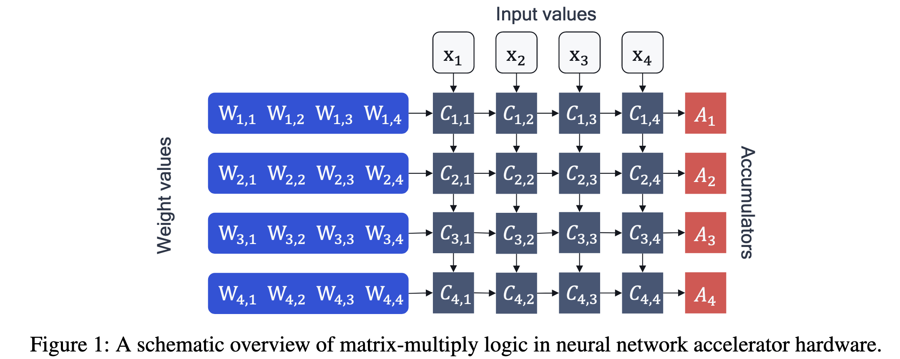
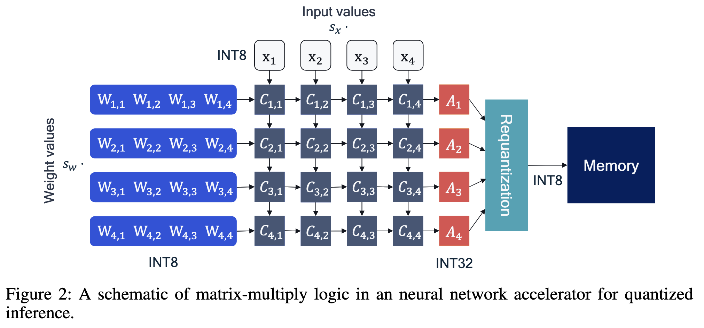
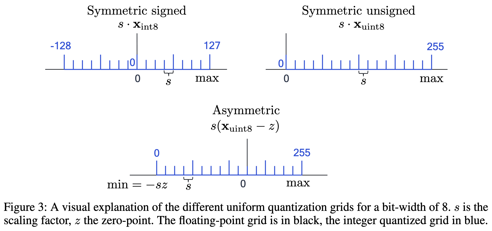
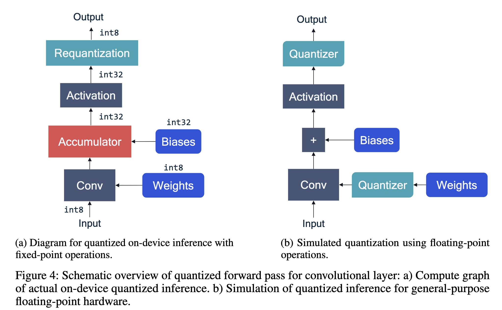
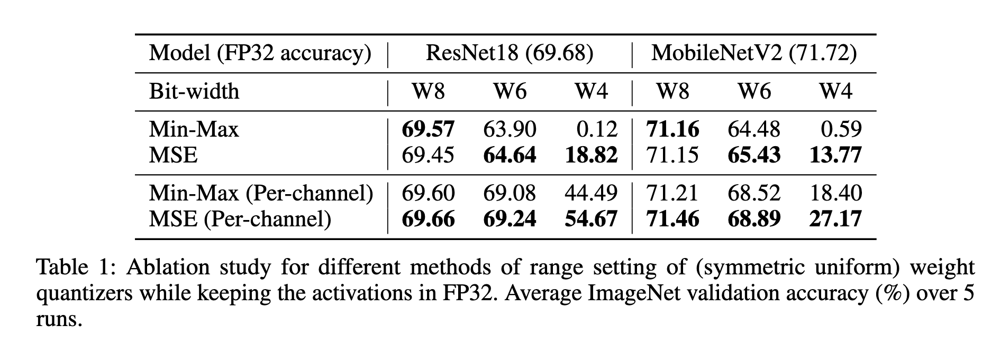
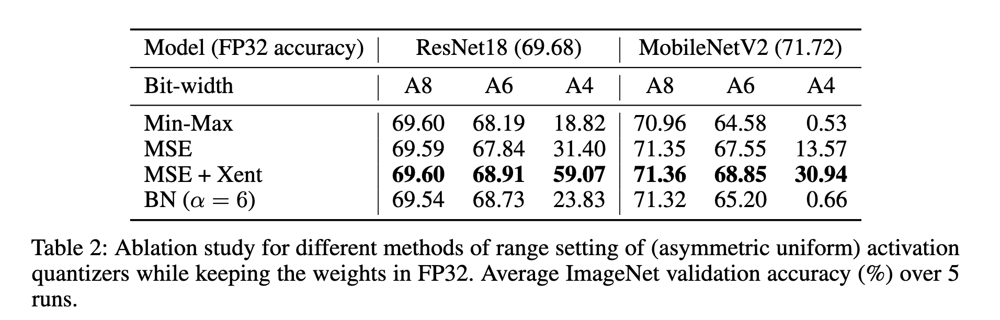

# A White Paper on Neural Network Quantization

Markus Nagel, Marios Fournarakis, Rana Ali Amjad, Yelysei Bondarenko, Mart van Baalen, Tijmen Blankevoort

While neural networks have advanced the frontiers in many applications, they often come at a high computational cost. Reducing the power and latency of neural network inference is key if we want to integrate modern networks into edge devices with strict power and compute requirements. Neural network quantization is one of the most effective ways of achieving these savings but the additional noise it induces can lead to accuracy degradation. 

In this white paper, we introduce state-of-the-art algorithms for mitigating the impact of quantization noise on the network’s performance while maintaining low-bit weights and activations. We start with a hardware motivated introduction to quantization and then consider two main classes of algorithms: Post-Training Quantization (PTQ) and Quantization-Aware-Training (QAT). 

- PTQ requires no re-training or labelled data and is thus a lightweight push-button approach to quantization. In most cases, PTQ is sufficient for achieving 8-bit quantization with close to floating-point accuracy. 
- QAT requires fine-tuning and access to labeled training data but enables lower bit quantization with competitive results. 

For both solutions, we provide tested pipelines based on existing literature and extensive experimentation that lead to state-of-the-art performance for common deep learning models and tasks.

## Introduction

With the rise in popularity of deep learning as a general-purpose tool to inject intelligence into electronic devices, the necessity for small, low-latency and energy efficient neural networks solutions has increased. Today neural networks can be found in many electronic devices and services, from smartphones, smart glasses and home appliances, to drones, robots and self-driving cars. These devices are typically subject to strict time restrictions on the execution of neural networks or stringent power requirements for long-duration performance.

One of the most impactful ways to decrease the computational time and energy consumption of neural networks is quantization. In neural network quantization, the weights and activation tensors are stored in lower bit precision than the 16 or 32-bit precision they are usually trained in. When moving from 32 to 8 bits, the memory overhead of storing tensors decreases by a factor of 4 while the computational cost for matrix multiplication reduces quadratically by a factor of 16. Neural networks have been shown to be robust to quantization, meaning they can be quantized to lower bit-widths with a relatively small impact on the network’s accuracy. Besides, neural network quantization can often be applied along with other common methods for neural network optimization, such as neural architecture search, compression and pruning. It is an essential step in the model efficiency pipeline for any practical use-case of deep learning. However, neural network quantization is not free. Low bit-width quantization introduces noise to the network that can lead to a drop in accuracy. While some networks are robust to this noise, other networks require extra work to exploit the benefits of quantization.

In this white paper, we introduce the state-of-the-art in neural network quantization. We start with an introduction to quantization and discuss hardware and practical considerations. We then consider two different regimes of quantizing neural networks: Post-Training Quantization (PTQ) and QuantizationAware Training (QAT). PTQ methods, discussed in section 3, take a trained network and quantize it with little or no data, requires minimal hyperparameter tuning and no end-to-end training. This makes them a push-button approach to quantizing neural networks with low engineering effort and computational cost. In contrast, QAT, discussed in section 4, relies on retraining the neural networks with simulated quantization in the training pipeline. While this requires more effort in training and potentially hyperparameter tuning, it generally further closes the gap to the full-precision accuracy compared to PTQ for low-bit quantization. For both regimes, we introduce standard pipelines based on existing literature and extensive experimentation that lead to state-of-the-art performance for common computer vision and natural language processing models. We also propose a debugging workflow to identify and address common issues when quantizing a new model.

## Quantization fundamentals

In this section, we introduce the basic principles of neural network quantization and of fixed-point accelerators on which quantized networks run on. We start with a hardware motivation and then introduce standard quantization schemes and their properties. Later we discuss practical considerations related to layers commonly found in modern neural networks and their implications for fixed-point accelerators.

### Hardware background

Before diving into the technical details, we first explore the hardware background of quantization and how it enables efficient inference on device. Figure 1 provides a schematic overview of how a matrix-vector multiplication, $$\mathbf y= \mathbf W \mathbf x + \mathbf b$$, is calculated in a neural network(NN) accelerator. This is the building block of larger matrix-matrix multiplications and convolutions found in neural networks. Such hardware blocks aim at improving the efficiency of NN inference by performing as many operations as possible in parallel. The key components are the **processing elements** $$C_{n, m}$$ and the **accumulators** $$A_{n}$$. Our toy example in figure 1 has 16 processing elements arranged in a square grid and 4 accumulators. The calculation starts by loading the accumulators with the bias value $$\mathbf{b}_{n}$$. We then load the weight values $$\mathbf W_{n, m}$$ and the input values $$\mathbf{x}_{m}$$ into the array and compute their product in the respective processing elements $$C_{n, m}=\mathbf{W}_{n, m} \mathbf{x}_{m}$$ in a single cycle. Their results are then added in the accumulators:
$$
A_{n}=\mathbf b_{n}+\sum_{m} C_{n, m}
$$

?> 这个图不太能看得出每个cycle做了什么，即不知道并行的粒度如何。

The above operation is also referred to as Multiply-Accumulate (MAC). This step is repeated many times for larger matrix-vector multiplications. Once all cycles are completed, the values in the accumulators are then moved back to memory to be used in the next neural network layer. 

Neural networks are commonly trained using FP32 weights and activations. If we were to perform inference in FP32, the processing elements and the accumulator would have to support floating-point logic, and we would need to transfer the 32-bit data from memory to the processing units. MAC operations and data transfer consume the bulk of the energy spent during neural network inference. Hence, significant benefits can be achieved by using a lower bit fixed-point or quantized representation for these quantities. 

Low-bit fixed-point representations, such as INT8, not only reduce the amount of data transfer but also the size and energy consumption of the MAC operation (Horowitz, 2014). This is because the cost of digital arithmetic typically scales linearly to quadratically with the number of bits used and because fixed-point addition is more efficient than its floating-point counterpart (Horowitz, 2014).

To move from floating-point to the efficient fixed-point operations, we need a scheme for converting floating-point vectors to integers. A floating-point vector $\mathbf{x}$ can be expressed approximately as a scalar multiplied by a vector of integer values:
$$
\widehat{\mathbf x}=s_{\mathbf x}\cdot \mathbf x_{\text{int}}\approx \mathbf x
$$
where $$s_{\mathbf x}$$ is a floating-point scale factor and $$\mathbf x_{\text{int}}$$ is an integer vector, e.g., INT8. We denote this quantized version of the vector as $$\widehat{\mathbf x}$$. By quantizing the weights and activations we can write the quantized version of the accumulation equation:
$$
\begin{align*}
\hat{A}_{n}&=\widehat{\mathbf b}_{n}+\sum_{m}\widehat{\mathbf W}_{n, m}\widehat{\mathbf x}_{m}\\
&=\widehat{\mathbf b}_{n}+\sum_{m}\left(s_{\mathbf w} \mathbf W_{n, m}^{\text{int}}\right)\left(s_{\mathbf x} \mathbf x_{m}^{\text{int}}\right)\\
&=\widehat{\mathbf b}_{n}+s_{\mathbf w} s_{\mathbf x}\sum_{m} \mathbf W_{n, m}^{\text{int}} \mathbf x_{m}^{\text{int}}  \tag{3}
\end{align*}
$$
Note that we used a separate scale factor for weights, $$s_{\mathbf w}$$, and activations, $$s_{\mathbf x}$$. This provides flexibility and reduces the quantization error (more in section 2.2). Since each scale factor is applied to the whole tensor, this scheme allows us to factor the scale factors out of the summation in equation (3) and perform MAC operations in fixed-point format. We intentionally ignore bias quantization for now, because **the bias is normally stored in higher bit-width (32-bits)** and **its scale factor depends on that of the weights and activations** (Jacob et al., 2018).

Figure 2 shows how the neural network accelerator changes when we introduce quantization. In our example, we use INT8 arithmetic, but this could be any quantization format for the sake of this discussion. It is important to maintain a higher bit-width for the accumulators, typical 32-bits wide. Otherwise, we risk incurring loss due to overflow as more products are accumulated during the computation.

The activations stored in the 32-bit accumulators need to be written to memory before they can be used by the next layer. To reduce data transfer and the complexity of the next layer's operations, these activations are quantized back to INT8. This requires a requantization step which is shown in figure 2.

### Uniform affine quantization

In this section we define the quantization scheme that we will use in this paper. This scheme is called **uniform quantization** and it is the most commonly used quantization scheme because it permits efficient implementation of fixed-point arithmetic.

Uniform affine quantization, also known as asymmetric quantization, is defined by three quantization parameters: the scale factor $s$, the zero-point $z$ and the bit-width $b$. 

- The scale factor and the zero-point are used to to map a floating point value to the integer grid, whose size depends on the bit-width. 
- The scale factor is commonly represented as a floating-point number and specifies the step-size of the quantizer. 
- The zero-point is an integer that ensures that real zero is quantized without error. This is important to ensure that common operations like zero padding or ReLU do not induce quantization error.

Once the three quantization parameters are defined we can proceed with the quantization operation. Starting from a real-valued vector $\mathbf x$ we first map it to the unsigned integer grid $$\left\{0,\ldots, 2^{b}-1\right\}$$:
$$
\mathbf x_{\text{int}}=\mathrm{clamp}\left(\left\lfloor\frac{\mathbf x}{s}\right\rceil+z;0,2^{b}-1\right)
$$
?> 这里仅列出unsigned的情况，等到后面才列出signed的情况

where $$\lfloor\cdot\rceil$$ is the round-to-nearest operator and clamping is defined as:
$$
\mathrm{clamp}\left(x; a, c\right)=\begin{cases}
a,&x<a,\\
x,&a\leq x\leq c,\\
c,&x>c.
\end{cases}
$$
To approximate the real-valued input x we perform a de-quantization step:
$$
\mathbf  x\approx\widehat{\mathbf x}=s\left(\mathbf x_{\text{int}}-z\right)
$$
Combining the two steps above we can provide a general definition for the quantization function, $$q(\cdot)$$, as:
$$
\widehat{\mathbf x}=q(\mathbf x; s, z, b)=s\left[\mathrm{clamp}\left(\left\lfloor\frac{\mathbf x}{s}\right\rceil+z; 0,2^{b}-1\right)-z\right] \tag{7}
$$
Through the de-quantization step, we can also define the quantization grid limits $$\left(q_{\min}, q_{\max}\right)$$ where $$q_{\min}=-s z$$ and $$q_{\max}=s\left(2^b-1-z\right)$$. Any values of $\mathbf x$ that lie outside this range will be clipped to its limits, incurring a **clipping error**. If we want to reduce the clipping error we can expand the quantization range by increasing the scale factor. However, increasing the scale factor leads to increased **rounding error** as the rounding error lies in the range $$\left[-\frac{1}{2} s,\frac{1}{2} s\right]$$. In section 3.1, we explore in more detail how to choose the quantization parameters to achieve the right trade-off between clipping and rounding errors.

#### Symmetric uniform quantization

Symmetric quantization is a simplified version of the general asymmetric case. The symmetric quantizer restricts the zero-point to 0. This reduces the computational overhead of dealing with zero-point offset during the accumulation operation in equation (3). But the lack of offset restricts the mapping between integer and floating-point domain. As a result, the choice of signed or unsigned integer grid matters:
$$
\widehat{x}=s x_{\text{int}} \tag{8a}
$$

$$
x_{\text{int}}=\mathrm{clamp}\left(\left\lfloor\frac{x}{s}\right\rceil; 0,2^b-1\right)\quad\text{ for unsigned integers} \tag{8b}
$$

$$
x_{\text{int}}=\mathrm{clamp}\left(\left\lfloor\frac{x}{s}\right\rceil;-2^{b-1}, 2^{b-1}-1\right)\quad\text{ for signed integers} \tag{8c}
$$

?> 注意到这里强调了在symmetric的情况下，unsigned还是signed就很重要了。

Unsigned symmetric quantization is well suited for **one-tailed** distributions, such as ReLU activations (see figure 3). On the other hand, signed symmetric quantization can be chosen for distributions that are roughly symmetric about zero.

#### Power-of-two quantizer

Power-of-two quantization is a special case of symmetric quantization, in which the scale factor is restricted to a power-of-two, $$s=2^{-k}$$. This choice can bring hardware efficiencies because scaling with $s$ corresponds to simple bit-shifting. However, the restricted expressiveness of the scale factor can complicate the trade-off between rounding and clipping error.

#### Quantization granularity

So far, we have defined a single set of quantization parameters (quantizer) per tensor, one for the weights and one for the activations, as seen in equation (3). This is called **per-tensor quantization**. We can also define a separate quantizer for individual segments of a tensor (e.g., output channels of a weight tensor), thus increasing the quantization granularity. In neural network quantization, per-tensor quantization is the most common choice of granularity due to its simpler hardware implementation: all accumulators in equation (3) use the same scale factor, $$s_{w} s_{x}$$. However, we could use finer granularity to further improve performance. For example, for weight tensors, we can specify a different quantizer per output channel. This is known as per-channel quantization and its implications are discussed in more detailed in section 2.4.2.

Other works go beyond per-channel quantization parameters and apply separate quantizers per group of weights or activations (Rouhani et al., 2020; Stock et al., 2019; Nascimento et al., 2019). Increasing the granularity of the groups generally improves accuracy at the cost of some extra overhead. The overhead is associated with accumulators handling sums of values with varying scale factors. Most existing fixed-point accelerators do not currently support such logic and for this reason, we will not consider them in this work. However, as research in this area grows, more hardware support for these methods can be expected in the future.

### Quantization simulation

To test how well a neural network would run on a quantized device, we often simulate the quantized behavior on the same general purpose hardware we use for training neural networks. This is called **quantization simulation**. We aim to approximate fixed-point operations using floating-point hardware. Such simulations are significantly easier to implement compared to running experiments on actual quantized hardware or using quantized kernels. They allow the user to efficiently test various quantization options and it enables GPU acceleration for quantization-aware training as described in section 4. In this section, we first explain the fundamentals of this simulation process and then discuss techniques that help to reduce the difference between the simulated and the actual on-device performance.

?> simulated版本与actual版本之间是可能存在difference的

Previously, we saw how matrix-vector multiplication is calculated in dedicated fixed-point hardware. In figure 4a, we generalize this process for a convolutional layer, but we also include an activation function to make it more realistic. During on-device inference, all the inputs (biases, weight and input activations) to the hardware are in a fixed-point format. However, when we simulate quantization using common deep learning frameworks and general-purpose hardware these quantities are in floating-point. This is why we introduce quantizer blocks in the compute graph to induce quantization effects.

Figure 4b shows how the same convolutional layer is modelled in a deep-learning framework. Quantizer blocks are added in between the weights and the convolution to simulate weight quantization, and after the activation function to simulate activation quantization. **The bias is often not quantized because it is stored in higher-precision**. In section 2.3.2, we discuss in more detail when it is appropriate to position the quantizer after the non-linearity. The quantizer block implements the quantization function of equation (7) and each quantizer is defined by a set of quantization parameters (scale factor, zero-point, bit-width). Both the input and output of the quantizer are in floating-point format but the output lies on the quantization grid.

#### Batch normalization folding

Batch normalization (Ioffe & Szegedy, 2015) is a standard component of modern convolutional networks. Batch normalization normalizes the output of a linear layer before scaling and adding an offset (see equation 9). For on-device inference, these operations are folded into the previous or next linear layers in a step called batch normalization folding (Krishnamoorthi, 2018; Jacob et al., 2018). This removes the batch normalization operations entirely from the network, as the calculations are absorbed into an adjacent linear layer. Besides reducing the computational overhead of the additional scaling and offset, this prevents extra data movement and the quantization of the layer's output. More formally, during inference, batch normalization is defined as an affine map of the output x:
$$
\text{BatchNorm}(x)=\gamma\left(\frac{x-\mu}{\sqrt{\sigma^2+\epsilon}}\right)+\beta
$$
where $$\mu$$ and $$\sigma$$ are the mean and variance computed during training as exponential moving average over batch-statistics, and $$\gamma$$ and $$\beta$$ are learned affine hyper-parameters per-channel. If batch normalization is applied right after a linear layer $$y=\text{BatchNorm}(W x)$$, we can rewrite the terms such that the batch normalization operation is fused with the linear layer itself. Assuming a weight matrix $$W\in R^{n\times m}$$ we apply batch normalization to each output $$y_{k}$$ for $$k=\{1,\ldots, n\}$$:
$$
\begin{align*}
y_{k}&=\text{BatchNorm}\left(W_{k,:} x\right)\\
&=\gamma_{k}\left(\frac{W_{k,:} x-\mu_{k}}{\sqrt{\sigma_{k}^{2}+\epsilon}}\right)+\beta_{k}\\
&=\frac{\gamma_{k} W_{k,:}}{\sqrt{\sigma_{k}^{2}+\epsilon}} x+\left(\beta_{k}-\frac{\gamma_{k}\mu_{k}}{\sqrt{\sigma_{k}^{2}+\epsilon}}\right)\\
&=\widetilde{W}_{k,:} x+\widetilde{b}_{k}
\end{align*}
$$
where:
$$
\begin{align*}
\widetilde{W}_{k,:}&=\frac{\gamma_{k}W_{k,:}}{\sqrt{\sigma_{k}^{2}+\epsilon}},\\
\widetilde{b}_{k}&=\beta_{k}-\frac{\gamma_{k}\mu_{k}}{\sqrt{\sigma_{k}^{2}+\epsilon}}.
\end{align*}
$$

#### Activation function fusing

In our naive quantized accelerator introduced in section 2.1, we saw that the requantization of activations happens after the matrix multiplication or convolutional output values are calculated. However, in practice, we often have a non-linearity directly following the linear operation. It would be wasteful to write the linear layer's activations to memory, and then load them back into a compute core to apply a non-linearity. For this reason, many hardware solutions come with a hardware unit that applies the non-linearity before the requantization step. If this is the case, we only have to simulate requantization that happens after the non-linearity. For example, ReLU non-linearities are readily modelled by the requantization block, as you can just set the minimum representable value of that activation quantization to 0.

Other more complex activation functions, such as sigmoid or Swish (Ramachandran et al., 2017), require more dedicated support. If this support is not available, we need to add a quantization step before and after the non-linearity in the graph. This can have a big impact on the accuracy of quantized model. Although newer activations like Swish functions provide accuracy improvement in floating-point, these may vanish after quantization or may be less efficient to deploy on fixed-point hardware.

#### Other layers and quantization

There are many other types of layers being used in neural networks. How these are modeled depends greatly on the specific hardware implementation. Sometimes the mismatch between simulated quantization and on-target performance is down to layers not being properly quantized. Here, we provide some guidance on how to simulate quantization for a few commonly used layers:

- **Max pooling**: Activation quantization is not required because the input and output values are on the same quantization grid.
- **Average pooling**: The average of integers is not necessarily an integer. For this reason, a quantization step is required after average-pooling. However, we use the same quantizer for the inputs and outputs as the quantization range does not significantly change.
- **Element-wise addition**: Despite its simple nature, this operation is difficult to simulate accurately. During addition, the quantization ranges of both inputs have to match exactly. If these ranges do not match, extra care is needed to make addition work as intended. There is no single accepted solution for this but adding a requantization step can simulate the added noise coarsely. Another approach is to optimize the network by tying the quantization grids of the inputs. This would prevent the requantization step but may require fine-tuning.
- **Concatenation**: The two branches that are being concatenated generally do not share the same quantization parameters. This means that their quantization grids may not overlap making a requantization step necessary. As with element-wise addition, it is possible to optimize your network to have shared quantization parameters for the branches being concatenated.

### Practical considerations

When quantizing neural networks with multiple layers, we are confronted with a large space of quantization choices including the quantization scheme, granularity, and bit-width. In this section, we explore some of the practical considerations that help reduce the search space.

Note that in this white paper we only consider **homogeneous bit-width**. This means that the bit-width chosen for either weights or activations remains constant across all layers. Homogeneous bit-width is more universally supported by hardware but some recent works also explore the implementation of heterogeneous bit-width or mixed-precision (van Baalen et al., 2020; Dong et al., 2019; Uhlich et al., 2020).

#### Symmetric vs. asymmetric quantization

For each weight and activation quantization, we have to choose a quantization scheme. On one hand, asymmetric quantization is more expressive because there is an extra offset parameter, but on the other hand there is a possible computational overhead. To see why this is the case, consider what happens when asymmetric weights, $$\widehat{\mathbf W}=s_{\mathbf w}\left(\mathbf W_{\text{int}}-z_{\mathbf w}\right)$$, are multiplied with asymmetric activations $$\widehat{\mathbf x}=s_{\mathbf x}\left(\mathbf x_{\mathrm{int}}-z_{\mathbf x}\right)$$:
$$
\begin{align*}
\widehat{\mathbf W}\widehat{\mathbf x}&=s_{\mathbf w}\left(\mathbf W_{\mathrm{int}}-z_{\mathbf w}\right) s_{\mathbf x}\left(\mathbf x_{\mathrm{int}}-z_{\mathbf x}\right)\\
&=s_{\mathbf w} s_{\mathbf x} \mathbf W_{\mathrm{int}} \mathbf x_{\mathrm{int}}
{\color{red} - s_{\mathbf w} z_{\mathbf w} s_{\mathbf x} \mathbf x_{\mathrm{int}}}
{\color{blue} - s_{\mathbf w} s_{\mathbf x} z_{\mathbf x} \mathbf W_{\mathrm{int}}
+ s_{\mathbf w} z_{\mathbf w} s_{\mathbf x} z_{\mathbf x}}
\end{align*}
$$
The first term is what we would have if both operations were in symmetric format. The third and fourth terms depend only on the scale, offset and weight values, which are known in advance. Thus these two terms can be pre-computed and added to the bias term of a layer at virtually no cost. The second term, however, depends on the input data x. This means that for each batch of data we need to compute an additional term during inference. This can lead to significant overhead in both latency and power, as it is equivalent to adding an extra channel.

For this reason, it is a common approach to use **asymmetric activation quantization** and **symmetric weight quantization** that avoids the additional data-dependent term.

#### Per-tensor and per-channel quantization

In section 2.2.3, we discussed different levels of quantization granularity. Per-tensor quantization of weights and activations has been standard for a while because it is supported by all fixed-point accelerators. However, per-channel quantization of the weights can improve accuracy, especially when the distribution of weights varies significantly from channel to channel. Looking back at the quantized MAC operation in equation (3), we can see that per-channel weight quantization can be implemented in the accelerator by applying a separate per-channel weight scale factor without requiring rescaling. Per-channel quantization of activations is much harder to implement because we cannot factor the scale factor out of the summation and would, therefore, require rescaling the accumulator for each input channel. Whereas per-channel quantization of weights is increasingly becoming common practice, not all commercial hardware supports it. Therefore, it is important to check if it is possible in your intended target device.

## Post-training quantization

Post-training quantization (PTQ) algorithms take a pre-trained FP32 network and convert it directly into a fixed-point network without the need for the original training pipeline. These methods can be data-free or may require a small calibration set, which is often readily available. Additionally, having almost no hyperparameter tuning makes them usable via a single API call as a black-box method to quantize a pretrained neural network in a computationally efficient manner. This frees the neural network designer from having to be an expert in quantization and thus allows for a much wider application of neural network quantization.

A fundamental step in the PTQ process is finding good quantization ranges for each quantizer. 

- We briefly discussed in section 2.2 how the choice of quantization range affects the quantization error. 
- In this section, we start by discussing various common methods used in practice to find good quantization parameters. 
- We then explore common issues observed during PTQ and introduce the most successful techniques to overcome them. 
- Using these techniques we present a standard post-training quantization pipeline, which we find to work best in most common scenarios and, 
- finally, we introduce a set of debugging steps to improve the performance of the quantized model.

### Quantization range setting

Quantization range setting refers to the method of determining clipping thresholds of the quantization grid, $$q_{\min}$$ and $$q_{\max}$$ (see equation 7). The key trade-off in range setting is between clipping and rounding error, described in section 2.2, and their impact on the final task loss for each quantizer being configured. Each of the methods described here provides a different trade-off between the two quantities. These methods typically optimize local cost functions instead of the task loss. This is because in PTQ we aim for computationally fast methods without the need for end-to-end training.

Weights can usually be quantized without any need for calibration data. However, determining parameters for activation quantization often requires a few batches of calibration data.

#### Min-max

To cover the whole dynamic range of the tensor, we can define the quantization parameters as follows:
$$
q_{\min}=\min \mathbf V, \tag{14}
$$

$$
q_{\max}=\max \mathbf V, \tag{15}
$$

where $\mathbf V$ denotes the tensor to be quantized. This leads to no clipping error. However, this approach is sensitive to outliers as strong outliers may cause excessive rounding errors.

#### Mean squared error (MSE)

One way to alleviate the issue of large outliers is to use MSE-based range setting. In this range setting method we find $$q_{\min}$$ and $$q_{\max}$$ that minimize the MSE between the original and the quantized tensor:
$$
\underset{q_{\min}, q_{\max}}{\arg\min}\left\|\mathbf V-\hat{\mathbf V}\left(q_{\min}, q_{\max}\right)\right\|_{F}^{2},
$$
where $$\hat{\mathbf V}\left(q_{\min}, q_{\max}\right)$$ denotes the quantized version of $\mathbf V$ and $$\|\cdot\|_{F}$$ is the Frobenius norm. The optimization problem is commonly solved using grid search, golden section method or analytical approximations with closed-form solution (Banner et al., 2019). Several variants of this range setting method exist in literature but they are all very similar in terms of objective function and optimization.

#### Cross entropy

For certain layers, all values in the tensor being quantized may not be equally important. One such scenario is the quantization of logits in the last layer of classification networks, in which it is important to preserve the order of the largest value after quantization. MSE may not be a suitable metric for this, as it weighs all the values in a tensor equally regardless of their order. For a larger number of classes, we usually have a large number of small or negative logits that are unimportant for prediction accuracy and few larger values that matter. In this case, MSE would incur a large quantization error to the few larger important logits while trying to reduce the quantization error of the more populous smaller logits. In this specific case, it is beneficial to minimize the following cross-entropy loss function:
$$
\underset{q_{\min}, q_{\max}}{\arg\min}\quad H\left(\psi(\mathbf v),\psi\left(\hat{\mathbf v}\left(q_{\min}, q_{\max}\right)\right)\right)
$$
where $$H(\cdot,\cdot)$$ denotes the cross-entropy function, $$\psi$$ is the softmax function, and $\mathbf v$ is the logits vector.

> From [stackexchange](https://datascience.stackexchange.com/questions/31041/what-does-logits-in-machine-learning-mean): **Logits** interpreted to be the unnormalised (or not-yet normalised) predictions (or outputs) of a model. 

#### BN based range setting

Range setting for activation quantizers often requires some calibration data. If a layer has batch-normalized activations, the per-channel mean and standard deviation of the activations are equal to the learned batch normalization shift and scale parameters, respectively. These can then be used to find suitable parameters for activation quantizer as follows (Nagel et al., 2019):
$$
q_{\min}=\min(\mathbf{β}-\alpha \mathbf{γ}) \tag{18}
$$

$$
q_{\max}=\max(\mathbf{β}+\alpha \mathbf{γ}) \tag{19}
$$

where $$\mathbf{β}$$ and $$\mathbf{γ}$$ are vectors of per-channel learned shift and scale parameters, and $$\alpha>0$$. Nagel et al. (2019) uses $$\alpha=6$$ so that only large outliers are clipped.

#### Comparison

In table 1 we compare range setting methods for weight quantization. For high bit-widths, the MSE and min-max approaches are mostly on par. However, at lower bit-widths the MSE approach clearly outperforms the min-max. In table 2, we present a similar comparison for activation quantization. We note that MSE combined with cross-entropy for the last layer, denoted as MSE+Xent, outperforms other methods, especially at lower bit-widths. The table also clearly demonstrates the benefit of using cross-entropy for the last layer instead of the MSE objective.

### Cross-Layer Equalization

A common issue for quantization error is that elements in the same tensor can have significantly different magnitudes. As discussed in the previous section, range setting for the quantization grid tries to find a good trade-off between clipping and rounding error. Unfortunately, in some cases, the difference in magnitude between them is so large that even for moderate quantization (e.g., INT8), we cannot find a suitable trade-off. 

- Nagel et al. (2019) showed that this is especially prevalent in depth-wise separable layers since only a few weights are responsible for each output feature and this might result in higher variability of the weights. Further, they noted that batch normalization folding adds to this effect and can result in a strong imbalance between weights connected to various output channels (see figure 5). While the latter is less of an issue for a more fine-grained quantization granularity (e.g., per-channel quantization), this remains a big issue for the more widely used per-tensor quantization. 
- Several papers (Krishnamoorthi, 2018; Nagel et al., 2019; Sheng et al., 2018b) noted that efficient models with depth-wise separable convolutions, such as MobileNetV1 (Howard et al., 2017) and MobileNetV2 (Sandler et al., 2018), show a significant drop for PTQ or even result in random performance.

A solution to overcome such imbalances without the need to use per-channel quantization is introduced by Nagel et al. (2019). A similar approach was introduced in concurrent work by Meller et al. (2019). In both papers, the authors observe that for many common activation functions (e.g., ReLU, PreLU), a positive scaling equivariance holds:
$$
f(s x)=s f(x)
$$
for any non-negative real number $s$. This equivariance holds for any homogeneous function of degree one and can be extended to also hold for any piece-wise linear function by scaling its parameterization (e.g. ReLU6). We can exploit this positive scaling equivariance in consecutive layers in neural networks. Given two layers, $$h=f\left(W^{(1)} x+b^{(1)}\right)$$ and $$y=f\left(W^{(2)} h+b^{(2)}\right)$$, through scaling equivariance we have that:
$$
\begin{align*}
y&=f\left(W^{(2)} f\left(W^{(1)} x+b^{(1)}\right)+b^{(2)}\right)\\
&=f\left(W^{(2)} S\hat{f}\left(S^{-1} W^{(1)} x+S^{-1} b^{(1)}\right)+b^{(2)}\right)\\
&=f\left(\widetilde{W}^{(2)}\hat{f}\left(\widetilde{W}^{(1)} x+\widetilde{b}^{(1)}\right)+b^{(2)}\right)
\end{align*}
$$
where $$S\,=\,diag(s)$$ is a diagonal matrix with value $$S_{ii}$$ denoting the scaling factor $$s_{i}$$ for neurons $i$. This allows us to reparameterize our model with $$\widetilde{W}^{(2)}\,=\,W^{(2)}S,\,\widetilde{W}^{(1)}\,=\,S^{-1}W^{(1)}$$ and $$\widetilde{b}^{(1)}=S^{-1}b^{(1)}$$. In case of CNNs the scaling will be per-channel and broadcast accordingly over the spatial dimensions. We illustrate this rescaling procedure in figure 6.

To make the model more robust to quantization, we can find a scaling factor $$s_{i}$$ such that the quantization noise in the rescaled layers is minimal. The cross-layer equalization (CLE) procedure (Nagel et al., 2019) achieves this by equalizing dynamic ranges across consecutive layers. They prove that an optimal weight equalization is achieved by setting S such that:
$$
s_{i}=\frac{1}{r_{i}^{(2)}}\sqrt{r_{i}^{(1)} r_{i}^{(2)}}
$$
where $$r_{i}^{(j)}$$ is the dynamic range of channel $i$ of weight tensor $j$. The algorithm of Meller et al. (2019) introduces a similar scaling factor that also takes the intermediate activation tensor into account. However, they do not have a proof of optimality for this approach.

**Absorbing high biases**: Nagel et al.(2019) further notice that in some cases, especially after CLE, high biases can lead to differences in the dynamic ranges of the activations. Therefore, they propose a procedure to, if possible, absorb high biases into the next layer. To absorb c from layer one (followed by a ReLU activation function f) into layer two, we can do the following reparameterization:

$$\begin{align*}
y&=W^{(2)} h+b^{(2)}\\
&=W^{(2)}\left(f\left(W^{(1)} x+b^{(1)}\right)+c-c\right)+b^{(2)}\\
&=W^{(2)}\left(f\left(W^{(1)} x+\widetilde{b}^{(1)}\right)+c\right)+b^{(2)}\\
&=W^{(2)}\widetilde{h}+\widetilde{b}^{(2)}
\end{align*}$$

where $$\widetilde{b}^{(2)}=W^{(2)} c+b^{(2)},\widetilde{h}=h-c$$, and $$\widetilde{b}^{(1)}=b^{(1)}-c$$. In step two, we use the fact that for a layer with ReLU function f, there is a non-negative vector c such that $$r(W x+b-c)=$$ $$r(W x+b)-c$$. The trivial solution $$c=0$$ holds for all x. However, depending on the distribution of x and the values of W and b, there can be some values $$c_{i}>0$$ for which this equality holds for (almost) all x in the empirical distribution. This value is equal to:

$$c_{i}=\max\left(0,\min_{x}\left(W_{i}^{(1)} x+b_{i}^{(1)}\right)\right).$$

where $$\min_{x}$$ is evaluated on a small calibration dataset. To remove dependence on data, the authors propose to estimate the right hand side of (24) by the shift and scale parameters of the batch normalization layer which results in $$c_{i}=\max\left(0,\beta_{i}-3\gamma_{i}\right)$$.

**Experiments**: In table 3, we demonstrate the effect of CLE and bias absorption for quantizing MobileNetV2 to 8-bit. As skip connections break the equivariance between layers, we apply cross-layer equalization only to the layers within each residual block. Similar to Krishnamoorthi (2018), we observe that model performance is close to random when quantizing MobileNetV2 to INT8. Applying CLE brings us back within 2% of FP32 performance, close to the performance of per-channel quantization. We note that absorbing high biases results in a small drop in FP32 performance, as it is an approximation, but it boosts quantized performance by $$1\%$$ due to more precise activation quantization. Together, CLE and bias absorption followed by per-tensor quantization yield better results than per-channel quantization.

### 3.3 Bias correction

Another common issue is that quantization error is often biased. This means that the expected output of the original and quantized layer or network is shifted $$(\mathbb{E}\left[\mathbf W \mathbf x\right]\neq \mathbb{E}\left[\widehat{\mathbf W} \mathbf x\right])$$. This kind of error is more pronounced in depth-wise separable layers with only a few elements per output channel (usually 9 for a $$3\times 3$$ kernel). The main contributor to this error is often the clipping error, as a few strongly clipped outliers will likely lead to a shift in the expected distribution.

Several papers (Nagel et al., 2019; Meller et al., 2019; Finkelstein et al., 2019) noted this issue and introduce methods to correct for the expected shift in distribution. For a quantized layer $$\widehat{W}$$ with quantization error $$\Delta W=\widehat{W}-W$$, the expected output distribution is:

$$\begin{align*}
E[\widehat{y}]&=E[\widehat{W} x]\\
&=E[(W+\Delta W) x]\\
&=E[W x]+E[\Delta W x].
\end{align*}$$

Thus the biased error is given by $$E[\Delta W x]$$. Since $$\Delta W$$ is constant, we have that $$E[\Delta W x]=$$ $$\Delta W E[x]$$. In case $$\Delta W E[x]$$ is nonzero, the output distribution is shifted. To counteract this shift we can subtract it from the output:

$$E\left[y_{\text{corr}}\right]=E[\widehat{W} x]-\Delta W E[x]=E[y].$$

Note, this correction term is a vector with the same shape as the bias and can thus be absorbed into the bias without any additional overhead at inference time. There are several ways of calculating the bias correction term, the two most common of which are empirical bias correction and analytic bias correction.

**Empirical bias correction**: If we have access to a calibration dataset the bias correction term can simply be calculated by comparing the activations of the quantized and full precision model. In practice, this can be done layer-wise by computing:

$$\Delta W E[x]=E[\widehat{W} x]-E[W x].$$

**Analytic bias correction**: Nagel et al. (2019) introduce a method to analytically calculate the biased error, without the need for data. For common networks with batch normalization and ReLU functions, they use the BN statistics of the preceding layer in order to compute the expected input distribution $$E[x]$$. The BN parameters $$\gamma$$ and $$\beta$$ correspond to the mean and standard deviation of the BN layers output. Assuming input values are normally distributed, the effect of ReLU on the distribution can be modeled using the clipped normal distribution. They show that:

$$\begin{align*}
E[x]&=E\left[\operatorname{ReLU}\left(x^{\text{pre}}\right)\right]\\
&=\gamma\mathcal{N}\left(\frac{-\beta}{\gamma}\right)+\beta\left[1-\Phi\left(\frac{-\beta}{\gamma}\right)\right]
\end{align*}$$

where $$x^{\text{pre}}$$ is the pre-activation output, which is assumed to be normally distributed with the per-channel means $$\beta$$ and per-channel standard deviations $$\gamma,\Phi(\cdot)$$ is the standard normal CDF, and the notation $$\mathcal{N}(x)$$ is used to denote the standard normal PDF. Note, all vector operations are element-wise (per-channel) operations. After calculating the input distribution $$E[x]$$, the correction term can be simply derived by multiplying it with the weight quantization error $$\Delta W$$.

**Experiments**: In table 4, we demonstrate the effect of bias correction for quantizing MobileNetV2 to 8-bit. Applying analytical bias correction improves quantized model performance from random to over 50%, indicating that the biased error introduced by quantization significantly harms model performance. When combining bias correction with CLE, we see that both techniques are complementary. Together, they achieve near FP32 performance without using any data.

### 3.4 AdaRound

Neural network weights are usually quantized by projecting each FP32 value to the nearest quantization grid point, as indicated by $$\lfloor\cdot\rceil$$ in equation (4) for a uniform quantization grid. We refer to this quantization strategy as rounding-to-nearest. The rounding-to-nearest strategy is motivated by the fact that, for a fixed quantization grid, it yields the lowest MSE between the floating-point and quantized weights. However, Nagel et al. (2020) showed that rounding-to-nearest is not optimal in terms of the task loss when quantizing weights in the post-training regime. To illustrate this the authors quantized the weights of the first layer of ResNet18 to 4 bits using 100 different stochastic rounding samples (Gupta et al., 2015) and evaluated the performance of the network for each rounding choice. The best rounding choice among these outperformed rounding-to-nearest by more than 10%. Figure 7 illustrates this by plotting the performance of these rounding choices on the y-axis. In this section, we describe AdaRound (Nagel et al., 2020), a systematic approach to finding good weight rounding choices for PTQ. AdaRound is a theoretically well-founded and computationally efficient method that shows significant performance improvement in practice.

As the main goal is to minimize the impact of quantization on the final task loss, we start by formulating the optimization problem in terms of this loss:

$$
\underset{\Delta \mathbf w} {\arg\min}\quad \mathbb E\left[\mathcal{L}(\mathbf x, \mathbf y, \mathbf w+\Delta \mathbf w)-\mathcal{L}(\mathbf x, \mathbf y, \mathbf w)\right]
$$
where $$\Delta w$$ denotes the perturbation due to quantization and can take two possible values for each weight, one by rounding the weight up and the other by rounding the weight down. We want to solve this binary optimization problem efficiently. As a first step, we approximate the cost function using a second-order Taylor series expansion. This alleviates the need for performance evaluation for each new rounding choice during the optimization. We further assume that the model has converged, implying that the contribution of the gradient term in the approximation can be ignored, and that the Hessian is block-diagonal, which ignores cross-layer correlations. This leads to the following Hessian based quadratic unconstrained binary optimization (QUBO) problem:

$$
\underset{\Delta \mathbf w^{(\ell)}}{\arg\min} \mathbb E\left[\Delta \mathbf w^{(\ell)^{T}} \mathbf H^{\left(\mathbf w^{(\ell)}\right)}\Delta\mathbf  w^{(\ell)}\right]
$$
The clear correlation in figure 7 between the validation accuracy and objective of equation (30) indicates that the latter serves as a good proxy for the task loss (equation 29), even for 4-bit weight quantization. Despite the performance gains (see table 5), equation (30) cannot be widely applied for weight rounding for main two reasons:

1. The memory and computational complexity of calculating the Hessian is impractical for general use-cases.
2. The QUBO problem of equation (30) is NP-Hard.

To tackle the first problem, the authors introduced additional suitable assumptions that allow simplifying the objective of equation (30) to the following local optimization problem that minimizes the MSE of the output activations for a layer:

$$\underset{\Delta W_{k,:}^{(\ell)}}{\arg\min} E\left[\left(\Delta W_{k,:}^{(\ell)} x^{(\ell-1)}\right)^{2}\right]$$

Equation (31) requires neither the computation of the Hessian nor any other backward or forward propagation information from the subsequent layers. Note that the approximations and the analysis that have been used to link the QUBO problem of equation (30) with the local optimization problem of equation (31) is independent of the rounding problem. Hence this analysis also benefits the design of algorithms for other problems, including model compression and NAS (Moons et al., 2020).

The optimization of (31) is still an NP-hard optimization problem. To find a good approximate solution with reasonable computational complexity, the authors relax the optimization problem to the following continuous optimization problem:

$$\underset{V}{\arg\min}\left\|W x-\widetilde{W} x\right\|_{F}^{2}+\lambda f_{\text{reg}}(V),$$

where $$\|\cdot\|_{F}^{2}$$ denotes the Frobenius norm and $$\widetilde{W}$$ are the soft-quantized weights defined as:

$$\widetilde{W}=s\cdot\operatorname{clamp}\left(\left\lfloor\frac{W}{s}\right\rfloor+h(V); n, p\right).$$

We use n and p to define the integer grid limits, such that $$n=q_{\min}/ s$$ and $$p=q_{\max}/ s. V_{i, j}$$ is the continuous variable that we optimize over and h can be any monotonic function with values between 0 and 1, i.e., $$h\left(V_{i, j}\right)\in[0,1]$$. In Nagel et al. (2020), the authors use a rectified sigmoid as h. The objective of (32) also introduces a regularizer term that encourages the continuous optimization variables $$h\left(V_{i, j}\right)$$ to converge to either 0 or 1, so that they are valid solutions to the discrete optimization in (31). The regularizer used in Nagel et al. (2020) is:

$$f_{\text{reg}}(V)=\sum_{i, j} 1-\left|2 h\left(V_{i, j}\right)-1\right|^\beta,$$

where $$\beta$$ is annealed during the course of optimization to initially allow free movement of $$h\left(V_{i, j}\right)$$ and later to force them to converge to 0 or 1. To avoid error accumulation across layers of the neural network and to account for the non-linearity, the authors propose the following final optimization problem:

$$\underset{V}{\arg\min}\left\|f_{a}(W x)-f_{a}\left(\widetilde{W}\hat{x}\right)\right\|_{F}^{2}+\lambda f_{\text{reg}}(V),$$

where $$\hat{x}$$ is the layer's input with all preceding layers quantized and $$f_{a}$$ is the activation function. The objective of (35) can be effectively and efficiently optimized using stochastic gradient descent. This approach of optimizing weight rounding is known as AdaRound.

To summarize, the way we round weights during the quantization operation has a significant impact on the performance of the network. AdaRound provides a theoretically sound, computationally fast weight rounding method. It requires only a small amount of unlabeled data samples, no hyperparameter tuning or end-to-end finetuning, and can be applied to fully connected and convolutional layers of any neural network.

### 3.5 Standard PTQ pipeline

In this section, we present a best-practice pipeline for PTQ based on relevant literature and extensive experimentation. We illustrate the recommended pipeline in figure 8. This pipeline achieves competitive PTQ results for many computer vision as well as natural language processing models and tasks. Depending on the model, some steps might not be required, or other choices could lead to equal or better performance.

**Cross-layer equalization**: First we apply cross-layer equalization (CLE), which is a pre-processing step for the full precision model to make it more quantization friendly. CLE is particularly important for models with depth-wise separable layers and for per-tensor quantization, but it often also shows improvements for other layers and quantization choices.

**Add quantizers**: Next we choose our quantizers and add quantization operations in our network as described in section 2.3. The choice of quantizer might depend on the specific target HW; for common AI accelerators we recommend using symmetric quantizers for the weights and asymmetric quantizers for the activations. If supported by the HW/SW stack then it is favorable to use per-channel quantization for weights.

**Weight range setting**: To set the quantization parameters of all weight tensors we recommend using the layer-wise MSE based criteria. In the specific case of per-channel quantization, using the min-max method can be favorable in some cases.

**AdaRound**: In case we have a small calibration dataset available we next apply AdaRound in order to optimize the rounding of the weights. This step is crucial to enable low-bit weight quantization (e.g. 4 bits) in the PTQ.

**Bias correction**: In case we do not have such a calibration dataset and the network uses batch normalization, we can use analytical bias correction instead.

**Activation range setting**: As the final step, we determine the quantization ranges of all data-dependent tensors in the network (i.e., activations). We use the MSE based criteria for most of the layers, which requires a small calibration set to find the minimum MSE loss. Alternatively, we can use the BN based range setting to have a fully data-free pipeline.

### 3.6 Experiments

We now evaluate the performance of the aforementioned PTQ pipeline on common computer vision and natural language understanding applications. Our results are summarized in table 6. For the task of semantic segmentation, we evaluate DeepLabV3 (with a MobileNetV2 backbone) (Chen et al., 2017) on Pascal VOC and for object detection, EfficientDet (Tan et al., 2020) on COCO 2017. The rest of the computer vision models are evaluated on the ImageNet classification benchmark. For natural language understanding, we evaluate BERT-base on the GLUE benchmark (Wang et al., 2018).

In all cases, we observe that 8-bit quantization of weights and activation (W8A8) leads to only marginal loss of accuracy compared to floating-point (within 0.7%) for all models. For W8A8 quantization we also see no significant gains from using per-channel quantization. However, the picture changes when weights are quantized to 4 bits (W4A8). For ResNet18/50 and InceptionV3 the accuracy drop is still within 1% of floating-point for both per-tensor and per-channel quantization. However, for more efficient networks, such as MobileNetV2 and EfficientNet lite, the drop increases to 2.5% and 4.2% respectively for per-tensor quantization. This is likely due to the quantization of the depth-wise separable convolutions. Here, per-channel quantization can show a significant benefit, for example, in EfficientNet lite per-channel quantization increases the accuracy by 2.8% compared to per-tensor quantization, bringing it within 1.4% of full-precision accuracy. We see similar effects for EfficientDet-D1 and DeeplabV3 which both uses depth-wise separable convolutions in their backbone.

For BERT-base, we observe that a few activation tensors have extreme differences in their dynamic ranges. To make PTQ still work, we identified these layers using our debugging procedure outlined in section 3.7 and kept them in 16 bit. Otherwise BERT-base follows similar trends as most other models and our PTQ pipeline allows 4 bit weight quantization within 1.5% drop in GLUE score.

### 3.7 Debugging

We showed that the standard PTQ pipeline can achieve competitive results for a wide range of models and networks. However, if after following the steps of our pipeline, the model's performance is still not satisfactory, we recommend a set of diagnostics steps to identify the bottlenecks and improve the performance. While this is not strictly an algorithm, these debugging steps can provide insights on why a quantized model underperforms and help to tackle the underlying issues. These steps are shown as a flow chart in figure 9 and are described in more detail below:

**FP32 sanity check**: An important initial debugging step is to ensure that the floating-point and quantized model behave similarly in the forward pass, especially when using custom quantization pipelines. Set the quantized model bit-width to 32 bits for both weights and activation, or by-pass the quantization operation, if possible, and check that the accuracy matches that of the FP32 model.

**Weights or activations quantization**: The next debugging step is to identify how weight quantization impact the performance independently. Does performance recover if all weights are quantized to a higher bit-width while activations are kept in a lower bit-width, or conversely if all activations use a high bit-width and activations a low bit-width? This step can show the relative contribution of activations and weight quantization to the overall performance drop and point us towards the appropriate solution.

**Fixing weight quantization**: If the previous step shows that weight quantization does cause significant accuracy drop, then there are a few solutions to try:

- Apply CLE if not already implemented, especially for

## Quantization-aware training

## Summary and Conclusions

Deep learning has become an integral part of many machine learning applications and can now be found in countless electronic devices and services, from smartphones and home appliances to drones, robots and self-driving cars. As the popularity and reach of deep learning in our everyday life increases, so does the need for fast and power-efficient neural network inference. Neural network quantization is one of the most effective ways of reducing the energy and latency requirements of neural networks during inference.

Quantization allows us to move from floating-point representations to a fixed-point format and, in combination with dedicated hardware utilizing efficient fixed-point operations, has the potential to achieve significant power gains and accelerate inference. However, to exploit these savings, we require robust quantization methods that can maintain high accuracy, while reducing the bit-width of weights and activations. To this end, we consider two main classes of quantization algorithms: Post-Training Quantization (PTQ) and Quantization-Aware Training (QAT).

- Post-training quantization techniques take a pre-trained FP32 networks and convert it into a fixed-point network without the need for the original training pipeline. This makes them a lightweight, push-button approach to quantization with low engineering effort and computational cost. 
  - We describe a series of recent advances in PTQ and introduce a PTQ pipeline that leads to near floating-point accuracy results for a wide range of models and machine learning tasks. 
  - In particular, using the proposed pipeline we can achieve 8-bit quantization of weights and activations within only 1% of the floating-point accuracy for all networks. 
  - We further show that many networks can be quantized even to 4-bit weights with only a small additional drop in performance. 
  - In addition, we introduce a debugging workflow to effectively identify and fix problems that might occur when quantizing new networks.
- Quantization-aware training models the quantization noise during training through simulated quantization operations. This training procedure allows for better solutions to be found compared to PTQ while enabling more effective and aggressive activation quantization. 
  - Similar to PTQ, we introduce a standard training pipeline utilizing the latest algorithms in the field. 
  - We also pay special attention to batch normalization folding during QAT and show that simple static folding outperforms other more computationally expensive approaches. 
  - We demonstrate that with our QAT pipeline we can achieve 4-bit quantization of weights, and for some models even 4-bit activations, with only a small drop of accuracy compared to floating-point.

The choice between PTQ and QAT depends on the accuracy and power requirements of the application. Both approaches are an essential part of any model efficiency toolkit and we hope that our proposed pipelines will help engineers deploy high-performing quantized models with less time and effort.

## References

Banner, R., Nahshan, Y., and Soudry, D. **Post training 4-bit quantization of convolutional networks for rapid-deployment**. Neural Information Processing Systems (NeuRIPS), 2019. 9

Bengio, Y., Léonard, N., and Courville, A. **Estimating or propagating gradients through stochastic neurons for conditional computation**. arXiv preprint arXiv:1308.3432, 2013. 19

Bhalgat, Y., Lee, J., Nagel, M., Blankevoort, T., and Kwak, N. **Lsq+: Improving low-bit quantization through learnable offsets and better initialization**. In Proceedings of the IEEE/CVF Conference on Computer Vision and Pattern Recognition (CVPR) Workshops, June 2020. 20

Chen, L.-C., Papandreou, G., Schroff, F., and Adam, H. **Rethinking atrous convolution for semantic image segmentation**, 2017. 16

Chin, T.-W., Chuang, P. I.-J., Chandra, V., and Marculescu, D. **One weight bitwidth to rule them all**. In Bartoli, A. and Fusiello, A. (eds.), Computer Vision - ECCV 2020 Workshops, pp. 85-103, Cham, 2020. Springer International Publishing. ISBN 978-3-030-68238-5. 24

Dong, Z., Yao, Z., Gholami, A., Mahoney, M. W., and Keutzer, K. **HAWQ: Hessian aware quantization of neural networks with mixed-precision**. International Conference on Computer Vision (ICCV), 2019. 8

Esser, S. K., McKinstry, J. L., Bablani, D., Appuswamy, R., and Modha, D. S. **Learned step size quantization**. International Conference on Learning Representations (ICLR), 2020. 20, 22

Finkelstein, A., Almog, U., and Grobman, M. **Fighting quantization bias with bias**. arXiv preprint arXiv:1906.03193, 2019. 13

Gupta, S., Agrawal, A., Gopalakrishnan, K., and Narayanan, P. **Deep learning with limited numerical precision**. International Conference on Machine Learning, ICML, 2015. 14

Horowitz, M. 1.1 **computing's energy problem (and what we can do about it)**. In 2014 IEEE International Solid-State Circuits Conference Digest of Technical Papers (ISSCC), pp. 10-14, 2014. doi: 10.1109/ISSCC.2014.6757323. 2, 3

Howard, A. G., Zhu, M., Chen, B., Kalenichenko, D., Wang, W., Weyand, T., Andreetto, M., and Adam, H. **Mobilenets: Efficient convolutional neural networks for mobile vision applications**. arXiv preprint arXiv:1704.04861, 2017. 10

Ioffe, S. and Szegedy, C. **Batch normalization: Accelerating deep network training by reducing internal covariate shift**. In Bach, F. and Blei, D. (eds.), Proceedings of the 32nd International Conference on Machine Learning, volume 37 of Proceedings of Machine Learning Research, pp. 448-456, Lille, France, 07-09 Jul 2015. PMLR. URL http://proceedings.mlr.press/v37/ioffe15.html. 6

Jacob, B., Kligys, S., Chen, B., Zhu, M., Tang, M., Howard, A., Adam, H., and Kalenichenko, D. **Quantization and training of neural networks for efficient integer-arithmetic-only inference**. Conference on Computer Vision and Pattern Recognition (CVPR), 2018. 3, 6, 21, 22

Jain, S. R., Gural, A., Wu, M., and Dick, C. **Trained uniform quantization for accurate and efficient neural network inference on fixed-point hardware**. CoRR, abs/1903.08066, 2019. URL http://arxiv.org/abs/1903.08066. 20, 22

Krishnamoorthi, R. **Quantizing deep convolutional networks for efficient inference: A whitepaper**. arXiv preprint arXiv:1806.08342, 2018. 6, 10, 12, 20, 21, 22

Meller, E., Finkelstein, A., Almog, U., and Grobman, M. **Same, same but different: Recovering neural network quantization error through weight factorization**. In Proceedings of the 36th International Conference on Machine Learning, ICML 2019, 9-15 June 2019, Long Beach, California, USA, pp. 4486-4495, 2019. URL http://proceedings.mlr.press/v97/meller19a.html. 11, 12, 13

Moons, B., Noorzad, P., Skliar, A., Mariani, G., Mehta, D., Lott, C., and Blankevoort, T. **Distilling optimal neural networks: Rapid search in diverse spaces**. arXiv preprint arXiv:2012.08859, 2020. 15

Nagel, M., van Baalen, M., Blankevoort, T., and Welling, M. **Data-free quantization through weight equalization and bias correction**. International Conference on Computer Vision (ICCV), 2019. 10, 11, 12, 13

Nagel, M., Amjad, R. A., Van Baalen, M., Louizos, C., and Blankevoort, T. **Up or down? Adaptive rounding for post-training quantization**. In III, H. D. and Singh, A. (eds.), Proceedings of the 37th International Conference on Machine Learning, volume 119 of Proceedings of Machine Learning Research, pp. 7197-7206. PMLR, 13-18 Jul 2020. URL http://proceedings.mlr.press/v119/nagel20a.html. 13, 14, 15

Nascimento, M. G. d., Fawcett, R., and Prisacariu, V. A. **Dsconv: Efficient convolution operator**. In Proceedings of the IEEE/CVF International Conference on Computer Vision (ICCV), October 2019. 5

Ramachandran, P., Zoph, B., and Le, Q. V. **Searching for activation functions**. CoRR, abs/1710.05941, 2017. URL http://arxiv.org/abs/1710.05941. 7

Rouhani, B., Lo, D., Zhao, R., Liu, M., Fowers, J., Ovtcharov, K., Vinogradsky, A., Massengill, S., Yang, L., Bittner, R., Forin, A., Zhu, H., Na, T., Patel, P., Che, S., Koppaka, L. C., Song, X., Som, S., Das, K., Tiwary, S., Reinhardt, S., Lanka, S., Chung, E., and Burger, D. **Pushing the limits of narrow precision inferencing at cloud scale with microsoft floating point**. In Neural Information Processing Systems (NeurIPS 2020). ACM, November 2020. 5

Sandler, M., Howard, A., Zhu, M., Zhmoginov, A., and Chen, L.-C. **Mobilenetv2: Inverted residuals and linear bottlenecks**. In Proceedings of the IEEE conference on computer vision and pattern recognition, pp. 4510-4520, 2018. 11

Sheng, T., Feng, C., Zhuo, S., Zhang, X., Shen, L., and Aleksic, M. **A quantization-friendly separable convolution for mobilenets**. 2018 1st Workshop on Energy Efficient Machine Learning and Cognitive Computing for Embedded Applications (EMC2), Mar 2018a. doi: 10.1109/emc2.2018.00011. URL http://dx.doi.org/10.1109/EMC2.2018.00011. 24

Sheng, T., Feng, C., Zhuo, S., Zhang, X., Shen, L., and Aleksic, M. **A quantization-friendly separable convolution for mobilenets**. In 1st Workshop on Energy Efficient Machine Learning and Cognitive Computing for Embedded Applications (EMC2), 2018b. URL https://ieeexplore.ieee.org/abstract/document/8524017. 10

Stock, P., Joulin, A., Gribonval, R., Graham, B., and Jégou, H. **And the bit goes down: Revisiting the quantization of neural networks**. CoRR, abs/1907.05686, 2019. URL http://arxiv.org/abs/1907.05686. 5

Tan, M., Pang, R., and Le, Q. V. **Efficientdet: Scalable and efficient object detection**, 2020. 16

Uhlich, S., Mauch, L., Cardinaux, F., Yoshiyama, K., Garcia, J. A., Tiedemann, S., Kemp, T., and Nakamura, A. **Mixed precision dnns: All you need is a good parametrization**. In International Conference on Learning Representations, 2020. URL https://openreview.net/forum?id=Hyx0slrFvH. 8

van Baalen, M., Louizos, C., Nagel, M., Amjad, R. A., Wang, Y., Blankevoort, T., and Welling, M. **Bayesian bits: Unifying quantization and pruning**. In Larochelle, H., Ranzato, M., Hadsell, R., Balcan, M. F., and Lin, H. (eds.), Advances in Neural Information Processing Systems, volume 33, pp. 5741-5752. Curran Associates, Inc., 2020. URL https://proceedings.neurips.cc/paper/2020/file/3f13cf4ddf6fc50c0d39a1d5aeb57dd8-Paper.pdf. 8

Wang, A., Singh, A., Michael, J., Hill, F., Levy, O., and Bowman, S. **GLUE: A multi-task benchmark and analysis platform for natural language understanding**. In Proceedings of the 2018 EMNLP Workshop BlackboxNLP: Analyzing and Interpreting Neural Networks for NLP, pp. 353-355, Brussels, Belgium, November 2018. Association for Computational Linguistics. doi: 10.18653/v1/W18-5446. URL https://www.aclweb.org/anthology/W18-5446. 16