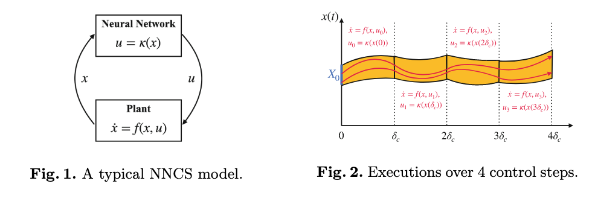

# POLAR: A Polynomial Arithmetic Framework for Verifying Neural-Network Controlled Systems

Chao Huang, Jiameng Fan, Xin Chen, Wenchao Li, and Qi Zhu

We present POLAR (The source code can be found at https://github.com/ChaoHuang2018/POLAR Tool. The full version of this paper can be found at https://arxiv.org/abs/2106.13867.), a POLynomial ARithmetic-based framework for efficient time-bounded reachability analysis of neural-network controlled systems. Existing approaches leveraging the standard Taylor Model (TM) arithmetic for approximating the neural-network controller cannot deal with nondifferentiable activation functions and suffer from rapid explosion of the remainder when propagating TMs. POLAR overcomes these shortcomings by integrating TM arithmetic with Bernstein polynomial interpolation and symbolic remainders. The former enables TM propagation across non-differentiable activation functions and local refinement of TMs, and the latter reduces error accumulation in the TM remainder for linear mappings in the neural network. Experimental results show POLAR significantly outperforms the state-of-the-art tools on both efficiency and tightness of the reachable set overapproximation.

## Introduction

Neural networks have been increasingly used as the central decision makers in a variety of control tasks [17,21]. However, the use of neural-network controllers also gives rise to new challenges on verifying the correctness of the resulting closed-loop control systems especially in safety-critical settings [29,30]. In this paper, we consider the **reachability verification problem** of **neural-network controlled systems (NNCSs)**. The high-level architecture of a simple NNCS is shown in Fig. 1 in which the neural network senses the system state x at discrete time steps, and computes the corresponding control values u for updating the system dynamics which is defined by an ordinary differential equation (ODE) over x and u. The time-bounded reachability analysis problem of an NNCS is to compute a state set that contains all the trajectories of a finite number of control steps from a given initial set. The initial set may represent uncertainties in the starting state of the system or error (e.g. localization error) bounds in estimating the current system state during an execution of the system. Figure 2 shows an illustration of reachable sets for 4 steps, where the orange region represents the reachable set, and the two red, arrowed curves are two example trajectories starting from two different initial states in the initial set X0 (blue).

Reachability analysis of general NNCSs is notoriously difficult due to nonlinearity in both the neural-network controller and the plant. The difficulty is further exacerbated by the coupling of the controller and the plant over multiple control steps. Since exact reachability of general nonlinear systems is undecidable [2], current approaches for reachability analysis largely focus on computing a tight overapproximation of the reachable sets [1,6,10]. Verisig [14] leverages properties of the sigmoid activation function and converts an NNCS with these activation functions to an equivalent hybrid system. Thus, existing tools for hybrid system reachability analysis can be directly applied to solve the NNCS reachability problem. However, this approach inherits the efficiency problem of hybrid system reachability analysis and does not scale beyond very small NNCSs. Another line of approach is to draw on techniques for computing the output ranges of neural networks [12,16,24,26–28] and directly integrating them with reachability analysis tools designed for dynamical systems. NNV [25], for instance, combines star set analysis on the neural network with zonotope-based analysis of the nonlinear plant dynamics from CORA [1]. However, such approaches have been shown to be ineffective for NNCS verification due to the lack of consideration on the interaction between the neural-network controller and the plant dynamics [8,11,13]. In particular, since the primary goal of these techniques is to bound the output range of the neural network instead of approximating its input-output function, they cannot track state dependencies across the closed-loop system and across multiple time steps in reachability analysis.

More recent advances in NNCS reachability analysis are based on the idea of function overapproximation of the neural network controller. A function overapproximation of a neural network κ has two components: an approximated function p and an error term I (e.g. an interval) that bounds the approximation error. Such function overapproximation that produces a point-wise approximation of κ with an interval error term (typically called a remainder) is also known as a Taylor model (TM). Function-overapproximation approaches can be broadly categorized into two classes: direct end-to-end approximation such as Sherlock [8], ReachNN [11] and ReachNN* [9], and layer-by-layer propagation such as Verisig 2.0 [13]. The former computes a function overapproximation of the neural network end-to-end by sampling from the input space. The main drawback of this approach is that it does not scale beyond systems with more than a few input dimensions. The latter approach tries to exploit the neural network structure and uses Taylor model arithmetic to more efficiently obtain a function overapproximation of κ by propagating the TMs layer by layer through the network (details in Sect. 3). However, due to limitations of basic TM arithmetic, these approaches cannot handle non-differentiable activation functions and suffer from rapid growth of the remainder during propagation. For instance, explosion of the interval remainder would degrade a TM propagation to an interval analysis.

In this paper, we propose a principled POLynomial ARithmetic framework (POLAR) that enables precise layer-by-layer propagation of TMs for general feed-forward neural networks. Basic Taylor model arithmetic cannot handle ReLU that is non-differentiable (cannot produce the polynomial), and also suffers from low approximation precision (large remainder). POLAR addresses the key challenges of applying basic TM arithmetic through a novel use of univariate Bernstein polynomial interpolation and symbolic remainders. Univariate Bernstein polynomial interpolation enables the handling of non-differentiable activation functions and local refinement of Taylor models (details in Sect. 3.1). Symbolic remainders can taper the growth of interval remainders by avoiding the so-called wrapping effect [15] in linear mappings. The paper has the following novel contributions: (I) A polynomial arithmetic framework using both Taylor and univariate Bernstein approximations for computing NNCS reachable sets to handle general NN controllers; (II) An adaptation of the symbolic remainder method for ODEs to the layer-by-layer propagation for neural networks; (III) A comprehensive experimental evaluation of our approach on challenging case studies that demonstrates significant improvements of POLAR against SOTA.

## Preliminaries

A Neural-Network Controlled System (NNCS) is a continuous plant governed by a neural network controller. The plant dynamics is defined by an ODE of the form $x ̇ = f (x, u)$ wherein the state variables and control inputs are denoted by the vectors $x$ and $u$ respectively. We assume the function $f$ is at least locally Lipschitz continuous such that its solution w.r.t. an initial state and constant control inputs is unique [20]. We denote the input-output mapping of the neural network controller as $κ$. The controller is triggered every $δ_c$ time which is called the **control stepsize**. A system execution (trajectory) is produced as follows: starting from an initial state $x(0)$, the controller senses the system state at the beginning of every control step $t = jδ_c$ for $j = 0, 1, . . .$, and updates the control inputs to $v_j = κ(x(jδ_c))$. The system’s dynamics in that control step is governed by the ODE $ẋ = f (x, v_j)$.

Given an initial state set $X_0 ⊂ \mathbb{R}^n$, all executions from a state in this set can be formally defined by a **flowmap** function $φ_\mathcal{N} : X_0 × \mathbb{R}_{≥0} → \mathbb{R}^n$, such that the system state at any time $t ≥ 0$ from any initial state $x_0 ∈ X_0$ is $φ_N (x0, t)$.  We call a state $x' ∈ \mathbb{R}^n$ reachable if there exists $x_0 ∈ X_0$ and $t ≥ 0$ such that $x' = φ_N (x_0, t)$. The reachability problem on NNCS is to decide whether a state is reachable in a given NNCS, and it is **undecidable** since NNCS is more expressive than two-counter machines for which the reachability problem is already undecidable [2]. **Many formal verification problems can be reduced to the reachability problem**. For example, the **safety verification problem** can be reduced to checking reachability to an unsafe state. 

In the paper, we focus on computing the reachable set of an NNCS over a bounded number $K$ of control steps. Since flowmap $φ_N$ often does not have a closed form due to the nonlinear ODEs, we seek to compute state-wise overapproximations for it over multiple time segments, that is, in each control step $[jδ_c, (j + 1)δ_c]$ for $j = 0, . . . , K − 1$, the reachable set is overapproximated by a group of flowpipes $F_1(x_0, τ ), . . . , F_N (x_0, τ )$ over the $N$ uniformly subdivided time segments of the time interval, such that $F_i(x_0, τ)$ is a state-wise overapproximation of $φ_N (x_0, jδ_c + (i − 1)δ + τ )$ for $τ ∈ [0, δ_c/N ]$, i.e., $F_j(x_0, τ )$ contains the exact reachable state from any initial state $x_0$ in the i-th time segment of the j-th control step. Here, $τ$ is the local time variable which is independent in each flowpipe. A high-level flowpipe construction algorithm is presented as follows, in which $\hat{X}_0 = X_0$ and $δ = δ_c/N$ is called the **time step**.

- **for** $j = 0$ to $K − 1$ **do**
   1. Computing an overapproximation $\hat{U}_j$ for the control input range $κ( \hat{X}_j)$; 
   2. Computing the flowpipes $F_1(x_0, τ ), . . . , F_N (x_0, τ )$ for the continuous dynamics $ẋ = f (x, u), u ̇= 0$ from the initial set $x(0) ∈ \hat{X}_j$, $u(0) ∈  \hat{U}_j$;
   3. $\mathcal{R} ← \mathcal{R} ∪ \{F_1(x_0, τ ), . . . , F_N (x_0, τ )\}$;
   4. $\hat{X}_{j+1} ← F_N(x_0, δ)$;

Notice that $x(0)$ denotes the local initial set for the ODE used in the current control step, that is the system reachable set at the time $jδ_c$, while the variables $x_0$ in a flowpipe are the symbolic representation of an initial state in $X_0$. Intuitively, a flowpipe overapproximates not only the reachable set in a time step, but also the dependency from an initial state to its reachable state at a particular time. For settings where the plant dynamics of an NNCS is given as a difference equation in the form of $x_{k+1} = f (x_k, u_k)$, we can obtain discrete flowpipes which are the reachable set overapproximations at discrete time points by repeatedly computing the state set at the next step using TM arithmetic.

**Dependencies on the Initial Set.** As we mentioned previously, the reachable state of an NNCS at a time $t > 0$ is uniquely determined by its initial state if there is no noise or disturbance in the system dynamics or on the state measurements. 

- If we use $X_j$ to denote the exact reachable set $\{φ_N (x_0, jδ_c) | x_0 ∈ X_0\}$ from a given initial set $X_0$, then the control input range is defined by the set $U_j = \{κ(x_j) | x_j = φ_N (x_0, jδ_c) \text{ and } x_0 ∈ X_0\}$. 

  ?> That is, $U_j = \{κ(x_j) | x_j \in X_j \}$.

- More intuitively, the set $U_j$ is the image from the initial set $X_0$ under the mapping $κ(φ_N (·, jδ_c))$. 

The main challenge in computing NNCS reachable sets is to control the overapproximation, which requires accurately tracking the dependency of a reachable set on the initial set across multiple control steps. In this paper, we present a polynomial arithmetic framework for tracking such dependencies using Taylor models.

**Taylor Model Arithmetic.** Taylor models are originally proposed to compute higher-order overapproximations for the ranges of continuous functions (see [4]). They can be viewed as a higher-order extension of intervals [22], which are sets of real numbers between lower and upper real bounds, e.g., the interval $[a, b]$ wherein $a ≤ b$ represents the set of $\{x | a ≤ x ≤ b\}$. A Taylor model (TM) is a pair $(p, I)$ wherein $p$ is a polynomial of degree $k$ over a finite group of variables $x_1, . . . , x_n$ ranging in an interval domain $D ⊂ \mathbb{R}^n$, and $I$ is the remainder interval. The range of a TM is the Minkowski sum of the range of its polynomial and the remainder interval. Thereby we sometimes intuitively denote a TM $(p, I)$ by $p + I$ in the paper. TMs are closed under operations such as addition, multiplication, and integration (see [19]). Given functions $f, g$ that are overapproximated by TMs $(p_f , I_f )$ and $(p_g, I_g)$, respectively, a TM for $f + g$ can be computed as $(p_f + p_g, I_f + I_g)$, and an order $k$ TM for $f · g$ can be computed as $(p_f · p_g − r_k, I_f · B(p_g) + B(p_f ) · I_g + I_f ·I_g + B(r_k))$, wherein $B(p)$ denotes an interval enclosure of the range of $p$, and the truncated part $r_k$ consists of the terms in $p_f · p_g$ of degrees $> k$. Similar to reals and intervals, TMs can also be organized as vectors and matrices to overapproximate the functions whose ranges are multidimensional. Notice that a TM is a **function overapproximation** and not just a range overapproximation like intervals or polyhedra.

## Framework of POLAR

In this section, we describe POLAR’s approach for computing a TM for the output range of a neural network (NN) when the input range is defined by a TM. POLAR uses the **layer-by-layer propagation strategy**, and features the following key novelties: 

(a) A method to compute univariate Bernstein Polynomial (BP) overapproximations for activation functions, and selectively uses Taylor or Bernstein polynomials to limit the overestimation produced when overapproximating the output ranges of individual neurons. 

(b) A technique to symbolically represent the intermediate linear transformations of TM interval remainders during the layer-by-layer propagation. The purpose of using Symbolic Remainders (SR) is to reduce the accumulation of overestimation in composing a sequence of TMs.

### Main Framework

We begin by introducing POLAR’s propagation framework that incorporates only (a), and then describe how to extend it by further integrating (b). Although using TMs to represent sets in layer-by-layer propagation is already used in [13], the method only computes Taylor approximations for activation functions, and the TM output of one layer is propagated by the existing arithmetic for TM composition to the next layer. Such a method has the following shortcomings: 

1. the activation functions have to be differentiable, 
2. standard TM composition is often the source of overestimation even if preconditioning and shrink wrapping are used. 

Here, we seek to improve the use of TMs in the above two aspects.

## Experiments

## Conclusion

In this paper, we propose POLAR, a polynomial arithmetic framework, which integrates TM flowpipe construction, Bernstein overapproximation, and symbolic remainder method to efficiently compute reachable set overapproximations for NNCS. Empirical comparison shows POLAR performs significantly better than SOTAs on both computation efficiency and tightness of reachable set estimation. Our future work includes parallelization of POLAR on GPUs to further improve computation efficiency.