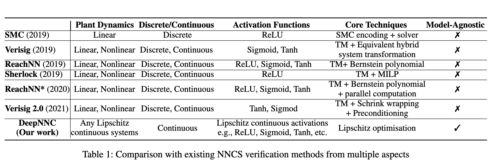

# Reachability Analysis of Neural Network Control Systems

Chi Zhang, Wenjie Ruan, Peipei Xu

Neural network controllers (NNCs) have shown great promise in autonomous and cyber-physical systems. Despite the various verification approaches for neural networks, the safety analysis of NNCs remains an open problem. Existing verification approaches for neural network control systems (NNCSs) either can only work on a limited type of activation functions, or result in non-trivial over-approximation errors with time evolving. This paper proposes a verification framework for NNCS based on Lipschitzian optimisation, called DeepNNC. We first prove the Lipschitz continuity of closed-loop NNCSs by unrolling and eliminating the loops. We then reveal the working principles of applying Lipschitzian optimisation on NNCS verification and illustrate it by verifying an adaptive cruise control model. Compared to state-of-theart verification approaches, DeepNNC shows superior performance in terms of efficiency and accuracy over a wide range of NNCs. We also provide a case study to demonstrate the capability of DeepNNC to handle a real-world, practical, and complex system. Our tool DeepNNC is available at https://github.com/TrustAI/DeepNNC.

## Introduction

## Related Work

**SMC-based approaches** transform the problem into an SMC problem (Sun, Khedr, and Shoukry 2019). First, it partitions the safe set, into imaging-adapted sets. After partitioning, this method utilises an SMC encoding to specify all possible assignments of the activation functions for the given plant and NNC. However, it can only work on discrete-time linear plants with ReLU neural controller.

**SDP-based and LP-based approaches.** SDP-based approach (Hu et al. 2020) uses a semidefinite program (SDP) for reachability analysis of NNCS. It abstracts the nonlinear components of the closed-loop system by quadratic constraints and computes the approximate reachable sets via SDP. It is limited to linear systems with NNC. LP-based approach(Everett et al. 2021) provides a linear programmingbased formulation of NNCSs. It demonstrates higher efficiency and scalability than the SDP methods. However, the estimation results are less tight than SDP-based methods.

**Representation-based approaches** use the representation sets to serve as the input and output domains for both the controller and the hybrid system. The representative method is NNV (Tran et al. 2020), which has integrated various representation sets, such as polyhedron (Tran et al. 2019a,c), star sets (Tran et al. 2019b) and zonotop (Singh et al. 2018). For a linear plant, NNV provides exact reachable sets, while it is an over-approximated analyser for a nonlinear plant.

**Taylor model based approaches** approximate the reachable sets of NNCSs with the Taylor model (TM). Representative methods are Sherlock (Dutta, Chen, and Sankaranarayanan 2019) and Verisig 2.0 (Ivanov et al. 2021). The core concept is to approximate a function with a polynomial and a worst-case error bound. TM approximation has shown impressive results in reachability analysis of hybrid systems with conventional controllers (Chen, Abraham, and Sankaranarayanan 2012; Chen, Ábrahám, and Sankaranarayanan 2013) and the corresponding tool Flow\* (Chen, Ábrahám, and Sankaranarayanan 2013) is widely applied. Verisig (Ivanov et al. 2019) makes use of Flow\* (Chen, Ábrahám, and Sankaranarayanan 2013) by transforming the NNC into a regular hybrid system without a neural network. Instead of directly using the TM verification tool, ReachNN (Huang et al. 2019), ReachNN\* (Fan et al. 2020) and Verisig 2.0 (Ivanov et al. 2021) maintain the structure of NNCS and approximate the input and output of NNC by a polynomial and an error bound. 

As Table 1 shows, the core technique of our method is significantly different from existing solutions, enabling DeepNNC to work on any Lipschitz-continuous NNCSs.

## Problem Formulation

Figure 2 shows a typical closed-loop neural network controlled system, which consists of two parts, a plant represented by a continuous system $\dot{x} = f (x, u)$ and a neural network controller $u = σ(y)$. The system works in a time-triggered manner with the control step size $δ$.

**Definition 1 (Plant).** In this work, we specify the plant $P$ as a continuous system as:  
$$
\dot{x} = f (x, u), x ∈ \mathbb{R}^n \text{ and } u ∈ \mathbb{R}^m 
$$
with state $x$ containing $n$ variables, and control input $u$ consisting of $m$ variables. For the time-triggered controller, the plant dynamic inside a control time step is assigned as  
$$
\dot{x}(t) = f (x(t), u(iδ))
$$
with $i = 0, 1, 2, ...,$ and $t ∈ [iδ, (i + 1)δ]$.