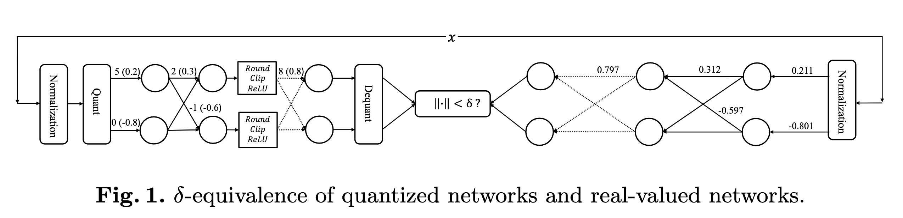

# Parallel Verification for $δ$-Equivalence of Neural Network Quantization

Pei Huang, Yuting Yang, Haoze Wu, Ieva Daukantas, Min Wu, Fuqi Jia, and Clark Barrett

Quantization replaces floating point arithmetic with integer arithmetic in deep neural networks, enabling more efficient on-device inference with less power and memory. However, it also brings in loss of generalization and even potential errors to the models. In this work, we propose a parallelization technique for formally verifying the equivalence between quantized models and their original real-valued counterparts. In order to guarantee both soundness and completeness, mixed integer linear programming (MILP) is deployed as the baseline technique. Nevertheless, the incorporation of two networks as well as the mixture of integer and real number arithmetic make the problem much more challenging than verifying a single network, and thus using MILP alone is inadequate for the non-trivial cases. To tackle this, we design a distributed verification technique that can leverage hundreds of CPUs on high-performance computing clusters. We develop a two-tier parallel framework and propose property- and output-based partition strategies. Evaluated on perception networks quantized with PyTorch, our approach outperforms existing methods in successfully verifying many cases that are otherwise considered infeasible.

## Introduction

In the past few years, deep neural networks (DNNs) [11] have demonstrated striking and steadily improving capabilities across a wide range of tasks [39, 32, 5, 6]. Ongoing improvements to neural networks are typically achieved through a significant expansion in their scale. This escalation, however, frequently leads to substantial increases in computational cost, memory bandwidth requirements, and energy consumption, which make DNNs difficult to deploy on embedded systems with limited hardware resources. A promising approach for mitigating this difficulty is neural network quantization. This technique replaces floating point arithmetic with integer arithmetic in deep models, enabling more efficient inference on devices with reduced power and memory requirements [21, 13]. Quantization has been employed, for example, in Tesla’s FSD-chip [1] and in various mobile devices [25, 2]).

As quantization trades off precision for efficiency, the accuracy or generalizability of a quantized neural network (QNN) is typically reduced compared to that of the original real-valued network. Although the impact of neural network quantization can be measured through empirical indicators such as changes in accuracy on a test set, this is still insufficient, especially considering that neural networks are increasingly being used in safety-critical scenarios such as autonomous driving [38] and medical diagnostics [4]. With the increasing popularization and use of QNNs, it is urgent to develop efficient and effective analysis methods that also provide rigorous guarantees. Formal verification is an established technique which applies mathematical reasoning to provide such guarantees. In this paper, we explore the use of formal methods to quantitatively analyze the changes in a neural network’s output for the same input space before and after quantization.

We introduce a generalized concept of equivalence to characterize the differences between an original network and a quantized network. Specifically, we say that a real-valued DNN $N(x)$ and its quantized version $NQ(x)$ are $δ$-equivalent if, for all possible inputs $x$ in an input space $B$ of interest, $\| N(x) − NQ(x)\|_∞ < δ$ holds. We refer to it as “equivalence” because the goal is for the two networks to produce outputs that are as similar as possible for every possible input. Of course, it is unrealistic to expect a QNN to maintain absolute equivalence with its original real-valued network. Therefore, a tolerance $δ$ is introduced.

Our approach for determining $δ$-equivalence is inspired by a stream of related work on error bound verification. Paulsen et al. [29, 30] propose differential verification methods, which aim to establish formal guarantees on the difference between a network represented by weights in high-precision floating-point format and another network represented by weights in low-precision fixed-point format. The low-precision network can be thought of as a simplified and partially quantized neural network. They apply a sound but incomplete interval propagation to overestimate the difference between two networks. Zhang et al. [41] extend the differential analysis with a complete mixed integer linear programming (MILP)-based method in order to precisely verify error bounds between real-valued neural networks and fully quantized networks obtained using a **toy quantization scheme**. Their analysis requires formally modeling both networks, meaning that the scale of the problem is double that of formally analyzing one of the networks. Even for small networks, differential analysis using this approach often cannot be completed within a reasonable amount of time. As a way to simplify the problem, Zhang et al. [41] focus on classification networks and only on the output difference for the predicted class rather than all classes. Besides this simplification, the toy quantization scheme used in their work is simpler than and different from quantization schemes used in practice. As a result, conclusions drawn from their approach may not be valid for quantized networks obtained with standard quantization packages.

?> Zhang et al. 的工作确实存在很多局限性，这份工作也是基于这些局限性开展的。

In this work, we build on and extend these approaches in several ways. We follow Zhang et al. by using two neural networks and MILP encodings and solvers, which are exact in the sense that they guarantee both soundness and completeness. However, in contrast to the toy quantization schemes used in Zhang et al., we focus on **realistic quantization schemes** used in popular deep learning frameworks such as PyTorch and TensorFlow. Furthermore, to overcome the scalability challenges posed by using exact techniques and two networks, we propose an efficient parallel verification method. Our main framework is based on a divide-and-conquer strategy, which breaks down the original problem into many sub-problems and uses multiple CPUs to solve them simultaneously. This approach has been shown to be effective for related problems such as Boolean satisfiability [15, 16].

?> 这篇文章用到了真实的quantization scheme。

We observe two main challenges when using divide-and-conquer. First, it is difficult to divide the problem into sub-problems of similar difficulty. Some subproblems can be extremely simple, to the extent that the overhead of divideand-conquer is larger than the runtime of the sub-problem. Conversely, other sub-problems are almost as challenging as the original problem, requiring nearly the same amount of time to solve. Second, even though sub-problems are always theoretically simpler than the original problem, in practice, sub-problems can take longer to solve due to the high variance in runtime performance under small perturbations, a feature that is common among solvers that tackle NP hard (or harder) problems. To address the first issue, we propose a two-stage output-based partition method. The first stage eliminates logical disjunction from the equivalence property, and the second stage further decomposes the problem based on estimated interval ranges for the output nodes provided by standard abstract interpretation-based analyses. To address the second issue, we adopt a two-level parallel strategy. We utilize multiple independent processes to solve all sub-problems concurrently. Within each process, we employ multithreaded parallelism to run a portfolio of solving algorithms, each with a different configuration, all solving the same sub-problem simultaneously. Our parallel algorithm is designed for high performance computing (HPC) clusters which can utilize hundreds of CPUs. To minimize the additional overhead caused by process communication, inter-node communication uses the standard message passing interface (MPI), while multi-core parallelization within processes is achieved through multiprocessing and shared memory mechanisms.

We call our system **E**fficient **Q**NN **E**quivalence **V**erification, or EQEV. Our experimental results show that EQEV can, for the first time, verify the equivalence of QNNs of moderate size in non-trivial scenarios. Our contributions can be summarized as follows:

1. We provide the first MILP-based exact equivalence verification approach for QNNs obtained with quantization schemes used in current popular deep learning frameworks;
1. We propose an output-based two-stage partitioning method which helps balance the difficulty of sub-problems and greatly improves the efficiency of parallel verification;
1. We implement our approach in a tool called EQEV that can utilize hundreds of CPUs in an HPC cluster for equivalence verification, achieved through a combination of MPI, multi-processing, and multi-threading. EQEV is the first system to verify the equivalence of moderate-sized networks in reasonable time.

## Related Work

**Formal verification** of DNNs is a technique which determines whether a network satisfies a formal property by either proving the property or providing a counter-example to the property. For instance, **robustness** is often formulated as a formal property expressing the non-existence of adversarial examples in a bounded neighborhood of some input based on a certain distance metric. Researchers have developed various techniques for verifying DNNs such as **constraint solving** (based on **satisfiability modulo theories (SMT)** [23, 8, 20, 37] or **MILP** [3, 9, 7]) and **abstract interpretation** [36, 35, 10, 40, 31, 27, 33]. The former provides sound and complete guarantees but with limited scalability as the problem is **NP-hard** [23]; the latter utilizes over-approximation to improve scalability but at the cost of completeness. However, work on formal approaches for QNN verification is limited, potentially due to the difficulty of modeling quantization schemes or the computational cost [22].

Not until recently did researchers start to focus on the verification of QNNs. For example, Henzinger et al. [14], Mistry et al. [28], and Zhang et al. [42] propose using SMT, MILP, and integer linear programming (ILP), respectively, to model the QNN verification problem. Although this work pioneers new directions for QNN verification, it is based on toy quantization schemes rather than realistic quantization algorithms used in popular deep learning frameworks such as PyTorch and TensorFlow. Very recently, in 2023, Huang et al. [19] provide a hybrid verification method that is the first to support realistic quantization schemes in PyTorch.

Nevertheless, the above-mentioned DNN and QNN verification techniques only focus on a single individual neural network; they are inadequate when performing formal analyses involving two networks. Paulsen et al. [29, 30] propose a differential verification method leveraging abstract interpretation to verify the discrepancy between two neural networks with identical topologies but slightly different weights. Zhang et al. [41] build on this to precisely verify the error bound between real-valued and quantized models using a complete MILP analysis, but still only for toy quantization schemes and only for a predicted class (as opposed to all classes) in a classification task.

## Preliminaries

### Quantized Neural Networks (QNNs)

## $δ$-Equivalence

## MILP Encoding

## Symbolic Interval Analysis

## Parallelization

### Process Management

### Partitioning Strategies

## Experiments

## Efficiency

## References

1. Fsd chip-tesla. https://en.wikichip.org/wiki/tesla_(car_company)/fsd_chip (2022)
2. Bunda, S., Spreeuwers, L.J., Zeinstra, C.G.: **Sub-byte quantization of mobile face recognition convolutional neural networks**. In: Brömme, A., Damer, N., Gomez-Barrero, M., Raja, K.B., Rathgeb, C., Sequeira, A.F., Todisco, M., Uhl, A. (eds.) Proceedings of the 21st International Conference of the Biometrics Special Interest Group, BIOSIG 2022, Darmstadt, Germany, September 14-16, 2022. LNI, vol. P- 329, pp. 229–236. IEEE / Gesellschaft für Informatik e.V. (2022)
3. Cheng, C., Nührenberg, G., Ruess, H.: **Maximum resilience of artificial neural networks**. In: Automated Technology for Verification and Analysis - 15th International Symposium, ATVA 2017, Pune, India, October 3-6, 2017, Proceedings. Lecture Notes in Computer Science, vol. 10482, pp. 251–268. Springer (2017)
4. Ciresan, D.C., Giusti, A., Gambardella, L.M., Schmidhuber, J.: **Deep neural networks segment neuronal membranes in electron microscopy images**. In: Advances in Neural Information Processing Systems 25: 26th Annual Conference on Neural Information Processing Systems 2012. Proceedings of a meeting held December 3-6, 2012, Lake Tahoe, Nevada, United States. pp. 2852–2860 (2012)
5. Devlin, J., Chang, M., Lee, K., Toutanova, K.: **BERT: pre-training of deep bidirectional transformers for language understanding**. In: Proceedings of the 2019 Conference of the North American Chapter of the Association for Computational Linguistics: Human Language Technologies, NAACL-HLT 2019, Minneapolis, MN, USA, June 2-7, 2019, Volume 1. pp. 4171–4186. Association for Computational Linguistics (2019)
6. Dosovitskiy, A., Beyer, L., Kolesnikov, A., Weissenborn, D., Zhai, X., Unterthiner, T., Dehghani, M., Minderer, M., Heigold, G., Gelly, S., Uszkoreit, J., Houlsby, N.: **An image is worth 16x16 words: Transformers for image recognition at scale**. In: 9th International Conference on Learning Representations, ICLR 2021, Virtual Event, Austria, May 3-7, 2021. OpenReview.net (2021)
7. Dutta, S., Jha, S., Sankaranarayanan, S., Tiwari, A.: **Output range analysis for deep feedforward neural networks**. In: NASA Formal Methods - 10th International Symposium, NFM 2018, Newport News, VA, USA, April 17-19, 2018, Proceedings. Lecture Notes in Computer Science, vol. 10811, pp. 121–138. Springer (2018)
8. Ehlers, R.: **Formal verification of piece-wise linear feed-forward neural networks**. In: Automated Technology for Verification and Analysis - 15th International Sym- posium, ATVA 2017, Pune, India, October 3-6, 2017, Proceedings. Lecture Notes in Computer Science, vol. 10482, pp. 269–286. Springer (2017)
9. Fischetti, M., Jo, J.: **Deep neural networks and mixed integer linear optimization**. Constraints An Int. J. 23(3), 296–309 (2018)
10. Gehr, T., Mirman, M., Drachsler-Cohen, D., Tsankov, P., Chaudhuri, S., Vechev, M.T.: **AI2: safety and robustness certification of neural networks with abstract interpretation**. In: 2018 IEEE Symposium on Security and Privacy, SP 2018, Proceedings, 21-23 May 2018, San Francisco, California, USA. pp. 3–18. IEEE Com- puter Society (2018)
11. Goodfellow, I.J., Bengio, Y., Courville, A.C.: Deep Learning. **Adaptive computation and machine learning**, MIT Press (2016)
12. **Gurobi: A most powerful mathematical optimization solver** (2018)
13. Han, S., Mao, H., Dally, W.J.: **Deep compression: Compressing deep neural network with pruning, trained quantization and huffman coding**. In: 4th International Conference on Learning Representations, ICLR 2016, San Juan, Puerto Rico, May 2-4, 2016, Conference Track Proceedings (2016)
14. Henzinger, T.A., Lechner, M., Žikelić, D.: **Scalable verification of quantized neural networks**. In: Thirty-Fifth AAAI Conference on Artificial Intelligence, AAAI 2021. pp. 3787–3795. AAAI Press (2021)
15. Heule, M., Kullmann, O., Wieringa, S., Biere, A.: **Cube and conquer: Guiding CDCL SAT solvers by lookaheads**. In: Eder, K., Lourenc ̧o, J., Shehory, O. (eds.) Hardware and Software: Verification and Testing - 7th International Haifa Verifi- cation Conference, HVC 2011, Haifa, Israel, December 6-8, 2011, Revised Selected Papers. Lecture Notes in Computer Science, vol. 7261, pp. 50–65. Springer (2011)
16. Heule, M.J.H., Kullmann, O., Marek, V.W.: **Solving and verifying the boolean pythagorean triples problem via cube-and-conquer**. In: Creignou, N., Berre, D.L. (eds.) Theory and Applications of Satisfiability Testing - SAT 2016 - 19th Interna- tional Conference, Bordeaux, France, July 5-8, 2016, Proceedings. Lecture Notes in Computer Science, vol. 9710, pp. 228–245. Springer (2016)
17. Huang, P., Liu, M., Ge, C., Ma, F., Zhang, J.: **Investigating the existence of orthogonal golf designs via satisfiability testing**. In: Davenport, J.H., Wang, D., Kauers, M., Bradford, R.J. (eds.) Proceedings of the 2019 on International Symposium on Symbolic and Algebraic Computation, ISSAC 2019, Beijing, China, July 15-18, 2019. pp. 203–210. ACM (2019)
18. Huang, P., Ma, F., Ge, C., Zhang, J., Zhang, H.: **Investigating the existence of large sets of idempotent quasigroups via satisfiability testing**. In: Galmiche, D., Schulz, S., Sebastiani, R. (eds.) Automated Reasoning - 9th International Joint Conference, IJCAR 2018, Held as Part of the Federated Logic Conference, FloC 2018, Oxford, UK, July 14-17, 2018, Proceedings. Lecture Notes in Computer Science, vol. 10900, pp. 354–369. Springer (2018)
19. Huang, P., Wu, H., Yang, Y., Daukantas, I., Wu, M., Zhang, Y., Barrett, C.: **Towards efficient verification of quantized neural networks**. arXiv preprint arXiv:2312.12679 (2023)
20. Huang, X., Kwiatkowska, M., Wang, S., Wu, M.: **Safety verification of deep neural networks**. In: Computer Aided Verification - 29th International Conference, CAV 2017, Heidelberg, Germany, July 24-28, 2017, Proceedings, Part I. Lecture Notes in Computer Science, vol. 10426, pp. 3–29. Springer (2017)
21. Jacob, B., Kligys, S., Chen, B., Zhu, M., Tang, M., Howard, A.G., Adam, H., Kalenichenko, D.: **Quantization and training of neural networks for efficient integer-arithmetic-only inference**. In: 2018 IEEE Conference on Computer Vision and Pat- tern Recognition, CVPR 2018, Salt Lake City, UT, USA, June 18-22, 2018. pp. 2704–2713. Computer Vision Foundation / IEEE Computer Society (2018)
22. Jia, K., Rinard, M.C.: **Efficient exact verification of binarized neural networks**. In: Advances in Neural Information Processing Systems 33: Annual Conference on Neural Information Processing Systems 2020, NeurIPS 2020, December 6-12, 2020, virtual (2020)
23. Katz, G., Barrett, C.W., Dill, D.L., Julian, K., Kochenderfer, M.J.: **Reluplex: An efficient SMT solver for verifying deep neural networks**. In: Computer Aided Verification - 29th International Conference, CAV 2017, Heidelberg, Germany, July  24-28, 2017, Proceedings, Part I. Lecture Notes in Computer Science, vol. 10426, pp. 97–117. Springer (2017)
24. Katz, G., Huang, D.A., Ibeling, D., Julian, K., Lazarus, C., Lim, R., Shah, P., Thakoor, S., Wu, H., Zeljic, A., Dill, D.L., Kochenderfer, M.J., Barrett, C.W.: **The marabou framework for verification and analysis of deep neural networks**. In: Computer Aided Verification - 31st International Conference, CAV 2019, New York City, NY, USA, July 15-18, 2019, Proceedings, Part I. Lecture Notes in Computer Science, vol. 11561, pp. 443–452. Springer (2019)
25. Kulkarni, U., M, M.S., Gurlahosur, S.V., Bhogar, G.: **Quantization friendly mobilenet (qf-mobilenet) architecture for vision based applications on embedded platforms**. Neural Networks 136, 28–39 (2021)
26. LeCun, Y., Bottou, L., Bengio, Y., Haffner, P.: **Gradient-based learning applied to document recognition**. Proc. IEEE 86(11), 2278–2324 (1998). https://doi.org/10.1109/5.726791, https://doi.org/10.1109/5.726791
27. Mirman, M., Gehr, T., Vechev, M.T.: **Differentiable abstract interpretation for provably robust neural networks**. In: Proceedings of the 35th International Conference on Machine Learning, ICML 2018, Stockholmsmässan, Stockholm, Sweden, July 10-15, 2018. Proceedings of Machine Learning Research, vol. 80, pp. 3575– 3583. PMLR (2018)
28. Mistry, S., Saha, I., Biswas, S.: **An MILP encoding for efficient verification of quantized deep neural networks**. IEEE Trans. Comput. Aided Des. Integr. Circuits Syst. 41(11), 4445–4456 (2022)
29. Paulsen, B., Wang, J., Wang, C.: **Reludiff: differential verification of deep neural networks**. In: Rothermel, G., Bae, D. (eds.) ICSE'20: 42nd International Conference on Software Engineering, Seoul, South Korea, 27 June - 19 July, 2020. pp. 714–726. ACM (2020)
30. Paulsen,B.,Wang,J.,Wang,J.,Wang,C.: **NEURODIFF: scalable differential verification of neural networks using fine-grained approximation**. In: 35th IEEE/ACM International Conference on Automated Software Engineering, ASE 2020, Melbourne, Australia, September 21-25, 2020. pp. 784–796. IEEE (2020)
31. Raghunathan, A., Steinhardt, J., Liang, P.: **Semidefinite relaxations for certifying robustness to adversarial examples**. In: Advances in Neural Information Processing Systems 31: Annual Conference on Neural Information Processing Systems 2018, NeurIPS 2018, December 3-8, 2018, Montréal, Canada. pp. 10900–10910 (2018)
32. Simonyan, K., Zisserman, A.: **Very deep convolutional networks for large-scale image recognition**. In: 3rd International Conference on Learning Representations, ICLR 2015, San Diego, CA, USA, May 7-9, 2015, Conference Track Proceedings (2015)
33. Singh, G., Gehr, T., Püschel, M., Vechev, M.T.: **An abstract domain for certifying neural networks**. Proc. ACM Program. Lang. 3(POPL), 41:1–41:30 (2019)
34. Wang,S.,Pei,K.,Whitehouse,J.,Yang,J.,Jana,S.: **Efficient formal safety analysis of neural networks**. In: Advances in Neural Information Processing Systems 31: Annual Conference on Neural Information Processing Systems 2018, NeurIPS 2018, December 3-8, 2018, Montréal, Canada. pp. 6369–6379 (2018)
35. Weng, T., Zhang, H., Chen, H., Song, Z., Hsieh, C., Daniel, L., Boning, D.S., Dhillon, I.S.: **Towards fast computation of certified robustness for relu networks**. In: Proceedings of the 35th International Conference on Machine Learning, ICML 2018, Stockholmsmässan, Stockholm, Sweden, July 10-15, 2018. Proceedings of Machine Learning Research, vol. 80, pp. 5273–5282. PMLR (2018)
36. Wong, E., Kolter, J.Z.: **Provable defenses against adversarial examples via the convex outer adversarial polytope**. In: Proceedings of the 35th International Con- ference on Machine Learning, ICML 2018, Stockholmsmässan, Stockholm, Sweden, July 10-15, 2018. Proceedings of Machine Learning Research, vol. 80, pp. 5283– 5292. PMLR (2018)
37. Wu, H., Ozdemir, A., Zeljic, A., Julian, K., Irfan, A., Gopinath, D., Fouladi, S., Katz, G., Pasareanu, C.S., Barrett, C.W.: **Parallelization techniques for verifying neural networks**. In: 2020 Formal Methods in Computer Aided Design, FMCAD 2020, Haifa, Israel, September 21-24, 2020. pp. 128–137. IEEE (2020)
38. Xu, H., Gao, Y., Yu, F., Darrell, T.: **End-to-end learning of driving models from large-scale video datasets**. In: 2017 IEEE Conference on Computer Vision and Pattern Recognition, CVPR 2017, Honolulu, HI, USA, July 21-26, 2017. pp. 3530– 3538. IEEE Computer Society (2017)
39. Yang, Y., Lei, W., Huang, P., Cao, J., Li, J., Chua, T.: **A dual prompt learning framework for few-shot dialogue state tracking**. In: Ding, Y., Tang, J., Sequeda, J.F., Aroyo, L., Castillo, C., Houben, G. (eds.) Proceedings of the ACM Web Conference 2023, WWW 2023, Austin, TX, USA, 30 April 2023 - 4 May 2023. pp. 1468–1477. ACM (2023)
40. Zhang, H., Weng, T., Chen, P., Hsieh, C., Daniel, L.: **Efficient neural network robustness certification with general activation functions**. In: Advances in Neural Information Processing Systems 31: Annual Conference on Neural Information Processing Systems 2018, NeurIPS 2018, December 3-8, 2018, Montréal, Canada. pp. 4944–4953 (2018)
41. Zhang, Y., Song, F., Sun, J.: **Qebverif: Quantization error bound verification of neural networks**. In: Enea, C., Lal, A. (eds.) Computer Aided Verification - 35th International Conference, CAV 2023, Paris, France, July 17-22, 2023, Proceedings, Part II. Lecture Notes in Computer Science, vol. 13965, pp. 413–437. Springer (2023)
42. Zhang, Y., Zhao, Z., Chen, G., Song, F., Zhang, M., Chen, T., Sun, J.: **QVIP: an ilp-based formal verification approach for quantized neural networks**. In: 37th IEEE/ACM International Conference on Automated Software Engineering, ASE 2022, Rochester, MI, USA, October 10-14, 2022. pp. 82:1–82:13. ACM (2022)