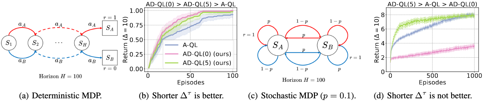

# Boosting Reinforcement Learning with Strongly Delayed Feedback Through Auxiliary Short Delays

    Qingyuan Wu, Simon Sinong Zhan, Yixuan Wang, Yuhui Wang, Chung-Wei Lin, Chen Lv, Qi Zhu, Jürgen Schmidhuber, Chao Huang

Reinforcement learning (RL) is challenging in the common case of delays between events and their sensory perceptions. State-of-the-art (SOTA) state augmentation techniques either suffer from state space explosion or performance degeneration in stochastic environments. To address these challenges, we present a novel Auxiliary-Delayed Reinforcement Learning (AD-RL) method that leverages auxiliary tasks involving short delays to accelerate RL with long delays, without compromising performance in stochastic environments. Specifically, AD-RL learns a value function for short delays and uses bootstrapping and policy improvement techniques to adjust it for long delays. We theoretically show that this can greatly reduce the sample complexity. On deterministic and stochastic benchmarks, our method significantly outperforms the SOTAs in both sample efficiency and policy performance. Code is available at https://github.com/QingyuanWuNothing/ADRL.

## Introduction

Reinforcement learning (RL) has already proved its mettle in complex tasks such as Backgammon (Tesauro, 1994), Go (Silver et al., 2018), MOBA Game (Berner et al., 2019), building control (Xu et al., 2021; 2022), and various cyberphysical systems (Wang et al., 2023a;b; Zhan et al., 2024). Most of the above RL settings assume that the agent’s interaction with the environment is instantaneous, which means that the agent can always execute commands without delay and gather feedback from the environment right away. However, the persistent presence of delays in real-world applications significantly hampers agents’ efficiency, performance, and safety if not handled properly (e.g., introducing estimation error (Hwangbo et al., 2017) and losing reproducibility (Mahmood et al., 2018) in practical robotic tasks). Delay also needs to be considered in many stochastic settings such as financial markets (Hasbrouck & Saar, 2013) and weather forecasting (Fathi et al., 2022). Thus, addressing delays in RL algorithms is crucial for their deployment in real-world timing-sensitive tasks.

Delays in RL can be primarily divided into three categories: observation delay, action delay, and reward delay (Firoiu et al., 2018), depending on where the delay occurs. Among them, observation delay receives considerable attention due to the application-wise generality and the technique-wise challenge: it has been proved to be a superset of action delay (Katsikopoulos & Engelbrecht, 2003; Nath et al., 2021), and unlike well-studied reward delay (Han et al., 2022; Kim & Lee, 2020), it disrupts the Markovian property of systems (i.e., the underlying dynamics depend on an unobserved state and the sequence of actions). In this work, we focus on non-anonymous and constant observation delay under finite Markov Decision Process (MDP) settings, where the delay is known to the agent and always a constant number of time steps (details in Section 3), as in most existing works (Schuitema et al., 2010; Chen et al., 2021).

Promising augmentation-based approaches (Altman & Nain, 1992; Katsikopoulos & Engelbrecht, 2003) transform the delayed RL problem into an MDP by augmenting the latest observed state with a sequence of actions related to the delay, also known as the information state (Bertsekas, 2012). After retrieving the Markovian property, the augmentation-based methods adopt classical RL methods to solve the delayed RL problem properly, such as augmented Q-learning (AQL) (Nath et al., 2021). However, existing augmentationbased methods are plagued by the curse of dimensionality, shown by our toy examples in Fig. 1. Under a deterministic MDP setting (Fig. 1(a)), the original augmented state space grows exponentially with the delays, causing learning inefficiency. The variant of augmentation-based methods BPQL (Kim et al., 2023) approximates the value function based on the delay-free MDP to tackle the inefficiency, which unexpectedly results in excessive information loss. Consequently, it cannot properly handle stochastic tasks (Fig. 1(c)).

---

Figure 1. Our AD-RL method introduces an adjoint task with short delays, enhancing the original augmentation-based method (A-QL) in deterministic MDP (Fig. 1(a)) with delay ∆ = 10, shown in Fig. 1(b). Whereas, in stochastic MDP (Fig. 1(c)) with delay ∆ = 10, a short auxiliary delays may lead to performance improvement (AD-QL(5)) or drop (AD-QL(0)) as shown in Fig. 1(d). BPQL always uses a fixed 0 auxiliary delays, equivalent to AD-QL(0) in these examples. Notably, the optimal auxiliary delays is irregular and task-specific, which we discussed in subsequent experiments in Section 6.

---

To address the aforementioned challenges, we propose a novel technique named Auxiliary-Delayed RL (AD-RL). Our AD-RL is inspired by a key observation that an elaborate auxiliary task with short delays carries much more accurate information than the delay-free case about the original task with long delays, and is still easy to learn. By introducing the notion of delayed belief to bridge an auxiliary task with short delays and the original task with long delays, we can learn the auxiliary-delayed value function and map it to the original one. The changeable auxiliary delays in our AD-RL has the ability to flexibly address the trade-off between the learning efficiency and approximation accuracy error in various MDPs. In toy examples (Fig. 1(a) and Fig. 1(c)) with 10 delays, we compare the performance of A-QL and AD-RL with 0 and 5 auxiliary delays respectively (AD-QL(0) and AD-QL(5)). Our AD-RL not only remarkably enhances the learning efficiency (Fig. 1(b)) but also possesses the flexibility to capture more information under the stochastic setting (Fig. 1(d)). Notably, BPQL is a special variant of our AD-RL with fixed 0 auxiliary delays, resulting in poor performance under the stochastic setting. In Section 4, we develop AD-DQN and AD-SAC, extending from Deep QNetwork and Soft Actor-Critic with our AD-RL framework respectively. Besides, we provide an in-depth theoretical analysis of learning efficiency, performance gap, and convergence in Section 5. In Section 6, we show superior efficacy of our method over the SOTA approaches on the different benchmarks. Our contributions can be summarized as:

- We address the sample inefficiency of the original augmentation-based approaches (denoted as A-RL) and excessive approximation error of the belief-based approaches by introducing AD-RL, which is more efficient with a short auxiliary-delayed task and achieves a theoretical similar performance with A-RL. 
- Adapting the AD-RL framework, we devise AD-DQN and AD-SAC to handle discrete and continuous control tasks, respectively. 
- We analyze the superior sampling efficiency of AD-RL, the performance gap bound between AD-RL and A-RL, and provide the convergence guarantee of AD-RL. 
- We show notable improvements of AD-RL over existing SOTA methods in policy performance and sampling efficiency for deterministic and stochastic benchmarks.

## Preliminaries

### Delay-free RL

The delay-free RL problem is usually modelled as a Markov Decision Process (MDP), defined as a tuple $⟨S, A, P, R, γ, ρ⟩$. An MDP consists of a state space $S$, an action space $A$, a probabilistic transition function $P : S × A × S → [0, 1]$, a reward function $R : S × A → R$, a discount factor $γ ∈ (0, 1)$ and an initial state distribution $ρ$. At each time step $t$, based on the input state $s_t ∈ S$ and the policy $π : S × A → [0, 1]$, the agent has an action $a_t ∼ π(·|st)$ where $a_t ∈ A$, and then the MDP evolves to a new state $s_{t+1} ∈ S$ based on the probabilistic transition function $P$ and the agent receive a reward signal $r_t$ from reward function $R(s_t, a_t)$. We use $d^π_{s_0}$ to denote the visited state distribution starting from $s_0$ based on policy $π$. The objective of the agent in an MDP is to find a policy that maximizes return over the horizon $H$. Given a state $s$, the value function of policy $π$ is defined as
$$
V^\pi(s)=\underset{\substack{s_{t+1} \sim \mathcal{P}\left(\cdot \mid s_t, a_t\right) \\ a_t \sim \pi\left(\cdot \mid s_t\right)}}{\mathbb{E}}\left[\sum_{t=0}^H \gamma^t \mathcal{R}\left(s_t, a_t\right) \mid s_0=s\right].
$$
Similarly, given a state-action pair $(s, a)$, the Q-function of policy $π$ can be defined as
$$
Q^\pi(s, a)=\underset{\substack{s_{t+1} \sim \mathcal{P}\left(\cdot \mid s_s, a_t\right) \\ a_t \sim \pi\left(\cdot \mid s_t\right)}}{\mathbb{E}}\left[\sum_{t=0}^H \gamma^t \mathcal{R}\left(s_t, a_t\right) \left\lvert\, \begin{array}{c}s_0=s \\ a_0=a\end{array}\right.\right].
$$

### Deep Q-Network and Soft Actor-Critic

A widely used off-policy RL method is the **Deep Q-Network (DQN)** (Mnih et al., 2015) with the Q-function $Q_θ : S × A → R$ parameterized by $θ$. It conducts **temporal-difference (TD)** learning based on the Bellman optimality equation. Given the transition data $(s_t, a_t, r_t, s_{t+1})$, DQN updates the Q-function via minimizing TD error.
$$
\nabla_{\theta} \left[ \frac{1}{2} (Q_{\theta(s_t, a_t)} - \mathbb{Y})^2 \right]
$$
where $\mathbb{Y} = r_t + γ \max_{a_{t+1}} Q_θ(s_{t+1}, a_{t+1})$ is the TD target.

Based on the maximum entropy principle, **Soft Actor-Critic (SAC)** (Haarnoja et al., 2018a) provides a more stable actor-critic method by introducing a soft value function. Given transition data $(s_t, a_t, r_t, s_{t+1})$, SAC conducts TD update for the critic using the soft TD target $\mathbb{Y}^{soft}$.

## Problem Setting

## Our Approach: Auxiliary-Delayed RL

## Theoretical Analysis

## Experimental Results

### Benchmarks and Baselines

**Benchmarks.** We choose the Acrobot (Sutton, 1995) and the MuJoCo control suite (Todorov et al., 2012) for discrete and continuous control tasks, respectively. Especially, to investigate the effectiveness of AD-RL in the stochastic MDPs, we adopt the stochastic Acrobot where the input from the agent is disturbed by the noise from a uniform distribution with the probability of 0.1. In this way, the output for the same inputted action from the agent becomes stochastic.

**Baselines.** We select a wide range of techniques as baselines to examine the performance of our AD-RL under different environments. In Acrobot, we mainly compare AD-DQN against the augmented DQN (A-DQN) (Mnih et al., 2015). For the continuous control task, we compared our AD-SAC against existing SOTAs: augmented SAC (A-SAC) (Haarnoja et al., 2018a), DC/AC (Bouteiller et al., 2020), DIDA (Liotet et al., 2022) and BPQL (Kim et al., 2023). In the deterministic Acrobot and Mujoco, the auxiliary delays $∆^τ$ of our AD-RL is set to 0. For computationally fairness, we keep all methods training with the same amount of gradient descent. In other words, the training times of $π$ in our AD-RL is half of that in all baselines, as AD-RL trains $π^τ$ additional to the original task at the same time. The result of each method was obtained using 10 random seeds and its hyper-parameters are in Appendix A.

## Related Work

Early works model a continuous system with observation delay by **Delay Differential Equations (DDE)** (Myshkis, 1955; Cooke, 1963) which have been extensively studied in the control community in terms of **reachability** (Fridman & Shaked, 2003; Xue et al., 2021), **stability** (Feng et al., 2019), and **safety** (Xue et al., 2020). These techniques rely on explicit dynamics models and cannot scale well.

In recent RL approaches, the environment with observation delay is modelled under the **MDP framework** (Altman & Nain, 1992; Katsikopoulos & Engelbrecht, 2003). Unlike the well-studied reward delay problem which raises the credit assignment issue (Sutton, 1984; Arjona-Medina et al., 2019; Wang et al., 2024), the observation delay problem disrupts the Markovian property required for traditional RL. Existing techniques differ from each other in how to tame the delay, including memoryless-based, model-based, and augmentation-based methods. Inspired by the partially observed MDP (POMDP), memory-less approaches, e.g., dQ and dSARSA, were developed in (Schuitema et al., 2010), which learn the policy based on the observed state. However, these methods ignore the non-Markovian property of the problem and could lead to performance degeneration.

Model-based methods retrieve the Markovian property by predicting the unobserved state and then selecting an action based on it. The performance thus highly relies on state generation techniques. Walsh et al. propose a deterministic generative model which is learned via model-based simulation. Similarly, Derman et al. suggested successively applying an approximate forward model to estimate state (Derman et al., 2021). Different stochastic generative models, e.g., the ensemble of Gaussian distributions (Chen et al., 2021) and Transformers (Liotet et al., 2021), were also explored. However, the non-negligible prediction error results in sub-optimal returns (Liotet et al., 2021).

Augmentation-based methods seek to equivalently retrieve the Markov property by augmenting the delay-related information into the state-space (Altman & Nain, 1992). For instance, inspired by multi-step learning, Bouteiller et al. develops a partial trajectory resampling technique to accelerate the learning process (Bouteiller et al., 2020). Additionally, based on imitation learning and dataset aggregation technique, Liotet et al. trains an undelayed expert policy and subsequently generalizes the expert’s behavior into an augmented policy (Liotet et al., 2022). Despite possessing optimality and the Markov property, augmentation-based methods are plagued by the curse of dimensionality in facing tasks with long delays, resulting in learning inefficiency. BPQL (Kim et al., 2023) evaluates the augmented policy by a non-augmented Q-function. However, BPQL suffers from performance loss in stochastic environments. Certain difficult problems can be solved by 'divide and conquer' methods such as the neural sequence chunker (Schmidhuber, 1991a) which learns to hierarchically decompose sequences into predictable subsequences, and the subgoal generator (Schmidhuber, 1991b), which decomposes task into smaller tasks with shorter solutions by learning appropriate subgoals.

## Conclusion

In this work, we focus on RL in environments with delays between events and their observations. Existing methods exhibit learning inefficiency in the presence of long delays and performance degradation in stochastic environments. To address these issues, we propose AD-RL, which leverages auxiliary tasks with short delays to enhance learning. Under the AD-RL framework, we develop AD-DQN and AD-SAC for discrete and continuous control tasks respectively. We further provide a theoretical analysis in terms of sample efficiency, performance gap, and convergence. In both deterministic and stochastic benchmarks, we empirically show that AD-RL achieves new state-of-the-art performance, dramatically outperforming existing methods.

## References

Altman, E. and Nain, P. Closed-loop control with delayed information. *ACM sigmetrics performance evaluation review*, 20(1):193–204, 1992.

Arjona-Medina, J. A., Gillhofer, M., Widrich, M., Un- terthiner, T., Brandstetter, J., and Hochreiter, S. Rudder: Return decomposition for delayed rewards. *Advances in Neural Information Processing Systems*, 32, 2019.

Azar, M. G., Munos, R., Ghavamzadeh, M., and Kappen, H. Speedy q-learning. In *Advances in neural information processing systems*, 2011.

Berner, C., Brockman, G., Chan, B., Cheung, V., Debiak, P., Dennison, C., Farhi, D., Fischer, Q., Hashme, S., Hesse, C., et al. Dota 2 with large scale deep reinforcement learning. *arXiv preprint arXiv:1912.06680*, 2019.

Bertsekas, D. *Dynamic programming and optimal control: Volume I*, volume 4. Athena scientific, 2012.

Bouteiller, Y., Ramstedt, S., Beltrame, G., Pal, C., and Binas, J. Reinforcement learning with random delays. In *International conference on learning representations*, 2020.

Chen, B., Xu, M., Li, L., and Zhao, D. Delay-aware model- based reinforcement learning for continuous control. *Neu- rocomputing*, 450:119–128, 2021.

Cooke, K. L. Differential—difference equations. In *Inter- national symposium on nonlinear differential equations and nonlinear mechanics*, pp. 155–171. Elsevier, 1963.

Derman, E., Dalal, G., and Mannor, S. Acting in delayed environments with non-stationary markov policies. *arXiv preprint arXiv:2101.11992*, 2021.

Even-Dar, E., Mansour, Y., and Bartlett, P. Learning rates for q-learning. *Journal of machine learning Research*, 5 (1), 2003.

Fathi, M., Haghi Kashani, M., Jameii, S. M., and Mahdipour, E. Big data analytics in weather forecasting: A systematic review. *Archives of Computational Methods in Engineer- ing*, 29(2):1247–1275, 2022.

Feng, S., Chen, M., Zhan, N., Fra ̈nzle, M., and Xue, B. Taming delays in dynamical systems: Unbounded veri- fication of delay differential equations. In *International Conference on Computer Aided Verification*, pp. 650–669. Springer, 2019.

Firoiu, V., Ju, T., and Tenenbaum, J. At human speed: Deep reinforcement learning with action delay. *arXiv preprint arXiv:1810.07286*, 2018.

Fridman, E. and Shaked, U. On reachable sets for linear systems with delay and bounded peak inputs. *Automatica*, 39(11):2005–2010, 2003.

Gangwani, T., Lehman, J., Liu, Q., and Peng, J. Learning belief representations for imitation learning in pomdps. In *uncertainty in artificial intelligence*, pp. 1061–1071. PMLR, 2020.

Haarnoja, T., Tang, H., Abbeel, P., and Levine, S. Rein- forcement learning with deep energy-based policies. In *International conference on machine learning*, pp. 1352– 1361. PMLR, 2017.

Haarnoja, T., Zhou, A., Abbeel, P., and Levine, S. Soft actor-critic: Off-policy maximum entropy deep reinforce- ment learning with a stochastic actor. In *International conference on machine learning*, pp. 1861–1870. PMLR, 2018a.

Haarnoja, T., Zhou, A., Hartikainen, K., Tucker, G., Ha, S., Tan, J., Kumar, V., Zhu, H., Gupta, A., Abbeel, P., et al. Soft actor-critic algorithms and applications. *arXiv preprint arXiv:1812.05905*, 2018b.

Han, B., Ren, Z., Wu, Z., Zhou, Y., and Peng, J. Off- policy reinforcement learning with delayed rewards. In *International Conference on Machine Learning*, pp. 8280– 8303. PMLR, 2022.

Hasbrouck, J. and Saar, G. Low-latency trading. *Journal of Financial Markets*, 16(4):646–679, 2013.

Hwangbo, J., Sa, I., Siegwart, R., and Hutter, M. Control of a quadrotor with reinforcement learning. *IEEE Robotics and Automation Letters*, 2(4):2096–2103, 2017.

Kakade, S. and Langford, J. Approximately optimal ap- proximate reinforcement learning. In *Proceedings of the* *Nineteenth International Conference on Machine Learn- ing*, pp. 267–274, 2002.

Katsikopoulos, K. V. and Engelbrecht, S. E. Markov de- cision processes with delays and asynchronous cost col- lection. *IEEE transactions on automatic control*, 48(4): 568–574, 2003.

Kim, J., Kim, H., Kang, J., Baek, J., and Han, S. Belief projection-based reinforcement learning for environments with delayed feedback. In *Thirty-seventh Conference on Neural Information Processing Systems*, 2023.

Kim, J.-G. and Lee, B. Automatic p2p energy trading model based on reinforcement learning using long short-term delayed reward. *Energies*, 13(20):5359, 2020.

Kingma, D. P. and Ba, J. Adam: A method for stochastic optimization. *arXiv preprint arXiv:1412.6980*, 2014.

Kumar, A., Fu, J., Soh, M., Tucker, G., and Levine, S. Stabilizing off-policy q-learning via bootstrapping error reduction. *Advances in Neural Information Processing Systems*, 32, 2019.

Liotet, P., Venneri, E., and Restelli, M. Learning a belief representation for delayed reinforcement learning. In *2021 International Joint Conference on Neural Networks (IJCNN)*, pp. 1–8. IEEE, 2021.

Liotet, P., Maran, D., Bisi, L., and Restelli, M. Delayed reinforcement learning by imitation. In *International Con- ference on Machine Learning*, pp. 13528–13556. PMLR, 2022.

Mahmood, A. R., Korenkevych, D., Komer, B. J., and Bergstra, J. Setting up a reinforcement learning task with a real-world robot. In *2018 IEEE/RSJ International Conference on Intelligent Robots and Systems (IROS)*, pp. 4635–4640. IEEE, 2018.

Mnih, V., Kavukcuoglu, K., Silver, D., Rusu, A. A., Veness, J., Bellemare, M. G., Graves, A., Riedmiller, M., Fidje- land, A. K., Ostrovski, G., et al. Human-level control through deep reinforcement learning. *nature*, 518(7540): 529–533, 2015.

Schmidhuber, J. neural sequence chunkers. 1991a.

Schmidhuber, J. Learning to generate sub-goals for action sequences. In *Artificial neural networks*, pp. 967–972, 1991b.

Schuitema, E., Bus ̧oniu, L., Babusˇka, R., and Jonker, P. Con- trol delay in reinforcement learning for real-time dynamic systems: A memoryless approach. In *2010 IEEE/RSJ In- ternational Conference on Intelligent Robots and Systems*, pp. 3226–3231. IEEE, 2010.

Silver, D., Hubert, T., Schrittwieser, J., Antonoglou, I., Lai, M., Guez, A., Lanctot, M., Sifre, L., Kumaran, D., Grae- pel, T., et al. A general reinforcement learning algorithm that masters chess, shogi, and go through self-play. *Sci- ence*, 362(6419):1140–1144, 2018.

Sutton, R. S. *Temporal credit assignment in reinforcement learning*. University of Massachusetts Amherst, 1984.

Sutton, R. S. Generalization in reinforcement learning: Suc- cessful examples using sparse coarse coding. *Advances in neural information processing systems*, 8, 1995.

Sutton, R. S. and Barto, A. G. *Reinforcement learning: An introduction*. MIT press, 2018.

Tesauro, G. Td-gammon, a self-teaching backgammon pro- gram, achieves master-level play. *Neural computation*, 6 (2):215–219, 1994.

Todorov, E., Erez, T., and Tassa, Y. Mujoco: A physics engine for model-based control. In *2012 IEEE/RSJ inter- national conference on intelligent robots and systems*, pp. 5026–5033. IEEE, 2012.

Villani, C. et al. *Optimal transport: old and new*, volume 338. Springer, 2009.

Walsh, T. J., Nouri, A., Li, L., and Littman, M. L. Learning and planning in environments with delayed feedback. *Autonomous Agents and Multi-Agent Systems*, 18:83–105, 2009.

Wang, Y., Zhan, S., Wang, Z., Huang, C., Wang, Z., Yang, Z., and Zhu, Q. Joint differentiable optimization and verification for certified reinforcement learning. In *Pro- ceedings of the ACM/IEEE 14th International Conference on Cyber-Physical Systems (with CPS-IoT Week 2023)*, pp. 132–141, 2023a.

Wang, Y., Zhan, S. S., Jiao, R., Wang, Z., Jin, W., Yang, Z., Wang, Z., Huang, C., and Zhu, Q. Enforcing hard con- straints with soft barriers: Safe reinforcement learning in unknown stochastic environments. In *International Con- ference on Machine Learning*, pp. 36593–36604. PMLR, 2023b.

Wang, Y., Strupl, M., Faccio, F., Wu, Q., Liu, H., Grudzien ́, M., Tan, X., and Schmidhuber, J. Highway reinforcement learning. *arXiv preprint arXiv:2405.18289*, 2024.

Xu, S., Fu, Y., Wang, Y., O’Neill, Z., and Zhu, Q. Learning- based framework for sensor fault-tolerant building hvac control with model-assisted learning. In *Proceedings of the 8th ACM international conference on systems for energy-efficient buildings, cities, and transportation*, pp. 1–10, 2021.

Xu, S., Fu, Y., Wang, Y., Yang, Z., O’Neill, Z., Wang, Z., and Zhu, Q. Accelerate online reinforcement learning for building hvac control with heterogeneous expert guid- ances. In *Proceedings of the 9th ACM International Con- ference on Systems for Energy-Efficient Buildings, Cities, and Transportation*, BuildSys ’22, pp. 89–98, 2022.

Xue, B., Wang, Q., Feng, S., and Zhan, N. Over-and under- approximating reach sets for perturbed delay differential equations. *IEEE Transactions on Automatic Control*, 66 (1):283–290, 2020.

Xue, B., Bai, Y., Zhan, N., Liu, W., and Jiao, L. Reach-avoid analysis for delay differential equations. In *2021 60th IEEE Conference on Decision and Control (CDC)*, pp. 1301–1307. IEEE, 2021.

Zhan, S. S., Wang, Y., Wu, Q., Jiao, R., Huang, C., and Zhu, Q. State-wise safe reinforcement learning with pixel observations. *6th Annual Learning for Dynamics and Control Conference*, 2024.
