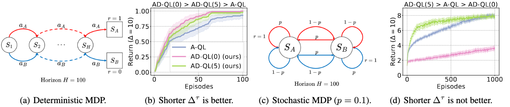

# Boosting Reinforcement Learning with Strongly Delayed Feedback Through Auxiliary Short Delays

    Qingyuan Wu, Simon Sinong Zhan, Yixuan Wang, Yuhui Wang, Chung-Wei Lin, Chen Lv, Qi Zhu, Jürgen Schmidhuber, Chao Huang

Reinforcement learning (RL) is challenging in the common case of delays between events and their sensory perceptions. State-of-the-art (SOTA) state augmentation techniques either suffer from state space explosion or performance degeneration in stochastic environments. To address these challenges, we present a novel Auxiliary-Delayed Reinforcement Learning (AD-RL) method that leverages auxiliary tasks involving short delays to accelerate RL with long delays, without compromising performance in stochastic environments. Specifically, AD-RL learns a value function for short delays and uses bootstrapping and policy improvement techniques to adjust it for long delays. We theoretically show that this can greatly reduce the sample complexity. On deterministic and stochastic benchmarks, our method significantly outperforms the SOTAs in both sample efficiency and policy performance. Code is available at https://github.com/QingyuanWuNothing/ADRL.

## Introduction

Reinforcement learning (RL) has already proved its mettle in complex tasks such as Backgammon (Tesauro, 1994), Go (Silver et al., 2018), MOBA Game (Berner et al., 2019), building control (Xu et al., 2021; 2022), and various cyberphysical systems (Wang et al., 2023a;b; Zhan et al., 2024). Most of the above RL settings assume that the agent’s interaction with the environment is instantaneous, which means that the agent can always execute commands without delay and gather feedback from the environment right away. However, the persistent presence of delays in real-world applications significantly hampers agents’ efficiency, performance, and safety if not handled properly (e.g., introducing estimation error (Hwangbo et al., 2017) and losing reproducibility (Mahmood et al., 2018) in practical robotic tasks). Delay also needs to be considered in many stochastic settings such as financial markets (Hasbrouck & Saar, 2013) and weather forecasting (Fathi et al., 2022). Thus, addressing delays in RL algorithms is crucial for their deployment in real-world timing-sensitive tasks.

Delays in RL can be primarily divided into three categories: observation delay, action delay, and reward delay (Firoiu et al., 2018), depending on where the delay occurs. Among them, observation delay receives considerable attention due to the application-wise generality and the technique-wise challenge: it has been proved to be a superset of action delay (Katsikopoulos & Engelbrecht, 2003; Nath et al., 2021), and unlike well-studied reward delay (Han et al., 2022; Kim & Lee, 2020), it disrupts the Markovian property of systems (i.e., the underlying dynamics depend on an unobserved state and the sequence of actions). In this work, we focus on non-anonymous and constant observation delay under finite Markov Decision Process (MDP) settings, where the delay is known to the agent and always a constant number of time steps (details in Section 3), as in most existing works (Schuitema et al., 2010; Chen et al., 2021).

Promising augmentation-based approaches (Altman & Nain, 1992; Katsikopoulos & Engelbrecht, 2003) transform the delayed RL problem into an MDP by augmenting the latest observed state with a sequence of actions related to the delay, also known as the information state (Bertsekas, 2012). After retrieving the Markovian property, the augmentation-based methods adopt classical RL methods to solve the delayed RL problem properly, such as augmented Q-learning (AQL) (Nath et al., 2021). However, existing augmentationbased methods are plagued by the curse of dimensionality, shown by our toy examples in Fig. 1. Under a deterministic MDP setting (Fig. 1(a)), the original augmented state space grows exponentially with the delays, causing learning inefficiency. The variant of augmentation-based methods BPQL (Kim et al., 2023) approximates the value function based on the delay-free MDP to tackle the inefficiency, which unexpectedly results in excessive information loss. Consequently, it cannot properly handle stochastic tasks (Fig. 1(c)).

---

Figure 1. Our AD-RL method introduces an adjoint task with short delays, enhancing the original augmentation-based method (A-QL) in deterministic MDP (Fig. 1(a)) with delay ∆ = 10, shown in Fig. 1(b). Whereas, in stochastic MDP (Fig. 1(c)) with delay ∆ = 10, a short auxiliary delays may lead to performance improvement (AD-QL(5)) or drop (AD-QL(0)) as shown in Fig. 1(d). BPQL always uses a fixed 0 auxiliary delays, equivalent to AD-QL(0) in these examples. Notably, the optimal auxiliary delays is irregular and task-specific, which we discussed in subsequent experiments in Section 6.

---

To address the aforementioned challenges, we propose a novel technique named Auxiliary-Delayed RL (AD-RL). Our AD-RL is inspired by a key observation that an elaborate auxiliary task with short delays carries much more accurate information than the delay-free case about the original task with long delays, and is still easy to learn. By introducing the notion of delayed belief to bridge an auxiliary task with short delays and the original task with long delays, we can learn the auxiliary-delayed value function and map it to the original one. The changeable auxiliary delays in our AD-RL has the ability to flexibly address the trade-off between the learning efficiency and approximation accuracy error in various MDPs. In toy examples (Fig. 1(a) and Fig. 1(c)) with 10 delays, we compare the performance of A-QL and AD-RL with 0 and 5 auxiliary delays respectively (AD-QL(0) and AD-QL(5)). Our AD-RL not only remarkably enhances the learning efficiency (Fig. 1(b)) but also possesses the flexibility to capture more information under the stochastic setting (Fig. 1(d)). Notably, BPQL is a special variant of our AD-RL with fixed 0 auxiliary delays, resulting in poor performance under the stochastic setting. In Section 4, we develop AD-DQN and AD-SAC, extending from Deep QNetwork and Soft Actor-Critic with our AD-RL framework respectively. Besides, we provide an in-depth theoretical analysis of learning efficiency, performance gap, and convergence in Section 5. In Section 6, we show superior efficacy of our method over the SOTA approaches on the different benchmarks. Our contributions can be summarized as:

- We address the sample inefficiency of the original augmentation-based approaches (denoted as A-RL) and excessive approximation error of the belief-based approaches by introducing AD-RL, which is more efficient with a short auxiliary-delayed task and achieves a theoretical similar performance with A-RL. • Adapting the AD-RL framework, we devise AD-DQN and AD-SAC to handle discrete and continuous control tasks, respectively. • We analyze the superior sampling efficiency of AD-RL, the performance gap bound between AD-RL and A-RL, and provide the convergence guarantee of AD-RL. • We show notable improvements of AD-RL over existing SOTA methods in policy performance and sampling efficiency for deterministic and stochastic benchmarks.