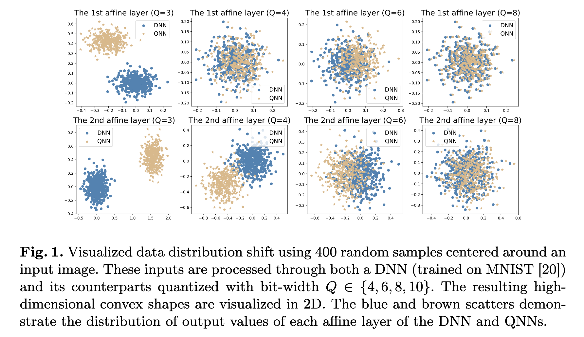

# Certified Quantization Strategy Synthesis for  Neural Networks

Yedi Zhang, Guangke Chen, Fu Song, Jun Sun, and Jin Song Dong

Quantization plays an important role in deploying neural networks on embedded, real-time systems with limited computing and storage resources (e.g., edge devices). It significantly reduces the model storage cost and improves inference efficiency by using fewer bits to represent the parameters. However, it was recently shown that critical properties may be broken after quantization, such as robustness and backdoorfreeness. In this work, we introduce the first method for **synthesizing quantization strategies** that verifiably maintain desired properties after quantization, leveraging a key insight that quantization leads to a data distribution shift in each layer. We propose to compute the preimage for each layer based on which the preceding layer is quantized, ensuring that the quantized reachable region of the preceding layer remains within the preimage. To tackle the challenge of computing the exact preimage, we propose an MILP-based method to compute its under-approximation. We implement our method into a tool Quadapter and demonstrate its effectiveness and efficiency by providing certified quantization that successfully preserves model robustness and backdoor-freeness.

## Introduction

While deep neural networks (DNNs) have achieved notable success in various application domains [5, 31], their deployment on resource-constrained, embedded, real-time systems is currently impeded by their substantial demand for computing and storage resources [27]. Quantization is one of the most popular and promising techniques to address this issue [8, 39]. By storing the full-precision values in a DNN (such as parameters and/or activation values) into low bit-width fixed-point numbers, quantization facilitates the compression of a DNN and leads to a quantized neural network (QNN), making the network more efficient.

While a lot of techniques have been proposed to minimize the loss of accuracy induced by quantization [8, 15, 21, 22, 32, 33, 42, 44, 48], an important sideeffect of quantization is overlooked, that is the risk of breaking desired critical properties, e.g., **robustness** [24, 41] and **backdoor-freeness** [13, 26, 34, 55], thereby raising great concerns, especially when they are deployed in safety-critical applications. While quantization-aware training techniques have been proposed to improve the robustness for a given fixed quantization strategy [23, 24, 41, 43], they fail to provide robustness guarantees. Therefore, it becomes imperative to devise a quantization strategy synthesis technique, ensuring that the resulting QNNs retain specific desired properties. Noting that although various verification methods for QNNs have been proposed [3, 9, 12, 52–54], they exclusively focus on post-hoc analyses rather than synthesis, namely, these methods merely verify or falsify the properties but offer no solutions for those that are falsified.

In this work, we propose the first quantization strategy synthesis method, named `Quadapter`, such that the desired properties are verifiably maintained by the quantization. Given a DNN $\mathcal{N}$ and a property $⟨\mathcal{I}, \mathcal{O}⟩$ where $\mathcal I$ and $\mathcal O$ are the pre- and post-condition for the input and output, our general idea is first to compute the preimage of each layer w.r.t. the output region formed by $\mathcal O$. Then, considering the typical data distribution shift caused by quantization in each layer (cf. Fig. 1), we identify the minimal bit-width for each layer such that the shifted quantized reachable region w.r.t. $\mathcal I$ always remains within the corresponding preimage. This method allows us to derive a quantization strategy for the entire network, preserving the desired property $⟨\mathcal{I}, \mathcal{O}⟩$ after quantization.

A key technical question is how to represent and compute the preimage for each layer effectively and efficiently. In this work, we propose to compute an **under-approximation** of the preimage for each layer and represent it by adapting the abstract domain of DeepPoly [40]. Specifically, we devise a novel Mixed Integer Linear Programming (MILP) based method to propagate the (approximate) preimage layer-by-layer in a backward fashion, where we encode the affine transformation and activation function precisely as linear constraints and compute under-approximate preimage via MILP solving.

We implement our methods as an end-to-end tool `Quadapter` and extensively evaluate our tool on a large set of synthesis tasks for DNNs trained using two widely used datasets MNIST [20] and Fashion-MNIST [46], where the number of hidden layers varies from 2 to 6 and the number of neurons in each hidden layer varies from 100 to 512. The experimental results demonstrate the effectiveness and efficiency of Quadapter in synthesizing certified quantization strategies to preserve **robustness** and **backdoor-freeness**. The quantization strategy synthesized by Quadapter generally preserves the accuracy of the original DNNs (with only minor degradation). We also show that by slightly relaxing the under-approximate preimages of the hidden layers (without sacrificing the overall soundness), Quadapter can synthesize quantization strategies with much smaller bit-widths while preserving the desired properties and accuracy.

The remainder of this paper is organized as follows. 

- Section 2 gives the preliminaries and formulates the problem. 
- Section 3 presents the details of our approach and Section 4 demonstrates its applications. 
- Section 5 reports our experimental results. 
- We discuss related work in Section 6 and finally, Section 7 concludes. 

The source code for our tool, along with the benchmarks, is available in [50], which also includes a long version of the paper containing all missing proofs, design choices, implementation details, and additional experimental results.

## Preliminaries

### Review of DeepPoly

The core idea of DeepPoly is to (approximately) represent the transformation of each layer using an abstract transformer, and compute lower/upper bounds for the output of each neuron. 

- Fix a neuron $\mathbf{x}_{j}^{i}$, its **abstract element** $\mathcal{A}_{j}^{i,\#}$ is given by a tuple $⟨a_{j}^{i,\leq}, a_{j}^{i,\geq}, l_{j}^{i}, u_{j}^{i}⟩$, where 
  - (1) $a_{j}^{i,\leq}$ (resp. ${a_{j}^{i,\geq}}$) is a **symbolic** **lower** (resp. **upper**) **bound** in the form of a **linear combination** of variables from its preceding layers, 
  - (2) $l_{j}^{i}$ (resp. $u_{j}^{i}$) is the **concrete** **lower** (resp. **upper**) **bound** of $\mathbf{x}_{j}^{i}$.
- We denote by $a^{i,\leq}$ (resp. $a^{i,\geq}$) the vector of symbolic bounds $a_{j}^{i,\leq}$  (resp. $a_{j}^{i,\geq}$) of the neurons $\mathbf{x}_{j}^{i}$’s in the $i$-th layer.
- The **concretization** of $\mathcal{A}_{j}^{i,\#}$ is defined as: $γ(\mathcal{A}_{j}^{i,\#}) = \{\mathbf{x}_{j}^{i} ∈ \mathbb{R} | a_{j}^{i,\leq} ≤ \mathbf{x}_{j}^{i} ≤ {a_{j}^{i,\geq}} \}$.

By repeatedly substituting each variable $\mathbf{x}_{j'}^{i'}$ in $a_{j}^{i,\leq}$ (resp. ${a_{j}^{i,\geq}}$) using $a_{j'}^{i',\leq}$ or ${a_{j'}^{i',\geq}}$ according to the coefficient of $\mathbf{x}_{j'}^{i'}$, until no further substitution is possible, $a_{j}^{i,\leq}$ (resp. ${a_{j}^{i,\geq}}$) will be a linear combination over the input variables of the DNN.

- We denote by $f_{j}^{i,\leq}$  and $f_{j}^{i,\geq}$ the resulting linear combinations of $a_{j}^{i,\leq}$ and ${a_{j}^{i,\geq}}$ .
- Then, the concrete lower bound $l_{j}^{i}$ (resp. concrete upper bound $u_{j}^{i}$) of the neuron $\mathbf{x}_{j}^{i}$ can be derived  using the input region $\mathcal{I}$ and $f_{j}^{i,\leq}$ (resp. $f_{j}^{i,\geq}$).
- All the abstract elements $\mathcal{A}_{j}^{i,\#}$ are required to satisfy the domain invariant: $γ(\mathcal{A}_{j}^{i,\#})  ⊆ [l_{j}^{i}, u_{j}^{i}]$.
- For an affine function $\mathbf{x}^i = \mathbf{W}^{i}\mathbf{x}^{i−1} + \mathbf{b}^i$,  the abstract affine transformer sets $a_{j}^{i,\leq} = {a_{j}^{i,\geq}} = \mathbf{W}^{i}\mathbf{x}^{i−1} + \mathbf{b}^i$.

Given the abstract element $\mathcal{A}_{j}^{i,\#} = ⟨a_{j}^{i,\leq}, a_{j}^{i,\geq}, l_{j}^{i}, u_{j}^{i}⟩$ of the neuron $\mathbf{x}_{j}^{i}$ , $\mathcal{A}_{j}^{i+1,\#}$ of the neuron $\mathbf{x}_{j}^{i+1} = \mathrm{ReLU}(\mathbf{x}_{j}^{i})$ have three cases as follows (where $λ_{j}^{i} = \displaystyle \frac{u_{j}^{i} }{u_{j}^{i} − l_{j}^{i}}$): 

1. if  $l_{j}^{i} ≥ 0$, then $a_{j}^{i+1,\leq} = a_{j}^{i+1,\geq} = \mathbf{x}_{j}^{i}$ , $l_{j}^{i+1} = l_{j}^{i} , u_{j}^{i+1} = u_{j}^{i}$;
2. if $u_{j}^{i} ≤ 0$, then  $a_{j}^{i+1,\leq} = a_{j}^{i+1,\geq} = l_{j}^{i+1} = u_{j}^{i+1}= 0$;
3. if $l_{j}^{i} u_{j}^{i} < 0$, then $a_{j}^{i+1,\geq} = λ_{j}^{i} (x_{j}^{i} − λ_{j}^{i})$,  $a_{j}^{i+1,\leq} = κ · x_{j}^{i}$, where $κ ∈ \{0, 1\}$ such that 
   1. the area of resulting shape by $a_{j}^{i+1,\leq}$ and $a_{j}^{i+1,\geq}$ is minimal, 
   2. $l_{j}^{i+1} = κ · l_{j}^{i}$ and 
   3. $u_{j}^{i+1} = u_{j}^{i}$.

?> case 1和case 2不完全disjoint，case 3则跟case 1和case 2的disjoint。

## Our Approach

## Related Work

Numerous methods have been proposed to verify (local) robustness of DNNs (e.g., [7,10,17,40,45,47]) and QNNs (e.g., [9,12,14,19,52–54]). Recently, backdoorfreeness verification for DNNs has been explored leveraging a similar hypothesis testing method [37]. Methods for verifying quantization error bound [30,35,36,51] and Top-1 equivalence [16] between DNNs and QNNs have also been proposed. Except for [16], these works only verify properties without adjusting quantization strategies for falsified properties. The concurrent work [16] iteratively searches for a quantization strategy and verifies Top-1 equivalence after quantization, refining strategies if equivalence is violated. However, it does not support general properties (e.g., backdoor freeness or robustness of multi-label classification [6]). Additionally, [16] requires frequent equivalence verification, which is computationally expensive and inefficient (e.g., networks with 100 neurons in 20 minutes). Comparison experiments are given in [50].

The primary contribution of this work is the first certified quantization strategy synthesis approach utilizing preimage computation as a crucial step. Hence, any (under-approximate) preimage computation methods can be integrated. [28] introduced an exact preimage computation method that, while precise, is impractical due to its exponential time complexity. The inverse abstraction approach [4] circumvents the intractability of exact preimage computation by using symbolic interpolants [2] for compact symbolic abstractions of preimages. However, it still faces scalability issues due to the complexity of the interpolation process. [18,49] considered over-approximate preimages, which are unsuitable for our purpose.