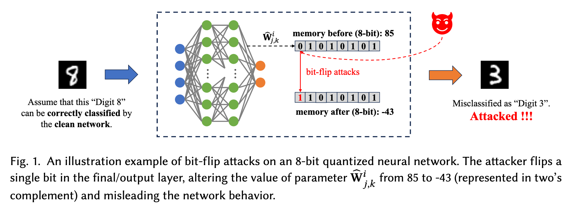

# Verification of Bit-Flip Attacks against Quantized Neural Networks

YEDI ZHANG, National University of Singapore, Singapore 
LEI HUANG, ShanghaiTech University, China 
PENGFEI GAO, ByteDance Inc, China 
FU SONG∗†‡, Key Laboratory of System Software (Chinese Academy of Sciences) and State Key Laboratory of Computer Science, Institute of Software, Chinese Academy of Sciences, China 
JUN SUN, Singapore Management University, Singapore 
JIN SONG DONG, National University of Singapore, Singapore

In the rapidly evolving landscape of neural network security, the resilience of neural networks against bit-flip attacks (i.e., an attacker maliciously flips an extremely small amount of bits within its parameter storage memory system to induce harmful behavior), has emerged as a relevant area of research. Existing studies suggest that quantization may serve as a viable defense against such attacks. Recognizing the documented susceptibility of real-valued neural networks to such attacks and the comparative robustness of quantized neural networks (QNNs), in this work, we introduce BFAVerifier, the first verification framework designed to formally verify the absence of bit-flip attacks or to identify all vulnerable parameters in a sound and rigorous manner. BFAVerifier comprises two integral components: an abstraction-based method and an MILP-based method. Specifically, we first conduct a reachability analysis with respect to symbolic parameters that represent the potential bit-flip attacks, based on a novel abstract domain with a sound guarantee. If the reachability analysis fails to prove the resilience of such attacks, then we encode this verification problem into an equivalent MILP problem which can be solved by off-the-shelf solvers. Therefore, BFAVerifier is sound, complete, and reasonably efficient. We conduct extensive experiments, which demonstrate its effectiveness and efficiency across various network architectures, quantization bit-widths, and adversary capabilities.

## Introduction

Neural networks have demonstrated their potential to achieve human-level performance in multiple domains [17, 53]. However, they are fragile in many ways and can be easily manipulated through various attacks [8, 10–12, 30, 38, 50, 67, 82, 89]. Recently, bit-flip attacks (BFAs) [16, 46, 59, 61] have become a critical class of hardware-based adversarial threats that exploit the physical vulnerability of neural networks. These attacks involve maliciously flipping the bits in the memory cells that store the parameters of a neural network during the deployment stage or changing the real-time activation values during the inference stage. Such attacks have been demonstrated to be feasible in practice for altering the behavior of networks in multiple cases [7, 70, 73]. For instance, RowHammer [54, 69] is one of the most widely used BFA methods which exploits a vulnerability in DRAM by repeatedly accessing memory rows to induce unintended bit flips in adjacent rows, compromising data integrity and security for network parameters. Unlike traditional software-level adversarial attacks, which typically require modifications to input data, BFAs directly target the underlying hardware (e.g., memory), making them particularly effective and difficult to defend against.

Modern DNNs, characterized by their large sizes and 32-bit floating-point parameters, face high computational and storage demands, hindering their deployment on resource-limited embedded devices. Quantization [24, 27, 33], reducing the precision of parameters and/or activation values, offers a promising solution to compress the network, and enables the deployment of quantized neural networks (QNNs) on such devices. For example, the Tesla-FSD chip [78] employs an 8-bit integer format to store all network weights. On the other hand, QNNs have been demonstrated to exhibit greater resilience to BFAs compared to their real-valued counterparts. Specifically, DNNs are highly susceptible to BFAs, with successful attack rates reaching nearly 99% [30], particularly through the manipulation of the exponential bit of compromised parameters. In response, numerous defense strategies have been proposed [39, 48, 68], leveraging parameter quantization to fortify network security against bit-flip attacks. Despite these measures, QNNs remain vulnerable to BFAs, as existing defense techniques fall short of providing formal security assurances against such attacks. This vulnerability underscores the critical need for developing a rigorous verification method to ascertain the absence of BFAs, ensuring the integrity and reliability of QNNs in security-sensitive applications. An illustration example of bit-flip attacks on an 8-bit QNN can be found in Figure 1. 

In this work, we propose the first Bit-Flip Attacks Verification method (BFAVerifier) to efficiently and effectively verify if the bit-flip attacks are absent given a QNN, concerning a given input region, that is also sound and complete. It guarantees the safety of the QNN (such as robustness with respect to a specified input region) when facing potential bit-flip attacks. Given a QNN and an input region, BFAVerifier first conducts a novel reachability analysis to compute an overapproximation of the output range of the network under the potential attacks. Such an analysis generates two outcomes: i) Proved, meaning the absence of the potential BFAs, or ii) Unknown, meaning that it fails to prove the absence of successful attacks possibly due to a conservative approximation of the abstraction throughout the reachability analysis process. If the result is Unknown, we further encode this bit-flip attacks verification problem into an equivalent mixed-integer linear programming (MILP) problem, which can be solved by off-the-shelf solvers.

A key technical challenge is how to conduct the reachability analysis for QNNs, given the interested input region and the threat of potential bit-flip attacks (i.e., some network parameters become symbolic with unknown values). To tackle the challenge, we propose SymPoly, an advanced abstract domain that is built on DeepPoly and is equipped with new abstract transformers specifically designed for handling symbolic parameters. Initially, symbolic parameters are determined with specific parameter intervals for the QNN concerning the potential bit-flip attacks. Subsequent reachability analysis can then be conducted on the modified QNN, which is equipped with symbolic parameters, using SymPoly. To enhance the precision of our reachability analysis results, we also propose two optimization strategies, namely, sub-interval division and binary search strategy, to reduce the precision loss that arises from the abstract transformation concerning large value discrepancies with a single interval.

We implement our method as an end-to-end tool that uses Gurobi [26] as the back-end MILP solver. We extensively evaluate it on a large set of verification tasks using multiple QNNs for the MNIST [41] and ACAS Xu [34] datasets, where the number of hidden neurons varies from 30 to 5120, the quantization bit-width of QNNs ranges from 4 to 8, and the number of bits for bit-flip attacks ranges from 1 to 4 bits. For the reachability analysis, we compare BFAVerifier with a naive method that iteratively generates a new QNN N ′ for each possible bit-flip attack and verifies whether the N ′ still preserves the robustness property within the given input region via DeepPoly. The experimental results show that our method is much more efficient than the naive method (up to 30x faster), successfully proving a similar number of verification tasks and even proving some tasks that return unknown by the naive method. Moreover, with the binary search strategy, we can prove even more tasks. The results also confirm the effectiveness of the MILP-based method, which can help verify many tasks that cannot be solved by SymPoly solely. The experimental results also show that BFAVerifier can verify the absence of BFAs for most of the benign neural networks in our benchmark.

Our contributions are summarized as follows. 

- We propose a novel abstract domain SymPoly to conduct reachability analysis for neural networks with symbolic parameters soundly and efficiently; 
- We introduced the first sound, complete, and reasonably efficient bit-flip attacks verification method BFAVerifier for QNNs by combining SymPoly and an MILP-based method; 
- We implement BFAVerifier as an end-to-end tool and conduct an extensive evaluation of various verification tasks, demonstrating its effectiveness and efficiency. 

## Related Work

In this section, we discuss the existing works closely related to the contributions of this paper.

### Verification of QNNs

In the literature, quantization is broadly categorized into two types [22]: parameter-only quantization and quantization applied to both parameters and activations, leading to significant differences in verification methodologies. For parameter-only quantization, existing white-box DNN verification methods [25, 36, 45, 56, 75] can be applied directly, while primarily leverage constraint-solving or abstraction. A constraint-solving-based method reduces the verification problem into SMT/MILP solving [13, 20, 36, 37, 58]. While sound and complete, they often suffer from scalability limitations. To improve efficiency, various abstraction-based methods are proposed, such as computing a conservative bound of the output range based on different abstract domains [21, 45, 65, 66] or obtaining abstract neural networks, rendering them more suitable for verification [2, 19, 47, 55, 90]. A key distinction between SymPoly and other symbolic or polyhedral abstraction-based approaches in neural network verification is that existing methods abstract only neuron value ranges with fixed parameters, focusing solely on input interval propagation. In contrast, SymPoly extends abstraction to both neuron and parameter value ranges, enabling simultaneous propagation of both input and weight intervals. For QNNs where both parameters and activations are quantized, existing techniques primarily rely on constraint solving [23, 29, 31, 85] or BDD [86, 87], mainly for robustness properties.

### Bit-flip attacks and defense of neural networks

DNNs are notably vulnerable to BFAs, where a single bit alternation can cause severe performance degradation [30, 46, 59]. To mitigate this, QNNs have been explored as a more resilient alternative. Building on the foundational work by Rakin et al. [61], a variety of attack technologies specifically designed for QNNs have then been investigated [7, 42, 49, 69]. These attacks primarily manipulate bits in non-volatile memory, affecting mainly the weights and occasionally the biases (e.g., DRAM), as well as introducing faults into certain neuron activation functions. Common BFA methodologies on networks include the Rowhammer attack [54, 61, 69], clock glitching attack [7], Voltage Frequency Scaling (VFS) attack [62], and lase injection attack [18]. Notably, the Rowhammer, VFS, and laser inject attacks primarily manipulate the binary representations of weights and biases stored in memory [16, 42, 61, 62, 69], while the clock glitching attack specifically disrupts the functionality of the activation functions [7, 49]. The primary objective of defensive techniques is to enhance accuracy and/or robustness in the presence of BFAs. A natural approach to achieving this is to implement countermeasures against the underlying mechanisms that cause attacks, specifically by addressing the attacks from a hardware or system architecture perspective. For example, [80] selectively throttles memory accesses that could otherwise potentially cause Rowhammer bit-flips. Error correction Code [14, 15] is also an effective defense mechanism, typically implemented by the memory controller. However, no existing defense method can provide a definitive guarantee of eliminating all potential risks posed by bit-flip attacks.

### Other related works

[76] proposes a method that formulates certified weight perturbations as an optimization problem, employing a uniform $L_\infty$ norm perturbation within each layer. Their approach focuses on precision at the level of individual inputs, in contrast to ours BFAVerifier, which examines robustness against the BFAs over an input region. Another closely related study [77] investigates probabilistic safety verification of Bayesian networks utilizing weight interval propagation to identify disjoint safe weight spaces based on weight distributions. Although a direct comparison between their work and ours is not feasible due to the differences in network types and verification tasks, their methodology aligns with our naive abstraction approach depicted in Figure 3(a), which, as analyzed, exhibits lower abstract precision compared to the abstraction technique proposed in this work (cf. Figure 3(b)).

## Conclusion and Future Work

We proposed a novel bit-flip attack verification method, BFAVerifier, for QNNs, which is sound, complete, and arguably efficient. To achieve this, we introduced SymPoly, the first abstract domain tailored for networks with symbolic parameters. We implemented BFAVerifier as an end-to-end tool and conducted thorough experiments on various benchmarks with networks of different model sizes and quantization bit-widths, demonstrating its effectiveness and efficiency. 

While SymPoly may not represent the theoretically optimal abstract transformer for convex relaxations of weighted activation functions, it achieves optimal when restricting static abstractions to using only two linear constraints per neuron. Moreover, in terms of convex relaxation, the optimal abstraction transformer may not significantly enhance SymPoly, supported by the observation in [63] that there is an inherent barrier to tight relaxation-based verification methods. However, BFAVerifier could be integrated with complementary verification techniques, such as Branchand-Bound for ReLU splitting [9] and optimizable lower bounds [79], to improve the verification precision and scalability. We consider these promising extensions for future work. 

Our verification approach targets bit-flip attacks on a single parameter. Extending such threat models to attack multiple parameters simultaneously, e.g., two out of n parameters (i.e., m = 2), would involve a straightforward modification of Algorithm 1 by traversing all n 2 = n· (n−1) 2 twoparameter combinations in the for-loop at line 3, leading to exponential computation growth. Hence, although the abstract domain SymPoly can handle multiple symbolic parameters simultaneously, how to efficiently and effectively partition all n 2 combinations into groups for abstractionrefinement poses a significant and non-trivial challenge, which is also a key focus in future work.