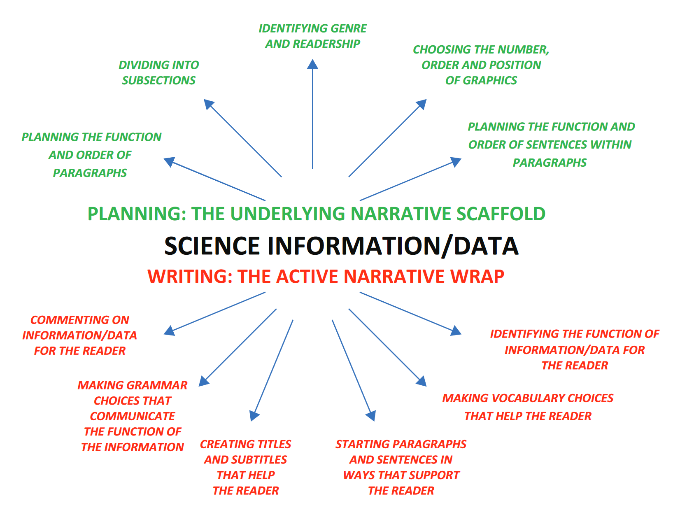

# Introduction

Writing for a reader: wrapping information in a narrative

Science research writing is not simply about presenting information, or even about presenting information clearly. In the first place, information itself is neutral — it has no intrinsic function. If the writer does not explicitly identify and communicate the function of the information and how it relates to the rest of the text, the reader cannot understand why it is there. This interrupts the **flow** of the article and therefore its **readability**. Secondly, science research writing is about developing or changing the reader’s knowledge; this requires a **strong narrative** wrapped around the information that leads logically and patiently to the **conclusions** that the writer wishes to draw.

The writer’s familiarity with the scientific content of the research makes it hard for that writer to see why a narrative is necessary. Prior to writing up, the writer may have been working closely for months with colleagues who share both general and specific knowledge of the topic and the study. Communication within this group is very implicit, since those colleagues all know why, how and what is being done. When the writer is ready to report the study to outsiders, that implicit understanding can no longer be taken for granted and a conscious effort must be made to consider how much can be assumed about the reader’s knowledge and to supplement that knowledge wherever necessary. This is particularly true given the increasingly multidisciplinary nature of science research. The range of researchers and stakeholders wanting access to science research is unpredictable, and it is growing.

A written text is therefore not an information repository, nor is it a naturally-occurring flow of words and sentences; it is an artefact created for a reader. **The aim is not simply to make it possible for the reader to understand; the narrative should be strong enough to make it impossible for the reader NOT to understand.**

**What does a narrative wrap look like?**

To communicate research, the science has to become language. A narrative wrap is the communication scaffold that surrounds the information and makes it intelligible to the reader. Decisions about titles, subheadings, paragraph function and the order of graphics form part of the narrative wrap and create a meaningful framework for the information. Within the text itself, narrative is achieved by the writer commenting on and identifying the function of the information, as well as by less obvious means such as paragraph-entry sentences and choice of verb tense. Tools and guidance for the narrative wrap are discussed throughout the book. The narrative wrap turns science information/data into readable, effective text.

## Planning: The Underlying Narrative Scaffold

**IDENTIFYING GENRE AND READERSHIP.** What am I constructing? A research article, a review article, a grant proposal, a Letter, a poster and a conference abstract are different genres, and each requires a different structure and a different approach to content. Adopting a cut-and-paste approach as you move between different genres results in a shapeless, unfocused text. Before you begin planning your text, reverse engineer a current example of the relevant genre as a model.

**Who might read this? Where do I pitch the information level of my text?** What can I assume that all potential readers know? How quickly can I move into scientific detail? Is the readership of this text likely to become more interdisciplinary in the future?

**DIVIDING INTO SUBSECTIONS.** Are there standard subsections for this type of text in this field? How many subsections are normal in my target articles? What is the average length of these subsections? Does my work fit neatly and logically into these subsections? If not, is the way I have divided my text into subsections more appropriate?

**CHOOSING THE NUMBER, ORDER AND POSITION OF GRAPHICS (i.e. figures, tables, images).** Do I have a good reason for including each graphic? What is the most logical order of my graphics? Where is each one most useful to the reader? Position each graphic within the surrounding text so that it doesn’t interrupt the narrative flow of the text but rather comes at a natural point within the narrative, i.e. exactly when the reader becomes aware of wanting to see it.

**PLANNING THE FUNCTION AND ORDER OF PARAGRAPHS.** Do all my paragraphs have an identifiable function? Is that function clear to the reader? Is the order of paragraphs logical?

**PLANNING THE FUNCTION AND ORDER OF SENTENCES WITHIN PARAGRAPHS.** Do all my sentences have an identifiable function? Is that function clear to the reader, or will they wonder why I have included it here? Does each sentence fit with the overall function of the paragraph? Does each sentence follow logically from the next?

## Writing: The Active Narrative Wrap

**COMMENTING ON INFORMATION/DATA FOR THE READER.** Have I (perhaps incorrectly) assumed that what I think about the information/data is obvious to all potential readers?

**IDENTIFYING THE FUNCTION OF INFORMATION/DATA FOR THE READER.** Have I (perhaps incorrectly) assumed that the function of the information/ data is obvious to all potential readers?

**MAKING GRAMMAR CHOICES THAT COMMUNICATE THE FUNCTION OF THE INFORMATION.** Have I thought about the meaning and impact of the verb tense I am using in each sentence? Have I made grammar choices that resolve (or create) potential ambiguity?

**MAKING VOCABULARY CHOICES THAT HELP THE READER.** Have I considered the needs of the global reader? Am I using vocabulary consistently?

**STARTING PARAGRAPHS AND SENTENCES IN WAYS THAT SUPPORT THE READER.** Does the start of each paragraph help the reader see where I am going in that paragraph? Have I closed the gaps between sentences and started them in a reader-friendly way?

**CREATING TITLES AND SUBTITLES THAT HELP THE READER.** Does my title represent and predict the content or is it just the original ‘working’ title that I haven’t really thought about since I began the project? Is my title a normal length for this type of article? Do my subsection titles work for the entire subsection? Do my subtitles help the reader enter the subsection? Does everything in this subsection ‘fit’ the subtitle? Are my subtitles a normal length for this type of article? Are subtitles normally grammatical sentences in my target articles? Are they supposed to summarise the content of the subsection?

**What strategy is used in this book?**

A classic approach to writing is the genre-based approach, which deals with the structure and content of different types of texts. Genre-based instruction is widely used to teach writing. However, although this approach is good at telling writers what they need to do, it is less effective when it comes to telling them how to do it. For example:

> **WRITING THE DISCUSSION SECTION:** 
>
> Highlight the most significant results, but don’t just repeat what you’ve written in the Results section. HOW DO I DO THAT? Show how these results relate to the original question. HOW? Discuss whether or not your results are consistent with what other investigators have reported. TELL ME HOW! Look at alternative ways to interpret your results. HOW DO I DO THAT? Discuss how your results fit into the big picture. HOW EXACTLY DO I ‘DISCUSS’ THAT?

To answer questions of this type, users of this book are shown how to develop a **reverse-engineering** approach. They are guided towards deconstructing successful current research writing in their own field to create models for their own writing. I have used this reverse-engineering approach at Imperial College London and other universities around the world, analysing thousands of recently-published research articles in a range of STEMM disciplines to construct and validate the basic models, the grammar, and the language lists in the book. The Centre for Academic English at Imperial College London uses the approach to teach STEMM writing to early-stage researchers, as well as training more experienced research writers to develop and apply it. A key advantage of the reverse-engineering approach is that it responds well to the fast-changing nature of research writing: once the strategy becomes familiar, writers can adjust and update their models alongside the next round of changes in science writing and publication platforms.

The aim of this book is to provide a quick, do-it-yourself guide for writing science research for publication. The reverse-engineering approach can be understood quickly, used independently, and tailored to the needs of all STEMM research disciplines and all STEMM texts, including grant proposals, conference abstracts and industry reports. The approach is descriptive rather than prescriptive. Instead of offering advice or telling writers what to do and what not to do, the aim is to begin by generating a highly accurate description of the type of writing each individual writer wants to produce. Accurate descriptions alone, however, do not generate written text — describing something is not the same as being able to do it, so in addition to a description of what to do, the key contribution of this approach is that it then helps the writer to discover how to do it, and to apply that knowledge.

The strategy is as follows:

1. Build a sentence-based/paragraph-based model identifying the functions of a successful text, for example: **This sentence identifies a gap in the research** or **This paragraph maps the contribution of this study onto the literature**. 
2. Mine successful texts for vocabulary to communicate these functions, for example, the words and phrases that identify a gap in the research. 
3. Identify and master the relevant grammar, language and writing skills that achieve these functions, for example, verb tense choices.
4. Continually reinforce, adjust, update and develop 1–3 above via reading in the field.

This book is based on the two most useful things I have learned:

1. Science writing does not need to be stylish or elegant; its primary aim is to communicate clearly and accurately.
1. Good organisation and good writing can compensate for language errors, but error-free language does not compensate for poor organisation or poor writing.

The Units in the book are ordered according to IMRaD (Introduction, Methods, Results, Discussion) for the sake of simplicity. ... 

- Writers often produce the Methods section first, then the Results, then the Discussion/Conclusion, then the Introduction, and finally the Abstract and Title.
- Readers, too, rarely read in IMRaD order.

Where grammar issues are discussed, the aim is not to identify rules for ‘correct’ grammar, but rather to **avoid ambiguity**.