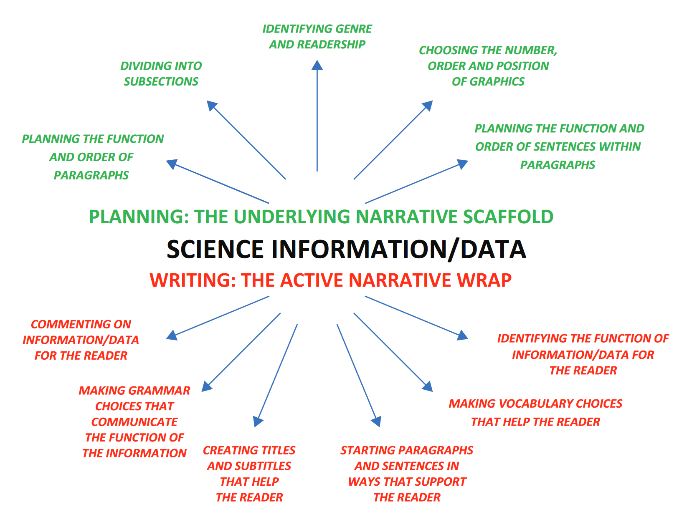

# Introduction

*Writing for a reader: wrapping information in a narrative*

Science research writing is not simply about presenting information, or even about presenting information clearly. ... If the writer does not explicitly identify and communicate the function of the information and how it relates to the rest of the text, the reader cannot understand why it is there.

The writer’s familiarity with the scientific content of the research makes it hard for that writer to see why a narrative is necessary.

A written text is therefore not an information repository, nor is it a naturally-occurring flow of words and sentences; it is an artefact created for a reader. ... the narrative should be strong enough to make it impossible for the reader **NOT** to understand.

... Within the text itself, narrative is achieved by the writer commenting on and identifying the function of the information, as well as by less obvious means such as paragraph-entry sentences and choice of verb tense.

**The Writing Strategy:**

1. Build a sentence-based/paragraph-based model identifying the functions of a successful text, for example: **This sentence identifies a gap in the research** or **This paragraph maps the contribution of this study onto the literature**. 
2. Mine successful texts for vocabulary to communicate these functions, for example, the words and phrases that identify a gap in the research. 
3. Identify and master the relevant grammar, language and writing skills that achieve these functions, for example, verb tense choices.
4. Continually reinforce, adjust, update and develop 1–3 above via reading in the field.

This book is based on the two most useful things I have learned:

1. Science writing does not need to be stylish or elegant; its primary aim is to communicate clearly and accurately.
1. Good organisation and good writing can compensate for language errors, but error-free language does not compensate for poor organisation or poor writing.

The Units in the book are ordered according to IMRaD (Introduction, Methods, Results, Discussion) for the sake of simplicity. ... 

- Writers often produce the Methods section first, then the Results, then the Discussion/Conclusion, then the Introduction, and finally the Abstract and Title.
- Readers, too, rarely read in IMRaD order.

Where grammar issues are discussed, the aim is not to identify rules for ‘correct’ grammar, but rather to **avoid ambiguity**.