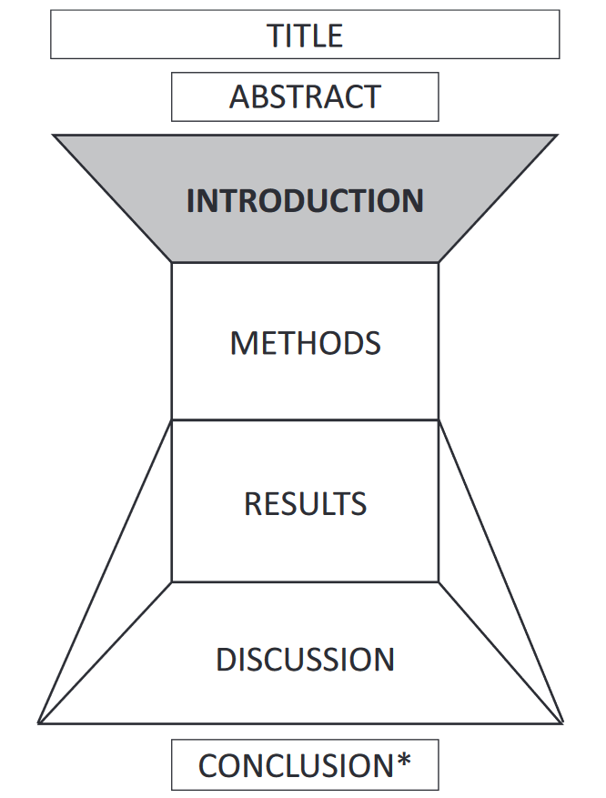

# How to Write the Introduction

## The Structure and Content of the Introduction

Many of the things that are in the Introduction occur — often in reverse order — in the Discussion: 

- At the start of the Introduction you write an opening sentence which enables your reader to ‘get in’ or start your paper/thesis; at the end of the Discussion you ‘get out’ by finding an appropriate way to end.
- During the Introduction you generally present past or current research and/or knowledge about the topic; in the Discussion you show how your study contributes to that research or advances that knowledge.
- At some point in the Introduction you state the specific problem your study focuses on or identify a gap in the existing research that will be filled in your paper; in the Discussion you discuss to what extent you have resolved that problem.
- At the end of the Introduction you need to enable readers to move into the central section (usually the Methods and/or Results); at the end of the central section you need to enable readers to move into the Discussion.

## Building a Model

Based on these questions:

1. How do writers normally start an Introduction? 
2. What is normally included in an Introduction, and in what order? 
3. How do writers normally end an Introduction?

**GENERIC INTRODUCTION MODEL:** 

1. ESTABLISH THE IMPORTANCE OF THE TOPIC/FIELD 
   PROVIDE BACKGROUND FACTUAL INFORMATION 
   PRESENT THE GENERAL PROBLEM AREA/CURRENT RESEARCH FOCUS
2. PRESENT PREVIOUS AND/OR CURRENT RESEARCH AND CONTRIBUTIONS: the research ‘map’
3. LOCATE A GAP IN THE RESEARCH 
   DESCRIBE THE PROBLEM YOU WILL ADDRESS 
   PRESENT YOUR MOTIVATION AND/OR HYPOTHESIS 
   IDENTIFY A RESEARCH OPPORTUNITY
4. DESCRIBE THE PRESENT PAPER, sometimes mentioning aims/results/methods/conclusions, and often including ‘happy’ words

## Useful Words and Phrases

1 ESTABLISHING SIGNIFICANCE 
Look for words and phrases such as ***widespread*** and ***much research in recent years***.

2 PREVIOUS AND/OR CURRENT RESEARCH AND CONTRIBUTIONS 
You can’t spend the rest of your life writing they *did/showed/found*; sometimes you need to be more specific, so look for verbs describing what exactly was done, for example ***calculated, monitored, identified***.

3 GAP/PROBLEM/PREDICTION 
Look for ways to say exactly how previous and/or current research is not yet complete, or has not addressed the problem your paper deals with, for example *inefficient*, *unclear*, *few studies have focused on*...

4 THE PRESENT PAPER 
Look for descriptions of the present paper, its *aims*, *strategy* or *advantages*, for example *we propose, our approach, successful*.

## Language and Writing Skills

### Verb tense choices

#### Choosing between Past Simple and Present Simple

- The **Past Simple** just describes what the authors found in their study; the findings are linked to that study and are not presented as permanent truths. 
- By contrast, choosing the **Present Simple** reflects a belief that the findings are strong and reliable enough to constitute a permanent truth.

**check which verb tense is currently being used for that particular finding or fact.**

#### Choosing between Past Simple and Present Perfect

Use Present Perfect tense if it is **more relevant** to the situation now.

### Linking sentences and information together

The gap between sentences is a dangerous space. Your job as a writer is to close the gap as tightly as possible, so that readers can effortlessly connect one piece of information to the next.

There are **four** ways to start a sentence that make the connection with the previous information clear. 

- One way is to **overlap**, meaning to repeat something from the previous sentence early in the next one.

- A second way is to use a **pro-form** (This method, These systems) to glue the sentences together.

- A third way is not to finish the sentence at all, but to join it to the next sentence with a **semicolon**.

  Joining sentences with a semicolon works well when there are two consecutive sentences that are very closely related, particularly if one of them is **short**.

  Sentence length is an important factor in readability. Sentences with **fewer than 20 words** are understood by 90% of readers at first reading; those with **more than 40 words** are understood by only 10% of readers at first reading. The average sentence length in STEMM research articles is approximately **23**.

- The fourth way is to use a **signal** such as **therefore** or **however** to communicate the function of the sentence.

  It’s *not necessary* (and it looks formulaic) to start every sentence with a signal. Signals are **emphatic**, and starting each sentence with one creates a jerky, overemphatic text. To ensure that the information in your text is logical and easy to follow, consider using **repetition linkage** instead of a signal. This means repeating words across sentences, and particularly at the start of a sentence, to ensure that the reader is carried carefully from one item of information to the next.

### Passive/Active choices

There are three options: using **we/our**, using the **passive**, and restructuring the sentence so that it is in the **active, with a non-human subject** (This study demonstrates that.../Section 1 presents...). The decision of whether to use active, passive or a non-human subject such as This study is connected to **style** and **communicative accuracy**.

With regard to **communicative accuracy**, if you use the active, it is important to keep the referent of we/our consistent.

- we/our may refer to ‘*me and the other authors of this paper*’.
- it may refer to ‘*me, the other authors of this paper and everyone in my research field, possibly even you (the reader) too (our knowledge/when we consider)*’.
- in another sentence it may refer to ‘*me, the other authors of this paper, everyone in my research field, possibly even you...and my grandmother*’, i.e. people in general (we know).

If you are using we/our to refer to people in general, it may be clearer to use a construction with *It (It is known/thought that...)*.

### Paragraphing

Paragraphs are powerful non-verbal text elements that provide a visual and intellectual separation between ideas and concepts. A good paragraph generally has a **single unifying function**. Every sentence and indeed every part of every sentence should be relevant to the central function of the paragraph and drive that function forward.

Check target texts to determine normal paragraph length for that type of text in your field. For example, average paragraph length in research articles is around **150–170 words**; some paragraphs exceed 230 words and others are below 80, but it is unusual to find a research article in which many or most paragraphs are over 230 words or under 80.

## Writing the Introduction

TIPS FOR WRITING A READER-FRIENDLY, EFFECTIVE INTRODUCTION

- Plan the whole Introduction, paragraph by paragraph, before you start creating sentences.
- Remember that your Introduction and the research questions or gap you identify must align with the rest of the article, and particularly the Discussion/Conclusion.
- Don’t jump too fast from very general to very specific information early in the Introduction.
- Remember that your familiarity with the topic may mean that you are not aware of the reader’s need for background information, particularly if you are aiming for an interdisciplinary audience.
- Consider the density of the information and try to match eye-reading speed with brain-processing speed. This may mean using examples or paraphrases to slow down the flow of content, expanding concentrations of information, or breaking long sentences into smaller, well-linked units.
- The way a paragraph starts and links to the previous paragraph is key to the success of that paragraph and the text as a whole. Think about the best way to start each paragraph before you begin typing it.
- The way a sentence starts and links to the previous sentence is key to the success of that sentence, that paragraph, and the text as a whole. Think about the best way to start each sentence before you begin typing it.
- Be aware that you will always understand what you have written, but you’re not writing for yourself — what is important is that your reader can understand it. Write for a reader, not for a colleague.