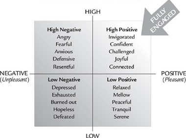
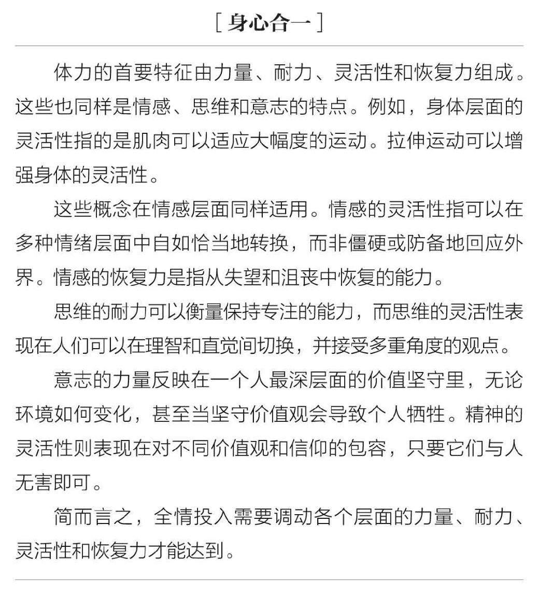

# Fully Engaged: Energy, Not Time, Is Our Most Precious Resource

We live in digital time. Our rhythms are rushed, rapid fire and relentless, our days carved up into bits and bytes. We celebrate breadth rather than depth, quick reaction more than considered reflection. We skim across the surface, alighting for brief moments at dozens of destinations but rarely remaining for long at any one. We race through our lives without pausing to consider who we really want to be or where we really want to go. We’re wired up but we’re melting down.

我们生活在数字时代，节奏如电光火石般迅猛，似乎永不间断，时间被打碎成了比特和字节。我们对广度的热爱超过了对深度的关注，注重反应速度却不愿深入思考。我们流连于事物的表象，满足浅尝辄止的片刻欢愉，却几乎从不久留。我们在人生的道路上争先恐后，却吝于用片刻思考目标或方向。我们事务缠身，却又总是筋疲力尽。

Most of us are just trying to do the best that we can. When demand exceeds our capacity, we begin to make expedient choices that get us through our days and nights, but take a toll over time. We survive on too little sleep, wolf down fast foods on the run, fuel up with coffee and cool down with alcohol and sleeping pills. Faced with relentless demands at work, we become short-tempered and easily distracted. We return home from long days at work feeling exhausted and often experience our families not as a source of joy and renewal, but as one more demand in an already overburdened life.

大多数人仅仅希望竭尽所能，而当生活的要求超出能力所及，我们会着眼现状提出权宜之计，或许在短期内会运作良好，而负面效应却往往在长期过程中慢慢浮现。我们吝惜睡眠，用外带快餐填饱肚子，用咖啡提神，用酒精和安眠药放松身心。面对工作的无尽索取，我们变得暴躁易怒，注意力也难以集中。结束漫长的一天，我们拖着疲惫的身体回到家里，又常常发觉家庭也不再是欢乐和力量的源泉，只是为超负荷运转的生活又添一项负担。

We walk around with day planners and to-do lists, Palm Pilots and BlackBerries, instant pagers and pop-up reminders on our computers—all designed to help us manage our time better. We take pride in our ability to multitask, and we wear our willingness to put in long hours as a badge of honor. The term 24/7 describes a world in which work never ends. We use words like obsessed, crazed and overwhelmed not to describe insanity, but instead to characterize our everyday lives. Feeling forever starved for time, we assume that we have no choice but to cram as much as possible into every day. But managing time efficiently is no guarantee that we will bring sufficient energy to whatever it is we are doing.

我们随身带着日程表和待办事项清单，揣着掌上电脑和黑莓手机，即时通讯和提醒窗口布满电脑屏幕。这些都是原本旨在帮助人类更好管理时间的伟大发明。我们为一心多用的能力自豪，将长时间伏案工作视作荣誉徽章。“全天候”可以描述这个连轴转的世界。“痴迷”“疯狂”“崩溃”不再是心理学术语，如今已变成了日常生活的标签词。时间永远不够用，我们的唯一办法只有在每一天里最大程度地生挤硬塞。然而新的问题出现了，再高效的时间管理也无法确保我们有足够的精力处理每一件事。

Consider these scenarios:

* You attend a four-hour meeting in which not a single second is wasted—but during the final two hours your energy level drops off precipitously and you struggle to stay focused. 你参加了一场长达4小时的会议，从头到尾没有一句废话——但是刚到下半场你的精力就急剧下降，连集中注意力都变得极其困难。
* You race through a meticulously scheduled twelve-hour day but by midday your energy has turned negative—impatient, edgy and irritable. 你精心规划了一天的12小时，但是到了中午你的精力就走向了负面，毫无耐心，焦躁易怒。
* You set aside time to be with your children when you get home at the end of the day, but you are so distracted by thoughts about work that you never really give them your full attention. 晚上你专门为孩子腾出时间，却仍旧被工作的思绪烦扰，不能专心陪孩子。
* You remember your spouse’s birthday—your computer alerts you and so does your Palm Pilot—but by the evening, you are too tired to go out and celebrate. 日历和掌上电脑都提醒你今天是爱人的生日，傍晚来临时你却因为疲倦失去了庆祝的心力。

**Energy, not time, is the fundamental currency of high performance.**

精力，而非时间，是高效表现的基础

This insight has revolutionized our thinking about what drives enduring high performance. It has also prompted dramatic transformations in the way our clients manage their lives, personally and professionally. Everything they do—from interacting with colleagues and making important decisions to spending time with their families—requires energy. Obvious as this seems, we often fail to take into account the importance of energy at work and in our personal lives. Without the right quantity, quality, focus and force of energy, we are compromised in any activity we undertake.

这条理论革命性地刷新了我们对高效表现来源的认知，也极大地转变了我们的客户管理工作和生活的方式。每件事情——不管是与同事的互动、做出重要的决定，还是陪伴家人，都需要精力。精力的重要性看似显而易见，却经常被人们在工作和个人生活中忽略。如果精力的多少、质量、集中程度和力度不恰当，我们所做的一切事情效果都会大打折扣。

Every one of our thoughts, emotions and behaviors has an energy consequence, for better or for worse. The ultimate measure of our lives is not how much time we spend on the planet, but rather how much energy we invest in the time that we have. The premise of this book—and of the training we do each year with thousands of clients—is simple enough:

我们所有的想法、情感和行为都对精力有积极或消极的影响。生命的终极质量并非由寿命衡量，而是由我们如何在拥有的时间里投资精力决定。本书的基础概念简明易懂，我们每年为数千位客户制定的基本培训理念同样如此：

**Performance, health and happiness are grounded in the skillful management of energy.**

有技巧的精力管理是高度表现、健康和幸福的基础

There are undeniably bad bosses, toxic work environments, difficult relationships and real life crises. Nonetheless, we have far more control over our energy than we ordinarily realize. The number of hours in a day is fixed, but the quantity and quality of energy available to us is not. It is our most precious resource. The more we take responsibility for the energy we bring to the world, the more empowered and productive we become. The more we blame others or external circumstances, the more negative and compromised our energy is likely to be.

人们不可避免会遇到差劲的老板，糟糕的工作环境，困难的恋爱关系，以及现实中生活中的种种危机。尽管如此，我们依旧可以比现在更好地掌控精力。一天只有固定的24小时，但精力的储备与质量却没有定数。精力是我们最宝贵的资源。我们越是本着负责的态度对待它，越能变得多产而高效。反之，越是怨天尤人，我们的精力会变得越是消极、质量低下。

If you could wake up tomorrow with significantly more positive, focused energy to invest at work and with your family, how significantly would that change your life for the better? As a leader and a manager, how valuable would it be to bring more positive energy and passion to the workplace? If those you lead could call on more positive energy, how would it affect their relationships with one another, and the quality of service that they deliver to customers and clients?

如果明天早晨你醒来的时候，带着对工作和家人的积极、专注的精力，你的状态会有多大程度改善？如果你是领导或经理，积极的精力和激情将会给公司环境精力带来多大的价值？如果员工们拥有更多的积极精力，同事关系、客户服务质量又会有多大的提升？

Leaders are the stewards of organizational energy—in companies, organizations and even in families. They inspire or demoralize others first by how effectively they manage their own energy and next by how well they mobilize, focus, invest and renew the collective energy of those they lead. The skillful management of energy, individually and organizationally, makes possible something that we call full engagement.

领导是组织精力的统筹人，在公司、机构及家庭中均是如此。要想树立威信，首先要依靠个人精力管理，然后才是调动、集中、投入和发展团队集体的精力。依靠对个人和团体的有效精力管理，我们才能实现全情投入。

To be fully engaged, we must be physically energized, emotionally connected, mentally focused and spiritually aligned with a purpose beyond our immediate self-interest. Full engagement begins with feeling eager to get to work in the morning, equally happy to return home in the evening and capable of setting clear boundaries between the two. It means being able to immerse yourself in the mission you are on, whether that is grappling with a creative challenge at work, managing a group of people on a project, spending time with loved ones or simply having fun. Full engagement implies a fundamental shift in the way we live our lives.

全情投入需要身体活跃、情感联动、思维集中，并且达到超出个人短期利益的意志高度。它意味着你在早晨对工作充满期待，晚上高高兴兴地回家，能够在工作和私人生活之间画上清晰的界线。它意味着全心投入手头的事务，不管是应对工作挑战、管理团队、陪伴所爱之人，还是娱乐消遣。全情投入会从根本上颠覆我们的生活方式。

Less than 30 percent of American workers are fully engaged at work, according to data collected by the Gallup Organization in early 2001. Some 55 percent are “not engaged.” Another 19 percent are “actively disengaged,” meaning not just that they are unhappy at work, but that they regularly share those feelings with colleagues. The costs of a disengaged workforce run into the trillions of dollars. Worse yet, the longer employees stay with organizations, the less engaged they become. Gallup found that after six months on the job, only 38 percent of employees remain engaged. After three years, the figure drops to 22 percent. Think about your own life. How fully engaged are you at work? What about your colleagues or the people who work for you?

根据盖洛普公司2001年初的调查数据显示，只有不到30%的美国劳动者在工作时能够“全情投入”，约55%的人“心不在焉”，还有19%的人“行为消极”，即不仅对工作不满，还经常向同事诉说感受。消极的劳动力可能导致数万亿美元的损失，更糟的是，员工在企业的时间越久，对于工作的投入就越低。盖洛普公司另一份调查发现，入职六个月后，仅有38%的人还能全情投入，而入职3年后，这一数字降至22%。想想自己的工作状态吧，你在工作中能够投入多少？你的同事如何？下属又如何？

> **THE POWER OF FULL ENGAGEMENT**
>
>
> | Old Paradigm                   | New Paradigm                 |
> | ------------------------------ | ---------------------------- |
> | Manage time                    | Manage energy                |
> | Avoid stress                   | Seek stress                  |
> | Life is a marathon             | Life is a series of sprints  |
> | Downtime is wasted time        | Downtime is productive time  |
> | Rewards fuel performance       | Purpose fuels performance    |
> | Self-discipline rules          | Rituals rule                 |
> | The power of positive thinking | The power of full engagement |

During the past decade, we have grown increasingly disturbed by the myriad ways in which our clients squander and misuse their energy. These include everything from poor eating habits and failure to seek regular recovery and renewal to negativity and poor focus. The lessons we seek to impart in this book have proved to be profoundly useful in managing our own lives and in leading our own organization. When we follow the energy management principles and the change process that we share on these pages, we find that we are far more effective, both personally and professionally, in our own actions and in our relationships. When we fall short, we see the costs immediately, in our performance and in our impact on others. The same is true of tens of thousands of clients with whom we have worked. Learning to manage energy more efficiently and intelligently has a unique transformative power, both individually and organizationally.

在过去十年中，客户对精力的误用和挥霍总能一再刷新我们的认知——不良的饮食习惯，无效的恢复和重振精力方式，注意力不集中等。我们希望在本书传达的经验已经过多次证明，在个人与团体方面均行之有效。只要遵循书中精力管理原则和方法，你会发现，自己生活、工作、处事和情感等各方面的表现会更好。我们数以万计的客户都曾亲身经历过，一旦不能全情投入，会立刻损害个人表现，并对他人带来不良影响。学习如何高效、明智地管理精力，会为个人和组织带来革命性的改变。

## A LIVING LABORATORY

We first learned about the importance of energy in the living laboratory of professional sports. For thirty years, our organization has worked with world-class athletes, defining precisely what it takes to perform consistently at the highest levels under intense competitive pressures. Our initial clients were tennis players. Over eighty of the world’s best players have been through our laboratory, among them Pete Sampras, Jim Courier, Arantxa Sanchez-Vicario, Tom and Tim Gullikson, Sergi Bruguera, Gabriela Sabatini and Monica Seles.

我们对精力重要性的认知始于对专业体育的案例研究。 30年来，我们公司与世界顶级运动员合作，精确剖析是什么让运动员在高强度竞争压力下保持高水准的表现。前期我们的主要合作伙伴是网球运动员，超过80位世界顶尖选手都曾参与我们的研究，这当中包括桑普拉斯、考瑞尔、桑吉丝、古利克森兄弟、布鲁格拉、萨巴蒂尼和塞莱斯等。

These players typically came to us when they were struggling, and our interventions have often produced dramatic turnarounds. After we worked with them, Sanchez-Vicario won the U.S. Open for the first time and became the top-ranked player in the world in both singles and doubles, and Sabatini won her first and only U.S. Open title. Bruguera went from number 79 in the world to the top ten and won two French Open titles. We went on to train a broad range of professional athletes, among them golfers Mark O’Meara and Ernie Els; hockey players Eric Lindros and Mike Richter; boxer Ray “Boom Boom” Mancini; basketball players Nick Anderson and Grant Hill; and speed skater Dan Jansen, who won his only Olympic gold medal following two intensive years of training with us.

这些运动员常常在陷入困境时寻求我们的帮助，经过我们的调整，他们的情况通常会有显著好转。与我们合作之后，桑吉丝首次获得美国公开赛冠军，单打、双打世界排名均升至首位；萨巴蒂尼获得首次也是唯一一次美国公开赛冠军；布鲁格拉的世界排名从79位升至前十，并赢得两次法国公开赛冠军。我们陆续培训了一批专业运动员，包括高尔夫选手欧米拉和艾尔斯，曲棍球选手林德罗斯和里克特，拳王曼奇尼，篮球明星安德森和希尔。速滑明星詹森经过我们两年密集培训，摘取了职业生涯中唯一一块奥运会金牌。

What makes our intervention with athletes unique is that we spend no time focusing on their technical or tactical skills. Conventional wisdom holds that if you find talented people and equip them with the right skills for the challenge at hand, they will perform at their best. In our experience that often isn’t so. Energy is the X factor that makes it possible to fully ignite talent and skill. We never addressed how Monica Seles hit her serves, or how Mark O’Meara drove the ball, or how Grant Hill shot his free throws. All of these athletes were extraordinarily gifted and accomplished when they came to us. We focused instead on helping them to manage their energy more effectively in the service of whatever mission they were on.

我们与运动员合作成功的秘诀并非在于技巧或战略。人们通常认为，才华横溢的人面对挑战时只要配备足够技能，就能够发挥出最好的水平。从我们的经验来看却并非如此。精力才是完全点燃才华和技能的正解。我们从不探究塞莱斯如何发球，欧米拉如何开球，希尔如何罚球，这些运动员在此之前已经具备了超人的才华，并已有所成就。相反，我们致力于帮助他们更有效地管理精力，以应对眼前的各类挑战。

Athletes turned out to be a demanding experimental group. They aren’t satisfied with inspirational messages or clever theories about performance. They seek measurable, enduring results. They care about batting averages, free-throw percentages, tournament victories and year-end rankings. They want to be able to sink the putt on the eighteenth hole in the final round, hit the free throw when the game is on the line, catch the pass in a crowd with a minute to go on the clock. Anything else is just talk. If we couldn’t deliver results for athletes, we didn’t last very long in their lives. We learned to be accountable to the numbers.

运动员是个要求严苛的群体。他们并不满足于激励口号或是有关表现的漂亮理论，他们需要的是可以量化的，持久的解决方案；他们关心击球率、罚中数、联赛胜利和年终排名；他们想在最后一局第十八洞前一杆入洞，在千钧一发之际罚球命中，在哨声响起前1分钟突破重围接到队友的传球。除了这些，其他都是空话。如果不能为运动员带来预期效果，我们在他们的生活中存在的时间也不会长久，我们学会了为这些数字负责。

As word spread about our success in sports, we received numerous requests to export our model into other high-performance venues. We began working with FBI hostage rescue teams, U.S. marshals, and critical-care workers in hospitals. Today, the bulk of our work is in business—with executives and entrepreneurs, managers and sales people, and more recently with teachers and clergy, lawyers and medical students. Our corporate clients include Fortune 500 companies such as Estée Lauder, Salomon Smith Barney, Pfizer, Merrill Lynch, Bristol-Myers Squibb, and the Hyatt Corporation.

我们在体育界的成就有口皆碑，也接到无数请求，希望把培训模式引入其他需要高效表现的领域。于是我们开始与联邦调查局人质解救小组、法警、医院重症监护工作者合作。时至今日，我们的合作主体已广泛扩展到高层管理者、创业者、经理人和销售员，最近还增加了教师、牧师、律师和医学院学生。我们的企业客户名单包含《财富》世界500强公司，比如雅诗兰黛、所罗门美邦、辉瑞制药、美林证券、百时美施贵宝和凯悦酒店集团等。

Along the way, we discovered something completely unexpected: The performance demands that most people face in their everyday work environments dwarf those of any professional athletes we have ever trained.

在发展的过程中，我们意外发现：运动员的精力需求跟普通人日常生活的精力需求相比简直相形见绌。

How is that possible?

这怎么可能？

It’s not as anomalous as it seems. Professional athletes typically spend about 90 percent of their time training, in order to be able to perform 10 percent of the time. Their entire lives are designed around expanding, sustaining and renewing the energy they need to compete for short, focused periods of time. At a practical level, they build very precise routines for managing energy in all spheres of their lives—eating and sleeping; working out and resting; summoning the appropriate emotions; mentally preparing and staying focused; and connecting regularly to the mission they have set for themselves. Although most of us spend little or no time systematically training in any of these dimensions, we are expected to perform at our best for eight, ten and even twelve hours a day.

这一结论看似反常，其实大有深意。专业运动员通常90%的时间都在训练，为了在剩余10%时间里取得结果。他们的生活围绕着增强、保持和恢复精力的主题，为短期的高强度竞技做准备。以实用为出发点，他们精确规划的日常作息也为各方面的精力管理设定了严格的程序——吃饭睡觉，训练休息，情绪控制，心理准备，保持专注，定期自查目标完成情况，等等。然而，大多数普通人从未接受过类似的系统训练，每天仍需要做到8～12小时的最佳表现。

Most professional athletes also enjoy an off-season of four to five months a year. After competing under extraordinary pressure for several months, a long off-season gives athletes the critical time that they need for rest and healing, renewal and growth. By contrast, your “off season” likely amounts to a few weeks of vacation a year. Even then, you probably aren’t solely resting and recovering. More likely, you are spending at least some of your vacation time answering email, checking your voice mail and ruminating about your work.

大多数专业运动员每年得以享受4～5个月的淡季休假。经过数月的高压力、高强度的竞技比赛，淡季休假是运动员休整、疗伤和成长的重要时期。相反，普通人的“淡季休假”加起来也不过一年几周的假期。即使在休假期间，你也不见得完全在休息和恢复，因为总需要抽出时间回复邮件、查收语音信息，思考下一步的工作。

Finally, professional athletes have an average career span of five to seven years. If they have handled their finances reasonably well, they are often set for life. Few of them are under pressure to run out and get another job. By contrast, you can probably expect to work for forty to fifty years without any significant breaks.

最后，专业运动员的平均职业生涯为5～7年不等。如果财务管理妥当，基本可以保证一生衣食无忧，只有极少数人会顶着压力外出奔波再找一份工作。相比之下，你可能要面对40～50年日复一日的工作生活。

Given these stark facts, what makes it possible to keep performing at your best without sacrificing your health, your happiness and your passion for life?

在这样冰冷而残酷的现实下，我们如何才能保持最佳表现，同时又不损害健康、幸福和对生活的热情呢？

**You must become Fully Engaged.**

你一定要全情投入

The challenge of great performance is to manage your energy more effectively in all dimensions to achieve your goals. Four key energy management principles drive this process. They lie at the heart of the change process that we will describe in the pages ahead, and they are critical for building the capacity to live a productive, fully engaged life.

优秀表现的难度在于，它需要从各个方面更有效地管理精力，达到最终目标。这个过程由四条关键的精力管理法则驱动，它们是整个转变过程的核心，对于建立高产出的、全情投入的能力具有至关重要的作用。

**PRINCIPLE 1: Full engagement requires drawing on four separate but related sources of energy: physical, emotional, mental and spiritual.**

原则一：全情投入需要调动四种独立且相关联的精力源：体能，情感，思维和意志

Human beings are complex energy systems, and full engagement is not simply one-dimensional. The energy that pulses through us is physical, emotional, mental, and spiritual. All four dynamics are critical, none is sufficient by itself and each profoundly influences the others. To perform at our best, we must skillfully manage each of these interconnected dimensions of energy. Subtract any one from the equation and our capacity to fully ignite our talent and skill is diminished, much the way an engine sputters when one of its cylinders misfires.

人类是一个复杂而庞大的精力系统，全情投入也并非只有一种维度。流过我们身体的精力同时需要体能上、情感上、思维上以及意志上的动力，每一种动力都很重要，而每一种都无法构成完整的精力，同时又对其他三种有着深刻影响。为了发挥出最佳表现，我们必须有技巧地管理这些互联互通的精力维度。若从中抽掉任何一面，就不能完全调动我们的才华和技能，好似发动机的一个气缸熄火就会噼啪作响。

Energy is the common denominator in all dimensions of our lives. Physical energy capacity is measured in terms of quantity (low to high) and emotional capacity in quality (negative to positive). These are our most fundamental sources of energy because without sufficient high-octane fuel no mission can be accomplished. The accompanying chart depicts the dynamics of energy from low to high and from negative to positive. The more toxic and unpleasant the energy, the less effectively it serves performance; the more positive and pleasant the energy, the more efficient it is. Full engagement and maximum performance are possible only in the high positive quadrant.

精力贯穿生活的各个方面。体能精力有高有低，情感精力有正有负。这是我们最基本的精力源，若没有优质的燃料，任何事情都做不好。下图描述了体能由低到高、情绪从负面到正面的变化。精力越是消极、情绪越低落，表现就越糟糕；反之，精力越积极、情绪越高涨，表现也会越高效。全情投入和最佳表现只可能存在于“高-正面”的象限。

> **THE DYNAMICS OF ENERGY**
>
> 

The importance of full engagement is most vivid in situations where the consequences of disengagement are profound. Imagine for a moment that you are facing open-heart surgery. Which energy quadrant do you want your surgeon to be in? How would you feel if he entered the operating room feeling angry, frustrated and anxious (high negative)? How about overworked, exhausted and depressed (low negative)? What if he was disengaged, laid back and slightly spacey (low positive)? Obviously, you want your surgeon energized, confident and upbeat (high positive).

心不在焉会导致严重后果时，全情投入的重要性不言自明。想象你是一位正要接受心脏手术的病人，你希望你的手术医师属于哪个精力象限？如果他踏进手术室时愤怒、沮丧、焦虑（高-负面），你会怎么想？如果他带着过度工作的筋疲力尽和抑郁的情绪（低-负面）呢？如果他心不在焉、懒懒散散、甚至有点迷糊（低-正面）呢？毫无疑问，你一定会希望你的医师充满活力、自信满满又积极向上（高-正面）。

Imagine that every time you yelled at someone in frustration or did sloppy work on a project or failed to focus your attention fully on the task at hand, you put someone’s life at risk. Very quickly, you would become less negative, reckless and sloppy in the way you manage your energy. We hold ourselves accountable for the ways that we manage our time, and for that matter our money. We must learn to hold ourselves at least equally accountable for how we manage our energy physically, emotionally, mentally and spiritually.

想想每一次由于你因为沮丧而向别人大喊大叫，或是工作粗枝大叶，或是对手头工作精神不集中，别人的生命可能就处于危险当中。通过管理精力，你很快就会从低落、鲁莽和草率中走出来。我们有责任管理时间和金钱，也同样有责任管理体能，情感，思维和意志的精力。

**PRINCIPLE 2: Because energy capacity diminishes both with overuse and with underuse, we must balance energy expenditure with intermittent energy renewal.**

**原则二：因为使用过度和使用不足都会削弱精力，必须不时更新精力以平衡消耗**

> 
<strong>THE MIND AND BODY ARE ONE</strong>

>
> The primary markers of physical capacity are strength, endurance, flexibility and resilience. These are precisely the same markers of capacity emotionally, mentally and spiritually. Flexibility at the physical level, for example, means that the muscle has a broad range of motion. Stretching increases flexibility.
>
> The same is true emotionally. Emotional flexibility reflects the capacity to move freely and appropriately along a wide spectrum of emotions rather than responding rigidly or defensively. Emotional resilience is the ability to bounce back from experiences of disappointment, frustration and even loss.
>
> Mental endurance is a measure of the ability to sustain focus and concentration over time, while mental flexibility is marked by the capacity to move between the rational and the intuitive and to embrace multiple points of view.
>
> Spiritual strength is reflected in the commitment to one’s deepest values, regardless of circumstance and even when adhering to them involves personal sacrifice. Spiritual flexibility, by contrast, reflects the tolerance for values and beliefs that are different than one’s own, so long as those values and beliefs don’t bring harm to others.
>
> In short, to be fully engaged requires strength, endurance, flexibility and resilience in all dimensions.
>
> 

We rarely consider how much energy we are spending because we take it for granted that the energy available to us is limitless. In fact, increased demand progressively depletes our energy reserves—especially in the absence of any effort to reverse the progressive loss of capacity that occurs with age. By training in all dimensions we can dramatically slow our decline physically and mentally, and we can actually deepen our emotional and spiritual capacity until the very end of our lives.

人们极少考虑我们消耗了多少精力储备，总是想当然地认为它能够随用随取。事实上，不断增长的需求逐步耗尽了我们的精力储备——尤其由于我们不对随着年龄出现的能力减退做任何补救。通过全方位的训练，我们可以极大地减缓身体和思维的衰退，并切实地深化情感和精神的能力，直至生命的尽头。

By contrast, when we live highly linear lives—spending far more energy than we recover or recovering more than we spend—the eventual consequence is that we break down, burn out, atrophy, lose our passion, get sick and even die prematurely. Sadly, the need for recovery is often viewed as evidence of weakness rather than as an integral aspect of sustained performance. The result is that we give almost no attention to renewing and expanding our energy reserves, individually or organizationally.

相反，如果我们按照高度单线化的方式生活，即消耗的精力超过恢复的总量，或是恢复的精力超过消耗的总量，我们最终会崩溃、衰退、萎缩、失去热情、生病，甚至英年早逝。不幸的是，恢复往往被看作虚弱的表现而非可持续机能不可或缺的一部分，导致我们对精力储备的更新和扩充不甚在意，个人和团体层面均是如此。

**To maintain a powerful pulse in our lives, we must learn how to rhythmically spend and renew energy.**

要想保持生命的跃动，我们必须学习如何有节奏地消耗和更新精力

The richest, happiest and most productive lives are characterized by the ability to fully engage in the challenge at hand, but also to disengage periodically and seek renewal. Instead, many of us live our lives as if we are running in an endless marathon, pushing ourselves far beyond healthy levels of exertion. We become flat liners mentally and emotionally by relentlessly spending energy without sufficient recovery. We become flat liners physically and spiritually by not expending enough energy. Either way, we slowly but inexorably wear down.

最丰富、最快乐和最高产的生命的共通之处，是全情应对眼前的挑战，同时能够间断地放松，留给精力再生的空间。现实生活中，许多人都将生命当作一场永无止境的马拉松，逼迫自己超过健康消耗的范畴。当我们不断消耗精力，却没有得到足够的恢复，情感和思维的跃动会变成一条没有变化的直线；当我们没有消耗足够的精力，体能和意志的跃动也会变成一条沉闷的直线。在这两种情况下，我们都会不可避免地衰弱下去。

Think for a moment about the look of many long-distance runners: gaunt, sallow, slightly sunken and emotionally flat. Now visualize a sprinter such as Marion Jones or Michael Johnson. Sprinters typically look powerful, bursting with energy and eager to push themselves to their limits. The explanation is simple. No matter how intense the demand they face, the finish line is clearly visible 100 or 200 meters down the track. We, too, must learn to live our own lives as a series of sprints—fully engaging for periods of time, and then fully disengaging and seeking renewal before jumping back into the fray to face whatever challenges confront us.

回想一下长跑运动员的表情：紧绷，蜡黄，略显阴沉，波澜不惊。再想一下短跑运动员的表情，比如琼斯和约翰逊。他们总是浑身充满力量，似乎激情马上就要喷薄而出，迫切地想要突破自己的极限。原因很简单，不管面对挑战是如何紧张激烈，终点线就在100米或200米开外，清晰可见。因此，我们也必须学会将自己的生活看作一系列短跑冲刺，在某些时间段全情投入，在另外一些时间段闲云野鹤，更新精力储备，以应对下一个挑战。

**PRINCIPLE 3: To build capacity, we must push beyond our normal limits, training in the same systematic way that elite athletes do.**

**原则三：为了提高能力，我们必须突破自己的惯常极限，模仿运动员进行系统训练。**

Stress is not the enemy in our lives. Paradoxically, it is the key to growth. In order to build strength in a muscle we must systematically stress it, expending energy beyond normal levels. Doing so literally causes microscopic tears in the muscle fibers. At the end of a training session, functional capacity is diminished. But give the muscle twenty-four to forty-eight hours to recover and it grows stronger and better able to handle the next stimulus. While this training phenomenon has been applied largely to building physical strength, it is just as relevant to building “muscles” in every dimension of our lives—from empathy and patience to focus and creativity to integrity and commitment. What applies to the body applies equally to the other dimensions of our lives. This insight both simplifies and revolutionizes the way we approach the barriers that stand in our way.

压力并非是我们生活中的敌人，相反，它是我们成长的关键。为了增强肌肉的力量，我们会有针对性地向它施加压力，使它爆发出超常水平的精力，造成肌肉纤维的微小撕裂，运动结束后几乎丧失运作能力。但只需24～48小时的休整，它会变得更强壮，能够更好地应对下一次刺激。这种方式目前广泛应用在体力训练中，亦可用来锻炼生活各个层面的“肌肉”——从共情和耐心，到专注力和创造力，还有正直和守信。身体的训练系统同样可以应用在生活的方方面面。它不仅简化了我们跨越阻碍的方式，还带来了革命性的理念。

We build emotional, mental and spiritual capacity in precisely the same way that we build physical capacity.

我们锻炼情感、思维和意志能力，采用的是与锻炼体能相同的方法

We grow at all levels by expending energy beyond our ordinary limits and then recovering. Expose a muscle to ordinary demand and it won’t grow. With age it will actually lose strength. The limiting factor in building any “muscle” is that many of us back off at the slightest hint of discomfort. To meet increased demand in our lives, we must learn to systematically build and strengthen muscles wherever our capacity is insufficient. Any form of stress that prompts discomfort has the potential to expand our capacity—physically, mentally, emotionally or spiritually—so long as it is followed by adequate recovery. As Nietzsche put it, “That which does not kill us makes us stronger.” Because the demands on Corporate Athletes are greater and more enduring than those on professional athletes, it is even more critical that they learn to train systematically.

通过突破极限和休整恢复，我们可以在各个方面获得成长。肌肉在正常范围内使用并不会增加力量，还会随着年龄增长逐渐衰退。肌肉锻炼的最大障碍是，大多数人在刚刚体验到超出极限的不适时就退缩了。为了满足生活对我们的索求，我们必须学会在能力不足时系统地训练、增强肌肉力量。任何会导致不适的压力都可能帮助我们提升能力——在体能、思维、情感和意志上都是如此——只要事后得到有效的恢复。就像尼采说过的：“打不倒我们的会让我们变得更强。”对“公司运动员”的要求比对专业运动员的更高，时间也更长，因此他们更有必要学会系统地训练自己。

**PRINCIPLE 4: Positive energy rituals—highly specific routines for managing energy—are the key to full engagement and sustained high performance.**

原则四：积极的精力仪式习惯，即细致具体的精力管理方法，是全情投入、保持高效表现的诀窍。

Change is difficult. We are creatures of habit. Most of what we do is automatic and nonconscious. What we did yesterday is what we are likely to do today. The problem with most efforts at change is that conscious effort can’t be sustained over the long haul. Will and discipline are far more limited resources than most of us realize. If you have to think about something each time you do it, the likelihood is that you won’t keep doing it for very long. The status quo has a magnetic pull on us.

变革是艰难的。我们都是习惯的产物，大多数行为都是非自觉和潜意识的，每天重复上一天的行为。变革的难点在于，有意做出的改变常常无法坚持下去。我们的意愿和自律性远比我们想象的薄弱。如果某件事你每次做之前都需要思考，你很可能不会长久坚持这件事。维持现状对我们有莫大的吸引力。

A positive ritual is a behavior that becomes automatic over time—fueled by some deeply held value.

逐渐成为自然的积极仪式习惯，扎根于我们的深层价值观。

We use the word “ritual” purposefully to emphasize the notion of a carefully defined, highly structured behavior. In contrast to will and discipline, which require pushing yourself to a particular behavior, a ritual pulls at you. Think of something as simple as brushing your teeth. It is not something that you ordinarily have to remind yourself to do. Brushing your teeth is something to which you feel consistently drawn, compelled by its clear health value. You do it largely on automatic pilot, without much conscious effort or intention. The power of rituals is that they insure that we use as little conscious energy as possible where it is not absolutely necessary, leaving us free to strategically focus the energy available to us in creative, enriching ways.

“仪式习惯”指的是定义明确、具有高度计划性的行为。毅力和自律将人们推向某种特定的行为方式，而仪式习惯自动会把人们拉向某条轨道。比如刷牙，你并不需要每天提醒自己去做，它已经变成因健康观念而自发产生的行为。人们在刷牙时通常切换到自动的模式，不需刻意的努力和主动意识。仪式习惯的优势在于，确保我们在非必要情况下尽量减少意识精力的消耗，让它可以节省下来用在其他需要的方面。

Look at any part of your life in which you are consistently effective and you will find that certain habits help make that possible. If you eat in a healthy way, it is probably because you have built routines around the food you buy and what you are willing to order at restaurants. If you are fit, it is probably because you have regular days and times for working out. If you are successful in a sales job, you probably have a ritual of mental preparation for calls and ways that you talk to yourself to stay positive in the face of rejection. If you manage others effectively, you likely have a style of giving feedback that leaves people feeling challenged rather than threatened. If you are closely connected to your spouse and your children, you probably have rituals around spending time with them. If you sustain high positive energy despite an extremely demanding job, you almost certainly have predictable ways of insuring that you get intermittent recovery. Creating positive rituals is the most powerful means we have found to effectively manage energy in the service of full engagement.

回顾生活中那些积极而高效的时刻，你会发现背后少不了某些特定习惯的帮助。如果你饮食规律，很可能是采购食品的习惯和点餐的规律所致。如果你身体健康，很可能是因为每周都拿出固定的时间运动和锻炼。如果你在销售领域业绩斐然，很可能已经习惯为拨打营销电话做心理建设，在谈话时即便遭到拒绝也能保持积极的心态。如果你的管理方式很有效，可能因为你的评价让他人感觉到充满挑战而不是受到威胁。如果你跟伴侣和孩子关系很亲密，说明你习惯经常抽出时间陪伴他们。如果你面对严苛的要求也能继续保持积极的精力，说明你一定有可以让自己从压力中恢复的特定方法。我们发现，为了确保全情投入，建立良好的仪式习惯是精力管理的最有效方式。

## THE CHANGE PROCESS

Making all of this happen is another story. How can we build and sustain the multidimensional energy that we need—particularly as the demands in our lives intensify and our capacity diminishes inexorably with age?

说起来容易做起来难，尤其是在生活的压力不断增大，能力却随年龄衰退时，我们应如何产生并保持全情投入所需的多重精力？

Making changes that endure, we have found, is a three-step process that we call Purpose-Truth-Action. All three are necessary and none is sufficient by itself.

我们发现，是三个步骤——目标-事实-行动，保证了变革的持久性，三者缺一不可。

The first step in our change process is to Define Purpose. In the face of our habitual behaviors and our instinct to preserve the status quo, we need inspiration to make changes in our lives. Our first challenge is to answer the question “How should I spend my energy in a way that is consistent with my deepest values?” The consequence of living our lives at warp speed is that we rarely take the time to reflect on what we value most deeply or to keep these priorities front and center. Most of us spend more time reacting to immediate crises and responding to the expectations of others than we do making considered choices guided by a clear sense of what matters most.

变革过程的第一步是明确目标。面对自己的固有习惯，以及维持现状的天性，我们需要受到启发，做出改变。我们的第一个挑战是，“如何依照我们最深层次的价值取向分配精力？”如今，人们像星际旅行一样超速前进，结果既不愿花时间思考自己最看重什么，也不愿把这些事情放在首要和中心的位置。多数人花费太多时间处理眼下的危机，应付他人的期望，而不是思维清醒地思考什么最重要，并以此为指导做出谨慎的选择。

In the purpose stage, our goal is to help clients to surface and articulate the most important values in their lives and to define a vision for themselves, both personally and professionally. Connecting to a deep set of values and creating a compelling vision fuels a uniquely high-octane source of energy for change. It also serves as a compass for navigating the storms that inevitably arise in our lives.

在明确目标的阶段，我们的任务是要帮助客户梳理人生中最重要的事情，并引导他们在人生和工作方面构建切合实际的愿景。这两方面结合起来，既为变革提供高纯度的精力动力，也能如罗盘一般，指引人们安然度过生活的无常变幻和波谲云诡。

It is impossible to chart a course of change until you are able to look honestly at who you are today. In the next stage of our process, Face the Truth, the first question we ask clients is “How are you spending your energy now?” Each of us finds ways to avoid the most unpleasant and discomfiting truths in our lives. We regularly underestimate the consequences of our energy management choices, failing to honestly acknowledge the foods we are eating; how much alcohol we are consuming; what quality of energy we are investing in our relationships with our bosses, colleagues, spouses and children; and how focused and passionate we really are at work. Too often, we view our lives through rose-colored glasses, painting ourselves as victims, or simply denying to ourselves that the choices we are making are having a consequential impact on the quantity, quality, force and focus of our energy.

制定变革的计划离不开对个人现状的清醒认知。变革的第二阶段就是面对现实。我们首先向客户提问：“当前你的精力管理情况如何？”逃避沉重而不愉快的真相是人的天性。我们常常低估自己的精力管理方式所带来的后果，但又不能坦然地自食苦果。今天喝了多少酒，拿出多少精力面对老板、同事、伴侣和孩子，工作时是否专注又热情。人们在面对自我时往往会戴上 “玫瑰色滤镜”，把自己塑造成受害者，或者全然否认所做抉择对精力的储备、质量、力量和专注力所造成的深刻影响。

Facing the truth begins with gathering credible data. When clients come to us, we take them through a variety of physical tests, carefully assess their diets, and give them a detailed questionnaire designed to measure precisely how they are managing their energy physically, emotionally, mentally and spiritually. We also have five of their closest colleagues fill out a similar questionnaire. All of this data give us a clear picture of their current energy capacity and the obstacles that stand in the way of full engagement.

面对现实从可靠的数据收集开始。当客户寻求帮助，我们会带他们进行多项体能测试，细致分析他们的饮食，并提供一份详尽的问卷，尽可能准确地评价他们管理体能、情感、思维和意志精力的方式。同时，我们会请他们最亲近的5个人填写一份相似的问卷。这些数据让我们得以直观地衡量他们当下的能力，找出阻碍他们全情投入的罪魁祸首。

> To launch this process for yourself, we encourage you to take a first step. Log on to our PowerofFullEngagement.com website and take a brief version of our Full Engagement Inventory. The scores that you receive will provide baseline data about your primary performance barriers. For a more detailed analysis of how you are managing your energy emotionally, physically and spiritually, you can arrange to take our complete Full Engagement Inventory online. For either test, you will be asked to have five other people in your life—or as close to five as you can get—anonymously fill out a similar set of questions about you. Facing the truth requires gathering as much comprehensive and objective data as is possible.

The third step in your change process is to Take Action to close the gap between who you are and who you want to be—between how you manage your energy now and how you want to manage your energy to achieve whatever mission you are on. This step involves building a personal-development plan grounded in positive energy rituals. Some of our existing habits serve us well, but others are more expedient. They help us get through the day, but take a long-term toll on our performance, health and happiness. Examples include relying on junk food for bursts of energy; smoking or drinking to manage anxiety; furiously multitasking to meet demands; setting aside more challenging, long-term projects in favor of what feels immediately pressing and easier to accomplish, and devoting little energy to personal relationships. The costs of these choices and many others only show up over time.

变革的第三步是行动，用实际行动缩小“现实的我”与“理想的我”、 “目前的精力管理方式”与“为达目标所需要的精力管理方式”之间的差距。在此过程中需要建立以良好精力仪式习惯为基础的个人发展计划。某些仪式习惯有所裨益，某些则纯属为了应急，这是人们的常态。“应急”的习惯或许能在短期内帮我们解决生活的难题，长期来看却会极大损害我们的能效、健康和幸福。例如，靠垃圾食品瞬间提升精力，通过抽烟喝酒缓解焦虑，为了追赶进度盲目地一心多用，放弃更有挑战性的长期目标而转投看似容易的紧急事件，对私人生活不管不顾等。这些习惯的恶果只会随着时间慢慢显现。

But just as negative habits and routines in our lives can be undermining and destructive, so positive ones can be uplifting and revitalizing. It is possible to build and sustain energy in all dimensions of our lives rather than watching passively as our capacities slowly diminish with age. Building rituals requires defining very precise behaviors and performing them at very specific times—motivated by deeply held values. As Aristotle said: “We are what we repeatedly do.” Or as the Dalai Lama put it more recently: “There isn’t anything that isn’t made easier through constant familiarity and training. Through training we can change; we can transform ourselves.”

幸运的是，虽然不良习惯会损害生活质量，良好的习惯仍然能帮助人们提升自我，焕发出新的面貌。创造并维持全方位的精力充沛是可行的，我们并非只能被动等待精力随着时间衰退下去。养成精力仪式习惯需要在具体时间发起明确的行动，由深层价值观驱动。正如亚里士多德所说，“我们每一个人都是由自己一再重复的行为所铸造的。”

The story of Roger B., one of our clients, vividly demonstrates how the casual choices that we make each day, often without thinking much about them, can slowly lead to compromised energy, diminished performance and a progressively disengaged life. In the chapters that follow, we lay out both a model and a systematic program by which to better mobilize, manage, focus and regularly renew your energy—and the energy of others. This training process ultimately proved to be transformative for Roger B. It has been highly effective for thousands of others and we hope it will be just as life changing for you.

我们的客户罗杰先生的案例生动说明，看似不经意的选择是如何蚕食精力，影响表现，最后损害生活的全情投入。在接下来的章节里，我们设计了一套模型和系统训练，帮助人们更好地分配、管理、集中和更新自我及他人的精力。这套系统训练为罗杰带来了极大改观，还帮助数以千计的人重燃了生活的热情。我们希望它也能为你的生活带来同样的改变。

## BEAR IN MIND

* Managing energy, not time, is the fundamental currency of high performance. Performance is grounded in the skillful management of energy. 精力管理，而非时间，才是高效表现的基础。高效表现源于有技巧的精力管理。
* Great leaders are stewards of organizational energy. They begin by effectively managing their own energy. As leaders, they must mobilize, focus, invest, channel, renew and expand the energy of others. 领导者正是团体精力的统筹人。他们首先要具备个人精力管理技巧，然后才能调动、集中、投入和维持团队的集体精力。
* Full engagement is the energy state that best serves performance. 全情投入是确保最优表现的最佳精力状态。
* Principle 1: Full engagement requires drawing on four separate but related sources of energy: physical, emotional, mental and spiritual. 原则一：全情投入需要调动四种独立且相互关联的精力源：体能，情感，思维和意志
* Principle 2: Because energy diminishes both with overuse and with underuse, we must balance energy expenditure with intermittent energy renewal. 原则二：因为使用过度和使用不足都会削弱精力，必须不时更新精力以平衡消耗
* Principle 3: To build capacity we must push beyond our normal limits, training in the same systematic way that elite athletes do. 原则三：为了提高能力，我们必须突破自己的惯常极限，模仿运动员进行系统训练。
* Principle 4: Positive energy rituals—highly specific routines for managing energy—are the key to full engagement and sustained high performance. 原则四：积极的精力仪式习惯，即细致具体的精力管理方法，是全情投入、保持高效表现的诀窍。
* Making change that lasts requires a three-step process: Define Purpose, Face the Truth and Take Action. 确保改变持久需要完成三个步骤：明确目标，正视现实，付诸行动。