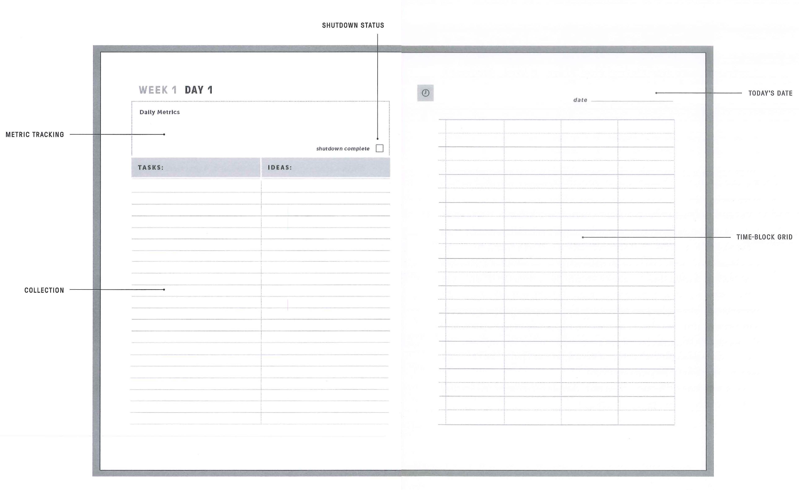
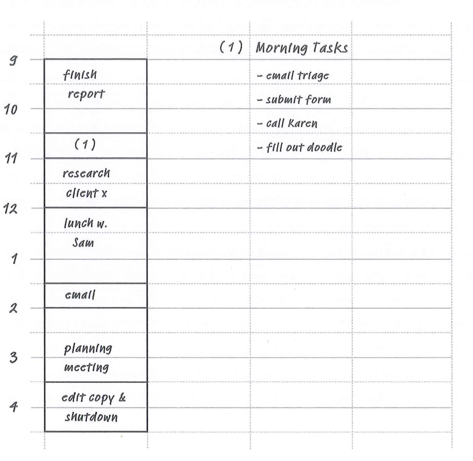
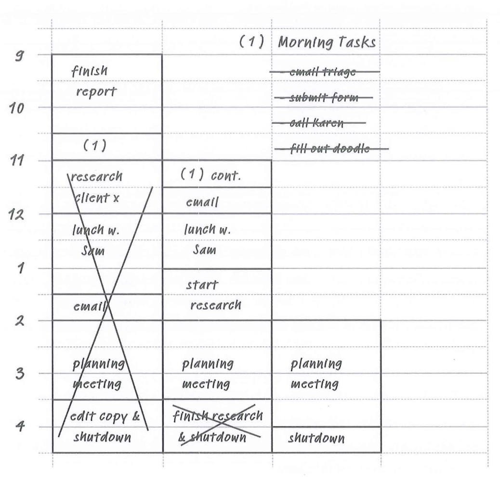

# The Time-Block Planner

## Introduction: The Power of Time Blocking

The Time-Block Planner implements a personal productivity system that I've perfected over the past fifteen years. During this period, it helped me earn a PhD in computer science at MIT and then go on to achieve tenure as a professor at Georgetown University, while simultaneously publishing six books for general audiences, including multiple bestsellers. Most importantly — and one of the aspects that I believe sets my system apart from any other — I did all of this while rarely working past 5:30 p.m. I need my evenings free to wrangle my three young kids. My productivity system made all this possible, and the planner you're currently holding will enable you to implement it in your own professional life.

As you'll learn in the detailed instructions that follow, the core of my systemis a simple but powerful strategy called time blocking. Most people approach their workday by trying to cross things off a task list in the small slivers of time that remain between attending meetings and reacting to emails and instant messages. Time blocking, by contrast, requires you to figure out in advance how you want to spend every minute of your day. Instead of trying to generally "be productive," you partition your time into blocks and assign specific work to them. This critical shift from managing tasks to managing time can massively increase the amount of useful work you accomplish. It also provides an anxiety-reducing sense of control over your schedule.

I didn't invent time blocking. As soon as people began thinking seriously about personal productivity, they began preaching the benefits of this strategy. In his autobiography, Benjamin Franklin explains, "Every part of my business should have its allotted time." He then provides a sample time-block schedule that divides up his waking hours into blocks, each dedicated to a different productive activity. In his 1967 classic, *The Effective Executive*, one of the first professional productivity books ever written, Peter Drucker echoes Franklin's commitment to managing time instead of tasks. "Effective executives, in my observation, do not start with their tasks," he writes. "They start with their time." A more recent article, appearing on a popular career website, reports that both Bill Gates and Elon Musk deploy variations of time blocking to help fuel their "freakish" levels of accomplishments.

This technique, in other words, is one that serious productivity aficionados have been deploying with great success for many years. This planner will help you follow their lead by providing you the tools needed to design and execute your own effective time-block schedules. What you won't find in this planneris a substitute for your calendar. I assume you already manage your meetings and appointments elsewhere, such as in the shared digital calendars that more and more organizations require their employees to use. Though you will copy events from your calendar into your daily time-block schedules, the planner is not their long-term home.

This planner also doesn't provide room for you to permanently store all of the various tasks and obligations for which you're currently responsible. The modern knowledge worker is burdened with many hundreds of these responsibilities at any given time; it's simply not practical to keep track of them in a paper notebook that's replaced multiple times a year. When using this planner,you will copy selected tasks from whatever system you use into your daily time-block schedules, but as with meetings and appointments, this will not be the primary place you store them.

The time-block planner instead focuses on a narrower objective: getting the most out of the time and attention you have available to allocate toward work each day. You already know what you need to do. This planner helps you do more of it, and do it more intentionally, than you ever thought possible. But enough with the preamble. Let's dive into the details of exactly how this planner works ....

## Instructions for Using the Time-Block Planner

The time-block planner dedicates a two-page spread to each workday. I call these the daily pages. It also dedicates a two-page spread for each week, which I call the weekly pages. We'll return to the weekly pages later in these instructions.For now, let's focus on the daily pages, as they're the key to this system's scheduling discipline.

As shown in figure 1, the daily pages contain several elements. On the right-hand side is the time-block grid. This is where you'll maintain your time-block schedule for the given day. On the left-hand side is a pair of columns for collect-ing obligations or ideas that come up while you're in the middle of executing atime block. By writing these intrusions down in the moment to deal with later,you'll avoid the need to divert your attention. The left-hand side of the dailypages spread also includes a box dedicated to tracking metrics designed to mea-sure behaviors that you identify as crucial to succeeding in your professionallife. Inside this box is the "shutdown complete" checkbox that indicates thatyou've completed a shutdown ritual for the day. As you'll learn, this ritual hasbecome afavorite ofthis system's devotees.

Let's walk through the use of these daily page elements one by one, startingwith the most important, the time-block grid.

### USING THE TIME-BLOCK GRID

At the beginning of each workday, flip to the next empty daily pages spread andrecord the date in the box at the top of the right-hand page. You're now ready to create a time-block schedule for the day. To do so, you'll use the time-block grid, also on the right-hand page. Each solid horizontal line represents one hour, and each dotted line represents a half hour. Moving from the top to the bottom, label the solid lines on the left side of the page with the hours during which you plan to work during the day. For example, if you're working from 9:00 a.m.to 5:00 p.m., you'd label the first solid line 9:00, the second 10:00, and so on, down to 5:00.

You can now create a time-block schedule for these hours. When you build your first schedule for the day, use the first column of the grid. The other columns will be used later if you end up needing to fix your schedule as the day unfolds.

To build the schedule, partition your working hours into blocks of time, and assign to each block the specific work you plan to accomplish during this time.You record this schedule on the time-block grid by actually drawing boxes around the time captured by each block and then labeling each block with the work assigned to it. If you need more room for a block's description — for example, if you want to list out multiple tasks you plan to accomplish during a short block — put a number in the block, and then use that same number to label a list of the extra information in the upper right corner of the time-block grid, whereit's unlikely to get in the way of future schedule fixes. To make these instructions concrete, see figure 2, which shows a sample time-block schedule.

When building your time-block schedule, you should first reference whatever calendar you use to make sure that you're adding time blocks for any meetings or appointments you've already scheduled. The real decision then becomes what to do with the free time that remains. To help make these choices, next consult whatever external system you use to track and organize all of the tasks, projects, long-term goals, or other obligations for which you're currently responsible. You want your schedule to help you make progress on the right activities.

Finally, keep in mind factors such as time of day — perhaps earlier in the day is better for hard thinking and later in the day is better for small tasks — and how you're feeling. If you're exhausted, you might want a schedule designed to help you catch up on administrative obligations, whereas if you're feeling energized, you might want to put aside large blocks of uninterrupted time for intense projects.

As your day unfolds, you should use your time-block schedule to determine what work you should be doing at any given moment. It's important that you don't let your attention wander. Focus exclusively on the work scheduled for the current block until the block is completed. If you need breaks, schedule them.

It's unavoidable, of course, that you'll occasionally deviate from your current schedule. For example, maybe a given task took longer than expected, or your boss asked you to stop everything to tackle a new, urgent assignment. In these cases, you don't abandon your time-block schedule; you instead *fix* it whenever you next get the chance. To make this fix, first cross out the timeblocks that remain in your current schedule. Then, in the column to the right of your current schedule, create a new schedule for these remaining hours, and turn your attention to executing this new plan. If this revised schedule breaks at some point, then repeat the same fixing process: cross out the blocks that remain and schedule new blocks for this time in the next column to theright. And so on. Figure 3 shows an example of this schedule-fixing process inaction.

Notice that it's possible to instead craft your block schedule using pencil and then fix it by erasing and redrawing the blocks in the same column. I generally avoid this method for two reasons: the erasing and redrawing can get messy, and I like to have a record of the changes I made, as these can later help me identify recurring scheduling mistakes.

### ADVANCED TIME-BLOCKING TIPS

#### Tip #1: Embrace schedule fixes.

The goal of time blocking is not to stick to your original schedule no matter what. It's instead to try to always have an intentional plan for what to do with your time. If circumstances upend your schedule, this isn't a failure; it's an expected part of applying this strategy. When you next get a chance, simply fix the schedule for the time that remains in the day so that you remain intentional about where you direct your focus.

#### Tip #2: At first, schedule more time than you think you need.

Novice time blockers chronically underestimate how long common work activities actually take. If you're new to time blocking, you can save yourself unnecessary schedule fixes by inflating the time block sizes you think are reasonableby 20-30 percent. After you've been time blocking for several months, you'll begin to develop a more realistic understanding of these durations and can begin building more accurate blocks without needing this extra padding.

#### Tip #3: Capture email and instant messenger communication in their own blocks.

Many knowledge workers don't consider checkiμg email or instant messengerchannels a standalone activity. They instead think of it as something that'salways done in parallel with primary work. I highly discourage this mindset:all of these quick checks of communication channels significantly reduce yourcognitive capacity due to neural network switching costs. Batch your email orinstant messenger time into their own blocks. When you get to one of these com-munication blocks, do nothing but communicate, and when you're not in one ofthese blocks, don't communicate at all. If your work requires you to check thesetools often, then schedule lots of blocks to do so, but refuse to let this behaviorbe something that occurs informally in the background.

#### Tip #4: Use "conditional blocks" to add flexibility to your schedule.

If you're unsure how long a given activity might take, break it into two blocks.The first block is dedicated to working on the activity. The second is assignedto activities that are conditioned on what happens during the first block: if youneed more time for the original activity, then use the second block to finish it;on the other hand, if you've finished the original activity, use the second blockfor the backup activity you identified. In this way, you can avoid unnecessaryschedule fixes when confronting work of ambiguous duration.

### USING THE COLLECTION COLUMNS

On the left-hand side of the daily pages are two lined columns labeled "tasks"and "ideas." Their purpose is simple: if while you're executing your time-blockschedule you come across a new task or relevant idea, you can jot it down inthese collection columns to deal with later, and then return immediately toexecuting the current block.

For example, perhaps someone sticks their head into your office to ask youto do something for them, or while walking back from a meeting, you have a sud-den brainstorm about how to tackle a pressing problem. By writing down thesecognitive intrusions in a designated area in this planner, you avoid the need todivert your attention from the current time block to handle them in the moment.You can be confident that you won't forget them, as they're written right therein black and white on your daily pages. If you're without such a collection space,the fear of forgetting would likely drive you to drop everything to handle thenew obligation right away, a reaction that cedes control of your schedule fromyour intentions to the whims of other people.

If you need to take action on this new information later in the same day, thenthe collection columns will hold it for you until you arrive at a good time to fixyour block schedule to include this work. If the information is less urgent, thenit will remain safely recorded in the collection columns until you complete yourshutdown ritual at the end of the day (we'll get to this soon), during which you'lltransfer it to whatever permanent system you use to track your obligations.

### METRIC TRACKING

Part of the art of time blocking is figuring out what work to schedule. Some ofthese choices are obvious, like allocating blocks for preexisting appointmentsor projects with impending deadlines. But you'll still often find yourself need-ing to schedule more discretionary, non-urgent endeavors. It's here that per-sonal metrics can help nudge you toward the long-term results that matter mostto you.

A personal metric describes a behavior that you think is important with aquantifiable value. Many readers of my book Deep Work, for example, track eachday how many hours they spent working without distractions on cognitively de-manding tasks. They accept my argument that this "deep work" should be prior-itized in an increasingly competitive knowledge economy. Their daily deepwork hour count is a personal metric that captures how well they're living upto this commitment.

Some jobs might yield metrics that capture behaviors specific to the particu-lar type of work. If you're in sales, for example, the number of sales calls youmake each day might be important, while if you're in a leadership position, youmight instead want to track how many different team members you checked inon during the day. Some metrics are quantified as numbers while others are bi-nary: you either did them or you didn't. Perhaps, for example, you maintain asimple checkbox to indicate whether you ended the day with an empty inbox orfilled out your online time sheet.

You can also track personal metrics that are only loosely relevant to yourwork. In my own case, for example, I'm a strong believer that a healthy body sup-ports a healthy mind. Accordingly, each day I track the following information:how many steps I take, whether or not I exercised, and whether or not I atehealthily. These personal metrics aren't, strictly speaking, describing work ac-tivities, but I track them alongside more work-specific values, as they ultimatelydo affect how much useful thinking I'm able to extract from my brain.

The open box above the collection columns is the space for recording thesemetrics each day. You simply jot down the name of each metric, followed by therelevant value-be it a number, a tally of hash marks, or a simple check. Trackingpersonal metrics serves a couple of purposes. The first is psychological. Theknowledge that you'll be recording information about a key behavior at the endof the day can motivate you to dedicate time to that behavior when building yourtime-block schedule, as you don't want to have to record a disappointing metric value.

The second purpose is informational. The metric tracking boxes will con-tain a record of how well you did, day after day, in executing key behaviors. Thisrecord can reveal useful trends. For example, if you're tracking deep work hours,you might notice that these values dip precipitously on Tuesdays and Thurs-days. Further investigation might reveal this is because you have a series ofregular meetings on those days that are spread out enough throughout the dayto break up any long, uninterrupted stretches of time. Once the problem is identified, simple fixes might be possible. In this case, perhaps you rescheduleone of the meetings to free up a morning block for deep work on these days.

To summarize, if something's important to you, track it in the metric-trackingbox. This simple habit can inject much more intentional behavior into your dailyschedule.

### THE SHUTDOWN RITUAL

One of the most important pieces of my system's daily scheduling discipline isexecuting a shutdown ritual that helps your mind shift more completely fromwork mode to non-work mode. The details of this ritual are straightforward. Atthe end of each day's time-block schedule, your final step is to shut down work. Todo so, first make sure your personal metrics have been recorded. Next, go throughthe tasks and ideas in your collection column, deciding for each what you want todo with it. In some cases, you may need to add new tasks into your task system,while in other cases you may need to update your calendar, or even shoot off aquick message.

Once you've finished going through your collection columns, you should thenbriefly review any other potential sources of unresolved work obligations. Formost people, this means taking one last look at your email inbox, to ensureyou didn't miss something urgent, as well as reviewing your calendar andobligation-tracking system. When done with these checks, look over your weeklyplan (which we'll discuss in more detail next), updating it as needed. The goalhere is to convince yourself that there's nothing being forgotten, or missed, orbeing kept track of only in .your brain, and that you have a reasonable plan forthe days ahead. All of these reassurances are the precondition for enablingyour brain to fully shift its attention from work to life outside of work.

To make this transition, complete the shutdown ritual by marking the "shut-down complete" checkboxthat's preprinted in the metric-tracking space. (I putthis checkbox in the metric area because recording whether or not you've com-pleted this ritual is itself a personal metric.) Later in the evening, if you feel ageneralized background hum of work anxiety, and your mind begins to fret andwants you to think about that email you have to write, or to endlessly reviewyour plan for an upcoming project, you can arrest this rumination with a sim-ple reminder: "I wouldn't have checked the shutdown complete box if I hadn'tcompleted the shutdown ritual that convinced me I'm fine to avoid work untiltomorrow." In this way, you address the anxiety without engaging with the spe-cific topics fueling the anxiety.

I came up with this ritual early in my career as a graduate student, with theonly difference being that I actually said the phrase shutdown complete out loudinstead of checking a box. (Over the years, as I've written about this strategy, thephrase shutdown complete has become a shibboleth of sorts for my more devotedreaders, an eccentric reality that makes me inexplicably happy.) In my experi-ence, when facing a period of intense work anxiety, I'd find myself frequentlyreturning to the disclaimer for about a week, after which my mind learned Iwasn't going to indulge in any interesting rumination, diminishing its urge tofret. You'll likely experience a similar effect. If you strictly follow this shutdownritual, you'll soon discover that not only are you working harder when you work,but your time after work is more meaningful and restorative than ever before.

### THE WEEKLY PLANNING PAGES

So far in these instructions, we've been discussing the various elements ofthe daily planning pages. There is, however, another type of page that you'llencounter in this planner: those dedicated to weekly planning. Every week'sworth of daily pages is accompanied by a two-page spread for weekly planning.Unlike their daily counterparts, however, the weekly planning pages contain fewpreformatted elements. You're instead presented with two empty pages onwhich to craft your plan for the week ahead in whatever format you prefer.

As I wrote in a 2014 essay on the topic, "I've found it's crucial to embraceflexibility. The style or format of your plan should match the challenges of thespecific week ahead." As these challenges shift, so will the format of your plan.In my own weekly planning habit, for example, I find that for some weeks I wantto sketch out a plan for every day individually, as shown in this abbreviatedcase study:

> Monday
>
> - Start with a focused task block to get out ahead of the small things on my lists for the week. Be sure to finish merit report.
> - Prepare a lecture for my class, then research work.
> - End the workday with a 1-to-2-hour writing block.
>
> Tuesday
>
> - Head into the office early to work on upcoming paper submission.
> - Teaching/office hours/meetings dominate the midday.
> - End day with 1.5 hours in the science library, where the first hour is writing and the last 30 minutes are focused on small tasks.

This weekly planning format provides detailed guidance for the time-blockschedule I'll build each day of the week. During other weeks, however, I mightdecide that something higher level is more appropriate. For example, when fac-ing weeks already filled with meetings and appointments, I sometimes insteaduse my weekly plan to provide a few heuristics about how to make use of what-ever free time remains each day. For example:

> Research
> The goal this week is to try to find enough time to fix the correctness proof for the new gossip algorithm. Brainstorm during commutes. Try to carve out one additional hour every day to give the proof concentrated thought.
>
> Small Tasks 
> I have a lot of small things lurking on my lists. Do 30 minutes each morning> on my task lists first thing before heading into campus. End each day with 30 minutes as well. Include email checking into these blocks. Sixty total minutes should be enough to keep my head above water until this busy week ends.
>
> Meeting Strategy 
> Add 15-30 minutes onto the end of each scheduled meeting this week to try to process and make sense of any new obligations it places on my plate. Otherwise, these obligations will pile up and cause stress.

This weekly planning format doesn't detail exactly what will happen eachday but instead gives me a couple of pointers about how to fight to make use ofthe scraps of free time that remain. These case studies show only two possibleformats out of many ways for crafting these weekly plans. The key is to embracewhatever format seems most useful for the particular week you're planning.

Regardless of the format you use, you should craft your weekly plan eitherover the weekend before the week begins or first thing Monday morning. Whencrafting the plan, look over your calendar and whatever system you use to trackyour obligations, projects, and goals. Some people like to empty their email in-box as part of this planning process so that they feel as if they're starting theweek fresh. For other people, this goal might be infeasible. Regardless, craftingthese plans takes time. I usually spend, for example, between thirty and sixtyminutes to get completely up to speed on what's going on for the upcoming weekand to decide how to tackle it.

You might feel at first that this time is wasted — like you're throwing away anhour you could dedicate to actually completing concrete tasks. I urge you to resist this reaction. The planning may take time up front, but it will return muchgreater productivity for the entire week that follows. Among other benefits, itwill identify important patterns that can help you plan to get much more accom-plished. If you see, for example, that Wednesday through Friday are very busydue to a visiting client, then you can compensate by squeezing in more uninter-rupted deep work on Monday or Tuesday. Or if you know you'll be off-site allday Friday, then you can adjust your Thursday schedule to make sure loose endsare tied up before the trip.

Sometimes your weekly planning habit can motivate you to change the ap-pointments already on your calendar. After trying and failing to fit in enoughhours to finish an important project, for example, you might realize that youneed to cancel or reschedule a few non-urgent appointments-coffee with a col-league, or perhaps a brainstorming meeting for a speculative project-to makeroom for the more urgent work.

Weekly plans are also important because they allow you to tackle objectivesthat require more than a day to complete. If you decide at the beginning of theweek, for example, to write an article that'll require around ten to fifteen hoursof research and writing, your weekly plan can help you figure out how to spreadthis work out across the upcoming days. It's much less likely that you'd end upgetting all of this required work done if you instead just planned each day as itarrived.

It's this combination of high-level weekly plans with detailed daily time-block schedules that unlocks the full potential of this productivity system. Theweekly/daily approach is what allows you to move around obligations like pieceson a chessboard and construct configurations of your schedule that enable youto accomplish head-turning amounts of work, all while staying on top of the var-ious small requests and tasks pulling at your time and attention. While yourpeers react frantically to inputs and deadlines as they arise, often putting in latenights to try to compensate for their haphazard schedules, you'll approach eachday with a justified confidence.

Build smart weekly plans. Use these plans to develop effective daily time-block schedules. Execute those daily schedules with intensity, and then whendone for the day, shut down completely. This is the rhythm of an extremely pro-ductive and satisfying professional life. And it's exactly what this planner is de-signed to help you achieve.

## Process and Proceed

You've made it through thirteen weeks of time blocking. Hopefully, you felt both more productive and more in control of your work during this period. Before moving on to a fresh planner for the next thirteen weeks, however, it's important to take some time to process what you've learned from the weeks that just passed. I suggest browsing through the pages of your planner to review the following information:

- Metric Completion. Survey your metrics to develop a better picture of your activity during these weeks. If you track deep work hours, for example, this is a good time to confront how many such hours you completed on average. If you're not happy with this number, perhaps it's time to consider more serious changes to your work setup. Similarly, if you find that you're struggling to complete a given metric, you might tweak the behavior you're tracking to something more tractable.
- Schedule Repairs. Review the days where your time-block schedule required multiple repairs. Study the source of these disruptions. It might turn out, for example, that you chronically underestimate the time required for a certain work activity. This is useful to know! If the disruption is external — say, your boss has the habit of stopping by your office to ask you to "quickly look into" their latest big idea — it might make sense to put a process in place that allows you to handle these requests withoutblowing up your schedule.
- Time Allocation. More generally, as you look over your recent time-block schedules, improve your understanding of how you actually spend your time. Are your days almost universally fractured with meetings? What's your ratio of email to non-email efforts? Most knowledge workers never directly confront the reality of their professional efforts, but such confrontation is crucial, even if it can sometimes be uncomfortable. To move from busy to effective you must understand exactly how you're actually spending your time, identify what you don't like about these allocations, and then take hard steps to fix it.

Once you've reviewed and processed this information, you're prepared to start fresh with a new planner, armed with knowledge that will make you an even more effective time blocker than before. When it comes to your work life, if you don't control your time, others will do so for you. I hope your experience with time blocking so far has helped you appreciate the superiority of the first option.
