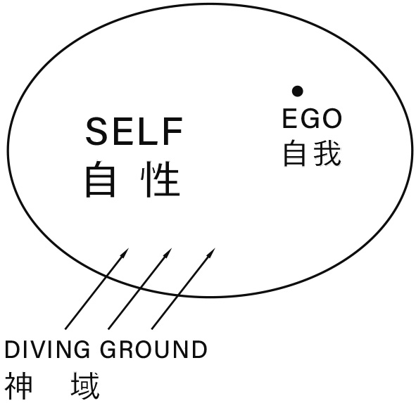

# BEYOND RESISTANCE: The Higher Realm

The first duty is to sacrifice to the gods and pray them to grant you the thoughts, words, and deeds likely to render your command most pleasing to the gods and to bring yourself, your friends, and your city the fullest measure of affection and glory and advantage.

–Xenophon, *The Cavalry Commander*

## ANGELS IN THE ABSTRACT

The next few chapters are going to be about those invisible psychic forces that support and sustain us in our journey toward ourselves. I plan on using terms like muses and angels.

接下来的几个章节会涉及到不可见的精神力量，这些力量在我们追寻自我的旅程中支撑、支持着我们。我打算使用“缪斯”“天使”等说法。

Does that make you uncomfortable?

这会让你不舒服吗？

If it does, you have my permission to think of angels in the abstract. Consider these forces as being impersonal as gravity. Maybe they are. It's not hard to believe, is it, that a force exists in every grain and seed to make it grow? Or that in every kitten or colt is an instinct that impels it to run and play and learn.

如果是的话，我允许你抽象地思考天使。把这些力量看成去人格化的客观存在，就像重力一样。也许它们原本就是这样。相信每一粒粮食、每一颗种子里都蕴含着某种使其生长的力量，这并不难，对吗？又或者，每一只小猫、每一匹小马都生来就具备一种本能，让它奔跑、玩耍、学习。

Just as Resistance can be thought of as personal (I've said Resistance "loves" such-and-such or "hates" such-and-such), it can also be viewed as a force of nature as impersonal as entropy or molecular decay.

内阻力既然可以被拟人化（我一直在说内阻力“爱”这样或“恨”那样），它当然也可以被看作一种自然的力量，就像熵或分子衰变一样不为人力所改变的客观存在。

Similarly the call to growth can be conceptualized as personal (a *daimon* or *genius*, an angel or a muse) or as impersonal, like the tides or the transiting of Venus. Either way works, as long as we're comfortable with it. Or if extra-dimensionality doesn't sit well with you in any form, think of it as "talent," programmed into our genes by evolution.

同样，关乎个人成长的召唤也可以通过拟人（恶魔或天才，天使或缪斯）或去人格化的方式来具体体现，就像潮汐和金星凌日，也都是这样。只要我们觉得舒服，怎样都行。如果任何超维度的想象都不合你的胃口，那就把它看作“天赋”好了，就当是物种演化写在我们基因里的编码。

The point, for the thesis I'm seeking to put forward, is that there are forces we can call our allies.

就我试图提出的理论而言，重点在于，有那么一些力量是可以被我们引为盟友的。

As Resistance works to keep us from becoming who we were born to be, equal and opposite powers are counterpoised against it. These are our allies and angels.

正如有内阻力致力于阻碍我们成长为我们生来应该成为的那个人，也有一些力量站在它的对立面，并且能够与之抗衡。后者便是我们的盟友和天使。

## APPROACHING THE MYSTERY

Why have I stressed professionalism so heavily in the preceding chapters? Because the most important thing about art is to work. Nothing else matters except sitting down every day and trying.

为什么我在前面的章节中如此强调职业素养？因为艺术领域中最重要的就是工作。除了日复一日地坐下来付出努力，其他一切都不重要。

Why is this so important?

为什么这如此重要？

Because when we sit down day after day and keep grinding, something mysterious starts to happen. A process is set into motion by which, inevitably and infallibly, heaven comes to our aid. Unseen forces enlist in our cause; serendipity reinforces our purpose.

因为，只要我们能够每天都坐下来，不断地“磨”，一些神秘的事情就会开始发生。齿轮开始转动。在这个过程中，上天必定、必然会对我们伸出援手。会有看不见的力量加入我们的事业进程，会有意想不到的好运加持我们最终的目标。

This is the other secret that real artists know and wannabe writers don't. When we sit down each day and do our work, power concentrates around us. The Muse takes note of our dedication. She approves. We have earned favor in her sight. When we sit down and work, we become like a magnetized rod that attracts iron filings. Ideas come. Insights accrete.

这也是一个只有真正的艺术家才知道的秘密，止步于“想成为创作者”的人不会知道。每一天，当我们坐下来，开始工作，便会有力量聚集在我们周围。缪斯会注意到我们的奉献。她赞赏这样的奉献。于是，我们赢得了她的青睐。坐下来工作时，我们仿佛变成了吸引铁屑的磁铁，想法纷至沓来，洞见不断累积。

Just as Resistance has its seat in hell, so Creation has its home in heaven. And it's not just a witness, but an eager and active ally.

正如内阻力在地狱占有一席之地，创造力栖身于天堂。它不仅仅是一位见证者，更是热心又积极的盟友。

What I call Professionalism someone else might call the Artist's Code or the Warrior's Way. It's an attitude of egolessness and service. The Knights of the Round Table were chaste and self-effacing. Yet they dueled dragons.

我所说的职业素养，在其他人口中可能是“艺术家法则”或“战士之道”。这是一种无我和服务的态度。圆桌骑士们纯洁、谦逊，可他们与恶龙决斗。

We're facing dragons too. Fire-breathing griffins of the soul, whom we must outfight and outwit to reach the treasure of our self-in-potential and to release the maiden who is God's plan and destiny for ourselves and the answer to why we were put on this planet.

我们同样面对着恶龙。那是匍匐在我们灵魂中的怪兽格里芬，只有战胜它们，我们才能要找到自己潜能的宝藏，释放那个被囚禁的“少女”，她是上天赐予的那个命定的我们自己，是我们投生到这颗星球上的原因。

## INVOKING THE MUSE

The quote from Xenophon that opens this section comes from a pamphlet called *The Cavalry Commander*, in which the celebrated warrior and historian proffers instruction to those young gentlemen who aspired to be officers of the Athenian equestrian corps. He declares that the commander's first duty, before he mucks out a stable or seeks funding from the Defense Review Board, is to sacrifice to the gods and invoke their aid.

本章开头所引色诺芬的话出自一本名为《骑兵指挥官》的小册子，这位著名的战士兼历史学家在书中向有志于成为雅典骑兵队军官的贵族子弟们提供了指导。他声称，指挥官的首要职责不是清理马厩，也不是向国防审查委员会寻求资金支持，而是向神灵献祭，求取他们的帮助。

I do the same thing. The last thing I do before I sit down to work is say my prayer to the Muse. I say it out loud, in absolute earnest. Only then do I get down to business.

我也这么做。每次坐下来开始工作之前，我所做的最后一件事，就是向缪斯祈祷。我无比虔诚地大声念诵我的祷词。只有到那时，我才开始我的工作。

In my late twenties I rented a little house in Northern California; I had gone there to finish a novel or kill myself trying. By that time I had blown up a marriage to a girl I loved with all my heart, screwed up two careers, blah blah, etc., all because (though I had no understanding of this at the time) I could not handle Resistance. I had one novel nine-tenths of the way through and another at ninety-nine hundredths before I threw them in the trash. I couldn't finish 'em. I didn't have the guts. In yielding thusly to Resistance, I fell prey to every vice, evil, distraction, you-name-it mentioned heretofore, all leading nowhere, and finally washed up in this sleepy California town, with my Chevy van, my cat Mo, and my antique Smith-Corona.

在眼看着渐渐逼近三十岁的时候，我来到北加州，租下了一所小房子。去那里是为了完成一部小说，不然就干脆自杀。在此之前，我已经搞砸了和心爱女孩的婚姻，尽管我全心全意地爱着她；还毁掉了两段职业生涯。尽管当时的我还对个中缘由一无所知，但事实上，这一切都是因为我不懂得应对内阻力。这一部小说完成了十分之九，另一个故事写到了百分之九十九，结果统统被我扔进了垃圾桶。我没办法完成它们。我没有勇气。对内阻力屈服到如此程度，我沦为了此前提到的一切堕落、恶行、注意力涣散和你叫得上名字的所有糟糕情形下的牺牲品。我无路可走，最后被推到了这座沉寂的加州小镇，带着我的雪佛兰厢式车、猫咪“莫”和我的史密斯-科罗纳古董打字机。

A guy named Paul Rink lived down the street. Look him up, he's in Henry Miller's *Big Sur and the Oranges of Hieronymus Bosch*. Paul was a writer. He lived in his camper, "Moby Dick." I started each day over coffee with Paul. He turned me on to all kinds of authors I had never heard of, lectured me on self-discipline, dedication, the evils of the marketplace. But best of all, he shared with me his prayer, the Invocation of the Muse from Homer's *Odyssey*, the T. E. Lawrence translation. Paul typed it out for me on his even-more-ancient-than-mine manual Remington. I still have it. It's yellow and parched as dust; the merest puff would blow it to powder.

那条街上住着一个名叫保罗·林克的人。你可以查一下，他曾经出现在亨利·米勒的《大瑟尔和希罗尼默斯·博斯的橙子》里。保罗是个作家，住在他的露营车“白鲸”里。我每天都和他一起喝咖啡。他向我介绍了许多我从未听说过的各色作家，教会我自律、奉献，以及市场的罪恶。但最重要的是，他将他的祈祷文分享给了我。那是荷马史诗《奥德赛》中“缪斯的召唤”一段，来自T. E. 劳伦斯的译本。保罗用他那台比我更古老的雷明顿打字机为我打了一份。我到现在还保存着。那张纸已经泛黄，像枯叶一样焦脆，似乎只要轻轻地吹上一口气，它就会化作尘埃。

In my little house I had no TV. I never read a newspaper or went to a movie. I just worked. One afternoon I was banging away in the little bedroom I had converted to an office, when I heard my neighbor's radio playing outside. Someone in a loud voice was declaiming ". . . to preserve, protect, and defend the Constitution of the United States." I came out. What's going on? "Didn't you hear? Nixon's out; they got a new guy in there."

我的小房子里没有电视机。我不看报纸，也不看电影。只是工作。一天下午，当我正在改造成办公室的小卧室里噼里啪啦打字的时候，突然听到外面传来邻居家收音机的声音。有人在滔滔不绝地高声宣布“……为了坚守、保护和捍卫美国宪法”……我走出门去。出什么事了？“你没听说吗？尼克松下台了；他们换了个新的家伙上去。”

I had missed Watergate completely.

我完全错过了水门事件。

I was determined to keep working. I had failed so many times, and caused myself and people I loved so much pain thereby, that I felt if I crapped out this time I would have to hang myself. I didn't know what Resistance was then. No one had schooled me in the concept. I felt it though, big-time. I experienced it as a compulsion to self-destruct. I could not finish what I started. The closer I got, the more different ways I'd find to screw it up. I worked for twenty-six months straight, taking only two out for a stint of migrant labor in Washington State, and finally one day I got to the last page and typed out:

我决心继续工作。我已经失败了太多次，还因此给我自己和我爱的人带来了太多的痛苦，以至于我总觉得，如果这一次再失败，就只能去上吊了。我那时还不知道什么是内阻力。没有人教过我这个概念。但是我感觉到它了，很清晰。它带给我的感受，是一种自我毁灭的冲动。我无法完成手头已经开启的工作。越是接近终点，我就越是会找出各种各样的方法来把它搞砸。我连续工作了二十六个月，中途只抽出两个月时间去华盛顿州做了一阵子的流动劳工，终于有一天，我写到了最后一页，打出了最后几个字：

THE END.

I never did find a buyer for the book. Or the next one, either. It was ten years before I got the first check for something I had written and ten more before a novel, *The Legend of Bagger Vance*, was actually published. But that moment when I first hit the keys to spell out THE END was epochal. I remember rolling the last page out and adding it to the stack that was the finished manuscript. Nobody knew I was done. Nobody cared. But I knew. I felt like a dragon I'd been fighting all my life had just dropped dead at my feet and gasped out its last sulfuric breath.

我终究没能为那本书找到买家。下一本也没有。足足过了十年，我写出来的东西才换来了第一张支票，在那之后又过了十年，我的第一本小说《巴格·万斯传奇》才终于出版。可就在那一刻，当我第一次用键盘敲出“全书终”几个字时，一个新的纪元开始了。我记得自己是怎样转动卷轴，把最后一页纸抽出来，放到写完的那一摞手稿上方。没有人知道我写完了。没有人在乎。但我自己知道。那感觉就像是，我穷尽一生都在与之战斗的那条恶龙倒下了，倒在我的脚边，吐出它最后一口满是硫磺气的龙息，死了。

Rest in peace, motherfucker.

安息吧，狗娘养的。

Next morning I went over to Paul's for coffee and told him I had finished. "Good for you," he said without looking up. "Start the next one today."

第二天早上，我去找保罗喝咖啡，告诉他我写完了。“好样的。”他头也不抬地说，“今天开始下一本。”

## INVOKING THE MUSE, PART TWO

Before I met Paul, I had never heard of the Muses. He enlightened me. The Muses were nine sisters, daughters of Zeus and Mnemosyne, which means "memory." Their names are Clio, Erato, Thalia, Terpsichore, Calliope, Polyhymnia, Euterpe, Melpomene, and Urania. Their job is to inspire artists. Each Muse is responsible for a different art. There's a neighborhood in New Orleans where the streets are named after the Muses. I lived there once and had no idea; I thought they were just weird names.

遇见保罗之前，我从未听说过缪斯女神。是他为我开蒙。缪斯有九个姐妹，是宙斯和记忆女神摩涅莫绪涅的女儿。她们的名字分别是克利俄、埃拉托、塔利亚、忒耳西科瑞、卡利俄珀、波吕许尼、欧忒耳珀、墨尔波墨涅和乌拉尼亚。她们的工作是将灵感赋予艺术创作者。每个缪斯负责不同的艺术门类。新奥尔良有一个街区，街道都是以缪斯们的名字命名。我在那里住过，却毫无概念，竟以为那只是一些古怪的名字。

Here's Socrates, in Plato's *Phaedrus*, on the "noble effect of heaven-sent madness":

以下是苏格拉底对于“天赋迷狂的美满效果”的说法，记录在《柏拉图对话录》的“斐德罗篇”中：

> The third type of possession and madness is possession by the Muses. When this seizes upon a gentle and virgin soul it rouses it to inspired expression in lyric and other sorts of poetry, and glorifies countless deeds of the heroes of old for the instruction of posterity. But if a man comes to the door of poetry untouched by the madness of the Muses, believing that technique alone will make him a good poet, he and his sane compositions never reach perfection, but are utterly eclipsed by the performances of the inspired madman.
>
> 第三种迷狂，是由缪斯凭附而来。她攫住一个温柔贞洁的灵魂，唤醒它，令它抒情歌咏，吟诵出各种诗歌，颂扬古代英雄的丰功伟绩，流传后世。然而，若是有人不得缪斯的凭附便来叩响诗歌的大门，相信单靠着技艺便能成为好的诗人，他和他理智的作品注定永远难臻化境，遇到迷狂的诗作便黯淡失色。

The Greek way of apprehending the mystery was to personify it. The ancients sensed powerful primordial forces in the world. To make them approachable, they gave them human faces. They called them Zeus, Apollo, Aphrodite. American Indians felt the same mystery but rendered it in animistic forms — Bear Teacher, Hawk Messenger, Coyote Trickster.

古希腊人解读“神秘”的方式是将其拟人化。古人感知到世上存在着强大的原始力量。为了便于理解，他们赋予了这些力量以人的面貌，称它们为宙斯、阿波罗、阿佛洛狄忒。美洲印第安人也感知到了同样的“神秘”，却选择以泛灵论的形式表达——熊老师、鹰使者、狼骗子。

Our ancestors were keenly cognizant of forces and energies whose seat was not in this material sphere but in a loftier, more mysterious one. What did they believe about this higher reality?

我们的祖先敏锐地认识到，这些力量和能量的源头并不在我们这个物质领域内，它们来自一个更加神秘的维度。对于这个更高的存在，他们有怎样的信念呢？

First, they believed that death did not exist there. The gods are immortal.

首先，他们相信那里不存在死亡。神是不朽的。

The gods, though not unlike humans, are infinitely more powerful. To defy their will is futile. To act toward heaven with pride is to call down calamity.

虽然与人类面貌无差，神却拥有无尽的力量。违抗神的意志是徒劳的。妄自窥天，必致灾殃。

Time and space display an altered existence in this higher dimension. The gods travel "swift as thought." They can tell the future, some of them, and though the playwright Agathon tells us,

在这个更高的维度上，时间和空间都发生了改变。众神行动“如思维一样迅疾”。他们中的一些可以预知未来。此外，虽然悲剧作家阿伽通告诉我们：

> This alone is denied to God: the power to undo the past
>
> 唯有改变过去的力量 不为众神所享
>

yet the immortals can play tricks with time, as we ourselves may sometimes, in dreams or visions.

不朽的神却可以玩弄时间的小把戏，就像我们自己有时在梦里或幻想中所做的那样。

The universe, the Greeks believed, was not indifferent. The gods take an interest in human affairs, and intercede for good or ill in our designs.

古希腊人相信，宇宙不是冷漠无情的。众神关心人类的事务，会为我们生来的优与劣求情。

The contemporary view is that all this is charming but preposterous. Is it? Then answer this. Where did *Hamlet* come from? Where did the Parthenon come from? Where did *Nude Descending a Staircase* come from?

在现代人看来，这一切都很迷人，但荒谬。真的吗？那就回答这个问题。《哈姆雷特》是从哪里来的？帕特农神庙是从哪里来的？杜尚的《下楼梯的裸女》又是从哪里来的？

## TESTAMENT OF A VISIONARY

> *Eternity is in love with the creations of time.*
>
> – William Blake

The visionary poet William Blake was, so I understand, one of those half-mad avatars who appear in flesh from time to time — savants capable of ascending for brief periods to loftier planes and returning to share the wonders they have seen.

据我所知，眼界卓绝的诗人威廉·布莱克便是这样一个半迷狂的化身，不时以肉身臻神。他是那种开了窍的人，能够短暂地进入更高的层面，然后回来，将遇见的奇迹分享给我们。

Shall we try to decipher the meaning of the verse above?

我们要不要试着破译一下上面的诗句呢？

What Blake means by "eternity," I think, is the sphere higher than this one, a plane of reality superior to the material dimension in which we dwell. In "eternity," there is no such thing as time (or Blake's syntax wouldn't distinguish it from "eternity") and probably no space either. This plane may be inhabited by higher creatures. Or it may be pure consciousness or spirit. But whatever it is, according to Blake, it's capable of being "in love."

布莱克所说的“永恒”，我想，是比现世更高的领域，比我们栖身的物质维度更高的真实的层面。在“永恒”中，没有时间（否则，布莱克的表述里就不会将它与“永恒”区分开来），或许也没有空间。那个层面里可能居住着更高等的生物。也可能是纯粹的意识或精神。但无论是什么，根据布莱克的说法，它有“爱”的能力。

If beings inhabit this plane, I take Blake to mean that they are incorporeal. They don't have bodies. But they have a connection to the sphere of time, the one we live in. These gods or spirits participate in this dimension. They take an interest in it.

如果有这样一种存在安居于那个层面，我想，布莱克的意思是，它们是无形的。它们没有身体。却与我们生活的这个关乎时间的领域有关联。这些“神”或“灵”介入了我们的维度。它们对这里有兴趣。

"Eternity is in love with the creations of time" means, to me, that in some way these creatures of the higher sphere (or the sphere itself, in the abstract) take joy in what we time-bound beings can bring forth into physical existence in our limited material sphere.

在我看来，“永恒爱恋时间的造物”，表达的就是，在某种程度上，更高层面的存在（或者抽象地说，那个层面本身）因我们而喜悦，他们喜欢我们这些受制于时间的生物在这有限的物质层面中所创造的物质的存在。

It may be pushing the envelope, but if these beings take joy in the "creations of time," might they not also nudge us a little to produce them? If that's true, then the image of the Muse whispering inspiration in the artist's ear is quite apt.

这样说或许有点夸张，但如果这些存在能够因“时间的造物”而喜悦，难道就不会悄悄地推着我们去多创造一些吗？如果这是真的，那么，缪斯在艺术家耳边低诉灵感的画面就十分合情合理了。

The timeless communicating to the timebound.

那是永恒与时间受限者之间的交流。

By Blake's model, as I understand it, it's as though the Fifth Symphony existed already in that higher sphere, before Beethoven sat down and played dah-dah-dah-DUM. The catch was this: The work existed only as potential — without a body, so to speak. It wasn't music yet. You couldn't play it. You couldn't hear it.

以布莱克为范本，我猜想，在贝多芬坐下来奏响《命运交响曲》的“当—当—当—铛！”之前，第五交响曲大概就已经存在于那个更高的世界里了。但关键就在这里：可以说，在此之前，这部作品只是潜在的概念，没有实现。它还不是音乐。无法弹奏，也无法聆听。

It needed someone. It needed a corporeal being, a human, an artist (or more precisely a *genius*, in the Latin sense of "soul" or "animating spirit") to bring it into being on this material plane. So the Muse whispered in Beethoven's ear. Maybe she hummed a few bars into a million other ears. But no one else heard her. Only Beethoven got it.

它需要一个人。需要一个有形的存在，一个人类，一个艺术家——更准确地说，一个天才，在拉丁语源里，“天才”即“灵魂”“圣灵”——来把它带进这个物质的层面。于是，缪斯在贝多芬的耳边低语。也许她也曾对着其他无数人的耳朵哼出过其中几个小节，但没人听到。只有贝多芬接收到了。

He brought it forth. He made the Fifth Symphony a "creation of time," which "eternity" could be "in love with."

他把它写了出来。他使《第五交响曲》成为了“时间的造物”，成为了“永恒”可以“爱恋”的东西。

So that eternity, whether we conceive of it as God, pure consciousness, infinite intelligence, omniscient spirit, or if we choose to think of it as beings, gods, spirits, avatars — when "it" or "they" hear somehow the sounds of earthly music, it brings them joy.

因此，无论我们将“永恒”视为上天、纯粹的意识、无上的智慧、全知的性灵，还是众生、神明、精灵或神之化身，当“它”或“它们”以某种方式听到尘世里奏响的音乐时，会感到喜悦。

In other words, Blake agrees with the Greeks. The gods do exist. They do penetrate our earthly sphere.

换句话说，布莱克认同古希腊人的观点。众神存在。他们是真的会介入尘世。

Which brings us back to the Muse. The Muse, remember, is the daughter of Zeus, Father of the Gods, and Memory, Mnemosyne. That's a pretty impressive pedigree. I'll accept those credentials.

现在，我们可以说回缪斯了。别忘了，缪斯是众神之父宙斯和记忆女神摩涅莫绪涅的女儿。这样的出身可是相当厉害。我愿意接受这样的背书。

I'll take Xenophon at his word; before I sit down to work, I'll take a minute and show respect to this unseen Power who can make or break me.

我愿意相信色诺芬的话。因此，在坐下来工作之前，我会花上一分钟的时间，向这看不见的力量表达敬意。它可以成就我，也可以摧毁我。

## INVOKING THE MUSE, PART THREE

Artists have invoked the Muse since time immemorial. There is great wisdom to this. There is magic to effacing our human arrogance and humbly entreating help from a source we cannot see, hear, touch, or smell. Here's the start of Homer's *Odyssey*, the T. E. Lawrence translation:

从远古时代开始，艺术家便会召唤缪斯。这之中蕴含着巨大的智慧。其中藏有魔力，可以消除我们人类的傲慢，引导我们谦卑地向不可见、不可闻、不可触摸也不可嗅察的力量求助。下面是荷马在《奥德赛》中的开篇，取自T. E. 劳伦斯的译本：

> O Divine Poesy, goddess, daughter of Zeus, sustain for me this song of the various-minded man who, after he had plundered the innermost citadel of hallowed Troy, was made to stray grievously about the coasts of men, the sport of their customs, good and bad, while his heart, through all the sea-faring, ached with an agony to redeem himself and bring his company safe home. Vain hope — for them. The fools! Their own witlessness cast them aside. To destroy for meat the oxen of the most exalted Sun, wherefore the Sun-god blotted out the day of their return. Make this tale live for us in all its many bearings, O Muse. . . .
>
> 噢，神圣的诗篇，女神，宙斯的女儿，请助我写下这篇多智之子的歌。他扫荡了神圣的特洛伊最深的堡垒，被迫漂泊于人类的海岸之外，历尽种种海俗的嬉弄，有好，有坏；苦苦忍耐痛苦的折磨，只为救赎自己，带领同伴平安归家。徒劳的祈望啊，未能保全他们。这些愚人啊！无知让他们被抛弃。将至高的太阳之牛拿来饱食，祸患遂至，太阳神抹去了他们该当回家的日子。哦，缪斯，请让这个故事流传，教诲我们其中的深意……

This passage will reward closer study.

这一段值得细细研究。

First, *Divine Poesy*. When we invoke the Muse we are calling on a force not just from a different plane of reality, but from a holier plane.

首先，“神圣的诗篇”，当我们召唤缪斯时，召唤的是一股力量，它不仅来自另一个现实的层面，而且是更神圣的层面。

*Goddess, daughter of Zeus*. Not only are we invoking divine intercession, but intercession on the highest level, just one remove from the top.

“女神，宙斯的女儿”，我们不仅在祈求神的代祷，而且是最高级别的代祷，距离“至高”只有一步之遥。

*Sustain for me*. Homer doesn't ask for brilliance or success. He just wants to keep this thing going.

“请助我写下”，荷马不要求辉煌或成功，他只是想坚持完成这件事。

*This song*. That about covers it. From *The Brothers Karamazov* to your new venture in the plumbing-supply business.

“这歌”，大体总括了一切。不管是《卡拉马佐夫兄弟》，还是你在管道供应行业开启的新冒险，不外乎如是。

I love the summation of Odysseus' trials that comprises the body of the invocation. It's Joseph Campbell's hero's journey in a nutshell, as concise a synopsis of the story of Everyman as it gets. There's the initial crime (which we all inevitably commit), which ejects the hero from his homebound complacency and propels him upon his wanderings, the yearning for redemption, the untiring campaign to get "home," meaning back to God's grace, back to himself.

我爱这段祷词正文中对于奥德赛历练的概述。简而言之，这是微缩版的约瑟夫·坎贝尔的“英雄之旅”，平常人故事的极简提要。其中有原罪（人人都不可避免地触犯过），它将英雄逐出自以为美满的家园，驱使他去流浪，去渴望救赎，让他为了“回家”而不懈抗争，也就是说，回归神的恩典，回归自己。

I admire particularly the warning against the second crime, *to destroy for meat the oxen of the most exalted Sun*. That's the felony that calls down soul-destruction: the employment of the sacred for profane means. Prostitution. Selling out.

我尤其赞叹其中对于第二项罪行的警告——为了取肉，杀死至高之神太阳神的牛。这是足以导致灵魂毁灭的重罪：以亵渎的手段，用神圣去换取实利。比如卖淫，比如出卖自我。

Lastly, the artist's wish for his work: *Make this tale live for us in all its many bearings, O Muse*.

最后，这位艺术家对他作品的愿望是：缪斯，请让这个故事在各个方面为我们而活。

That's what we want, isn't it? More than make it great, make it live. And not from one angle only, but in all its many bearings.

这就是我们想要的，不是吗？比起创作出伟大的作品，使之流传才是更重要的。而且不是简单片面地流传，而是带着其中所有的深意。

Okay.

We've said our prayer. We're ready to work. Now what?

## THE MAGIC OF MAKING A START

> Concerning all acts of initiative (and creation) there is one elementary truth, the ignorance of which kills countless ideas and splendid plans: that the moment one definitely commits oneself, then providence moves too. All sorts of things occur to help one that would not otherwise have occurred. A whole stream of events issues from the decision, raising in one's favour all manner of unforeseen incidents and meetings and material assistance which no man would have dreamed would come his way. I have learned a deep respect for one of Goethe's couplets: "Whatever you can do, or dream you can, begin it. Boldness has genius, magic, and power in it. Begin it now."
>
> 关于一切开创性（以及创造性）的行为，其中都藏着一个基本的真理。对这一真理的无知扼杀了无数的想法和宏伟的计划，那就是，在一个人坚定地对自己做出承诺的那一刻，天意也会随之而动。所有发生的事情，都是为了那件“若非如此就不会发生”的事。一个决定会引发一连串的事件，会为了它汇集一切不可预知的情形、遭遇和物质的援助，没有人想得到，但助力自来。我学会了对歌德的一句话深怀敬意：“无论你能做什么，或梦想能做什么，去吧。大胆之中蕴含着天赋、魔力和力量。现在就做。”
>
> — W. H. Murray, *The Scottish Himalayan Expedition*

Did you ever see *Wings of Desire*, Wim Wenders's film about angels among us? (*City of Angels* with Meg Ryan and Nicolas Cage was the American version.) I believe it. I believe there are angels. They're here, but we can't see them.

你看过《柏林苍穹下》吗？维姆·温德斯导演的电影，讲述藏在我们之中的天使的故事。梅格·瑞恩和尼古拉斯·凯奇也演了一个美国的版本，叫《天使之城》。我相信这个故事。我相信有天使存在。他们就在这里，只是我们看不见而已。

Angels work for God. It's their job to help us. Wake us up. Bump us along. Angels are agents of evolution. The Kabbalah describes angels as bundles of light, meaning intelligence, consciousness. Kabbalists believe that above every blade of grass is an angel crying "Grow! Grow!" I'll go further. I believe that above the entire human race is one super-angel, crying "Evolve! Evolve!"

天使为神工作。帮助我们是他们的职责。他们唤醒我们，敦促我们前行。天使是进化的代理人。卡巴拉教义将天使描述为一束束的光，代表着智慧和知觉。卡巴拉主义者相信，每一片草叶上都有一位天使在呼喊着：“生长！生长！”我想要更进一步。我相信，在整个人类物种之上有一个超级大天使，在呼喊着：“进化！进化！”

Angels are like muses. They know stuff we don't. They want to help us. They're on the other side of a pane of glass, shouting to get our attention. But we can't hear them. We're too distracted by our own nonsense.

天使就像缪斯。他们知道我们所不知道的东西。他们想帮助我们。他们站在玻璃窗的那一面，用力呼喊，想要引起我们的注意。可我们听不见。我们在自己的荒唐无谓上浪费了太多精力。

Ah, but when we begin.

可是，当我们开始。

When we make a start.

当我们迈出第一步。

When we conceive an enterprise and commit to it in the face of our fears, something wonderful happens. A crack appears in the membrane. Like the first craze when a chick pecks at the inside of its shell. Angel midwives congregate around us; they assist as we give birth to ourselves, to that person we were born to be, to the one whose destiny was encoded in our soul, our *daimon*, our *genius*.

当我们认真构想一项事业，直面恐惧许下诺言，奇妙的事情就会发生。胎膜上出现了裂隙，就像小鸡在蛋壳内啄出的第一道裂缝。天使助产士们聚拢过来，帮助我们的自我诞生——那个我们生来就该是的人，那个写在我们灵魂中的命定的人，我们的魔王，我们的天才。

When we make a beginning, we get out of our own way and allow the angels to come in and do their job. They can speak to us now and it makes them happy. It makes God happy. Eternity, as Blake might have told us, has opened a portal into time.

当我们“开始”，我们便踏上了自己命定的道路，天使得以进来，履行他们的职责。现在，他们现在可以对我们说话了，这让他们欢喜。神也欢喜。正如布莱克或许早就告诉我们的，“永恒”打开了通往时间的大门。

And we're it.

我们就是那道门。

## THE MAGIC OF KEEPING GOING

When I finish a day's work, I head up into the hills for a hike. I take a pocket tape recorder because I know that as my surface mind empties with the walk, another part of me will chime in and start talking.

结束一天的工作后，我会上山走走，带上一台袖珍录音机。因为我知道，当我的表层意识随着散步而慢慢清空时，我的另一部分就会冒出来，开始说话。

The word "leer" on page 342 . . . it should be "ogle."

第342页上的“瞥了一眼”……应该是“呆呆看着”。

You repeated yourself in Chapter 21. The last sentence is just like that one in the middle of Chapter 7.

你在第21章重复了。最后一句和第七章中间的那句一样。

That's the kind of stuff that comes. It comes to all of us, every day, every minute. These paragraphs I'm writing now were dictated to me yesterday; they replace a prior, weaker opening to this chapter. I'm unspooling the new improved version now, right off the recorder.

大体上都是这类东西。每一天，每一分钟，我们所有人都可能遇见它。我现在写下的这几段就是它昨天念给我听的——这节原来的开头要更弱一些，所以换成这个。我马上就要打开录音机，听听更新的改进版本。

This process of self-revision and self-correction is so common we don't even notice. But it's a miracle. And its implications are staggering.

这种自我调整、自我修正的过程实在太寻常，以至于我们往往意识不到。但这是一个奇迹。其中的内涵也是惊人的。

Who's doing this revising anyway? What force is yanking at our sleeves?

究竟是谁在做这样的校正？是什么力量在拉扯我们的袖子？

What does it tell us about the architecture of our psyches that, without our exerting effort or even thinking about it, some voice in our head pipes up to counsel us (and counsel us wisely) on how to do our work and live our lives? Whose voice is it? What software is grinding away, scanning gigabytes, while we, our mainstream selves, are otherwise occupied?

在我们不曾着意，甚至想都没想到的时候，脑海里总会有某个声音在向我们提供建议，明智的建议，指引我们如何工作，如何生活。对于我们的心理架构来说，这意味着什么？这是谁的声音？当我们的主体自我忙于其他事情的时候，究竟是什么“软件”在不辞辛劳，逐行扫描上千兆的字节？

Are these angels? Are they muses?

是天使吗？是缪斯吗？

Is this the Unconscious?

是无意识吗？

The Self?

还是我们的自我？

Whatever it is, it's smarter than we are. A lot smarter. It doesn't need us to tell it what to do. It goes to work all by itself. It seems to want to work. It seems to enjoy it.

不管是什么，它都比我们聪明。聪明得多。它不需要我们告诉它做什么，它自愿自发，自主工作。而且它似乎想要工作，很享受工作。

What exactly is it doing?

它所做的到底是什么？

It's organizing.

它在组织。

The principle of organization is built into nature. Chaos itself is self-organizing. Out of primordial disorder, stars find their orbits; rivers make their way to the sea.

组织的原则植根于自然。混沌本身自有组织。恒星在原始的无序中找到了轨道；河流天然知道要如何奔向大海。

When we, like God, set out to create a universe — a book, an opera, a new business venture — the same principle kicks in. Our screenplay resolves itself into a three-act structure; our symphony takes shape into movements; our plumbing-supply venture discovers its optimum chain of command. How do we experience this? By having ideas. Insights pop into our heads while we're shaving or taking a shower or even, amazingly, while we're actually working. The elves behind this are smart. If we forget something, they remind us. If we veer off-course, they trim the tabs and steer us back.

当我们像上帝一样开始创造世界，或许是一本书、一部歌剧、一项新的商业冒险，同样的原则都会生效。我们的剧本自然形成了三幕式结构，交响乐分出了乐章，我们的管道供应企业找到了最佳的管控链。我们是怎样做到的？通过创意。在我们刮胡子时，洗澡时，甚至在工作之中，不可思议，颖悟就那么从我们脑子里蹦出来。这背后的精灵实在很聪明。如果我们忘了什么，他们会提醒我们。如果我们偏离了方向，他们会改掉路标，引我们回头。

What can we conclude from this?

我们可以从中得出什么结论？

Clearly some intelligence is at work, independent of our conscious mind and yet in alliance with it, processing our material for us and alongside us.

显然，有某种更高的智慧在发挥作用，它独立于我们的意识存在，却又与之结盟，为我们处理素材，和我们并肩作战。

This is why artists are modest. They know they're not doing the work; they're just taking dictation. It's also why "noncreative people" hate "creative people." Because they're jealous. They sense that artists and writers are tapped into some grid of energy and inspiration that they themselves cannot connect with.

这就是艺术家都很谦虚的原因。他们知道，这工作不是他们做的，他们只是在完成听写。这也是为什么“没有创造力的人”会讨厌“有创造力的人”。因为嫉妒。他们能感觉到，艺术家和作家被引入了某种能量与灵感的矩阵之中，可他们自己却无法触及。

Of course, this is nonsense. We're all creative. We all have the same psyche. The same everyday miracles are happening in all our heads day by day, minute by minute.

当然，这纯属无稽之谈。人人都有创造力。我们都有着相同的灵魂。同样的奇迹每天都在我们每一个人的脑海中发生，每一天，每一分钟。

## LARGO

In my twenties I drove tractor-trailers for a company called Burton Lines in Durham, North Carolina. I wasn't very good at it; my self-destruction demons had me. Only blind luck kept me from killing myself and any other poor suckers who happened to be on the highway at the same time. It was a tough period. I was broke, estranged from my wife and my family. One night I had this dream:

二十几岁时，我在北卡罗来纳州的达勒姆市为一家名叫“波顿运输”的公司开载重拖车。我不太擅长干这活儿——大概是自我毁灭的恶魔控制了我。没害死自己或者其他不巧跟我跑在同一段路上的倒霉家伙们，纯属运气。那段日子很不好过。我破产了，与妻子和家人都很疏远。一天晚上，我做了一个梦：  

I was part of the crew of an aircraft carrier. Only the ship was stuck on dry land. It was still launching its jets and doing its thing, but it was marooned half a mile from the ocean. The sailors all knew how screwed up the situation was; they felt it as a keen and constant distress. The only bright spot was there was a Marine gunnery sergeant on board nicknamed "Largo." In the dream it seemed like the coolest name anyone could possibly have. Largo. I loved it. Largo was one of those hard-core senior noncoms like the Burt Lancaster character, Warden, in *From Here to Eternity*. The one guy on the ship who knows exactly what's going on, the tough old sarge who makes all the decisions and actually runs the show.

我是一艘航空母舰上的船员。可是船被困在了旱地上。它仍在发射喷气式飞机，正常作业，但它陷在了离海洋半英里远的地方。水手们都知道这情况有多糟，他们觉得这是一场严重的灾难，而且一时半会儿解决不了。唯一值得庆幸的，是船上有一位海军陆战队士官，绰号“拉戈”。在梦中，这似乎是一个最酷的名字。拉戈。我爱这个名字。拉戈是最厉害的高阶军士，就像伯特·兰可斯特在《乱世忠魂》里扮演的瓦尔登一样。他是船上唯一真正了解情况的人，一个做出所有决定并实际控制局势的强悍老长官。

But where was Largo? I was standing miserably by the rail when the captain came over and started talking to me. Even he was lost. It was his ship, but he didn't know how to get it off dry land. I was nervous, finding myself in conversation with the brass, and couldn't think of a thing to say. The skipper didn't seem to notice; he just turned to me casually and said, "What the hell are we gonna do, Largo?"

可拉戈在哪儿呢？船长走过来找我说话时，我正站在船舷边，感觉糟透了。连他都没了主意。那是他的船，但他不知道怎么才能让它回到海里去。我意识到自己正在跟大人物说话，紧张极了，想不出能说什么。船长似乎没有注意到这些，他只是随意地转过身来，对我说：“见鬼，我们到底该怎么办，拉戈？”

I woke up electrified. I was Largo! I was the salty old Gunny. The power to take charge was in my hands; all I had to do was believe it.

我一下子惊醒了。我是拉戈！我就是那个经验丰富的老军官。舵就掌在我的手中。我唯一要做的，就是相信它。

Where did this dream come from? Plainly its intent was benevolent. What was its source? And what does it say about the workings of the universe that such things happen at all?

这个梦是从哪里冒出来的？显然，它是善意的。它的来源是什么？它想说的究竟是什么？是那个上演这些故事的宇宙运行的奥秘吗？

Again, we've all had dreams like that. Again, they're common as dirt. So is the sunrise. That doesn't make it any less a miracle.

同样，我们人人都会做这样的梦。同样，它们普通如凡尘灰土。日升月落亦是如此。但这并不代表它们不是奇迹。

Before I got to North Carolina I worked in the oilfields around Buras, Louisiana. I lived in a bunkhouse with a bunch of other transient geeks. One guy had picked up a paperback about meditation in a bookstore in New Orleans; he was teaching me how to do it. I used to go out to this dock after work and see if I could get into it. One night this came:

来北卡罗来纳州之前，我在路易斯安那州比勒斯附近的一个油田工作。我和一群打零工的怪咖们一起住在简易工棚里。其中一个家伙在新奥尔良的书店里买了一本关于冥想的简装书，那时他正在教我如何冥想。我常常在下班后去这个码头，尝试进入冥想状态。一天晚上，发生了一件事：  

I was sitting cross-legged when an eagle came and landed on my shoulders. The eagle merged with me and took off flying, so that my head became its head and my arms its wings. It felt completely authentic. I could feel the air under my wings, as solid as water feels when you row in it with an oar. It was substantial. You could push off against it. So this was how birds flew! I realized that it was impossible for a bird to fall out of the sky; all it would have to do was extend its wings; the solid air would hold it up with the same power we feel when we stick our hand out the window of a moving car. I was pretty impressed with this movie that was playing in my head but I still had no idea what it meant. I asked the eagle, Hey, what am I supposed to be learning from this? A voice answered (silently): You're supposed to learn that things that you think are nothing, as weightless as air, are actually powerful substantial forces, as real and as solid as earth.

我盘腿坐着，一只鹰飞过来，落在我的肩膀上。那鹰与我合为一体，飞了起来，就这样，我的头变成了它的头，我的胳膊变成了它的翅膀。这一切仿佛都是真实的。我能感觉到托着翅膀的空气，就像划船时桨板下的水一样坚实。它是扎实的。你可以撑着它借力。原来鸟儿就是这样飞的！我知道了，鸟是不可能从天空中掉下来的——它要做的只是展开双翼，坚实的空气自然会托住它。当我们坐在开动的汽车里，把手伸出窗外时，感受到的也是同样的力量。我对脑海中播放的这段画面印象深刻，只是仍然不知道它意味着什么。我问老鹰：嘿，我该从这里学到什么？一个声音（无声地）回答：你该学会，那些你以为什么都不是的东西，就像这没有重量的空气，实际上都是强大而坚实的力量，和土地一样真实，一样扎实可靠。

I understood. The eagle was telling me that dreams, visions, meditations such as this very one — things that I had till now disdained as fantasy and illusion — were as real and as solid as anything in my waking life.

我明白了。那只鹰是在告诉我，梦、幻象、冥想，所有这些我一直以来轻视为虚妄幻想的东西，和我清醒人生中的万事万物一样，真实、坚实。

I believed the eagle. I got the message. How could I not? I had felt the solidness of the air. I knew he was telling the truth.

我相信那只鹰。我接收到了这份信息。怎么会接收不到呢？我亲身感受了空气的坚实。我知道，它说的是事实。

Which brings us back to the question: Where did the eagle come from? Why did he show up at just the right time to tell me just what I needed to hear?

这就又回到我们之前的问题了：鹰是从哪里来的？为什么它会在这个时间恰到好处地出现，将我正需要的信息讲给我听？

Clearly some unseen intelligence had created him, giving him form as an eagle so that I would understand what it wanted to communicate. This intelligence was babying me along. Keeping it simple. Making its point in terms so clear and elementary that even someone as numb and asleep as I was could understand.

显然，是某种看不见的智慧创造了它，赋予它鹰的模样，方便我理解它想要传达的究竟是什么。这种智慧一直在呵护着我。一直那么简单明了。如此清晰、浅显地讲述它的意思，即便是我这样迟钝、浑噩的人也能理解。

## LIFE AND DEATH

Remember the movie *Billy Jack* starring Tom Laughlin? The film and its sequels have long since decamped to cable, but Tom Laughlin is still very much around. In addition to his movie work, he's a lecturer and author and a Jungian-schooled psychologist whose specialty is working with people who have been diagnosed with cancer. Tom Laughlin teaches and leads workshops; here's a paraphrase of something I heard him say:

还记得汤姆·劳克林主演的电影《比利·杰克》吗？这部电影和它的续集早就下线，被搬上了有线电视，但汤姆·劳克林依然活跃。除了电影工作，他还是一名演讲者、作家、荣格学派的心理学家，专门帮助被诊断出患上了癌症的人。汤姆·劳克林授课、主持研讨会。这里有一段我曾经听他讲到的内容，大意如下：

The moment a person learns he's got terminal cancer, a profound shift takes place in his psyche. At one stroke in the doctor's office he becomes aware of what really matters to him. Things that sixty seconds earlier had seemed all- important suddenly appear meaningless, while people and concerns that he had till then dismissed at once take on supreme importance.

当一个人得知自己罹患晚期癌症，那一刻，他的心理会发生深刻的变化。他坐在医生办公室里，会突然意识到什么才是真正重要的。六十秒前看来还无比要紧的事情突然变得毫无意义，与此同时，一些人和那些他之前一度忽视的关切则瞬间超越了一切。

Maybe, he realizes, working this weekend on that big deal at the office isn't all that vital. Maybe it's more important to fly cross-country for his grandson's graduation. Maybe it isn't so crucial that he have the last word in the fight with his wife. Maybe instead he should tell her how much she means to him and how deeply he has always loved her.

他会意识到，这个周末待在办公室里加班处理的大单子也许根本没那么必不可少。飞过大半个国家去参加孙子的毕业典礼似乎更重要。也许跟妻子吵架时占个上风也并不那么重要。相反，大概应该告诉她，她对自己有多么重要，自己一直以来是多么地深爱着她。

Other thoughts occur to the patient diagnosed as terminal. What about that gift he had for music? What became of the passion he once felt to work with the sick and the homeless? Why do these unlived lives return now with such power and poignancy?

确诊癌症晚期的患者也可能会想到其他东西。他的音乐天赋呢？当初想为病弱和无家可归者做点儿什么的热情去哪儿了？为什么这些未曾经历的人生会在此刻带着这样的力量和强度回归？

Faced with our imminent extinction, Tom Laughlin believes, all assumptions are called into question. What does our life mean? Have we lived it right? Are there vital acts we've left unperformed, crucial words unspoken? Is it too late?

汤姆·劳克林认为，当消亡近在眼前，一切的假设都会受到质疑。我们的生活意义何在？我们这一生过得对吗？有没有什么至关重要的事情我们还没有去做，有什么要紧的话还没有说？现在会不会已经太晚了？

Tom Laughlin draws a diagram of the psyche, a Jungian- derived model that looks something like this:

汤姆·劳克林绘制了一张心理图示，这是一个由荣格理论衍生的模型，大概是这样：

The Ego, Jung tells us, is that part of the psyche that we think of as "I." Our conscious intelligence. Our everyday brain that thinks, plans and runs the show of our day-to-day life.

荣格告诉我们，“自我”是心理的一部分，是我们以为的“我”。是我们有意识的智能部分。是我们每天思考、筹谋、演绎日常生活的那个大脑。

The Self, as Jung defined it, is a greater entity, which includes the Ego but also incorporates the Personal and Collective Unconscious. Dreams and intuitions come from the Self. The archetypes of the unconscious dwell there. It is, Jung believed, the sphere of the soul.

而“自性”，按照荣格的定义，是一个更大的存在，它包括自我，也包括个人无意识和集体无意识。梦想和直觉来源于自性。无意识的原型安居其中。荣格认为，那是灵魂的领域。

What happens in that instant when we learn we may soon die, Tom Laughlin contends, is that the seat of our consciousness shifts.

汤姆·劳克林认为，在我们得知自己可能很快就会死亡的那一刻，我们的意识便发生了位移。

It moves from the Ego to the Self.

它从自我走向自性。

The world is entirely new, viewed from the Self. At once we discern what's really important. Superficial concerns fall away, replaced by a deeper, more profoundly-grounded perspective.

站在自性的视角，世界是全新的。我们立刻就能看出什么才是真正重要的部分。浮于表面的烦扰消失了，取而代之的，是更深刻、更深入本质的视界。

This is how Tom Laughlin's foundation battles cancer. He counsels his clients not just to make that shift mentally but to live it out in their lives. He supports the housewife in resuming her career in social work, urges the businessman to return to the violin, assists the Vietnam vet to write his novel.

这就是汤姆·劳克林与癌症抗争的基础。他建议他的客户不仅要在心理上完成转变，也要在生活中做出改变。他支持家庭主妇重新投入社会工作，鼓励商人重拾小提琴，帮助越南兽医写出他的小说。

Miraculously, cancers go into remission. People recover. Is it possible, Tom Laughlin asks, that the disease itself evolved as a consequence of actions taken (or not taken) in our lives? Could our unlived lives have exacted their vengeance upon us in the form of cancer? And if they did, can we cure ourselves, now, by living these lives out?

神奇的是，他们的病症都得到了缓解。人们康复了。汤姆·劳克林发出疑问，有没有可能，疾病本身就是我们在生活中做了（或是没有做）某些事情所导致的？会是那份我们没有经历过的人生在以癌症的形式对我们实施报复吗？假若真是如此，我们现在拾回失落的人生，是否就能治愈自己呢？

## THE EGO AND THE SELF

Here's what I think. I think angels make their home in the Self, while Resistance has its seat in the Ego.

这一节说说我的想法。我认为天使在自性中安家，而内阻力在自我中立足。

The fight is between the two.

这是它们之间的战斗。

The Self wishes to create, to evolve. The Ego likes things just the way they are.

自性希望导向创造与进化。自我安于现状。

What is the Ego, anyway? Since this is my book, I'll define it my way.

那么，自我究竟是什么？既然这是我的书，我就用我的方式来定义它。

The Ego is that part of the psyche that believes in material existence.

“自我”是心灵中相信物质存在的部分。

The Ego's job is to take care of business in the real world. It's an important job. We couldn't last a day without it. But there are worlds other than the real world, and this is where the Ego runs into trouble.

它的职责在于处理现实世界的事务。这是一项重要的工作。我们没有一天能离得开它。但现实世界之外还有其他世界，这就是自我陷入困境的缘故。

Here's what the Ego believes:

自我秉持以下信条：

1. Death is real. The Ego believes that our existence is defined by our physical flesh. When the body dies, we die. There is no life beyond life. ① 死亡是真实的。自我相信我们的存在依托于肉体。一旦身体死去，我们就死了。没有超越生命的生命存在。

2. Time and space are real. The Ego is analog. It believes that to get from A to Z we have to pass through B, C, and D. To get from breakfast to supper we have to live the whole day. ② 时间和空间是真实的。自我是线性的。它认为，从A到Z，我们必须经过B、C和D。从早餐到晚餐，中间必须跨越一个白天。

3. Every individual is different and separate from every other. The Ego believes that I am distinct from you. The twain cannot meet. I can hurt you and it won't hurt me. ③ 每一个个体都是不同的，彼此分离。自我相信“我”和“你”不同。两者不可交融。“我”可以伤害“你”，而且这不会对我造成伤害。

4. The predominant impulse of life is self-preservation. Because our existence is physical and thus vulnerable to innumerable evils, we live and act out of fear in all we do. It is wise, the Ego believes, to have children to carry on our line when we die, to achieve great things that will live after us, and to buckle our seat belts. ④ 生活的主要动力是自我保护。因为我们的存在是物质的，所以很容易受伤，无数邪恶、不幸围绕着我们，虎视眈眈。我们生活、行动，所做的一切都出于恐惧。自我相信生儿育女是明智之举，这样，在我们死后就有人传承血脉，继承我们未竟的伟大事业。系好安全带也是明智的。

5. There is no God. No sphere exists except the physical and no rules apply except those of the material world. ⑤ 没有神。除了物质世界之外，不存在其他世界；除了物质世界的规则，也没有其他规则可言。

These are the principles the Ego lives by. They are sound solid principles.

这些都是自我所遵循的原则。它们牢不可破。

Here's what the Self believes:

而自性的信条则是以下这些：

1. *Death is an illusion.* The soul endures and evolves through infinite manifestations. ① 死亡是一种幻象。灵魂永续，经由无限化身而进化。

2. *Time and space are illusions.* Time and space operate only in the physical sphere, and even here, don't apply to dreams, visions, transports. In other dimensions we move "swift as thought" and inhabit multiple planes simultaneously. ② 时间和空间是幻觉。时间和空间只在物理领域运作，而且即使在这个领域里，也依然不适用于梦想、愿景和传播。在其他维度，我们的行动“如思维一样迅疾”，可以同时出现在多个层面。
3. *All beings are one.* If I hurt you, I hurt myself. ③ 一切存在均是一体。如果我伤害了你，便也伤害了我自己。

4. *The supreme emotion is love.* Union and mutual assistance are the imperatives of life. We are all in this together. ④ 最高的情感是爱。团结互助是生存法则。我们彼此休戚相关。

5. *God is all there is.* Everything that is, is God in one form or another. God, the divine ground, is that in which we live and move and have our being. Infinite planes of reality exist, all created by, sustained by and infused by the spirit of God. ⑤ 神是唯一的存在。万物皆神，都是神以某种形式现身的存在。神，或者说神域，是我们赖以生存、活动和维系存在的地方。现实有无限层面，皆为神之精神所创造、延续、灌注。

## EXPERIENCING THE SELF

Have you ever wondered why the slang terms for intoxication are so demolition-oriented? Stoned, smashed, hammered. It's because they're talking about the Ego. It's the Ego that gets blasted, waxed, plastered. We demolish the Ego to get to the Self.

你有没有想过，为什么“喝醉”这个词的俚语如此充满“破坏性”？Stoned（石化的），Smashed（破碎的），Hammered（被捶的）。因为他们谈论的是自我。是自我遭受了冲击，被糊上蜡，打上石膏。我们摧毁自我，以达到自性。

The margins of the Self touch upon the Divine Ground. Meaning the Mystery, the Void, the source of Infinite Wisdom and Consciousness.

自性的边界与神域相接。那是神秘，是虚空，是无尽智慧与意识的源头。

Dreams come from the Self. Ideas come from the Self. When we meditate we access the Self. When we fast, when we pray, when we go on a vision quest, it's the Self we're seeking. When the dervish whirls, when the yogi chants, when the sadhu mutilates his flesh; when penitents crawl a hundred miles on their knees, when Native Americans pierce themselves in the Sun Dance, when suburban kids take Ecstasy and dance all night at a rave, they're seeking the Self. When we deliberately alter our consciousness in any way, we're trying to find the Self. When the alcoholic collapses in the gutter, that voice that tells him, "I'll save you," comes from the Self.

梦来源于自性。奇思妙想由自性而来。冥想时，我们能够进入自性。斋戒、祈祷、追寻愿景时，我们所追逐的也是自性。当苏菲派教士旋转起舞时，当瑜伽修行者吟唱时，当印度教苦行僧伤残身体时，当天主教苦修士跪行百里时，当美洲原住民在太阳舞中刺穿皮肉时，当城外的孩子们吞下药丸狂欢起舞彻夜不休时，他们在寻找自性。无论哪种方式，只要是我们故意改变知觉意识，就是在试图寻找自性。当酒鬼倒在阴沟里，那个对他说“我会救你”的声音便来自自性。

The Self is our deepest being.

The Self is united to God.

The Self is incapable of falsehood.

The Self, like the Divine Ground that permeates it, is ever- growing and ever-evolving.

The Self speaks for the future.

That's why the Ego hates it.

The Ego hates the Self because when we seat our consciousness in the Self, we put the ego out of business.

自性是我们最深的存在。

自性与神相融。

自性不懂得说谎。

自性不断成长、进化，就像与之交融的神域一样。

自性代表未来。

这就是自我讨厌它的原因。

自我厌恶自性，因为当我们将意识置于自性中时，自我就被排除在外了。

The Ego doesn't want us to evolve. The Ego runs the show right now. It likes things just the way they are.

自我不希望我们进化。自我操控当下。它喜欢一切都安于现状。

The instinct that pulls us toward art is the impulse to evolve, to learn, to heighten and elevate our consciousness. The Ego hates this. Because the more awake we become, the less we need the Ego.

引领我们走向艺术的本能，是进化、学习、提高和提升知觉意识的冲动。自我厌恶这一点。因为我们越清醒，就越不需要自我。

The Ego hates it when the awakening writer sits down at the typewriter.

觉醒的作家坐在打字机前，这是自我憎恶的景象。

The Ego hates it when the aspiring painter steps up before the easel.

热情的画家走向画架，是自我讨厌的画面。

The Ego hates it because it knows that these souls are awakening to a call, and that that call comes from a plane nobler than the material one and from a source deeper and more powerful than the physical.

自我憎恨这些，因为它知道，这些灵魂接收到召唤，正在觉醒，而这召唤来自一个比物质层面更高贵的层面，来自一个比肉体更深层、更有力量的源头。

The Ego hates the prophet and the visionary because they propel the race upward. The Ego hated Socrates and Jesus, Luther and Galileo, Lincoln and JFK and Martin Luther King.

自我厌恶先知和梦想家，因为他们推动了人类进步。自我憎恨苏格拉底和耶稣，路德和伽利略，林肯、肯尼迪以及马丁·路德·金。

The Ego hates artists because they are the pathfinders and bearers of the future, because each one dares, in James Joyce's phrase, to "forge in the smithy of my soul the uncreated conscience of my race."

自我厌恶艺术家，因为他们是探路者和未来的承载者，用詹姆斯·乔伊斯的话说，他们每一个人都敢于“在我灵魂的铁匠作坊中锻造出我的种族尚未创造的良知”。

Such evolution is life-threatening to the Ego. It reacts accordingly. It summons its cunning, marshals its troops.

这种进化对自我来说是致命的。它必然会做出反应。召唤它的狡诈，集结它的军队。

The Ego produces Resistance and attacks the awakening artist.

自我产出内阻力，攻击觉醒的艺术家。

## FEAR

Resistance feeds on fear. We experience Resistance as fear. But fear of what?

内阻力以恐惧为食。我们将内阻力解读为恐惧。但是，我们究竟在怕什么？

Fear of the consequences of following our heart. Fear of bankruptcy, fear of poverty, fear of insolvency. Fear of groveling when we try to make it on our own, and of groveling when we give up and come crawling back to where we started. Fear of being selfish, of being rotten wives or disloyal husbands; fear of failing to support our families, of sacrificing their dreams for ours. Fear of betraying our race, our 'hood, our homies. Fear of failure. Fear of being ridiculous. Fear of throwing away the education, the training, the preparation that those we love have sacrificed so much for, that we ourselves have worked our butts off for. Fear of launching into the void, of hurtling too far out there; fear of passing some point of no return, beyond which we cannot recant, cannot reverse, cannot rescind, but must live with this cocked-up choice for the rest of our lives. Fear of madness. Fear of insanity. Fear of death.

害怕跟从内心的后果。害怕破产，害怕贫穷，害怕无力还债。害怕在试图依靠自己的力量做事时要卑躬屈膝，害怕中途放弃只能垂头丧气、折返起点时要低声下气。害怕成为自私的人，害怕成为糟糕的妻子或无信的丈夫；害怕无法支撑我们的家庭，害怕因为我们牺牲他人的梦想。害怕背叛我们的种族、我们的群体、我们的兄弟。害怕失败。害怕变得可笑。害怕丢掉我们所爱的人为之付出了太多代价，我们自己也曾为之拼尽全力的教育、训练和准备。害怕一头撞入虚空，害怕飞得太远；害怕跨过那条无法回头、无法反悔、无法挽回的边界，踏上不归路，将余生耗尽在一个错误的选择上。我们害怕疯狂，害怕精神错乱，害怕死亡。

These are serious fears. But they're not the real fear. Not the Master Fear, the Mother of all Fears that's so close to us that even when we verbalize it we don't believe it.

这些都是严重的恐惧，但都不是真正的恐惧。不是核心的恐惧，不是生发出一切恐惧的那个母体。最大的恐惧就在我们身边，近到哪怕说出来，我们自己也不会相信。

Fear That We Will Succeed.

害怕我们会成功。

That we can access the powers we secretly know we possess.

害怕获得我们心底知道自己其实拥有的力量。

That we can become the person we sense in our hearts we truly are.

害怕成为那个我们心里感觉到的真正的自己。

This is the most terrifying prospect a human being can face, because it ejects him at one go (he imagines) from all the tribal inclusions his psyche is wired for and has been for fifty million years.

这是人类所能面对的最可怕的希望，因为在我们的想象中，它足以瞬间斩断我们与五千万年来人类固化形成的部落式群体内涵之间的每一丝精神联系。

We fear discovering that we are more than we think we are. More than our parents/children/teachers think we are. We fear that we actually possess the talent that our still, small voice tells us. That we actually have the guts, the perseverance, the capacity. We fear that we truly can steer our ship, plant our flag, reach our Promised Land. We fear this because, if it's true, then we become estranged from all we know. We pass through a membrane. We become monsters and monstrous.

我们害怕发现自己比我们以为的更强大。比我们的父母、孩子、师长以为的更强大。我们害怕我们真的拥有天赋，那些安静、细小的声音所告诉我们的天赋。我们害怕我们真的有勇气、毅力和能力。我们害怕我们真的能驾驭我们的生命之船，插上旗帜，抵达我们的应许之地。我们害怕这些，因为如果这一切成真，我们就会远离我们熟悉的一切。我们会穿过那层膜。变成怪物，变得怪异可怕。

We know that if we embrace our ideals, we must prove worthy of them. And that scares the hell out of us. What will become of us? We will lose our friends and family, who will no longer recognize us. We will wind up alone, in the cold void of starry space, with nothing and no one to hold on to.

我们知道，如果我们拥抱理想，就必须证明一切值得。这把我们吓坏了。我们会怎么样？会失去朋友和家人，他们将不再认识我们。我们会独自飘摇着飞起来，飞进寒冷寥廓的星际，无所依凭，无人相伴。

Of course this is exactly what happens. But here's the trick. We wind up in space, but not alone. Instead we are tapped into an unquenchable, undepletable, inexhaustible source of wisdom, consciousness, companionship. Yeah, we lose friends. But we find friends too, in places we never thought to look. And they're better friends, truer friends. And we're better and truer to them.

是的，事实的确如此。但吊诡的是，当我们飞上太空，并不孤单。相反，我们会被带入一个永不熄灭、永不枯竭、永无止尽的智慧之源、意识之渊、友谊之泉。是的，我们会失去朋友，但也会在我们从未想过的地方找到朋友。那会是更好、更真诚的朋友。我们对他们也会更好、更诚挚。

Do you believe me?

你相信我吗？

## THE AUTHENTIC SELF

Do you have kids?

你有孩子吗？

Then you know that not one of them popped out as tabula rasa, a blank slate. Each came into this world with a distinct and unique personality, an identity so set that you can fling stardust and great balls of fire at it and not morph it by one micro-dot. Each kid was who he was. Even identical twins, constituted of the exact same genetic material, were radically different from Day One and always would be.

那你就会知道，没有一个孩子生来真是一张白纸。每个人来到这个世界，都带着他独一无二的鲜明个性，都有一个设定好的身份，随你如何用星尘和火球去砸向它，也无法让它发生丝毫变形。每个孩子都是他自己。即使是由完全相同的遗传物质构成的同卵双胞胎，也从降生第一天开始就完全不同，并且永远如此。

Personally I'm with Wordsworth:

就个人而言，我同意华兹华斯所说的：

> Our birth is but a sleep and a forgetting: The soul that rises with us, our life's star, Hath had elsewhere its setting, And cometh from afar: Not in entire forgetfulness, And not in utter nakedness, But trailing clouds of glory do we come, From God who is our home.
>
> 我们的出生只是一段安睡，一场遗忘：
>
> 与我们一同升起的灵魂，
>
> 我们生命的星辰，
>
> 已在别处落下，
>
> 又从远道赶来：
>
> 并非前缘尽了无痕迹，
>
> 也不是赤条条无尘埃，
>
> 我们来，披着光辉的云彩，
>
> 告别了上帝，那是我们家园的所在。

In other words, none of us are born as passive generic blobs waiting for the world to stamp its imprint on us. Instead we show up possessing already a highly refined and individuated soul.

换言之，没有人生来是不带标签的泥丸，任由世界搓扁揉圆，留下印记。相反，我们一出生就拥有一个千锤百炼的个性化灵魂。

Another way of thinking of it is this: We're not born with unlimited choices.

对此，还有另一种思路：我们并非生来就有无限的选择。

We can't be anything we want to be.

我们做不到随心所欲，成为任何一种人。

We come into this world with a specific, personal destiny. We have a job to do, a calling to enact, a self to become. We are who we are from the cradle, and we're stuck with it.

我们来到这个世界，是带着特定的个人命运。我们有工作要做，有使命要践行，有一个“真正的自己”要长成。我们就是我们，从在摇篮里就注定了的，无法改变。

Our job in this lifetime is not to shape ourselves into some ideal we imagine we ought to be, but to find out who we already are and become it.

在这一生里，我们的任务不是把自己塑造成自己想象中应该成为的理想，而是找出我们天生是谁，并成为他。

If we were born to paint, it's our job to become a painter.

如果我们为画画而生，那我们的工作就是成为一名画家。

If we were born to raise and nurture children, it's our job to become a mother.

如果我们为养育孩子而生，那我们的工作就是成为一名母亲。

If we were born to overthrow the order of ignorance and injustice of the world, it's our job to realize it and get down to business.

如果我们生来是为了推翻世上愚昧不公的秩序，那么，我们的工作就是理解它，然后一步一步地去做。

## TERRITORY VERSUS HIERARCHY

In the animal kingdom, individuals define themselves in one of two ways — by their rank within a hierarchy (a hen in a pecking order, a wolf in a pack) or by their connection to a territory (a home base, a hunting ground, a turf).

在动物王国中，个体以两种方式来定义自己：一种是在等级体系（如母鸡的啄食顺序，集群生活的狼）中的地位，另一种是与领域的联系（巢穴、捕猎地、势力范围等）。

This is how individuals — humans as well as animals — achieve psychological security. They know where they stand. The world makes sense.

这就是人类和动物个体获得心理安全感的方式。他们知道自己的位置。整个世界是有理可循的。

Of the two orientations, the hierarchical seems to be the default setting. It's the one that kicks in automatically when we're kids. We run naturally in packs and cliques; without thinking about it, we know who's the top dog and who's the underdog. And we know our own place. We define ourselves, instinctively it seems, by our position within the schoolyard, the gang, the club.

在这两个取向中，等级似乎是默认设置。当我们还是孩子时，它就自动生效。我们自然地形成群体，分出派系；不用想，我们就知道谁是老大，谁是弱者。我们知道自己的位置。我们似乎总会本能地根据自己在校园、群体和俱乐部中的地位来定义自己。

It's only later in life, usually after a stern education in the university of hard knocks, that we begin to explore the territorial alternative.

只有到了后来，通常是在苦难的人生大学里受到了严酷教育之后，我们才开始探索领域问题。

For some of us, this saves our lives.

对我们中的一些人来说，这是救命的。

## THE HIERARCHICAL ORIENTATION

Most of us define ourselves hierarchically and don't even know it. It's hard not to. School, advertising, the entire materialist culture drills us from birth to define ourselves by others' opinions. Drink this beer, get this job, look this way and everyone will love you.

大多数人没有意识到，我们按等级来定义自己。很难不这样做。学校、广告、整个物质主义消费文化从一出生就训练我们按照他人的看法来定义自己。喝了这杯啤酒，拿下那份工作，看这边，人人都会爱你。

What is a hierarchy, anyway?

什么是等级体系？

Hollywood is a hierarchy. So are Washington, Wall Street, and the Daughters of the American Revolution.

好莱坞是一个等级体系。华盛顿、华尔街和美国革命姐妹会也是。

High school is the ultimate hierarchy. And it works; in a pond that small, the hierarchical orientation succeeds. The cheerleader knows where she fits, as does the dweeb in the Chess Club. Each has found a niche. The system works.

高中是终极等级系统。它很有效——在这么一个小小的池塘里，成功形成了等级导向。啦啦队员知道她适合待在哪里，国际象棋俱乐部的书呆子也一样。每个人都能找到合适的位置。系统有效运转。

There's a problem with the hierarchical orientation, though. When the numbers get too big, the thing breaks down. A pecking order can hold only so many chickens. In Massapequa High, you can find your place. Move to Manhattan and the trick no longer works. New York City is too big to function as a hierarchy. So is IBM. So is Michigan State. The individual in multitudes this vast feels overwhelmed, anonymous. He is submerged in the mass. He's lost.

不过，以等级为导向是有问题的。当成员太多时，等级系统就会崩溃。一套啄食顺序里只能容纳这么多只鸡。在马萨皮奎高中，你可以找到你的位置。换成曼哈顿，同样的把戏就没用了。纽约太大了，无法作为一个等级体系运行。IBM也是这样。密歇根州立大学也是这样。在如此庞大的群体中，个体是没有姓名的，他会感到不知所措。他被淹没在人群中，丢失了自我。

We humans seem to have been wired by our evolutionary past to function most comfortably in a tribe of twenty to, say, eight hundred. We can push it maybe to a few thousand, even to five figures. But at some point it maxes out. Our brains can't file that many faces. We thrash around, flashing our badges of status (Hey, how do you like my Lincoln Navigator?) and wondering why nobody gives a shit.

我们人类似乎被我们的进化历史所束缚了，二十到八百人的部落是我们感觉最舒适的生活圈。我们可以把它拓展到几千，甚至上万。但总会有某个点是它的极限。我们的大脑无法应付那么多面孔。我们四处转悠，炫耀我们身份的徽章——嘿，你觉得我这辆林肯领航员怎么样？——心里疑惑，为什么没人在乎。

We have entered Mass Society. The hierarchy is too big. It doesn't work anymore.

我们进入了大众社会。它的等级体系太庞大，不再起效了。

## THE ARTIST AND THE HIERARCHY

For the artist to define himself hierarchically is fatal.

对于艺术家来说，按照等级定义自己是毁灭性的。

Let's examine why. First, let's look at what happens in a hierarchical orientation.

我们不妨一探究竟。首先，让我们看一看等级导向会带来什么。

An individual who defines himself by his place in a pecking order will:

个体如果根据自己在啄食顺序中的位置来进行自我定义，就会：

1. Compete against all others in the order, seeking to elevate his station by advancing against those above him, while defending his place against those beneath. ① 与秩序体系中的其他所有人对抗。与上位者竞争，以谋求地位提升；压制下位者，以保全现有地位。

2. Evaluate his happiness/success/achievement by his rank within the hierarchy, feeling most satisfied when he's high and most miserable when he's low. ② 根据在等级体系中的排名来评估自己的幸福/成功/成就，处于最高位时满足感最强，处于低位时最痛苦。

3. Act toward others based upon their rank in the hierarchy, to the exclusion of all other factors. ③ 根据他人在等级体系中的排名来决定自己的态度和行动，不考虑其他任何因素。

4. Evaluate his every move solely by the effect it produces on others. He will act for others, dress for others, speak for others, think for others. ④ 将对他人的影响作为评判自身行为的唯一标准。行为动作是为了他人，穿衣打扮是为了他人，说话、思考，都是为了他人。

But the artist cannot look to others to validate his efforts or his calling. If you don't believe me, ask Van Gogh, who produced masterpiece after masterpiece and never found a buyer in his whole life.

但艺术家不能指望别人来认证他的努力或他的使命。要是不信，就看看梵高吧，他一生创作了无数杰作，却连一个买家都找不到。

The artist must operate territorially. He must do his work for its own sake.

艺术家必须以领域为导向。他必须为了自己工作。

To labor in the arts for any reason other than love is prostitution. Recall the fate of Odysseus' men who slew the cattle of the sun.

除了爱，出于其他任何原因而从事艺术创作，都是卖淫。回想一下奥德赛那杀死了“太阳之牛”的手下人的命运吧。

> Their own witlessness cast them away. The fools! To destroy for meat the oxen of the most exalted Sun, wherefore the sun-god blotted out the day of their return.
>
> 无知让他们被抛弃。
>
> 这些愚人啊！将至高的太阳之牛
>
> 拿来饱食，惹恼了太阳神
>
> 抹去了他们该当回家的日子。

In the hierarchy, the artist faces outward. Meeting someone new he asks himself, What can this person do for me? How can this person advance my standing?

在等级体系中，艺术家面对的是外在。遇到新的人，他就会暗自揣测：这人能为我做什么？我能怎样利用他来提升我的地位？

In the hierarchy, the artist looks up and looks down. The one place he can't look is that place he must: within.

在等级体系中，艺术家只会向上看和向下看。偏偏看不见最应当看向的地方：内在。

## THE DEFINITION OF A HACK

I learned this from Robert McKee. A hack, he says, is a writer who second-guesses his audience. When the hack sits down to work, he doesn't ask himself what's in his own heart. He asks what the market is looking for.

这是我从罗伯特·麦基那里学到的。他说，一个二流作家，是一个对观众进行二次猜想的作家。当二流作家坐下来工作时，他不会问自己内心深处是什么。他问市场在寻找什么。

The hack condescends to his audience. He thinks he's superior to them. The truth is, he's scared to death of them or, more accurately, scared of being authentic in front of them, scared of writing what he really feels or believes, what he himself thinks is interesting. He's afraid it won't sell. So he tries to anticipate what the market (a telling word) wants, then gives it to them.

这位二流作家对他的听众居高临下。他认为自己比他们优越。事实是，他害怕他们，或者更准确地说，害怕在他们面前显露真诚，害怕写下自己真正的感受或相信的东西、他自己认为有趣的东西。他担心卖不出去。因此，他试图预测市场（一个有说服力的词）想要什么，然后把它交给他们。换句话说，二流作家以等级为导向来写作。

In other words, the hack writes hierarchically. He writes what he imagines will play well in the eyes of others. He does not ask himself, What do I myself want to write? What do I think is important? Instead he asks, What's hot, what can I make a deal for?

他写那些他认为在别人眼里会受欢迎的东西。他不会问自己：我自己想写什么？我认为什么重要？相反，他问，什么是热门的？什么能赚钱？

The hack is like the politician who consults the polls before he takes a position. He's a demagogue. He panders.

二流作家就像政客在上任前咨询民意。他是个蛊惑人心的人。他迎合。

It can pay off, being a hack. Given the depraved state of American culture, a slick dude can make millions being a hack. But even if you succeed, you lose, because you've sold out your Muse, and your Muse is you, the best part of yourself, where your finest and only true work comes from.

做二流作家是有望换取可观回报的。考虑到美国文化的堕落程度，一个徒有其表的家伙去当二流作家，也可能成为百万富翁。但即使成功，同时也意味着失败，因为你出卖了你的缪斯。而缪斯就是你，你自己最好的一部分，本可以产出你最优秀的、完全真实的作品的地方。

I was starving as a screenwriter when the idea for *The Legend of Bagger Vance* came to me. It came as a book, not a movie. I met with my agent to give him the bad news. We both knew that first novels take forever and sell for nothing. Worse, a novel about golf, even if we could find a publisher, is a straight shot to the remainder bin.

当我想到《重返荣耀》这个故事时，还是一个吃不饱饭的编剧。它是一本书，而不是一部电影。我找到经纪人，告诉他这个坏消息。我们都知道，最初的几部小说要花很多时间，而且卖不出去。更糟糕的是，一本关于高尔夫的小说，即使能找到一家出版商，也会直接被扔进垃圾桶。

But the Muse had me. I had to do it. To my amazement, the book succeeded critically and commercially better than anything I'd ever done, and others since have been lucky too. Why? My best guess is this: I trusted what I wanted, not what I thought would work. I did what I myself thought was interesting, and left its reception to the gods.

但缪斯抓住了我。我必须这样做。无论口碑还是商业性，这本书比我从前做的一切事情都成功，从那之后的其他事情也开始变得幸运起来。为什么？我能做出的最合理的猜测就是：我相信了我想要的东西，而不是我以为可行的。我做了自己觉得有意思的事，把结果留给了众神。

The artist can't do his work hierarchically. He has to work territorially.

艺术家不能以等级为导向来工作。他必须在领域内耕耘。

## THE TERRITORIAL ORIENTATION

There's a three-legged coyote who lives up the hill from me. All the garbage cans in the neighborhood belong to him. It's his territory. Every now and then some four-legged intruder tries to take over. They can't do it. On his home turf, even a peg-leg critter is invincible.

离我不远的小山上有一只三条腿的郊狼。这一区所有的垃圾桶都属于它。这是它的领地。不时有四条腿的入侵者想要抢夺这块地盘。可它们都失败了。即使只是一只残疾的动物，在它自己的主场里也是无敌的。

We humans have territories too. Ours are psychological. Stevie Wonder's territory is the piano. Arnold Schwarzenegger's is the gym. When Bill Gates pulls into the parking lot at Microsoft, he's on his territory. When I sit down to write, I'm on mine.

我们人类也有领域。是心理的领域。史蒂夫·汪达的领域是钢琴。阿诺德·施瓦辛格的领域是健身房。当比尔·盖茨驶入微软公司的停车场，他便进入了自己的领域。当我坐下来写作时，我就在我的领域里。

What are the qualities of a territory? 领域的特质是什么？

1. *A territory provides sustenance.* Runners know what a territory is. So do rock climbers and kayakers and yogis. Artists and entrepreneurs know what a territory is. The swimmer who towels off after finishing her laps feels a helluva lot better than the tired, cranky person who dove into the pool thirty minutes earlier. ① 领域提供养分。跑步者知道什么是领域。攀岩者、皮划艇运动员和瑜伽修行者也知道。艺术家和企业家都知道什么是领域。游完泳的人上岸后用毛巾擦干身体，感觉会比30分钟前跳进泳池时那个疲惫、暴躁的人好得多。

2. *A territory sustains us without any external input.* A territory is a closed feedback loop. Our role is to put in effort and love; the territory absorbs this and gives it back to us in the form of well-being.  ② 领域无需外来给养便能支持我们。领域是一个闭环反馈回路。我们的任务是投入努力和爱；领域吸收了它们，回馈我们以幸福。

When experts tell us that exercise (or any other effort- requiring activity) banishes depression, this is what they mean.

当专家告诉我们运动（或其他任何需要付出努力的活动）可以消除抑郁时，他们说的就是这个。

3. *A territory can only be claimed alone.* You can team with a partner, you can work out with a friend, but you only need yourself to soak up your territory's juice. ③ 领域只能独享。你可以有搭档组队，可以和朋友一起锻炼，但要汲取领域的给养，你只能一个人。

4. *A territory can only be claimed by work.* When Arnold Schwarzenegger hits the gym, he's on his own turf. But what made it his own are the hours and years of sweat he put in to claim it. A territory doesn't give, it gives back. ④ 领域只能通过工作来获得。当阿诺德·施瓦辛格去健身房时，他在自己的主场上。但使它最终能为他所有的，是施瓦辛格为获得它而挥洒汗水的每一个小时、每一年。领域不给予，只回馈。

5. *A territory returns exactly what you put in.* Territories are fair. Every erg of energy you put in goes infallibly into your account. A territory never devalues. A territory never crashes. What you deposited, you get back, dollar-for-dollar. ⑤ 你投入多少，领域就回报多少。领域是公平的。你投入的每一尔格能量都会准确无误地纳入你的账户。领域从不贬值。领域永不崩溃。你存多少，就能得到多少，毫厘不差。

What's your territory? 

你的领域是什么？

## THE ARTIST AND THE TERRITORY

The act of creation is by definition territorial. As the mother-to-be bears her child within her, so the artist or innovator contains her new life. No one can help her give it birth. But neither does she need any help.

根据定义，创造性行为是领域性质的。正如准妈妈在自己体内孕育孩子，艺术家或创新者的体内也在孕育属于自己的新生命。没人能帮别人生孩子，他们也不需要帮助。

The mother and the artist are watched over by heaven. Nature's wisdom knows when it's time for the life within to switch from gills to lungs. It knows down to the nanosecond when the first tiny fingernails may appear.

母亲和艺术家自有上天看顾。大自然的智慧知道，生命该在什么时候从鳃呼吸进化到肺呼吸。它知道第一片细小的指甲会在什么时候出现，精确到毫微秒。

When the artist acts hierarchically, she short-circuits the Muse. She insults her and pisses her off.

若是艺术家按照等级导向行事，就会让缪斯短路。会冒犯她，惹她生气。

The artist and the mother are vehicles, not originators. They don't create the new life, they only bear it. This is why birth is such a humbling experience. The new mom weeps in awe at the little miracle in her arms. She knows it came out of her but not from her, through her but not of her.

艺术家和母亲是输送者，而不是创造者。她们并不创造新的生命，她们只是接纳它。这就是为什么说生产是一种如此令人谦卑的经历。新妈妈抱着怀中小小的奇迹，敬畏地哭泣。她知道这是从她的身上分娩出来的，却并不来自于她。是经她而来，但不属于她。

When the artist works territorially, she reveres heaven. She aligns herself with the mysterious forces that power the universe and that seek, through her, to bring forth new life. By doing her work for its own sake, she sets herself at the service of these forces.

当艺术家遵循领域工作，他会敬畏上天。他将自己与驱动宇宙的神秘力量相连，这些力量希望以他为媒介，诞生新的生命。他为自己的工作本身而工作，从而将自己奉献给这些力量，为它们服务。

Remember, as artists we don't know diddly. We're winging it every day. For us to try to second-guess our Muse the way a hack second-guesses his audience is condescension to heaven. It's blasphemy and sacrilege.

记住，作为艺术家，我们一无所知。我们每天都在尝试，扑扇翅膀。但我们不能像二流作家揣测受众那样，对我们的缪斯妄加揣测，那是对上天的贬低，是亵神渎圣。

Instead let's ask ourselves like that new mother: What do I feel growing inside me? Let me bring that forth, if I can, for its own sake and not for what it can do for me or how it can advance my standing.

不。让我们像新妈妈一样问自己：我感觉到的是什么？它在我的体内生长。如果可以，请让我带它出生。这是为了它自己，无关乎它能为我做什么，或它能如何提高我的地位。

## THE DIFFERENCE BETWEEN TERRITORY AND HIERARCHY

How can we tell if our orientation is territorial or hierarchical? One way is to ask ourselves, If I were feeling really anxious, what would I do? If we would pick up the phone and call six friends, one after the other, with the aim of hearing their voices and reassuring ourselves that they still love us, we're operating hierarchically.

如何判断我们的导向是领域性的还是等级性的？一种方法是问自己：如果我感到很焦虑，我会怎么做？如果我们拿起电话，一口气接连打给六个朋友，只为了听到他们的声音，让自己相信他们仍然爱着我们，那我们就是走在等级导向中。

We're seeking the good opinion of others.

我们在寻求他人的好评。

What would Arnold Schwarzenegger do on a freaky day? He wouldn't phone his buddies; he'd head for the gym. He wouldn't care if the place was empty, if he didn't say a word to a soul. He knows that working out, all by itself, is enough to bring him back to his center.

如果有一天，阿诺德·施瓦辛格感觉很糟糕，他会做什么？他不会给朋友打电话，他会去健身房。他不会在意那个地方有没有人、他是否跟任何其他生物说过一句话。他知道，运动本身就足以让他找回重心。

His orientation is territorial.

他的导向是领域性的。

Here's another test. Of any activity you do, ask yourself: If I were the last person on earth, would I still do it?

还有另外一个测试方法。对于你采取的任何行动都扪心自问：如果我是地球上的最后一个人，我还会这么做吗？

If you're all alone on the planet, a hierarchical orientation makes no sense. There's no one to impress. So, if you'd still pursue that activity, congratulations. You're doing it territorially.

如果这颗星球上只剩下你一个人，等级取向便没有任何意义。没有人需要你去留下印象。因此，如果在这种情况下你还想继续从事这项活动，恭喜你，你是在领域导向下工作的。

If Arnold Schwarzenegger were the last man on earth, he'd still go the gym. Stevie Wonder would still pound the piano. The sustenance they get comes from the act itself, not from the impression it makes on others. I have a friend who's nuts for clothes. If she were the last woman on earth, she would shoot straight to Givenchy or St. Laurent, smash her way in, and start pillaging. In her case, it wouldn't be to impress others. She just loves clothes. That's her territory.

如果阿诺德·施瓦辛格是地球上最后一个男人，他还是会去健身房。史蒂夫·旺达仍然会弹钢琴。他们的给养来自这一行为本身，而不是行为留给他人的印象。我有一个疯狂痴迷服装的朋友。如果她是地球上的最后一个女人，她一定会直接冲向纪梵希或圣罗兰，破门而入，开始大扫荡。对她来说，这不是为了取悦他人。她只是热爱服装。那是她的领域。

Now: What about ourselves as artists?

问题来了：作为艺术家的我们又如何呢？

How do we do our work? Hierarchically or territorially? If we were freaked out, would we go there first?

我们如何工作？是等级导向，还是领域导向？如果我们沮丧崩溃，会首先去我们的工作场所吗？

If we were the last person on earth, would we still show up at the studio, the rehearsal hall, the laboratory?

如果我们是地球上的最后一个人，我们还会出现在演播室、排练厅或实验室吗？

## THE SUPREME VIRTUE

Someone once asked the Spartan king Leonidas to identify the supreme warrior virtue from which all others flowed. He replied: "Contempt for death."

有人曾问斯巴达国王列奥尼达，请他指出战士的至高美德，其他一切美德都由它而生。国王回答：“蔑视死亡。”

For us as artists, read "failure." Contempt for failure is our cardinal virtue. By confining our attention territorially to our own thoughts and actions — in other words, to the work and its demands — we cut the earth from beneath the blue-painted, shield-banging, spear-brandishing foe.

对于我们艺术家而言，可以将“死亡”转换为“失败”。蔑视失败是我们的基本美德。以领域为导向，把注意力局限在我们自己的思想和行动上，换句话说，也就是工作和工作的需要上，我们就能无视涂抹着蓝色油彩、敲响盾牌、挥舞着长矛的敌人，专心将他们脚下的大地切开。

## THE FRUITS OF OUR LABOR

When Krishna instructed Arjuna that we have a right to our labor but not to the fruits of our labor, he was counseling the warrior to act territorially, not hierarchically. We must do our work for its own sake, not for fortune or attention or applause.

当黑天告诉阿阇那，我们有权劳动，但无权要求我们的劳动果实时，他是在告诫战士，要按领域行事，而不是依照等级。我们必须为工作本身而工作，不为财富、关注或掌声。

Then there's the third way proffered by the Lord of Discipline, which is beyond both hierarchy and territory. That is to do the work and give it to Him. Do it as an offering to God.

然后是纪律之主提出的第三条道路，它超越了等级和领域。那就是，完成工作并将其交给他。把它当作献给神的礼物。

> Give the act to me. Purged of hope and ego, Fix your attention on the soul. Act and do for me.
>
> 将行动交给我。
>
> 涤净希望与自我，
>
> 把注意力锁定在灵魂上。
>
> 为我行动，为我去做。

The work comes from heaven anyway. Why not give it back?

归根结底，作品本就是上天赐予的。有什么理由不归还呢？

To labor in this way, the *Bhagavad-Gita* tells us, is a form of meditation and a supreme species of spiritual devotion. It also, I believe, conforms most closely to Higher Reality. In fact, we are servants of the Mystery. We were put here on earth to act as agents of the Infinite, to bring into existence that which is not yet, but which will be, through us.

《薄伽梵歌》告诉我们，这样劳动是一种冥想，也是至高无上的精神的奉献。我相信，它也最接近于契合更高的真实。事实上，我们都是奥秘的仆人。我们被放在这地球上，扮演无限之存在的代理人，经由我们的手，将那些尚未存在但注定要存在的化作现实。

Every breath we take, every heartbeat, every evolution of every cell comes from God and is sustained by God every second, just as every creation, invention, every bar of music or line of verse, every thought, vision, fantasy, every dumb-ass flop and stroke of genius comes from that infinite intelligence that created us and the universe in all its dimensions, out of the Void, the field of infinite potential, primal chaos, the Muse. To acknowledge that reality, to efface all ego, to let the work come through us and give it back freely to its source, that, in my opinion, is as true to reality as it gets.

我们的每一次呼吸，每一次心跳，每一个细胞的每一点进化都来自上帝，每一秒都由上帝维系，就像每一次创造，每一项发明，每一小节音乐或一行诗，每一种思想、愿景、幻想，每一场愚蠢的失败和每一道天才的闪光，都来自无限的智慧。是它从虚空中，创造了我们和我们这个宇宙，每丝每缕、每个维度，那是无限潜力之境，是原始的混沌，还有缪斯。承认那个真实，抹杀所有自我，让作品经我们诞生，再将它们慷慨地送归来处，在我看来，这就是最真实的现实。

## PORTRAIT OF THE ARTIST

In the end, we arrive at a kind of model of the artist's world, and that model is that there exist other, higher planes of reality, about which we can prove nothing, but from which arise our lives, our work and our art. These spheres are trying to communicate with ours. When Blake said Eternity is in love with the creations of time, he was referring to those planes of pure potential, which are timeless, placeless, spaceless, but which long to bring their visions into being here, in this time-bound, space-defined world.

到最后，我们得出了一种艺术家世界的模型，这个模型里，有其他更高的现实层面存在。我们无法证明它，但我们的生活、我们的作品和艺术都来自于它。这些领域一直试图和我们交流。当布莱克说“永恒爱恋时间的造物”时，他指的是那些具有纯粹潜力的层面，那里没有时间，没有地点，没有空间。但它们渴望将它们看到的带到这里，带到这个有时间限制、空间定义的世界里。

The artist is the servant of that intention, those angels, that Muse. The enemy of the artist is the small-time Ego, which begets Resistance, which is the dragon that guards the gold. That's why an artist must be a warrior and, like all warriors, artists over time acquire modesty and humility. They may, some of them, conduct themselves flamboyantly in public. But alone with the work they are chaste and humble. They know they are not the source of the creations they bring into being. They only facilitate. They carry. They are the willing and skilled instruments of the gods and goddesses they serve.

艺术家是这意愿的仆人，也是天使与缪斯的仆人。艺术家的敌人是那个无足轻重的自我，内阻力因它而生，那是守着黄金的恶龙。这就是为什么，艺术家必须也是战士，和所有战士一样，随着时间的推移，艺术家会懂得节制与谦逊。他们中的一些人可能在公共场合表现得很张扬。可一旦独自沉浸在工作中，他们便是纯洁、谦逊的。他们知道，他们并不是自己作品的源泉，只是将它们带来这个世界。他们只是居中助力。他们只是搬运。他们是心甘情愿、技艺娴熟的乐器，为众神与众女神服务。

## THE ARTIST'S LIFE

Are you a born writer? Were you put on earth to be a painter, a scientist, an apostle of peace? In the end the question can only be answered by action.

你是天生的作家吗？你被放到这地球上，是为了成为画家、科学家或和平使者吗？归根结底，这个问题只能用行动回答。

Do it or don't do it.

只有做与不做。

It may help to think of it this way. If you were meant to cure cancer or write a symphony or crack cold fusion and you don't do it, you not only hurt yourself, even destroy yourself. You hurt your children. You hurt me. You hurt the planet.

这样想可能会有所帮助：如果你生来是来攻克癌症，或是写出一段交响乐，或是解决冷核聚变问题，而你却不去做，那就不只是伤害了你自己，甚至可能毁了你。还伤害了你的孩子。伤害了我。伤害了这个星球。

You shame the angels who watch over you and you spite the Almighty, who created you and only you with your unique gifts, for the sole purpose of nudging the human race one millimeter farther along its path back to God.

你让看顾你的天使蒙羞，惹怒创造你的全能者，那些只有你拥有的天赋，不过是为了让整个人类在回到神的路上再往前推近一毫米。

Creative work is not a selfish act or a bid for attention on the part of the actor. It's a gift to the world and every being in it. Don't cheat us of your contribution. Give us what you've got.

创造性工作不是一种自私的行为，也不是为了给表演者博取关注。它是给全世界和世界上每一个人的礼物。不要在你的贡献上作弊。给我们你的所有。