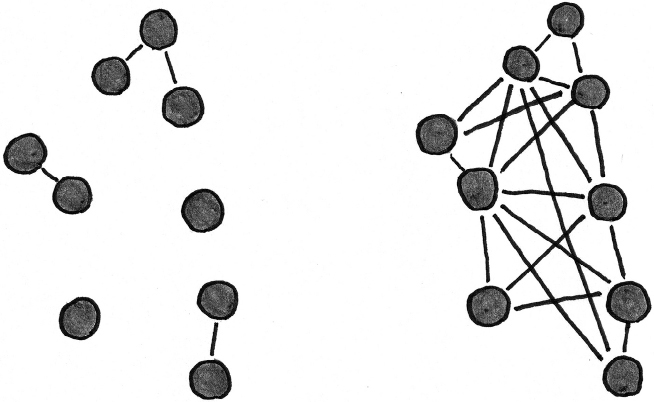

# Get Better at Anything: 12 Maxims for Mastery【Scott H. Young】

Introduction
-------------------------------------------------

Life depends on learning. We spend decades in school, acquiring an education. We want to be good at our jobs, not just for the perks that come from being one of the best, but for the pride that comes from mastering a craft. Even the things we do for fun, we enjoy to a large extent because we feel we’re capable of getting better at them.

Yet learning is often mysterious. Sometimes it comes effortlessly, as when we quickly find our way around a new neighborhood or pick up the routine at a new job. In other cases, it’s a slog. We may spend hours in the library, with little to show for it on the final exam. We may want to switch companies, industries, or even professions, but not feel qualified to make the leap. We can spend decades driving a car, typing on a computer, or hitting a tennis serve without reliably getting better at any of them. Improvement is inconsistent, if it comes at all.

Whether your aim is eventual mastery or just to get a little bit better, it helps to understand how learning works. Simple principles can explain why progress comes easily in some situations, and can be frustratingly absent in others. To begin, let’s look at an unlikely story of world-class skill development—how *Tetris* players suddenly became much better at the game, three decades after it first became popular.

### The *Tetris* Enigma

As he does most days, Joseph Saelee fired up a game of *Tetris* on February 15, 2020. Immediately, the iconic, four-square multicolored bricks begin falling at a rate of roughly one every second. Despite a pace that would make most arcade buffs sweat, Saelee is barely paying attention. Instead, he’s chatting with the handful of followers who have come to watch him play live on the online streaming platform Twitch. The conversation slows as he reaches level 19. Saelee must now find and maneuver each brick into the best possible spot in the two-thirds of a second it takes for them to reach the bottom. Before it lands, he is already glancing at the display indicating the next piece—the only reprieve from the otherwise completely unpredictable sequence of shapes. After nine levels at this blistering pace, the speed doubles once more. The bricks barely blink into existence before they are already at the bottom of the screen. As he completes this stage, the level counter glitches, changing from displaying “29” to “00”—a clear sign that the game designers thought nobody would make it this far. Seemingly in a trance, Saelee jiggles his fingers to tap the buttons on his controller more than ten times per second. He is able to perfectly place each brick, clearing space fast enough to prevent new ones from overwhelming the screen. After a few minutes, he makes his first mistake—a single misplaced brick stands tall above the otherwise neatly arranged rows. In the blink of an eye, it is all over, a deluge of squares filling the screen. Despite this, Saelee is smiling. Defeat may have been inevitable, but Saelee had managed to reach level 34, a feat that had never been accomplished in the thirty-year history of one of the most popular video games of all time. Saelee was just eighteen years old.

Joseph Saelee is obviously skilled at *Tetris*. But what is more remarkable is how much better he is than the first generation of players who were obsessed with the game. Playing on level 29 was long thought impossible. Bricks dropped so fast that simply holding left or right, a player couldn’t move them all the way to the edge of the screen before they became locked in place at the bottom. Since a complete, horizontal row of blocks is needed for them to disappear in the satisfying *Tetris* click, fans regarded the level unplayable, nicknaming it the “killscreen.” Another feat, achieving a maximum score of 999,999 points in a single session, was long sought by early players. But the first documented “max-out” didn’t occur until two decades after the game’s release, when Harry Hong reached the top score. In contrast, over the span of a single tournament in 2020, Saelee maxed out twelve separate times. Nor is Saelee unique in his *Tetris* proficiency. During the same tournament, forty different players reached the maximum possible score. How does a game, long past its prime, produce much better players?

### *Tetris*, Then and Now

*Tetris* feels dated today, so it’s easy to forget the sensation it caused when it debuted. Invented by Russian computer scientist Alexey Pajitnov in 1984, the game spread via floppy disc through the twilight years of the Soviet Union. Pajitnov, like many an office employee after him, was hooked by his own creation, playing *Tetris* instead of working. Vladimir Pokhilko, a psychologist and friend of Pajitnov, thought the game was so enticing it could be used to study addiction. Eventually he had to destroy all his copies when it became clear that his research staff weren’t getting any work done. After it was stumbled upon by software broker Robert Stein during a trip to Hungary, the game set off a ferocious battle for distribution rights in the West. Eventually Nintendo emerged victorious, creating the definitive edition for its Nintendo Entertainment System (NES), selling millions of copies and creating a generation of devoted fans.

While for most players, *Tetris* was just an amusing pastime, others became obsessed. Ben Mullen, an early record holder, kept detailed statistics on his play to try to find hidden patterns to optimize his performance. “I found out that, actually, exactly one half hour after you have some coffee, you play the best *Tetris*,” he reports. Harry Hong played so much he had to place a shirt between his thumb and the controller to keep from getting blisters. Others played until they began to hallucinate falling blocks, in what would later be called the “*Tetris* effect.” But devoted as they were, none came close to the performance effortlessly displayed by modern players like Saelee.

### Resolving the Enigma

A clue to understanding the stark change in proficiency comes from observing how players made their achievements known. In the earliest days, official records were managed by Twin Galaxies, a video game record database. Players submitted their high scores, along with some form of verification. If deemed legitimate, referees would post the scores to a central leaderboard on their website. But the process was cumbersome. Players might fail to sufficiently document an attempt, resulting in a record that was ultimately unsubmittable. This was the fate of Jonas Neubauer and Thor Aackerlund, who had claimed to have reached a max-out before Harry Hong, but couldn’t prove it. But for years, there was no other option. If you wanted to be seen as the best, you had to go through Twin Galaxies.

This started to change after YouTube. Freely uploading videos, players could share their world records directly, rather than going through an intermediary. While this made it easier to submit a new top score, it had an important side effect: if you posted a video of a world record performance, everyone could see how you did it. Before that, Twin Galaxies had only posted the top score, not the evidence itself used to verify it. Players could now not only marvel at the skill of elite *Tetris* players, but see how they did it.

While early YouTube provided greater transparency, the informal nature of the records also created temptations to cheat. Older games like *Tetris* could be run on an emulator, a piece of software that allows you to play console games on a personal computer. This specialized software lets players slow down the gameplay or rewind to undo mistakes. While careful sleuthing can often spot telltale signs of a fraudulent record, genuine players started investing in ways to authenticate their performance. Recording not just the screen but also video of the players’ hands became common. Livestreaming further increased authenticity, as the best players could be watched playing the game in real time, making cheating nearly impossible.

Observing hand movements, innovations in button pressing could be widely replicated. A method known as hypertapping, where players vibrate their thumb to hit the direction buttons more than ten times per second, was key to breaking through the level 29 barrier. Thor Aackerlund, the best player of the early era, had invented the technique. But as few could witness and emulate his approach, it remained unused for nearly two decades. Livestreaming also created an incentive for commentary. Great players, pushed to communicate with an audience, shared their thinking behind the game in real time. Discussion ran in both directions, as top players not only shared their strategies, but viewers could immediately scrutinize potential mistakes. While an earlier era of game masters might have jealously coveted a secret strategy that gave them an edge, modern competitors were forced to be radically transparent, with every button press exposed for all the world to see.

Online forums greatly expanded the network of potential players to learn from. In the 1990s, your resources for improvement were limited to your circle of friends. If you happened to know a very good *Tetris* player, you might learn a few tricks. But if you didn’t, some of the subtler aspects of the game might be invisible to you, despite years of experience. Harry Hong revealed in a 2010 documentary that his preferred strategy was building his blocks on the right, leaving a gap on the left side of the screen. This strategy is considered inferior today. A quirk in the game’s rotation algorithm makes the all-important bar-shaped block easier to rotate and shift to the opposite side. Dana Wilcox, another former top player, wasn’t even aware that you could rotate the pieces in both directions. Such a gap in knowledge meant she couldn’t execute a few tricky maneuvers, such as a “T spin,” where the T-shaped block is twisted at the last possible moment to hook into an otherwise unreachable position. Today a new player can easily find the best strategies, even if they take considerable practice to master.

*Tetris* players are better today because their environment enables it. Video hosting allows detailed demonstrations of the best play to be broadcast widely. Online forums transform informal conversations into permanent reservoirs of knowledge. Livestreaming encourages extensive practice, including near-instantaneous feedback from an audience increasingly knowledgeable about the top techniques. Ultimately, the story of *Tetris* is not about any individual, although players such as Joseph Saelee certainly merit distinction. Instead, it’s a story about the game itself, and how the way it was played accelerated progress.

### The Three Factors for Getting Better at Anything

As the story of *Tetris* illustrates, improvement depends on more than just talent or tenacity. There are three factors that determine how much we learn:

1. **See.** Most of what we know comes from other people. The ease of learning from others determines, to a large extent, how quickly we can improve.
2. **Do.** Mastery requires practice. But not just any practice will do. Our brains are fantastic effort-saving machines, which can be both a tremendous advantage and a curse.
3. **Feedback.** Progress requires iterative adjustment. Not just the red stroke of a teacher’s pen, but contact with the reality we’re trying to influence.

When we’re able to learn from the example of other people, practice extensively ourselves, and get reliable feedback, rapid progress results. Yet, when one or all of these factors are inhibited, improvement often becomes impossible.

More often, we find ourselves in a situation between the extremes that maximize learnability or prevent it entirely. Instead, there are both obstacles and opportunities, ways we can accelerate progress by finding the right environments, mentors, practice regimens, and projects to work on. The difficulty is often in knowing exactly what to look for.

#### See: The Power of Examples

We learn best through other people. Our ability to learn from each other greatly exceeds our ability to solve problems on our own. *Tetris* performance accelerated once the methods for high-level play became widely accessible. “The secret of our species’ success lies not in our raw, innate intelligence or in any specialized mental abilities,” writes Harvard anthropologist Joseph Henrich. Instead, he argues it’s the ability to learn easily from the innovations of others that makes us uniquely capable as a species.

In some cases, intelligent animals can beat us in displays of problem-solving ability. Researchers have shown that crows can solve the problem of getting food out of a narrow bottle by fashioning a hook with a metal wire. Yet if a modified version of the same task is given to five-year-olds, fewer than a tenth figure out the trick. But if our problem-solving capacities are only modestly greater than some of our animal cousins, our imitative abilities are second to none. In an experiment, researchers compared two-and-a-half-year-old children to chimpanzees and orangutans on a battery of cognitive tests. Contrary to our species’ presumed superiority, the researchers found that children and apes performed similarly on puzzles involving spatial, quantitative and causal reasoning, with the chimps even edging out the children on some tasks. The clear exception was in social learning, where the toddlers were easily able to solve a problem when given a demonstration, but virtually none of the apes could. Young children may not compare favorably to crows and chimps in raw problem-solving ability, but they regularly learn to read, write, talk, add, multiply, draw, sing, and use a television remote—something no other animal can even attempt. The cliché of mindless learning, “monkey see, monkey do,” has it exactly backward. Imitation is the foundation for human ingenuity.

Yet the ability to learn from others has its drawbacks. When we lack access to people we can learn from, we struggle to make progress. The early devotees of *Tetris* were essentially isolated from one another. They played alone, or with a handful of close friends. Techniques for best play couldn’t be transmitted, so each person had to evolve their own methods. In rare cases, such as with the video game prodigy Thor Aackerlund, this could go quite far. But in most cases, the result was play far below human potential. New technologies such as video uploading, livestreaming, and online forums greatly accelerated the dissemination of best practices. Even if *Tetris* is no longer the most popular game in the world, today’s generation of players is far more interconnected.

**Figure 1**

More connections between players means more chances for innovations to spread. Members of the network on the right have more opportunities to learn from peers than those on the left.

---

The quality of examples we learn from also matters greatly. The transition to scientific chemistry from its origins in alchemical practice serves as a useful illustration. Early alchemists may have been wrong about the possibility of turning base metals into gold, but they did possess some reliable chemical knowledge. Many alchemists worked to develop a theory of matter and others even conducted controlled experiments. Yet they chose to deliberately obfuscate their findings out of a desire to keep esoteric techniques out of less experienced hands. As historian and chemist Lawrence Principe writes, “Alchemy’s primary sources present a forbidding tangle of intentional secrecy, bizarre language, obscure ideas, and strange imagery. The alchemists did not make it easy for others to understand what they were doing.” Alchemists used code names, or *Decknamen*, to conceal the identity of certain substances. They wrapped recipes inside fantastical allegories that had to be deciphered to be understood. They omitted, swapped, or added unnecessary steps to confuse unskilled readers. While this certainly had the intended effect of limiting knowledge to a privileged few, it also prevented the accumulation of reliable knowledge. Would-be alchemists had to repeat predecessor’s experiments dozens of times. A failed attempt didn’t prove the recipe was incorrect, as it was always possible that it hadn’t been properly decoded. Even a brilliant thinker such as Isaac Newton spent much of his life chasing down alchemical lore without realizing it was a dead end. In contrast, Robert Boyle’s experiments with his air pump—which led to the formulation of Boyle’s Law still taught in chemistry classes today—were meticulously documented, with dozens of illustrations of his experimental setup and the measurements he obtained. Confusing explanations and omitted steps in a process aren’t limited to alchemical texts. We often struggle to learn when materials are poorly designed and force us to do more work than is necessary to understand a concept or master a procedure.

Knowledge is not evenly distributed. Despite the promise of the internet age, the majority of the world’s knowledge isn’t written down and freely available. Instead, it’s locked away in the minds of experts, many of whom would struggle to articulate what they know. Knowledge is often not inside the head of any individual at all, but embodied in practices spread over groups. In a 1980 documentary, economist Milton Friedman, channeling an earlier essay by Leonard Read, used the example of a wooden pencil. “There’s not a single person in the world who could make this pencil. Remarkable statement? Not at all.” Friedman goes on to explain that the wood chopped down requires saws, which requires steel, which requires iron ore. The rubber, paint, glue, and graphite all involve enormously complicated supply chains to manufacture. The knowledge of building something as simple as a pencil isn’t held by any individual, but groups who work together toward a common purpose. As our science and technology develop further, individual achievements may become increasingly rare as distributed groups become necessary to bring together all the knowledge required to solve hard problems. New advances in artificial intelligence may accelerate this trend, as the world of book knowledge becomes increasingly accessible, but the tacit understanding of unspoken practice remains within cloistered communities of experts. Access to the environments where knowledge resides is often a bigger hurdle to mastery than learning itself.

#### Do: The Necessity of Practice

Being able to learn from others is only the first step. Skill requires practice, not just observation. Practice plays a number of important roles in learning. The first is that repeated practice reduces the mental effort to perform tasks. Using functional magnetic resonance imaging (fMRI), researchers observed the brain activity of *Tetris* players as they gained experience with the game. Contrary to the expectation that using more of your brain equals greater performance, players’ neuronal activity decreased as they played more. This broadly supports the idea that, through repeated play, the players had become more efficient in using their nervous system. If you’ve driven a car for years, you have probably noticed something similar. What was previously an effortful task that required your full attention now can be done unthinkingly. Your mind wanders elsewhere while your hands and feet go through the motions. The ability to automate component skills is a key factor in the performance of many complex tasks, and is one of the reasons why we can’t simply perform at an expert level merely from watching someone else do it.

Another reason for practice is the importance of memory retrieval. Watching someone perform a skill is often necessary to figure out how to do it. But if the answer is always available when we practice for ourselves, we may not remember it deeply. If you’re old enough to remember an era before cell phones, you probably memorized a few dozen phone numbers you called regularly. Today, despite seeing the number every time you hit the dial button, you may struggle to recall a single phone number other than your own. The difference is that, before contacts were saved directly on our phones, every call forced you to retrieve the number from memory. Retrieval beats review for strengthening your memory.

Finally, while we’re fantastic imitators, many parts of a skill cannot be emulated. How the arm moves in a tennis serve or how the wrist flicks in a brushstroke can certainly be observed. But everyone’s musculature is unique, so these observations are only approximations of how you must perform the skill yourself. Perceptual skills like discriminating patterns in an X-ray or predicting the path of a golf ball rolling down a green have large tacit components that can’t be easily communicated, even with a patient teacher. Hands-on practice is essential to master the aspects of skills that can’t be taught in a book.

The necessity of action in learning creates its own obstacles. It’s more effortful to actively practice than to passively watch a video, so it’s easy to lean toward consumption rather than action. Access to the real environment for performing the skill may be limited. It’s hard to get good as a pilot without a plane or as a filmmaker without a camera. Finally, the balance between learning from others and doing it for yourself can be tricky to find with complex skills. Too little support, and learning is frustrating trial and error. Yet too much can be harmful too, as when seeing a pattern preempts our ability to retrieve it. We don’t always make this choice correctly. Researchers have found that low-ability students benefit from more structured environments, so they can learn problem-solving patterns they don’t yet have in memory, while high-ability students benefit more from less structured environments, where they can get more realistic practice and are forced to retrieve knowledge they already possess. Yet students prefer the method of learning that works worse for them! An explanation for this perverse tendency is that learning is effortful and we try to conserve effort. Low-ability students find the demands made by the structured approach taxing, and so opt for the flexibility to avoid meeting a rigorous standard. In contrast, high-ability students find the added structure easier and so prefer following the recipe rather than generating the right answer on their own. Fine-tuning the difficulty matters greatly for learning, and we don’t always get it right.

#### Feedback: Adapting with Experience

Repeated practice isn’t enough. Without feedback, improvement is often impossible. As early as 1931, psychologist Edward Thorndike had subjects practice drawing lines of a particular length. Despite performing the skill three thousand times (in what must have been a riveting experiment), subjects failed to make any progress. The expert of expertise, psychologist Anders Ericsson, developed the concept of deliberate practice to explain how elite performers in music, chess, athletics, and medicine were able to reach peak levels. The presence of immediate feedback was central to this conception. Just as high-quality, immediate feedback underlies the progressively deepening skill of elite athletes and musicians, its absence can also explain deteriorating performance. In a systematic review, researchers found that the quality of medical care tended to decline as doctors spent more time on the job. Patient outcomes only depend partly on doctor’s interventions, and the difference between best practices and outdated techniques is often only possible to spot in carefully controlled trials. This spotty feedback means it can be difficult to engage in the kind of deliberate practice Ericsson argued is central to continuing mastery.

We can accelerate our progress by creating better systems for feedback. During the Vietnam War, both the Navy and Air Force were losing a fighter plane for every two enemy planes taken down. To improve this, the Navy created the Navy Fighter Weapons School, also known as the Top Gun program. This involved simulated sorties where trainees flew against the best possible pilots. After each encounter, their performance was reviewed in depth, with each decision discussed in an after-action report. The result was that while the Air Force’s success in taking down enemy fighters continued to be two-to-one, the Navy jumped up to twelve-to-one, a sixfold improvement. Ericsson reported an experiment run with foreign exchange traders in a European bank that experienced similar performance improvements from the competitive simulations with after-action feedback. Being able to design more valid, informative feedback into your improvement efforts can be the difference between progress and stagnation.

### Why Learning Still Matters

Separate from the worry about whether improvement is possible is the worry that learning may soon be obsolete. As I write this, sophisticated computer programs can now write poems, explain quantum mechanics, and illustrate pictures in any artistic style, on demand. Assuming such technological progress continues, what will be the point of mastering skills that can be performed effortlessly through silicon chips? But the rise of technological change is just as likely to create a demand for new learning as it is to undermine old abilities. The invention of paper was decried by Socrates for degrading the faculty of memory, but the outcome was an explosion of knowledge that no individual could hope to memorize in a single lifetime. Information technology has rendered some jobs nearly obsolete, even as it has invented new ones that did not exist before. In a paper authored by Massachusetts Institute of Technology economist David Autor and colleagues, the researchers found that roughly 60 percent of the jobs people had in 2018 didn’t exist in 1940. While technology may have reduced the demand for typists and telephone operators, it also created an explosion of software developers and business analysts. A reasonable extrapolation of past technological trends would suggest that advances in artificial intelligence will result in greater demands for learning, not less. Predictions are hard, especially about the future.[\*](9780063256651_Footnote_001.xhtml#rfn1) And so I will avoid speculating on which exact skills and knowledge will end up as essential for future generations. However, insights into the process of learning, and how we can make it more successful, are likely to become more relevant, not less.

### A Curious Quest

I’ve long been fascinated by learning. In 2019, I published my book *Ultralearning*, diving into the strange world of obsessive autodidacts, and drawing upon some of my own experiences learning languages, programming, and art. But curiosity is a strange drive. Unlike hunger or thirst, curiosity is stoked, not sated, when we learn more. And so, despite spending years both striving to learn new skills, and trying to make sense of the academic research behind skill development, I ended up embarking on a new quest to try to resolve questions my previous efforts left unanswered. A couple hundred books and several hundred academic papers later, I’ve found satisfying explanations for some of my earlier puzzles. But, in keeping with all quests of curiosity, new questions have multiplied in their place. This book is, in many ways, an effort to make sense of what I’ve found.

I wrote this book with two audiences in mind. First, I wanted to write from the learner’s perspective. If you want to get better at anything, how should you do it? What kinds of examples should you seek? What kind of practice works best? What influences whether you’ll attain mastery or plateau early on? Secondarily, I wanted to examine how teachers, coaches, parents, and those responsible for shaping learning within an organization can cultivate improvement. Since the birth of my two curious learners, I’ve become keenly interested in what I can do as a father to guide them in becoming the best they can be. Good teachers are precious, and the science underlying successfully fostering skill development is not widely known. Above all, I wrote this book for people like me—those interested in getting better, but not always sure the best way to proceed.

### What to Expect from This Book

Over the next twelve chapters, we’ll dive deeper into the three themes of seeing, doing, and feedback. Improvement may not always come easily, but we can all think more intelligently about how we learn. Each chapter is expressed as a simple maxim. My hope is that long after the details of the research explored in each chapter have faded, these rules of thumb will serve as both a reminder and a useful—if imperfect—summary of the key principles.

Maxims one through four are about the power of examples:

1. **Problem Solving Is Search.** We’ll begin with a mathematical mystery that lasted for over three centuries, and the groundbreaking theory of problem solving that can help us understand its resolution. We’ll explore the difference between routine and creative thinking, and how what we learn from others greatly shapes the complexity of problems we can solve.
2. **Creativity Begins with Copying.** Next, we’ll dive into artistic training during the Renaissance. Imitation—far from being opposed to creativity—is the seed for original work. We’ll explore the mind’s bottleneck, and how the best strategies for acquiring knowledge often differ from the processes used to generate new ideas.
3. **Success Is the Best Teacher.** Sophisticated skills depend on having the proper foundation. When the building blocks are missing, learning is slow and frustrating. Experiencing genuine successes early in the learning process can make motivation self-reinforcing.
4. **Knowledge Becomes Invisible with Experience.** Finally, we’ll explore the curse of knowledge, or how expertise leads to a receding awareness of the basis of our own proficiency. Expert intuition, while powerful, often makes it more difficult to acquire complex skills, as capable performers lose the ability to explain how they do it. To remedy this difficulty, we’ll explore a family of tools to extract the knowledge experts take for granted.

Maxims five through eight deal with improving our practice:

5. **The Difficulty Sweet Spot.** Progress depends on finding a delicate balance between making practice too hard or too easy. We’ll explore research showing when difficulties can be desirable . . . as well as when they are not. We’ll look at the writer’s paradox—or, why the best writers seem to suffer from the most writer’s block. We’ll examine several tools for fine-tuning the difficulty level of your improvement efforts, from progressive problem solving to constructing a practice loop.
6. **The Mind Is Not a Muscle.** What improves when we practice a skill? Despite its enduring appeal as an analogy, the metaphor that the mind is like a muscle is highly flawed, as shown by over a century of research. Research on the transfer of learning will help us understand when strengthening one ability will lead to improved performance in another.
7. **Variability Over Repetition.** Next, we’ll dig into the development of improvisational abilities among jazz musicians. How do players create complex performances without repeating themselves? In answering this question, we’ll explore the science showing how practice variability can lead to more flexible skills.
8. **Quality Comes from Quantity.** Genius is prolific. In this chapter, I’ll explore research showing how, to a surprising extent, creativity simply *is* productivity. Those who produce the best work are almost invariably those who produce the most work. We’ll look at the implications of this for your own efforts to make an impact.

Maxims nine through twelve revolve around the role of feedback:

9. **Experience Doesn’t Reliably Ensure Expertise.** Practice doesn’t make perfect. Indeed, without the right kind of feedback, practice often doesn’t even make us very good. In this chapter, we’ll look at learning in environments of uncertainty. We’ll compare poker players, who manage to master a complex game despite wild swings of luck, with the more typical case where decades of professional experience lead to mediocre predictions. Drawing on these differences, I’ll offer suggestions on how we might tame unfriendly learning environments.
10. **Practice Must Meet Reality.** In this chapter, we’ll explore the reckoning from the worst aviation disaster in history. What we learn in a classroom has a complex relationship to what is practiced in the field. True proficiency requires contact with the physical and social settings where a skill will be used.
11. **Improvement Is Not a Straight Line.** Getting better often first requires getting worse. In many subjects, we come equipped with intuitions that bear little resemblance to proven scientific theories. As we progress, improvement comes to depend on rooting out misconceptions, inefficiencies, and mistakes.
12. **Fears Fade with Exposure.** Finally, I’ll shift from learning skills to the anxieties that often surround them. We’ll look at the surprising effectiveness of exposure therapy in overcoming fear, and why many of the intuitive strategies we develop to cope with our anxieties backfire. Courage, not just cleverness, is essential for mastery.

Finally, in the conclusion, I’ll step back from the research and discuss how you can integrate these ideas in your own practice. Whether you’re studying for an exam, needing to learn a new skill at work, or just want to get better at something you’re interested in, I hope these suggestions will provide a starting point for thinking about how you might do it better.

To start, let’s look at the science of problem solving, by looking at the story of a puzzle that took over three hundred and fifty years to resolve.

Conclusion: Practice Made Perfect
-----------------------------------------------

There’s an old tale about a woodcutter who was given an axe and three hours to chop down a large tree. The woodcutter decided to spend the first two and a half hours sharpening the axe. In a similar way, we spend countless hours of our lives on things we want to do well. We want to be better parents, professionals, artists, and athletes. In comparison to all this chopping, we often spend only a small fraction of the time actively trying to sharpen our axe. I began writing this book with a particular reader in mind: You’re someone who cares about how learning works. You want to improve at something yourself, whether that is getting an A on your exams, becoming an expert at your work, or feeling confident in a sport or hobby. Or perhaps you’re more interested in helping others get better. You’re a coach, teacher, employer, or parent looking to see how you can help those around you acquire valuable skills. While it’s a professional hazard to make blanket statements about one’s audience as an author, I feel fairly confident that if you’ve made it this far, you care about sharpening the axe.

Throughout this book, I’ve shared stories and research about how learning works. We’ve seen the importance of examples and how our problem-solving efforts build on the knowledge of others, examined the mind’s bottleneck and how it constrains the path to mastery, considered the importance of building skills from a successful foundation, and seen how to extract knowledge from experts who often forget what it was like to be a beginner. We’ve dug into the power of practice: the importance of progressive problem solving and fine-tuning the difficulty in our training, why the mind is not like a muscle and how we should be more precise in our attempts at improvement, the value of variability in creating flexible skills, and why accomplishments at the frontier of creativity correlate so closely with overall productivity. Finally, we’ve examined the critical role of feedback: why many expert estimations are overconfident in environments of uncertainty, how the physical and social environment shapes the skills we need to master, the role of unlearning in eventual mastery, and how we can overcome our fears and anxieties when leaving our comfort zones to learn something new. In each of these chapters, I tried to synthesize a prominent perspective given by the research and suggest a few practical takeaways. The science of learning is diverse and often contentious. While I’m certain that not everyone will agree with all of my conclusions, I hope the citations listed in the [endnotes](9780063256651_Notes.xhtml) can be a jumping-off point for serious readers to engage with some of the ideas for themselves.

In this chapter, I’d like to step back from the research to try to pull all these diverse perspectives together and offer some general advice. My main focus will be on you as the learner. How can you get better at the things you care about? As a secondary consideration I’ll also try to reflect on what this research says about how we can be better teachers, coaches, and mentors to those who depend on us.

### Three Questions for Mastery

The economist and author Tyler Cowen likes to ask people, “What is it you do to train that is comparable to a pianist practicing scales?” Those without a good answer to this question, he argues, are perhaps not so serious about improving at their craft. The world is changing rapidly. Skills that could have sustained a profession for a lifetime may become obsolete as new technologies can do them automatically. Lifelong learning isn’t just a feel-good slogan, but a necessity. Given its importance, I think it’s useful to ask yourself three questions about the pursuits you care about.

#### Question One: How Can I Improve the Way I Learn from Others?

Examples, as we’ve seen, play a critical role in learning complex skills. The ability to learn from others is a distinguishing characteristic of our species. We see further by standing upon the hard-won problem-solving insights of those who came before us. When seeking out learning materials:

1. **Find examples that include all of the steps needed to solve the problem.** While we can easily observe the physical actions of another person performing a skill, mental actions are invisible. Indeed, the danger of learning from experts is that their fluency with a skill causes them to skip over intervening steps. A good worked example should break down the problem-solving steps to a level so that each action is comprehensible to the person who is studying it.
2. **Make sure you’ve learned enough background knowledge so the examples make sense.** Understanding is not an all-or-nothing property, so we must use judgment. Too little explanation and the problem is a memorized answer without any generality. Too much and we can fall down a rabbit hole of endless elaboration.
3. **Seek out varied examples to generalize the problem-solving patterns.** The ability to form abstract concepts and analogies from concrete instances is central to our flexibility as thinkers. Yet novices to a field tend to perceive problems more in terms of superficial features than deep principles. Offering multiple examples that exhibit a broader range of variation makes it easier to extract what they have in common. It’s also often helpful to present counterexamples: similar-seeming situations that don’t work for a subtle reason to prevent overgeneralization.

The obvious first place to start looking for examples is in well-structured courses. These have the advantage of sequencing examples, making sure background knowledge is made available and in revealing otherwise invisible mental steps performed by experts. As we’ve seen in [chapter 3](9780063256651_Chapter_003.xhtml), beginning with a successful foundation can make a big difference for mastery and motivation. In-person classes, massive open online courses, textbooks, and even YouTube videos can provide a good starting place for many skills. If you can afford it and help is available, getting one-on-one tutoring is also particularly helpful—especially if off-the-shelf materials are lacking.

As we gain experience in a domain, classes replete with worked examples tend to be less common. This is partly a matter of economics. Most people are beginners to a skill, so the largest market exists to serve those just starting out. Additionally, knowledge tends to branch and specialize as skill progresses. This makes it much harder to reliably cover everything that matters as you make more progress. Being more advanced does not imply learning from examples is pointless, however. Recall from [chapter 1](9780063256651_Chapter_001.xhtml) that Andrew Wiles, despite being a PhD-holding specialist in the area of mathematics needed to solve Fermat’s Last Theorem, nonetheless spent two years reading everything he could in preparation for the proof. Instead, it is simply the case that as we move beyond the examples neatly laid out in courses we must lean on more informal resources.

Joining communities that practice the skill you are trying to master can be essential for making continued progress, past the stage covered by beginner resources. This is particularly true for professional skills, where good examples are often hard to find without access to the working environment. For professions that depend on cutting-edge knowledge, such as in science or technology, access to communities working at the frontier can be critical if you want to make a novel contribution. Even for professions that don’t depend on generating new knowledge, access to an environment with rigorous standards and varied work problems can be instrumental in pushing your skills further. Management consultants face a wider range of problems in working with multiple firms than do those who work in a single company. One study even found that consultants did better than restaurant managers when being asked business problems concerning a restaurant, despite similar levels of overall education. Mapping out a pathway to participation in these accelerated learning environments doesn’t guarantee access, but it is an important first step.

Being in the same room as skilled practitioners isn’t usually enough, however. Extracting knowledge from experts can be a tricky business, but we can take lessons from cognitive task analysis. Asking them to solve problems in front of you, listening to their stories with attention to the timeline of events, or simply asking whom they find knowledgeable about specific issues can begin to reveal what experience has hidden.

#### Question Two: How Can I Make My Practice More Effective?

Access to high-quality examples is just the first step in learning effectively. Mastering anything requires a lot of practice. Unfortunately, our intuitions are unreliable guides to what kind of practice is most effective. Desirable difficulties from techniques such as retrieval, spacing, or interleaving tend to be rated as ineffective by students, even when students learn better by using them. Even if the right kind of practice is rarely obvious, we can use the principles covered so far to fine-tune our efforts.

A first consideration is complexity. Working memory is limited, but the cognitive load for a given task depends heavily on our prior experience with it. This means the most effective kind of practice is always changing in the process of learning. Early on, we benefit from more guidance, repetition, and studying examples over problem solving. As we build experience, however, this advice flips, and we benefit from less structured problems, varied practice, and progressively harder challenges. One way to think about this tension is that, in the beginning, the key challenge is getting knowledge into your head. While it is possible to learn through direct experience, the potentially vast spaces of problem-solving search and the extraneous cognitive load of means-ends analysis often result in studying examples being more efficient. However, once the knowledge is in your head, the problem flips to getting it out at the right time! This requires practice, as you sort out when the problem-solving patterns you learned initially apply to ambiguous situations. One way we can avoid the pitfalls of either failing to get the right knowledge into our head, or failing to get it out at the right time, is by constructing a practice loop. By combining seeing an example, doing a practice attempt, and getting feedback, we can start to assimilate the patterns of expert performance.

Another consideration is the grain size of practice. Should your practice loop be focused on a specific component skill—say vocabulary flash cards, tennis serves, or math puzzles? Or should it be broader—say, full conversations, tennis games, or applying math in a real-life situation? Advocates of the former tend to focus on the value of part-task practice to reduce cognitive load, benefiting learners who might otherwise struggle with complete tasks. Drills may also be easier to compress into a practice session. A basketball player can shoot a lot more layups during a practice session than during a game. Advocates for whole-task practice point out that repeating a drill until it becomes completely automatic does not always translate into fluent performance during the complete task. A person who drills flash cards for vocabulary may recognize them instantly but still slow down when hearing them in the context of a conversation. Whole-task practice is also more meaningful, as the actions are understood in their useful context. As with the tension between seeing examples and solving problems for yourself, I believe both drills and realistic practice are important.[\*](9780063256651_Footnote_008.xhtml#rfn8) Drills can iron out tricky spots in a complex skill and reduce cognitive load for handling tough situations. Yet we also need a lot of practice with complete tasks so that those skills are well integrated and meaningfully understood. We can resolve the tension by working back and forth, a loop between drills and realistic practice on top of our basic practice loops that combine seeing, doing, and feedback.

As a final consideration, we should also be clear-eyed in thinking about what a skill is. The mind is not a muscle, so vaguely described abilities such as being a better problem solver, strategic thinker, or being more creative probably aren’t things that can be improved or practiced in general. Instead, we become better problem solvers by accumulating more strong methods for specific kinds of problems. We become better strategic thinkers by learning particular strategies and mental models that apply to particular situations. We become more creative by accumulating useful knowledge and giving ourselves a secure environment to explore them in unfamiliar ways. There’s nothing wrong with having broad goals for improvement. Becoming completely fluent in all aspects of a language is a fine aspiration. But it’s also the case that achieving this goal consists of accumulating a lot of individual words and phrases, and separately practicing skills of pronunciation, reading, writing, and listening. Grand ambitions to be better communicators, programmers, investors, writers, or artists must proceed from a recognition that this is achieved by building up and integrating a lot of specific skills and knowledge. A symphony can only be performed by playing the notes.

#### Question Three: How Can I Enhance the Quality of My Feedback?

Finally, obtaining high-quality, realistic feedback is essential. Some feedback is really just an example, presented after the fact. If you get the answer wrong on a mathematics exam, your instructor might give you the solution in the form of a worked example, showing you what you should have done. This kind of feedback is particularly valuable, because it combines the advantages of seeing an example with the fact that, having recently gotten the question wrong, you’re more likely to pay attention to and study it. This works well when there is a single, correct answer and it’s relatively easy to make a comparison between what you did and the canonical response.

However, most domains aren’t like this. There are many ways to write an essay, design a building, lead a team, or give a speech—even if some ways are better than others. Corrective feedback in these cases can still be quite valuable. A knowledgeable teacher, mentor, or coach can offer adjustments from the approach you actually used, instead of simply comparing it to a single correct answer. The informational value of feedback is obvious, but getting feedback from another person introduces social and motivational consequences that aren’t always positive. Corrective feedback is often blended with evaluative judgments. The letter grade you get on an essay isn’t just a nudge for better writing, but also a score that determines whether you’ll pass the class and graduate. Feedback can demotivate, as we all know from a particularly harsh response to something we worked hard on. But positive feedback can demotivate too. Research finds that bulk praise—“You’re so smart!”—also diminishes effort, since it encourages people to think they have no need to improve. These social and motivational considerations can easily wipe out the expected benefit of feedback. A good feedback environment is one where feedback is used to assist learning, not reward or punish performance, focused on making corrections to the task rather than judging the individual, based on a relationship of mutual trust and respect.

What about skills where there isn’t a right answer, or a teacher who can easily guide us to a better one? As we saw in [chapter 9](9780063256651_Chapter_009.xhtml), extensive experience doesn’t guarantee expertise. If the learning environment is uncertain, and we get inconsistent feedback, we may end up both overconfident and mediocre. Enhancing the quality of the feedback that the environment naturally provides is important for developing genuine skill. Some strategies for enhancing feedback include:

1. **Keep score and track performance.** For skills where outcomes are highly variable, we can easily mislead ourselves about the long-run accuracy of our decisions. Keeping score can be ego-bruising if we realize we’re not as proficient as we believe, but it’s necessary to calibrate our approach. Numbers don’t tell the whole story, but they do keep us honest.
2. **Conduct after-action reports.** As discussed in the opening chapter, after-action reports were essential for the Top Gun fighter pilots to learn from feedback about their simulated sorties. A major difficulty of learning from experience is that when our working memory capacity is devoted to performing a skill, we have almost no space to reflect or evaluate our performance. Making a record of your practice attempt that you can analyze afterward can suggest improvements that you might have missed in the moment.
3. **Form a brain trust.** Individuals have many cognitive blind spots. While aggregating individuals doesn’t automatically solve these problems, it can reduce them. Joining a group where members can dissect and discuss each other’s work is a powerful tool for highlighting weaknesses you might have otherwise missed.

Feedback is not just the correction of mistakes. Life is dynamic and involves a continuing interaction between ourselves and the physical and social world around us. Realistic practice becomes increasingly important as we make progress, because the feedback generated from contact with the environment becomes incorporated into our skills. The social environment also plays an important role, as practices emerge informally in the ongoing activity of groups who work together, often unstated and frequently diverging from the stated practice described in books and classrooms. This doesn’t imply that the most realistic practice is always best. Cognitive load, cost, access, and enhanced feedback can all make simulations more efficient than the real thing. But genuine mastery is nearly impossible to achieve without direct engagement in the environments where a skill is actually applied.

Apprehensions and fears are also shaped by feedback. Our anxieties about learning a new language, studying math, standing onstage, or working in a new field are often bigger determinants of our ability to make progress than memory or reasoning. Yet it’s difficult to rationalize our fears away. Instead, it’s the exposure to the feedback signal from the environment that a particular threat is overstated that adjusts not just our beliefs, but also our emotions.

### Some Final Reflections on Getting Better

The process of getting better can be both exhilarating and frustrating. The feeling of finally “getting” a subject, skiing down a hill without falling down, completing a painting that looks good, speaking another language, or publishing something that’s respected by your colleagues—few things can compete with the sensation of getting a grasp on a difficult skill. But learning can also be frustrating. We can spend years practicing something and still not feel particularly confident. We give up on hobbies, sports, professional opportunities, and paths of study because we don’t feel capable of learning them. My enduring interest in learning as a subject is, in part, because our experiences trying to get better encompass both extremes.

When I began working on this book, I had already spent nearly two decades writing and thinking about learning. My writing career began as a college student, publishing studying tips on a personal blog. After graduating, I dove headlong into yearlong projects learning programming, languages, drawing, and more. The successes and stumbles in those projects formed the backdrop for my previous book, *Ultralearning*. At the time, I had thought I had said nearly everything I could about the topic, and was prepared to move on to new subject matters. However, two things pulled me back into doing the research for this book. The first was encountering the *Tetris* story in the introduction. While *Ultralearning* had documented impressive individual achievements in learning skills, the story of *Tetris* was not about any particular player but a surrounding culture making improvement possible. This got me interested in various systems for learning, from the artistic apprenticeship of the Renaissance, informal practice of jazz musicians, and writing workshops among science fiction novelists to the training of pilots and phonics instruction in learning to read. In this book I wanted to move beyond the stories of a few impressive people learning something quickly, and focus on the basic factors that underpin learning in general.

The second factor that led to writing this book was an unresolved question from my previous book. In *Ultralearning*, I had written about some of the often-disappointing research on transfer of learning—that is, how much improvement in one skill leads to improvement in another. The implication that seemed obvious to me at the time was that if transfer is less than we think, we ought to spend more time practicing exactly the skills we intend to improve. As is often the case in learning more on a topic, my original intuition was neither confirmed or denied, but complicated. As I review in [chapter 6](9780063256651_Chapter_006.xhtml), there is considerable research showing that skills tend to be relatively specific. However, the science also pointed away from the idea that simply practicing the exact skill we wish to learn would invariably lead to improvement. John Sweller’s work on cognitive load theory, Albert Bandura’s theory of social learning, and the success of Direct Instruction highlighted the importance of having good examples and clear explanations. Paul Meehl’s work on clinical intuition complicated the belief that years of experience necessarily led to accurate judgments. The need to learn from others complicates my original intuition, because even if skills are relatively specific, we may not have easy access to the perfect mentor to teach us exactly what we need to know. The final form of this book was, in many ways, trying to reconcile those two competing constraints—the need to learn from others, along with the importance of specific knowledge and practice in getting better.

In *Ultralearning*, I wrote that preparing that book had mirrored its subject matter: an intensive self-directed learning project to write a book about intensive self-directed learners. I feel the same way about this book. Writing this book was a process of delving into cloistered communities of experts—trying to make sense of divergent findings and theories. Both trying to make sense of what experts who have studied these issues their entire lives think about the questions (and why they frequently disagree), but also making up my own mind, reflecting on my own experience learning different skills and subjects. I hope I was able to showcase some of the diversity of views, as well as broad areas of agreement, while still presenting a coherent point of view. I leave it to the reader to decide whether or not I have succeeded.

### A Little Further on the Road to Mastery

Mastery can be daunting. There is always far more to learn than we will ever have time to approach in our lifetimes. This is something I was consistently reminded of while researching this book. For every question I felt I had answered satisfactorily, a dozen new ones popped up in their place. The pursuit of mastery can be self-defeating. It recedes as you approach it. Each summit reached only shows you how many more peaks there are to climb.

Seen from the perspective of world-class talents, most of us will not master anything in our lives. We will never be as savvy an investor as Warren Buffett, as skillful a musician as Miles Davis, or as clever a mathematician as Andrew Wiles. If the aim of mastery is to reach the apex of proficiency, then it is an aspiration that dooms nearly all of us to failure. But reaching for mastery and failing to grasp it is a good way to fail. For even when we can’t become the best, we can still be a little better at the things that matter most to us. A little better is often enough.
