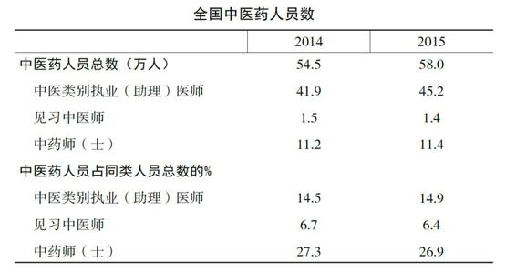

# 做自己的中医

代序 医缘
-----

人这一生，总在那么一些节点，突然热闹一下，然后慢慢归于平静。

我的某次经历大概就是这般的一次潮起潮落。

2016年12月的时候，我的微信公众号上一篇名为《产后发汗？自寻死路》的文章莫名其妙地在网上火了，可谓一石激起千层浪，阅读量已超40万次，微信公众号更是招来了数万多人关注，这数量都赶上我在深圳几年看过的患者人次了。

我想跟很多朋友说，其实，范大夫没有三头六臂，一天只有二十四小时，这二十四个小时不仅要用来上班、睡觉、吃饭、看书，还要陪伴家人，写文章的时间都是挤的，所以，几乎没有时间去为朋友们排忧解难，请原谅。

很多新来的看我文章的朋友，可能接受过一些不完全正确的治疗，但过去了就让它过去吧，往后的人生，都要用心地去过，不要做一个盲目跟风的人。

网络上的知识，都是被人筛选过的，包括我公众号里所有的内容都是，想要获得第一手的知识，一定要自己用心去学，没有人可以偷这个懒，偷懒是对自己不负责。

如果你们真想去了解中医，我希望，你们就真的去用点心。在我的微信公众号的文章《假如我当了中医老师，就这么虐学生》里，我罗列了一些入门的书籍。我也写过几篇关于自己的一些学习方法的文章，如《初时，我是这样学中医的》和《初时，我是这样学方剂的》等，供大家参考。

所以，如果你们只是来看热闹的话，我还是劝你们都散了吧！

同时我也不希望你们冲动地来找我看病，那些要从美国来的、从英国来的、从南非来的、从长沙来的、从哈尔滨来的等，请打消你们的念头。请外地患者不要因为冲动来找我，为此，我也曾经把我的出诊时间和地址都删掉了。

对于慢性病，我不可能一诊就能看好病，速成的东西，很少有好货。速效莫求，小利莫争。

在我的文章《我这医路》中，你们能看到，我的从医之路有多煎熬，我所有知识的获得的过程都不是容易的。所以，你们不可能骂几句就能轻易地动摇我心中的信念，我十几年所学的一些知识，也无法用几千字的文章来展示完，中医实在是太博大精深了，穷尽我一生也不可能学完。

所以，我希望来询问的朋友，在问之前，一定要用心去组织语言，或自己先行去了解一下相关的知识，这是对你们自己的尊重，也是对我的尊重。

如果你们没兴趣学，试着看看你们的孩子愿不愿学，最好从培养兴趣开始，当然，仍要以学业为重，中医当爱好即可，若有缘，考上中医药大学再认真学不迟。

但说实话，中医，真的不是那么好学的，我是多么希望有个师父带着我走，可惜如今这年代，这种缘分太难得，我在《致中医：远去的师徒》的文章中也有过记录。

十几年来，我家里也就存了那么五六百本书，尽管很多看得都是非常吃力的。但这也得益于这些前辈们无私写下来的经验，我才能延伸出那么一些大家喜欢的文章来，否则，我写的都是无本之木。

茫茫人海，你我一场“点赞”之交，也算是一次不经意的缘分吧！可能过了两天，看热闹的心思淡了，你们就会散去。

很多朋友，都是跟着我的公众号，看了一两年的文章了，很清楚我的脾气，不喜欢别人问重复的问题，我也不愿意说重复的话，你们多看看文章，就可以了解到多数问题的答案。我的文章几乎没有重复的，不敢说全是干货，但起码九成是。所以，这些朋友们才会一直跟着我的公众号，支持我写，每天等我更新。感恩这些一路陪着我的人，让我的人生路上不那么寂寞！

我希望，热爱中医的朋友们，不要急功近利，多久得的病，要花多久的时间去调理，罗马不是一天建成的，身体也是。

关于身体的修复，各个脏器要协同着进行，同时需要相当的时间来康复，并且也不以你个人的意志而转移，所以，千万不要急于求成，既然是慢性病了，那就给自己多一点时间，去琢磨，把问题琢磨透了再治，否则没想明白就动手是很容易出错的。东西吃进去了容易，再排出来就难了。

急，是解决不了问题的。慢慢来，反而比较快。

在我的微信公众号里，《我是如何变瘦的》文章中记录了一位朋友的减肥过程，这绝对是耐心与坚持的例子，很值得大家学习。

所以，喜欢阅读我文章的，你们不要急于提问，先去翻我的微信公众号里的目录，把一些基础内容看一看，我讲得已经很通俗了，也尽量写得生动有趣。

我对医疗的看法，是相对比较现实的。我一直认为，医疗是具有局限性的，它是不能解决人类的全部疾病的，我们能做的十分有限。所以，在微信公众号上来问病的人，需要你看一下我在微信公众号上写的《我的医疗观》一文，这样你才能更客观一点地对待医生和疾病。所以，不要一上来就拿医德良心绑架医生，把医生架火上去烤，医生的能力是有限的啊！

…………

中医这条路是很寂寞的，我希望我们成为路上的朋友。真的，一路走来，还在坚持中医的同班同学，已经没有几个了，在做着中医被称为大夫的人，也不知道还有几个在用中医思维。连我自己，中途都萌生过是不是入错行的念头。

这条路，什么时候才是个尽头啊？什么时候才能得到人的尊重啊？什么时候才能真正地养家糊口啊？我只是想做一个单纯的中医而已。

希望大家好好爱护那些还在坚守的、为数不多的中医们。

在权威部门发布的《2015年我国卫生和计划生育事业发展统计公报》中，我们可以看到如下数据：

2015年年末，全国中医药卫生人员总数达58万人，比上年增加3.5万人（增长6.4%）。其中：中医类别执业（助理）医师45.2万人，中药师（士）11.4万人。两类人员较上年有所增加。

截至2015年年底，执业医师（含助理）中医类别人员总数才45.2万人，散落在14亿人口里，你能碰到几个真中医？真的少得可怜！

这一路，真的走得好寂寞！身边没有几个真正在搞中医的人，独学而无友，寂寞如雪啊！慢慢地，我学会了上网。茫茫人海，终于碰到了一些有共鸣的人。一个、两个、三个……五个、八个、十个……

每当我们讨论完一个难题后，激情退下。当被子蒙头时，却又有一股难以言喻的热血在涌动！

这一路，竟还是有一些人跟你并肩作战和相互砥砺的，这感觉，真好！这样一群同龄的中医，聚在一起，天天讨论，真是人生一大快事！我希望我的这些朋友们，在这一路上，不忘初心！大家一起坚守下去，守住我们自己心中的那份信仰——心如赤子，意似钢铁。一辈子，就以钻研中医为己任，不为外物所撼动。珍惜一场医生与医生之间的缘分，以及医生与信任你的患者之间的缘分。茫茫人海，短短人生，所有的东西，都是镜花水月！但是当下，珍惜我们内心的那份坚守，一路走下去吧！最后大家的路都会越走越宽，认识的人都会越来越多。

妻子有一天问我：“你知道为什么有那么多人愿意相信你吗？”

我说：“那是因为我厉害呗！”

她摇了摇头说：“你不要得意忘形，大前年我牙痛，你治了多久，忘了？永远不要骄傲，学无止境。”

我又问：“那你说，为什么相信我？”

她说：“应该是因为你实诚吧，懂就是懂，不懂就是不懂。好在你长进，遇到难题，会去钻研，会去请教同行。”

我后来一想，好像还真是这么一回事。有些朋友好像就这么跟我讲过。

2016年年初的时候，我碰到这么一群人——那时我开了个中医育儿班（暂时不会再开了，责任太大），一次专门讲发热，一次专门讲咳嗽，和他们结下了一场师生缘，他们也是非常信任我的。

在中医育儿班上，我就有啥讲啥，会就是会，不会就是不会，她们竟然没嫌弃我。很感谢这群年龄跟我差不多大的学生们，每次讲课，都帮我整理资料，让我体会到了什么叫作教学相长。随着时间慢慢地推移，现在也成了朋友一样的关系。人与人之间的缘分，真的是十分奇妙。有聚就有散！随着时间的推移，缘散时，如朝露不可留！就如同还有一堆我没有看好的患者，也已经离我而去了。

想想，主要原因，可能还是我的水平有限，没有把他们的病看好。

记得我最难过的一次经历。有一位干呕的患者，在我这里看了两三个多月没有好，针灸、汤药都用了，尽我所能了，也没有效果。最后，我说就先停一停吧，容我再想想办法。所以，有时我的水平也稀松平常。

隔了半年多，自我感觉有了一些进步，对于这个问题，也有了一些想法，想联系她来商量要不要再治一下；或者问问有没有其他医生治好她，分享一下心得也行，等消息发过去时才发现，她早就把我拉黑了。

或许，这就是缘分吧！

人这一生，你可能和很多人都只是擦肩而过而已！

所以，刚看我文章的朋友们，现在，你我都只是一场“点赞”之交的缘分而已！

可能明天你就忘了我是谁，我也记不住你是谁。

咱们要好好对话，可能需要再沉淀一段时间。不要成为互相浪费时间的对象，皆因时间太宝贵了。

本书名字为《做自己的中医》，是希望大家能够通过这本书，更好地了解中医的基础知识、治疗的原理和方法，获得中医思维，能够更好地用中医知识保护自己，预防疾病。如果患病，能够更好地配合中医医生的治疗。当然，如果您能够因为这本书而更加地热爱中医，慢慢成为一名中医的医生，那更是我的荣幸。不过，在您没有成为一名中医医生之前，患有任何疾病，一定找专业的中医医生开处方，千万不要胡乱给自己开方。

另一层含义也是给我自己的勉励，坚持做自己，不为他人所干扰，坚定的用辨证论治的方法，去为患者排忧解难。

最后，祝大家都身体健康！

范怨武

2021年8月20日修订