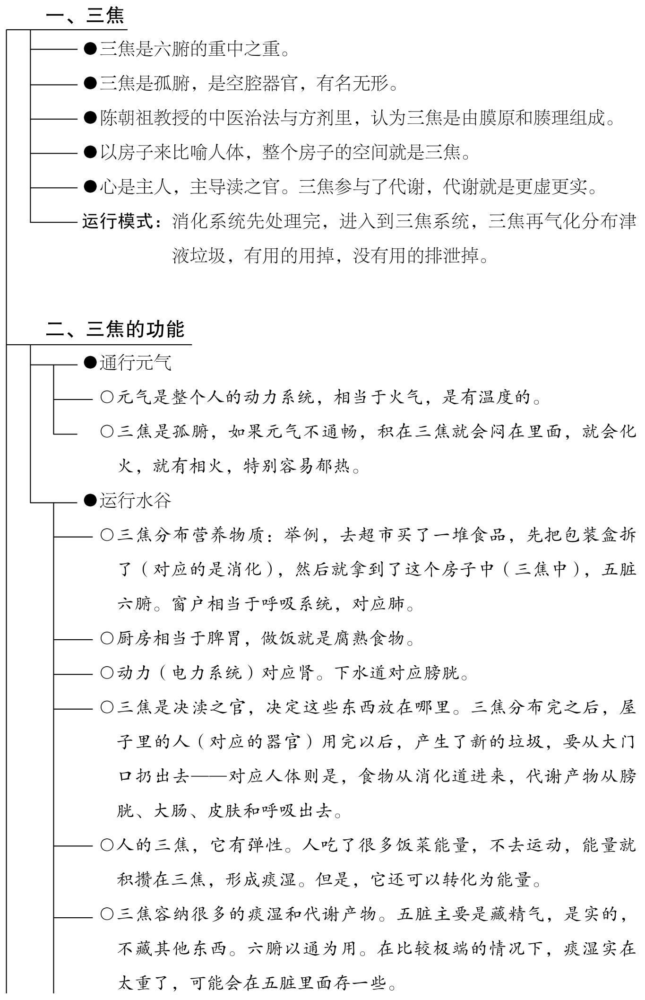

# 第五章 从津液代谢中间环节看湿热

一、三焦通了，很多病就好了
-------------

我认为三焦是六腑的重中之重。

为什么我有这样的认识呢？缘于我自身的体验。

某段时间，我开始喝柴胡剂，原因是我喝柴胡剂之前大概有半年的便秘史，而且入睡困难，反复口腔溃疡，口臭，便秘，我吃祛湿的甘露消毒丹，得不到明显的效果，腻苔化不掉，口疮下不去。我用增液汤、保和丸、枳术丸甚至大黄等治疗都没有用（请在医生指导下使用本书文章涉及的药物和药方），也就是说，无论是用健脾或者祛湿的方法，还是用润肠的、泻下的方法都没有用，而且那半年时间里，我每天早上起来就觉得自己口苦。

刷完牙之后嘴苦就好了，但是睡一觉，第二天早上起来的那一瞬间还是口苦，我就搞不明白我这个症状到底怎么回事——我很明显看到自己有湿热，可是从阳明经去治，却怎么都没有用。

医不自医，我忽略了自己越来越大的肚腩，也忽略了经常出现的胆区不适，胆囊总是隐隐的，好像痛又不像痛，平时吃点消炎利胆片就能缓解。

于是，我的一个同行给我开了柴胡加龙骨牡蛎汤（请在医生指导下使用本书文章涉及的药物和药方）的方剂，它不是原方，他给我开的方子比较庞杂，我记不太清了，但是喝完药之后，我晚上口干的症状马上就缓解了，第三天完全不再口干，第四天开始大便正常了，然后吃到后面我就给自己开处方。

我开的就是大小柴胡汤合柴胡加龙骨牡蛎汤加减（请在医生指导下使用本书文章涉及的药物和药方），就是柴胡、黄芩、党参、半夏、炙甘草、生姜、大枣，再合上茯苓、桂枝、龙骨、牡蛎、白芍和枳壳（或者枳实）加酒大黄。

这十四味药吃了之后大便很通畅，因为有酒大黄，但是我在吃含柴胡的方子之前，我加大黄是没有用的，我大便通不下去，通下去也马上便秘，但是用了柴胡剂之后，整个情况就改变了，就是人的津液能够正常分布了，口不干了，持续半年的早上口苦消失了，然后大便开始通畅了，津液能够正常分布了（柴胡入三焦，且推陈致新，能疏通三焦，并改善三焦的气化），然后我就接着吃保和丸。

这个时候吃保和丸，大便就完全能通了。

之前吃保和丸呢，是通不下大便的，但是自从我用柴胡剂恢复了三焦气化之后，再吃这个保和丸，大便就很通畅了，然后，吃一两瓶保和丸下去，肚腩就下去了，一下子瘦了五六斤。

我由此开始，深入思考三焦的问题。

我发现胃肠道满溢的痰湿一定是渗到三焦，三焦不通，大便就不得下，津液也不上潮，而且还要借胆的通道去排泄三焦的湿气，然后很容易造成胆囊的炎症，让胆区不适，从而影响到肝气的疏泄，于是就出现了脾气暴躁，口苦，然后心火还不下降，心慌，晚上睡不着觉，两三点都睡不着觉，睡觉睡着了又容易醒，但我还没有出现脚冷的下寒症状，上热症状却很明显了，我吃了这个柴胡龙骨牡蛎之后，就能够正常入睡了，口苦没有了，口干没有了，大便也正常，再没便秘，到现在几个月过去了，大便一直都很通畅。

我发现三焦通完之后，我不仅吃保和丸能很顺畅地把我肚腩的痰湿化一化，食积给化一化，而且我还能够吃龟鹿二仙胶，吃了不上火。我之前吃的时候是补不进去的，一补就会口腔溃疡，睡不着觉。

而现在我已经吃了一两个月的龟鹿二仙胶了，却一点都不上火，大便也很通畅。

而且自此之后，我就特别嗜睡，白天也是想睡，晚上也想睡，就是通完这个三焦之后，睡眠也改善了。

龟鹿二仙胶，是很补的药，我吃进去竟然毫无影响，而且，第二天神清气爽，所以我就越来越深刻地认识到三焦通畅有多么的重要，它不亚于肠道的通畅。

前面讲肠道湿热的时候，我们知道了整个消化道是津液代谢的第一个环节，第一个环节结束，接下来就进入下一个气化的场所，就是由肠道消化吸收之后，这些水液进入三焦，在三焦里面进行气化，再分布到全身五脏六腑及其他地方去营养全身。

三焦给各个脏腑运输津液的时候，它自己本身也要消耗津液，就是财务给各个部门发工资的时候，财务本身自己也要领工资。

二、三焦到底是什么
---------

那么讲到三焦，大家会很困惑，三焦是什么？

三焦是个孤腑，是个有名无形的一个东西，它是一个空腔器官，它里面囊括了很多东西。

在陈潮祖教授的《中医治法与方剂》里面，讨论过三焦是什么。

> 足少阳胆由胆管和肝相连，有形可征，向无争议；唯手少阳三焦有无形质，《内》《难》伊始，即开争论之端。持《内经》之说者，谓其有形；宗《难经》之说者，谓其无形。其实，手少阳三焦是由膜原和腠理组成，确有形质可征，勿庸争辩。三焦之膜，大至胸腹之膜，小至细胞之膜，广阔无垠，故称膜原，是连接全身上下内外组织，膜外空隙，包括皮肤之中、分肉之中、胸腹肓膜、五脏经隧夹层、眼膜间隙、脑外腔隙、称其为腠，膜之所至，腠即随之，膜腠合称少阳三焦，成为卫气水津升降出入之路。因其随处异形，所在皆有，不似其他脏腑有其固定形态，仅居一隅，是故《难经·二十五难》才谓“心主与三焦为表里，俱有名而无形”。所谓有名而无形，是言有名而无一定形态。因其无处不有，漫无边际，景岳才谓三焦“际上极下，象同六合，而无所不包也”。所谓六合，乃指天地与其东南西北言也。

陈潮祖教授认为，三焦是由膜腠组成，就是说所有的膜形成的空腔，大的胸腹之膜、小至细胞之膜，广阔无垠，叫膜原，就是所有的空隙都可以称之为三焦，这些空隙的地方就是进行气化的场所，同时也是水液害化后变为痰湿并储存痰湿的地方，所以痰湿才能全身无处不到，也就是说痰湿在三焦里面作怪。

我这样讲大家可能有点不太好理解，既然都是三焦了，那为什么还分五脏六腑呢？

打个比方，人体是一个三焦，它里面住着五脏六腑，而五脏六腑里，则是不计其数的三焦的大小“机构”——我们可以把房子理解为一个三焦场所，房子里面有主卧，有次卧，有厨房，有厕所，有储物间，有进水系统，有电力系统，有下水道。

如果房子没有人住，那它就是空房子，空房子是个死物，那么它必须要有个主人，主人管理、主导着整个房子。房子的主人，对应的是人体三焦里的心，心主导着五脏六腑。

房子里要有窗户和外面对流，以便人们能够呼吸新鲜的空气，窗户就相当于我们的呼吸系统——对应的是在人体的三焦里面的肺。

在房子里，我们要做饭，要腐熟食物，那就需要厨房，厨房对应的是人体三焦里面的脾胃。

一个房子必须要有动力系统，房子里很多地方有插座，插上去插头之后，吹风机能吹风，电脑能打开，这是房间的动力（电力）系统，它对应的是三焦里的肾——肾主元气。

房子里的下水道，对应的人体三焦里的膀胱——州都之官，古人说“膀胱者，州都之官，津液藏焉，气化则能出矣”。

三焦功能之一：决渎之官的比喻

如果你在主卧里面打盆水洗脚，洗完脚之后，你总不能把水泼在卧室里吧，你要把它倒到浴室的下水口，它就流走了，就像在三焦里面产生的废水，需要气化的作用排到膀胱。

房子的每个房间常常都有垃圾桶，卧室、客厅、书房、卫生间、厨房，各个地方都有垃圾桶，因为每个房间都会产生垃圾，这些垃圾在每个房间里产生，我们要统一去收起来，然后存到大垃圾桶里面倒掉。

对应到人体来说，三焦可以帮助人体里面搞清洁。

也就是说，心肝脾肺肾都可以产生痰湿，它往三焦里面排，痰湿都停留在三焦里面，所以这个三焦就成了一个藏污纳垢的地方，所以为什么三焦叫决渎之官呢？

所有垃圾都可以在三焦中收集、储存和处理，然后进入第三个环节——津液代谢结尾环节。

在津液的结尾环节里，该从大便走的就从大便走，该从小便走的就从小便走，该从呼吸走的就从呼吸走，该从汗走的就从汗走，各走各的。

作为六腑之一的三焦参与了津液代谢，代谢就是更虚更实，就是津液进来，垃圾出去，那么参与这个环节的三焦，必然也遵循着这样的运行模式——消化系统先处理完食物后，津液进入了三焦系统，三焦再气化分布这些津液，就是有用的营养人体用掉，没用的废水排泄掉。

就像我们把一个糖果剥开，糖果就是有用的，我们吃掉，没用的糖果包装纸，它就是垃圾，我们丢到小垃圾桶，然后再统一地收集到一个大垃圾桶，再扔到外面去。

三焦是一个孤腑，就像一个房子一样容纳我们的五脏六腑，所有的一切组织都容纳在这个房子里面，但是这个房子又有不同的房间和不同的分区，它们有各自不同的功能。功能分区都会产生垃圾，垃圾都在这个房子里面，也就是在三焦里面，身体再统一处理这个垃圾，到特定的排泄通道排掉。

三焦功能之二：通行元气

整个人的动力系统就像屋子里面的电力系统，屋子里面布了电线和装了插座才能通电，而人体里的三焦是元气运行的通道。

元气，它是有温度的。如果元气不通畅，积在三焦就会化火，就会产生相火，就会郁热——三焦是个孤腑，它没有正儿八经的通道往外面去，热会闷在里面，所以三焦特别容易郁热。

三焦功能之三：运行水谷、水液

就像你去超市买回来一堆东西，首先要把这些东西的包装盒给拆了，再把这些东西摆在房子的不同地方。例如，你把糖果放到收纳盒，把生鲜放到冰箱里。同理，水谷精微进入三焦以后，三焦就会把水谷精微分配给五脏六腑。

三焦分布完这些水谷精微之后，人体再利用它，但是利用完之后，就产生了垃圾。三焦再把垃圾渗透到肺通过呼吸排出去，渗透到皮毛出汗排出去，渗透到膀胱尿出去，渗透到大肠拉出去。

以下是水液在三焦里的具体运行过程。

第一步：胃、小肠从饮食中吸收水液，大肠回收饮食后残渣的水液，胃、小肠和大肠吸收水液以后，把水液运输到三焦。

第二步：水液到了三焦之后，经过脾的气化，就变成了津液。

第三步：三焦就将津液四处分布，主要是分布给五脏——给心、肾、脾、肝、肺。

第四步：每个脏腑都分配到津液之后，才能发挥各自的功能。心能把津液化成血，血才能够营养全身；肾能把津液化成精，才能主生殖；脾胃把津液化成气、营卫——有了气，全身才能够有力气，有了营卫能够有免疫力；肝就能够主疏泄；肺就能司呼吸。

第五步：三焦里面的各个脏腑用过津液之后，津液变成了废物了，这些废物通过肺的呼吸排出去，通过皮肤出汗排出去，通过膀胱的尿排出去，通过大肠粪便排出去，也就是说，这些津液和废物没有直接经络传递——它们的传递是在三焦内通过渗透的方式进行。

第六步：小肠没有直接通道通到体外的，如果它有垃圾要排的话，只能借经络来到膀胱，通过膀胱经排。三焦也没有直接对外的通道，它要排垃圾，只能通过经络排到胆，再由胆排到小肠（胆的孔是开在小肠十二指肠附近），排到小肠，小肠再往下走到大肠，由大肠去排出来。

三焦体积有一定的伸缩性，内藏的痰湿有转化为津液的可能

人体五脏六腑的功能，很多地方能和房子里很多事物的功能对应起来，不过人体和房子有很多不同的地方。我们买的房子是多大面积，它就是多大面积，无法增加或者减少，但是人的三焦，它是有弹性的，肚腩会大，因为肚子里面有很多能拉伸的空腔。

比如说，在一个人在房子住了十年，他有收藏的爱好，买了很多东西，尽管用不着，还是在那里放着——买了个跳绳，不用了，放在旁边；买了个跑步机，不用了，也放在那里；买了好多书不看，也堆在那里。慢慢地，这个房间里堆的东西就会越来越多，你说它是垃圾吧，它又不是垃圾，但占据了你的空间，你说它是垃圾吧，你又舍不得扔，它还有用。

慢慢地，你的房子显得越来越臃肿，就跟人一样，你吃了很多饭菜，吸收了很多能量，你不去用它，你不去运动，这个能量就积攒在三焦成为痰湿，但是它还可以转化为能量。

为什么这么说呢？

有些人去户外突然受伤了，与外界断绝联系，或者遇到了极端天气，就不能回到社会，就在一个孤独的环境之中，那么他没有吃的喝的，这个时候，身体就会消耗身上的一些痰湿——它原来就是我们吃的食物，没有及时利用，变成了痰湿，堆积到三焦里。在没有东西吃的情况下，就可以重新转化为我们所需要的津液，津液又转化成气，变成了可能使用的津液，痰湿就这样慢慢地被消耗掉了。

这就像我们房子里面囤了好多食物，平时不用，遇到了灾情，买不到饭，买不到菜，没有水，没有电，我们就吃干粮吧，很快就把干粮都吃空了。

三焦就有这样的功能。

三、深入认识三焦
--------

尽管我们可以用空腔来形容三焦，但是等到真正运用的时候，等我们去要找它的时候，就会发现它是抽象化的一个概念，它是基于外在的事物的存在而存在的。

比如，我们平时可以看到墙上的缝隙，但是你却做不到把墙拆了，而把缝隙单独拎出来。三焦在人体里，就如同缝隙在墙上——三焦是一个空腔，但是你不能把空腔单独拎出来——三焦这个空间你不可能把它拎出来。

三焦是一个抽象的概念，但是尽管它抽象，但是它发挥着自己的功能。

打个比方，如果人是一个房子，那么三焦就像房子里的空间，但是房子里面的空间跟外面的空间有什么区别呢？

房子里的空间，它有自己的一套循环系统。比如，外面风呼呼地吹，但是在房子里面呢，人就感受不到外面的风在吹。

就是说这个空间只有在相应的位置上才能发挥它独自的功能，同样一根塑料管，家里装修的时候，如果我们把它铺成了走水的管，那它就是水管；如果把它做成了穿电线过去的管，那它就是电线的管；如果把这个管用来穿网线，那它就是网线的管。

同样的管摆在不同的位置，它就有不同的功能。

我们要这样去理解空间——只要把它理解成是一个抽象概念就行了，同为空间——就是什么都没有的空间。

如果把空间放到河道上，那么这个空间就拥有了让水流过的能力。

如果把这个空间放在道路上，那么这个道路就拥有了让车辆行驶的功能。

如果把这个空间放到广场上，那么这个广场具备了让人们休闲活动和跳广场舞娱乐的功能。

它们都是空间，但是把它们放在不同的位置，它们就具备了不同的功能。

那么三焦这个空腔呢？它里面有很多分区，让它们具备了不同的功能。但是它们的共性都是要有津液流动，有元气流动。

同时，它们都会产生垃圾，造成拥堵。

要理解这章必须要具备抽象思维能力，因为三焦不是真真正正具体的东西，就像墙壁上的缝，我们不能把缝单独拎下来，你把墙拆了也拿不到这个缝，但是这个缝就是确确实实的存在。

就像河流，你不能把河道拿出来，你能拿出来那个河道吗？河道只是一个空间，这个空间你掏不出来。

就像A地的广场，你能把这个广场搬走吗？你把广场拆了，搬到天津去，在天津建个人民广场，它还是A地的那个广场吗？

那在假设中被拆掉的广场，它再修复一下，这个广场还是在A地。

我可以在A地人民广场吃着炸鸡，但是我不能把A地广场拿出来给你，具体的东西是什么——它是有很多东西构成了一个空间，但我讲A地广场可能比较具体一点，还有路面有地砖，或者有一些围墙，或者有些植被，这样共同构成了一个广场，但是你单独说这个广场是什么呀？

所以一定要有抽象思维能力才能更好地理解三焦，它很抽象，不过它又是多种介质构成的一个有多种功能的空间。

四、三焦的气化功能
---------

关于三焦的气化功能，大家可能不是特别的清楚，我觉得要单独讲一下。

正常情况下我们吃下去的食物会先经过消化道，然后通过三焦，三焦再传到各个脏腑，用完之后再从结尾环节排出去。

三焦本身并没有往外的通道，只能够借助其他脏腑的通道往外排，如果三焦出现问题了，也就会在津液代谢中的头尾环节出现症状。

先讲头部的症状，即津液代谢起始环节的问题。

在代谢过程中，第一个环节就是消化道，也就是第四章内容讲述的。

到了中间环节的时候是三焦，三焦为水火之通道，即三焦本身是行水行火的通道，而水跟火本身又会消耗水火，那么如果三焦本身的水火不足了，具体一点说，三焦本身的运作就会消耗三焦的气阴，三焦本身的气阴不足之后，它会出现哪些症状呢？水不通，火也不通，就堵在三焦了。

六腑一个重要的生理变化是更虚更实。食物进入了代谢环节后，六腑必然要经过虚实的更替。三焦不工作，相当于中间环节堵实了，没有办法从起始环节过渡到中间环节了。食物在进到起始环节就停住了，在消化道停止了，不往三焦吸收转化了，这时候就会出现一个什么反应呢——即往外吐。不吐也会有心烦喜呕[^1]——吐是属于开始环节的问题。

除了这个症状呢？中间环节已经不工作了，或低效率工作，那么直接跳过了中间环节去，在结尾环节的四个方面出问题。

结尾环节有四个排泄通道，第一个是呼吸道，第二个是皮肤，第三个是膀胱，第四个是大肠下段。这四个通道会出现以下问题。

呼吸问题

肺的经络起于中焦，下络大肠，还循胃口，它是往上走到肺的。也就是说，这个人除了喜呕之外，还会出现咳嗽——胃气上逆，除了患者呕吐之外，就会有一部分痰湿沿着经络往上走到肺，所以会出现咳嗽。而且很可能在咳嗽的时候，还伴随着出汗和漏尿。

自汗问题

小肠是重要的营养吸收场所，小肠主液又泌别清浊，小肠属于津液代谢起始环节的部分，但三焦堵了，小肠的东西进不来，进不来就是吸收障碍。

同时三焦的气化弱了，这会导致整个脏腑得不到正常元气的补充，也得不到正常津液的补充，那么五脏六腑的功能都会下降。

那么，三焦里的中焦，既得不到小肠过来的营养，本身用于气化的能量也不足，中焦就没有办法化生出营气与卫气。

营卫不足，就会自汗，也就是说，咳嗽的时候，很可能伴有自汗。

而汗为心液，汗出多了，人就容易疲劳，且心悸。

排尿问题

人喝进去的水，也不入三焦，那水到了小肠怎么办呢？只好通过经络借道膀胱（同名经经络相连）尿出去，就会出现尿频，出现一种类似直肠子的反应，就是水喝下去之后没几分钟就有尿意，而且尿量还很多，因为水不经三焦气化了，没有津液输布了，直接就排出去了，因此患者虽然口渴，却无论怎么喝水都不解渴，因为他喝水之后就尿掉了，因此就会出现尿频。如果小孩子的三焦不好好工作，就尿频又尿床了。

排便问题

胃与大肠相表里，头尾都不行了，胃就往外吐，大肠就往下泄——患者在不知不觉之中，在没有便意的情况下，内裤上就可能粘有粪便残渣。

总之，三焦为水火通道，水不通火不通，除了头尾的本身症状之外。这些症状会继续演化，汗出多了，导致气阴不足，出现疲劳口干，心悸；再演化下去，小孩会因心阴不足不藏神而夜啼或多梦；三焦的气阴不足再加重，咳嗽的时候就会伴漏尿，再发展就是两小时起一次夜，或直接尿床；三焦的气阴不足，严重影响了水火的分布，水火不均匀就会出现上热下寒，上热咽干口苦，下寒多是足冷；水喝进去之后，失去了中间这个三焦的气化和分布之后，水分无法在体内停留和输布，而是直接尿掉和出汗排掉了，水不能输布则口渴饮水不能解，明明口干大便干，却胃里有水声。

综合起来看，三焦气阴不足出现的问题有：

咽干——是喝的水直接排掉了且津液不能正常分布造成咽干；

口苦——是火不通，火不动了，停在上面，心火不能下降，三焦的火也郁住了，三焦本身的火借胆道往外排，胆汁之味上冲；

默默不欲饮食，就是喜呕；

营卫不足，就自汗了，汗为心液，出多了后，接着就会心悸；

然后还咳嗽；

尿频，还可能会漏粪。

这么分析下来，三焦气化功能弱化时的症状就越发清晰，但是我们用的方剂是不是小柴胡汤（请在医生指导下使用本书文章涉及的药物和药方）呢？我个人现在就没有用小柴胡汤，而是用半张小柴胡汤合生脉饮。组成就是柴胡、黄芩、半夏、党参、麦冬、五味子、炙甘草。根据患者的具体情况再确定加不加药，如果有气滞，可以加青皮、陈皮；如果有咳嗽，可以加紫苑；如果血虚，加当归、白芍；如果食积，加焦三仙、鸡矢藤；如果阳虚，加巴戟。

三焦本身没有一条往外的通道，所以三焦会借道，通过经络中的同名经，借胆往外排泄，排泄它平时产生的废物，所以胆不能堵，胆堵了三焦就会出问题。

当然，三焦的痰湿不能多，多了也会堵住胆。

补充1：小肠的湿热外排方式

小肠处于消化道中段，对外也没有通道，它只能通过同名经——借道膀胱经，由膀胱排邪气。如果是小肠出现问题，比如有湿热的话，一定是借道膀胱走的。

补充2：肾阳与三焦之火有何不同

肾阳更主身上的阳气，所以肾阳虚的人更有寒冷的感觉，精神更加萎靡，还有腰酸、腰痛、生长发育迟缓，或者生殖系统功能衰退。

如果三焦有问题，则不会出现肾阳虚这些问题，三焦出问题，则会出现代谢性的问题，会伴随高血糖、高血脂、高血尿酸等。

三焦的火是从肾里面来的，源头在肾。

肾如果出现问题——腰为肾之府，更多会出现腰酸、腰痛以及下焦寒冷更常见，也会尿频，但是肾阳虚与三焦问题的尿频，其伴随症状不一样。

三焦的伴随症状有咽干口苦，而肾阳虚就没有咽干，没有口苦，没有口干，更多的是口淡，甚至不想喝水。

肾主骨生髓，脑为髓海，肾阳虚还伴有头晕，记忆力下降，还有就是生殖系统方面的病变退化，比如说月经不来，或者是阳痿、性冷淡等。

因为三焦为元气之别使，肾的元气就会进到三焦里面。它怎么进呢——你看肾俞穴跟三焦俞穴，两个穴位在腰上的背俞穴上是挨着的，所以肾的元气就会源源不断地提供给三焦。

那么三焦的气阴是怎么被耗掉的呢？大部分情况是因为饮食的问题导致气化变弱，你吃太多了，把它耗掉了，饮食在三焦里面进行气化和营养代谢，是要消耗很多水火的，所以三焦本身会自我消耗。

那肾阳是怎么被消耗的呢？肾阳的消耗更多或是因先天不足，或是因为说房事过频，或是用脑过度。

① 三焦的气化不足会造成高血糖、高血脂、高血尿酸，仅为范怨武医生的见解。

五、三焦出了问题，会出现哪些症状
----------------

1．脏腑的囊肿和瘤

我们要这样来理解三焦——三焦是个大空腔。

三焦的一个功能是运行元气，中间走着很多元气，就是一个能量池，各个脏腑要用的能量都从三焦里面借，所以有火；另一功能是运行水液，它中间还运行着水液，各种营养物质进来之后，由三焦进行分配，所以有水。

同时，三焦还有很大的空间，它能容纳很多的痰湿和代谢产物，因此你那个肚腩越来越大！

因为你吃得多，用得少，它没有地方放，就只能放在三焦，因为五脏只存精气，是不可能放垃圾的。

五脏是实的，它不会让你存垃圾，当然了，不是说完全不存垃圾，如果你的垃圾实在太多，满了没地方放的时候，非常严重的情况下，五脏里面可能会存一些痰湿，要不然为什么会有肝囊肿或肾囊肿，甚至心脏里面还长瘤——我一个亲戚就是心脏里面长了个乳头状弹力纤维瘤，动手术摘掉的。这些情况的出现，是因为痰湿实在是太多了，没地方放了，三焦都放不下了，只好把痰湿放在五脏里面。

学过《中医基础理论》的就知道，五脏主要是藏精气的，不藏其他的东西；而六腑以通为用，也不能存东西，更不能堵。

2．口干、口苦和大便干

我们讲了三焦运行水谷与水液，并通行元气，又是决渎之官，水道出焉。就是说你吃进去的这个水液，必须是在三焦里面分布，再排出去，这是非常关键的。

你吃进去的营养物质，经过消化吸收之后，到了三焦之后由它决定分配每个房间多少东西。

所以津液的布散，就一定是要在三焦里面进行的，但是三焦自己没有那么多能量，必须要靠脾胃在三焦里面升清降浊，肺宣发肃降，肝气去疏泄，心肾要相交，五脏在里面运转气机，才能布输津液。

所以讲到底，三焦在津液代谢的过程中有着无与伦比的重要地位。

先说三焦通行水谷、水液

三焦出现问题，它最先体现就是津液的布散出现了问题，那我们最明显的感受就是什么呢？——口干，但是你吃养阴的药，口干不能缓解，你吃健脾的药，口干也不能缓解；同时还大便干，大便排得不顺畅，你吃润肠的药，大便不通，你吃泻药，它通一下，马上又不通。因为这些问题不是出现在肠道上，是出现在整个三焦的气化上，因为痰湿阻碍了气和津液的运行。

如果三焦堵塞了，导致脾气升不上去，那么津液就运行不上去，这叫作津不上潮，会口干。

津不上潮的意思就是这些津液不能往上潮，潮就是潮润人的上部，所以你会觉得口干舌燥，但是你喝水不解渴，你吃麦冬、玉竹、百合或莲子银耳等养阴润肺的药物都没有用，因为身上不缺水，只是水不能够传上来。

这时候去调理一下三焦，比如说喝小柴胡汤，口干就能改善，大便也会通畅。

这种情况下，大便干燥的原因是三焦堵住了，因为三焦不通，导致三焦的中间环节到结尾环节跨不过去（原理详见第一章），它卡住了，导致津液由三焦到大肠的阶段无法更虚更实，所以大便不通。现在三焦一通了，垃圾能顺畅倒了，大便也就通了。

再说三焦通行元气

元气是有热量的，肾中元气进入三焦，才能给其他脏腑输送能量，如果三焦堵了，它很容易上火。因为痰湿一堵的话，元气过不去，运行不顺畅就停在那里，停在哪里，哪里就因郁而生火了，所以三焦很容易上火。三焦的火最主要表现在口苦这一块。

为什么口苦体现的是三焦问题？原因是与三焦的脏腑有关。

三焦如果出现问题的话，它会殃及谁？手少阳三焦经，跟足少阳胆经是同名经，手足相连，有很直接经络联系的通道。三焦与胆是相通的，三焦本身是没有出口的，所以三焦只能通过经络借道胆。胆是有出口的，胆的出口在十二指肠那里。

三焦通过经络借道胆去排它多余的垃圾，三焦的火会借道胆腑走，所以会出现口苦，特别是在早晨。平躺时胆汁是可以溢到口的，但站起来后，胆汁由于重力的关系，就不会往上冲了，白天就不口苦。

并不是所有的口苦都是少阳郁火，手少阴心经有火也会口苦，不过以少阳郁火为多见。

3．心脏问题与胆的问题

三焦与手厥阴心包经是表里经，通过经络相连接，而心包本身也是一个空腔，有空腔的地方就最容易藏纳痰湿。当三焦产生了很多痰湿的时候，就会通过经络，溢到心包，只要痰湿填在心包那里，会出现胸闷、心烦或心慌，这时候你就要化痰，比如说用温胆汤（请在医生指导下使用本书文章涉及的药物和药方）去化它。

这里提一下胆心综合征，胆出现问题的人，心脏常常也出现问题，那是因为三焦在中间作怪，胆是三焦的同名经器官，心包是三焦的表里经器官，两者都承受着三焦溢出来的痰湿。

我们观察一下肥胖的人，肥人多痰，肥胖的人很容易出现胆囊炎，心脏也容易出现问题，如冠状动脉粥样硬化。你去追溯源头，可能还是三焦上的问题，你去专门治胆，或者专门治心，都不一定有效，你调好三焦代谢之后，可能胆好了，心也好了。

脏腑全都在三焦里面，它们都需要津液去营养，以支持它们进行气化的生理活动，如果一个人的三焦出现了问题，不能够正常地分布津液和元气，每个脏腑的工作都不积极。

五脏都需要正常的津液来营养，需要元气去鼓动，才能进行气化。如果三焦没有恢复这个功能，五脏都缺营养，缺营养的话，五脏就不好好工作，就像胆心综合征。这时候只要恢复了三焦的气化功能，五脏都领到自己的“工资”，它们就会干活，只要五脏干活，很多病也就好了（参考32页的图加以理解）。

4．上热下寒

三焦通行元气，如果三焦受阻，会导致元气不畅，若元气分布不正常，它常会造成气的升降异常出现上热下寒。

元气受郁则化火，火性炎上，三焦不能够正常运转，火就停留在上面，底下的肾水就很寒，所以我们心火要下降，肾水要上升，这样才能改变上热下寒的状况。

一个人脸上长痘痘，口腔溃疡，睡不着觉，下半身的膝盖又凉，脚底板又凉，他这种情况究竟是上火还是虚寒？

这种情况大多只能从三焦去调，三焦调通了，心火下降，肾水上升，这样患者的手脚也暖了，上面的火没了，人也能好好睡觉了，脸不红了，痘痘也不长了。

另外还有一种是气的出入异常，出现又怕冷又怕热的情况，如盖被子的时候觉得很热，掀开被子又觉得冷。

5．痰在三焦运行导致的其他常见症状

三焦出现问题，还有很多或然症。

痰在三焦里面运行的时候，如果刚好跑到肺里面去，水饮在肺的话就咳嗽；如果走到心脏的时候，会心悸；如果走到了肝胆，就会胁下痞硬；如果走到脾，会腹痛；在胸口里面，会胸闷、烦闷或想呕；如果痰湿影响了气机的升降，升不上去，加上脾的气也不足，就不能升津，会出现口干口渴，出现这种气虚加口干症状就要加强健脾升清，把它升上去；如果堵在了肾，影响了肾的元气往三焦传导，那整体的火就不够了。

三焦是通行元气的地方，元气从肾来。你看膀胱经上，肾俞穴的上面是三焦俞，它们挨得很近——肾能量直接就跑到三焦去了，再通过三焦分布到五脏六腑去。

因此一旦痰湿在三焦俞那块堵住了，元气进不去，在三焦俞附近就会出现怕冷，脉沉，脚底凉又上火的心肾不交症状。

再捋一下三焦为什么有痰湿呢？

当津液在第一个环节（消化道）运行的时候，如果这个环节吸收不好，很多东西就变成了痰湿。若发现排便是正常，痰湿应该就不会停在消化道而是直接排出去，可却发现痰湿并没有排出，因为痰湿导致的症状还在，那痰湿不在消化道，又往哪里走了？

当以为是胃肠道有湿热时，用了清胃肠湿热的药，却发现用药无效，为何无效？湿热跑了，溢到了三焦。你用甘露消毒丹（请在医生指导下使用本书文章涉及的药物和药方）去清胃肠道的湿热，是没有效果的，因为湿不在胃肠了，这时只能够用入三焦的药物来治疗湿热，才能够把三焦里面的这个湿热给刮掉。

究竟用什么药方去三焦的痰湿呢？我最常用的就是小柴胡汤。

柴胡是入三焦经的药物。除了柴胡，入三焦的药其实并不多，我在这里稍微介绍一下入三焦经的药有哪些。《笔花医镜》对入三焦的药物总结如下：

补三焦猛将：淫羊藿、黄芪；

泻三焦猛将：青皮、木香；

泻三焦次将：柴胡、香附；

温三焦次将：乌药、白豆蔻、胡桃；

凉三焦次将：山栀、麦冬、黄柏、地骨、青蒿、连翘。

笔者目前用得最多的还是柴胡。

如果柴胡剂量用大了，它有一个很重要的作用——推陈致新。这是记录在《神农本草经》里面的，量用大了人会拉肚子，把垃圾排出去。

某一天，我岳母着凉了——那天，她去按摩（去了那种专门忽悠老年人出钱开卡的理疗店，并不专业），按摩完之后觉得很累。

第二天她被风吹了，结果头有点痛，头晕，眼睛热，鼻子热（呼出的气是热的），喉咙热，咽干，口苦，目眩。

我开的是柴胡桂枝汤（请在医生指导下使用本书文章涉及的药物和药方）加味。我的辨证思路如下：

她有点怕冷，是被风吹得着凉了，外有风寒——要用祛风寒的药，如桂枝汤；

她又因为按摩之后，人很累，是气血给耗掉了——药中要有补虚成分，如四君子汤；

她的肚腩稍微有点大，这种体征的人，一般三焦有痰湿。最近几个月，她跟我反馈过胆区不适，我给她用过消炎利胆片，这个药有清热、祛湿、利胆的功效，她吃了以后是舒服的。胆区有不适的人，常提示三焦有痰湿——痰湿又导致三焦郁热的产生。风一吹，毛孔关闭，她的热散不出来，热就直接就入了三焦，本身三焦的郁热就没法宣泄，这时热上加热，所以她出现了咽干、口苦、目眩、头晕——提示药要入三焦，如小柴胡汤。

她鼻子呼出来的气是热的，这个要从阳明的热症考虑——如葛根。

她头还痛，胆火窜到了肝经，肝经上头，会头痛，要清肝胆之火——如桑叶、野菊花。

整个处方里，我用了20克的柴胡，整个方子里没有泻药。处方具体如下：

柴胡 20克，黄芩 10克，党参 10克，法半夏 10克，炙甘草 6克，大枣 15克，桂枝 10克，白芍 10克，白术 10克，茯苓10克，葛根 10克，桔梗 10克，桑叶 10克，野菊花 3克。

三剂，每日一剂，水煎服，早晚分服。

吃完这个药，她说肚子拉得很厉害，问我是不是开错药了。

我说，这个药里面没有泻药。除了拉得很厉害之外，精神状态怎么样？

她说，精神状态很好，除了拉肚子之外，其他原来的所有症状都逐渐改善。

因此她吃柴胡桂枝汤加味是对症了，因为里面的柴胡有推陈致新的作用，它会把三焦里的垃圾通过肠道排掉。

六、小柴胡汤为什么能治愈很多病
---------------

小柴胡汤（请在医生指导下使用本书文章涉及的药物和药方）为什么能治疗感冒呢——小柴胡汤能够帮助三焦恢复气化功能。

只要恢复了三焦的气化功能，三焦能够正常地把这些营养物质送到五脏六腑，五脏六腑就能各司其职地完成自己的气化功能，然后机体就有了足够的正气，可以对抗这些病邪了，很多病就能不治而愈——肺主皮毛，肺的气化功能恢复了，它就能通过发汗的方式把病邪去掉了；比如说大肠有湿热，肠的气化功能恢复了，就能恢复往下排泄从而实现更虚更实的功能，病邪直接随着大便排出去了；比如你胸胁闷胀，当肝的气化功能恢复了，它自己就疏泄了气郁；有心慌、心悸之类的不舒服，当心脏的气化功能恢复了，心脏的功能也就恢复了，这些问题往往也解决了；你的手脚怕凉了，恢复了肾的气化之后，肾的功能正常了，你手脚就不凉了。小柴胡汤看起来像个万金油的方子，其实它只是帮助人体自愈而已。

小柴胡汤的组方中，柴胡能推陈致新，能够去掉三焦的痰湿，黄芩有清热的作用，能够清掉少阳郁的相火，半夏本身有化痰和通阳明腑的作用，也有把痰湿直接化掉的作用，生姜可以走太阳的表，可以发汗，所以小柴胡汤虽然是少阳的主方，但是它其实兼顾了阳明，也兼顾了太阳。

小柴胡汤原方中还有人参，人参大补元气，安神。人参是少有的补元气的药，换成党参就没那么大的力度了。小柴胡汤中的甘草、大枣是补脾的，还补气。本方给机体提供了元气来帮助三焦运行，这样一来，三焦一通，头尾各环节就都通畅了。结尾环节中，该怎么排的就怎么排。

小柴胡汤既清三焦痰湿又补元气加强三焦的运转，这样一来，五脏六腑各司其职，很多病就不治而愈了。

综合上述，我们可以知道，津液是人体需要的营养物质，是五脏六腑都需要的营养物质，它靠三焦的元气来分发。

如果三焦出现了问题，五脏六腑就不够发“工资”，就没有人愿意老老实实干活。只有恢复了三焦的气化功能，它能够正常地分布这些津液，大家才能够各司其职，去对抗病邪。

由于三焦的结构的问题——三焦是一个孤腑，它没有正儿八经的通道，所以容易堆积垃圾与污水，它的结构决定了它出这种问题的概率比较高。（注：它必须借道，才能排垃圾，这也又加重了胆的负担，令胆易生病，胆出问题又可以反向推导三焦已有痰湿。）

针对垃圾，要么把这些污水和垃圾转化成有用的东西——转化为津液，重新利用；要么通过大便小便、出汗和呼吸来排掉它。只有这样，我们才能够让人体恢复正常。

三焦得上下运行水液保证五脏六腑有“饭”吃，如果三焦受阻，水液分布就会不均，导致津不上潮，出现口干、咽干或口苦的现象，还可能造成大便不通畅、便干。

三焦得实现元气的升降出入以温养五脏六腑，如果一个人的元气不能够正常地运转的话，造成热量分布不均匀，就很容易出现气的升降异常导致上热下寒，上面长痘痘，下面脚冰凉；气的出入异常如寒热往来或怕冷又怕热，盖被子感觉好热，掀开被子又好冷。

五脏六腑被包容在三焦里面，那三焦里堆积的痰湿跑到哪里，哪里就出问题，跑到心脏里就会出现心悸；跑到肺里面，就出现咳嗽；跑到胃里面，就干呕；跑到胸口里面，就胸闷；跑到肝胆，就会胸胁苦满；跑到肾的里面去，影响了肾的元气的生发，就出现怕冷，手脚冰凉的现象。所以通过小柴胡汤的加减可以治疗五脏六腑的很多疾病。

我用得最多的化三焦痰湿组合就是小柴胡颗粒冲剂加上保和丸。

我是从人的习惯入手的。贪吃是人的本性，尤其是小朋友，常常因贪吃而产生积食，积食在胃肠道不运化会变成痰湿，若痰湿不能及时经由肠道排出，则会往三焦溢，会出现三焦受阻，一方面津液分布不均匀，一方面元气分布不均匀，则出现咽干、口苦、目眩、往来寒热或怕冷怕热。

所以我用保和丸来消食积，又用小柴胡颗粒来清理继发于积食之后的三焦湿热。

这个药物组合治了很多三焦有痰湿或湿热并有积食的患者，他们的症状是以发烧合并怕冷怕热、喉咙干和嘴巴苦为主。

机理是用保和丸令肠道通畅后，肠道产生的多余痰湿就不会往三焦溢。使用小柴胡汤恢复三焦的气化，津液、热量分布均匀了，则发烧、喉咙干、嘴巴苦的症状就消失了。

这就是为什么小柴胡汤在外感病里面的运用概率这么高的原因。

在临床中，我用小柴胡汤颗粒加减的时候挺多。

患者出现了食积，如果主要症状是咽干口苦、头晕目眩、胸闷，我就用保和丸加上小柴胡汤颗粒。

如果患者还有大肚腩，胆区不舒服，就可以用小柴胡汤加上保和丸，也可以加上适量的越鞠丸。

如果患者湿气特别重，患者的舌苔像积粉一样，小柴胡汤也弄不掉，可以加上达原饮来治疗，因为达原饮能入膜原，也就是说，你可以在小柴胡汤和达原饮的基础上加减成柴胡达原饮治疗。

如果还有湿热在三焦去不掉，除了用越鞠丸和达原饮之外，还可以用平胃散。平胃散兼顾了胃中的寒湿，胃气不降。寒湿郁久了，会变成寒湿加郁热，热是继发的，只要降了寒湿，郁热就自行消散了。如果只是食积造成的胃气不降，患者放放屁就好了。这种患者的大便不是特别干，只是胃胀。治疗这种症状，小柴胡汤合上平胃散，就是柴平汤。

如果三焦湿热，三焦中的湿特别重，小柴胡汤可以和甘露消毒丹合用，甘露消毒丹里面的黄芩，具有清郁热的作用；里面的绵茵陈能清肝胆脾胃的湿和热，也能间接地清三焦的湿热，所以甘露消毒丹可以治疗黄疸病。

上一章讲了阳明湿热，这一章讲三焦的湿热。

阳明的湿热，可以通过甘露消毒丹这一类系列方解决。湿热从阳明经满溢到了少阳三焦经，就需要三焦去代谢，然后进入结尾环节，从太阳膀胱的尿走，或者从阳明大肠的大便走。你看，还是回到阳明，就是湿热转了一圈，又回到太阳与阳明往外排。手太阴肺经也能排泄湿热，肺主皮毛、司呼吸——湿热可以通过全身皮肤的出汗和咳痰而排出。

因此，湿热在人体中的正常运行路线就是这样的：先从阳明（胃、肠）产生，然后走到少阳（三焦、胆），再从手太阴（肺）或足太阳（膀胱）或手阳明（大肠）走。

六腑的更虚更实，除了食物在消化道的更虚更实之外，还有津液的代谢环节也必须更虚更实，它是在阳明、少阳、手太阴、足太阳、手阳明之间更虚更实，这中间是不能断的，不能堵的，一堵的话，两头都不通。

我正是因为自己曾经有半年里晨起口苦、口臭、反复胆区隐痛、大便干结，用清阳明湿热的方法不行，用泻阳明腑实的方法也不行，用养阴的方法也不行，最后是用了柴胡的类方，两三天内就解决了这一系统问题，这种亲身体验让我对三焦有了更深入的思考，我才能够讲出这么详细的内容给大家。

《中医内科学》教材里，对于大肠和三焦这两腑的病讲解很粗略，我可能还是讲得不够详细，等我再深入，条理性再好一点，可能会在本书修订的时候会给大家讲得更好点，但是需要我再去不断地体悟它。

---

[^1]: 这里指没有东西呕出来这么严重，但也有心烦想要呕吐的恶心感。