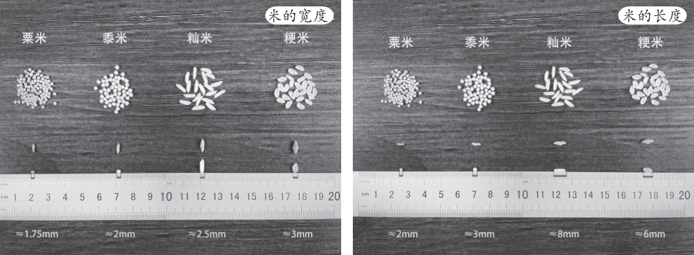
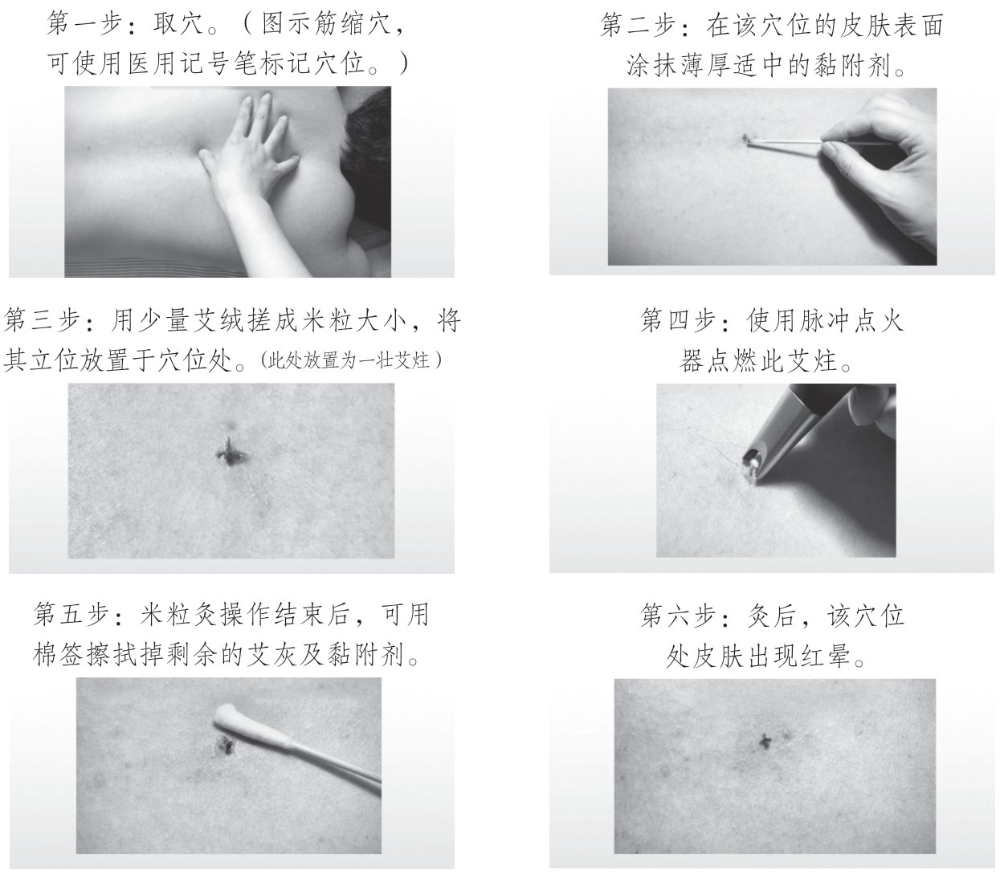

# 上

米粒灸是古老的、传统的中医艾灸疗法。

米粒灸采用三年以上陈艾，将艾绒搓成相应大小的艾炷放置于穴位上，灸一壮3～5秒，可以起到刺激穴位，激发人体正气，以及温经通脉、补益气血、调和阴阳、防病保健等作用。施灸时有短暂的灼痛感，因个体差异可能在施灸部位出现小水疱、色素沉着和血痂。

米粒灸具有艾炷小、刺激强、时间短、痛苦少、疗效快的特点。

米粒灸简介
-----

“灸”是形声兼会意字。从火，表示用火燃烧艾绒熏烤穴位；从久，承接“久”字之本义，且兼表声。“灸”通常用作动词，本义为烧灼，特指中医的一种治疗方法，即将艾绒所制的艾炷或艾条点燃后烧灼或熏烤人体穴位，以刺激皮肤或血脉，达到治疗的效果。

米粒灸在本书中有两层意思。

一是指艾炷规格——艾炷的大小如米粒。

二是为直接灸——在皮肤上施灸。

笔者在门诊所操作的艾炷规格有5种：特小号半粒粟米大、小号粟米粒大、中号黍米粒大、大号籼米粒大、特大号粳米粒大。我们治疗最常用的规格是中号黍米粒、大号籼米粒大小（图1）。临床应用时，基本是在这5种规格上变化，但以黍米和丝苗米为主。

图1　艾炷大小示意图

注：粟米即小米，黍米即大黄米，籼米如常见之丝苗米，粳米如常见之珍珠米。

为什么会有这5个规格呢？笔者经过考证，认为小艾炷至少是从唐代就开始运用了。

唐代孙思邈《千金翼方·卷二十六》曰：“疟，灸上星及大椎，至发时令满百壮。艾炷黍米粒。”

在这里，灸头部的上星穴和颈部的大椎穴，用的就是如黍米大的艾炷。我一开始不知道黍米是什么，从来没听过，还以为是小米，可谓五谷不分了。黍米有些地方叫黍子，在网络上搜黍子的话，很多是买给鹦鹉或仓鼠吃的口粮，带壳的，颗粒很小。但你想买来给人吃的话，要搜大黄米，大黄米就是黍米，我问了东北人，说个头比大米小，但又比小米大。这种规格的艾炷灸起来，疼痛程度很小，三岁娃都能耐受的。

宋代闻人耆年《备急灸法·卒忤死法十三》曰：“讫如身冷口噤者，灸人中三炷，炷如粟米大。”

而在这里，灸人中穴用的艾炷如粟米大，这个粟米，就是小米，平常喝小米粥的那个小米，颗粒更小。所谓沧海一粟，形容的就是个头小。头面部用小艾炷，合情合理。我现在给患者灸面部的小疣就是用这么小的艾炷。

明代李梴《医学入门·卷之一》曰：“炷艾如粟米大。”

明代在三角灸穴施灸，也用小米粒大的艾炷。用这个穴的，多是得了疝气的小朋友。其实腹部皮肤特别敏感，用小米粒大的艾炷，也很合理。笔者给自己灸巨阙、中脘、下脘、梁门、天枢、大横、关元这些穴位时，用的就是小米粒大小的艾炷。笔者试过自己的敏感度，确实粟米大的艾炷就有很高的刺激量。

或者又问，难道成人就不能用小艾炷？

明代杨继洲《针灸大成·卷九》曰：“泪孔上（米大艾七壮效），中指半指尖（米大艾三壮）。”

这里在泪孔（睛明穴）上施灸，主治迎风流泪，用的是米大艾，杨继洲是浙江人，这个米，我猜是大米。但是当时他这部书是在山西出版的，如果在山西，提到米的话，也可能是小米。手指与头面用这个大小的艾炷施灸，也是合情合理的。

清初《医宗金鉴·卷八十六》：“凡腋气……看腋下有一点黑者……用艾炷如米大者灸之，三四壮愈，永不再发。”

清初《医宗金鉴》说治疗狐臭，要先找到腋臭分泌处，用米粒大小的艾粒灸“黑孔”。这所讲的应是大米粒。

不管怎么说，米粒灸操作技术，延绵不绝传承逾千年，我们只不过是在拾取古人的经验而已，只想继承好，而不是搞引人耳目的假创新。

基于上文，大家一定要理解笔者说的米粒灸，是我国古老的、传统的中医艾灸疗法，是一种直接灸法。其艾炷规格以米粒为基准，直接放在穴位皮肤上烧灼来达到养生或治病的目的。

哪些能灸，哪些不能灸
----------

你要问我米粒灸的适应证有哪些？这个真的是见仁见智，有人认为它只适合寒证，有人认为寒热证均可。

从我的角度看，只要在辨证施治的情况下，针药可治的病，米粒灸都能治。

你要问我哪些人能灸？我答，上到百岁老人，下至呱呱坠地的婴儿，只要病情适合，则皆可灸。

关于不能灸的，古代文献中讲究特别多，如日月、时辰、食物、气候、临时情况等均有禁忌。但从现代知识来看，有些实在是没有必要。病急从权，按病情施灸，有需要就灸。

但是在大饥、大渴、大饱、醉酒、风大温度低又无法保暖的情况下，尽量不要施灸。

以下还有三条要注意。

### 关于禁灸脉证

阴气不盛、阳气不衰者，不宜灸。华佗《中藏经》指出：“不当灸而灸，则使人重伤经络，内蓄炎毒，反害中和，致于不可救。……阴气不盛、阳气不衰，勿灸内。”

就是说，人阴阳平和，精力也充沛，无事不灸，灸多易中热毒，但华佗所说这个灸，是指重灸（化脓灸），火力重。对于健康之人，尽管是米粒灸这种火力小的灸法，也实无必要去灸。若是平日精神疲惫，可偶灸一下足三里补气。临证时必须辨证施治，切不可孟浪妄灸，误伤健康。

微数之脉，不宜灸。汉代张仲景在《伤寒论》中指出：“微数之脉，慎不可灸，因火为邪，则为烦逆，追虚逐实，血散脉中，火气虽微，内攻有力，焦筋伤骨，血难复也。”

意思是凡属气血亏虚、阴虚火旺之证，不宜施灸，更不宜采用瘢痕灸法，应以补气益血、滋阴降火为宜。否则，妄施火灸，则“焦骨伤筋”，伤阴更甚，也就难以康复。

但这一条，我的理解是“慎”，而非不可灸。临床实践证明，在配合服用滋阴药物的情况下，阴虚内热之肺痨是可灸的，但一定要辨证施灸，选穴精当，而不能滥灸。

脉浮、热甚者，不宜灸。《伤寒论》中指出：“脉浮，宜以汗解，用火灸之，邪无从出，因火而盛，病从腰以下必重而痹，名火逆也。”又云：“脉浮热甚，而反灸之，此为实。实以虚治，因火而动，必咽燥吐血。”上述两条条文，前者言脉浮误灸变证，后者为火邪伤阳变证。

此外，还有一些传染病，症见高热、昏迷、四肢抽搐者，或极度衰竭、形瘦骨立，呈现恶病质之垂危之候者，亦均不宜施灸。

### 关于禁灸部位

凡于颜面部施灸，一般不用化脓灸，以防形成瘢痕，有碍美观。关节活动处不宜用直接灸法，以防化脓、溃烂、不易愈合，尤其是瘢痕收缩更易造成功能障碍。另外，眼球部、心脏部位、耳部、大动脉处、静脉血管、肌腱浅在部位，以及妊娠妇女的下腹部、腰骶部、乳头、阴部，男性的阴茎、睾丸等处亦均不宜施灸。

以上所举禁灸部位，仅属梗概。医者如能灵活运用艾灸方法：将化脓灸改为极小炷米粒灸或间接灸（隔物灸）或艾条灸，则某些部位仍可温灸。如遇急性病、危重症，非此灸法不为功者，亦得辨证论治，酌情施灸。

### 关于禁灸穴位

禁灸穴位，首见于《黄帝内经》，次见于《针灸甲乙经》。其后，《铜人腧穴针灸图经》以及《针灸大成》等书，均有此记述。如《针灸大成》记载的禁灸四十八穴是“哑门、风府、脑户、天柱、承光、临泣、头维、丝竹空、攒竹、睛明、承泣、素髎、禾髎、迎香、颧髎、下关、人迎、天牖、天府、周荣、渊液、乳中、鸠尾、腹哀、肩贞、阳池、中冲、少商、鱼际、经渠、地五会、阳关、脊中、隐白、漏谷、阴陵泉、条口、犊鼻、阴市、伏兔、髀关、申脉、委中、殷门、承扶、白环俞、心俞、石门。”

这些禁灸穴位，确系历代医家的经验所得，当不可忽视，尤其是睛明、哑门、人迎等不宜施灸穴。但有些穴位灸之却可奏奇效。如灸阳池治耳聋，灸少商治鼻衄，灸鸠尾治癫痫，灸隐白治崩漏，灸心俞（相当患门穴）治肺痨、羸瘦，灸白环俞治白带，灸石门治经闭，灸髀关、阳关、伏兔、阴市治下肢痿痹等。杨继洲还有在泪孔（睛明）上用灸治迎风流泪的经验。

以上三条，初学者一定要注意，不要随便使用，但又不能过于教条。只有在熟悉了医理，熟练掌握火候，能做到每灸不起疱、不结痂，才能突破这些禁忌。

厦门灸法大师陈应龙，曾在腹部府舍穴施灸保胎；岭南灸法大师苏天佑，在神阙穴施灸治脐痈。笔者虽非大师，也常用风府、哑门治疗风寒头痛，犊鼻治膝痛，委中治瘙痒，鸠尾治癫痫，阴陵泉化湿，外阴旁治阴疮，面上治面瘫、扁平疣、黄褐斑等。

关于禁灸穴是否真的“禁灸”，在《普济方·针灸门》有言：“禁穴，艾炷止麦粒大，仍隔蒜片尤稳。”意思是指，对于禁灸穴位的施灸，仍有变通之法，一是可以改用小艾炷，减少火力伤害；二是改用隔蒜灸，更加安全稳妥。

这提示我们，虽为禁灸穴位，只要减少刺激至温和无伤害，仍然可以施灸。换个角度看，如果紫金膏涂得厚，也可以认为是隔物灸的新分类——隔膏灸。而范氏米粒灸本身就强调使用小艾炷，两者结合就如上文所言突破禁忌，在禁穴或禁灸部位施灸。（注：隔膏灸并非说范氏米粒灸就是隔物灸，因为紫金膏可以按患者对火力的需求，进行厚度调节，涂薄即为直接灸，这也是范氏米粒灸特别之处。）

灸多少壮、多少天合适
----------

先理解两个术语。

炷：名词。可燃的柱状物。艾炷，即将艾绒搓成柱状。隐含等待点燃之义。

壮：量词。指搓成形的艾团或艾粒，无论大小，一个艾粒叫1壮。另外隐含动作，如某穴7壮，即指在某穴上依次点燃7个艾团或艾粒。表示已完成或将要完成充分燃烧。

由于皮肤没有黏性，直接将米粒形的艾炷放在皮肤上是不稳定的，一活动就会掉下来，因此需要一定的黏附剂。我们会在穴位涂上薄薄一层膏状物，将艾炷放上去就能粘在穴位上，这时候再来点燃艾炷，艾炷烧完就叫作一壮。一壮就是烧一粒艾炷的意思。

举个列子，米粒灸百会穴7壮，一是选用米粒大小规格的艾炷，二是在百会穴上涂点黏附剂，三是在百会穴上依次点燃7粒艾炷。

需要注意的是，我们涂的是膏状黏附剂，涂的膏如果比较厚的话，透热入穴不完全，艾炷在燃尽时可能一点也感觉不到热，如果没有热力的话，这个壮数其实不能被有效计数入内。

古法有用涂的口水或大蒜汁或姜汁，包括我们院校的现行教材仍然教的是用大蒜汁，涂汁的话，基本上能保证每壮都透热入穴。

所以一定要以热力入穴为计数方式。

我们的灸量定数，应按需施灸。

什么叫按需施灸？

我要展开来讲。

按需施灸这个“需”，不是指受灸者以外的人的需求，如家长，也不是指受灸者本人出于贪念或亏本的需求，而是以患者为中心，以缓解病情的舒适度为准。

灸的壮数多对患者的病情未必有利，甚至有害。很多小孩只灸身柱一个穴，灸3壮足够了，再多灸几壮就会流鼻血。

笔者的儿子两岁十个月的时候，有天早上咳嗽，我就用搓成针线粗细大小的艾炷，放在身柱上灸，下午回来没咳了，就是这么快。对证了，根本不需要多灸，壮数也不是越多越好。

我平常保健时灸足三里，在结痂之后，只灸一壮，局部就产生了舒适的温热感，大腿得到了放松，有利于入睡。但若是贪心多灸几壮，在没病的情况下，这个就成了壮火，会食我的气，不仅让我觉得累，还可以起口疮、入睡困难。

所以，灸量，应该以缓解病情的效率为准，尽量找到愈病高效又让患者感到舒适的区域。

经过临床大量的观察，在每壮有热入穴的情况下，小儿每穴灸1～3壮，成人每穴灸3～5壮，是比较适合的。

一开始，以少量为主，让身体慢慢地去适应这个节奏，在后面的日子里，慢慢地将壮数加上去。

【注意事项】在发病初起，前一到两周最好保证每天灸一次，甚至一天两三次都可以；等到病情平稳后，可以改为隔两三天一次；经过一个月的治疗，病情向愈后，可以改为三天、五天或七天一次，就可以维持身体状态了；等到完全康复后，可以停灸，或改为养生灸（养生灸大多每个月施灸三四次即可，少则一月一次）。

米粒灸的操作步骤
--------

### 一　需要准备的材料

精细艾绒、紫金膏（或凡士林、紫草药膏、京万红膏等）、脉冲打火机（或线香）、棉签适量、龙胆紫笔、小镊子、弯盘。

### 二　准备工作

1. 将所有材料放于弯盘上。
2. 请患者维持被灸的姿势不动（或坐或俯卧或仰卧或屈膝等）。
3. 新手操作需要在施灸部位用碘伏或75%乙醇进行消毒。经验丰富者若能做到不起疱不发疮，则可忽略。若用龙胆紫笔标记穴位，亦可忽略，因为龙胆紫水本身具有消毒功能。

### 三　操作步骤（图2）

图2　米粒灸操作步骤

1. 用龙胆紫笔将穴位点上记号，并嘱咐患者不得乱动，什么姿势点的穴，就保持什么姿势灸，否则穴位移动则不能取得理想效果；第一次施灸，可请家长或助手，将患者固定（此点很重要，若是小儿惧怕挣扎易造成穴位移动或烫伤）。
2. 用棉签挑一点紫金膏（或凡士林或其他防烫膏剂），在选好的穴位上，涂上薄薄一层紫金膏（目的是固定艾炷及减轻烫伤）。
3. 将搓好的米粒大的艾炷放置于穴位上。
4. 用点好的线香，或脉冲打火机，将艾炷点燃；燃尽后可在原位上再放一炷点上。
5. 让艾炷自己燃烧，不用吹它，并且要时刻注意患者反应，若是艾炷搓得过大，则比较痛或难忍，这时用手指直接将艾炷摁灭（手指可觉微热并不烫人）或用小镊子将艾炷夹起弃之，再重新涂点紫金膏并搓一粒艾炷点上。中间要是紫金膏被蹭掉，可用棉签将穴位上的艾灰轻轻擦掉，再重新涂点紫金膏。点完要灸的壮数并结束一个穴位的灸治后，可用棉签轻轻将穴位上的紫金膏及艾灰擦去。

以上是大体操作过程，具体要视现场情况灵活处置。

### 四　注意事项

1. 注意防火，保证艾灰完全熄灭后，才可以倒入垃圾桶。
2. 体位与施灸顺序。灸头项腰背部，以坐位比较好，也可取俯卧位，但俯卧不够方便；灸大腿后侧，以俯卧位比较好；灸面部、胸腹部，大腿正侧面，以仰卧位比较方便。另，什么姿势点好的穴位，就维持什么姿势施灸，一旦变换了体位，则穴位可能发生移动从而影响效果。我们施灸的顺序是先腰背、后胸腹，先头身、后四肢，先上肢、后下肢，最后总是以下肢收官，这样可以把火气下引，尽量减少上火的副作用。
3. 施灸的时间限制。范氏米粒灸施灸追求舒适感，要求尽量不起水疱不发疮，故对时间没有严格要求，上午、下午、晚上、睡前均可施灸。

只要施灸环境暖和无风，一年四季均可施灸。北方如无暖气的地方，冬季则不要施灸，以免寒气入体。

对于材料的介绍及获取方法如下。

【艾绒介绍】好的艾绒呈细绒状，淡黄色或棕黄色，有艾叶特有气味，无霉变及其他气味，艾绒燃烧熄灭后，不得再产生可见火焰。从点燃艾绒到燃尽，中间不应自行熄灭。精细绒状，不能含有太多黑色或暗黑色微小叶片粉末。

【传统制法】把晒干的艾草放在石头臼中反复捶打，打烂打透，促使艾叶梗子和艾绒脱离，艾绒一般为团状，用筛子筛去杂梗和泥沙。晒、捣、筛反复多次，即成淡黄色洁净细软的艾绒。

想要细，就多反复做几遍，晒了再捶，一般轮番个七八遍，“纯度”就高了，但没有必要去弄成三千遍那么夸张。

【机械制法】工厂车间借助现代化的机械进行提绒。农历腊月，往往是提取艾绒的最佳时间，特别是下雪天，机械散热快，适合用机械提取艾绒。优质艾绒呈极淡的金黄色，有芳香气味，其质量与原料植物艾蒿的性状、艾叶的保存状态、火力干燥适当与否、粉碎的程度、作业时的温度和湿度等有关。

我们普通老百姓想要获取艾绒，好像只能以传统的方法来制作，但这种方法费时费力又不是很讨好。可按照工厂车间的机械制作方法，我们又没有那么雄厚的成本。有没有更便捷的方法？

有的。只要我们买一个家庭厨房使用的粉碎机就可以。一两百块钱一台，将晒干的艾叶放进粉碎机把它打成粉，过筛子，再打粉，再过筛，反复几遍，将绿色的粉末颗粒筛掉就能得到比较纯的艾绒。不过，这种方式得到的艾绒看起来偏绿，并不是金黄色，主要还是因为野艾（乡野的艾以野艾为多）陈化时间不够，野艾挥发油含量比较高，需要“陈化”的年头更久一点，放得久了，叶子脱绿，提的绒才能变得白一点或浅黄。

这样半手工的制作方式，既没有传统制作那么“上档次”，也没有工厂制作得那么流畅，但是这种艾绒并不影响我们的使用。

我们做米粒灸，最紧要的就是艾绒的火力，并不在于制作方法。

有些人认为没有金黄色的艾绒，因为纯手工确实提不到金色的艾绒。

可如果了解一下现代工厂的加工技术就不会这么想了，尤其是日本的工厂，像“釜屋会社”传承已经几百年了，还有“三惠贸易会社”，他们对艾绒制作不仅讲究，也形成了自己的品牌，在制作艾绒的过程中使用的工具和流程都比较先进，日本生产出来的金艾绒纯度不仅非常高，而且限量生产。

我个人也比较过日本的高级艾绒与国内的高级艾绒：日本产的艾绒，“绒”丝比较长，更容易搓成形；国产的艾绒，虽然“绒”丝断的比较多，也比较短，但搓起艾炷来也极易成形。

不过经过这么多年的发展，国内工厂的提绒水平已经非常高了，两者对穴位的刺激作用没有区别。要硬说区别，那就是日本产的贵，国产的便宜。管他呢？我们要的又不是这个，要的是辨证配穴施灸治病，这才是根本，所以，我是支持国货的。

综上，如果想要自己制作，你可以按我以上的方法来，如果觉得麻烦，那就直接到网络平台去找商家购买即可。其实做米粒灸对艾绒的需求量很低，一个人每天灸个十几粒的话，一年也就用20g艾绒左右。你费劲巴拉弄个把月，弄点艾绒，可能完全用不上。

获取方法：购买。

范氏紫金膏（以下简称为紫金膏）为自制药膏，介绍如下：

【处方】芝麻油1000g，当归、紫草各100g，金刚藤50g，蜂蜡200g，猪油25g。

【制法】先将芝麻油煮1～2小时，其标准为将油一滴滴落水中时，油立即凝结成珠。然后将灶火调至极微，放入经过切细的当归、金刚藤，轻轻搅拌，当归颜色接近焦黄时（其程度须凭经验，无法用文字准确表达），迅速用滤网将当归、金刚藤自油中捞出后，放入紫草，稍见焦黄立即捞出。再加入猪油、蜂蜡，待其完全溶解则停火。停火后用纱布滤过于容器中。翌日，冷却至适宜的膏状，即可使用。

仅做米粒灸的话，其实对于紫金膏的消耗量也非常低，如觉麻烦，可用凡士林或紫草药膏替代。

【获取方法】一是购买凡士林或其他烫伤膏替代，二是自己制作，三是花钱找人帮忙制作。

脉冲打火机，简称脉冲器，就是利用脉冲原理产生连续性瞬间电火花，从而点燃燃气具火焰的电子产品。因为是电弧点火，火力范围小，不容易烫伤，如觉此物偏贵，可用线香来点艾炷。其实网络平台一支脉冲打火机仅卖二十多元钱，比线香用着方便很多。

【获取方法】购买。

其他材料可买可不买。

假如你有紫金膏，那么在选好的穴位上直接涂上膏药，就相当于标记穴位了，也就用上不了龙胆紫笔了。

我在家做自灸时，因为基本不起疱，也就用不着棉签，多是用纸巾轻轻一擦了事。

小镊子于初学者，还是有必要买一支，因为控制不好火候，太烫时可以将烧了一半的艾炷夹走。而熟练者，基本可以做到有热力钻穴又不至于太烫，直接让艾炷烧完了事，也就用不上镊子来夹了，要真是太烫了，对于老手来说，直接就用手指摁灭就是了，也用不上镊子。

如何使艾炷粘在皮肤上不掉
------------

入行头十年，除了大蒜汁，我不知道还有什么其他方法能将艾炷固定到穴位上，也正是这个原因（除疼痛外的一个因素），我一直没有深入研究直接灸。

通过查阅文献，最早在宋·闻人耆年《备急灸法》中查到：“难安时微用津唾占（同‘蘸’）粘之。”意思是艾炷不能粘在皮肤上时，涂点口水，增加黏附性。再往后，《针灸大成》也好，《医宗金鉴》也好，《神灸经纶》也罢，都没有找到黏附剂的相关资料，连承淡安的作品也未查到。民国时期曾天治的《科学针灸治疗学》里有用蒜汁，后来又在程莘农的《中国针灸学》中找到用凡士林、甘油、水、医用酒精等作为黏附剂。但这些医家并不看重黏附剂的作用，仅作为可有可无的辅助用品。

尽管后来我用过凡士林，但由于惧痛，也没有继续下去。

直到2015年，我一方面为了治疗一些皮肤病，一方面长期做温针为了防止落灰烫伤患者，就做了一款紫金膏。

用了几年后，突然醒悟过来，既然这个膏是防烫伤的，为什么要在烫了之后涂，为什么不在事前涂？

我就将紫金膏涂在左合谷上，将艾炷放上去，发现竟然稳稳地粘了上去，这不比大蒜汁好？

学习艾灸这么多年，从来都是用火的力量来治疗疾病，要的就是烫伤的反应，我这样先防烫伤，究竟行不行得通？会不会抵消了烧伤反应？

不管怎么说，我也是为适应现代人的生活节奏而做出的尝试，于是我开始在直接灸中重视黏附剂的应用。几年观察下来发现，这样做并不影响直接灸的疗效，操作得精细一点，甚至可以做到完全不起疱。

应用后发现也不用再拘于艾炷的形状与大小，皆可以牢牢粘于穴位之上，而且紫金膏对烫伤也有一定的止痛效果。

紫金膏原方为明代外科名医陈实功所拟的润肌膏。

润肌膏治秃疮干枯，白斑作痒发脱。用麻油四两、当归五钱、紫草一钱，同熬药枯滤清，将油再熬，加黄蜡五钱化尽，倾入碗内，顿冷，搽擦自愈。

在原方的基础上我加了点猪油和金刚藤，就厚脸皮给改名叫紫金膏。

至于为何加金刚藤呢？在我读高中时，有一天，我看到我叔公的柜子底下有一个玻璃酒瓶，里面装着一些液体，他说这个可以治烫伤。因为他是五保户，常自己做饭，喜欢煎鱼吃，不可避免被油星溅到。我问他里面是什么，他说是石灰水、马甲子根（马甲子是土话，其实为金刚藤根）。我也不知道谁教他的，但我当时就真给记下来了。后来我读大学后，才知道这些东西真能治烫伤，再做润肌膏，就将金刚藤加上。

读者可照前文介绍尝试制作，有两点要注意，制作时油烟大，熬制时一定要注意防火。另外就是一定要用天然的蜂蜡，不能用工业石蜡，否则功效打折扣不说，可能还坏事。

此膏毫无疑问是可以作为黏附剂使用的。

每个医生都有自己的用药习惯，我除了做自己惯用的紫金膏防烫之外，还为了针对各种皮肤问题，制作了一款以虎杖、重楼、稻米油、蜂蜡为主含二十一味药的解毒力更强的虎楼膏，发现作为黏附剂也不错。

范医生是怎么灸的
--------

范氏米粒灸是一种不发灸疮不结痂的灸法，我会先在穴位处涂上一层薄薄的紫金膏，然后在穴位上放置粟米大或半粒粟大艾炷，直接点燃，等艾炷燃尽后，不清除艾灰，仍在原位再放置一艾炷点燃，如此重复，如中途发现紫金膏被蹭光，不能再黏附艾炷，则用纸巾将穴位上的残余紫金膏及艾灰轻轻拭净，于原位涂上紫金膏，再行施灸，直至灸完想灸的壮数，才算结束本穴治疗。

结束一穴治疗后，才进行下一穴的治疗，如此重复，直至将所有预定将要施灸的穴位都灸完，才算真正结束一次完整的灸疗。

我有几个操作细节，需要另行说明。

### 一　薄小灸

薄是指黏附剂（紫金膏）涂得非常薄，但又要保持可以粘住艾炷。

小是指艾炷搓至粟大或半粒粟米大，这是非常小号的艾炷。

开穴时，我常以这么小的艾炷来灸，只要黏附剂够薄，这个小艾炷必定会如热针一样“刺”入穴位。开穴我一般只灸一壮。维持精力的养生灸，我也是每次只灸一壮，都是用小艾炷。

### 二　定点灸

薄小灸开穴之后，一般在局部会留下一个红色的小印子，大多时候不起水疱，那么次日再灸，就不用找穴了，直接在小印子上继续施灸，仍然只灸一小壮，三四日之后此小印子会直接变成硬痂。若是起疱，就不再施灸，休息两天，再用消毒过的针，把水疱戳破，将水挤出来，但水疱表皮不能弄掉，这个皮有保护作用，通常水挤掉后又会再有，再有水就再戳破挤掉，总之不能有水，那这个皮很快就会变硬，一般一两天变成了芝麻大的小硬痂，只要结痂了，多半就不会变成灸疮。

这时，就可以认准硬痂，只在痂上施灸，有了痂的间隔作用，此时再灸，就不会觉得痛，只觉得热，便于坚持长期施灸。这个痂在日复一日的施灸之下，会存在时间比较长，而且在平时洗澡时要注意保护这个痂，轻易不要搓掉，我将这个行为称之为“养痂”。一般一个痂，可以养上半个月到个把月才会掉。

### 三　知热灸

知热灸，为葛洪之灸法，如《葛仙翁肘后备急方·卷之三》中所言：“衔奏灸口吻口横纹间，觉火热便去艾，即愈。勿尽艾，尽艾则太过。”治面瘫时，可在口角横纹间（约地仓穴）施灸，觉得热时即把艾炷拿走，不要让艾烧完，烧完就太过了。

这常用于初次受灸的患者，将艾炷点燃后，患者觉得热时即用手指压灭，后来发现用压灭的方式，其痛感要比艾炷自然烧尽更加剧烈，就改为将艾炷点燃后，患者觉得热时，用小镊子将燃烧了一半的艾炷夹走。此法优点是患者易于接受便于坚持，缺点是灸量不足。

### 四　厚大灸

此法适用于新手灸师使用。与薄小灸相反，此法厚涂黏附剂（紫金膏），将艾炷搓至籼米大或粳米大，虽将火力变大，但因厚涂了黏附剂，这层阻隔会令热传导变差，又变相地成了知热灸。此法优点是不起疱，缺点就是热传导不好掌握，刚开始一两壮可能根本感觉不到热，得第三四五壮，才觉热力入穴。厚大法，艾炷容易黏附，也有助于初学者建立信心，不过艾炷要是在紫金膏上停留时间过长，会吸收膏中的油，到时再点火的话，艾炷燃至含油层，会自行熄灭。

### 五　逐炷灸、齐下火、连发灸

逐炷灸，即挨个穴位，一壮燃完再重新放艾炷点下一壮，逐个逐个地烧艾炷，这是我最常用的手法，偏于平和，患者易于接受。

齐下火，即数个穴位一同点火，需要两个人操作，两穴或四穴，同时点火，对于大寒证，尤其是腰背部或膝关节有冰凉感的患者，驱寒的效果非常好。

连发灸，即在一个穴位上，将三到五个艾炷，排成一排，依次点上，一炷未燃完即马上点下一炷，其火力类似连发枪，一发接一发地将火力送入经脉；或在同一条经脉上挨着的数个穴位，都放上艾炷，也依次快速点上。连发灸的火力也非常猛，穿透力更强，很容易出现循经的灸感。但勿追求灸感，灸感与疗效并无必然联系。

### 六　及时调整艾炷大小

在自灸时，应及时调整艾炷大小，初灸时用粟米大艾炷，在结痂的过程中，应该及时将艾炷调大，新痂可用黍米大，厚痂用籼米大，如不够热时，则调至粳米大。等痂脱落后，在露出的新肉嫩肉上，又应转为粟米大或半粒粟米大艾炷开穴，如此循环。

### 七　热痛时轻挠灸点旁皮肤

施灸时难免有火力造成的热痛感，有些人痛觉敏感，不免大叫，可轻轻挠刮灸点旁的皮肤，以分散患者的注意力，也可减轻痛苦。

### 八　刮后灸

笔者常先针刺穴位，得气后出针，再于针孔上施灸，发现效力更强，不过由于本书主讲灸法，故不提针刺，可改用小刮痧板在穴位上进行轻柔刮痧（不要求出痧），开穴前轻刮十余下，再行施灸，可增强效力。

以上只是列举大概，并非施灸的全部细节，真正的细节，是要靠平时在实践中积累，其目的是为了锻炼“火候”。而范医生的做法也并非标准，每个医生在长期实践中，都会形成自己的风格，故不可以教条，只要将患者灸舒服了，怎样都行。

《采艾编》一书将灸师称之为“掌火者”，掌火就必须懂得火候，火候这事只能意会难以言传，大概就是灸得刚刚好，既不痛苦也没有副作用，患者灸完全身暖洋洋，有说不出的舒适，这就是火候。

黏附剂的厚薄与艾炷的大小及穴位的排布，要不停地根据患者感受来调整，直至将患者灸到身心放松。

灸疮怎么处理
------

范氏米粒灸，以不起疱、不出灸疮为特点，所以临床上从来没有面临重灸之后大面积的灸疮。

但有患者，学得浮皮潦草，不注重细节，亦不听医嘱，回家就盲目施灸，而新手施灸，很容易灸伤。若局部通红作痛，可立即涂抹姜汁，姜汁可止痛，防止起水疱。

没有经过专业培训，笔者不建议在家自灸。这一年来，我见到不少患者在家自灸时，贪心图快，自行加粗艾炷、加灸壮数，导致灸疮发生，不过好在面积都不大，只要停止施灸，保持疮面的干燥即可自愈，也无须涂药。但总有不注意保护的，导致灸疮化脓。

正常下灸疮化脓，多属于无菌性的，不必过于紧张，一般只要停灸三天，疮面即会干燥成痂，等痂自然落脱后，休养两三月再灸。若痂中有脓水，需将脓水排出。

灸疮不愈合，要分情况，是气血不足导致疮面不愈合，还是继发感染导致不愈合？

不管怎样，要先保持疮面干燥，并停止施灸。

若是继发感染出现灸疮红肿热痛，多为热毒，可买些消炎膏外涂，并煎服五味消毒饮或口服银翘解毒片、广东凉茶颗粒。

若是疮口分泌稀水，色泽淡白，多半是气血不足，可口服人参养荣丸、归脾丸，或煎服八珍汤、龟鹿二仙胶。

等疮口愈合之后，此穴不再施灸，先休养三个月以上，若想再灸，则找医生安排。

有些瘢痕体质患者，疮口愈合之后，常会形成大瘢痕，难以消除，故瘢痕体质患者，不可施灸。

若是灸后出现小瘢痕，可用毫火针在瘢痕上点刺两三下，隔一周再点一次，连续四五次，瘢痕可慢慢缩小平复。

经过长期实践观察，不起疱不发疮一样能达到治疗目的，所以“化脓灸”也并非首要的选择，我们不追求灸疮。

米粒灸的作用
------

通过考证，米粒灸是我国自古以来就有的一种灸法。

那米粒灸究竟有什么作用呢？

我们先用自己的感观去体验它，当米粒灸烧灼皮肤的时候，产生的是一种灼热的感觉，所以它一定是有温的作用。

其次，它有一个烧伤反应，严重点还会发疱，甚至长出灸疮，烧个孔洞，还有一种循着经络的线状的热感凉感上下蔓延，那么米粒灸就具有一个通的作用。我们感觉到烧开一个口子了，就有一种开穴的感觉。

因此，它最基本的作用是温和通，即常说的温通。

在温通的基础上，我们再来研究它的一些衍生功效。

### 一　透邪外出

我们先讲第一个：“开穴”。所谓开穴，就是在一个穴位上烧灼之后，这个穴位的功效被激发出来了。所有的穴位都可以作为邪气往外散出的一个孔道，无论身体上有寒邪、热邪、湿邪，都可以通过穴位透出去。

故穴位经过施灸开穴之后，就具有引邪外出的一个功效，这就注定米粒灸法是特别适合寒湿热错杂证的一种治法。

如果身体有足够的正气，并能将邪气托出的情况下，这时恰巧用米粒灸开了穴，那邪气就会顺着这个穴孔被托出去。

如果一个人局部有热邪，通过灸局部，导热外出，身体局部就可能产生凉感。

比如说笔者，鼻翼旁边长一些痘痘，这很明显是阳明经局部热证，我在合谷穴上灸一壮后，整个虎口就像抹了清凉油一样，清清凉凉的，非常舒服。

有一阵子我晚上入睡困难，不仅觉得很烦躁还觉得热，我让助手给我灸了神道穴，此穴为心俞所夹，它能够将心里的热气透出来，果不其然，灸后，我就觉得整个背心是凉的，而且整个胸部也开始变凉了，胸闷的感觉马上就消散了，情绪都变得开朗，当天睡眠就得到了改善。

不少女士后背怕冷，尤其大椎穴和风门穴，这个时候我常在这两个穴位施灸，灸后患者会觉得身上先是有股凉气冒出来，因为里面攒了很多寒邪，这个邪气冒的时候可能一瞬间就冒完了，接着就嗞一下，又有热感开始出现。正气托着寒邪外出之后，局部就为正气所护，正气有温煦作用，更多温暖的正气就会托着更多寒气往外散，散完之后背部自然就有热感了。

还有一些“老寒腿”患者，膝关节凉，可以围着髌骨一圈找五六个点，全部灸个两三壮，坚持十天半个月，关节里的寒邪往外散完之后，患者的膝关节就转暖了，不用护膝了，也不痛了。

还有烂脚丫或烂手指的湿疹患者，我就在脚趾缝、手指缝上的八风八邪上施灸，灸完之后，先冒一阵子水，因为湿气往外透，透几天，透完之后，脚趾或手指就干燥了。

有一些下肢浮肿的患者，灸了阴陵泉、三阴交、绝骨之后，穴位不停地渗水，其实是湿气往外达。如果你身体有足够的正气，能够托邪气出来的时候，这个湿邪是一直一直往外冒，直到它冒完为止，冒完就消肿了。

以上是我们最常见的几种状态，就是开穴之后，体内的邪气均可散出，无论寒邪、热邪、湿邪，只要在人体正气足够情况下，都可以将这些邪气托出去。

### 二　散寒通络

毫无疑问，我们最常见到的米粒灸的作用就是散寒通络。除此之外，米粒灸还有活血的功能。

活血：在通的基础上，米粒灸确实有明显的活血作用。我是经常带小孩子的，玩耍时难免磕磕碰碰，特别是胫骨面这一块，撞了容易出现瘀青，可以在瘀青处灸一壮，它的瘀血就比不灸时散得更快。还有一种术后伤口作痛的情况（术后常见有瘀血病机），比如我有一些患者，手术做完了，创口旁边一两年都有牵扯痛，在局部灸了几次之后，就不再作痛了，这就是很明显的活血功效，但这也是基于通的基础而活血。

散寒通络这个作用是基于温通的基础而产生的。我们碰到很多受凉的患者，比如说肩关节疼痛，或者头部受风受寒作痛，或者下雨天脚不舒服、发凉，在局部灸一下，寒气都可以很快散掉。

### 三　透热泄毒

透热泄毒也是基于温通的基础，但通常很难理解，明明是温通的作用，为什么可以透热泄毒？

是的，没错，米粒灸有温通的作用，但温通后就相当于开了一扇门，人体的正气可以通过这扇门，将经穴里面的毒邪托出去。需要注意的是，这是在机体正气足够的情况下，具有托毒能力的时候，才会具有的作用。像发背（背上的蜂窝织炎）、乳痈、鱼口疽等外科化脓性的炎症，都可以用灸法，这还是灸法最擅长的一类病种。

我们讲骑竹马灸，就是在骑竹马穴（筋缩穴旁开一寸左右）上施灸，灸这个地方，可以治疗脓疮。开完穴之后，热毒可以透出来。

比如之前我的左风池上长了一个挺大的丘疹，我就直接在脓头上，做一个小小的米粒灸，灸完它就破了，破了就流脓，脓流掉了结痂，很快伤口就好了，比平时自愈快了两三天。还有一些女士的阴疮（外阴旁边长个脓包，类似于西医的外阴溃疡、前庭大腺脓肿），也可以直接在脓头上灸。这个机理就是给机体的热毒开个口子，把毒气泄出来。

明代的《彭注痈疽神妙灸经》是灸治痈疽专书，整本书都在论述用灸法治疗化脓性的体表的热毒。

历代医书，甚至不少现代针灸教材都把热证列为禁灸之列，连我一开始也对“热证用灸”犯嘀咕，岭南本来就很热，再用灸法到底行不行？

后来看到岭南的灸法古籍——《采艾编》，所述热证用灸的病种多达50余种，这才打破思想上的禁锢。

在后文，我会介绍一些医案。比如麦粒肿、尿道炎（热淋）、阴道炎（带下）、流鼻血（鼻衄）、肛裂出血，这些明显的热证，用米粒灸效果都很好，甚至像阴虚内热之肺结核也是灸法适宜的病种之一。

不过热证用灸，一定要在辨证的基础上使用，得知道哪里（病位）热，得知道在哪施灸才能透相应部位的热，盲目施灸可不行，和用药一样，有些热证也可以用热药，只要你会热因热用，懂得火郁发之，就可以用。

透毒法，普通人最常用于蚊子叮咬，在蚊子叮咬后起的包上灸一两壮，即可止痒，消肿极快。

### 四　补阳

米粒灸能扶正气，更扶阳气。

艾炷燃烧能产热，开穴后热量进到机体，其实就相当于补益阳气。阳气有一个最重要的作用，就是能温煦机体，推动血液与津液的产生和运行。

补益作用能够提升相应经络的功能，以及经络所通达的脏腑的功能。比如灸足三里可以补益整条足阳明胃经，再通过经络的调控，增强胃腑的受纳腐食功能。最终患者的胃口开了，吃得多了，营养的吸收就增加了，气血也就增加了，这就是很明显的一个补益作用。

比如灸神阙（肚脐）、关元、气海、肾俞等，就能够温肾阳。全身怕冷的阳气不足的人，灸命门、肾俞、关元等这些分布在肾脏附近的穴位，很快全身就会转暖，抗寒能力得到增加，原来的小便清长、夜尿频多、腰痛等症状就能得到改善。

### 五　养阴血

滋阴养血是米粒灸的一个间接作用。

怎么滋阴呢？它是通过增强脏腑运化水谷饮食的功能，从饮食中得到更多的阴液，来达到滋阴的目的。

比如说我们灸关元穴、灸足三里，通过灸这些穴位之后，唤醒了脏腑运化水谷饮食的功能，尤其是中脘、足三里和脾经上的穴位，脾胃功能好了之后，气血转化率会增高，水谷转为更多的气血、津、液、精。若想生血，就灸脾相关穴位（脾俞、血海、三阴交等）；若想调水，就灸肾脏相关穴位（照海、太溪、复溜等）；若想通调水道，就灸肺脏及三焦相关的穴位（肺俞、尺泽、支沟等），这样就会将滋阴养血这个作用体现得淋漓尽致。

### 六　缓解疲乏

缓解疲乏不是指具体治某病，而是米粒灸的一种综合体现，提升机体的精力。

笔者在想，为什么这个灸法能够让人觉得精力提升？

这是因为在米粒灸后经络脏腑的空间结构得到改善，从而带来一系列的气血变化。

按理说我们的经络本来就是通畅的，气血一直在十二条经络中运行，它不可能堵死，如果堵死的话，人就死了。只能是说随着人体的衰老，经络变窄了，气血的流量变少了，就像水管一样，不是完全堵死，只是年头用久了，水管里面水垢变多，让内部空间变窄，流量变小了，随之就是气血供养脏腑比例减少，脏腑会萎缩，其功能就不活跃了，人自然就会觉得精力不足，根本原因还是气血储存少了。

打个比方，手机用久了以后，电池掉电变得很快，因为电池老化了，储能下降了，原来充一次电可以用一天半，现在只用半天就没电了，所以人活到一定岁数之后，“掉电”也很快，容易疲劳就是因为气血掉得快，常到中午就累得头昏脑涨啥也不想干，晚上更别提了，想直接在沙发上一躺，对不对？

按理说，我们人活得年头越长，脏腑的功能是越来越下降的，甚至脏腑在缺少气血供养的情况下会萎缩（如脑、肾、乳房、子宫、卵巢）。手机电池老化，换块电池就可以了，但人的经络不能换啊，好在我们人体有一定的再生能力可以修复经络。通过米粒灸之后，恢复“电池”的容量，清除经络里的“水垢”并将经络拓宽，令其所容纳的气血变多，提升经络的气血流量，也提升脏腑的气血供养，恢复脏腑功能，精力就提上来了。

人在少年时，吃三碗饭，那三碗饭很快就给消化掉了，精力旺盛，不用睡觉，血气方刚，冬天去打篮球头顶上都能冒热气。但是你看一个三四十岁的成年人，他有这样的精力吗？三碗饭他还吃得下去吗？他吃一碗饭就撑了，他的胃功能已经下降了，代谢能力已经下降了。脾胃运化能力下降，意味着整体的脏腑功能都会跟着下降，但是通过米粒灸可以改善。

比如灸胃经和任督二脉，脉变“宽”了，人体所容纳的气血就变多了，机体对食物的利用率就更高，同样吃一碗饭，化生气血更多，所以精力会得到提升。

#### 【附】拓宽脉道的猜想

为什么灸这个穴位，就拓宽了整条经络的脉道呢？

我打个比方：有一天我们小区楼栋有一户人家在烧艾条，可能烟有点大，楼上的人闻到了这个烟味，以为着火了，打电话报警，来了七辆消防车，结果发现是虚惊一场。问题来了，这七辆消防车，只有四辆开进了小区，另外三辆由于消防通道被占，被迫停在了小区外面，于是小区物业得到了消防整改的警告，物业将违停违占的车全给清出来了，并重新划定了禁停区，令整个小区的交通变得很通畅了。

因此，我就在想，这灸过的穴位，它不就像个火灾现场？你想救援就先要把路给弄通，塌方的道路，就会被挖掉挖干净，有些路太窄车过不去的，甚至要扩道修整，灾区物资匮乏还要想办法筹集物资运送过去，路上要是发现犯罪分子还得顺便收监。

烧伤反应，肯定会激活免疫反应，并产生吞噬坏死的细胞及炎性物质，补充营养物质修复损伤部位。故灸了一个地方，就能唤醒全身的救援力量，在救援力量到达烧伤穴位的过程中，就顺手把一些痰湿瘀血等病理产物给清理掉，就像救灾一样，就把脉道给清理拓宽了。

#### 【附】补先天

经观察，米粒灸滋补先天的作用比较强，有时比服药还快。

比如说有一些孩子长期尿床，服过不少补肾健脾药，仍反复发作，改用米粒灸，效果非常稳固。

比如说一些卵泡发育不良、少精弱精的患者，灸补肾穴后，发现卵泡每月能正常排了，精子活力提升了。还有一些睾丸发育不好、偏小、还往腹股沟回缩的患者，通过米粒灸之后，睾丸能够降回阴囊。

比如一些发育迟缓、身高体重增长很慢跟不上平均速度的孩子，通过米粒灸之后，身高、体重都增长了，这都是滋补先天。有一13岁男孩，患成骨不全症，属先天不足，睾丸、阴茎发育比同龄人慢，前两年就开始找我看病，一直在服补肾药，骨折频率明显减少，但生殖器官发育无进展。2023年3月开始灸大椎、命门、中脘、关元、足三里（各5壮，隔日一次），仅一个月其生殖器官即有明显发育。

怎么理解这个滋补先天，为什么它效果会这么好呢？

人的先天在哪？在娘胎里。

未完全成人形的胎儿，泡在娘胎的羊水里，通过脐带吸收妈妈的养分来获取先天的物质，促使脏腑经络形体官窍慢慢发育完全，一朝娩出，剪断脐带，就得靠后天的滋养。

没有了脐带，神阙（肚脐）就等于是封穴了，就等于失去了先天的滋养，也就是说人体从自身以外通过神阙进补滋养先天的这个通道被切断了。

神阙位于任脉（一源三歧），任脉可沟通先天深处生命之根，故神阙通任脉而入先天。

一源三歧，指督脉、任脉、冲脉皆起于胞中，同出于会阴，然后分三条经脉循行。胞中是人体生命之根。胞中者，包含丹田、下焦、肝、胆、肾、膀胱，为精气所聚之处，属脏腑“三才”之地部，但人体之精、气、血、阴、阳亦实乃一源。

既然出生了，被剪断脐带了，还能怎样去滋养先天？

米粒灸定穴可以在任脉、督脉（可通先天的经脉）上，或在靠近胞中的地方，或靠近肚脐的地方，如关元、气海，通过灸法不停地将热量补益进去，这就相当于模拟胎儿在子宫中通过脐带（神阙）吸收先天气血。你要问为什么不直接在神阙上灸，也不是不可以，但历来神阙是禁止直接灸的，可以换成隔盐灸。

拓宽任脉和督脉，有助于滋补先天，但是先天也需要后天的气血滋养，所以不能只灸任脉、督脉，这时候我们灸脾俞、胃俞、中脘、足三里，用来增强脾胃的功能，将水谷饮食的气血转化率提升，先天后天同补才行。

只要先天后天同时得到滋养，那么整个机体的脏腑功能都能提升，人就会越来越健康，自我修复能力也进一步得到增强，哪怕生病了，很快就能得到修复。所以，灸法在延缓衰老、延年益寿上也会起到一定的作用。

灸会不会让人上火
--------

什么是上火？

人体内最关键的、有流通性的生命物质就是气、血、津、液、精五种，不能停滞，一旦停滞，则会生病。一切令气停滞的状态，都可以称为郁，郁乃是气的无形的聚集，因气有温煦作用，有热量，所以郁聚的气，可以生热，热极又生火。气郁聚的范围越广，邪热就越多。郁火之处，常会出现局部的红肿热痛甚至迫血妄行，俗称“上火”。此类“上火”，偏实证。一般表现为痤疮、咽痛、眼热眼眵多、麦粒肿、霰粒肿、中耳炎、耳鸣、流鼻血、口腔溃疡、牙龈肿痛、扁桃体发炎、口干口苦、失眠、皮肤瘙痒、白带阴痒、便秘、肛裂、尿热尿痛、崩漏等一派火象。

本节所论上火，最常见于经络局部的拥堵而致上火。

本来不上火的人，为什么米粒灸后会出现这种上火的表现呢？

热量通过穴位进入经络的时候，一旦经络狭窄，就容易引发拥堵，气为之聚，因气有温煦作用，故气越聚则越热，局部红肿热痛则为上火。

像我们的马路一样，本来三车道的路往前走变成两车道，那肯定就会拥堵塞车，对吧？

如果经络没有拥堵呢？那就不会上火，热量会贯通于全身经络，经代谢之后通过气道、皮毛、大肠、膀胱、生殖器等排出体外，有进有出，哪来的上火？

因此上火的根本原因是经络狭窄造成拥堵，从而继发了一系列的症状。

知道了上火的原因，我们就要去想怎么解决这个问题。

第一，将脉道拓宽，令热量能够顺利通过脉道直达病所，并提升脏腑功能。

拓宽脉道时每次每穴可能需要灸三壮、五壮、七壮。

一开始也许热量会在狭窄处拥堵，会引发本条经脉循行部位及相应脏腑的上火症状。

比如灸足三里，若胃经是拥堵的，就会表现为失眠、牙龈肿痛、口腔溃疡；内眼角出眼屎，鼻子也会堵，或者流鼻血；脸上会长痘痘；还会有一些白带的变化或阴囊的潮湿；大肠与胃同为阳明经而相通，会出现便秘、便干、痔疮；有的人还会表现得胃口极其旺盛，吃完即饿。

很多人一开始灸足三里，一灸就上火，原因就在这里，足阳明胃经有拥堵的地方。

以胃经为例，要想不上火，就要灸“通”足阳明胃经，我们如何看待这一过程？

头一两天灸的时候，进去的热量会冲击狭窄的脉道，慢慢就将脉道拓宽，直到能容纳热量顺利通过整个经脉，提升胃腑的功能。

拓宽脉道头几天甚至头一两个月都很痛苦，天天上火，进去的火力全反弹上来，不停地出现口腔溃疡、口干、心烦、易怒、入睡困难、大便干燥等症状，笔者就承受过这样的过程。过去9个月了，我再灸就没有上火的症状，灸完之后，原来上火的口腔溃疡马上就收口。为什么？它提升了我胃腑的功能，提升了我的受纳能力，因为足阳明胃经与足太阴脾经相表里，灸足三里能改善脾胃功能，提升了身体的整个运化功能，一吃东西我都能消化，我能消化它就不会有积食，不会长口腔溃疡，也不会有口臭。

另外，灸时要注意不要分散火力，不要灸太多个穴位，就盯着一两个穴位来灸——假如要先通胃经，你就只在胃经上灸，不要又灸胃经又灸肝经又灸脾经，这样太杂了。本身是需要调动正气来冲击一条脉道，灸太杂，就把身上的正气给分散了。毕竟用米粒灸进入的是热量，力量比较微弱，还要调用正气一起拓宽这个脉道，所以不能轻易分散身上的正气，而要集中火力去拓宽这个脉道，逐条脉道地拓宽。

第二，减小火力，水滴石穿。

我们仍然是盯着一两个穴位、一两条经脉来做，在一条经脉上的不同穴位，可以交替来灸。但是我们要减小火力，小的热量，可以直接通过狭窄的脉道，就像自行车遇到堵车，仍然能够通行一样。

故不想上火，可选独灸一穴只灸一壮，用水滴石穿的毅力，来打通这个经脉。今天一滴水，明天一滴水，王道功夫慢慢灸，只要持之以恒，这个经脉就能通畅，从而提升机体容纳气血的能力。小炷艾火灸进去了，基本不上火，甚至能治疗一些上火症状，人是很舒服的，主要是针对一些亚健康的状态。

通过笔者的临床实践，发现热证可以用灸，并且笔者认为绝大多数患者因经络拥堵而出现的热证可灸。但是这个火候实在难以掌握。

如果你是生手，辨证水平、施灸水平均不够高的情况下，我建议不要去弄。

如遇高热、昏迷、四肢抽搐者，或极度衰竭、形销骨立，呈现恶病质之垂危之候者，均不宜施灸。

但像普通的局部的热证，我们是可以操作的，稍举几个例子。

比如流鼻血，就很好灸治，我常灸上星穴、囟会穴、合谷穴。囟会穴有“血见愁”之称，是说离经之血见到囟会穴就会发愁的意思，血不能再离经，不能离家出走了，得回归到正常位置。

口腔溃疡，可灸劳宫穴，不过劳宫的位置比较特殊，在手掌，手掌上有很多掌纹。鉴于民俗的原因，很多人相信掌纹会影响命运，所以一般不在掌上施灸，但可用悬灸来替代。我则改用中脘、足三里来治口腔溃疡（可以明确地跟大家说，笔者在自己掌上灸过，起过一个小粒的水疱，后来又涂厚紫金膏，则不再起疱，还能起效）。

唇炎（唇风）、唇干裂，灸中脘。中脘去火功效特别好，为什么？中脘直接作用于中焦，直接就把中焦的运化功能打开了，本来要积的食也好、要化的热也好，只要灸通中脘，它全都给你化掉，直接通过脾升胃降的气机运动将郁积的热散掉了，没有东西拥堵在中焦的话，它又哪来的火气？

肛裂、痔疮，常灸命门以及命门旁开的夹脊穴或长强、承山，灸长强时，有时也会在突出的痔疮上用极小艾炷施灸，但紫金膏要打厚（紫金膏本身可治痔疮），一定要保证在不起疱不结痂的情况下去灸痔核，由老手来灸。

大便干结，常灸支沟、天枢、照海，笔者经常阴虚便秘，有时吃养阴药都不好使，但是一灸这三个穴位，就能通便。

疔疮、痈疽，可以灸身柱、手三里、曲池，以及疔疮痈疽所在经脉的相关穴位，它有透热的作用。

#### 【附】阴虚火旺

阴精（津液血精）的主要功能是滋养各脏器功能、制约阳气，以免阳气外泄，若阴分亏损，无法制约阳气，会出现阳气偏盛的虚热状态，即火旺。临床上主要表现为形体消瘦、潮热盗汗、五心烦热、口燥咽干、腰腿酸痛、头晕耳鸣、失眠多梦、遗精早泄等，妇女可出现月经稀少，甚至闭经或经期延长等表现。此类上火，亦适用于米粒灸。其原理，一是拓宽脉道，容纳更多的阴液来平衡过盛的气，二是提升脏腑功能。常灸大椎、膏肓、膈俞、胰俞、关元、太溪。一定要注意的是，阴虚施灸常要配合养阴清热药物，才能更好地防治实火。

#### 【附】制性存用

笔者在学校读《中药学》时学到一个词，叫制性存用。大意就是这个药里面有一个我想要的功效，但是它又有一些副作用我不想要，我就把我不想要的那个副作用给压制，只留存我想要的作用，这就是制性存用。就好像我想要孙悟空高强的法力护身，又不想要孙悟空的顽劣，于是就有了一个紧箍咒，一念它就乖乖听话了，这就是制性存用。

比如说黄芪，笔者一开始是不懂怎么使用的，后在2005年阅读张锡纯的《医学衷中参西录》时，我发现他常把热药与凉药搭在一起用，比如黄芪跟知母或白芍搭在一起。我猜他是只想要黄芪补气提升精力，但是黄芪用量大了容易上火，比如口干口苦、头胀头痛，或者长口腔溃疡，或者流鼻血之类的。他为了把这个虚火压下去（或抵消掉），就加了个知母进去，那些上火的症状也没有了，这叫制性存用，对不对？

总之就是把那个不需要的药性给制约掉，留存我想要的功效来使用，就叫制性存用。

在这个指导思想下，我们怎么运用米粒灸能取效又不产生副作用？

我们把灸疗当作一味温通药，也用药物来反佐它，这叫反佐之法。

反佐之法有很多种，我常用服药法和针刺法。

下面根据不同的上火症状，我会给出不同的应对方法。

服药法

灸后若出现发热、口干、口苦、长痘痘、喉咙痛、眼睛发热、流鼻血、口腔溃疡、牙龈肿痛、胸闷等这些症状，可以吃小柴胡颗粒加保和颗粒、银翘片、复方板蓝根颗粒、广东凉茶颗粒、抗病毒口服液、山地岗感冒颗粒等。

以口干为主，可以吃个梨或西瓜，喝一杯金银花露（中成药店有售），中成药一般可用玄麦甘桔颗粒或口炎清颗粒。

以大便干燥为主，我们可以用玄参30g，麦冬30g，生地黄30g，决明子10g，莱菔子10g煮水饮用，有滋阴降火、润肠通便作用。

若肛裂出血，可服用腹可安片或葛根芩连片或槐角丸，也可在肛门擦紫金膏。

若尿热尿痛，可服用复方石韦胶囊或尿感宁颗粒，或者买点白茅根或车前草或小蓟煮水喝，就可以解决了。

若不小心在月经期间灸后突然血量特别多，一定要停灸，同时吃点凉血的药，比如槐角丸。

若皮肤瘙痒的话，也可以吃荨麻疹丸或槐角丸或栀子豉汤。

这些就是我常用的反佐之法。

针刺法

可在相应的经脉的井穴上放血。如咳黄痰，在少商放血；尿热痛，在少泽、至阴放血；胸闷、心慌、口苦，在关冲、中冲、足窍阴、大敦放血。

不想放血，也可以改贴揿针。全身一切热证，都可以针刺曲池、委中、足三里、三阴交，每针酸胀，再留针半小时，即可泄热。

其他方法

可以在项背、肘窝、腘窝处刮痧，也可以在背部拔罐。

我们在了解了为什么上火、怎么解决上火及反佐之法之后，就要更加注意安全施灸。全身壮热、大热大渴、脉洪大、全身多脏器出血的患者，这种专业医师都不一定能拿得准的，我们更不要去盲目施灸。

晕灸怎么处理（附案例）
-----------

晕灸，多由初次施灸、体弱、疲劳、恐惧、空腹、灸炷过大、刺激过重等因素所致。症见突然头昏、眼花、恶心欲吐、面色苍白、心慌汗出、肢冷脉细，甚则晕仆等。凡遇这种情况，医者应立即停灸，将患者去枕平卧，急灸内关、足三里各3～5壮，便可急救，一般是无危险的。但于施灸之前应注意灸疗的禁忌，做好预防工作。同时，在施灸中应密切观察患者的神态，一经发现晕灸的先兆，争取及早处理。总之，施灸受灸，都要循序渐进，不得过于孟浪。

以下为处理晕灸的案例示范。

2022年夏天，一位女学生解溪处患腱鞘囊肿，所灸之处即以足阳明胃经之解溪穴为主，加申脉、照海、丘墟、商丘，共五穴。在练习做米粒灸时，由同学施灸，因灸量过大（数穴齐下火点灸），导致剧痛引起晕灸，当下即不省人事。由同学施救，先让患者平躺，悬灸足三里，红外灯照射关元、涌泉、百会，指掐人中、内关，揉按合谷，待患者症状安稳下来，口服温糖水一杯，约半小时后患者清醒如初。经灸后，囊肿明显缩小。但晕灸之后的次日，出现咽痛并发热。

这有几方面原因：一是正气虚（本就体弱）出现晕灸；二是正虚之时，邪易凑。此邪一是过量的灸热；二是深圳当时有高温暑邪；三是所治之经为胃经，热邪直入足阳明胃经；四是解溪之囊肿为水饮，水饮经灸治后，融化为湿，但因正气虚弱无法排出，就结合了艾火的热，变成了湿热。故次日出现咽痛、高热，这是足阳明经湿热毒。

当日她自处甘露消毒丹一剂，煲一大碗，不拘时服用。这个热，很快就退了。但出现了腹痛、腹泻，过剂误伤脾阳，问笔者怎么办？

我说在原方上加点白扁豆，可以止痛止泻，继续清胃中热毒。

这里，我的思考是这样的，想要除恶务尽，要清就清干净，就只加了白扁豆扶正。

终究我是高估了她的正气，第二剂药，虽然没有再腹痛、腹泻了，但是一到晚上就发热了。

问我怎么办？

我一听，就知道是怎么回事了，这是热已经祛除，但是伤脾阳之后，转为寒湿了，这是气虚加寒湿，无力排出湿，湿郁又再化热，气虚而郁也化热。

该怎么办？就用我《痰湿一去百病消》一书中所举例的方子，七味白术散加味。

这时她适逢经期而至，血室又开，就在七味白术散的基础上加柴胡、黄芩，喝完药几小时就慢慢恢复正常了，次日精神也非常好。

这个病例治疗过程是典型的方随证转，追逐病机的转变，快速调整治疗方案。

关于这种机转的分析，大家可以看我《痰湿一去百病消》中《湿热感冒的应对及善后处理·湿邪在脾》这一小节的描述，并附了更详细的案例。

【事后学生总结注意事项】

操作时要让患者有一个舒适体位，放松心情。施灸时要一壮完毕再点另一壮，切忌多壮同时进行。施灸前要对患者的体质强弱及气血虚实做一个判断，控制好壮数及艾炷的大小。治疗前要对灸从久治有一个充分认识，不可急于求成，造成不必要的损伤。施灸时态度要认真，不能嬉笑玩耍，保持气氛安静严谨，避免精神不集中出现操作失误烫伤患者。

米粒灸与悬灸有何区别
----------

很多时候，艾条悬灸与米粒灸是可以相互替代的。

艾条悬灸，对定穴基础要求不高，热辐射范围广，热量多，温和无痛苦，但是热力渗透慢，需要人力长时间手持艾条才能灸至温热，且烟味大，居家熏艾容易干扰到他人。

米粒灸，定点更精准，热力更持久，热力渗透快，耗时短，省人力，两三秒就烧完一壮，烟少，场景限制少，但是痛，会有烧伤反应，患者接受度相对要低。

无论是悬灸还是米粒灸，两者都要讲火候，火候到了，两者就可以替代。

有些人擅长用悬灸，有些人擅长米粒灸。

比如笔者就擅长米粒灸，入行二十年，我都不爱用悬灸，一方面拿着确实累，一方面真的容易上火。

并不是说艾条悬灸不好，对于寒证来说，是真的不错，但艾条没有烧伤反应，所以开穴作用要差一点，故透热的作用就差一点，不像米粒灸直接烧在穴位上开穴，可以起到透热泄毒的作用。

总之我更喜欢米粒灸的双向作用，既可以温经通络又可透热泄毒。

在我看来，艾条相对米粒灸来讲，是壮火，而米粒灸是少火。

壮火是食气的，少火是生气的，什么意思？

火太旺，会把人的气给吃掉，那么这个人就会累，就是说用艾条悬灸，如果控制不好，热量一大，它就变成壮火了，我门诊就经常碰到去艾灸馆灸疗的患者，整个背放一个大箱子，那上面铺满了艾条，灸完整个背都潮红，这就是壮火，灸完之后，人会很累，楼梯都爬不动。

米粒灸它是少火，少火就是在身上点一把小火，像火绒。把火绒点着之后，它会将干柴给点着，把小火变大火。所以，米粒灸的艾火就相当于一个星星之火，在身上轻轻点了一下，就将人体的“原气”燎着了，整个人就会暖起来，也变得精神起来。

但若对于大寒之证的人来讲，米粒灸的火可能不够用，反而用艾条更舒服，也更有效，因为艾条的火力更猛。

总之，米粒灸的透热作用，是悬灸不能替代的；可悬灸的温和无痛，也是米粒灸不能替代的。比如说有些部位是敏感不能施灸的地方，像脖子上的人迎穴、手腕处的太渊穴以及关节的筋上等脆弱部位，用米粒灸的话可能比较危险，但用艾条悬灸就安全了。又比如说面瘫，拿米粒灸在脸上灸的话，操作不当容易留疤，但是用艾条在脸上熏灸就很安全。

米粒灸对穴位的热穿透力，那种如针刺入的感觉，很深很远，起效更快，持续作用时间更长，这是悬灸所不能达到的作用。

所以，它们两个都有互相不能替代的地方。

比如小朋友的哮喘，可能笔者开方水平有限，我仅可以把他的哮喘控制的比较平稳，发作次数可以变得更少，可他还是会反复，尤其是饮食稍不注意或者天气变化剧烈时会反复发作。

笔者用米粒灸在背上施灸，发现它的效果比吃药、扎针的效果要来得更快、病情也更稳定，远期效果也更好，这时候就让我不得不向现实低头，米粒灸确实有它不可替代的独到之处。

再讲讲大椎这个穴位。

《针灸大成》：大椎主肺胀胁满，呕吐上气，五劳七伤，乏力，温疟痎疟，气注背膊拘急，颈项强不得回顾，风劳食气、骨热，前板齿燥。

“五劳七伤”是一个虚损性的疾病，但是我们平常针刺大椎的时候，基本上都是用来退热，很少用针刺去实现这个补益虚损的作用。发现只有直接灸才能达到这样的补益效果，所以我们学习功效的时候，有些功效是通过灸来实现，有些功效是通过针来实现。

只有我们做过米粒灸之后，才能更深刻地去理解古籍上为什么要这样记录它这个穴位的功效，它是通过什么手段去实现的。

你说你每天去扎大椎能不能实现这个治疗五劳七伤？有可能。但是，我觉得特别难，你每天要这样扎，去试手法，用补法，很累人，还不一定能保证手法水平发挥稳定，但你用灸的方法，就能保证每天的温补，而且很稳定。

现代人的生活，普遍都忙，平时很难有时间就医，看一次病，要请假，要坐车，要候诊，来回一天就去掉了。

米粒灸，耗费如此之低，1g艾绒，可搓出四五百粒小艾炷。

米粒灸，比化脓灸痛苦小，甚至比不上炒菜时油星子溅到的疼痛。

米粒灸，是如此方便，随时随地可灸，哪痛灸哪，几乎没有场景的限制。

米粒灸，是如此快捷，技术纯熟的话，上班间隙十几秒钟就可以灸完一个穴位。

米粒灸，是如此环保，烟少得可以忽略不计，在家不怕被说烟大熏人。

其他关心的问题
-------

### 一　灸前告知

求医时，如有妊娠、正值经期，或有出血病史、出血倾向、糖尿病病史、哮喘病以及艾绒过敏史、瘢痕体质等特殊情况者，须提前告知医生，由医生判断是否施灸。

### 二　关于灸感

有些经络敏感者经施灸后会出现循经的行走感，有热感、凉感、麻感、胀感、痒感、偶发刺痛等均属正常现象。不要陷入追求灸感的冲动之中，以免造成火力内攻。另施灸时出现短暂轻微的灼烧痛也是正常现象，只要保证每壮有热力透穴，即可以保证疗效。灸感不是提升疗效的关健，辨证才是。

### 三　关于补泻

因为米粒灸的艾炷规格做得比较小，不在吹与不吹之间讲补泻（传统直接灸法，补为艾炷自然燃尽，泻为对艾炷吹气令火变旺燃尽），都是任其燃尽。真正的补泻，在施灸之前已经通过辨证配穴完成。至于具体的配穴，在后面的章节会有介绍。

### 四　定穴一定要精准吗

也并非如此，穴位有一定的面积，可以有微小的偏差，一样取效。而且穴位也会移动，健康时的足三里与生病时的足三里，可能不在同一位置，所以取偏也不一定是灸错了穴位。

若问为什么我们灸错了穴位也有效？拿足三里举例，首先是不是灸在足阳明胃经上？如果是，那么符合离穴不离经原则，只要在胃经上，就能取效。其次，如果偏离了胃经，那是不是在足阳明胃经皮部分布区上？一般皮部范围很宽，所以仍然能取效。

米粒灸，在治肢体经络病变或筋骨病变中，取穴以阿是穴为主，就是哪痛灸哪。故当你觉得灸错时，很可能灸在阿是穴上。

### 五　禁忌部位

在完全熟悉米粒灸的治疗方法，且接诊医生给出配穴并声明可回家自灸后，仍要注意记住一些禁忌部位：颜面颈部、关节部位、大血管附近、肚脐、腋窝、会阴、生殖器等不便操作不便护理处。如有高热、急性病、脑出血、糖尿病、局部有疮疡等病症则切勿自行施灸。

### 六　经期施灸

初学者，应该避开经期施灸，怕出现火候差错，因火力过猛血热妄行而崩漏。崩漏者可以通过施灸来止血，但要分虚实，实证常灸大敦；虚证灸隐白，隐白无效则改灸足三里。此为常法，具体情况，还是要现场分析。

### 七　灸后注意事项

1. 关于接触凉水。有学者认为灸后6小时内不碰凉水，经长期实践，实无必要这般严格，只要气血平复，身上没有热感，一两小时即可接触，但我建议水温尽量不要太低，以避免在灸后毛孔张开时引寒邪入体。当日可正常淋浴，浴后务必保持施灸部位干燥，必要时可涂烧伤膏，防止感染。
2. 关于皮肤状况。灸后根据个人情况以及治疗作用强度，施灸穴位的局部皮肤会出现不同程度的红晕、水疱或血痂，个别出现瘙痒伴皮疹透发现象，均属于正常情况。水疱较小者可待其自行吸收、结痂，无须特殊处理，必要时在其表面涂擦烧伤膏并保持该部位干燥；水疱较大者可用一次性无菌针具或消毒后的针具刺破，排出液体，随后保持该部位干燥，易于结痂。痂皮掉后可能出现较小瘢痕或局部皮肤色素沉着，根据个体差异，其恢复情况有异同，均属正常现象。施灸部位如有发生感染，需立即就医处理。
3. 禁忌。施灸后注意保暖，宜清淡饮食，忌食生冷瓜果、冷饮、饮茶、饮酒。当日勿行房事。