# 中

人身经穴362个，经外奇穴、阿是穴不计其数。

人生短短数十裁，要个个用熟，实难全悟。

以下穴位及按病排经布穴，为笔者近二十年读书并运用后有效的经验所得，供读者参考。

常用穴位介绍
------

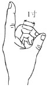

图3　手指比量法直指寸（中指同身寸）

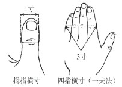

图4　手指比量法横指寸

### 百会

【取穴】正坐，位于头顶部正中线上，距前发际5寸；或于头部正中线与两耳尖连线的交点处取穴。（图5）

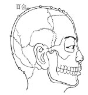

图5　百会

百会属于督脉的一个穴位，看一个穴位，不仅仅是看它属于哪条经脉，还要看它是几条经脉的交汇，即几条经脉会路过它。

百会：督脉与足太阳之会（《针灸甲乙经》）；督脉与足太阳之会（《外台秘要》）；督脉与足太阳之会（《铜人腧穴图经》），督脉与手足三阳之会（《针灸大成》）；督脉与足太阳、手足少阳、足厥阴俱会于此（《类经图翼》）。

综上，百会是督脉与手足三阳经及肝经共八条经脉的交汇处（也就是督脉、小肠经、大肠经、三焦经、膀胱经、胃经、胆经、肝经交汇处）。

有这么多条经脉交汇于一个穴位，那按照“经脉所过，主治所及”这个理论，就注定了百会穴治疗的病种很广。大家一定要熟记下面的功效。

【主治】《经络腧穴学》（全国中医药行业高等教育“十四五”规划教材，以下统称为教材）将主治分为三大类，第一个是头面五官，第二个是神经系统，第三个是脏器下垂，这三大方面，但这些还未完全概括它的功效。

头面五官：头痛，目痛，眩晕，耳鸣，鼻塞。

神经系统：中风，神昏，癫狂痫，惊风，痴呆。

脏器下垂：脱肛，阴挺。

《针灸大成》：主头风中风，言语謇涩，口噤不开，偏风半身不遂。心烦闷，惊悸健忘，忘前失后，心神恍惚，无心力。痎疟，脱肛，风痫，青风，心风，角弓反张，羊鸣多哭，语言不择，发时即死，吐沫，汗出而呕。饮酒面赤，脑重鼻塞，头痛目眩，食无味，百病皆治。

《针灸大成》对百会穴的一些功效总结，其实基本上也被教材所罗列出来了，但是还有一些内容没有被教材所收纳，比如说痎疟，也就是疟疾。下面我们就逐一学习一下这些没有被收纳的主治。

#### 一　心烦闷，惊悸健忘，心神恍惚，无心力，食无味。

我们把这几个症状列出来看看：心里面很烦闷，时常感到心慌、惊悸、害怕，胆小又健忘。心神恍惚可以认为脑子昏昏沉沉，注意力无法集中。无心力是什么意思呢，就是有心无力，想做什么事情都有心无力，力不从心，心里空落落的。无心力，甚至去做心脏彩超检查还可能发现二尖瓣或三尖瓣反流。食无味，就是什么都不想吃，没什么胃口，饭可吃可不吃。

这几个你把它罗列起来特别像什么？像焦虑症，也像抑郁症。

故笔者认为这个穴位能够治疗一些精神方面的问题。

随后我就把这个穴位用于部分青春期的抑郁症、焦虑症患者身上，发现效果非常好。

脑为元神之府，这个神，控制着我们的五脏六腑，有时治脏腑效果不好，一定要考虑到是不是精神方面出问题了。神是一个总控系统，调神很重要，而调神的一个很关键的穴位，就是百会，大家一定要熟悉于心，人无法避免会出现情绪问题。

心神恍惚，可以理解为“神气不足”，常见于学生这个群体，学生由于长时间睡不好觉，大脑就昏昏沉沉，注意力自然无法集中，在这种情况下，如何还有精神去听课？接下来的问题就是学习成绩下降，学习成绩下降引起自卑如果无法自我开导，慢慢地就可能往精神疾病方面发展，所以灸百会穴中断了这个“心神恍惚”过程，让大脑清醒，提升听课效率，从而也就提升了成绩，建立了自信，恢复了精神的健康。

#### 二　忘前失后

这个症状可以理解为老年性痴呆导致记忆逐渐减退，老年性痴呆对于患者本人来说，可能没那么痛苦，但是对家人确实是个折磨，无论是物质上还是精神上，都可能拖垮一个家庭。试想，如果父母忘记了儿女，对儿女是多大的打击。灸百会或针刺百会可延缓病情进一步发展甚至恢复正常，但这个治疗过程也一定是漫长并且需要家人或患者有坚持不懈的精神。

#### 三　中风，言语謇涩，口噤不开，偏风半身不遂

看这些症状，其实是已经中风的症状了，表明百会可治中风，但平时也可防患于未然，尤其在体检时发现有脑萎缩和腔隙性脑梗死的患者，还没有发展到中风倒地之前，有些手麻、唇麻、说话结巴、突然腿无力、半边身体失控、一过性脑缺血的头晕目眩等症状，就可以提前灸起来，可以改善脑部的供血，避免中风的发生。

#### 四　脱肛

《针灸大成》未列阴挺之功能主治。

但百会确实能治阴挺，它具有将下垂的脏器往上提的一个作用。

阴挺就是子宫下垂或者阴道壁膨出，其实就是子宫的收缩能力下降了，阴道子宫平滑肌的力量不够了。

百会在人体最高处，灸过百会之后，它能够有力气收缩，它一收缩，子宫不就回到原来的位置了么，所以百会有提托的作用。再想想，我们继续延伸百会的作用，它能够收缩子宫，那它能够导致什么？宫缩。或者说给宫缩加力，对不对？所以它是不是能够治疗宫缩无力的难产？

生孩子，生到最后没力了，灸一下百会，加强宫缩，子宫一收缩，胎儿就容易娩出。这个经验，在我们岭南灸法大师苏天佑的针灸治疗学里面有记载。他所著的《针灸医案搜奇录》里就收录一例通过灸百会治疗难产的医案。

目前来讲，我最常用的就是安神，就是让人精神安定下来。焦虑也好，抑郁也罢，先让人的“精神”安定了，气血才能正常运转，其他的问题就能得到改善。然后我们再灸其他的穴位。

【注意事项】《类经图翼》上说，这个百会灸多了，要在周边围着百会用三棱针放点血，用井花水淋它。

《类经图翼》：若灸至百壮，停三五日后，绕四畔，用三棱针出血，以井花水淋之，令气宣通，否则恐火气上雍，令人目暗。

其实就是把热气放出来的意思，因为百会有提托的作用，把气往上引，气血上供大脑，那你灸得太多，火气自然过旺了。文中“灸百壮”，实际临床上不用那么多，我一般灸七壮，灸多了就“令人目暗”，火烧火燎，视物模糊，这时候在百会周边放点血，可以缓解这个副作用。当然也可以灸一下足三里或涌泉，将火往下引，或者耳尖放点血。

这里就是提示我们，灸百会要慎重，不要过量。

头皮没那么敏感，一般灸三壮它都没感觉，要灸到四五壮才觉得热，灸到七壮就很热了，再灸多了就起疱。所以我们灸百会，一般都是以七壮为止，大多时候我就灸五壮。平时保健的话，五壮就已经很够了，一定不要贪多。

我再补充一下百会是怎么灸的？主要是头发怎么办？

处理头发这个问题太简单不过了，你把头发分拨开来就行了，把头发一梳，在正中线上把头发往两边一拨就拨开了。可是你说头发会乱，怎么办？可用发夹把两边头发夹好，不就固定了吗？耳朵尖再往上一比量，与发缝相交处，就是百会，上面抹点紫金膏，搓个粟米大的艾炷，往紫金膏上一放，就可以点燃了，连灸个六七壮。紫金膏蹭掉了怎么办？你再抹一点，直接灸完五到七壮的，就可以了。因为搓得很细，不是大艾炷，尽管放心，不会烧到头发，也不会烧到毛孔，有的话最多也就两三根，两三根头发无伤大雅。

### 大椎

【取穴】大椎穴位于后正中线上（颈根后），第七颈椎棘突下凹陷中（图6）。简单地说，将头稍微往前垂下，不动肩膀只左右动头颈部，便会发现肩背部正中线上有的地方突起会动，有的地方突起不动，会动的突起就是颈椎，取穴时只要找会动的突起的下方凹陷处即是。

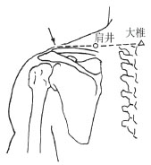

图6　大椎

如果最下方有两个高起的骨头让人难以分辨，可以把手指放到两块高起骨头的部位，保持低头的姿势再重复做摇头的动作，可左右移动的就是第七颈椎，而固定不动是第一胸椎，在第七颈椎椎骨下方的凹陷处就可取得大椎穴。

还有个笨办法就是寻找肩膀两侧肩峰的连线，连线与脊柱相交上侧的凹陷处即可取大椎穴。

【主治】大椎别名百劳、上杼，为督脉之穴。大椎穴是手足三阳经与督脉的交会穴。督脉具有统率和督促全身阳经的作用，又被称为“阳脉之海”，故大椎穴被称为“阳中之阳”，具有统领一身阳气的作用。以下是教材归纳的主治。

热病，疟疾，寒热。

咳嗽，气喘，骨蒸。

脊痛，颈项强痛。

大椎穴是七条经脉交汇处，也同样注定了它的强大。

《针灸大成》：主肺胀胁满，呕吐上气，五劳七伤，乏力，温疟痎疟，气注背膊拘急，颈项强不得回顾，风劳食气、骨热，前板齿燥。

这些功用主治基本上都被教材所归纳，只要熟记即可，要想深刻理解，仍然要靠多临床、多实践。

有几点，我还是要说明一下：

#### 一　解表散寒

无论是多久的寒气，无论是多重的寒气，只要坚持灸，都能散掉。多说理论，可能觉得空洞，我讲一个厦门灸法大师陈应龙教授的医案以助理解：

大概在20世纪五六十年代，有一位32岁的陈姓女患者，得了怕冷的毛病，大夏天穿羊毛衣裤，整天钻在被窝里不敢出来，冷啊。后来请陈老先生出诊，发现大白天她屋子里一团漆黑，门窗紧闭，就怕有风溜进来。陈大夫切脉发现脉细微，手足冰凉。她说是畏寒怕冷有一年多了，吃了不少中西药都没效，老公不在身边，孩子又年幼无知，觉得活不了了，就写好遗嘱跟老公交代后事。陈老大夫一阵安慰后，说这病可治，当下就给灸了“大椎”三壮。

第二天，再去复诊，只见这陈女士，穿着短袖单衣，精神奕奕，窗户门扇大开，室内阳光普照，笑着对陈老大夫说：“写好的遗嘱，昨晚已经烧掉了。”

这个寒邪这么快就消退了，应该是邪仍在表，要是真阳损伤，怕不能取得速效，得长期坚持。

在陈老的启发下，我亦常用大椎驱寒。

一位体格稍胖的50岁左右的女士，自诉颈后怕冷怕风，常年需要围脖挡风，我当时就给灸了大椎五壮，隔天再诊，怕冷明显好转，再灸两次，即不再怕风，可除围脖。

一位跟笔者学过米粒灸的学员反馈，他的父亲畏寒，冬天晚上睡觉要盖三四床被子，这位学员回老家后，便给老人家施灸，受我在网络发表过的医案的启发，选大椎、命门、合谷，仅灸两次，就可以只盖一床被子了。

#### 二　五劳七伤、风劳食气

五劳七伤以虚证居多，常被形容体弱多病之人。

五劳一指五脏劳损，即心劳血损、肝劳神损、脾劳食损、肺劳气损、肾劳精损；二指五种劳伤的病因，即久视伤血、久卧伤气、久坐伤肉、久立伤骨、久行伤筋。七伤指大饱伤脾，大怒气逆伤肝，强力举重、久坐湿地伤肾，形寒饮冷伤肺，忧愁思虑伤心，风雨寒暑伤形，怨惧不节伤志。七伤也指生殖系统疾病，即阴寒、阳痿、里急、精漏、精少、精清、小便数等。

“风劳”见于《太平圣惠方·治风劳诸方》：“夫劳伤之人，表里多虚，血气衰弱，肤腠疏泄，风邪易侵，或游易皮肤，或沉滞脏腑，随其所感，而众病生焉。”即机体本身就很虚弱，又总是伤风感冒。“食气”指人的正气不停地被消耗，得不到恢复。“风劳食气”在现代大体常见于体力衰弱者，尤其是这次感冒未好、下次感冒又来的患者。

大椎穴，在我们的印象中，常用于清热，治风热感冒，可上文说的功效明显是补益作用，它是如何实现的？起码在针刺治疗时，是难以做到的。

要实现大椎的补益作用，唯有用灸法，最好是直接灸法，开穴之后，直接将阳气补进督脉，促进全身功能的活跃。

大椎可以散寒祛风，完全可以中断虚人反复感冒的恶性循环，让机体得到修整从而恢复健康。

因此，它的别名百劳，就是这么来的。

大椎和百会，都是手足三阳经交会的地方，大椎偏驱风寒且有滋补作用，百会偏驱风清头目而无滋补作用。

### 身柱

【取穴】身柱，属督脉，位于第三、四胸椎棘突之间（即第三胸椎棘突下凹陷中，图7）。取穴时，正坐略低头，先找到大椎，再往下数第三个骨节下方摸到凹陷处即是身柱穴。

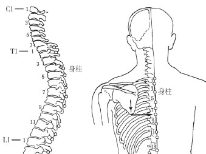

图7　身柱

身柱，顾名为身体的支柱，此穴犹如肩胛的支撑柱子。

【主治】以下是教材所归纳的主治。

咳嗽，气喘。

身热，癫狂，惊风，瘛疭。

腰背痛。

《针灸大成》：主腰脊痛，癫病狂走，瘛疭，怒欲杀人。身热，妄言见鬼，小儿惊痫。

身柱穴平肺俞穴，即此穴能通肺气，又肺与大肠相表里，还能通大肠之气，本身属督脉也可通脑气、肾气，故治疗范围也广。

因为其通肺气，所以可治呼吸系统疾病，如长期鼻塞、慢性支气管炎、哮喘、肺结核等，肺主皮毛又可治部分皮肤病；通手阳明大肠经则可治泄泻，又可调同名经即足阳明胃经以治疗吐乳、婴幼儿消化不良等；通督脉、调肾气，肾气旺则卫气有根，卫气一足，则不易外感，也治夜尿；因通脑气也治夜间啼哭及癫痫。

此穴在儿童保养中非常重要，平素隔三岔五只灸此一穴，则不易感冒，即便感冒也恢复得快。一些医家将此穴当成通治儿科百病的穴位，其增强抵抗力防感冒的作用，与大椎治“风劳食气”之功很相似。

### 膏肓

【取穴】让患者平坐床上，屈膝抵胸，前臂交叉，双手扶于膝上，低头，面额抵于手背，使两肩胛骨充分张开，在第四胸椎棘突下旁开3寸，即按压肩胛骨内侧缘骨缝处，觉胸肋间困痛，传至手臂，即是膏肓穴，掐痕做标记。或让患者俯卧于床上，双手握拳，将手背贴于腰上，便于肩胛骨打开露出穴位。（图8）

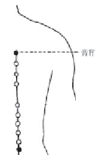

图8　膏肓

坐取或卧取，无论哪种，都要让肩胛骨张开，要不然肩胛骨会覆盖于膏肓穴上，施针或灸都不容易刺激到这个穴位，所以它的取穴方法的首要就是令肩胛骨张开。

【主治】它的主治有三类。第一个是肺系疾病，主要是指肺阴虚导致的咳嗽、气喘、盗汗、肺痨、肺结核。第二个是遗精，遗精常见于肾之阴虚火旺证。第三个是羸瘦虚损（累及五脏六腑精气血的虚损），已经是比较严重的情况，就是我们常讲的“病入膏肓”，病根深重，很难搞，到了最后关头，要灸这个穴位。

我们可以明显看到这个穴位的主治功效接近于滋阴。以下是教材归纳的主治。

咳嗽，气喘，盗汗，肺痨。

遗精。

羸瘦虚损。

我们来分析一下《针灸大成》里面所列的主治。

《针灸大成》：主无所不疗。羸瘦，虚损，传尸骨蒸，梦中失精，上气咳逆，发狂，健忘，痰病。

羸瘦虚损是五脏精气亏损，传尸骨蒸是肺阴虚，梦中失精是心肾不交，上气咳逆是肺失宣降。

发狂和健忘，多是由于痰迷心窍导致，还有“痰病”，也就是说膏肓除了能养阴，其实还有化痰的作用。

怎么去理解它呢？

膏肓，平厥阴俞，可以入心包经。膀胱经背部的穴位与夹脊穴及督脉的经穴，只要与背俞穴在同一个水平线上，它们的功效就有相似性。比如说身柱平的是肺俞，它能够入肺，通调肺脏。同理，膏肓平厥阴俞，能入心包经，故膏肓也有调理心包经的作用。

那如何通过调理心包经来起到养阴补精和化痰的作用？

这个大家可以参考一下我在《痰湿一去百病消》里面谈到心包的结构功能。

心包是有空腔的，并与同样有空腔的三焦相互为表里。

三焦是水液代谢的通道，也是容纳痰湿的一个最重要的器官。当三焦不能够运化代谢这些水液时，即会将水液害化成痰湿，当痰湿多到三焦容纳不了时，就会满溢到与之相表里的心包，所以心包很容易出现痰证。我们常用的化痰名方温胆汤就是专门治疗心包痰证的一个处方。故灸厥阴俞，有类温胆汤之化痰作用。

另，心包代心受邪，心有主血脉的作用，同样心包也能主血脉，所以灸膏肓也有能够拓宽脉道，增加机体储存气血津液精的功能。一个瘦弱的人，当经脉被拓宽，所容纳的气血津液精更多的时候，机体就能恢复肌肉的丰满度，虚损就得到了修复。

膏肓是一个非常重要的补虚的穴位，但补虚之功效需要靠灸法来实现，在一个重针轻灸的年代，这个功效很自然就被人为地忽略了。

【附】膏肓可治肩胛综合征

焦虑、紧张、易怒、烦躁的人常见肩胛周围肌肉和韧带处发酸发胀，按揉它时，发现这个酸痛点往往就在膏肓穴上。

膏肓穴作痛，在临床上发作频率是很高的，笔者在门诊见过许多这样的患者。

以往我治这个病时，是通过针刺内关穴（膏肓平厥阴俞而入心包经，内关是心包经之要穴）来治疗这个膏肓疼痛，即时的止痛效果非常好，但易反复，尤其是情绪波动或与家人吵架时，容易诱发膏肓穴作痛。

从这个角度看，膏肓穴与情绪的关系非常密切。可以说膏肓穴是一个情绪垃圾站，不好的情绪总会聚集在膏肓穴，令人肩胛不适，产生酸胀沉痛的感觉，进而影响失眠，让人烦躁易怒，然后继续与家人、同事、朋友发生冲突，然后又产生新的情绪垃圾无法宣泄，又聚集在膏肓穴上，加重这个症状。

（注：膻中为心包之募穴，膻中作为臣使之官，代君行令，喜乐出焉。门诊常见患者抑郁不能喜乐，膏肓穴上有压痛时，可以通过灸治膏肓穴来调节情绪。）

我们只要坚持去灸这个膏肓穴，就能治疗这个肩胛痛，同时也能改善一个人的精神状态，恢复精神健康。

泉州针灸大家留章杰教授的弟子苏稼夫曾记录：一患膏肓穴钻痛多年的女性患者，久治不愈。留老师（留章杰）在艾绒中配入少许麝香搓成麦粒状后给病者灸治法，初为五壮，以后渐增至十一壮，经十余次的治疗竟获痊愈。（《留章杰先生纪念文集》，留章杰，为承淡安的学生）

### 曲池

【取穴】位于尺泽与肱骨外上髁连线的中点，即屈肘成直角，当肘弯横纹尽头处。（图9）

曲池为大肠经之合穴，可治手阳明大肠经及腑病，而大肠经最易积热。

【主治】怎么看，此穴的主治功能都偏清法。以下是教材所归纳的主治。

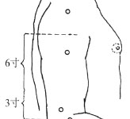

图9　曲池

咽喉肿痛，齿痛，目疾。

瘾疹，湿疹，瘰疬。

热病，惊痫。

手臂肿痛，上肢不遂。

《针灸大成》所列之功效，基本为教材所归纳，我们可以提炼一下：清热解表，散风止痒，消肿止痛，调和气血，疏经通络。

《针灸大成》：主绕踝风，手臂红肿，肘中痛，偏风半身不遂，恶风邪气，泣出喜忘，风瘾疹，喉痹不能言，胸中烦满，臂膊疼痛，筋缓捉物不得，挽弓不开，屈伸难，风痹，肘细无力，伤寒余热不尽，皮肤干燥，瘛疭癫疾，举体痛痒如虫啮，皮脱作疮，皮肤痂疥，妇人经脉不通。

此穴为手阳明大肠经穴，大肠经与肺经相表里，肺主皮毛。此穴位于肘部，乃经气运行之大关，能通上达下，通里达表，既可清在外之风热，又能泻在内之火邪，是表里双清之要穴，具有疏散风热、解表散邪之功，擅解全身风热表邪，主治外感热病、风热上扰的头痛、咽喉肿痛、风热犯肺的咳嗽气喘（肺所中邪，常传于大肠，再由大肠经出表）等。

此穴不但疏散表热，还可清解里热，具有清泻热毒、通经止痛之功，治疗阳明积热所致的头痛、齿痛、目痛等五官疾患（手阳明大肠经通头面五官）。

此穴为手阳明大肠经合穴，五行属性属土，合治内腑，故可清泻阳明，清利湿热，调理大肠气血，治疗湿、热、气、血壅滞大肠，肠腑传导失职导致的腹胀、腹痛、吐泻、痢疾、便秘、肠痈及阳明郁热的乳痈等病。

大肠经与肺经相表里，故此穴具有清热解毒、凉血祛风、消肿止痛之功，可泻除热毒郁遏肌表的各种皮肤疾患（此功效只数语，但确为灸治清热之关键穴位之一，也为治皮肤病之极重要穴位）。

此穴属土，还具有清热化痰的作用，加之可以解表热、泻内火，用于治疗痰火扰心或热扰神明的胸中烦满、善惊、癫狂等神志病，甚至热极生风的抽搐，以及风阳上扰、气血上冲的头痛头晕（此功效之实现，主要为间治作用，与足阳明胃经为同名经，胃络入脑，故曲池间接作用于脑）。

此穴位于肘部，具有通经络、调气血、祛风湿、利关节、止痹痛之功，可用于治疗上肢痿痹、瘫痪诸疾。

### 中脘

【取穴】中脘在上腹部，前正中线上，当脐中上4寸（居心蔽骨，即胸剑联合中点与肚脐连线的中间点上，图10）。中脘属任脉，为任脉、手太阳与少阳、足阳明之会；胃之募穴；八会穴之腑会。

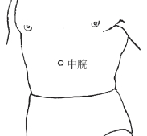

图10　中脘

【主治】教材的归纳主治，基本上是消化系统的问题。如胃痛、腹胀、腹中积聚、泄泻、便秘、食欲不振、呕吐、黄疸。

《针灸大成》：主五膈，喘息不止，腹暴胀，中恶，脾疼，饮食不进，翻胃，赤白痢，寒癖，气心疼，伏梁，心下如覆杯，心膨胀，面色萎黄，天行伤寒热不已，温疟先腹痛，先泻，霍乱，泻出不知，食饮不化，心痛，身寒，不可俯仰，气发噎。

中脘在中焦正中处，肺脉起点在中焦，肺脉是承接肝脉的，理所当然，肝脉的终点在中焦，故中脘可以同时调理肺病与肝病。

《针灸大成》有“喘息不止”，这是肺系疾病常见症状，为什么要将这个列出？细研肺经的循行就应该知道，肺经的起点在中焦，若中焦产生食积痰湿，必沿经络上传于肺，从而引发咳嗽甚至哮喘，故灸中脘，可治痰喘。

又怎么理解治肝病？肝经夹胃经贯膈，肝经的问题更多地表现在胃经上，尤其肝气乘胃引起的胃痛、胃胀、胃食管反流等消化系疾病，灸中脘，表面上治的是消化系疾病，其实是可以泻肝气的。

总结功能主治，主要就是开胃消食、升清降浊。由于米粒灸有温与通的作用，灸后会提高消化能力，吃得多了，也饿得快了。本穴灸通透后，吃热性食物很快就运化了，也不上火；吃凉性食物，也很快运化，也不会呕吐拉稀，因为有温的作用，更不会像以前那样一吃凉的就腹痛、咳白痰了。

中脘的消食作用，间接地减少了痰湿的产生，也就达到了化痰的目的，对于寒咳、寒喘有白痰的患者，此穴宜常用。

### 关元

【取穴】关元在下腹部，位于前正中线上，当脐中下3寸。属任脉穴，为足三阴、任脉之会，小肠募穴。（图11）

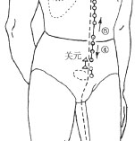

图11　关元

【主治】关元通足三阴经，所以能调肝脾肾三脏。

《针灸大成》：主积冷虚乏，脐下绞痛，渐入阴中，发作无时，冷气结块痛；寒气入腹痛，失精白浊，溺血七疝，风眩头痛，转脬闭塞，小便不通黄赤，劳热，石淋五淋，泄利，奔豚抢心，脐下结血，状如覆杯，妇人带下，月经不通，绝嗣不生，胞门闭塞，胎漏下血，产后恶露不止。

以上所列主治稍归纳一下，不外乎：妇人病症；前阴、肾系病证；脾胃、腹部病证；虚寒病证。只要熟记以上功效就可以了。以下是教材所归纳的主治。

癃闭，尿频，遗精，阳痿，月经不调，痛经，经闭，崩漏，带下，阴挺，恶露不尽，不孕。

疝气，小腹疼痛。

腹泻。

虚劳羸瘦。

关元为任脉穴，所处位置最靠近“胞中”这个生命本源的地方，所以最补肾之精气。肾之精气，可化为肾阴与肾阳，故关元为阴阳同补之大穴。

可灸只有热量，并无物质进去，如何能补到精？这主要得益于关元为小肠募穴通小肠经，可将小肠后天分清泌浊之后所得的精华，快速进入任脉转化为先天所需的精气存储于胞中。

灸此穴，可加强生殖功能，令之能延续后代。长期灸此穴，可延年益寿。

### 足三里

【取穴】足三里穴位于小腿前外侧，当犊鼻穴下3寸，距胫骨前缘一横指（中指）外、膝眼下四横指、胫骨边缘（找穴时左腿用右手、右腿用左手以食指第二关节沿胫骨上移，至有突出的斜面骨头阻挡为止，指尖处即为此穴，图12）。

图12　足三里

简易找法：从下往上触摸小腿的外侧，左膝盖的膝盖骨下面，可摸到凸块（胫骨外侧髁）。由此再往外，斜下方一点之处，还有另一凸块（腓骨小头）。这两块凸骨以线连结，以此线为底边向下作一正三角形。而此正三角形的顶点，正是足三里穴。

【主治】足阳明胃经是一条多气多血之脉，而足三里是其最重要的一个穴位，也是可直接调理胃腑功能的合穴与下合穴。

《针灸大成》：主胃中寒，心腹胀满，肠鸣，脏气虚惫，真气不足，腹痛食不下，大便不通，心闷不已，卒心痛，腹有逆气上攻，腰痛不得俯仰，小肠气，水气蛊毒，鬼击，痃癖，四肢满，膝胻酸痛，目不明，产妇血晕。

正因能促进胃腑之功能，使得饮食被受纳，并与脾相互加速运化，令人体气血大增，体质得以改善，间接增强了五脏六腑及相应经络的功能，故今人有“百病莫忘足三里”之言。以下是教材所归纳的主治。

胃痛，呕吐，呃逆，腹胀，腹痛，肠鸣，泄泻，便秘。

热病，癫狂。

乳痈。

虚劳羸瘦。

膝足肿痛。

足三里有什么功用，要看胃经如何循行。

因其路过肚腹，故可治一切肚腹疾患，如：胃痛，呕吐，腹胀，肠鸣，消化不良，泄泻，便秘，痢疾，霍乱遗矢，疳积。急、慢性胃炎，胃溃疡，十二指肠溃疡，急、慢性胰腺炎，肝炎，消化不良，急、慢性肠炎，细菌性痢疾，阑尾炎。

因胃络入脑，故可治心神疾患，如：心烦，心悸气短，不寐，癫狂，妄笑，中风。休克，神经性头痛，癫痫，神经衰弱，精神分裂症，动脉硬化。

因肺经起于中焦，中焦是胃经主场，故可治胸肺疾患，如喘咳痰多，喘息，虚痨，咯血，支气管哮喘。

胃经经过少腹，且胃经主润宗筋，而宗筋绕生殖器，故可治少腹疾患，如：小便不利，遗尿，疝气。

胃经多气多血，女子以血为本，故可治妇人疾患，如：乳痈（胃经经过乳房），妇人血晕，子痫，妊娠恶阻，赤白带下，痛经，催产，产后腰痛，妇人脏躁。

也可治本经脉所过部位的疾患，如：膝胫酸痛，下肢不遂，脚气。坐骨神经痛，下肢瘫痪，膝关节及周围软组织疾患。

胃经多气多血，气血足后，可间接治愈多种疾患，如：水肿，头晕，鼻疾，耳鸣，眼目诸疾，真气不足，脏气虚惫，体虚羸瘦，五劳七伤。又如白细胞减少症，小儿发育不良。

众多穴中，几乎可以称得上是包治百病的穴位，笔者在临床上，无论大人小孩，只要辨证中符合气血两亏、脾胃虚弱者，均有应用此穴。

人年三十以上，若灸头不灸三里穴，令人气上眼暗，所以三里下气也。（《千金翼方·针灸》卷二十八）

就是说，人过了三十岁以后，灸了头部之后，要是不灸一下足三里，这个热气就会留在上部，让人视物昏花。

人年三十以上，若不灸三里，令人气上眼暗，所以三里下气也。出第二十七卷中。（《外台秘要·明堂》卷三十）

这才过了七十年，《外台秘要》在抄书引文的时候，少抄了两个字，变成了人到了三十岁以后，就必须要灸足三里，不灸的话会眼花。

三里，凡人年三十以上，不灸此穴则热气上冲，眼目无明。（《窦太师针经》）

说足三里这个穴啊，人过了三十岁，要是不灸这个穴，热气就上冲，让人看不清。

人过三旬后，针灸眼能宽。（《针灸玉龙经·天星十一穴三里》）

到了这里，又过了五百多年了，孙悟空取经都回来了。这又演变成了啥？成了人过了三十岁，要多针刺艾灸足三里，这样能维持眼力，老花来得慢。

《外台》云凡人过三十以上，能灸此穴，则热气下，眼目增明。（《针方六集》卷五）

又过了三百多年，说灸足三里穴能明目。

一云小儿忌灸三里，三十外方可灸，不尔反生疾……《外台·明堂》云：人年三十以外若不灸三里，令气上冲目，使眼无光，盖以三里能下气也。（《类经图翼》卷六）

到了这里就开始胡编乱造了，明明人家一开始是说，人过三十了，灸了头要是不灸足三里引热下行的话，怕是热气要伤眼。怎么就变成了小孩子忌灸三里呢？

《外台秘要》云人年三十以后，宜灸三里，令气上冲，可无失明之患。故云“人过三旬后，针灸眼重光”。（《循经考穴编》）

还是重复的话。

小儿忌灸，恐眼目不明，惟三十以外方可灸之，令眼目光明也。（《医宗金鉴·刺灸心法要诀》）

我看小儿忌灸足三里的源头就是《类经图翼》，只是说谁谁云，怎么个云？没有说出个原由，搞得直到最后官方直接官宣小儿忌灸，失去原文本义。

失误之处，还是因为传世本《外台秘要》在录《千金翼方》此条原文的时候，在“不灸三里穴”前漏了“灸头”这两个关键字，直接搞了个天大的误会，后面的人就开始脑补发挥起来。越到后面是越离谱，越传越吓人，更说灸了小儿足三里，会眼瞎。

我扶额长叹，这抄书的，有多少是搞过米粒灸啊？

若是遇到脾胃虚寒水样作泻，难道不是当灸则灸？

这就跟冬吃萝卜夏吃姜一个道理，有些人教条到冬天真不吃姜。

有人说晚上吃姜如吃砒霜，我不禁看看手中的姜糖，瑟瑟发抖，你们晚饭蒸鱼不放姜丝吗？

至于有些人说灸了眼睛模糊，得先看看自己气血状态以及胃中内生邪气的状态。

足阳明胃经：循眼系入络脑。

足阳明胃经别络：足阳明之正，上循咽，出于中口，上頞䪼，还系目系。

胃的经络，循行于眼系，灸足三里，能将气血灌注于眼，让眼睛更明亮。

至于刚开始的模糊，应该是胃中湿热或其他内生邪气，受到灸后，鼓动了经气上冲到眼，眼花几天或出几天眼屎就好了，再坚持下去，眼就明亮了。

话又说回来，足三里，是大补之穴，体虚之人比较适合，对于年少生理机能旺盛者来说，此时灸治足三里，则有“过度进补”之虞，这与“少儿进补，老来受苦”一个道理。但遇到脾胃怯弱，吃点瓜果生冷、肥甘厚味就生病的孩子，灸一灸也无妨。

又说回小儿忌灸足三里这个谣传的源头——《外台秘要》，要不是漏抄“灸头”两字，也就不会有后面那么多“谣传”。《类经图翼》虽然引用《外台秘要》，但在《外台秘要方·卷第三十五·小儿将息衣裳厚薄致生诸痫及诸疾方并灸法二十八首》小儿“若手足掣疭惊者”（就是手脚抽动），有一方，就是“灸伏兔。次灸三里。次灸腓肠。次灸鹿溪。次灸阳明。次灸少阳。次灸然谷。”同一本书，又明明白白让小儿灸足三里了，这是互相矛盾吗？

此穴不辨不明，只要正确辨证施治，该用足三里，就用足三里。

笔者在临床上，大胆应用足三里（包括我自己的孩子也用），并无出现不适，反而能促进身高体重的增长，面色变得红润，抵抗力增加，体质得到明显改善。

有部分小孩灸身柱，会出现眼屎增多，转灸足三里却不会。又有部分小孩灸足三里，会出现眼屎增多，转灸身柱却不会。可见两者均能令阳明之湿热入眼，无非就是灸后的正气，鼓动湿热外排，等排完了，眼屎自会消失。

实在太严重，停灸数日即可，再服些保和丸、甘露消毒丹，将余热清一清，或灸曲池也可清余热，余热清完即无事。

【附】支沟、照海。

支沟，三焦经的穴位，三焦为水火通道，支沟在三焦经所有穴位中调水火的力量最强，调水可以重新分配不平衡的水液排布；调火可以散掉局部淤积的热气。

照海，顾名思义，阳光照射大海，能将肾经中的水液蒸腾上来。

【附】拓脉三穴：膈俞、患门（心俞）、膏肓。

膈俞为血会，有活血作用，能够通畅血脉。此穴能够刺激全身的力量去拓宽脉道，当血脉被拓宽之后，它对热量的存储空间就增加了，原来血热的皮肤瘙痒，就不痒了。膈俞还有养血的作用，滋养阴液，有了阴血，它就能容纳更多的热量，你有多少阴就能容纳多少阳（负阴抱阳），阴阳如果平衡，它就不上火。打个比方一家三口住在一房一厅，肯定很挤，容易发生冲突，突然之间给拓宽到三房两厅，这时再三个人住，就觉得很宽敞，也不怎么吵架了，对不对？

患门，见于唐代崔知悌的《骨蒸病灸方》，可灸五劳七伤（虚损），主灸虚劳（即阴虚火旺的肺结核）。经考证，心俞即患门。心俞的作用依然是拓宽脉道，心主血脉，也是能拓宽一身的血脉。

膏肓，平厥阴俞，通手厥阴心包经，其实也是间接主血脉的作用。

故以上数穴，对于一些阴虚内热的人是比较适合使用的，主要原因就是于拓宽脉道后增加了气血的容量，也就增加了对火力的受纳能力不造成拥堵，因此上火症状的人将这几个穴位灸透了之后，他就不上火。

【附】胰俞。

胰俞最早出现在1974年上海中医学院主编、人民卫生出版社出版的《针灸学》一书中。胰俞在第8胸椎棘突下旁开1.5寸，膈俞穴与肝俞穴之间。主治：胃脘痛，呃逆，口苦咽干，大便不调，多饮多尿，消食，盗汗遗精，肢体无力，肌肉酸楚。从主治看，胰俞能滋阴，尤其是胃阴，能改善口干渴，配合照海使用，滋阴功效叠加。胰俞虽然是今人发现，但古人亦在平胰俞的督脉上（第8胸椎棘突下）发现“胃下俞”穴（《千金翼方·卷第二十八·消渴第一》），主治消渴、咽喉干。从经验上看，背俞穴与督脉之穴，在同一水平上，脉气相通，功效常相近。古今所选，竟有异曲同功之处。

取穴基本原则
------

笔者入行针灸二十年，已经形成了自己的选穴习惯，对于我来说，最方便好用的，就是按脏腑经络取穴，施治之前，一定要将病位定清楚在哪个脏腑哪条经络上。

这种本经配穴法或循经配穴法最早出现在《灵枢·终始》：“必先通十二经脉之所生病……故阴阳不相移，虚实不相倾，取之其经。”

学起来，最简单，也最直接，往往不需要花里胡哨的噱头就将病给治好。其基本原则就是：**经络所过，主治所及；腧穴所在，主治所在**。

### 经络所过，主治所及

凡是本经内脏发生病变可采用本经的腧穴治疗。

- 肺病：咳喘、咯血可取列缺、鱼际、尺泽下一寸、中府诸穴。
- 心病：心悸、怔忡、失眠、癫痫可取神门、通里、灵道诸穴。
- 脾病：泄泻、下痢、腹痛、腹胀可取太白、公孙、阴陵泉、大横、腹哀诸穴。
- 肾病：遗精、遗尿、阳痿、水肿可取复溜、照海、太溪、然谷诸穴。
- 肝病：胁痛、黄疸、疝气可取大敦、行间、太冲、期门、章门诸穴。

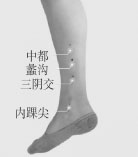

图13 分布于小腿内侧正中线上内踝尖上三同身寸为三阴交，三阴交上两同身寸为蠡沟，蠡沟上两同身寸为中都。

- 心包病：心痛、心烦、吐血、癫痫可取劳宫（慎用）、大陵、内关、间使诸穴。
- 胃病：疼痛、呕吐、胀闷、消化不良、呃逆、反胃、噎膈可取滑肉门、天枢、大巨、足三里、上巨虚、内庭、梁门诸穴。
- 膀胱病：遗尿、小便不通可取至阴、膀胱俞、肾俞、气海俞、关元俞诸穴。
- 胆病：肋胁痛、黄疸、胆结石可取日月、京门、阳陵泉、丘墟诸穴。
- 三焦病：肋胁疼痛、瘿瘤可取外关、支沟、天井诸穴。
- 大肠病：肠鸣、腹痛、小便不利可取曲池、温溜、下廉、合谷诸穴。
- 小肠病：少腹痛、小便不利可取少泽、后溪、小海诸穴。
- 任脉病：七疝、白带、癥瘕可取曲骨、中极、关元、气海诸穴。
- 督脉病：脊强、反折可取大椎、腰阳关、筋缩、命门诸穴。

要想用好本经取穴法，我们还是要认真过一遍五脏六脏的基本功能及十二经及奇经八脉的基本循行路径，如有相应脏腑功能出现病变，则在相应经穴上施灸，请不要因为以下内容太过基础枯燥而忽略，这基本功往往是出奇制胜的关键所在。

#### 1　从五脏的生理功能及经络的循行路径去认识经穴的作用

(1)心：心主血脉（可疏通经脉、活血止痛、调节心律），心主神明（可镇定安神、调节精神状态）。

心合脉，其华在面（可调面色苍白、晦暗、青紫）；开窍于舌（可治舌体病及语言功能发育迟缓或障碍）；喜为心志（可解郁），汗为心液（可治盗汗）。

手少阴心经：本经腧穴主要治疗心、胸、神志病及经脉循行部位的其他病证。如冠心病、心律不齐、高血压、脑动脉供血不足、脉管炎雷诺病；神经衰弱、多梦、自主神经功能紊乱、神经官能症忧郁症等；多汗症、咽炎、舌炎、声音嘶哑、顽固性口腔溃疡等。

手少阴心经循行：自心中起始，出来属于心系，向下贯穿膈肌，联络小肠。它的分支，从心系向上，挟着食道上端两旁，连系目系：它外行的主干，从心系上肺，斜走出于腋下（极泉穴），沿上肢内侧，行于手太阴肺经和手厥阴心包经的内侧，下行肘节（少海穴），沿前臂尺侧，到手掌后豌豆骨突起处（神门穴），进入掌中，沿小指桡侧出其末端（少冲穴）。脉气由此与手太阳小肠经相连。

心包。代心受邪（可安神、调节精神状态），主通血脉（可通冠脉改善心脏供血）。

手厥阴心包经：本经腧穴主要治疗心、胸、胃、神志病及经脉循行部位的其他病症。

手厥阴心包经循行：起于胸中，浅出属心包络，向下经过膈肌自胸至腹依次联络上、中、下三焦。其支脉，从胸部向外侧循行，至腋下3寸处，再向上抵达腋部，沿上臂内侧下行于手太阴、手少阴经之间，进入肘中，再向下到前臂，沿两筋之间，进入掌中，循行至中指的末端。一支脉从掌中分出，沿无名指到指端。

(2)肺：肺主气，司呼吸（可通血脉、养肺气、行气化湿），主宣发肃降（可止咳平喘），主通调水道（可治浮肿、水肿），肺朝百脉，主治节（可调整呼吸节律）。

肺主声，开窍于鼻（可开音、通鼻），肺合皮，其华在毛（可解表），忧悲为肺志（可解郁），涕为肺液（可治鼻病）。

手太阴肺经：本经腧穴主要治疗喉、胸、肺病及经脉循行部位的其他病症。如支气管炎、支气管哮喘、肺炎。浮肿、水肿；感冒、自汗、皮肤病、脱发；鼻炎、副鼻窦炎、咽炎、鼻咽炎、声音嘶哑、嗅觉失灵、便秘等。

手太阴肺经循行：自中焦的胃脘部起始，向下联络大肠，回过来沿着胃的上口，贯穿膈肌，入属肺脏，从肺系（气管、喉咙）横行出于胸壁外上方（中府穴），走向腋下，沿上臂前边外侧，行于手少阴心经和手厥阴心包经的外侧，下至肘中（尺泽穴），再沿前臂桡侧下行，至寸口（桡动脉搏动处），沿大鱼际外缘出拇指之桡侧端（少商穴）。它的支脉从腕后桡骨茎突上方（列缺穴）分出，经手背虎口部至食指桡侧端（商阳穴）。脉气由此与手阳明大肠经相接。

(3)脾：脾主运化水谷（可助消化、化生气血），主运化水液（可除湿消肿）；脾主统血（可止血），主升清（可提升一切下垂之器官组织）；脾合肉（可增肌），主四肢（可增力）。

脾开窍于口（可增进食欲、治口疮），其华在唇（可调唇色、治唇风），思为脾志（可增强思维能力、短期记忆力），涎为脾液（助消化）。

足太阴脾经：本经腧穴主治脾胃病、妇科、前阴病及经脉循行部位的其他病证。

足太阴脾经循行：起于足大趾内侧端（隐白穴），沿内侧赤白肉际，上行过内踝的前缘，沿小腿内侧正中线上行，在内踝上3寸处交出足厥阴肝经之前，向上沿小腿胫骨内缘，上行沿大腿内侧前缘，进入腹部（此处路过生殖系统），属脾，络胃，向上穿过膈肌，沿食道两旁，连舌本，散舌下。本经脉分支从胃别出，上行通过膈肌，注入心中，交于手少阴心经。

如胃脘痛、食则呕、嗳气、腹胀、便溏等；如月经过多、功能性子宫出血及其他出血性疾病；如舌根强痛、下肢内侧肿胀、厥冷、足大趾运动障碍等。

(4)肝：肝主疏泄（调畅情志、气机，促消化），肝藏血（养血止血）。肝合筋（可增力，力出于筋），其华在爪（可治甲病），怒为肝志（可平稳情绪），肝开窍于目（可治目病）。

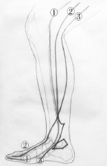 图14　肝脾肾经巡行路线

注：①为脾经、②为肝经、③为肾经。

足厥阴肝经循行（本经循行路线参考王居易之《经络医学概论》，与传统教材有所不同，见图14）：起于足大趾爪甲后丛毛处，沿足背向上至内踝前一寸处（中封穴），向上沿胫骨内缘，在内踝上三寸处交于小腿内侧正中线三阴交穴并行足太阴脾经之后沿小腿正中线直上（此为不同处），上行过膝内侧，沿大腿内侧中线进入阴毛中，绕阴器，至小腹，挟胃两旁，属肝，络胆，向上穿过膈肌，分布于胁肋部（可见胀痛），沿喉咙的后边，向上进入鼻咽部，上行连接目系出于额，上行与督脉会于头顶部。本经脉一分支从目系分出，下行于颊里，环绕在口唇的里边。又一分支从肝分出，穿过膈肌，向上注入肺，交于手太阴肺经。

本经腧穴主治肝胆病症、泌尿生殖系统、神经系统、眼科疾病和经脉所过部位的疾病。

如慢性肝炎、肝炎后综合征、胆道疾病、慢性胃炎等疾患。

如头晕、癫痫、肢体麻木、手足抽搐、面肌痉挛。

如遗精、月经不调、白带异常、疝气、遗尿、小便不利。

如青光眼、假性近视、结膜炎等。

如胸胁痛、腹胀、少腹痛、下肢痹痛等症。

(5)肾：肾藏精（可增强生殖能力、可提升整体精力），肾主水（可治水肿、可补水），肾主纳气（可增加呼吸功能），肾主骨、生髓、通脑、齿为骨之余（可治骨、髓、脑、齿之病变）。其华在发（可固发），肾开窍于耳和前后二阴（可增加听力、可通二便），恐为肾志（可提升胆量、战胜恐惧），唾为肾液（可治唾液分泌不足）。

足少阴肾经：本经腧穴主要治疗妇科、前阴、肾、肺、咽喉病证以及经脉循行部位的病症。如月经不调、阴挺、闭经、阳痿遗精；肾炎、水肿，腰膝酸痛、足跟痛、消化不良、五更泄、喘促、咽痛等。

足少阴肾经循行：起于足小趾下，斜行于足心（涌泉穴）出行于舟状骨粗隆之下，沿内踝后缘，分出进入足跟，向上沿小腿内侧后缘，至腘内侧，上股内侧后缘入脊内（长强穴），穿过脊柱，属肾，络膀胱。本经脉直行于腹腔内，从肾上行，穿过肝和膈肌，进入肺，沿喉咙，到舌根两旁。本经脉一分支从肺中分出，络心，注于胸中，交于手厥阴心包经。

#### 2　从六腑的生理功能及其经络的循行路径去认识经穴的作用

(1)胆：贮藏和排泄胆汁（可治胆病），胆主决断（选择困难症）。

足少阳胆经：本经腧穴主要治疗肝胆病，寒热，耳鸣、耳聋，口苦，胁肋胀满或作痛，偏头痛，喉痛，外眼角痛，颈及锁骨上窝肿痛，颈项强直，带状疱疹，腋下淋巴结肿大，股、膝、小腿外侧疼痛及第四足趾运动障碍。

足少阳胆经循行：起于眼外角（瞳子穴），向上达额角部，下行至耳后（风池穴），由颈侧，经肩，进入锁骨上窝。直行脉再走到腋下，沿胸腹侧面，在髋关节与眼外角支脉会合，然后沿下肢外侧中线下行。经外踝前，沿足背到足第四趾外侧端（窍阴穴）。有三分支：一支从耳（风池穴）穿过耳中，经耳前到眼角外；一支从外眼角分出，下走大迎穴，与手少阳三焦经会合于目眶下，下经颊车和颈部进入锁骨上窝，继续下行胸中，穿过膈肌，络肝属胆，沿胁肋到耻骨上缘阴毛边际（气冲穴），横入髋关节（环跳穴）；一支从足背（临泣穴）分出，沿第1～2跖骨间到大踇趾甲后（大敦穴），交与足厥阴肝经。

(2)胃：胃主受纳和腐熟水谷（可增强食欲，提升全身气血水平），胃气主降（可治气上冲、胃胀、大便不降），胃喜润恶燥（需要保持阴液）。

足阳明胃经循行：起于鼻翼旁（迎香穴），挟鼻上行，左右侧交会于鼻根部，旁行入目内眦，与足太阳经相交，向下沿鼻柱外侧，入上齿中，还出，挟口两旁，环绕嘴唇，在颏唇沟承浆穴处左右相交，退回沿下颌骨后下缘到大迎穴处，沿下颌角上行过耳前，经过上关穴（客主人），沿发际，至额前（络入脑）。

本经脉分支从大迎穴前方下行到人迎穴，沿喉咙向下后行至大椎，折向前行，入缺盆，下行穿过膈肌，属胃，络脾。直行向下一支是从缺盆出体表（靠近甲状腺），沿乳中线下行，挟脐两旁（旁开二寸）（平脐直下则路过生殖系统），下行至腹股沟外的气街穴。本经脉又一分支从胃下口幽门处分出，沿腹腔内下行到气街穴，与直行之脉会合，而后下行大腿前侧，至膝膑沿下肢胫骨前缘下行至足背，入足第二趾外侧端（厉兑穴）。本经脉另一分支从膝下三寸处（足三里穴）分出，下行入中趾外侧端。又一分支从足背上冲阳穴分出，前行入足大趾内侧端（隐白穴），交于足太阴脾经。

本经腧穴主要治疗除治脾胃病（肠鸣腹胀，腹痛，胃痛，腹水，呕吐或消谷善饥，口渴）外，还能治鼻、目、齿、口唇、耳、额、大脑（癔症、抑郁症、发狂）、喉咙、甲状腺、乳房、膈肌、生殖系统、胸部及膝髌等本经循行部位疼痛。

(3)小肠：主受盛和化物（助消化吸收、提升全身气血水平），分别清浊（除湿，可滋阴血、乳汁）。

本经腧穴主要治疗头、项、耳、目、咽喉病，热病，神志病及经脉循行部位的其他病证。

如消化不良、腹泻、便秘、腹胀、胃肠功能紊乱等。小肠经与心经相表里，也可治疗心脏疾病。小肠主液，其经循颈，心经有热可移热于小肠，可治疗乳汁少、咽喉痛、口生疮、小便赤。

手太阳小肠循行：经自手小指尺侧端（少泽穴）起始，沿手掌尺侧缘上行，出尺骨茎突，沿前臂后尺侧直上，出尺骨鹰嘴和肱骨内上踝之间（小海穴），向上沿上臂后内侧，出行到肩关节后面，绕行肩胛，在大椎穴与督脉相会，向前进入缺盆（锁骨上窝），深入体腔，联络心，沿着食道下行，贯穿膈肌，到达胃部，入属小肠。它的分支，从锁骨上窝沿颈上颊，到外眼角，折回来进入耳中（听宫穴）。另一条支脉，从面颊部分出，行至眶下，到达鼻根部的内眼角，然后斜行到颧部（颧髎穴）。脉气由此与足太阳膀胱经相接。

(4)大肠：传化糟粕（改善大便性状、助排便），大肠主津（可滋汗源）。

本经腧穴主要治疗头面、五官、咽喉病，神志病，热病及经脉循行部位的其他病症。如肠炎、肠功能紊乱、便秘、腹胀。肺与大肠相表里，还可治疗皮肤病、鼻咽部疾病、气管炎、支气管炎等症。

手阳明大肠经循行：自食指桡侧端（商阳穴）起始，沿食指桡侧上行，出走于两骨（第一、二掌骨）之间，进入两筋（伸拇长、短肌腱）之中（阳溪穴），沿着前臂桡侧，向上进入肘弯外侧（曲池穴），再沿上臂后边外侧上行，至肩部（肩髃穴），向后与督脉在大椎穴处相会，然后向前进入锁骨上窝，联络肺脏，向下贯穿膈肌，入属大肠。它的支脉，从锁骨上窝走向颈部，通过面颊，进入下齿中，回过来挟着口唇两旁，在人中处左右交叉，上挟鼻孔两旁（迎香穴）。脉气由此与足阳明胃经相接。

(5)膀胱：贮存和排泄尿液（可治尿频、尿急、尿痛、尿潴留、肾盂肾炎、夜尿症、尿失禁等）。

根据其经脉循行路径可知本经腧穴主要治疗头、项强痛，眼痛多泪、鼻塞、流涕、鼻血、痔疮、疟疾，经脉所过的背、腰、骶、大腿后侧、腘窝、腓肠肌等处疼痛，足小趾不能运用。

足太阳膀胱经循行：起始于内眼角，向上过额部，与督脉交会于头顶。其支脉，从头顶分出到耳上角。其直行经脉，从头顶入颅内络脑，再浅出沿枕项部下行，沿肩胛内侧脊柱两旁下行到达腰部，进入脊旁肌肉，入内络于肾，属于膀胱。一支脉从腰中分出，向下夹脊旁，通过臀部，进入腘窝中；一支脉从左右肩脾内侧分别下行，穿过脊旁肌肉，经过髋关节部，沿大腿外侧后缘下行，会合于腘窝内，向下通过腓肠肌，出外踝的后方，沿第5跖骨粗隆，至小趾的外侧末端。

(6)三焦：通行元气（可治火郁证），总司人体气化（调整全身脏腑功能），运行水液（代谢痰湿）。

本经腧穴主要治疗头侧部、耳、目、咽喉、胸胁病，热病及经脉循行部位的其他病证。

手少阳三焦经循行：起于无名指尺侧末端，向上经小指与无名指之间、手腕背侧，上达前臂外侧，沿桡骨和尺骨之间，过肘尖，沿上臂外侧上行至肩部，交出足少阳经之后，进入缺盆部，分布于胸中，散络于心包，向下通过横膈，从胸至腹，依次属上、中、下三焦。其支脉，从胸中分出，进入缺盆部，上行经颈项旁，经耳后直上出于耳上方，再下行至面颊部，到达眼眶下部。另一支脉，从耳后分出，进入耳中，再浅出到耳前，经上关、面颊到目外眦。

#### 3　奇恒之腑病变后的选穴方向

不同于六腑的六个器官的总称，包括脑、髓、骨、脉、胆、女子胞。其中脑、髓、骨由肾所主宰，脉由心主宰，胆为六腑之一，而女子胞就其生理功能而言，主月经、孕育胎儿，靠肝、脾、肾所主，故选穴可参考以上脏腑相关经穴。

#### 4　奇经八脉病变后的选穴方向

为任脉、督脉、冲脉、带脉、阴蹻脉、阳蹻脉、阴维脉、阳维脉的总称。它们与十二正经不同，既不直属脏腑，又无表里配合关系，其循行别道奇行，故称奇经。

其功能有：沟通十二经脉之间的联系；调节十二经气血的蓄积渗灌等作用。

任脉：行于腹面正中线，其脉多次与手足三阴及阴维脉交会，能总任一身之阴经，故称“阴脉之海”。任脉起于胞中，与女子妊娠有关，故有“任主胞胎”之说。主治病症：疝气、带下、腹中结块等。

督脉：行于背部正中，其脉多次与手足三阳经及阳维脉交会，能总督一身之阳经，故称为“阳脉之海”。督脉行于脊里，上行入脑，并从脊里分出属肾，它与脑、脊髓、肾又有密切联系。

主治病症：脊柱强痛，角弓反张等症。

冲脉：上至于头，下至于足，贯穿全身；成为气血的要冲，能调节十二经气血，故称“十二经脉之海”，又称“血海”。与妇女的月经有关。主治病症：腹部气逆而拘急。

带脉：起于季胁，斜向下行到带脉穴，绕身一周，如腰带，能约束纵行的诸脉。主治病症：腹满，腰部觉冷如坐水中。

阴蹻脉、阳蹻脉：跷，有轻健跷捷之意。有濡养眼目、司眼睑开合和下肢运动的功能。阴蹻脉主治病症：入睡困难、癃闭，足内翻等。阳蹻脉主治病症：多寐思睡，目痛，足外翻等。

阴维脉、阳维脉：维，有维系之意。阴维脉的功能是“维络诸阴”，主治病症：心痛，忧郁等。阳维脉的功能是“维络诸阳”，主治病症：恶寒发热，腰疼等。

八脉除任督二脉有自己的经穴之外，其余六脉并无自有经穴，不过有八脉交会穴各通一奇经，可调节八脉之生理功能。

脾经的公孙（通冲脉）、心包经的内关（通阴维脉）、小肠经的后溪（通督脉）、膀胱经的申脉（通阳蹻脉）、胆经的足临泣（通带脉）、三焦经的外关（通阳维脉）、肺经的列缺（通任脉）、肾经的照海（通阴蹻脉）。这些穴位临床上常配合应用，如公孙配内关治心、胸和胃部疾患，后溪配申脉治目内眦、颈项、耳、肩膀、小肠、膀胱部疾患，临泣配外关治目外眦、耳后、颊、颈、肩、胸膈部疾患，列缺配照海治咽喉、胸膈部疾患。

另历来有“八脉隶属于肝肾”又有“肝肾同源”说法，从临床角度看，也确实如此，故要调理八脉的功能，最根本还是要调整肾之阴阳，反过来说，“八脉”本身也能调理先天之肾。

其中任督二脉，最能调补先天之本，要熟练运用此二脉之经穴，任督二脉之经穴也常常是出奇制胜的法宝。

除此之外，临床还可以参考《彭注痈疽神妙灸经》的选穴方法。彭注所选之穴，在笔者看来，其实不仅仅只治痈疽，根据前文脏腑经络的功能，亦可治各科杂病。他针对不同痈疽所在的位置归经分经取穴，基本上是按经取穴施灸，括号内为其所选经穴或经外奇穴，有少部分是取表里经或同名经。

肺经：胃痈、胃疽（曲池）、肺痈（合谷、肾俞）。

大肠经：蜂窠疽（三间）、乳痈（足三里、肩髃）、颧疔（偏历）。

脾经：胁痈（冲门）、阴疽（商丘）、腹痈（箕门）、鱼口疽（大敦）、鹤膝风（三阴交、膝顶）、穿骨疽（大敦）。

胃经：发疽、牙痈（神授穴）、发疽（缺盆、伏兔）、唇疽（犊鼻）、牙疽（足外踝尖）、气毒流注（梁丘）。

心包经：胸疽（郄门）、肘痈（间使）、蛇头疔（内关）、鱼肚（合谷）、骨疽（合谷）、注节疔（合谷）、今疔（内关、间使）。

三焦经：鱼腮（四渎）、瘭（天井）、肩疽（会宗）、髎疽（会宗）、乐疽（腋门）、石榴疽（天井）。

心经：喉痈（少冲）、气痈（灵道）、臑疽（少海）、腋疽（少海）、穿骨疽（神门）、兑疽（神门）、喉风喉闭（少商、少冲）、喉毒悬痈（心俞）。

小肠经：侵脑（支正）、凤眉（阳谷）、黑疔（后溪）、鼻疔（腕骨）、项疽（天宗）、肩风（肩贞）、马口疮（掌后五寸半）。

肝经：咬骨疽（阴包）、透脑疽（膝关）、阴疽（中都）、玄疽（蠡沟）、裆疽（三阴交）、气癖（章门）、坐马痈（膝下外廉横骨尽处）。

胆经：马刀（剑巨穴）、挟瘿（肘尖）、瘰疬（金门、肩尖）、渊疽（阳陵泉）、附骨疽（悬钟）、鹤膝风（膝眼）。

肾经：心口疽（阴谷）、幽痈（筑宾）、赫痈（阴谷、筑宾）。

膀胱经：玉枕（风门）、发疽（心俞）、背疽（骑竹、马穴、委阳）、搭手（会阳）、肾痹（合阳）、阴疽（昆仑）。

任脉：虎须毒（直鼻上入发际七寸）、龙泉毒（百会直鼻上入发际五寸半）。

督脉：对口疽（神关）。

### 腧穴所在，主治所在

此为最常用、最实在之方法，因为穴位就在病变脏腑之附近，即可就近产生治疗作用。

#### 1　脏病多找背俞穴

背俞穴均在膀胱经背部第一线上，为双穴，也是施灸的最常用的穴位。背俞穴与脏腑有特殊联系，在临床上最能反映五脏六腑的虚实盛衰。当背俞穴局部出现各种异常反映，如结节、陷下、条索状物、压痛、过敏、出血点等变化时，往往反映相关脏腑的异常功能。因此，背俞穴对脏腑病症也有良好的治疗作用。

- 肺俞：宣肺理气、滋阴清热、疏经活络、祛风止痒，主治咳嗽、气喘、咯血、骨蒸潮热、盗汗等病症。
- 厥阴俞：疏通心脉、宽胸理气，主治心绞痛、心律不齐、胸痛、咳嗽、神经衰弱、呕吐、胃炎等病症。
- 心俞：宁心安神、宽胸理气、滋阴降火，主治心痛、惊悸、失眠、健忘、癫痫、咳嗽、吐血等病症。
- 肝俞：疏肝利胆、清肝明目、息风定志、活血止痉，主治黄疸、胸胁胀痛、目疾、背脊痛等病症。
- 胆俞：疏肝利胆、养阴补虚，主治黄疸、口苦、胁肋痛、肺痨、潮热病症。
- 脾俞：健脾利湿、舒筋活络，主治腹胀、腹泻、呕吐、痢疾、便血、背痛等病症。
- 胃俞：健脾和胃，主治胃脘痛、呕吐、腹胀、肠鸣、背痛等病症。
- 三焦俞：调三焦、利水道、益元气、强腰膝，主治水肿、小便不利、遗尿、腹水、肠鸣泄泻等病症。
- 肾俞：补肾填精，主治腰痛、遗尿、遗精、阳痿、月经不调、带下、耳鸣、耳聋等病症。
- 大肠俞：疏经活络、通调肠腑，主治腰腿痛、腹胀、腹泻、便秘等病症。
- 小肠俞：清热利湿、通调二便，主治痢疾、泄泻、疝气、痔疾等病症。
- 膀胱俞：通调膀胱、疏经活络、清热利湿，主治小便不利、遗尿、腰骶痛、腹泻、便秘等病症。

#### 2　腑病多找募穴

募穴之分布，有在本经者，有在他经者；有呈双穴者，有为单穴者。有肺脏中府穴，胆脏日月穴，肾脏京门穴，肝脏期门穴，脾脏章门穴，胃经的有大肠脏募天枢穴，以上均为双穴。其余都分布于任脉，有心包募膻中穴，心募巨阙穴，胃募中脘穴，三焦募石门穴，小肠募关元穴，膀胱募中极穴，以上均为单穴。六腑病证多取募穴治疗。如胃病多取中脘，大肠病多取天枢，膀胱病多取中极等。

脏腑之气与俞募穴是相互贯通的。因此，募穴主治性能与背俞穴有共同之处。募穴可以单独使用，也可与背俞穴配合使用，即谓之“俞募配穴”。同时俞募二穴也可相互诊察病证，作为协助诊断的一种方法。所谓“审募而察俞，察俞而诊募”。

对于肢体的痛证而言，局部选穴显得尤其重要，肩受凉，直接肩上灸；膝痛，直接膝上灸；踝扭伤，直接踝上灸……可以说，就是哪痛灸哪。可千万不要小看这种简单直接的选穴方法，往往能见到奇效。

## 常见疾病及症状的取穴经验

本文配穴虽然讲的是直接米粒灸，但要求不起疱不发疮，尤其是面部（易毁容）、关节处（影响关节功能）、关元（内裤边缘磨擦）、三阴交（裤脚磨擦）、足部穴位（鞋袜磨擦）等部位。

### 一　外感

**发热**。发热一般不施灸，但若属风寒外感，有畏寒添衣、头紧痛、打喷嚏、流清涕、咳白稀痰、口淡（无咽痛）症状的，可以灸风池、大椎、风门、肺俞。

但若是发热，又伴怕热，并伴多汗、鼻孔呼气热、咽痛、头胀痛、口黏、流浓浊涕、咯黄痰等湿热症状，一定要慎灸，真要灸，最好也要综合应用各疗法。如灸，可选用大椎、曲池、孔最、中脘、天枢，必须同时配合服用甘露消毒丹清内热，才能更好地发挥出灸法透热的功效，多半灸后就会出一身黏汗，但笔者仍然坚持需慎灸。

**咳嗽**。若有明确的着凉史，轻症咯白痰，灸大椎、风门、肺俞，小儿灸一个身柱即可，多半灸两三次即好。若是兼食积内伤，尤其是吃多了水果、雪糕之类，必须加灸一个中脘才行。至于咳黄痰者，灸大椎、曲池、尺泽下一横指、王氏列缺。咽痒，加灸天突。

### 二　内伤杂病

**中风**。人在中风之前的一到四个月，常有先兆，如突然想说的话说不出来、拿的筷子突然掉落、一侧身子发麻、足胫处发酸、沉重、麻木等，可以灸足三里、上巨虚、下巨虚、绝骨，三五天灸一次，坚持两三个月，可预防中风。

一旦发现中风昏迷不省人事、喉咙有痰，应先扎十个手指尖（十宣穴）放血，之后再施灸。选穴如下：百会、风池、大椎、肩井、肩髃、曲池、间使、环跳、足三里、绝骨，连灸数日，待病情稳定下来，再研究长治之法。

中风后遗症，可长期坚持灸百会、大椎、肾俞、肩髃、曲池、手三里、风市、膝眼、足三里、绝骨。

笔者父亲几年前发现有腔隙性脑梗死，无明显症状，就是失前忘后，脾气变得更加古怪暴躁，2022年开始坚持每周灸百会、大椎、中脘、关元、足三里等穴，精神越来越好，连飞蚊症都几乎消失了。

另外，中风后大小便失禁、手掌张开、口张流涎、手脚冰凉者，宜隔盐多灸神阙，尚有一线生机。

2022年10月，一位学员向我求助，其年届七十的母亲，进入轻度昏迷状态已月余。既往2016年有中风史，出院后，曾悬灸月余，恢复到可以独自坐起，并自行移位到轮椅上，但因太胖，并没有做过太多康复治疗，后长期卧床。久卧伤气，五脏逐渐虚损，直至月前变成轻度昏迷，10月17日叫名眼睛不睁，但是可见眼球在动，不能说话，不太张嘴。10月18日令学员灸百会、中脘，并无反应，改为隔盐灸神阙，艾炷做成宝塔状、如指头大，灸了大概三四壮后，患者出了一大口气，同时喂服人参煮的水，再接着施灸神阙穴，大概三十壮时，叫她可有回应“嗯”，并可睁开眼睛。

在接下来的数日，仍然施灸神阙穴，总共施灸两百余壮，其间睁开眼的时间增加，学员说在这一周的时间中，母亲已经在生死边缘，期望能够有多一点的清醒时间来交流。施灸后，她能有一些清醒的时间，并且记起了很久没见到的人，虽不能言语，但可以用活动眼球表达，也算完成了心愿。虽然未能挽回生命，但也算做到了临终关怀。

**哮喘**。我常灸两组，一组为背部定喘、肺俞、膈俞，另一组为腹部不容、梁门、太乙、巨阙、中脘、下脘、关元。两组轮流施灸，均可加灸足三里、太溪。需要坚持半年至两年以上，方有断根之可能，其间还须忌口。

**肺结核**。第一日可灸大椎、风门，第二日灸肺俞、膏肓，第三日灸膈俞、胆俞，第四日灸中脘、足三里，第五日又灸大椎、风门，如此轮回。其间若是口干，多吃百合，可煮粥、炒菜或煲成糖水。

**心慌、心悸、心痛**。若是烦躁易怒之实证，可于厥阴俞、心俞、巨阙、间使、内关处用小刮痧板或汤匙刮痧，不要求出痧，只求刮到酸胀感即可，刮二三十次后，再于五穴施灸。若是疲劳乏力之虚证，上五穴可直接施灸，再加灸中脘、关元、足三里。二尖瓣、三尖瓣反流者，也可照此方法施灸。

**入睡困难**。常见病机为阳不入阴，可灸百会、膏肓、膈俞、脾俞、神门、三阴交、王氏照海。王氏照海在内踝尖直下赤白肉际处，其为阴蹻脉主穴，文献记载灸后能令多睡之人清醒，可笔者实际经验是灸后令人犯困思睡，故灸照海之后尽量不要开车，或不做需要集中精神的工作。

**好卧思睡**。最常见于加班族和作业多的学生群体，晚上睡不着，白天不想起，精神恍惚，可灸百会、大椎、肝俞、肾俞、中脘、关元、王氏申脉。王氏申脉，在外踝尖直下赤白肉际之处，此穴不要多灸，只灸一两壮即可，最好是在早上灸，若晚上灸，可令人睡眠变浅，整晚似睡非睡，但次日精神并不会变差。

**郁证**。是指由于情志不舒、气机郁滞所致，以心情抑郁、情绪不宁、胸部满闷、胸胁胀痛，或易怒易哭，或咽中如有异物梗塞等为主要临床表现的一类病证，心情抑郁宜灸百会、大椎、膏肓、中脘、通里、间使、足三里，尤其百会有安神作用，其他配穴可催生气血，气血一旦旺盛，不良情绪一扫而空；咽中异物感，多是冲脉之气上逆，宜灸廉泉、天突、内关、中脘、公孙。

**癫狂**。癫病以精神抑郁、表情淡漠、沉默痴呆、语无伦次、静而多喜为特征；狂病以精神亢奋、狂躁不安、喧扰不宁、骂詈毁物、动而多怒为特征。癫病用百会、大椎、身柱、中脘、关元、足三里；狂病用百会、中脘、曲池、三间、二间、少商、足三里、厉兑、隐白。

**痫病**。常突然倒地，口吐涎沫，手足痉挛，口里发出猪、羊的叫声。也有只表现为腹痛者，或轻微翻眼、手足痉挛。很多这类患者在感冒后就会诱发此症，因此平时要避风，此病归根结底还是神经系统发育不良或退化，要调的是脑，最好是通过任督二脉来调。可选百会、身柱、筋缩、命门、腰奇、巨阙、中脘、关元、足三里、涌泉。不必一次性全选以上穴位，可交替选三五个穴，每穴三到五壮，三到五天灸一次，坚持三年。初灸三个月，精神面貌就有所改善，发作后恢复起来会快一点。

**痴呆**。其病发生多缓慢隐匿，记忆力减退是主要的核心症状。早期出现近记忆障碍，学习新事物的能力明显减退，严重者甚至找不到回家的路。随着病情的进一步发展，远记忆也受损。思维缓慢、贫乏，对一般事物的理解力和判断力越来越差，注意力日渐受损，可出现时间、地点和人物定向障碍，有时出现不能写字，不能识别人物。米粒灸可改善患者的精神状态，可长期坚持施灸百会、大椎、膏肓、脾俞、肾俞、中脘、关元、足三里。

**呕吐、反酸、嗳气、胃痛、胃胀、腹痛、腹泻**。只要是由于饮食或感染造成，无论寒热，均可灸内关、中脘、足三里，症状缓解之后，只灸中脘、足三里即可巩固。常灸中脘、足三里后，原来不能吃寒性食物，可变成能吃；原不能吃热性食物，亦变成可吃，寒热不忌，胃口大开。

**胃下垂**。注意饭要只吃七八分饱，常灸百会、大椎、胃俞、中脘、足三里。

**大便干结**。灸支沟、章门、天枢、关元、阳陵泉、照海，选两三个穴，轮流施灸，若大便干结不通伴便血且浑身燥热，可配合服用一清胶囊继续施灸，坚持两三个月可有改善。

**肛门风**。粪汁不自知漏于裤裆上，灸内外犊鼻。

**痔疮**。灸二白、孔最、命门及其旁开一寸处、承山，如能灸到长强则更好。

**脱肛**。灸百会、命门、长强，另隔盐灸神阙。

**胁痛**。部分有肝胆结石、脂肪肝的患者，可见于肝区闷痛，可选肝俞或胆俞、章门、足三里、阳陵泉，长期坚持，闷痛可逐渐消失。

**黄疸**。灸至阳、脾俞、胃俞、公孙。

**尿热、尿痛**。灸中极、至阴。

**漏尿、尿床**。在百会、身柱、命门、关元、中极、太溪中任取一两穴，轮流施灸，效果极佳。

**癃闭**。小便点滴难出，可灸大椎、气海、关元、中极、阴陵泉、三阴交。

**遗精、阳痿**。主选关元，长期施灸。配穴于百会、命门、肝俞、肾俞、大敦中选一二穴轮流施灸。

**眩晕**。无风不作眩，此风多由血虚阴虚而生；无痰不作眩，此痰多由脾虚不运继生之痰；无虚不作眩，此多由气血不荣于脑、骨髓不养于脑所致。风、痰、虚，这三个病机之中，以虚为本。百会，可止眩；关元、足三里补先后天；再加涌泉，引火下行。四穴配合，可有佳效。颤证治法雷同。

**水肿**。由心脏引起之水肿，宜灸大椎、膏肓、心俞、中脘、水分、关元、足三里；由肾脏引起之水肿，宜灸肾俞、命门、次髎、水分、中极、阴陵泉、三阴交。

**盗汗**。灸肺俞、膏肓、阴郄、后溪。其中阴郄止汗，常有奇效。

### 三　经络肢体病证类

**头痛**。需要分部位施灸，后头痛，灸后溪、昆仑、风池；偏头痛，灸率角、角孙、太阳、外关、足临泣；前额痛，灸中脘、曲池、合谷、足三里、内庭；头顶痛，灸涌泉；头重痛如有布包裹，灸大横、尺泽下一横指、阴陵泉；头痛如破（脑中如有无数刺针），遇劳累即发作，长期灸命门、关元，偶配太冲、丘墟。

**面痛**。先灸中渚、合谷、外关，面痛稍减，再灸下关、颊车、地仓、太阳，最后再灸曲池。

**肩臂痛、腋痛、肘痛、手痛**。取阿是穴，哪痛灸哪，灸后再灸风池、颈百劳、膈俞、肝俞，三天一次，坚持两周。如若灸治不愈，应该是气血两亏，不能养筋所致，改灸中脘、血海、足三里，慢慢收功。

**腰腿痛**。取肾俞、命门、关元俞、次髎、委中下两横指、太溪，三天一次，长期坚持，可慢慢收功。

**脚气病**。以两脚软弱无力，脚胫肿满强直，或虽不肿满而缓弱、麻木，甚至心胸悸动，进则危及生命为特征的一种疾病，灸足三里、三阴交、绝骨。

**落枕、颈椎病**。先灸王氏蠡沟，再灸阿是穴、风池、颈百劳、大杼、肩井，最后灸中脘、足三里、血海。

**足底痛**。灸命门、次髎、太溪、昆仑。

**脊柱痛**。灸大椎、陶道、身柱、神道、灵台、至阳、筋缩、中枢、脊中、悬枢、命门、腰阳关、次髎，每次选六七个穴，交替灸，两三天灸一次。

### 四　皮肤外科类

**癣**。可在圆癣正中施灸，如若不愈，可加灸肺俞、膈俞、曲池、血海、委中下两横指。

**疖肿**。直接在脓包上灸，痛灸至不痛，不痛灸至痛。再补灸身柱、曲池、二间、足三里、内庭。

**阴疮**。可直接在脓点上施灸，一般次日即可溃破。若常反复者，必须忌肥甘厚味。伴口苦易怒者，加灸大敦。

**湿疹**。局部选三四个点施灸，再灸尺泽下一横指、阴陵泉，或认清湿疹所在之经络，在相应经络上选一两穴施灸。

**荨麻疹**。选耳穴风溪，耳朵上的穴灸起来比较痛，艾炷要搓极细，但对荨麻疹效果好，再加灸耳尖，最后灸肺俞、膈俞、曲池、血海、委中下两横指。如果灸治不愈，宜补，改灸中脘、关元、足三里、三阴交。

**痤疮**。宜常灸中脘、曲池、筑宾。

**神经性皮炎（牛皮癣）、特应性皮炎**。于皮损处选数个点，隔三五日小艾炷灸一次，并常灸肺俞、膈俞、曲池、血海、委中，久久见功。三月不效，改灸肾俞、关元、太溪。

**疣、皮赘、鸡眼**。直径小于5mm的痣，可直接在病灶上施灸，效果极佳。

**手术疤痕作痛**。在痛处施灸即可。

**疝气**。于肾俞、次髎、神阙（隔盐灸）、三角灸穴、关元、足三里、大敦、独阴中选二三穴轮流施灸。

**肠痈（包含阑尾炎）**。灸曲池、手三里、足三里、内庭，又灸局部压痛处。条件允许时，辨证下可配合服用大黄牡丹汤。

**颌下或颈侧淋巴结肿痛**。可灸肩井、肘尖。

**撞伤血肿**。在血肿处先用血糖仪采血针刺数下，少量放血，放血后即可在肿处中心及边缘上下左右施灸，消肿止痛效果佳。

**小面积烫伤**。可擦姜汁止痛，或擦紫金膏，上半身烫伤配合灸曲池，下半身烫伤配合灸血海。

**冻疮**。常灸病灶处。

### 五　妇人病证类

**痛经**。先灸关元、血海，若不能止痛，则再灸足三里、涌泉。

**月经后期，总是错后**。可灸肾俞、次髎、关元、子宫、阴陵泉、三阴交。

**月经先期，总是提前**。若是有热，可灸曲池、内庭，或是虚寒，则灸足三里。

**闭经不来**。可灸次髎、关元、子宫、阴陵泉、地机、合谷、三阴交、独阴。

**月经崩漏**。若气虚下陷之崩漏，尤其体现在加班或家务操劳之后，可只灸足三里；若是心中有气未消，肝气横逆下迫胞宫而崩漏，可灸四关（合谷、太冲）、大敦。若是气虚兼肝郁化火，则以足三里补虚、四关疏肝，三穴同用。若是无法分辨证型，可选奇穴“断红”（位于手背部，当第2、3掌骨之间，指端下1寸，握拳取之），每日一次，每次灸三壮，连灸三日观察，若经血逐渐减少，则坚持至月经收净。

**外阴瘙痒或白带黄绿豆腐渣样**。以中极为主穴，可配合次髎、足三里、蠡沟。

**滑胎（总是自然流产）**。若未怀孕，常灸肾俞、关元、子宫、足三里；若是孕早期怕流产，可灸府舍、足三里。

**孕早期妊娠恶阻**。可灸内关、中脘、足三里，孕晚期慎灸。

**胎位不正**。灸至阴。

**难产**。先灸百会，再灸至阴，又合谷、三阴交、太冲、独阴。

**缺乳（奶水不足）**。若是气虚、乏力、胸闷、胸口如石压之气虚证，选用关元、少泽、足三里；若是口苦、胁闷、乳房胀而奶水少，选用膻中、乳根，灸之当即奶下。

**子宫下垂**。先灸百会，再灸中极，又灸带脉。

### 六　儿科病证类

**食积肚大（青蛙肚）**。常灸身柱、中脘，尤其中脘，可消食，可消大肚。

**发育缓慢**。常灸身柱、脾俞、肾俞，亦可与身柱、命门、中脘、足三里，两组交替。

**鸡胸**。灸膻中。

**龟背**。灸身柱、肺俞。

**夜间哭闹**。灸百会，或身柱、中脘。

### 七　五官苗窍类

**鼻塞、喷嚏、流涕**。无论清浊涕，轻症均可灸上星穴，上星穴有极佳的通鼻窍功效（对腺样体肥大也有效），可谓专病专穴，单灸上星不得缓解，可加灸身柱、曲池，若是虚证则加足三里，若有食积则加中脘。

**流鼻血**。灸上星，或囟会。囟会有“血见愁”之称，止鼻血效果极佳。另外，灸后可另取一团艾绒塞于鼻孔，艾绒本身止血效果亦佳。若是灸上星、囟会不能止鼻血，再灸少商即可。最后仍然要辨寒热虚实，若是实热宜多配灸曲池、二间、三间，若是虚寒宜多配灸中脘、足三里。

**鼻窦炎（伴前额痛）**。灸上星，坚持灸，可取得效果，热加中脘、曲池、二间、内庭，寒加中脘、关元、足三里。

**一切眼病**。可灸大骨空、小骨空，此为特效穴，机理不明。

**麦粒肿、霰粒肿**。灸耳尖，一天不溃破，则加灸中脘、后溪、曲池、三间、二间。若是经验丰富的医师，可在眼睑脓点处，用半粒粟米大艾炷施灸一两壮。

**眼干涩、眼痒、眼睑溃烂**。灸睛明、瞳子髎、大骨空、小骨空，若是虚证加灸肝俞、膈俞，若是实证加灸中脘、曲池。

**眼疲劳**。灸睛明、瞳子髎、肝俞、脾俞、足三里。

**新发近视、远视**。灸大骨空、小骨空、肝俞、脾俞、肾俞、命门，若是经验丰富者，可用小规格艾炷加灸瞳子髎、睛明，灸二穴后，整个眼球多半能感觉到热乎乎的放松。体热重加灸曲池，体寒加灸中脘、足三里。

**耳鸣、耳聋**。先灸百会，百会能开脑窍也通耳窍，再灸风池，又灸外关、足临泣，坚持一两周，不效，再加灸命门或肾俞，因肾开窍于耳，从根上治。

**脓耳**。先灸外关、液门、合谷、曲池止耳痛，再灸听会、翳风、颊车局部取效，再用细艾条悬灸耳孔10分钟。

**牙痛**。先灸二间、合谷、曲池，痛止之后，经验丰富者可在面部加灸颊车、下关、地仓。若是虚人牙痛，则只灸中脘、足三里、太溪，他处不灸。

**咽喉肿痛**。取大椎、曲池、合谷、商阳、少商，不效则改灸通里、照海。

**舌痛、味觉减退**。取通里、太白。

**口臭、口腔溃疡**。取中脘、曲池、二间、足三里，此症最常由食积引发，中脘有消食之功，起到釜底抽薪的作用，此病也常虚实夹杂，伴有咽干者多加照海，虚人则足三里壮数增加。

**唇风（唇炎）**。灸中脘、曲池、承浆、地仓，若不愈，改灸中脘、足三里。

**腮腺炎**。先灸液门、合谷、外关，再灸耳尖、角孙、率谷，待面部痛感稍轻，于肿处中心及颊车再灸三壮。

### 八　养生灸

**病后强身健体**，主穴有两组。一组为大椎、关元，交通任督，类似于龟鹿二仙胶，可补先天。一组为中脘、足三里，开胃增食，补后天，类似于香砂六君丸。两组同灸或轮流交替灸，先后天同调，于身有大补之作用。

**肺病保养**，常用大椎、肺俞、膏肓、膈俞。

**透热解毒**，可选手部曲池、外关、合谷及各经荥穴、井穴。
