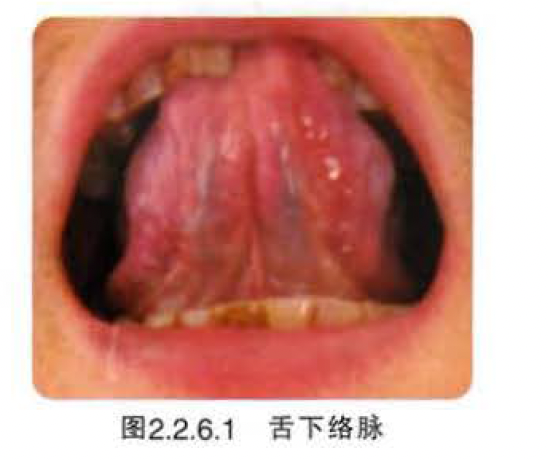
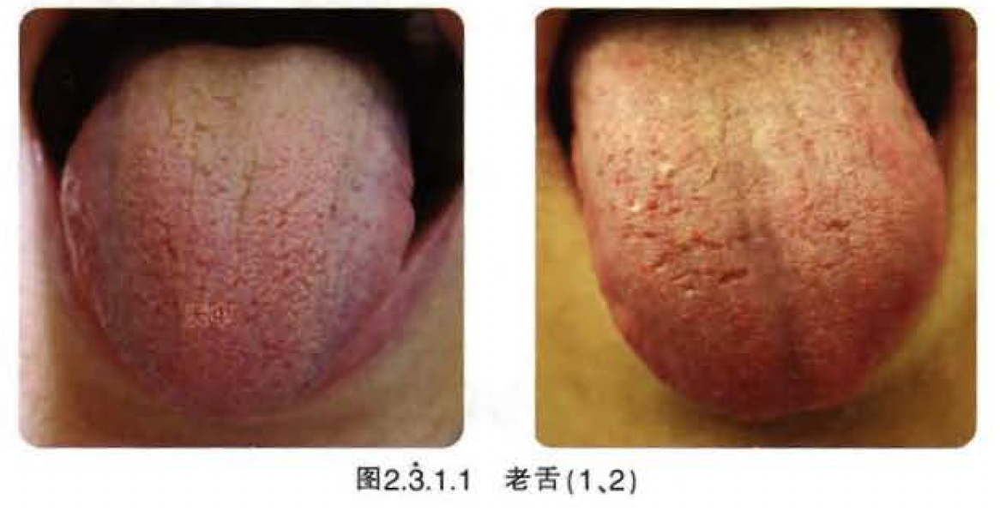

# 望舌质

## 舌神

### 荣舌

【舌象特征】舌质滋润，舌色红活鲜明，舌体运动灵活自如，有生气．有光彩。故亦称之为有神舌。

【临床意义】正气充足、气血津液充盈，生机旺盛健康的表现。虽病也是善候，预后较好。

### 枯舌

【舌象特征】舌质干枯死板僵滞．色泽晦暗枯涩，缺少血色，舌体活动不灵活。因已失去光泽．还无生气．故亦称之为“无神舌”。

【临床意义】脏腑精气、气血、津液枯竭的危重证候。缺乏生机，预后极差。

## 舌色

舌色的变化，是气血盛衰在舌上的一种表现。一般分淡红、淡白、红、绛、青紫等5种。

### 淡红舌

### 淡白舌

### 红舌

【临床意义】主热（实热、虚热）证。多因热盛．气血沸涌．舌络充盈：或因阴虚，虚火上炎。故舌色红赤或鲜红。红舌主实热与虚热的鉴别关键．在于苔之有无：红舌而有苔者，多为实热证；舌红少苔或无苔者，多属虚热证。舌色越红，提示热邪越重。

【相关舌象】常见的舌象：

1. 舌色稍红或仅见舌边尖红（图2.2.3.2），多见于外感风热表证初起。
2. 舌尖红赤，或生芒刺（图2.2.3.3) 多为心火上炎。
3. 舌两边红赤（图2.2.3.4），多为肝胆火盛。
4. 舌红、质干而有较厚苔者（图2.2.3.5) 多为实热证：在外感热病中出现多为邪热炽盛（邪在气分）的里热证；在内伤杂病见之，多为脏腑阳热亢盛。
5. 舌红苔黄腻者（图2.2.3.6），为里有湿热。
6. 舌色鲜红而少苔或无苔，少津（图2.2.3.7) 或有裂纹者多为阴虚内热。

### 绛舌

### 青紫舌

### 舌下络脉

## 舌形

### 老嫩舌

#### 老舌

#### 嫩舌

### 胖大舌

### 疫簿舌

### 点刺舌

### 裂纹舌

### 齿痕舌

## 舌态

### 痿软舌