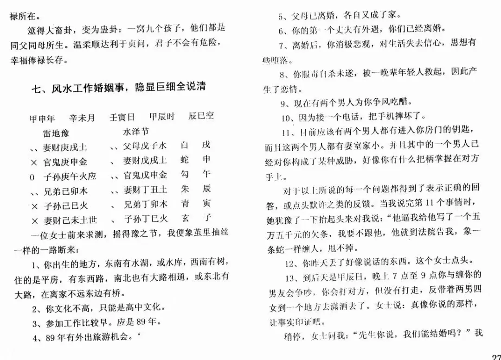

# 八字是最拉胯的术数，没有之一

八字是中国术数界的一朵奇葩。

它是术数这个非主流行当中的主流，自古以来，研习八字的人数都是最多的。传下来的书籍、经典也非常多。

然而八字虽然有着最大的名气，但同时也有着最拉胯的战斗力。

大部分的八字从业者都是敝帚自珍、一叶障目的货色；

辛辛苦苦研究了一辈子的八字，把那些经典书籍《渊海子平》、《滴天髓》、《三命通会》等捧到了天上去，可实战断命的水平，却着实令人不敢恭维。

八字作为一种推命术——一种能够推演一个人一生各个方面运势的技术，可大部分从业者用起来，却只能说上几句，讲几个有限的事。

无非就是说说你这个命是个贵/贱/贫/富之命，你容易二婚，会得痔疮等几个有限的点，然后就憋不出来了。

要不然就是做一大堆理论分析，你这个命调候如何格局怎样喜什么忌什么，断命断的如空中楼阁，说的全是空话，就是没有实断。

这也不怪广大八字从业者，因为自古以来搞八字的都是这个德行。

我们来看看，八字界那些鼎鼎大名的古书中记载的案例是怎样的：

> 《渊海子平》
>
> 戊寅 癸亥 丙申 戊子
>
> 王镇抚此格，杀神太重，喜行东方运。身衰八字，水多火微，独喜寅宫火旺，乃是一年之火，运行卯合戌火局，何益？又系湿木，不生无焰火，则木自旺不能生火；譬如横水木于围炉之上，此火纵悍力，亦无由得盛。是以寅运丁卯运中而死，即六丙生人亥子多。

> 《滴天髓》
>
> 庚申 庚辰 戊辰 戊午　
>
> 董中堂造，日干戊土，生于季春午时，似乎旺相，第春时虚土，非比六九月之实也。且两辰蓄水为湿，足以泄火生金，干透两庚，支会申辰，日主过泄，用神必在午火。喜水木不见，日主印绶不伤，精神旺足，纯粹中和。一生宦海无波，三十余年太平相业，直至子运会水局不禄，寿已八旬矣。　

> 《子平真诠》
>
> 丁丑 壬寅 己巳 丙寅
>
> 范太傅命，支具巳丑，会金伤官，丙丁解之，透壬岂非破格？却不知丙丁并透，用一而足，以丁合壬而财去，以丙制伤而官清，无情而愈有情。”

这些案例讲的怎么样呢？

假如你没有学过大六壬、或者是易隐派的六爻，那么你有可能是品不出什么味来的。

因为其他的术数，像梅花易数（不含易象高手的梅花术）、奇门遁甲、常规的六爻等等，古书上记载的案例，也比八字好不到哪里去，因为大家都是差不多拉胯。

但是，如果你学过大六壬，你就会发现，这些古籍记载的案例，似乎还正和八字的很不一样。

我们找个《一字诀玉连环》的案例：

> 三传子寅辰，将白虎、玄武、天后，来意主人出外，东南上干财。因一姓崔人成合交易，其人内怀欺诈，终不敢发。又有一属狗人姓王欲相侵害，终而自解。

再看《大六壬断案》中记载的邵公断卦案例：

> 邵先生曰：干支皆受上神来生，利宅不利人。
>
> 干上发用归传支，末传亥脱今日之干而生今日之支，因充役费用，又与姓陈吏人不和，尊长末后为儿娶妇，所费尽坏家计；
>
> 十一年间阴人守寡，是时家产四分矣。
>
> 张九翁果先好，后因充役，大有所费；又为妻叔与陈姓吏人作鬼，因来动店内物，却乃争讼；后二年又与子娶妇，倍陪女家；后五年因弟有事，遂作四分分也。

大六壬的课例，和八字古籍上记载的那些案例，最大的区别是什么？

就是大六壬的古例，说的全都是落到实处的实话，而八字案例讲的全都是和实际断事没有太多关联的虚话、套话、空话。

像渊海子平那个案例中，一共100多个分析的字，结果就一句落到实处的话：这人寅卯运丁卯年死了。

而且，大部分的命理古籍，讲的东西，大多都是华而不实。

譬如《渊海子平》搞了好多花里胡哨的格局，内十八格，外十八格，又是六乙鼠贵，又是飞天禄马等之类听起来很牛批的名字。

但问题是，你下功夫记住了这么多的格局，然后呢？

你能断出什么事？

入了这个格了，那这个人什么职业，哪年升官，哪年破财，什么时候结婚，老婆哪儿人，长什么样，啥时候离婚，这些东西怎么断？

你说这些东西有另外的断法——那我费那么大功夫背这么多格局有什么用呢？

就是在给客户算命的时候，给人说一句，你这命不错，是个六阴朝阳格，你喜行西方运，东南运也行，走北方运就不好了。

就为了说这么一句废话吗？

但客户要是问你：我喜行西方运，我走了西方运的话，我怎么喜，哪方面好，什么时候好，怎么好的；走北方运不好，怎么不好，啥时候不好，如何体现的？

这时候，恐怕你也说不出来个什么所以然。

讲到这里，有人可能会说：“大六壬本来就是占卜术中的王者，而且占卜本来就是用于看具体的事的，八字是算命，看的是大势，这两者是有区别的！”

我料到有很多人必会以此做借口，然而这个借口根本站不住脚，不仅站不住脚，而且以此做借口、会把八字的脸打的更是啪啪作响。

让我们有请能够与大六壬媲美的另一门占卜神技——“易隐派六爻”登场：

图中是一位易隐派六爻高人，用六壬为人测卦时所断。

仅仅通过一个六爻卦，此人断了十几件事情，件件都是落在了实处，没有一句含糊的套话。

并且，能够把这个人离了婚、离婚后服毒自杀未遂，被晚辈救起和晚辈谈恋爱、因为接一个电话摔坏了手机、后天晚上戌时会和男友吵架打架又出去潇洒等这些细节全部断了出来——仅仅是一个六爻卦而已，既能断过去的大事，有能断出精密无比的小事，这简直把八字这门学徒最多的算命术的脸给打烂了。

当然，八字作为传承这么久、研习人数最多的术数，虽然它的书房派经典、以及普传的技法，的确十分拉胯，但这并不意味着八字界就没有高人了。

譬如盲派的郝金阳、夏仲奇这样的大师，他们的水平就远远不是古代那些书房派、和只会用格局、衰旺的命理师们所能比的。

譬如夏仲奇有这样的一个命例：

> 坤造：己酉 甲戌 甲申 乙丑

夏仲奇断了这么几个事情：

> 她姐妹六个，她是老小；没读过什么书，16岁开始当小姐；
>
> 最近她在南方发了财，但这是一笔不义之财；
>
> 这个钱是一个男的偷来后转交给她，现在这个男的已经被抓了；
>
> 并且，这个男的现在把她供了出来，南方的公安来抓她了；
>
> 如果她去坐牢，会在禹城坐不超过四年的牢；

我们看夏仲奇老先生断的事，也全是句句落在实处，并且断事时没有模糊的两头堵，全是如同亲眼所见一样。

那么这就说明，其实八字也是可以像大六壬和易隐派六爻一样，能够非常厉害的。

但只是大部分人不会用，在市面上流行、普传的这些八字技法，压根就不好用，不能断出足够的细节。

在我没学大六壬之前，我一度以为八字就是这样的，它只能看个很模糊的大势，所以算八字时就是会出现很多这样也行、那样也可的情况。

但是学了大六壬之后，我才意识到，术数压根不是那样用的——既然术数发明出来就是为了预测未来，那就没有含糊和模棱两可的空间：能成就是能成，不成就一定是失败。

邵公用一个大六壬卦，能够断出几年，几十年后会发生的事情，并且还都应验了，那这就说明，所有的预测术，其真正的上限都比我们想象的要高很多，是堪比神通的。

并且，大六壬十分重视“象”，任何术数能够断出如同亲眼所见的细节，那就一定是因为从中取出了正确的象。

所以，虽然过去我努力学了好几年的八字，但一直都不得要领；

直到我开始学大六壬，我才一下子开窍了：什么格局衰旺调侯之类的，全都不重要。执着于分析那些没有意义，重要的是我要看到这个八字讲了那些事，发生了什么样的故事，于是从这时我的八字水平才真正登堂入室。

开始学习易隐派六爻，我的视野又被打开了一大截：我突然意识到，原来每一个流年，都可以是一个卦——四柱、大运、加流年，这六柱就是一个卦，当我把它当成一个卦来看时，我突然理解到了隐藏在过去、现在、和未来的来龙去脉，我理解了什么叫“见与不见之形”。

在丑年发生的事情，等到未年时结束了，因为未是冲丑的应期；

在丁X年认识的人，于第二年的X午月谈了恋爱，是由于干支的通根。

六爻这门术数中，有普通的流派，也有易隐派。

虽然大部分人学的都是普通的六爻，但不妨碍仍旧有极少数人会去学习并应用六爻的最高技法——易隐，并且易隐也是明白清楚的流传于世的。

然而八字这门术数，流传的却全部都是普通、平庸的技术。

八字真正的秘诀与核心，要么是秘而不传的、要么是声名不显的、要么就是如夏仲奇、郝金阳老先生一样，已经随着高人离世而无处可寻。

通过我学习大六壬和易隐派六爻的亲身经历来看，我认为：继续在已有的八字理论中钻研都是没有意义的。

因为我们必须承认“古代有名的命理大师们其实也比较拉胯”这个客观事实——我的意思是，也许古代也有像夏仲奇、邵彦和等一样厉害的高人，但他们的技术并没有传承下来，八字传承下来的技术，都是比较拉胯的。

承认了这个客观事实，我们就要尝试找到新的出路。

 我认为出路就在大六壬、易隐派六爻、以及奇门遁甲。（当然优先选择前两门，因为奇门遁甲这门技术的内部流派和争议太多了。）

这三门术数，能够极好的训练我们的取象思维，而且，占卜算的都是明确具体的事情， 我们通过练习算卦，具体的事情断的多了，那么慢慢的我们在看八字的时候，也就会敢于往深处看，敢于往细节断。

能够把八字用好的关键，我想就是不要仅仅把八字当成一门推命术来使用，而是在心态上，把八字也当成一种占卜术，敢于往细节去想，往具体的事件上去断，如此一来，我们的思路才能足够开阔——也才能够具备，将来有一天，可以把八字用的像夏仲奇那样厉害的潜力。