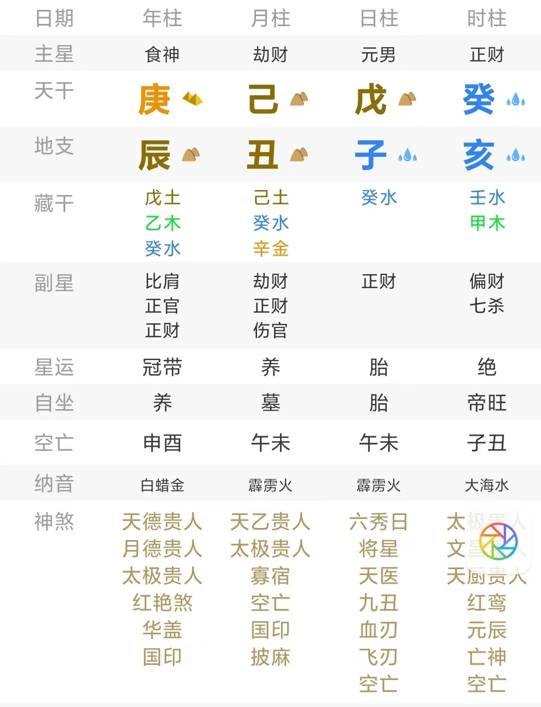

# 八字相同，命运的差别能够有多大？

之前我写了一篇[为什么八字相同，命运却不同？](http://mp.weixin.qq.com/s?__biz=MzI2NTAzOTQxMg==&mid=2651446879&idx=1&sn=3924ee18aa2b776e75fe1221d5b6174b&chksm=f15e0504c6298c12885d05a5231637464701b69b6ef2a5e5d998906821a121b432b132e9de03&scene=21#wechat_redirect)的文章。

此文发布后，收到很多人私下和我沟通了、他们和自己四同八字的人交流之后的结果。

确实同一个八字，会在职业、婚恋、人际关系方面，有着很多、很大的区别和偏差。

导致这种偏差的原因，在理法上是因为我之前所讲的：一个八字本身就对应着很多个命运剧本；

在现实的逻辑上，一个极为重要的影响因素，就是原生家庭。

原生家庭是一个在精神动力学中极其重要的概念。

美国的一个著名心理学家，艾瑞克·伯恩，就提出了一个叫做“人生脚本”的概念。

什么是人生脚本？

就是说一个人会在童年时期，由于受到父母、重要抚养者、和生活经验的强化的影响，会令一个人在无意识之中做出对自己一生的计划。

这个计划根植于我们的潜意识之中，也可以说这个计划本身就是我们人格结构的体现。

这个人生脚本就像一个故事一样，有开场、有剧情、有结局。

在你成年之后，看似你在很多不同的人生事件中挣扎着、努力着，但本质上，你可能只是在无意识的上演着自己在童年时期早就计划好的一切了。

譬如有一对兄弟，他们的母亲对他俩说：“你们的命运，就是一辈子都住在精神病院里。”

这句话被两兄弟的潜意识吸收，纳入了他们的人生脚本中，结果这两个兄弟，一个成了精神病，另一个成为了精神科医生——他俩的确一生都住在精神病院里了。

所以，表面上我们每个人看似都有很多的追求，都想要更好的生活，但在很多人的潜意识之中，在他童年时或许就形成了“我这辈子不配获得幸福”、“我这辈子只能做个底层人”的人生脚本；

而这样一种人生脚本，无疑会是阻碍他获得成就的最大阻碍。

当然这种人生脚本并不是绝对的一成不变的，它只是一个让我们意识到原生家庭对我们命运影响的重要性的佐证。

那么心理学的视角中，原生家庭影响命运是毫无疑问的；

但是在命理学的视角中，这一点又是如何体现的呢？让我们来举一个例子说明。

乾造：庚辰 己丑 戊子 癸亥

这个命主非常年轻，才22岁，找我说是想看一下事业。

排出这个八字之后，我一看就感觉很特别，因为这个人的命运剧本基本上只有两种，而且是有着天差地别的巨大区别——他要么少年早发，非常有钱，要么会很贫困，恐怕一生都要做体力活。

有了这个基本判断之后，我是这么给他说的：

我说你这个命，受到原生家庭的影响非常非常重大，可以说，如果你的父母有点钱，或者哪怕他们没钱、但是能对你比较关心、比较好的话，那么你一定可以发财，而且你现在已经发财了。

你就会是一个天生的商人，从小你就很精明，很擅长找机会。

你现在这个年龄应该在上大学还没毕业，但是我敢说你应该上大学期间就尝试过自己创业赚钱，特别是2021年，你具体做什么事不好说，但是只要你去做了，你从21年到现在，应该一直都在赚钱，而且赚的比很多上班族还要多的多。

但是如果你原生家庭的物质条件不好，或者你父母对你不关心的话，那么你就会比较的悲惨。

因为我感觉你的原生家庭要么给你挺大的帮助，要么只会趴你身上吸血，基本上没有中间状态。

如果是这种情况的话，你就会有点心理问题，求学也不顺，因为你容易学不进去，或者是外在的原因让你的学业很波折，最差的情况是你可能会因为和别人打架而辍学。

你的事业的话，我觉得你可能要从事偏于体力劳动性质的工作，好点的话可以做健身教练、但我觉得应该更多是偏于销售的那种，差一点的话，可能就是重体力劳动性质的了。

结果对方给我反馈的是，他是第二种状态。

没有上大学，高三没有读完，现在的确是在做重体力劳动的工作，也一直有些被原生家庭拖累。

那么为什么一个八字我会给出这两种天差地别的判断呢？

因为这个八字实在是太典型了：

我们看八字，首先要看命主追求什么，得到了什么，怎么得到的。

命主从年支辰土、月令丑土当中，透了个癸水财星过来，戊癸合，日干直接和这个财星相合，说明这个财就是命主最想要的东西；

癸水财星就代表金钱、代表工作。

所以，庚辰和己丑，就是命主财星的来源，代表命主的工作单位、也代表命主的父母；

财为养命之源，送给我养命的东西的，自然是我的父母；

所以，庚辰就是母亲，己丑就是父亲，丑辰破，就是丑土破开辰土这个命主母亲的肚子，把命主生了出来；

父母直接把财送到了我身上，这自然是很好很好的事，代表我很轻松、很轻易的就得到了癸水这个财星；

因此，这个命可以是个很好的命，他可以是一个富二代，很轻松的就从父母那里得到了钱财、得到了工作——甚至是老婆也可以是父母给安排介绍的，也不用自己找。

命主坐下是子水正财，子丑合、子辰合，就是说他可以用坐下这个子水作为工具，来追求、来得到丑土这个食伤库、也是银行、也是金库；得到辰土这个财库、还是一个头上顶着个庚金食神的超大财库。

这个人和“财”的缘分太深了，他追求的、得到的就是钱，而且还都是大钱。

所以从这个视角看，这个八字简直是哪哪儿都好，也因此出现了我描述的第一种命运剧本。

但是既然这么好、怎么还会有第二种那么差的命运呢？

这在本质上，就是因为合的关系是相互的，子要合丑、丑也要合子；

当我宫合来他宫的东西，就是我得到；

当他宫合走我宫的东西，就是我失去；

而且，最关键的在于，这个八字的月干是己土劫财，这个己土劫财，也想要劫去命主我宫的癸水财星，当丑土的头上是己土劫财的时候，戊子和己丑的关系就变得非常的差了，就像变成了仇人一样。

命主的时柱又是癸亥，我宫三个水，水多了就可以入墓，所以年柱的庚辰这个水库就会也想把命主我宫的财全部收进去。

所以在这时候，命主的我宫和他宫之间，就出现了一种明显的、也是明确的斗争关系——要么我彻底失去、要么我彻底得到，不存在第三条路的中间状态。

又由于这两种力量是势均力敌的，所以，由于命主所在的城市、原生家庭具体情况的差别，会导致我宫他宫的力量对比会有所不同，因而也就导致了命运的巨大偏差。

一旦我宫的力量不敌他宫时，我就变成了他宫的工具，我时干的癸水就不再是大财，而是变成了很小的工资；

我坐下的子水正财，也不再代表能够用于生钱的资本，而是代表了我的身体——因为我宫的财被降级时，就代表身体，代表体力劳动。

命主在14年开始走辛卯大运，伤官坐在卯木正官上，这个伤官干好事的时候，就会让命主很有激情、很有想法，早早地就想创出一番名堂；

这个伤官干坏事的时候，就会让命主焦躁不安、空虚迷惘，特别还容易做出冲动的、盲目短视的举措；

丁酉年时，酉金伤官是辛金的根、还冲大运的正官，所以这一年命主最容易做出不理性的举措、而这个时间节点又刚好在命主上高中的时期、所以这时候，他也会容易无心学业、甚至是辍学。

所以，这个命例就充分说明了，在我宫和他宫的关系中，谁是主导、谁控制了谁，这非常的关键。

我控制了他宫，就是我从外界得到了利益和好处；

我被他宫控制，就意味着我成为了别人的附庸；

这种我宫和他宫的相互作用关系处于势均力敌状态的八字，是最容易出现“八字相同、但命运差别极大”的情况的。