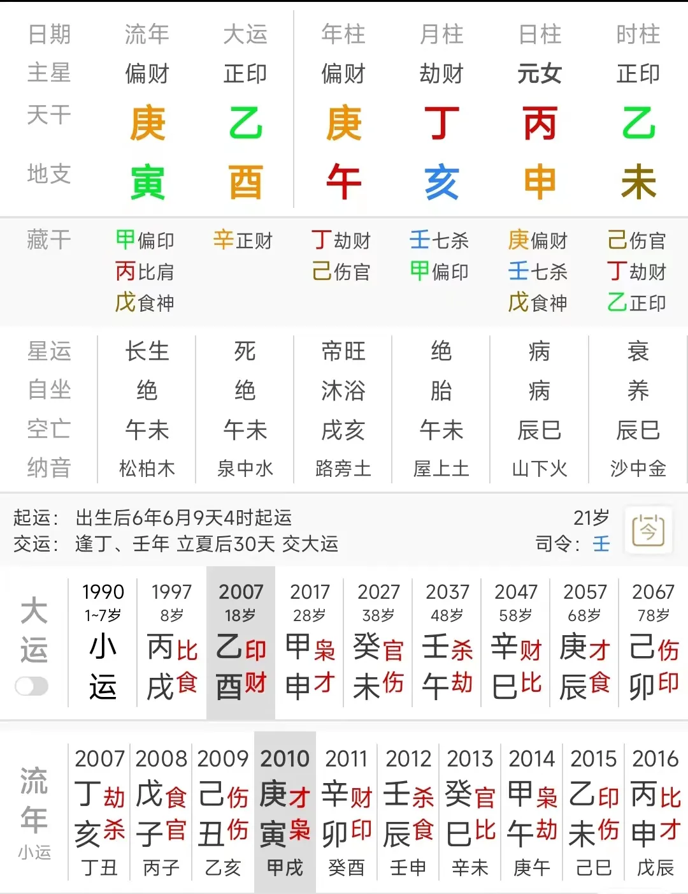

# 【八字技法】怎样判断精准的恋爱时间？

虽然我此前批评说八字是最拉胯的术数，因为大部分时候它都非常的笼统，而且缺乏像紫微斗数、占星那样细致的、比较多的宫位划分，导致其取象定位非常的困难。

但是很多时候如果我们能够做出准确的定位的话，其实也能够断出一些非常精细且具体的事项。

这回我们就通过讲一个八字命理的一个细小的点，来给大家示范如何把事断细。

对于这个八字我们不涉及过多的内容，只讲一个事，就是我断她在乙酉运中，谈了一次重要的恋爱，这个恋爱是在2010年开始的，在2013或者2015年分手。

这断的只是一件很小的事，但是断出这件小事的背后却牵扯到非常复杂的原理。

当然其实这个八字我断了很多事，比如我上来一眼就断她是做金融的，事实也的确如此，但为了不涉及命主过多隐私，也由于篇幅限制，我们就不讲太多。

命主反馈呢，她说的确是在乙酉运谈了一个重要的恋爱，10年开始，13年结束。

那么这个事情，现在我们把这个时间节点告诉了你，让你来反推，我估计99%的命理师都想不明白，这个事情是怎么判断的，为什么我斩钉截铁的就确定了这样的时间节点。

其实这背后的原理说复杂很复杂，说简单也很简单，关键在于你能不能有一个不刻板、不僵化的取象思维，同时还需要你能够结合常理来思考。

如果你能够准确的取象，又结合常理推敲，那么你会发现断出这个事情其实非常非常的简单。

那么这种取象思维和经验呢，都不是可以像一个学科一样去直接教授的。

因为它没办法直接描述，每一个八字都是特别的，我只能通过讲不同的八字命例，从而传递出这种取象思维。

你要跟我学的，也是一个个命例背后的取象思维，而不是只看表面的套路。

因为你只学套路的话，你会发现它没法用，因为最深层次的取象不是套路可以复制的。

那么我们看这个命，这个八字，她的年月两柱都代表命主的感情缘分——

年柱的庚午，庚这个字就是从命主的夫妻宫出来的；

并且庚午纳音路旁土，纳音起桃花，土命见午未为桃花，所以庚午就是桃花；

庚午这一柱，又和命主我宫的乙未是天合地合的关系，代表命主非常强烈的想要得到庚午；

那么丁亥呢？

一来丁也是从命主的我宫透出来的，二来丙丁一阴一阳，就是一男一女，丙是女人，丁自然可以代表一个男人；

并且，丁火坐亥，还要穿命主的坐支，这种穿就代表丁火这个男人想和命主发生关系——而且还想发生一辈子，因为亥也合未，代表丁这个男人，想陪伴到命主生命的尽头。

那么原局有的东西，关键要看在大运流年的作用下，它引发了谁，触动了谁。

有些时候，**可能一个人原局桃花很多，但受到大运的影响，结果一次恋爱都没谈过**，所以大运非常重要。

命主07年开始走乙酉大运，**命主时干的乙木伏吟，那么这就是一个强烈的信号，代表原局中乙木要干的事，就要在这个大运中来完成**；

原局中乙木要干什么事？

它要去遥合年干的庚金，要得到庚金这个男人。

在原局，它受到月干丁火的阻碍，不能得到；

但是一到乙酉运，时干乙木成了大运的运干，那么它就相当于跳出去，获得了更自由的权限，她可以轻易得到庚金了。

2010庚寅年，流年又见庚金，就是乙庚合得到实现的应期，所以，这个重要的恋爱开始的年份，就一定是庚寅年；

那么为什么我判断2013或者是2015年关系结束呢？

这就涉及到非常复杂、但只要我们用常理一推敲就又豁然开朗的原理了：

2013年是癸巳年，癸巳，是癸水这个正官星坐在了巳火上，巳是命主的禄，代表命主的身体。

那么这是什么意思？

就是说在2013年的时候，有一个别的男人，要睡在命主的身上——当然，这是理法，现实中通常不是这样体现，它不是代表这一年命主和10年的庚金男朋友分手，和别的男的在一起了，虽然也有一定的这种可能性，但本质上它是呈现出了一个象：就是此时原本被更近占据的命主男友的这个“生态位”，被2013年的这个癸水给挤掉了。

癸水挤掉了这个生态位，不代表它就一定能坐稳，但过去的庚金肯定被挤下去了，这倒是毫无疑问的。

那么为什么我还给了2015乙未年这个时间节点呢？

因为乙未就是命主时柱乙未的伏吟——在我的八字课里我反复强调过，**要重视伏吟，伏吟代表缘分的开始和结束**。

既然在2010年已经开始了，那么走到2015年时自然就应该是结束。

当然，除非是乙未年产生了一个新的开始，就是她和男朋友在这一年结婚，开始新婚也是一种开始。

通过这个小小的事例，我主要想强调的是，断命时要把灵活的命学思维和正常的生活思维结合起来，思路不可僵化。

如果你只有常规的命学思维，那么看到这个八字乙酉运时估计很多人的判断是，命主要在12/13年的时候谈恋爱，见到官杀了就会谈恋爱！

最终的结果是你的判断却恰恰和事实相反。

八字分析的本质，是分析每个字之间关系——**十神只是以日主为太极点给其他每个字贴上的一个标签，它不是那个字的本质**。

就像六爻断卦一样，大部分人六爻断卦的思路是，一定要用六亲来进行所问事项的定位，但实际上取向定位从来不是死板的，也不是固定的，**并不是只有官杀才是丈夫，只有父母爻才代表学历**。

宫位、爻位、六亲、十神、纳音、神煞……一个术数体系中，任何一个元素都可以是我们取向定位的参考点。