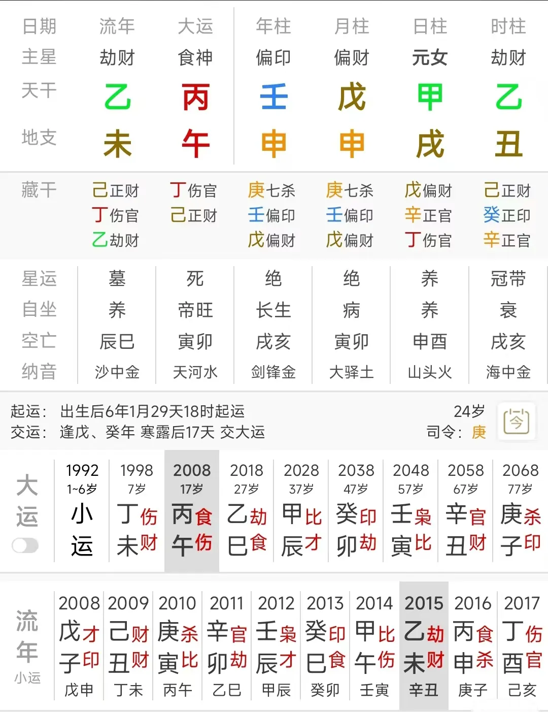
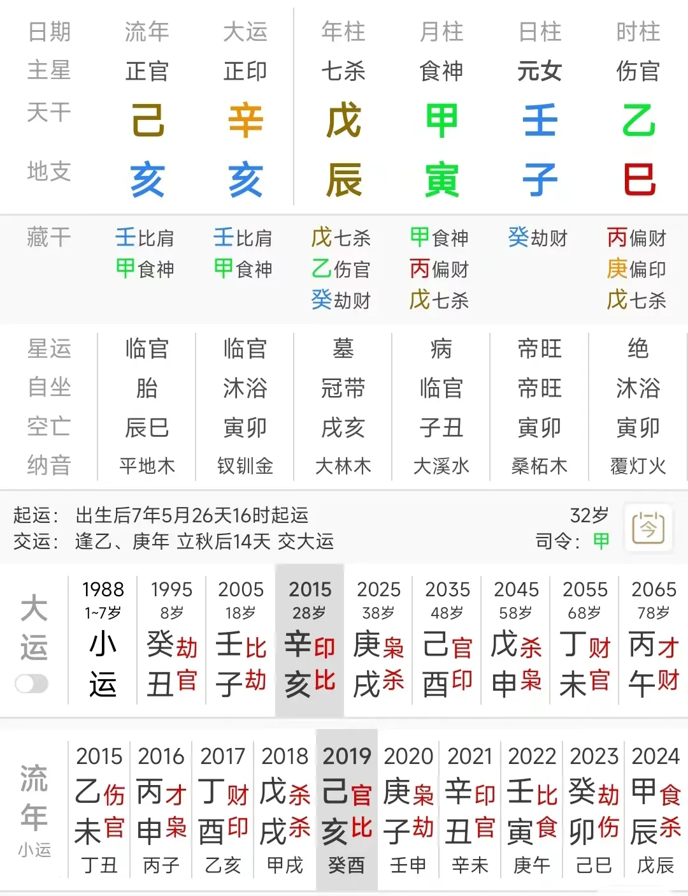

# 怎样判断精准的结婚和离婚时间？

上篇文章[【八字技法】怎样判断精准的恋爱时间？](http://mp.weixin.qq.com/s?__biz=MzI2NTAzOTQxMg==&mid=2651446932&idx=1&sn=e4dec5e853d1074c8a6d9d51d8645a84&chksm=f15e05cfc6298cd97b6190652c0e28c232968306386f8b797036f562928e589e8e0356b12846&scene=21#wechat_redirect)发布之后，评论区有人要求说希望我再讲一下怎样判断精准的结婚时间。

我一再强调，八字是非常特殊的一门术数，其实每一个八字都是独特的，对于每一个八字我们都要把它当成一个“独立的结构”来看待；

我们要确定的是在这个独立的结构之中，究竟每个字代表的是谁、代表的是什么意思；

还要看在大运流年的引发和作用之下，究竟是哪个字、是谁应了事。

下面我们通过两个命例，来阐明用八字判断结婚时间的底层思路是什么。

当然，太简单太常见的技法和命例就不讲了，我们主要讲两个一般人不会看的例子。

首先看这个坤造：壬申 戊申 甲戌 乙丑

这是我的一个老客户——她好几年前找我看过，好像是18年还是什么时候。但是我当时给她看的不大准，今年又重新找我。

她说她离婚了，想看看后边怎么样。

我说我当初都给你算错了你还找我算，我自己都没啥信心了，觉得很尴尬，你不行还是找别人给你看看。

她就说呢，让我试着重新瞅一眼，看有没有什么新的思路。

然后我排了她的八字，其实扫了一眼之后我觉得很诧异，诧异这么明晰的事我之前竟然还能算错。

当时我就扫了一眼，我说我先做一个基本判断：你呢，是2015年结婚，或者在那一年认识的你丈夫；你离婚，是在2020年离的。

然后她很激动，说终于算对了，就是15年认识，16年领的证；20年离的婚。

那为什么她会是在这个时间恋爱和离婚呢？

其实就是看我们能否定位准这个八字的丈夫是谁，我在2022年之前还不会进行六亲定位，所以自然算不准。

这个八字，可以把月柱的戊申和时柱的乙丑都作为丈夫；

戊这个字有一个根在命主的夫妻宫，又坐在申金七杀这个原始的丈夫角色上；

而乙丑呢，乙丑一来是天喜，二来乙木和甲木是一阴一阳，就代表一男一女；

戊申这个丈夫，是一个二婚的、或者是会出轨的男人，为什么？

因为戊土和壬水一起坐在申金上，而且壬又是戊的财，所以从戊的角度来讲，壬就代表一个和他可以睡在一张床上的女人；

接下来我们就要看大运流年如何引动，命主在2008年开始走丙午运，那么这个丙午运中呢，她在2013年之前，很难有什么合适的、比较好的婚恋缘分的；

她主要是2013、2015和2016这三个年份会有感情缘分。

为什么13年会有，原理我在我的八字课里讲过，在这儿就不说了；

15年为什么有，很明显因为15年乙未，就是时柱乙丑这个乙木劫财代表的丈夫到位的时候；

16年为什么会有，因为丙戊同宫，丙是半个戊，戊是半个丙，丙伏吟在一定程度上就相当于是戊的伏吟；

当然，虽然丙午运中有三个重点年份，但还要看我们自己的灵觉，我当时扫过她丙午运时，一眼盯上的就是2015乙未年，所以我就说了是15年；

那为什么我说她要在2020年离婚，这也是显而易见的——命主从18年开始走乙巳大运，大运就是时干丈夫乙木的伏吟，在2020庚子年，乙庚合，是庚金把这个乙木丈夫给合走了，所以离婚基本上就是2020年——20年不离的话，21年估计也要离，因为21年她的夫妻感情会很差，21年的这个辛金克乙木，就等同于原始六亲角色中的“食伤制官杀”。

这个原理一点破，那么大家再看这个八字的结婚离婚时间，就会觉得是非常显而易见的。

我们再看一个案例：

坤造：戊辰 甲寅 壬子 乙巳

这个八字，我一上来就做了一个明确的判断，我说她在2019年结婚，2020年离婚。

而命主也的确在19年结婚，20年离婚。

原理是什么？

这个八字，年柱的戊辰，是七杀坐七杀，这个戊辰非常强悍，是个很厉害的男人——实际上命主前夫的能力也的确很强。

但是，月柱又是非常强旺的甲寅，把戊辰彻底的给挡住了；这个甲寅在月柱，代表命主的家人，就是说命主的家人往往容易对她的婚姻指手画脚，横加阻挠。

这样一来，如果命主走能够制住这个甲寅的大运时，她就会和这个戊辰结婚；

命主05年开始走壬子大运，这个壬子运看似是日柱的伏吟，但是在流年上并没有很好的能够能够让她和戊辰结合的年份；

2012年壬辰年时，她甚至已经和戊土很亲密了，但是2014年又是个甲午年，甲克戊，午冲子破子辰合，所以就坏在这个甲午年上。

到了15年走辛亥大运，辛金制住天干的甲木，当然，辛克甲的力度很弱，这也是她感情不稳固的主要原因；

但是地支的亥水去合寅木，这就相当于亥水合走了辰和子之间的阻碍，在这个大运里，壬子就又有了和戊辰链接的机会；

再看具体的流年，2018年戊戌，就是戊土伏吟，2019年己亥，天干甲己合，这个己土把月干阻碍的甲木也给合走了，所以，壬水就可以和戊辰又彻底的天干地支都结合在了一起，所以，19年己亥年结了婚；

那么为什么到了庚子年就离婚？

一来是因为命主时干是个乙木伤官，庚金优先乙庚合，克制甲木食神的力度就不够；

二来则主要是因为庚金偏印坐在了子水上，子水是夫妻宫，偏印是离婚证，直读这个象，就是婚姻中拿到了一张离婚证。

前面我们提过，这个甲寅代表命主的家人容易对她的婚姻加以阻碍，而命主离婚的原因，也的确和她的父母是有关系的。