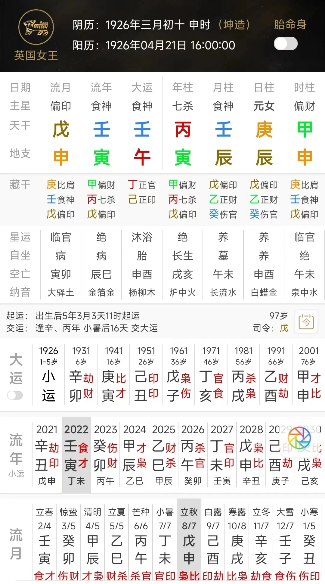

# 为什么学八字的人、一定要再学一门占卜？

2022年6月24日，我在知乎刷到一个英国女王健康状况不佳的问题，随手排了她的八字——准确的讲应该是六字，丙寅 壬辰 庚辰。

2022年她是壬午运壬寅年，壬水食神伏吟，看了一眼就感觉她要挂。

因为这个壬水食神就代表她的寿命，壬午运壬水自坐午火胎地，坐胎地对于老年人来讲就代表要转世投胎了，转世投胎的前提那肯定是她得先噶了，对吧；

壬寅年壬水伏吟，伏吟代表结束，所以她就要在这一年结束。

结束在哪个月份结束呢？就是在戊申月，因为戊申就是庚辰的转世轮回——庚辰上下颠倒过来就是戊申，颠倒就是转了一圈，就是轮回。

而且戊土偏印还要猛克壬水，所以正常来讲，老太太活不过戊申月。

戊申月就是公历的8月7日~9月6日，所以我写了个回答，说她活不过这个时候。

结果就过了两个来月，公历9月8日，伊丽莎白噶了。

比我推定的这个时间晚了两天。

那么这个两天的误差如何解释呢？

为什么我给定了一个月这么笼统的范围，她却偏偏跑出了这一个月的时间，非得晚两天？

一来是因为其实女王本来在己酉月也有亡象，酉为庚之旺神，老怕帝旺少怕衰，他走到酉月这个旺地就有僵死的意思。

为什么老怕帝旺？很多人光知道这个口诀，根本不明白背后的象法逻辑。

因为旺是什么，旺就是“挺”，是直挺挺的，对年轻人来讲直挺挺的代表很有精神，对老年人来讲，挺就是死了挺直了身体。

而且，壬癸水都怕己土克，己土克壬癸水不光是克，还代表污染，代表魔法攻击，所以，戊申月是壬水受到一种很猛的克，己酉月是受到己土的魔法攻击。

所以你说她己酉月噶，也说得过去。

只不过对于这个六字来说，大部分人其实都会噶在戊申月，伊丽莎白能够撑到己酉月再嘎，和她是英国女王，拥有顶级的医疗条件有很大关系。

你要是有钱，你也能撑得久，赌王何鸿燊，86万的续命针每天一针，打了11年，他要是没有这么多钱，也早就噶了。

二来，八字本身在描述人的命运的时候，它的精准性就有一点点差，大部分时候它是框定一个范围，一个区间，具体事项的发展是在这个区间内上下移动的。

——这一点其实也很正常，因为同样八字的人有那么多，不可能每个人的命运都一样；

而且八字书写的是一个人一生好几十年的剧本，那自然是善于分析大势，所以八字看流年很精准，看流月大部分时候还比较清晰，但一旦想用八字推流日，就会比较容易翻车。

所以，八字就像宏观经济学，占卜就像微观经济学；八字更擅长看大势，占卜更擅长看细节。

我给伊丽莎白的噶期预测是框定了一个月的笼统范围，结果还有两天的误差；

但是在大六壬课中我讲了一个例子，一个客户占其宠物的生死，我说要么2月25，要么3月3日会离世，我给出了明确的这两天，就这两天之一。

结果其宠物在2月25日离世；这个是课程例子就不在此处多说了。

再比如，随便找几个例子：

一老客户说有个卡丢了，起了一课我说东西可以找到，在西北或东南这两个方位；找到的时间是今晚8点或明天——有时间有方位，对吧。

结果晚上八点她说在东南方找到的。

还有个客户租了个房子想退租，想看看损失多少。

土数五十，戌的太玄数也是五，我就说损失是五或十开头，结果损失五千多。

占卜在具体的事项上，是可以比八字精细、明确太多的。

这些具体的问题你想用八字看，其实也不是完全不能看，但往往会容易有偏差——

假如我当时是起卦看的女王伊丽莎白的嘎期，那一般而言就不会出现那么大的误差，也不至于给出了一个月的这么笼统的范畴，说不定也可以具体到哪天，三五天这个范畴之内。

所以学八字的人，一定得再会一门占卜，八字看宏观、看大势；占卜看微观，看具体的事，两者搭配，你就无往不利。

再一个还有更重要的一个点，就是如果一个人只会八字，这可能也会让他论命的时候，他的思维容易偏于大而化之，断事不够精细；

但是占卜一般都是和具体的事打交道的；

多玩占卜，可以让一个命理师的思维也在无形中变得更具体、更精细化；

这样一来你看八字的时候，也会更容易看到命主更多的比较具体的事，这样才能有利于你装逼，也有利于让你获得客户的信任。