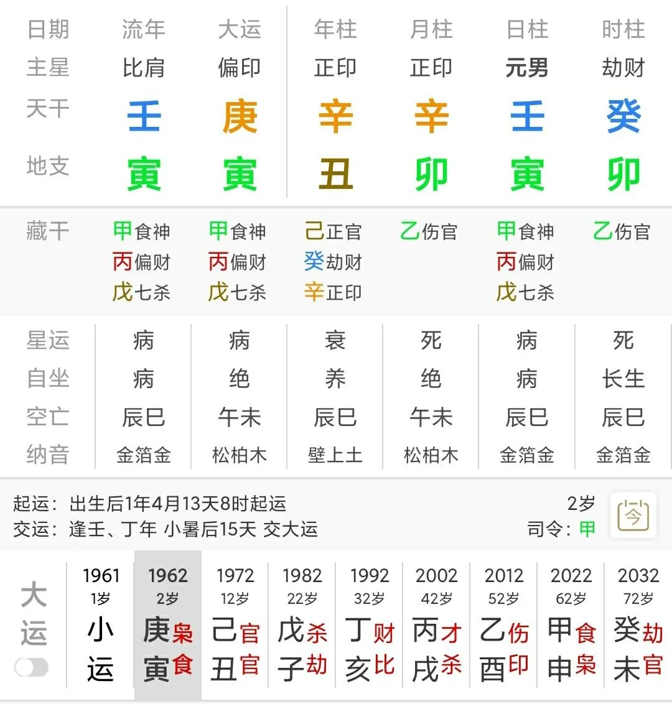
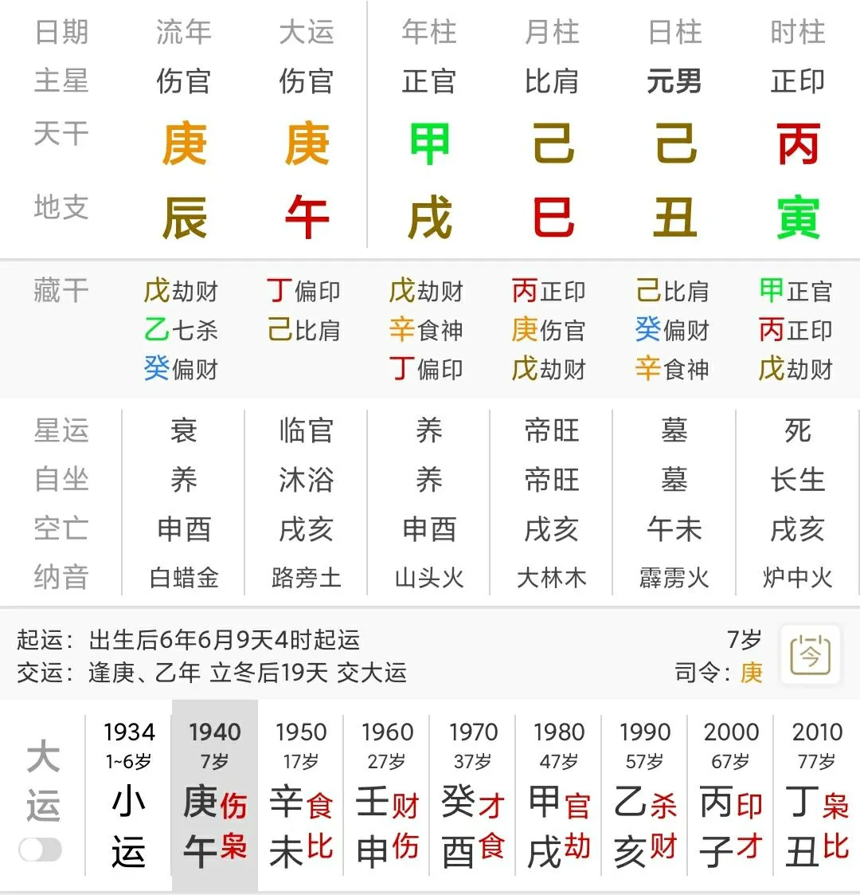
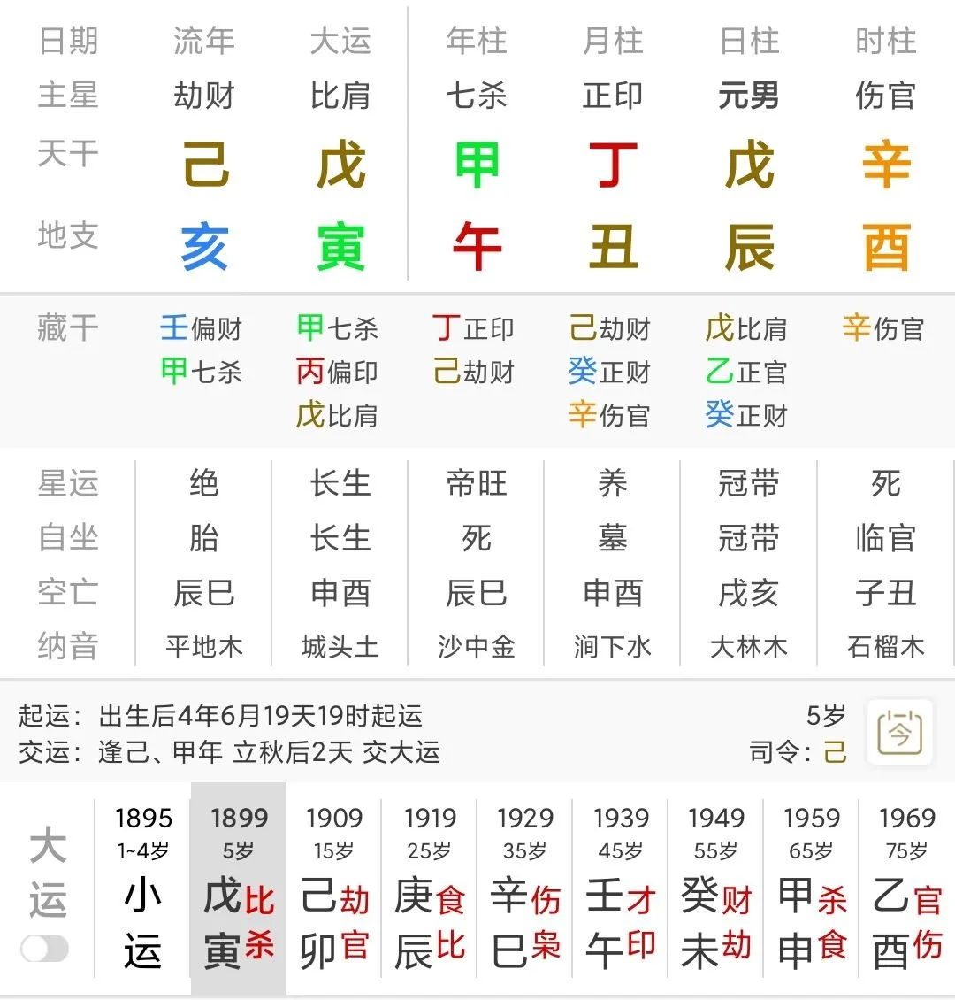
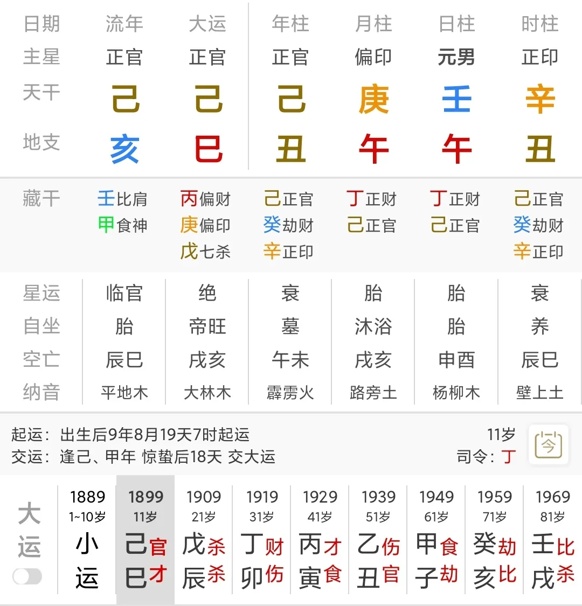
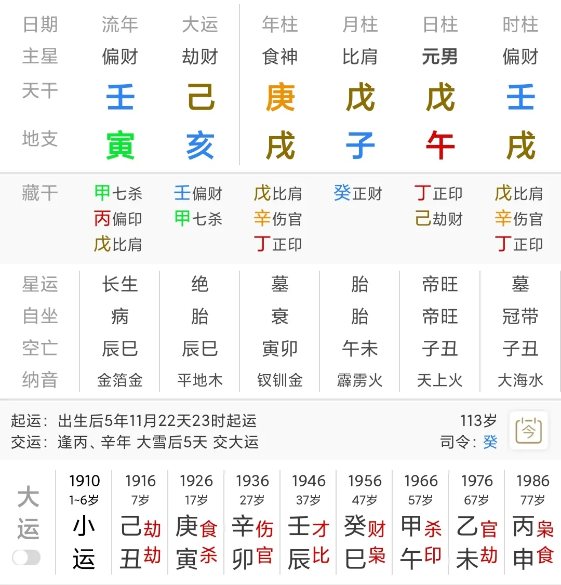
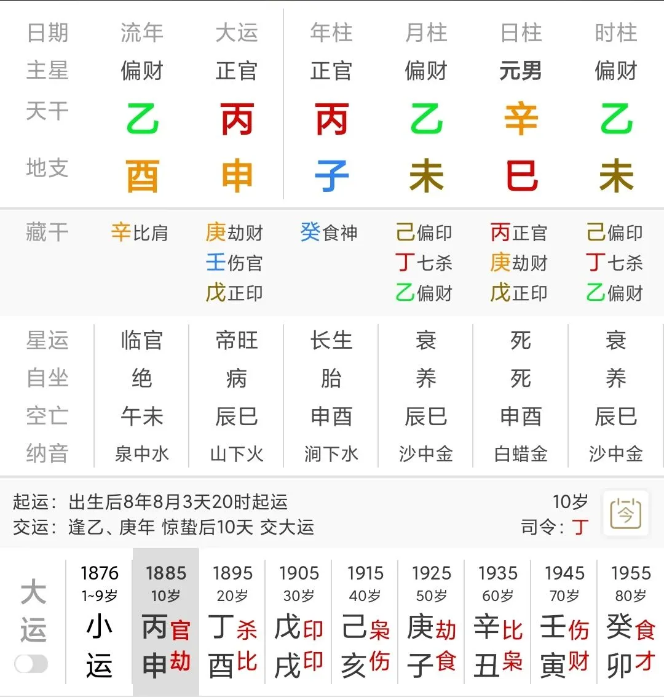
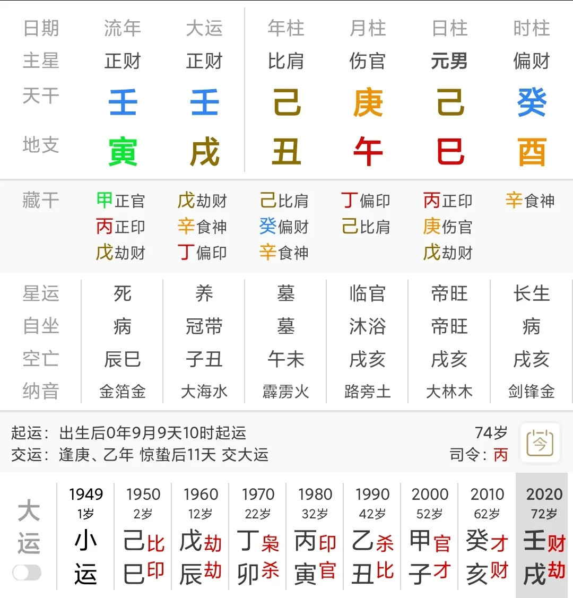
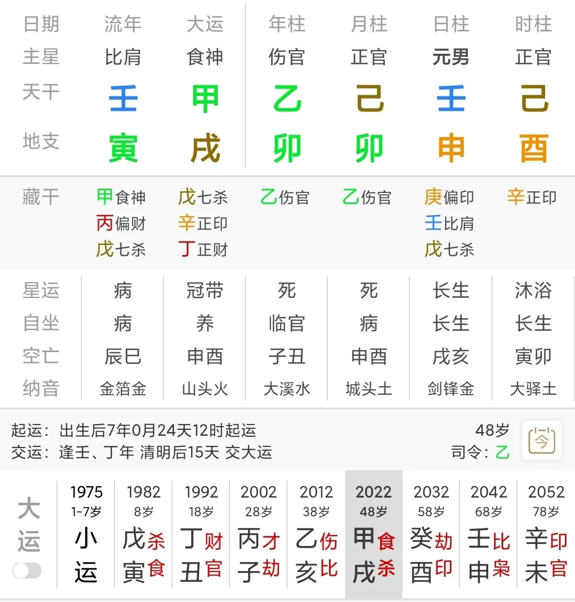

# 8个案例，谈谈男同性恋在八字中的特征

这篇推文源自两月前我刚学八字不久时的研究成果，那时我是还是个连格局、调侯、扶抑等各种视角下的术语都用不清楚的萌新，全依靠自己对卜卦的理解从八字里取象分析。

当时我坚定地秉持着一个观点：在定下了框架后，术数模型纯粹就是一个思维玩具，八字——往大了说，命理学——和卜卦同根同源，该怎么学卜卦就怎么学命理，任何的技法和论诀都可以不经过实践而凭借纯粹思维推导而诞生，而不是很多人鼓吹的“古时候大数据的成果”。

而这个研究也基本验证了我的想法。

在这个圈子里，总有一堆人抱着所谓的秘诀，以不读书为荣，认为学习全靠悟性和师传。倘若如此，请问这个时代才开始被人所关注的 LGBT 群体等少数群体的八字特征，古诀有谈么？可以通过师传得知么？

术数模型是人创造的，技法同样也是人发明的。明白技法诞生的机理，只要能用于验证的数据足够，论诀自然要多少就有多少，男同性恋论断，正是一个最典型的例子。

闲聊结束，正文开始。

## 01 取象

如果条件允许的话，我自然更愿意从心理入手而非从行为和现象入手。但很遗憾，涉及心理难免涉及地域与文化差异、时代和社会背景的差异，正如《像我们一样疯狂：美式心理疾病的全球化》里提到的，同样是厌食症，在不同国家有截然不同的心理原因导致这一症状。从心理入手，只能作为参考，不能作为支柱。

因此，只能从行为入手，捕捉特征了。

所谓男同性恋，自然就是只愿意和男性成为恋人和伴侣的人，这一点和多数异性恋男性不同。

从这一特征入手，一来需要明确异性恋男性的配偶在八字中用什么象征，这自然是财星，因为财星为我克之物，在封建社会的逻辑里丈夫应该能管得住妻子（克即约束规范）。

哪怕在现代社会，男女依然没有完全平等——不管是从社会财富分布看，还是从提及“小三”这样一种身份时人们总对应女性、提及“英雄”“领导”时总是默认男性形象看。不管怎么说，在整体的社会意识中，男性相对于女性还是被摆在了一个更具有主体性的地位，这也是为何哪怕在现代社会，男性以“我克之物”财星作为配偶征象依然行得通。

那么对男同性恋群体而言，配偶征象自然需要改变，我的观点是用比劫指代，因为比劫是“同我之物”，比劫多一方面对应兄弟多（各种含义），一方面也对财星构成克制，表现为异性缘薄弱乃至无法和女性走入正常婚姻。

然而比劫多并不能唯一地确定同性恋这一事实，毕竟有的人只是个性自负傲慢，导致妻子提出离婚或是精神衰弱（所谓比劫克妻），又或者是被自己的好兄弟给绿了。

所以换一种思路，财星为忌也可以指向这一点，这表现为命主不适合与女人发展深入关系。当然，仅仅凭借这一条也不能唯一地确定同性恋，因为还有其他可能性，比如妻子带着钱跑路了。

同理可以推断，比劫为喜用也是很典型的征象之一。

接下来考虑男同性恋的第二个特征：只能和同性步入婚姻，无法和女性步入婚姻。

这一条征象围绕八字的夫妻宫展开即可，例如比劫在夫妻宫，其中一种可能性正是配偶为同性；例如夫妻宫被财星刑冲穿害，这自然意味着无法和女性步入婚姻；又例如比劫与夫妻宫联系紧密，这也可以意味着男性扮演了配偶的角色。

还有第三个特征：男同性恋对女性没有性趣。

我觉得这个特征是非常巧妙的，因为性为人类最原始的欲望，八字中对应食伤，而食伤正常情况下是生财星的。因此，如果食伤和财星在某些情况下互动关系不良，那么自然也可以意味着对女性没有性趣。

在案例实践中我还发现了一个我之前从未细想过的特征：男同性恋对性别的观念和大多数人是存在差异的。

如果说异性恋男性以财星为配偶，异性恋女性以官星为配偶，那么男同性恋的比劫、财星、官星，两两组合可能呈现出“糅合”的特点。

当然，如果愿意细想的话，到底是财星和官星糅合，财星和比劫糅合，还是与官星和比劫糅合，这对于命主到底是偏 0 还是偏 1 肯定是有影响的。但这个特征使用起来更需要和其他特征配合——比如说比劫和官星“糅合”的时候又和夫妻宫产生了互动。

偏印结构也能掺和在内，八字十神中的“偏”意味着和主流社会规范或者价值观相悖，印为摄入为知识，偏印所体现的自然是一种更小众、冷门或是和主流不符的认知了。

除此之外，还有第五个特征：婚恋没有后代。

男命以官杀为子女征象，自然如果全局不见官杀，或是夫妻宫对子女宫产生消极影响，又或是食伤过旺，也可以断定不利子女，配上前面的一些特征，也可以推断出同性恋。

当然，这个特征不可单独来断同性恋，毕竟有财星生官杀但官杀少，和没财星也没官杀，这会指向两个完全不同的事实。

总结一下，上述特征主要有以下几点：

- 比劫过多
- 比劫为喜
- 财星为忌或过少
- 婚姻宫和财星互动不良
- 婚姻宫和比劫互动良好
- 财星和食伤互动不良
- 比劫、财星和官星两两出现糅合
- 官杀过少、食伤过旺或夫妻宫对子女宫产生消极影响

上述特征不可单一选取论断，同时出现三个断同性恋有较大把握，而即便如此，也不一定意味着同性恋，因为同个时辰出生的人的命运也是有差别的，例如同样是双胞胎，同样早婚，或许姐姐离婚后没有再结婚，而妹妹二婚，这都是在实际案例中存在的现象。

## 02 案例

以下这些案例都是从astro databank上选取的，透明公开。

### 案例一

命主是一位艾滋病患者。

AIDS 44832, born in Ladysmith

birth date 10 March 1961

天干两个正印，全局一片金水木，仅这两点就能看出命主的气质一定是偏向清秀和阴柔的，因为正印是“母亲”的原型，金水木气质正是清秀明丽。

日元失月令，在年支仅有一弱根，时干有劫财相助，年月有正印帮身，这两个正印很关键，因为局内食伤重而命主又不强。正印为喜用，那么财星自然为忌。

局内财星只在日支藏了一个偏财，异性缘寡淡，尽管偏财在婚姻宫，看似没啥问题，实则寅丑暗合，在婚姻宫的食神（性与欲望）暗合了官星，官星和夫妻宫日支产生了联系，基本上可以断定同性恋了。

### 案例二

命主是美国一位同性恋艺术家。

Don Bachardy, born in Los Angeles

birth date 18 May 1934

正印格走官印相生的路线，局内比劫多而不见一个财星，自然是异性缘寡淡，夫妻宫丑土藏了一个偏财，看似没问题，实则寅丑暗合，夫妻宫的比肩与正官暗合，月干的比肩又和年柱官星相合，自然是同性恋无疑。

换个视角，火土同气，就算有水，在这个局内也是瞬间蒸发了。

当然这个八字能看出的不止这些，例如比肩和官星在天干地支两两相合，一定程度上也可以表征在这段关系里他是相对被动的角色，官印相生，也是文职人员，而最有意思的是这个官星和夫妻宫的比肩产生了联系，这实质反映在命主和自己的同性恋恋人同时是事业上的合伙人上。

### 案例三

命主是一位西班牙的艺术设计师。

Cristóbal Balenciaga, born in Getaria (Gipuzkoa)

birth date 21 January 1895

整个八字极其漂亮——杀生印，印生身，身生伤官，聪慧无比，富有才华。

全局也是财星寡淡，只有丑土辰土藏了两个正财，财星入库盖上了。

为何会产生同性恋现象呢？有人会认为伤官产生了贡献，而且这个案例还是伤官纯气，极为秀丽，伤官最大的特质是行为思想不符合社会规范，这在命主上除了同性恋之外还体现在非凡的艺术设计才华上，但同性恋却不可用伤官独断，理由也很简单：行为不符合社会规范的可能性不止一种，哪怕是在涉及性的方面。举个例子，伤官过旺而又有七杀显现，这种更可能是性虐而非同性恋。

扯远了，男命看婚姻关注财星，丑土和午火相害，财星的性质已经受到了扭曲，婚姻宫为比肩，这个比肩又与酉金六合出伤官，不正是“我的配偶不符合社会规范”么？

又或者以日柱为个人，那么日支自然为下半身，或者以四柱为人体，日柱也对应到了下半身，不管怎么说，在这样的看法下，比肩和酉金六合出伤官，如同疯狂暗示“我的性取向是不符合社会规范的同性”。

当然，这个案例特殊之处在于，时柱的一柱伤官确实对同性恋论断也很具有影响力，因为时柱为子女宫，伤官纯气又得日主所生，气势过旺，自然不利子女（七杀）。而且日支夫妻宫和时支酉金合出伤官，也可以解读为“婚姻不利子女”。

### 案例四

命主是法国艺术家，小说家，评论家。

Jean Cocteau, born in Maisons Laffitte

birth date 5 July 1889

和前几个案例不同，这次是财星在地支一口气见了两，但很不巧的是，午午自刑，婚姻宫被正财所伤，受困于婚姻，年支和时支的丑又和午相穿，扭曲了财星和官星的性质。

除此之外，日主失月令又仅有两弱根，比劫为喜，而且这里的正印和偏印是有帮身的巨大作用的（这也很能解释为啥命主和母亲关系更好），这也就意味着一般情况下财星破印为忌。好在局内有官星来流通，但财星如何透过官星来缓解和印星的冲突呢？只能通过“丑午相害”这种扭曲自身的方式。

### 案例五

命主是法国艺术家。

Jean Genet, born in Paris

birth date 19 December 1910

局内比劫重重克制财星，不巧地支的正财又和婚姻宫相冲，天干的偏财被旁边的两土一火克制得死死的，不必多言，这显然是完全无法和女人正常走入婚姻。当然，异性缘还是有的。

除此之外，还有午戌半合的信息，比肩又和婚姻宫产生了积极关联。而且八字内也是不见官杀。

种种叠象，应当是能确定同性恋了。

### 案例六

命主同样是法国艺术家。

Max Jacob, born in Quimper

horoscope for birth date 12 July 1876

乙坐木库未土，偏财格，日主虽然得月令所生，但根浅，左右都是偏财，极为依靠月令偏印扶身。印星与认知有关，根浅依赖偏印，个人观念自然和大众有所差异。

除此之外，子未相穿，负责帮身的偏印穿了食神，这是第一个征象。除此之外，年干日干丙辛合，日干与日支又是丙辛合，相合即有情。

丙为正官，这种情况下与官星有情，确实有同性恋的可能性了。

### 案例七

命主还是法国艺术家。

Patrick Loiseau, born in Limoges

birth date 8 June 1949

看到这里已经不想说什么了：熟悉的身强克财星，熟悉的丑午相害扭曲财星的性质，巳酉丑三合金强化了月干伤官的力量，行事有不符合社会规范之举，不利子女，局内无官杀，种种征象叠加，同性恋的可能性极大。

### 案例八

命主是美国的一名制片人、作家和导演。

Christopher Landon, born in Los Angeles

birth date 27 March 1975

年柱乙卯伤官纯气，又生在卯月，身弱，伤官泄身太过，喜印扶身或比劫帮身，财星为忌，而酉金正印被伤官所冲，只能用日支申金。申金为偏印藏比肩，财星为忌而局内又不见财星，故存在同性恋的可能性。

当然，从子女的角度考虑，年支月令伤官双冲时支，对有无子女的影响还是很大的，这也是辅助判断的方法之一。

## 03 总结&碎碎念

本想再贴上七八个案例的，但仔细思考了一下，感觉这似乎有些考验读者和我的耐心（粘贴图片排版实在是太烦了），所以就这样结束吧。也算是理解为啥网络上找不到系统性论述男同的八字特征并贴出一堆案例的文章了，毕竟找案例再贴出来分析委实是一件麻烦事（当然，我更愿意相信是因为大部分人压根就不知道也懒得探究怎么论）

在文章结尾，我依然想强调一点：上述特征不可单一选取论断，同时出现三个断同性恋有较大把握，而即便如此，也不一定意味着同性恋。我特意查找了一些妻子跟着别人跑了，或者被家长棒打鸳鸯于是终身未婚的案例，发现这种案例在八字上想要和男同性恋做出区分，也是一件有难度的事情。

想找更多案例的话，还请上astro databank自查咯~

可能有人会对女同的论断感兴趣，实际上我也这方面我也稍微研究了一下，大约过了十来个案例，我得出的结论是：女同的论断难度远远超过男同，这很可能涉及了一定的社会原因，也可能和我选取的案例有关（外国案例）。总而言之，此类论断还是学术研究价值远大于实用价值，背后可能涉及的东西或许不是八字框架内的知识能解决的了。