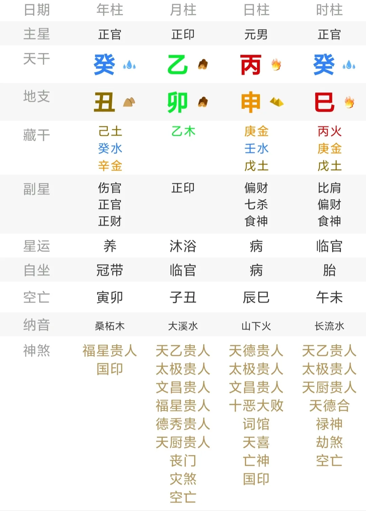
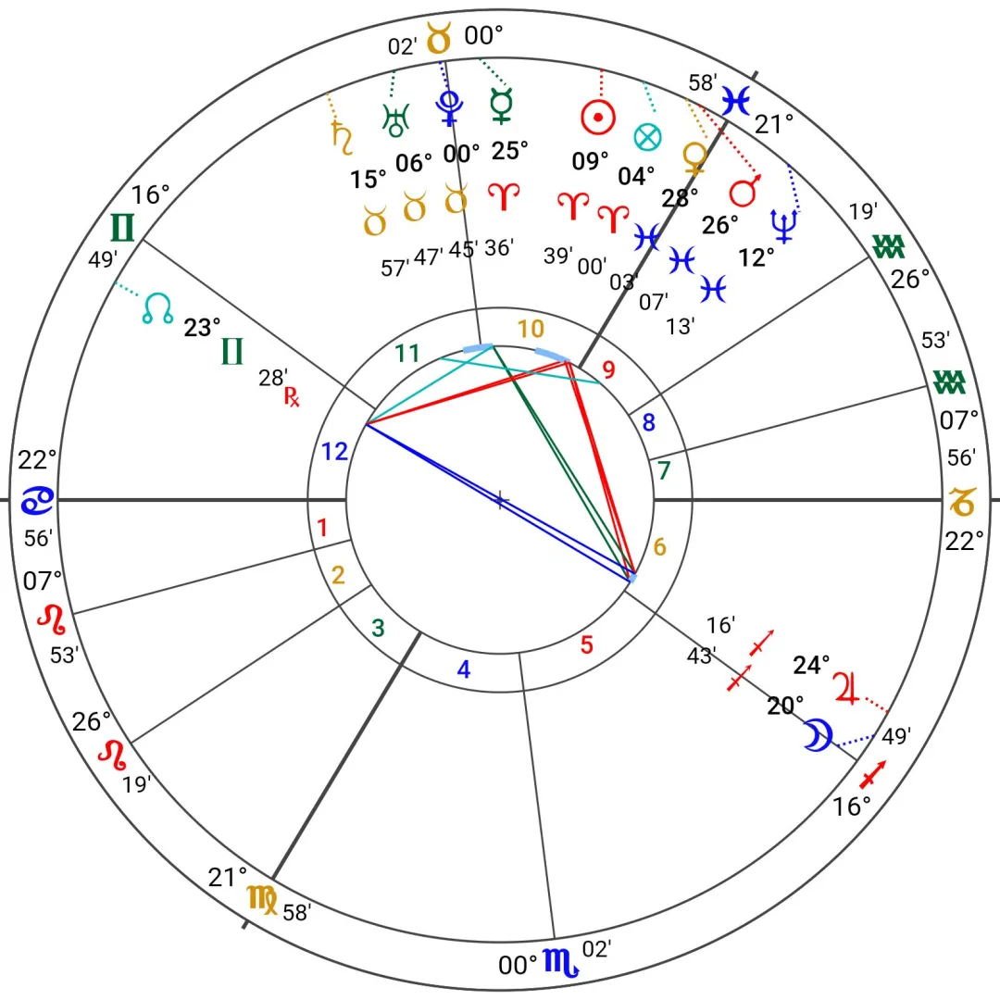
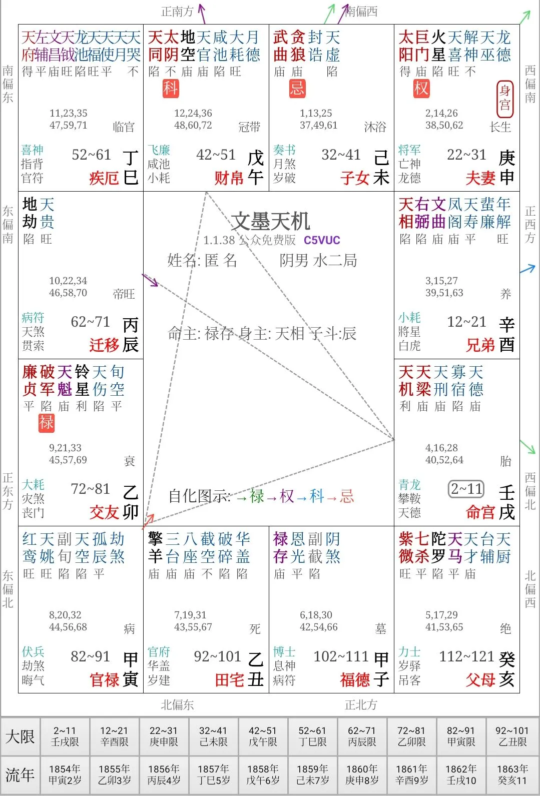
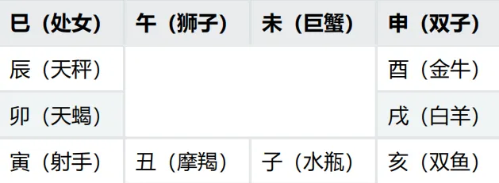
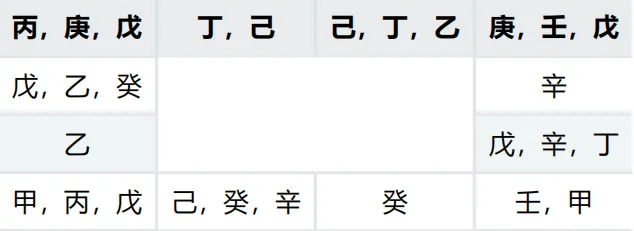

# 浅谈命理学模型的基本构成，以及子平八字的特殊性

## 01 类别

讨论之前，先明确一下命理学的定义：**以出生时间为依据，推断个人命运的学科**。

因此，这里就将上至全国连锁的三才五格 + 八字五行的取名方式排除开来，下至手机号码车牌号微信头像等土味玄学预测手段也排除开了。

当前国内相对主流的命理学模型主要有以下几种（我就不说世界了，毕竟我没有调查过中东亚非拉的情况）。

大家最为熟知的大概就是八字，全称**四柱八字**，也叫**子平八字**，命盘排出来大概是这种画风：

子平八字的称呼源自这个命理学模型相传由宋朝徐子平创建，至于历史真实如何，这就是一个可以发论文的选题了。

年轻人中较为流行的则是西洋占星（特指**本命占星**）。

在这两种系统之外，还存在着几门相对不那么知名，但圈内基本都了解的，诸如我国的紫微斗数，七政四余，古禄命术，还有印度的吠陀占星（也叫印度占星）。

这几门主流的术数之间也是存在一定联系的：希腊时期的占星传到印度，结合印度本土的文化习俗和占星知识，孕育出了吠陀占星。

吠陀占星在唐朝时传入中国，结合本土的占星，糅合出了七政四余这样一个繁复错杂、中西结合的庞然大物。

受当时的天文技术限制，七政四余存在巨大缺陷，因而逐渐小众化。但七政四余对古禄命术和紫微斗数存在巨大的影响，这是从知识剖析就能够得出的基本知识。

古禄命术发展到宋朝，终于孕育出一种新的模型，圈内人称之为子平术。两者在历史浪潮里并驾齐驱，最后在明朝，前者逐渐淡出了大众的视野，而后者则愈发流行——我们当下所说的八字正是子平术。

同样也是在明末清初左右，紫微斗数逐渐成型。只不过由于排盘较为复杂，所以影响力一直没能压过八字，毕竟八字直接将用于记时的干支作为卦象，技术熟练的师傅断八字只需几分钟就清楚明白，而在无法手机软件排盘的年代，紫微斗数不仅要背诵一大堆口诀，排盘也能耗上几十分钟。

（什么紫微斗数由历代钦天监一脉单传啊这种江湖传闻，笑笑就好，不要当真）

以上这些就是市面上大部分命理学从业者使用的模型了。

## 02 基本原理

不同术数存在差异，但深挖到最底层，原理却大体一致。这个原理，有人认为是荣格口中的“**共时性**”，有人喜欢描述为“**as above, so below**”（**如其在上，如其在下**），有人习惯表述为**天人感应**。

不管怎么说，这些基本假设都共同描述了一种现象——大系统和小系统之间存在某种对应关系。

而命理学也正是如此，在这样的情形下，小系统是出生时间，大系统是个人的人生，两者之间构成了一种对应关系。

那么，如何描述时间呢？

从唯物的角度看，运动是物质的存在方式和根本属性，而物质则是运动过程的承载者，时间和空间是物质运动的存在形式。在先古时期，人们正是利用事物的变化来确定时间的，而最稳定可靠的莫过于天体运动、季节变换。

在《时间的观念》中，吴国盛教授如此论述：

> 把握环境条件和组织群体活动是原始社会中最重要的两项活动。宇宙间广泛存在的与生存活动最密切相关的大量周期现象，与为获得群体协作最佳效果而采取的节奏动作，既是理性也是时间意识的源泉。

从这一点上看，占星中存在本命占星简直顺理成章，因为星盘和时间完美构成了对应，并且在很长的一段时间，完全一致的星盘不会再次出现。

比起直接使用星盘，我国本土的命理学则采用了一种相对迂回的方式——八字采用了历法，紫微斗数定义了一套时间转换为虚星的法则。

在上述这些类别的命理学中，八字是最为特殊的，尽管它的前身和七政四余有关，但最终它脱离了“星”，最关键的一点在于，本土的历法符号——天干地支——本身就是一种卦象。

所以可以看到，想要人为创建一个命理学模型，第一步就是确定一下，这样一门命理学模型究竟应该以怎样的方式把时间转化为卦象。

而历史给出的解决方案往简单说，无非以下三种：

- 直接将用于标记时间的星体作为卦象
- 直接将历法工具作为卦象
- 指定一套历法和卦象的转换规则

## 03 构成要素

如果要形容一个男性的配偶如何，用语言应当如何表述呢？

比如，我们可以说：他的妻子是一个性子很急的人。

那么，想要在命理学模型中传达这样的信息，我们至少需要完成以下几件事情：

- 将一个人的人生分为多个方面，例如婚姻、子女、财富、事业、健康，否则“配偶”一词无从谈起
- 找到一个名词，这个名词和配偶如同函数一样构成对应，在上边那个例子里是“急性子”。
- 找更多的形容词来修饰这个“急性子”，比如聪明、古怪、暴躁等等，或者找到一种方式描述名词之间的相互联系和影响，否则这个模型太过粗糙。

在命理学中，模型是通过三种成分来完成了这一任务：

- **宫位**等——社会人事的划分
- **卦象**（星体也可以被视为一种卦象）——名词
- **卦象的修饰**，如星座，十二长生——形容词

当然，命理学模型中还存在一个极为重要的成分是**卦象的互动关系**，这在占星上是**相位**，在八字中是**地支关系**。

在占星圈内有一个人尽皆知的说法：“**星体是演员，宫位是舞台，星座是剧本**”。对于这种说法，星体扮演的正是卦象的角色，星座是卦象的修饰，宫位则是社会人事的划分。

例如在这个星盘中，太阳在 10 宫出现，并在白羊座擢升，这就可以象征此人是一个一头埋进事业里并且极富有热情和个性的事业狂。

再举几个简单的例子。

紫微斗数中，巨日组合被视为带有“异族”和“跨文化”的性质，出现在夫妻宫则可以象征一个人配偶和自身的文化背景相差较大，夫妻宫又是驿马位，被“变动”的性质修饰，自然可以体现为聚少离多乃至多变动等情况。

宫内落陷的火星增加了冲突矛盾，三方四正还汇进了象征反传统的地空地劫，这些“名词”都共同参与了对婚姻的描述。

八字中月柱为兄弟宫，正印则可以象征原生家庭，此处乙木正印一柱纯气，因此兄弟姐妹较多。

对了，上边这三个例子都指向了同一个人——梵高。

## 04 占星视角下的子平八字

尽管子平八字看起来和其他四者格格不入，但历史上子平八字在形式上通过一定的变换完全可以变成形如占星的样子。

首先，十二地支和回归黄道的十二星座存在对应，这基本是常识了：

二十八藏干则如同印度占星里的二十七星宿，占星中的三十六旬星一样，只是用法不同。

地支六合与占星中星体的守护关系互相吻合，地支穿害关系也和古典占星中的映点技法如出一辙。穿为暗害，而映点则是“隐藏的合相”，连解释都如此近似。

因此，年月日时四个天干，完全可以视为是四种周期不同的星体在十二地支上运动，每隔一个小周期就变换一下天干。

而西洋占星中星体对宫位的主宰关系的思想，在八字中也是基本具备了，例如《子平真诠》中这样的一段话：

是故甲乙如官长，寅卯如该管地方，甲禄于寅，乙禄于卯，如府官之在郡，县官之在邑，而各司一月之令也。

所以古籍中强调地支透干的重要性不言而喻。

同时，天干在地支上的十二长生，也就如同本土特色版本的星体的庙旺落陷。

那么，子平八字就只是占星的变种么？

当然……不是。

## 05 子平八字的特殊性

在很多八字文献中，都遗留记录了不少早期的传统，例如明朝《三命通会》中，提及了定命宫的方法：

> 神无庙无所归，人无室无所栖，命无宫无所主，故有命宫之说。不然，流年星辰，为吉为凶，以何凭据。此法看是何月生人，坐于何时，然后方定命坐何宫。先将所生之月，从子上起正月，亥上二月，戌三，酉四，申五，未六，午七，巳八，辰九，卯十，寅十一，丑十二，逆行十二位。次将所生之时，加于所生之月，顺行十二位，逢卯即安命宫。经云：天轮转出地轮上，卯上分明是命宫是也。假令甲子年三月生人，得戌时生，却将正月加子，二月在亥，三月在戌为止。又将戌时加在戌上，亥上亥，子上子，丑上丑，寅上寅，卯上卯，逢卯便是，即命坐卯宫是也，仍随甲子年起，亦如起月之法，甲己之年丙作首，乃丁卯宫也，次看三方，并本命流干，犯何星凶吉推之。

很显然，这正是七政四余中定命宫的方法。

自唐朝起，各种禄命术逐渐显现，在宋朝末期终于孕育出以《子平三命通变渊源》问标志性和代表性著作的子平八字体系。而该体系也并非一开始就是如今的面目，而是经历了漫长的演变，历朝历代的命理学研究者和从业者都依据自己的审美价值，或多或少改造了这一模型，最终才形成如今的面貌。其中的具体过程，仍需进一步研究。

当下子平八字的整体结构已经和占星相差甚远，举一个例子，在占星中，判断一个人的婚恋情况，一种通用常见的步骤如下：

- 看金星落在什么星座，什么宫位，处于什么状态，和哪些星体产生相位，这表征了一个人先天的亲密关系的模式。
- 看月亮落在什么星座，什么宫位，处于什么状态，和哪些星体产生相位，这表征了一个人和母亲和女性的相处情况。
- 看 7 宫主落在什么星座，什么宫位，处于什么状态，和哪些星体产生相位，这表征了一个人婚姻的具体情况。
- 如果还想知道更多更细致的信息的话，也可以参考命主的性格等等，例如用太阳和命主星结合水星看个人性情个性。

梵高：月木合南交，金火双鱼四分月木，7R土星金牛六合海王

而**子平八字对男性婚姻的论断思路，基本上就是看财星的状态，以及夫妻宫和其他宫位的互动**。

在这个过程中，审视财星的状态的过程，涉及考虑全局五行喜忌、财星和其他元素的相互作用，这以一种巧妙的方式完成了对八字命盘一种全局性的视角审视，而并非如占星一样只抓取几个关键要素进行串联。

将子平八字和以西洋占星为典型的各类占星型命理术对比（指七政四余，印度占星，西洋占星和紫微斗数），子平八字最大的特征有以下两点：

- 不使用十二宫体系完成人事对应，而是通过四柱宫位完成粗糙的人事对应，十神完成细致的人事对应，两者交叠才完整
- 极为注重五行的流通平衡，以至于这种思想理念已经构成了一种极为独到的审美理念

我曾经试图用整合其他四门主流命理的逻辑拆解子平八字，希望得到一个整合后的较为标准的模型，不过不可避免地因为这种差异而遭受了障碍。

其实又为何要强行拆分呢？同个语系下的语言不同却相似，但语系繁多也正是人类文明璀璨的体现之一。

子平八字的独特，说明了这样的一个事实：在术数模型中，人生不止有一类写法，对人生的审美角度又何尝不是呢？