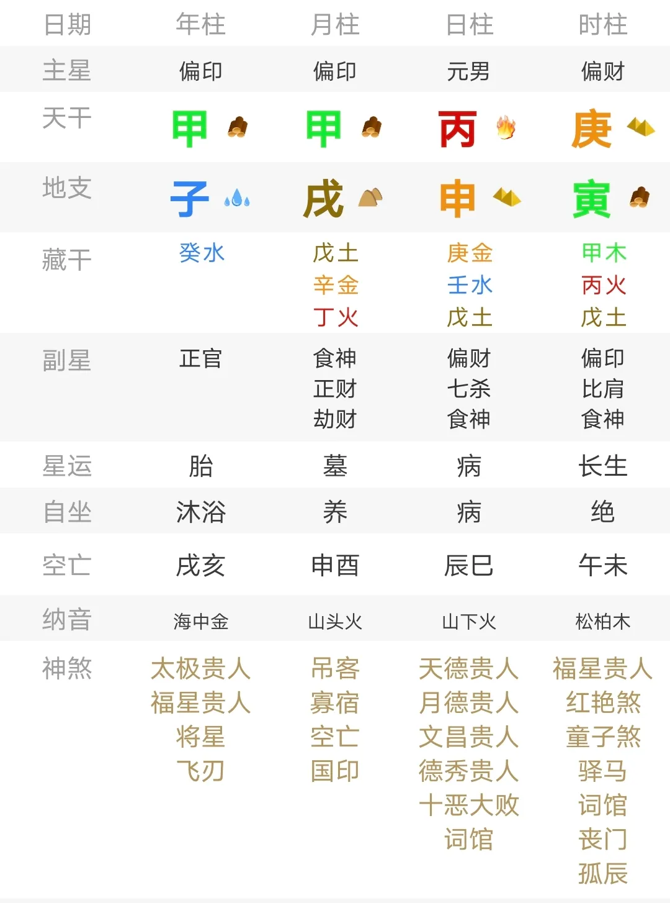

# 在八字中定位六亲，十神与宫位是唯一解吗？

为了避免可能存在的言辞激烈的留言，先容许我叠个甲：

> 首先我没有推翻传统八字定位六亲的思路，本文也不针对任何门派理论，仅作为个人在案例实践摸索中的心得分享，不代表权威也不一定是本人最终的答案，思路仅供参考。

OK，甲叠完了，可以开始写前言了。

基本上，所有学习八字的人，在定位六亲的时候都会接触到这样一种常用的技法：

基本原理就是星、宫同参，十神的逻辑基于封建社会的家族构造，生我者为母，那就把印星定为母亲，正印优先；丈夫克（约束、占有）妻子，那么就把偏财当父亲，没有偏财就用正财来代替。

也正是基于这种逻辑，民间才有了 “比劫重重，克父克妻”“年支受冲母早亡，年印月财母必伤” 的这种铁口论诀，而且在很多八字里那叫一个便捷好用。

至于宫位，六亲对应那叫一个五花八门，上面提供的还是一个比较兼容的版本了。

咋一看，上面的逻辑完美又合理，但真正到实践中，情况有时候就变得格外复杂了。

第一种问题，源自特定十神在八字中可能不会出现。

正印为母，无正印则偏印当母亲，那么如果一个八字里一个印星都见不到，总不能是没妈吧 ？一个财星都见不到，难道没父亲 ？

这一点可以有补丁，比如说“财星重重虽克母，不见印绶不用哭”之类的，基本上就是说虽然财星重，但是如果大运里印星不要冒头，年月柱情况又比较好，那就屁事没有，父亲同理。

陆致极在《八字命理学进阶教程》里提供过一个案例，大体分析就是，这个八字年月十神都没啥问题，唯一一个七杀还被酉金给化掉了，年月柱也没有偏财，大运偏财又没有露头，所以父亲活到了八十多岁才逝世。

说实话，这个案例对直接用传统思维论断的人来说就很有误导性，毕竟天干三比肩，地支藏偏财的寅木直接被申金冲了，财星在这个局里根本活不下去，很容易直接就断父亲早逝。

第二种问题，源自特定十神在八字中的出现位置并不固定。

依照十神，印星为母，财星为父；依照宫位，天干为父地支为母。那么如果印星在年月天干，财星在年月地支，到底哪个是父亲，哪个是母亲？

第三种问题，源自偏正两种十神同时出现在不同位置，例如偏财在日柱时柱，而正财又在年柱月柱，局内正印偏印还都有，又都藏在地支，那么到底哪一个才是父亲，哪一个才是母亲？

这个案例是一个很典型的容易翻车的案例：

依照常规观点看，局内水木气势明显，土为印星，羸弱不堪，而正印藏在巳火中，被月令所冲，母亲直接寄了；财星力量显著，日主直接坐偏财上，应该和父亲关系更亲近。

实际上事实相反，这个八字对应的命主是德怀特·斯通斯（Dwight Stones），美国著名运动员，五岁时父母离异，由单身母亲抚养成人。

总之，见到这种特殊案例之后，也有好几种反应：第一种是承认八字的局限性，第二种是认为现有的理论不足，存在问题，开发补丁和新的技法，第三种是直接怀疑出生时间的准确性，都蛮正常。

我选择了第二种，而后也自然而然地导向了今天打算写的内容：

在八字中定位六亲，

十神与宫位是唯一解吗？

## 六亲的成象

我一直认为卦象中的符号和人类语言的偏旁部首、词根词缀没啥差别，所以说，如果符号最终组合出来的语义和现实不符，那么解读方式可能存在问题：就比如，我开心死了 ≠ 我通过开心的方式告别了人世。

同样地，如果传统六亲的断法出现了局限性，有没有一种可能，是六亲的写法，在八字中本来就有很多种呢？

仅看十神和六亲搭建的对应，偏财对应父亲，正印对应母亲。咋一看十分合理，但玩六爻的人又可能察觉到一些别扭的地方：六爻中生我者为父母，印星本就具有养育者的含义，为什么在八字中仅指代母亲？

再进一步思考：

官杀为管理约束，正符合法律上“监护人”的定义，为何官杀在八字中又不能理解为父母？

父母对孩子的个人成长起到了至关重要的作用，极大程度影响了子女的三观，难道不能将八字内年月柱的主要气势视为是父母在子女生命中的映射么？

在中国社会，尤为崇尚“男主外，女主内”，男性在家庭中掌权一直是大趋势，也塑造了子女早年对于权威与领导的印象，尤其是女性，其配偶的选择极大程度和父亲相关，特殊情况下，难道不能将官杀视为是父亲么？

男性的配偶选择，极大程度和母亲有关，特殊情况下，难道不能将财星视为母亲么？

… …

由此可见，传统视角对于十神和六亲的对应，是基于封建社会家庭结构的角度对象做出的诠释和理解。这种理解具有局限性。

理解角度本就不止一种，因为象是模糊的，是多义的，从心理学的角度，从现代社会常识的角度，不同十神和六亲的对应方法，可以在不同层面成立，就像立体几何的题目可以用古典的方式求解，也可以用解析几何的思维入手。

实际上，八字中也不止存在十神和宫位这两套逻辑，十二长生也是一种选择 —— 日元的胎、养、长生之地，不就是父母照顾孩子的地方？

母亲的定位也可以从干支角度入手 —— 日主从某个地支透出，如同从母亲的子宫中孕育出生一样；在此基础上，父亲和母亲地支如果又存在感应，父亲对应的干支也能顺带确定，又何必拘泥于财星和宫位？

这些视角，在特殊案例的分析中可以清晰地呈现出来。

## 干支与六亲

回过头看“父亲为干，母亲为支”的宫位的思维，这种思路来源我认为是“父亲主动，母亲主静”，多少有点乾为阳坤为阴的意思。但干支既可以拆分，也可以一体，天干是外在表现，地支是天干的修饰，一组干支，可以完整地对应一个人。

张泽华在博文《苦菜花》中记录过一个案例，这个案例在网络上已有解读分析，原文地址在：

http://www.360doc6.net/wxarticlenew/407112455.html

这里简单归纳一下分析过程：

这个案例里，传统八字的偏财为父亲、正印不见以偏代正为母亲的逻辑依然适用，将一柱干支视为完整的一个人，所以月柱甲辰代表父亲，日主庚申是命主，时柱戊寅代表母亲。

看地支关系，寅申冲，申辰半合，从物理距离上看，甲辰和庚申一起，而戊寅被排斥在外，对应的现实则是命主在父母离婚后跟随父亲。

值得注意的是，寅申冲，寅为甲木的禄地，是父亲在地支的延伸，所以这个寅申冲也意味着父女关系不佳，只是两个互相看不顺眼的人生活在一起罢了。

三岁为甲戌年，正是月柱和流年构成天比地冲的时刻，意味着天干游走到了一个和自己原局环境格格不入的位置，正是激活原局中父母离异的时刻。

更多的分析可以找原文查看，这里只想呈现一个观点，那就是“干支 = 人”的思路在一定条件下是可行的，配合其他寻找六亲的思路，即便是没有财星和印星的八字，仅在原局中寻找六亲信息，也并非毫无可能。

## 从干支思维看父母早逝案例

陆致极在《八字命理学进阶教程》中记录了这样一个案例：

这是一个父亲去世较早，母亲高寿的案例，局内不见一个财星，如果用传统的思维，也只能是将年干和月干视为是父亲的映射，随后通过喜忌等情况进行论断。

在书中，陆致极仅仅提了一句父亲在乙丑年去世的事实，对此没有做解析，而是把笔墨放在了母亲高寿的推断上。

实际上从干支的角度来看，父亲在这个八字中完全可以定位为己丑这一柱正官。理由有以下几点：

第一，在中国传统的家庭中，“父亲”这一意象和官杀高度重合，此处正官出现在年柱，自然也能表征家庭信息，官杀本身也可以象征“监护者”。

第二，月令为提纲，对应到现实正是人童年和青年时期成长的家庭环境，看月令成分：偏印、比肩、七杀。日支为个人的内在性格，成分是七杀、伤官、劫财。

从后三柱看，偏印和比肩更多是从母亲那里继承的，忽略劫财和伤官这两个并不明显的元素，七杀的来源又是哪里？只可能是父亲。

年柱和日柱在原局干支关系均不佳，这里已经埋下了父亲更早离世的伏笔。回头再看流年，也能佐证己丑对应了父亲的信息：

大运己巳触动了原局年柱的己丑结构，流年日支伤官透出，正是在原局父亲所在位置（丑土）克正官，父亲逝世。

------

在曲炜《六亲命例集》的第 58 例，有记录了一个丧父丧母的案例，这个案例也相当形象地呈现了干支定父母的可行性：

这个八字局内印星和财星都羸弱不堪，但不必把注意力全放到财印上。

对于这个案例，曲炜在书中的注解是“严父慈母”，所以七杀当父亲而丁火当母亲，我认为这个逻辑依然是有局限的。

这个八字很鲜明的特点是年月两柱天地合，这是这两柱干支象征父母的征兆之一 —— 父母两人正是夫妻嘛。在此基础上，可以确定丁未为母亲，这一思路有以下几个依据：

第一，未为印库，也在传统的母亲所在宫位，本身可能代表母亲。

第二，男性对异性配偶的偏好，基本上由母亲决定，而日支和月令均为燥土，成分极为相近。

第三，丁未为阴干支，和日柱丙戌阴阳不同，这也可以表征性别不同。

由此可以推测丁未为母亲，进而得出七杀当父亲，佐证就是七杀是劫财的正官，符合传统的夫妻关系，地支又相合有情。七杀也符合传统的“严父”形象。

再看运势，大运亥水让七杀得地，和原局构成巳亥冲，这里能得到两个结论：第一，无根怕有根，七杀得地，必然被触动。第二，巳亥冲，是比肩和七杀对冲，七杀作为父亲的体现，和比肩对冲，就是“离开命主”。

原局巳午未三会火局，大运亥水冲巳火、半合未土，已经对这一结构形成了冲击。流年丙火再冲克年上七杀，而辰土又是七杀的墓地，犹如“我”（丙火）去了“父亲的墓地”（辰土），正是应灾。

## 干支思维与配偶定位

干支除了可以用于定位父母，同样可以用于定位婚姻配偶，思路类似。

在陆致极的《八字命理学动态分析教程》中，他筛选出了一个离婚案例进行流年分析。实际上，从干支的视角进行回顾，也能找到很多书中并没有揭示的信息。

依照常规的思路，男命以正财为妻，那么此处一个正财在时支，咋一看当事人应当晚婚但能结婚，实际上，这是一个二婚的案例。

陆致极对原局的分析较为简略：

第一，年月沐浴，时带桃花，个性风流。

第二，卯辰相穿，辰酉相合，婚姻情况复杂。

这个八字也可以从干支角度进行分析，此时乙卯对应的正是当事人一婚的对象，理由有三个：

第一，卯木为丙火沐浴之地，本就有恋爱的含义。

第二，日支婚姻宫藏正印，这个正印即是婚姻契约，卯木本身也是文书，婚姻契约在月令出现而和日支相穿，正是离婚。

第三，男命的配偶选择极大程度上和母亲关联，而月柱一柱正印，正是母亲无疑，正印也体现在日支，显然是家庭影响，此时乙卯也映射了配偶信息。

在这种情况下，丁酉自然就成了二婚对象。丁火劫财，和命主阴阳不同；辰酉相合，两个人下半身又合拍。八字原局已经呈现了二婚的信息。

再看大运流年，第一次婚内出轨是丙子年。大运正财透出引动了原局时柱的构造，亥水去合正印卯木，正是婚姻受到了干涉的征兆。

流年丙辛合，当事人找情人。丙子和丙辰半三合，丙火从辰走向子水，正是婚姻呈现动象。

流年走到庚辰，偏财坐食神，财为情欲，食神也是欲望与发泄；日支伏吟自刑，婚外情欲对婚姻造成了巨大影响，最终离婚后和情人结婚。

## 案例：弗吉尼亚·伍尔芙

本文最后用弗吉尼亚·伍尔芙的命例收尾吧，这位作家或许很多人不知道，她是意识流文学的代表性人物，也是女性主义的先锋。

如何定位命主的六亲？

这个八字中官杀极重，正印有两个，一个在丑一个在子，偏财有一个藏在年支，正财有个在时支午火。

辛丑一柱定为配偶应该没啥异议。年月两柱天比地合，难点在于如何确定年月两柱哪一柱是母亲，哪一柱是父亲。

如果按照常规方法，见到地支藏偏财直接断为父亲，那么反而南辕北辙。这里我依然会参考夫妻宫的子水，女性的配偶往往和父亲特质关联，丑为湿土，自然更像是父亲，更何况丑土的主气也是财星。因此，这里的辛丑一柱，不仅呈现了配偶的信息，也呈现了父亲的信息。

文学评论家、学者和传记家 

—— 莱斯利·斯蒂芬爵士（父亲）

作家，费边社员，社会政治评论家 

—— 伦纳德·伍尔夫（丈夫）

大运癸卯，正印透出，坐劫财卯木，和年月拱出的酉金相冲，正印逢冲已有不良预兆，而辛巳辛丑为父母，拱出辛金禄地酉金，自然酉金也是父母的延伸，和大运相冲，埋下了家庭动荡的伏笔。

1895 年母亲去世，流年未土与巳火午火构成三会火局，乙未与庚午一同将原局中的辛巳（母亲）带走，又和月柱天克地冲，击破了巳丑半合的纽带，未土还穿正印，为丧母应期。

1904 年父亲去世，此时依然在癸卯大运，流年甲辰引动原局甲子，子辰半合而影响原局子丑合，辰土也恰为辛金之墓，命主和父亲的纽带彻底断开，宛如命主自己走到了父亲的“墓”上，是年丧父。