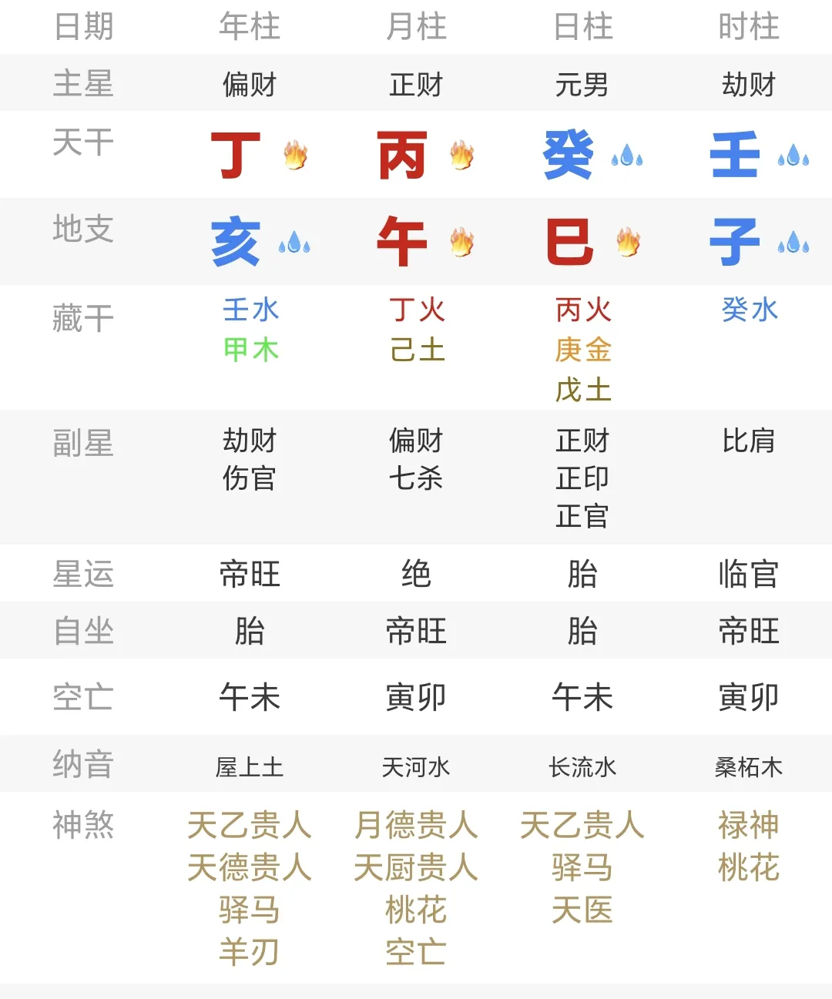
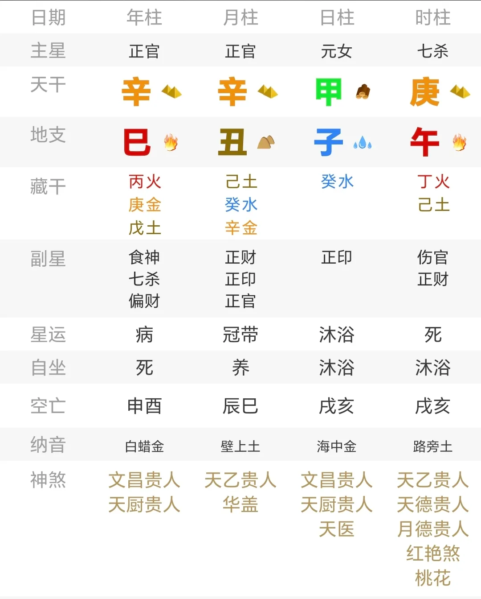
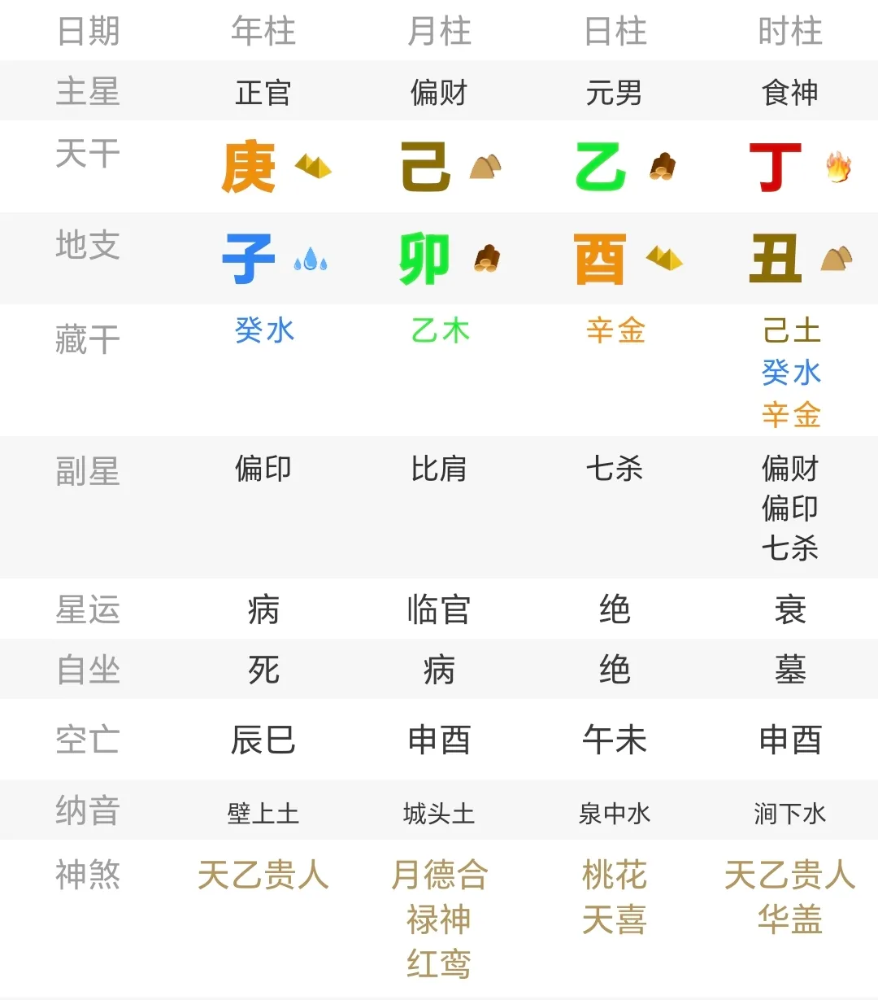

# 八字与历史中的创作者们（一）：职业象征（上）

几个月前，我有很长一段时间热衷于寻找各个作家，画家和音乐家的命例，毕竟没有什么能比一个人的作品更能呈现这个人的独特气质，更何况自媒体的创作者本身和这部分人就属于同类，好奇之心难免。

不知不觉命例就积攒了百来个，也因而能总结出一些比较有意思的规律。

或许是由于文化差异和一些历史因素的影响，八字案例中想找到涉及妻财子禄寿的论断还算容易，互联网上留存的案例除去特定类型的普通人，就以中国名人居多。

相比之下，外国人的案例是缺失的，并且也主要集中在权贵名人上。

想找到戴安娜王妃、梵高等人的命例还算容易，但如果小众一下，寻找拉康、弗洛伊德、洛夫克拉夫特、艾略特这样的人呢？恐怕很难找到吧。

也正是基于以上种种缘由，我打算开个系列对这些创作者们做一个群像描绘。

这个系列没有什么书写逻辑，纯粹属于想到哪写到哪，也或许某天就停笔了，又或者在很久以后重启。

在此再介绍一下 astro databank 这个由国外占星师搭建的，较为专业和系统的出生时间数据库网站。本文的所有出生时间均引用自该网站。

## 概述

在开始这个系列时，请容许我说一句，当前互联网上大多数关于“什么样的八字容易成为艺术创作者”的理论，是大有问题的。

基本上一开互联网，对于如何在八字中刻画艺术创作者，大家的第一反应也都是从食伤入手，用诸如食伤旺、食伤配印之类符合刻板印象中聪明有文才的论述去描绘。

对于作家还会从五行的木火、金水两个组合去描绘，毕竟这两种组合在文字方面公认评价比较高。

然后就有了类似这样的东西：

但只要稍微多翻一些著名作家（或者不限于作家）的案例，又或是去细化一下特征，就会发现这些判断很难站得住脚。

虽然说，同个八字的人、或者配置相似的人，也未必都会选择写作，有的可能会转向绘画、作曲等领域，这是客观存在的现象。

但是在判断一个人是否有成为作家的可能性上，上述描述的逻辑不仅含混不清，方向还大有偏差。

既然食伤泄秀的人适合创作，那食伤虽然泄秀但是被印完全制死的能么？

既然食伤和印都和创作有关，那么八字中一个食伤和印都没有的人，能成为创作者么？

既然木火和金水和文化文艺相关，那么金土、水火、金木、水木、火土之类的组合能成为创作者么？

既然印或者食伤为喜用可以是艺术创作者，那么具体来说，仅仅是喜用就足够了么？

来看一些“反直觉”的案例。

子月乙木，官杀并透，天干上一个食伤和印都没有，伤官远在年支且羸弱，也没有明显的金水或者木火的气势，这个人能成为创作者么？

实际上真的能，并且相当知名，因为他的名字叫福楼拜，文学史上留名的人物，所有的大型图书馆里不可能不收录他的著作。

当然，如果要坚持市面上常见的说法，也确实能圆一下，比如偏印帮身所以聪慧等等。

那么这个就不太能让人联想到创作者了：

一个食伤和印全无，是很彻底的比劫制财局，很纯粹的水火气势，但这位非但不是商人，反倒是个艺术家，名为 Gustav Pressel，一位钢琴家和作曲家。

又或者，如果要找一些食伤受制但是著名的创作者的案例，也并不难找到，例如：

申月癸水，伤官干支俱损，然而这并没有断绝这位命主的艺术道路。实际上，他的名字是洛夫克拉夫特，上世纪最著名的恐怖文学作家（甚至没有之一）

再补充两个：

子月己土，全盘最明显的是纯粹的七杀气势，无印帮身，食神也就藏在丑土库中。

然而同个八字的这两人不约而同地都是艺术家，一位名为胡安·佐德里拉·圣马丁，一位名叫Jerry Daniels。前者是乌拉圭民族诗人，甚至被印刷在了纸币上，后者则是美国音乐家、吉他手和男高音。

在浏览完上述案例之后，我相信很难不对传统的艺术创作者的判断方法提出质疑。

## 十神判断

很多人没有意识到创作者之所以是创作者，有一个很重要的特点，**就是这部分人能够通过创作获得社会地位或是金钱收入**。

这才是职业和爱好者的区别，也是很多青史留名者和半途而废者的区别。

因而，艺术创作者的核心特征，跟食伤是否受克和是否旺并没有必然的联系，真正核心的特征，**是食伤能够以某种方式与财官建立联系，这才意味着创作获得经济利益或社会地位**。

具体来说，最常见的一种情况是食伤透干，而坐下就是财官，或是财官透干，而坐下就是食伤，这个特征在艺术创作者中至少能占到一大半。

譬如：

弗吉尼亚·伍尔芙，意识流文学作家。

詹姆斯·赫伯特，恐怖小说作家。

当然，这个象征在一些人看来似乎并不是很充分，因为同一天出生的人可以都满足这一特征，所以有必要对此进行一定的约束。

不妨加上这么一个条件——**上述结构必须直接呈现在时柱，或者和时柱紧密联系，毕竟时柱象征成果，也代表八字中差异最明显的部分**。

不难看出，上面两个案例都符合这个条件，而且还能找到更多例子：

乔治·塞菲里斯，希腊诗人，诺贝尔文学奖获得者。

希尔顿·詹姆斯，英国畅销书作家。

实际上上述判断也并不仅限于食伤，**将食伤换成印同样能够成立，只是这会较大程度改变其表现的气质 —— 向学者方向发展，这时候呈现出来的就更有可能是撰写教科书的人，而不是只是一个文艺创作者**。

譬如：

加缪，法国作家、哲学家，诺贝尔文学奖获得者。

罗伯特·汉德，占星师，一个占星爱好者几乎不可能不知道的名字，因为他是占星书籍的作者、占星教学者和手稿翻译者。

仅仅是上述特征已经足以对至少一半的创作者做出判断，更不用说当食伤或者印成为了八字中某些关键点的时候，其应验概率还会进一步增加。

这里的某些关键点，可以是全局调侯用神，可以是格局用神，也可以是在地支关系或五行流通上扮演重要角色的字。

比较典型的有：

开国领袖。看出他为什么能同时是许多社会理论书籍与诗歌的创作者并不难，不是么？

沈从文，中国著名作家，历史文物研究者。

此处丁火坐丑土偏财，又为杀库，自身为调侯用神，年月正印气势明显，丁火被壬水遥合也好，地支无根也罢，都不影响他在文艺上呈现出一定的才能。

与之构成对照组的还有一位知名人物：

巴斯特，著名的巴氏消毒法的发明者。

尽管他在历史上较为知名的身份是生物学家，但实际上据记载，这位科学家在童年的一大兴趣是绘画，在贝桑松皇家学院拿过文学学士学位，1847 年还拿到了哲学博士学位。

生物学只是这位文理双通的天才的其中一部分才能罢了。

除去财官 + 印/食伤的组合，将财官换成比肩，并且该结构尽可能呈现在时柱，也能增强成为文艺创作者的概率，这一点在很多作家身上反复出现过，譬如：

余光中，写下《乡愁》的著名诗人。八字中时上食神坐禄，地支伤官通过三合局与比肩、偏财完成了联系。类似的配置还有一位：

Petroccio Montalbetti，意大利音乐家。虽然此处的午火伤官没有和财星构成关联，但是时上食神禄在巳火，与正官构成了联系。

再来：

阿加莎·克里斯蒂，英国著名推理小说家，也是推理文学界的宗师。这个八字的象征就更加明显——整体构成了食伤对七杀的制局，进而塑造了她的作品气质。

## 检验

用一篇文章写明判断技巧似乎不太够，因为仅仅上述判断还不足以看出一些作家为什么能成为作家 —— 为此，还需要从其他十神以及干支方面考虑。

不过不妨先做一件事情，就是检验一下上述判断思路是否真的能确定作家，或者退一步，文艺创作者。

如何检验？

依据创作者的八字，找到决定其成为创作者的关键结构，如果确实是这个结构，那么具备这个结构的八字里，创作者的比例将极大程度地增加，因为其他字可能会破坏这一结构，也可能不会破坏。

篇幅限制，这里仅列举一个例子：

前文曾经出现过的，詹姆斯·希尔顿，英国畅销书作家，代表作有《消失的地平线》

八字时柱食神坐偏财，地支与子水偏印和酉金七杀都产生关系。

其实决定他成为作家的结构除去时柱外就是地支的两个酉金，不仅是因为酉丑拱合使得食神间接和七杀相关，还因为酉月乙木凋零，天干上的这个食神是为数不多能向官杀施压的结构。

进而，依照这五个字检索，可以找到其他几个文艺创作者命例：

Leon Rooke，加拿大短篇小说家，作品三百多篇，可谓高产。

Shirley Conran，英国记者，畅销书作者，多部作品被改编为电视剧。

如果把条件放宽，演员都一并算上的话（表演姑且也算一种创作，也有作品），那么还有这几位：

Andre Alerme，法国电影演员。

Ian McShane，英国演员。

实际上这五个字的条件限制已经过强了，导致能找到的命例数量大大减少，可以把日支的条件再去掉，也就是依照酉月，乙木日主，丁丑时来检索，那么能找到的命例（不包含演员）就更多了。

为了节约空间，此处不插入图片，仅文字叙述：

------

乾造，己亥 癸酉 乙未 丁丑；Steve Passeur，法国剧作家。

乾造，壬戌 己酉 乙未 丁丑；Cornell MacNeil，美国著名男中音。

乾造，庚申 乙酉 乙巳 丁丑；Zachary Levi，美国歌手。

乾造，戊辰 辛酉 乙亥 丁丑；Oswalt Kolle，德国性教育家，作家。

乾造，壬寅 己酉 乙丑 丁丑；Francesco Jovine，意大利作家，记者，散文家。

乾造，壬申 己酉 乙未 丁丑；Nick Jonas，美国歌手、词曲作者与唱片制作人。

坤造，庚午 乙酉 乙亥 丁丑；Joni James，美国流行音乐歌手。

乾造，庚戌 乙酉 乙卯 丁丑；Mark Immelman，南非播音员、作家。

坤造，庚寅 乙酉 乙卯 丁丑；Sherrie Hewson，英国演员，主持人，小说家。

乾造，己丑 癸酉 乙丑 丁丑；Richard Hell，美国歌手、词曲作者、贝斯手、作家。

乾造，癸未 辛酉 乙亥 丁丑；Irwin Goodman，芬兰流行歌手。

坤造，壬辰 己酉 乙亥 丁丑；Rebeca Eigen，美国设计师。

乾造，甲午 癸酉 乙亥 丁丑；Francois Desnoyer，法国画家。

乾造，癸巳 辛酉 乙亥 丁丑；Pascal Cribier，法国景观设计师。

乾造，甲子 癸酉 乙卯 丁丑；Joe Allison，美国词曲作家，唱片制作人。

------

以上，就是部分对文艺创作者的判定方法。剩下的部分，后面再叙。