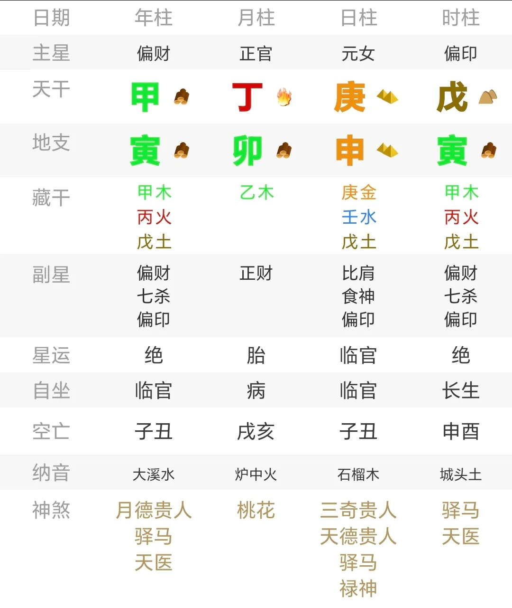
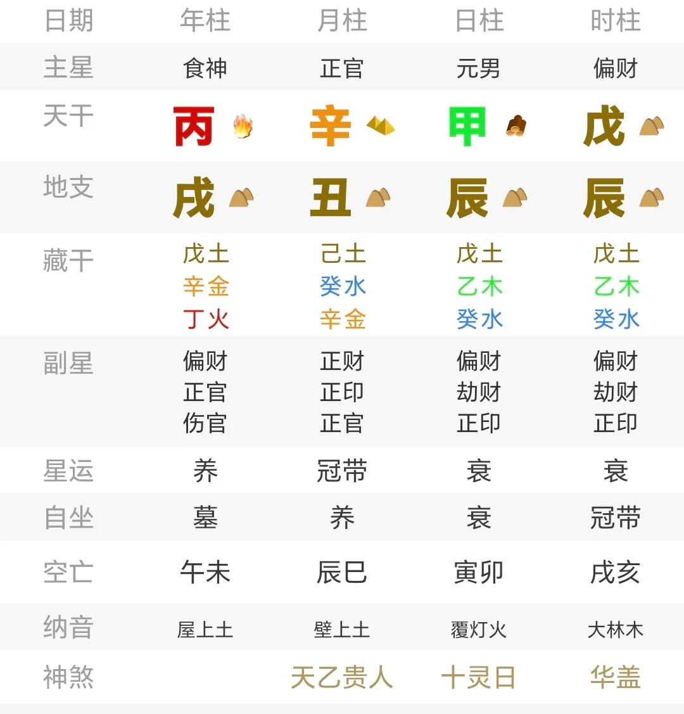

# 八字与历史上的创作者们（二）：职业象征（下）

紧接上一篇，[八字与历史中的创作者们（一）：职业象征（上）](http://mp.weixin.qq.com/s?__biz=MzkxMTM5NjUxNg==&mid=2247485139&idx=1&sn=6daa65fd7d6fe1de727f99b4f886be16&chksm=c11d9d18f66a140e9798ee0689fb8d399298dac06928aaa8c488cc48a1703df82356bbe7ac76&scene=21#wechat_redirect)

之前谈到的是时柱出现食伤并且与财官构建联系时呈现的文艺创作者的倾向，顺着这个思路或许能筛选出这一群体的五六成，但是剩余的部分却并不是这么容易被归纳出普遍规律。

这篇就继续浏览命例。

## 概述

其实，不仅是食伤与印，在实践中可以观察到，财星同样可以和创作相关。

对此可以马后炮解释一下，财为积累积蓄，如果这种积累积蓄不是体现在现实物质层面，即金钱与财富，而是体现在精神层面，即知识与作品，那么指向创作者似乎就变得合理起来了。

最典型，或者说极端的一种情况，是比劫较为虚弱而财星过于强旺，即便全局不见一个食伤，也会极大增加拥有作品的概率，身弱难担财，自然财富将转向精神层面；在这种情况下指向的创作者，作品必定不会匮乏，大多擅长散文、诗歌或是情感丰富恣意的小说，尤其是言情小说。

先找一个有食伤的典型案例：

André，Barbault；法国占星家，著作五十多本。时柱已经具备了上一篇文章叙述的食伤与财官关联的结构；如果实在没有，也没关系，可以看下面这个无食伤的典型案例：

Jean-François，Deniau；法国散文家，小说家，并且还是政治家与外交家。

验证方法也相对简单，地支全是财星会是一种容易出现创作者的配置，因为在这种情况下，财星足够强旺，而比劫却很难与之抗衡。感兴趣可以自行探索，这里仅选取其中一部分罗列。

坤造，庚辰 丙戌 甲辰 辛未；Daniele Sallenave，法国小说家，记者，文学教授。

乾造，癸未 乙丑 乙丑 丙戌；Françpis Saint Cyr，法国兽医教授，出版教科书。

乾造，己丑 辛未 乙丑 丙戌；Francisco Jose Lombardi，秘鲁电影导演与编剧。

坤造，己未 丁丑 乙丑 丙戌；Anny Gould，法国歌手。

乾造，辛未 辛丑 乙未 庚辰；Ivan Davis，美国古典钢琴家。

乾造，甲辰 戊辰 甲辰 乙丑；Andy Bell，英国流行音乐歌手。

乾造，戊午 戊午 壬午 丙午；Andrew Forsyth，苏格兰数学家，作家。

乾造，丙子 庚子 戊子 壬子；Jerry Grant，美国音乐家，作曲家。

… …

上一篇文章里一则留言有提到一个困惑：

> 这篇太棒了！不知道作者有空能不能分析一下玛格丽特杜拉斯的八字，原局财官印能写出那样的作品，有点理解不了

杜拉斯的八字如下：

其实这并不值得奇怪，财星旺盛而比劫偏弱的人，最典型的特征之一就是情感丰富，心思细腻，而且对人际关系有极大的需求与依赖。

杜拉斯也并非是此类配置的独例，法国作家中还有一位熟悉的人物配置与之相似——比劫占下风而财星占上风：

罗曼·罗兰。

对了，对于占星爱好者而言，还有一位熟悉的人物，罗伯特·左拉：

## 虚财

比劫偏弱而财星过旺是一种较为鲜明但同时也不怎么常见的配置，与之相反还存在这样几种情况，同样也会指向作家：

第一，财星在年月被盖头截脚，也就是所谓虚财为名气的逻辑，此时财星上下的印或比劫最好与时柱产生关联。典型的例子有：

Louis Bouihet，剧作家，诗人。

斯蒂芬·金，美国著名恐怖小说家，《闪灵》就是他的代表作品之一。

Elizabeth smither，新西兰诗人与小说作家。

Jose Carlos Ary Dos Santos，葡萄牙诗人。

Lucien-Marie Pautrier，法国皮肤科医生，同时也是教科书作家。

第二，全局财印气势明显又构成交战。

洛夫克拉夫特，20 世纪最杰出的恐怖小说家之一。

George William Weidler，美国萨克斯演奏家和词曲作家

与之相似度极高的还有：

Charles Spindler，阿尔萨斯地区画家，作家及摄影师。

Diego Haidar，巴西记者。

这两种情况也并非完全矛盾，可以同时存在，譬如林语堂：

## 结语

这篇和上一篇所罗列的对于创作者的判断方式，彼此间也并非完全独立，甚至可以任意组合混搭。案例诸多，仅罗列几例：

徐乐吾。月柱七杀坐食神，食神又与日时偏财关联，而财星均被盖头，皆是作家象征。

Joseph Crane，占星作家。年上伤官坐正财，财在年月受克明显且比劫偏旺，均是作家象征。

胡适。年月正偏财根弱又受克泄，日时干坐食神又与七杀作用，均是作家象征。

弗洛伊德，心理学家，精神分析师。时柱偏财坐食神，地支成食神局，偏财根弱，又与印交战，均是作家象征。

儒勒·凡尔纳，著名科幻小说作家，著有《海底两万里》等。时柱七杀坐伤官拱合禄地，年柱财印交战，均是作家职业象征。

这样的群像也不得不让人思考，创作者在人类文明这千百年来，究竟扮演着怎样的社会形象，文艺创作又为何会与食伤与财相关 —— 二者恰好是和主体（比劫）直接相关的行为。

> 克洛德·西蒙在被杂志《巴黎评论》采访时曾这么说：
>
> 《巴黎评论》：那么，作家在社会中的角色是什么？
>
> 克洛德·西蒙：改变世界。每当一个作家或艺术家以甚至只是稍微有些新意的方式“讲述”世界时，世界就会被改变。

这不由得让人想起《人类简史》里的一段话：

> “讨论虚构的事物”正是智人语言最独特的功能。… … “虚构”这件事的重点不只在于让人类能够拥有想象，更重要的是可以“一起”想象，编织出种种共同的虚构故事，不管是《圣经》的《创世记》、澳大利亚原住民的“梦世记”(Dreamtime)，甚至连现代所谓的国家其实也是种想象。这样的虚构故事赋予智人前所未有的能力，让我们得以集结大批人力、灵活合作。

也只有读完这段话后才能察觉，为何火五行可以指向文明，在神秘学特长中偏向法术，又是一个在创作者中很经常出现的五行。

所以，这个系列的文章真的是在叙述创作者的占断思路么？

只是在寻找人类文明中的不符合刻板印象的“法师”罢了。