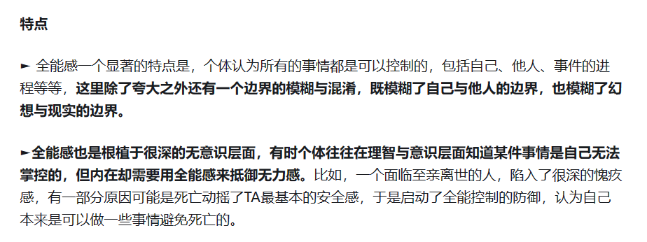

# 我并不认为在占卜中做形式大一统是值得追求的目标

在提笔写下这篇文章时，我很难不回想起我在大概十天前刷到的一条动态，具体图片就不在这里附上了，核心思想大概是这么一回事：

> 八字、大六壬和六爻技法互相使用可以实现跨学科降维打击。

再往深层一挖，更核心的理念大概就是：

> “学科越多，模块越多，越好使，如果不好使就实战把好使的抓出来”

这样的核心理念看似无懈可击，但却很难不让人产生一种怪异的割裂感：

一面是圈内最喜欢的“某个祖师传下/拥有完美无缺的理论，只要寻得真诀就可以屡占屡验了”的信念。

另一面是历代的后人们总是爱把各种理论进行杂交，少用六亲的术数补上六亲，不玩旺衰的术数补上旺衰，不同版本的十二长生要大一统。

哪怕是发源自阿拉伯的扑克牌，来了中国本土，就算你是天王老子，带了四个花色，那也得多个五行地支对应：

这篇文章，就一吐为快。

## 01 学科史

在讨论把多个学科的不同技法互相交叉是否能够提升实践效果之前，首先需要明确的一个事实就是 —— 一门学科从创立开始到往后几百到上千年的发展历程里，其理论本身并不是固定不变的。

也就是说，哪怕是只学习一门学科，其实也相当容易出现“拿后朝的剑砍前朝的人”的人的现象。

以塔罗举例，牌阵概念自出现雏形再到成为一个固定的名词，在历史中有着非常生动的演变过程，拿着“如果一个人不用78张牌进行塔罗占卜说明这个人不是合格的塔罗师”进行知识普及的人，可能不知道历史中从一开始到后世一直存在着不用完整塔罗牌进行占卜的例子，更不用说发现“牌阵”这个词在历史中的变化。

以占星举例，意识到中文概念的“星座”，在英文中对应 Sign（符号）而非 Constellation（天文星座）的人，已经不是多数，更不用说注意到 Sign 这一英文术语翻译实则丢失了一个相当灵魂的含义 —— 希腊人称呼的 ζῴδιον 实则有“图像/画像”的含义。当我们用 Sign 称呼星座时，我们往往忘记了希腊人眼里的星座，是巨大的天空中的画像。

于是，摩羯成了霸总，天蝎成了腹黑，金牛成了抠门，被娱乐化星座信息荼毒的人不会意识到摩羯是半山羊半水生生物的躯壳，天蝎就是毒虫蝎子，金牛就是被阉割了一半的公牛。

以八字举例，十神给人带来的架构完美的错觉如此之深，以至于大家似乎都忘了劫财、伤官都是围绕财官定义的十神，如果说“女人不是天生的而是被变成的”，那么劫财伤官恐怕真是不折不扣的“第二性”，啊不，第二神。

传统的占卜命理圈内对学科史的忽视如此之深，以至于不分时代地乱用不同传统，尬解古籍，已经成了一种普遍流行的现象：

比如说，在今天，你甚至能看到有人用现代占星的冥王星象，去征理解韦特塔罗里的审判牌，而冥王星被发现的时间，是1930年。

## 02 思维惰性

不分前提，不分应用场景地套用理论，其背后呈现的是人惯有的思维惰性，这种惰性往往体现在两个方面：

第一，认为用当今的理论，可以充分理解过往的理论，而不需要从源头出发，从理解过往理论的演变过程开始重新审视和理解当今理论。这是纵向的惰性。

第二，认为一个学科的理论具有某种“全能性”，可以无限制延伸到其他任意学科，而不需要站在比较的立场进行审视。这是横向的惰性。

提起这个，我就不由得想起几天前朋友闲聊时发表过的一个关于社会的见解，恰好当时我正浏览过一篇文章，其中就提到了这种理念的局限性。

社会可以被视为是巨大的生物吗？

（征得老哥同意，故分享）

当然这种惯性无可指责，一切学科大厦无一不是从这样的推想出发，一砖一瓦叠起来的，并在摸索中不断前进。即便是我也得坦白说，过去我也犯过不少这样的错误。

相比于犯错，更值得警惕的是没有意识到犯错的存在，尤其是横向的惰性，其背后隐藏的对学科知识“全能”的渴望，是占卜命理圈中普遍存在的现象：

学完了梅花易数，就下意识地认为，一切其他占卜术都必须并且能够使用体用的思路拆解；学完了八字，就下意识地认为，六壬中五行的流通气势比贵神与支神象义更加重要。

这种对工具全能的渴望，还外溢到了更大的方面：期待一个八字一张星盘，算出人生从横向到纵向方方面面的一切细节，期待一次占卜，得出问卜者从外貌到家庭点点滴滴的生活琐事 … …

最终导向的问题，是在翻车后绞尽脑汁圆卦，最终有意无意地PUA自我或他人，归结与心不够诚或是诀不够多，进而继续更大的恶性循环。

说到底，对工具全能的渴望，又何尝不是一种防御机制呢？又何尝不是更大的全能渴望的具体呈现呢？

随手摘自网络资料中对全能感的诠释

## 03 文化内核

抛开学科史不谈，也抛开工具是否具有全能性不谈，很多人或许没有意识到，每一门占卜术命理术都有自身独特的文化内核，而非是能够普适的、不随时间空间改变的客观规律。

当然，将它们视为一种客观规律的思路也无可厚非，几千年前托勒密就是这么想的，于是他提出占星预示命运是由于星体的光线对人产生了各种影响，几千年后现代占星开始发展时，也有人是这么想的，于是搞出了各式各样的模型：

摘自《生命四元素》

同样，我们也能看到，上个世纪对占星的大规模检验里，有相当多彼此冲突、互相矛盾的研究成果。其实比起自然科学，占卜术和命理术更像语言，更像是文化的产物，不同的体系、不同的模型犹如不同的语言，用符号象征化地描述一个事物。

因而，没有经受过宗法制洗礼，缺乏对人伦关系、三纲五常的重视的西方人，很难理解为何我国本土的术数里，为何会出现名为“六亲”的系统。

因而，重视世俗功利，缺乏宗教气息的我们，也很难感受到王牌序列里那彼得拉克的游行，那基督教的寓言故事，究竟映射了西方人怎样空灵缥缈的精神世界。

不分文化内核地强行嫁接，犹如在汉语中加入词汇的阴阳性，加入时态，在英语中加入各式各样的量词。与其说是学科彼此借鉴，倒不如说，只是把自己一时能想到的东西糊上去而已。

当一副扑克牌的红桃被粗暴理解为大吉大利，被直接用水五行/火五行对应时，到底丢失了什么？

丢失了作为和塔罗中圣杯花色同根同源的血脉，丢失了“神职人员”这个人类社会（尤其是西方世界）中扮演重要角色的群体的象征含义：

> 当我们拓展解释时，根据克洛德·弗朗索瓦·梅内斯特里埃的建议，可以看到在1704年，他提出了对西方社会的四个身份的一种类比，即纸牌游戏是一个和平状态，“由国王、王后、臣民和四个身份组成。教士由红桃（cœurs）代表，因为教士是合唱团的人（gens de chœur）[...]；军队贵族由黑桃代表，这是军官的武器[...]；市民由方块代表，这是他们居住的房屋的瓷砖；而农民由梅花代表。尽管西班牙人使用了不同的符号，但他们也表达了同样的事情，这恰好证明了游戏发明者的意图：教士用圣杯或杯子代表；贵族用剑代表；市民和商人用币（dineros）代表；而工人和农民用杖（bastos）代表。”
>
> ——《塔罗历史、符号起源》

## 04 多元化

除去以上三点考虑，希望缝合概念、系统和技法，试图完成大一统工作的人们，往往会忽略一个事实，那就是多元化本就是人文学科的常态。不同学科的百花齐放，最明显的好处在于避免教条主义。

即便在西洋占星内部，由于承袭不同历史时期的占星家的成果，鄙视与争论从不缺席，最经典的莫过于宿命与自由意志，事实判断与心理之争。

但最美妙之处在于，这样的争论确实无法有统一的、终结一切的答案，两种框架同时存在，同时有成效，也便意味着看待世界与生活的视角自然不是单一的、无趣的、冰冷的，而是丰富的、灵活的、富有生气的。

不同占卜术的存在，实则是提供了映射日常生活的不同视角：纸牌占卜者用点数、花色与图像见到生活，占星家用行星位置与相位组合生命。

以用五行地支穿西方占卜术为例，如此乱炖，只是用拙劣的技巧伪装博学：不管以纸牌为媒介，还是以数字为媒介，都重弹本土术数的老调，人的精神世界，真的要匮乏到如此地步么？

占卜术、命理术作为极富有实践性的学科，在急于进行大一统时，似乎还默认了一个前提 —— 一个工具可以在充分保证泛用性的前提下同时满足所有不同群体的需要，这无疑又是一种对工具全能性的幻想的体现。

事实上，在漫长的历史中，不同群体选择了不同模型，是再正常不过的现象：

> “凡五行之王，各七十二日。土居四季，季十八日，并七十二日，以明土有四方，生死不同。此盖卜筮所用。若论定位王相及生死之处，皆以季夏六月为土王之时。”
>
> ——《五行大义》

## 05 混乱的实践

如果说试图做形式的大一统，是出于实践目的的功利主义之举，那么这种功利主义究竟能带来多大的效果，也是值得怀疑的。

每一门占卜术和命理术，拆分基础要素，都可以被简化为一个个子系统，犹如一家公司的不同部门，彼此共同协作，以高效达成一个特定的目标。

因而，给不同占卜术做形式层面的大一统，譬如说 x 式合一（懂得都懂），这件事本身可以视为将多个小公司拆分合并为一个大公司，并且还多了三点要求：

第一，在重新组建后，业务覆盖范围不仅不能缩小，甚至最好还得更大些。

第二，在重新组建后，业务完成的效率不能低太多，否则没啥意义。

第三，在重新组建后，确保上面两点的情况下，还得保证业务完成的质量不出现下滑（准确率不降低），否则没啥意义。

只要稍微用脑子思索一下，就会发现想同时满足以上三点就是个笑话。

首当其冲的问题是资源分配问题。

子系统的数量在增加，而人脑计算资源不变，那么以人脑有限的运行速度，该把注意力放在哪里呢？管理和协调本身，是否又需要更多资源了呢？

次要一些的则是子系统协同效率与耦合度问题。

子系统的数量增加，但是彼此的功能又是否是独一无二的？如果不是，那么又是否存在冲突，又该如何解决？

写至此处，我不由得想起几天前读过的一篇文章的只言片语，大意是谈到八字中庚见巳为长生，然而巳藏丙火，为庚之七杀，庚在长生处竟然是逢七杀凶神之克，真是怪哉。

其实这压根不该成为一个问题：十神系统，藏干系统，十二长生系统，完全不在同一历史时期诞生，也为不同的目的服务，在这种背景下，系统之间产生冲突是再正常不过的事。

八字内尚且如此，又何况互相乱炖呢？结局，便无需多言了。