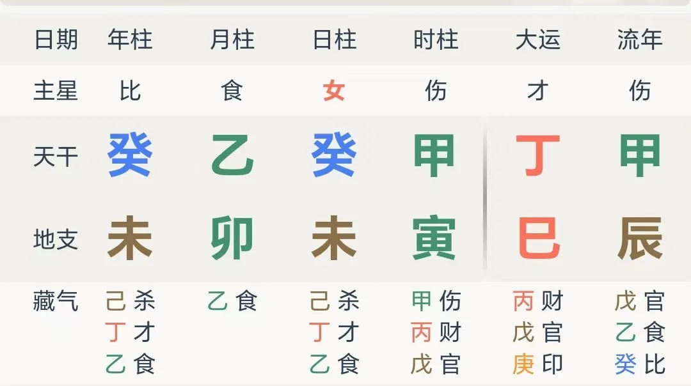

# 草木的故事：乡土，农耕与八字中“根”之内涵

> “从基层上看去，中国社会是乡土性的。”

这是费孝通在那本著名的《乡土中国》中开篇的第一句话。

这句话对出生于现代中国的我们而言既熟悉又陌生，只因成长在水泥与霓虹灯筑成的从林的现代人，对于农耕与乡村已经逐渐疏远了。

但是身为中国人的我们，在层层叠叠的文化基因的渲染下，终归还能对自己文化中的根苗有所记忆。

不管是教孩童吟诵脍炙人口的“举头望明月，低头思故乡”，还是招呼上家人在去年影院的荧幕上见到“带着地球去流浪”，我们总是能自豪地说：

> 对故乡的眷恋是每个中国人不可分割的情感

其实不止是思乡情结特殊，实际上，对于中国历史上几千年的芸芸众生而言，围绕“乡”所相关的一切，是生活中最隐而不显的龙脉。

华夏文明是农耕文明，中华民族的神圣性最早寄托与天地，所生所养的一切，也无不依赖于“天时”与“地利”。文明自泥土中来，早已将泥土的气质沁入了民族基因中：

以农业为生的千家万户，其生计到社会关系都自土中来，世代定居才是常态，迁徙才是病态，非到洪旱兵灾，人都活不下去了，才不得不背井离乡。

这就是中国人特有的象征 —— 每个中国人，都是一株从泥土中长出的植物。

这也是为什么在我看来，相比占星与紫微斗数，八字是最具有“中国味”的命理术，因为其最不可撼动的基础定义，正是用这泥土中长出的植物，隐喻每一个中国人的生命历程：

> “取日干为主，以年为根，以月为苗，以日为花，以时为果”
>
> —— 《渊海子平》

这是最大的一层。

不止整个八字本身是一株植物，细化下，八字中的每一个干支，也是一株小的植物，以天干作为在地上显露的部分，以地支作为地下暗藏的部分，亦暗含天干之根。

八字的通行术语里，既包含对年月日时的论根，也包含对天干的论根。

八字的叙事，也就成了植物的叙事，也就成了芸芸众生的故事

—— 芸字本意便是草木繁茂众多，芸芸众生便是在这片大地上如同植物般活着的人。

而这是独属于八字的诗意。

于是，当理解了宛如草木般活着的中国人，命书中沉寂静默的知识，也就在此展现了无穷的活力。

于是便能理解，跳出最没法有答案的身强身弱，八字中日主象征自我的日主，无根究竟意味着什么。

于是便能理解，**当作为根的年柱跟后面三柱不在一块玩时，究竟会带来哪些层面的割裂**。

于是便能理解，有根可依，扎根在多处有有什么象征，一个人的根，究竟来自何处，能对个人又有怎样的意义。

因为答案本就无需在命书中寻，答案就在世界本身：

> Material 1 —— 论何为日主无根
>
> “转蓬离本根，飘摇随长风。” —— 曹植。

> Material 2 —— 论何为无根变有根

> Material 3 —— 论何以为根
>
> 苏轼的好友王巩（字定国）因为受到苏轼“乌台诗案”牵连，被贬谪到地处岭南荒僻之地的宾州。
>
> 王定国受贬时，其歌妓柔奴毅然随行到岭南。公元1083年（元丰六年）王巩北归，请出柔奴（别名寓娘）为苏轼劝酒。
>
> 苏轼问及广南风土，柔奴答以“此心安处，便是吾乡”。苏轼听后，大受感动，作此词以赞：
>
> 《定风波·南海归赠王定国侍人寓娘》
>
> 常羡人间琢玉郎，天应乞与点酥娘。尽道清歌传皓齿，风起，雪飞炎海变清凉。万里归来颜愈少，微笑，笑时犹带岭梅香。试问岭南应不好，却道：此心安处是吾乡。

附例：

拿破仑，生于法国偏远的殖民地科西嘉岛，家境贫寒，年少丧父，在革命浪潮中加冕称帝，一生策马征战欧洲，二次被流放，百日王朝最终垮台，死后灵柩方归故土。

三毛，著名旅游家、作家，生于重庆，先后游学西班牙、德国、美国，先后于撒哈拉沙漠、加纳利群岛、台湾定居，逝于台湾。

西蒙娜 · 波伏娃，女权运动代表人物之一，作家、哲学家，自幼以哲学与文学为立命之基，一生扎根于存在主义哲学与时代先锋运动。