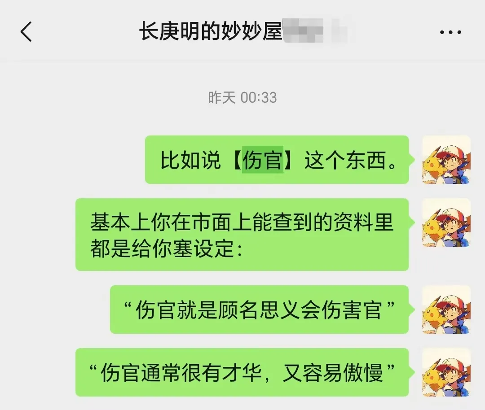

# 被误解的伤官：被冠名“傲慢”“挑剔”，究竟是谁在套刻板印象？

几天前和学生聊到考据，聊到流派和体系搭建的心得时，偶然飘过“伤官”这个概念，这不禁直接触发了我对于这个概念最深刻的回忆之一。

何谓“伤官”？这是一个八字特有的概念。

八字以日干象征命主本人，而十个天干分别对应十神，最终用于描摹人事与社会，以此来叙述一个人的生命历程。

伤官就是其中一个十神。

而命书中伤官多被冠以恶名，除去最广为人知的“伤官见官，为祸百端”之外，还有不少咋一看让人大惊失色的言论：

> 年带伤官，父母不全；
>
> 月带伤官，兄弟不完；
>
> 日带伤官，妻妾不完；
>
> 时带伤官，子息无传。
>
> —— 《渊海子平》

或者民间命书中总有类似这种东西：

> 年坐伤官为用神，得余荫或遗产；
>
> 年坐伤官而为忌神，不得余荫或遗产。

看起来很辩证，实际上是说，有这玩意的话，你家炸了。

稍显中肯的，也便是好坏两面一并叙述：

> 凡伤官格，清而得用，为人恭而有礼，和而中节，人才卓越，学问渊深，反此者傲而多骄，刚而无礼，以强欺弱，奉势趋利。

也围绕着“伤官见官，为祸百端”的共同叙述，增添了许多额外的规则。

譬如伤官以配印为宜，伤官和财组合也能富甲一方，伤官合杀也可得贵，等等，剔开学术表达，朴素点的大概这样：

伤官过重又无财星转化，则终身奔波劳碌，不得清闲，虽巧却贫。

而今人对伤官的理解，是命书的究极浓缩刻板印象版：

十篇中有九篇，止步于 “伤官顾名思义，就是伤害和妨碍（正）官” ，延伸出各种解读，并塞上了诸如“挑剔、傲慢、言辞犀利”之类的标签。

但是你就是没法知道，这玩意怎么和六亲孤克与奔波劳碌扯上关联的。

读完文章可以去搜一搜，一抓一个准。

然而我困惑的地方在于，命书中的经验放在现实好友中去套，基本上一套一个翻车，槽点属实多到数不清 —— 譬如我某位好友，一柱伤官在时，还是纯气，又得顺生，干上既不配印，又不合杀，还不生财。

一个标准到不能再标准的伤官性情的人。

然而，他既不傲慢，也不挑剔，不爱抬杠，也从没叛逆过，甚至温和且受人欢迎，给人的第一印象还乖到不能再乖。

也因而，自然是引发了新的疑问 —— 古籍中对伤官的诠释究竟如何理解，以及这玩意在现代又是怎样的面貌。

## 01 歧途

实际上，如今市面上对于伤官的理解，有极大的误区。这几乎不需要考据，仅从叙述，就能感知一二。

“傲慢、骄纵、挑剔、言辞犀利”，古今命书中对于伤官的叙述，都全然是一种外部评价，而非内部评价。

换言之，尝试去对伤官人的性情做出诠释的时候 —— 是直接春秋笔法地指指点点。

却不曾理解过这些人到底走过了怎样的成长历程，在生命中遭遇了什么事情，又是如何才有了现在的心性。

“挑剔傲慢”，背后的潜台词是  —— “你就是个事逼”。

但有没有可能，“事逼” 的立场和观点是对的？

当明晰这样的问题时，我们也便能知晓，从生活中对他人的感知去理解命书中叙述的配置，虽为本能，但仅有主观感知，而无客观视角，必然走入歧途，造成偏见。

## 02 视角

如何从客观视角去理解？

对于伤官的理解，其中一个至关重要的线索，在于伤官是一种非常“第二性”的事物。

先有了正官，然后才可定义伤官。

就像先定义主，才产生了次，伤官与正官是一并被捆绑着的。理解伤官的钥匙，藏在正官之中。

明晰何为正官，也就知道了何为伤官：

[正官，就是 “中国”](https://mp.weixin.qq.com/s?__biz=MzkxMTM5NjUxNg==&mid=2247485723&idx=1&sn=d2407737cf8f991d50f22347b60df766&scene=21#wechat_redirect)

在这个亚欧大陆东方的某个辽阔的土地，诞生了统一与中央集权的基因，于是在漫长的历史中，或是为了维护自身的存在，或是为了应对周边地缘的挑战，又或是出于各种偶然，中央集权的基因被不断延续。

中央集权意味着网络的中心化，最中心之处就是最高的君王，即是正官。

或者也可以说，正官便是“中心及其塑造的秩序”。

那么究竟什么是中华文明千年来沉淀的 “中心的秩序” ？

最经常在日常生活中存在而不觉的，是宗法分封礼乐制度，是人伦关系君臣父子。

所以何为伤官？伤官就是，你不会在 “中心的秩序”里。

伤官，在中国历史中最典型的原型之一，便是

“ 流 民 ”

## 03 得解

当流民意象被点破，我们获得了一个新的客观视角时，命书中的诸多论断便迎刃而解。

中华民族是一个对根有极为浓厚的情结的民族：

[草木的故事：乡土，农耕与八字中“根”之内涵](https://mp.weixin.qq.com/s?__biz=MzkxMTM5NjUxNg==&mid=2247485741&idx=1&sn=837c52bfdfc2f72bd2badf60524d4865&scene=21#wechat_redirect)

宛如植物，非必要不离乡土，离根便飘摇。

而所谓流民，就是一种离根的群体，在中国历史中，是因战乱、自然灾害、土地兼并等原因失去土地和生计的农民，在现代最典型的形式之一，便是各种层面的移民。

没有政府会喜欢这样的群体，管理这样的群体有多令人棘手，看看欧美就知道了。

于是命书论断便可得解：

> 年坐伤官为用神，主得余荫或遗产；
>
> 年坐伤官而为忌神，主不得余荫或遗产。

伤官在年，意思就是你的家族里出现了“伤官”的意象，放在古代的语境里，又落在普通人身上，自然是家族里头出事不得不成流民了。

既然这样，那下一步就看下有没有东西收拾能带走吧。当然，在人口流动性大大增强的现代，可能这也只是象征长辈是外来人口。

也因“流民”，也就知晓命书中为何能论奔波劳碌 —— 因为答案就在字面上。

伤官过重又无财星转化，则终身奔波劳碌，不得清闲，虽巧却贫。

反过来说，伤官生财可以论富，其内涵并不在五行生克。古时商人中多有外地奔波贸易之人，伤官配财，正有在多处奔波贸易的象征，也便自然可以论富。

于是也便能知晓，为何现代社会里，投机创新之人里，伤官并不罕见，因为正官所不能彻底掌控的领域，便是伤官作为的天地。

于是也便能知晓，为何今人见伤官流年大运，不论喜忌如何，总能应跳槽出国之事，因为在这些事件里，人扮演的便是“流民”的角色。

于是也便能知晓，为何虽然总有人说“命带伤官不宜考公考编”，但基层的体制内却并不缺命带伤官配置之人，尤其是基层警员，因为总有一些岗位，是注定要接触大量流动人口，还是良莠不齐的人。

于是也便能知晓，为何小众性取向人群中，可见伤官配置，因为这种关系本就不在“正统的人伦关系”中。

于是也便能知晓，为何伤官配置会带来不一样的价值观 —— “流民”群体自有其三观，是天然与正官及其追随者向左的，当后者成为多数时，被赋予偏见也是再自然不过的事情。

------

这便是四柱中的中国，一切知识并不枯燥，一切知识都有迹可循。

丢掉命书中的良莠不齐的陈词滥调，剔除网络上以讹传讹的刻板印象，我们才能见到真正的社会与生活。

见到不被他人定义的生命。