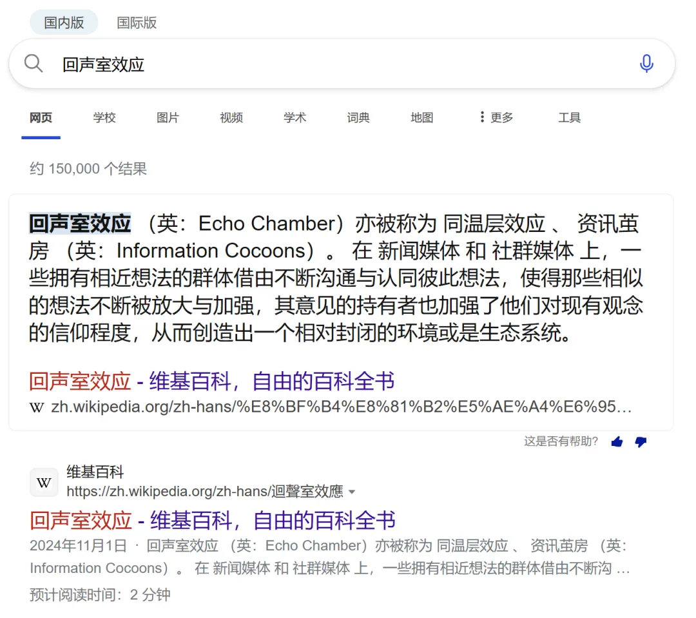

# 正偏印之争：一款复古风味的《再见爱人》风波

在正文开始之前，先解释一下为什么这个月的主题叫“八字如梦”吧。

首先诗是我随手填的，前后花了不到两分钟，不用去琢磨有没有啥深刻内涵，纯属为了营造氛围感。

其次，这个诗确实可以有内涵，无心插柳，妙手偶得，我和好友聊天时，她曾经说过这么一段话，大意差不多是这样的：

“有一段时间我经常找别人算命，不是为了别的，而是想看一看他们能算出来什么东西。”

“总感觉像是在听别人的故事，每一个人讲的故事还不一样。”

于是，便很自然地感慨，八字如梦 —— 当你在算八字时，不管是被人算准还是把人算准，都可以有这么一个疑问：

“到底是你变成了八字，还是八字变成了你。 ”

除此之外，也还有另一种我个人心目中“八字如梦”的真正含义：

> 八字中最重要概念之一的十神，命书中散乱不堪、只给设定不给原理的知识点，其实在中国漫长的历史中，都确有其痕迹与原型，宛如梦境中的种种象征。

当翻阅八字时，你将恍然意识到，

千年的炎黄子孙，都千年千里共婵娟，也都同住在一个“中国梦”里。

## 01 印象

延续前几篇的风格，上一篇是伤官（[被误解的伤官：被冠名“傲慢”“挑剔”，究竟是谁在套刻板印象？](https://mp.weixin.qq.com/s?__biz=MzkxMTM5NjUxNg==&mid=2247485755&idx=1&sn=ce239071f7c7f73c6f1e4c7b574eedca&scene=21#wechat_redirect)），这一篇则轮到了偏印。

偏印可以说是十神中最让人莫名其妙的概念之一，互联网上能找到的绝大部分对偏印的刻板印象，基本可以归纳如下：

第一反应，是这玩意也叫枭神，是后妈，会夺食，要么让人贫贱，要么就抑郁。

第二反应，是觉得“印”为文化知识，偏了，所以就非主流，就小众，就孤僻，就自闭，就多虑，就和人群格格不入。

第三反应，是觉得这东西好像也可以让人很聪明，很有技艺，所谓灵枭得用等等。

对以上这些种种印象，市面上几乎一切的原理推导，最终也基本归为“偏印比正印生得更猛”“枭神”等抽象的理解，至此就难有新意，无法再进一步。

也没法看到彼此的因果关联 —— 凭什么偏了的印，就可以让贫贱、孤僻、聪明和技艺这几种东西随意组合在人身上呈现，这些东西底层难不成没有更实在的现实来由了么？

ok，看到这里，可以大胆在文章下方点赞并转发了，这篇文章将刷新你们对偏印的一切理解。因为我将带你们走进历史，理解偏印的精髓，乃至融会贯通正印，甚至不需要三分钟。

## 02 历史

在中华文明的萌芽时期，周人奠定了一种将封建等级、文明等级和空间等级合而为一的结构，正如《国语 · 周语》所述：

> “先王之制，邦内甸服，邦外侯服，
>
> 侯卫宾服，蛮夷要服，戎狄荒服。”

这实际上描述了一种同心圆结构，以天子为中心，圆向外如同水波式扩散，由内向外，随着空间距离的增加，文明程度逐渐变低。这种空间的结构化想象直接影响了后世大一统王朝的行政区域规划，上下千年。

也同样逐渐酝酿出了一种，诞生在中原农耕区的，名为“中原中心观”的文化庞然大物 —— 你在各种历史小说和古装剧中，不可能见不到它的影子。

在这种观念下，一个生长在内蒙古的小孩，可能在阅读《满江红》的“壮志饥餐胡虏肉，笑谈渴饮匈奴血”时热血沸腾，然后长大忽然意识到：

“好家伙，蛮夷竟是我自己。”

在这种空间秩序下，中原文化既成为了中华文明的主流文化，又成为了在贸易、战争、人口迁徙等因素影响下的文化熔炉，生生不息地孕育着新的中原文化。

也在这种空间秩序的熏陶下，儒家士大夫们把持了中央朝廷的文化权利，在大一统的事功和道德的双重诱惑下，不断“移风易俗”、“以德化民”，将不同自然条件下形成的地方性文化整合为的统一范式。

那么，中原之外是什么呢？

> 中原儒家秩序之外，最典型的一种秩序，是游牧民族的部落生产共同体秩序。因征税成本远高于税收，游牧民族无力建立中央财政体系，只依赖熟人关系治理，与中原儒家秩序格格不入，而关外恰好成为了草原 - 中原的过渡地区。
>
> 另一种典型秩序，是西域因复杂的历史原因带来的贸易发达与长期失序共存的秩序，更深的线索则是中亚地区的历史。
>
> 除此之外，还有两种不太容易为人所注意的秩序：
>
> 一种是诞生在青藏高原雪域的秩序，因交通恶劣与生产贫瘠，加上当地文书系统建立时间的相对落后，官僚系统天然地在此也失灵了，只有低成本运作的组织模式最适合此处，于是宗教成为了高原上秩序的核心。
>
> 另一种则是诞生在东南沿海的秩序，因海洋的开放性天然消解了集权管制的胚胎，最终构成的是一种以宗族为核心的自生性的贸易秩序。

以上这段文字，以及其浓缩的方式，阐述了正官、正印、偏印之间的关系，以及在正官正印管辖之外的偏印，在历史中究竟是怎样活着的。

## 03 回归现代

理解这段历史有什么意义呢？

当理解了这段历史后，我们便能知道，正官正印浑然一体，正印是正官延伸自我的文化手段。

我们便能知道，正印具有传统、包容的性质，这根本无需记忆，因为正印便是中原文化本身。而能留下经典古籍、著书立说的命书作者，这一群体的屁股注定了他们天然地青睐正官正印，言其“最为清贵”。

我们便能知道，正印是天然政治正确的，是共识性的，这完完全全是字面的意思，不具有任何褒贬倾向。

这也是为什么我在标题里能调侃 “正偏印之争是一种复古风味的再见爱人风波” —— 现代互联网下舆论发酵，在混沌的信息流里，必然最终形成一种主流政治正确，这自然是一种“互联网正印”。正出现之后，也就自然有了偏。

也因正印的凝聚性和向心力，自然会将其他不够正的，驱逐到各个角落里。正印偏印之争，无时无刻不在发生。这些可以被浓缩在传播学中的一个术语里：

当然，“正印”也好“偏印”也罢，都可以是不够正确的。

我们也便能知道，偏印的本质是一种“不在中心的地方性的文化”，因而偏印本就不仅代表宗教玄学，包括且不限于各种各样的地方性非遗，必然也在偏印的范畴里。

我们也便能知道，正印作为文化中心的提纯，与之相对的偏印，自然也是和文化中心的隔阂；正印代表了时代潮流，那么偏印则是不属于时代的隐士 —— 不属于时代的意思是，既可能极度超越而成为先锋，也可能极度落后而牛鬼蛇神，更可能和社会脱节。

我们也便能知道，放到国家的视角去看，偏印是草原、西域、海洋等象征的浓缩的话，那么放到现代、放到城市的视角，正印犹如四通八达的枢纽性文化大都市，而偏印则是穷乡僻岭式的乡野。

也便自然能够明白，古人为何能用偏印论贫贱孤穷。

也便自然能够明白，偏印的孤僻、自闭和警惕心，其实就真的只是写在字面上的。

也便自然能够明白，偏印自带着一种避世生活的匠气，当工业化成为主流时，不在工业化里的自然是匠人，也便能知晓偏印为何能带技艺。

至此，偏印最主要的复杂意象，已经全部叙述完毕。对命书的理解，从来都要在生活中寻，一切的答案，也只在生活里。

不见生活，无以学命。

------

PS：插一句题外话，玄学圈里用八字看玄学天赋，是一向以偏印为尊的。

当我们认识到偏印在中国的历史原型时，也便能知晓，偏印本身仅是一团象征，不代表好坏与吉凶。

但如果有人真的将偏印当成了了不得的圣物，仿佛自己命带偏印，就得到了某种至高无上的册封的话，我觉得，不妨这么回应：

“是的，你偏印，你全家都偏印。”