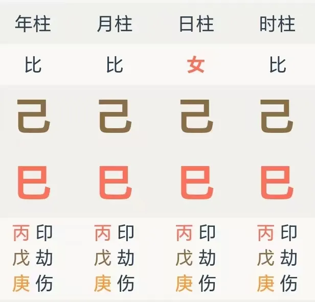
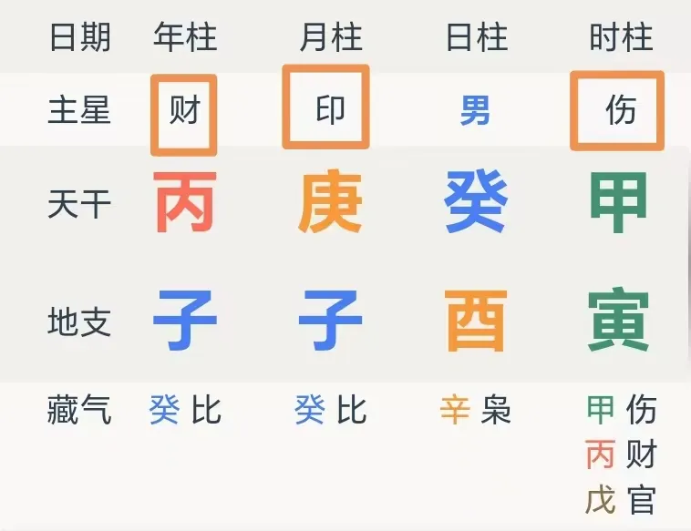
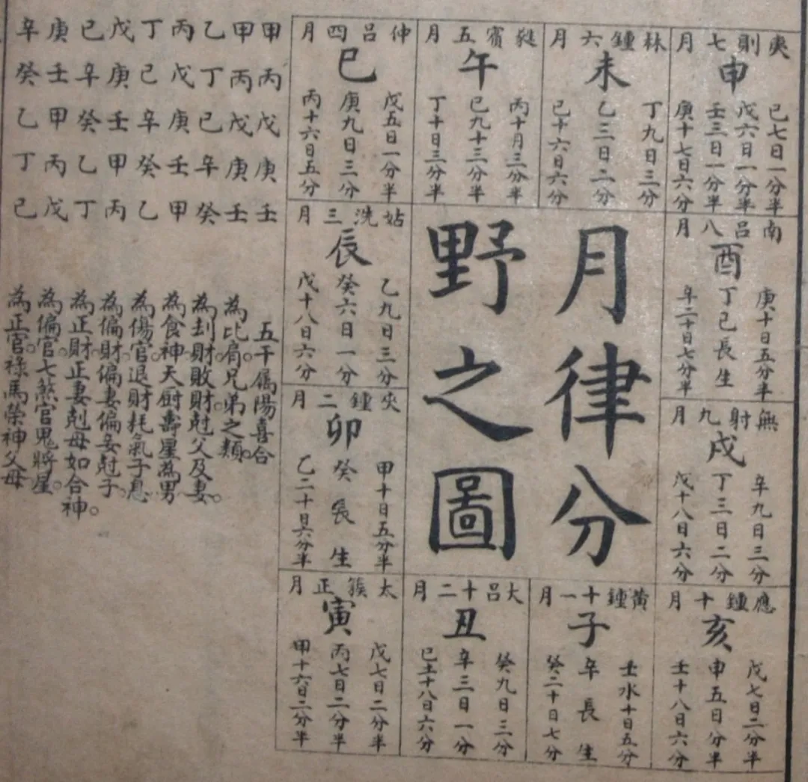
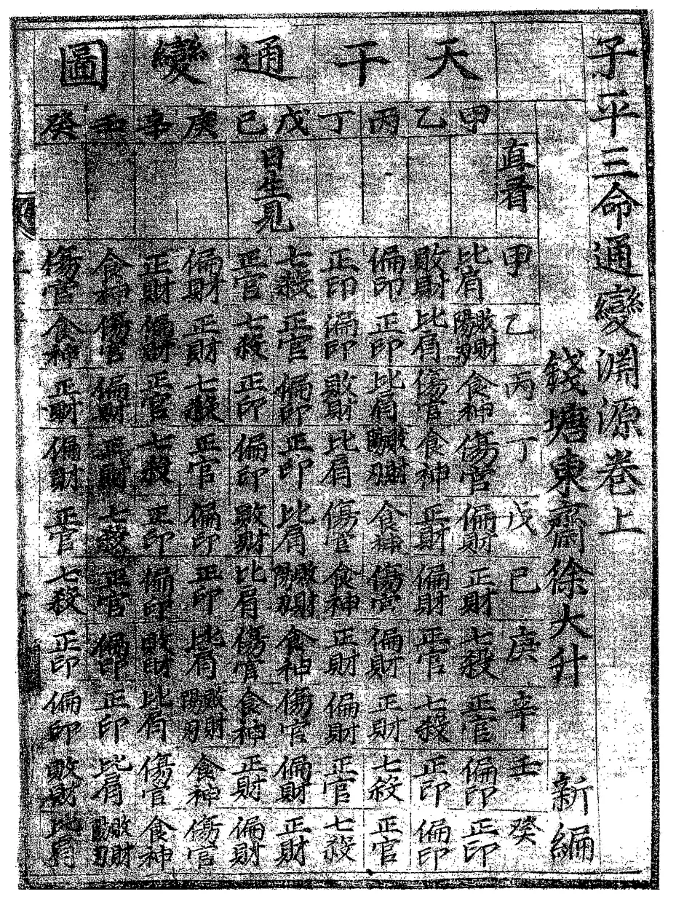

# 很难想象，八字里的十神还能玩得这么野

谈到外行人对于八字的第一印象，大概莫过于

“我八字喜火，名字里特意带火字旁的字”

“我命里缺金，所以我爸妈给我起名带鑫”

先撇开靠谱与否不谈，这个现象能出现，也就意味着，对于八字的最鲜明独特的特征，大家的印象，大概就是五行及其生克制化。

但是只是喜火缺金之说，并不足以预测人事，最起码不足以解决最朴素的 “看下命中会不会富贵” 这样的问题，毕竟金木水火土的分布，和社会地位与资本积累，貌似没有啥联系。

也因而，作为一个外行人，只要稍微一查，就会了解到一个名叫十神的概念，以及与之相关的诸如“正财，偏财，正官，七杀”之类的术语，然后拿起八字软件咔咔一整，截图，发到互联网上询问。

于是再被花里胡哨地塞上一堆术语与概念，包括且不限于“需要找出真正能象征财富的象征”“如果有食伤则可以把食伤当财看”等。

问题暂时解决 —— 可能只是学习的知识不够多而已，命理博大精深，想几天内查查概念就速成，不看命例不读书实在是太投机取巧了，思想有问题！

许多人也都是这样踏入了研究八字的旅途，并不约而同地最终撞见了某些不可名状之物。

《纳瓦尔宝典》里说：“人生大部分时间，都是在寻找那些最需要你的人，最需要你的事。”

我化用一下这句话：“八字研究的大部分时间，都是在寻找八字里最契合问题的用神，读出最契合的信息。”

这个用神，甚至是双关的。

于是也最终撞上一些巨大的黑洞，对所有命师，都显得万分不可名状，比如：

然后直接宕机，知道的读出偏枯，不知道的还以为是清一色，虽然，都是糊/胡了。

但没法读出太多信息。

也因而，我真诚地邀请大家，一起回到一些最最基本的问题思索：

何谓十神？

第一种回答，是知识普及性的回答：点开八字排盘软件，这些诸如“财，印，比”等字样的就是十神。

八字以日干象征命主本人，而十个天干依据和日干的关系，分别对应十神，最终用于描摹人事与社会，以此来叙述一个人的生命历程。

我们还可以有第二种回答，是文献综述式的回答：我们只需要翻一些现代具有代表性的人物著作中的观点，就能知道，现在的互联网命理圈，到底是怎么看待十神的。

譬如本土最早的关于八字的学术性著作，洪丕谟的《中国古代算命术》，是这样写的：

> 上面我们看到的一些如正财、偏财、伤官、食神之类的有关术语，就是以日柱天干作为自身出发点，与周围其他有关干支发生生克关系的结果。
>
> … … 对于这些古怪名字来说,也就是阴阳五行交相为用、生克制化的直接产物了。先说生我的印绶。因为生我的好比父母，所以便取了个印绶的名称。所谓“印”,就是荫蔽的意思,所谓授，就是授受的意思。

洪老先生给出的思路是“五行交互的直接产物”，记得画个重点，很快我们就能看到这个观点究竟和其他人有何不同。

接下来是八字圈内最无人不知的邵伟华的《四柱预测学》：

> 在阴阳五行生克中，都有生我和我生、克我和我克的关系。五行在六亲中所主如下：
>
> 生我者为正印偏印(生母和继母)；我生为伤官食神(子孙)；克我者为正官偏官(老板、上司或官员)；我克者为正财偏财(妻妾)；比肩劫财者为兄弟姐妹。此以十干而言。

很明显能看出，这位对于十神究竟是什么的观点，叫做“十神是六亲的复杂版”，一个经典的六爻思路在八字的迁移。

随后上场的是新派八字的宗师李涵辰《八字预测真踪》里的观点：

> 测人社会活动能力、官运、工作好坏、工作安排、与领导关系，官司、牢狱等，看局中官杀。正官是克制日干的，为阳见阴克，或阴见阳克，其克力柔和而不暴烈。

这个解释是一种填鸭式的思路，甚至懒得提象征解释的来源。

我们接着再看看盲派八字的代表性人物段建业在《段氏理象学》里头的说法：

> 以日干定十神，日干为我、为主、为已身。日主的五行之性与四柱中其他干支的五行之性的关系不外乎阴阳与生克。
>
> 四柱干支与日主之干有:“生我”“我生”，“克我”，“我克”，“同我”五种关系，再加阴阳关系，正好配十神。生我者有父母之意，故立名“印绶”。… …

查重率颇高。

于是我们就知道了，整个互联网八字圈，对于“十神”这个概念的认识，究竟在什么样的程度。

也于是，我想问所有学过八字的读者一个问题：

这样的解释，你们满意吗？

或许没法不满意，因为往前回溯几百年的文献，真的没有太多答案可供参考。

最为人知的《渊海子平》中，所给的只是寥寥几个词的定义：

最根源的《子平三命通变渊源》中，所列的也只是一张表而已：

但我们真的可以追求更高远的答案 —— 不是命书中定义如何写下，而是生活在那个时代的命书的作者，为何会留下这样的定义。

乃至更深一层 —— 西洋占星中能从日月到土星见到时代社会原型，欧洲与阿拉伯地占中能从宫位到卦象中窥见贵族与宗教的烙印。

那么为什么，偏偏八字诞生在了中国？

为什么食神与偏印，乃至偏印倒食之说，在其他文化的命理术中，竟然没有太明显的痕迹？

究竟是怎样的中国，诞生了这样的八字？

我们便真的只能回望中国的过往，回望五千多年的历史。在周政中窥见宗法与分封，在秦政中触及法家与效率，由此而理解[正官与七杀的气质根本差异](https://mp.weixin.qq.com/s?__biz=MzkxMTM5NjUxNg==&mid=2247485803&idx=1&sn=5a88e9cb485f8253f6fd35ad3e27d6e1&scene=21#wechat_redirect)。在中央集权中，理解[正官的真正内涵](https://mp.weixin.qq.com/s?__biz=MzkxMTM5NjUxNg==&mid=2247485723&idx=1&sn=d2407737cf8f991d50f22347b60df766&scene=21#wechat_redirect)。

于是也便知晓，只有这样的土地，才会生养出这样的八字：

中国自古以来，就是一个罕见的、庞大的、大一统的中央集权国家。庞大的中央官僚体系和中央财政互为依托，正官与正财的联系，在生克之外，本就紧密无边。

中央官僚依托中央财政带来的赋税养活自身，但这套体系能够运转的前提，是定居人口能够被政府完全掌控（编户齐民），七杀正是以这种方式为正官服务。

而赋税养活中央官僚的前提，则是收税成本远远低于税收，中原恰巧满足了这一条件 —— 以农耕为生的族群，在地大物博的中原，[犹如扎根于大地的植物](https://mp.weixin.qq.com/s?__biz=MzkxMTM5NjUxNg==&mid=2247485741&idx=1&sn=837c52bfdfc2f72bd2badf60524d4865&scene=21#wechat_redirect)，若非必要，绝不会背井离乡，浪迹天涯，成为无根的蒿草。

秋收冬藏，节律的稳定，带来了税收的秩序化，也进而稳定了中央官僚体系。

这就是中原王朝区别于非中原的特征，不同于草原游牧者逐水草而居的高度流动化带来的只基于血缘关系的部落统治，也不同于青藏高原交通恶劣下追求低成本高适应性的宗教为上。

也同样与欧洲文明不同：

东周列国漫长的军事-财政竞赛，和往后建立的大一统王朝对草原的用兵，使得往后千年中央财政的基本框架，也依然在《盐铁论》和先秦诸子的框架内，塑造了中华文明的政治系统深度干预经济系统的传统，这个传统，至今还在运转。

长久的大一统传统，带来了历史与文化的完整绵延，又能够在不同的历史时期，兼收外来文化，并进一步为上层建筑的存在提供养分 —— 君不见科举的基因，自唐朝始，竟能有千年之久！

这是碎片化的欧洲未曾具有的体验。

这就是正财、正官与正印，既是十神的根本，也是中国的根本。

而余下的七个十神，也就成了这三正的延伸 —— 不在正印之内的，便是偏印；不在正财之中的，即是偏财；非中央之官，就是偏官。

伤官是偏了的食神，而食神之解，不在命书，而在汉字的“食”中，本就朴实无华：

> 公食贡，大夫食邑，士食田，庶人食力。
>
> —— 《国语 · 晋语》

比劫之解，也就不止于兄弟朋友，而在人丁，所谓比劫，就是上文里的庶人 ——

一个无政治、金钱、文化的杠杆可用，又无资源可食的人，只能尝试抱家族大腿；抱不成，便只能靠出卖自己的劳动力为生，或是用最原始的人力杠杆借别人的劳动力，这也便是月令禄刃最早并不在格局之中的真相。

这就是从中国历史视角下理解的十神 —— 远非枯燥僵化的定义，而是生生不息的中国。

所以何谓十神？

是一种极具中国味的意象，一种古代中国的社会原型，宛如梦境中会出现的地狱与天堂，乌鸦与雄狮。

所以，一个人的八字，也就成为了这10种独属于中国的社会原型的叠加。