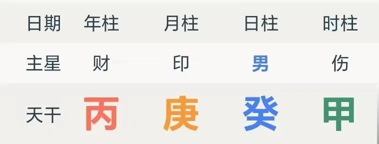
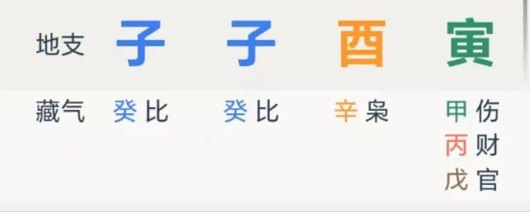
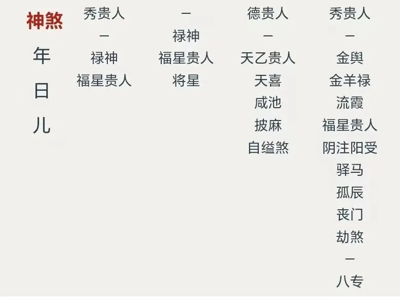
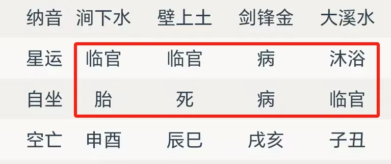
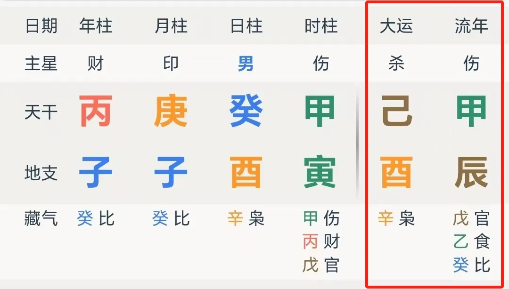

# 这款纯狱风“植物人”模拟器，千百年竟混成了家喻户晓的文化魅魔？

作为出生在电子游戏走向普及化的时代的人，我已经很难回忆起游戏术语到底是从什么时候开始逐渐混进大家的日常生活了，以至于当碰到诸如 RPG 这样的术语时，甚至还得花点时间才能回忆起其全称：

RPG，Role-Playing Game，角色扮演游戏，一种古老又经典的游戏类型，旨在让玩家扮演某个角色，并通过这个角色体验各种各样的故事。

各类游戏化也层出不穷，比起游戏原理在教育行业的使用，可能游戏化 Todo 软件更多地走进了大众的生活，譬如 Habitica，人升等等。

人类向来是热衷于想象与整活的，这个世界或许早就有人一拍脑子：

“哦，每个人的人生，都是一款漫长而独特的 RPG 游戏，并在这个世界彼此交互，天呐老兄，这实在是太酷了！”

“我靠老弟，如果我们能知道自己的账号是什么状态，角色的机制属性如何，又有哪些连招，提前阅读攻略，这就更他妈的酷了！”

那，如果我说真的存在这么一种东西，你将在这里，看到每个人在登录这个世界时就创建的角色，这个角色拥有三个不同位置的装备，以及四个不同位置的数值加成，并在创建后经过十多个不同的大副本，每个副本还包含 10 个不同的剧情章节，由此就能知道一个角色各种平常观测不到的信息，这是不是酷到爆炸了？

不好意思，还真的存在这玩意。

在此，欢迎来到《四柱八字》这个由徐子平自主研发的一款经典国风 RPG 游戏。游戏发生在一个名为中国的国度，在这里，每个人都将拥有窥探命运的能力。你将扮演名为 “八字研习者” 的角色，在自由的探索历程中邂逅诸多风格迥异，特征鲜明的流派，和它们一起寻找用神，理解喜忌，同时，共同发掘关于人类命运的真相 … …

让我们开始吧。

## 游戏界面

这是一个实打实的“植物人”模拟器，毕竟在用这玩意研究角色的时候，一个角色是真的被“植物化”的：

四柱八字，年柱为根，月柱为苗，日柱为花，时柱为果。

三个不同位置的装备，以及四个不同位置的数值加成，这不是开玩笑，而是真切存在的事实：

四柱相当于四个不同位置的装备槽，日柱位置上边的那个天干，默认设置为角色本身的象征，于是就留下了三个天干，代表三个装备。

每一个装备，自带属性，譬如“甲木，乙木”等等，也因为和日主的关系不同，而有了名称，诸如“比肩，劫财，食神，伤官”等等，这东西在八字中用一个概念概括，名叫【十神】。

有了装备，意味着拥有了某种机制，但这不够，一个装备如果没有契合的数值加成，那最终也还是用不了，于是这里就随即跟上了数值加成模式，这东西在八字中用一个概念概括，名叫【藏干】。

以上两个东西，构成了以四柱八字进行角色分析的主要框架。当然，在主要框架之外，因历史原因还存在各种细枝末节，譬如：

有人认为，装备+特定的数值模式，应当可以诞生出一些额外的词条作为修饰，于是因生成词条的思路不同，就有了【纳音】和【神煞】

有人认为，装备下方直接配有的数值模式加成，会影响装备本身的状态，于是这个框架里的 UI 又多了一个显示栏，名叫【十二长生】

每个角色都会随着时间的变化，来到不同类型的副本，这叫【大运】；在副本里，也会经历不同类型的剧情章节，这叫【流年】

… …

不过这些都不是最重要的。

最重要的是，一个角色依照自带的各种装备与数值配置，到底该如何玩耍，才能起飞。而这，构成了千百年各家攻略探索者的最大目标，也构成了这个游戏的主旋律。

这些千奇百怪的攻略组的积淀，背后若隐若现的，自然是这些人对于模拟器本身的理解，和对于地球 online 的中国服务器各个版本迭代的理解。

## 攻略组们

初代攻略并非开发者所写，而是一位隔了几百年后的老哥留下的。

那个时代的原始攻略风格非常粗暴，大家的做法都是整一些特殊装备组合，拿到这种组合的就牛逼，拿不到的话，就看看有没有什么好装备能用。

于是也就有了最经典的这段话：

以日为主，搜用八字先观提纲之轻重，次详时日之浅深。论财官元无元有，日下支神财官有者最要纯一。如有官星者不论格局，有格局者不喜官星。… …

以及，既然好装备真的到手了，那就别让其他不那么好的装备干扰这个装备运转了。

遵从着这个最基本的思路，又逐渐出现了风格迥异的不同攻略思路，比如说：

既然这几个装备槽里有数值加成，那么数值加成最猛的一个装备，是不是就能够决定一个角色到底是战士还是法师，进而奠定整个角色的玩法与发育时期呢？ok，那我们就写一组以最猛加成的装备为核心思路的攻略！

又或者说，我们捋出来整个角色的定位是射手，虽然伤害高射程远，但是血量实在有点薄，这样，我们适当找一些补护甲和血量的装备，就非常保险了。ok，我们写一组以平衡机制属性，追求全面发展为核心思路的攻略！

又或者说，我们捋出来不管游戏版本如何变化，最好的装备就是这么四个，所以我们只需要看看这个角色到底多大程度上能发挥出这装备的性能就好了。ok，我们写一组以角色如何发挥特定四个最佳装备的性能为核心思路的攻略！

以上只是攻略思维的缩影，毕竟每一种思维背后，都有相当的历史，并随之诞生了相当数量的细节演变与争议问题。

更不用说，其实攻略思维，本就不止这么三种，还存在着各种各样更为混杂的东西：

乃至，更为奔放的攻略思路 —— 我们基于加点的性价比分析，综合考虑了一百多个方案，最后得出，这种方案最好！

以上，就是整个名为《四柱八字》的游戏历史的简单缩影，而这个历史本身也就成了一个超大型第一人称解谜游戏。

## 从入狱到出狱

基于以上原因，也便能知道，这是一款“纯狱风”的游戏 —— “你要是染上这款游戏，你这辈子就完蛋了！… …”，前面的记不清，后面的也忘了。

毕竟到底什么攻略才是适应时代的攻略，不同服务器不同版本又带来了哪些更新，会对攻略产生怎样的影响，要研究起来，都是一个庞大无比的工程。

而每个攻略组留下的，除了攻略思路本身，大概就是各式各样的国服玩家角色解析（名人八字）

更多的，则是芸芸众生对于自己与他人的人生命运的思考。

所以，这款纯狱风的“植物人”模拟器，到底该如何游戏通关？

在我看来，无非穷古与探今两个思路 ——

穷古是为了弄清游戏设计者在创建游戏时的底层逻辑，也因而就能够弄明白，后人对底层逻辑有了多大的误读，是否进行了不合时宜的改造和创作，每一代的游戏攻略制作者们，在那个特定的时代，又是基于怎样的观念，去写攻略的。

探今则是为了理解最新的游戏版本，比对历朝历代的版本迭代更新，从而理解过往的各类攻略，究竟有何不适用的地方。

既穷古，又探今，才能最大程度地摒弃糟粕，从而避免产生不必要的困惑和自我限制，才能形成独属于个人、且灵活多变的攻略思路。

毕竟，每个人来到这个世界上，都是得用自己的心，去生活，去看世界的。