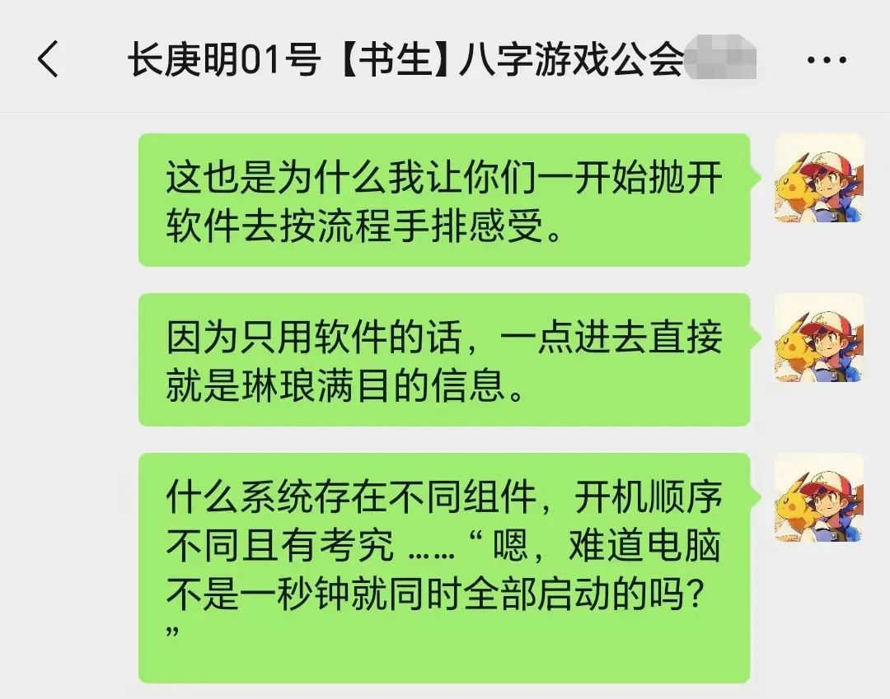
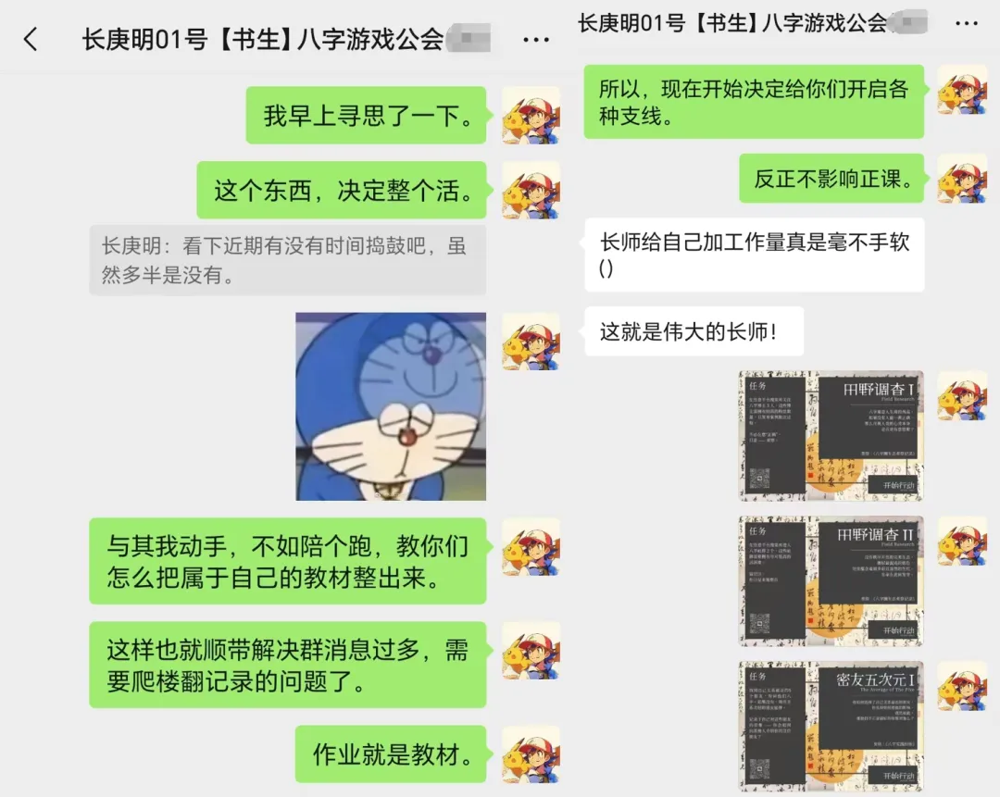
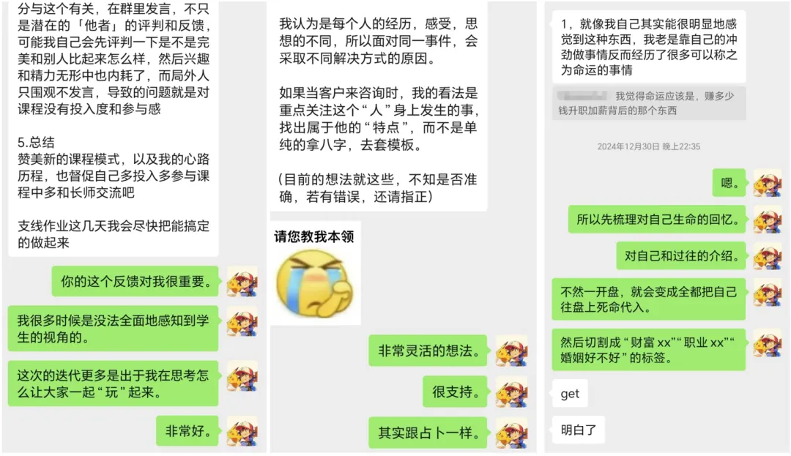
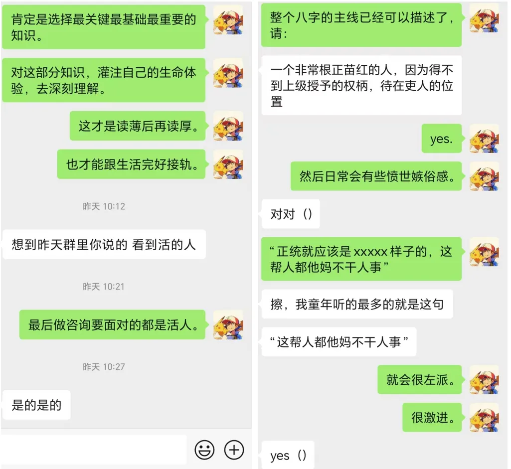

# 众所周知，玄学是最现实的游戏艺术

## 研究命卜，就是玩

在我人生的前二十多年，我都没有设想过，我有一天能够在占卜和命理上走到现在的地步，因为从小在唯物主义教育下长大的我对此毫无觉知，乃至对于为何有人沉醉其中而感到奇怪。

而接触玄学的最初动机，也并非出于预测未来的愿望，而是好奇心驱使我去检验这种所谓的“奇迹与魔法”是否存在。

验证成功，但“奇迹与魔法也不是万能的。”

在玄学圈内浸泡许久的人，多少都能察觉到一个事实 —— 不管是任何形式的测算，最直接的输出指向，都还是确定的结论。

也因而有了“未来能不能改”的日经问题，毕竟人所渴望的，是预测出符合心意的未来，而不是无力干涉的困境。在提供方法论上，玄学是空灵的 —— 除去各种仪式风水之类的调理外，无法提供更加细腻、具体，且最关键是现实的解决之道。

于是，所有沉浸于预测术的人，最终也都必须面对一个问题，这个问题也同样是我会询问每个咨询课程的人的问题：

> “你究竟为什么要学习占卜与命理？”

出于好奇，出于把握命运，出于副业，出于助人情结，出于为往圣继绝学，又还是其他？

在一次次解构再建构后，于我而言，各种浮华的、高大上的动机早已随风而去，留下来的不可动摇的，就是：

> 当然是，因为这东西很好玩啦

## 命与卜，桌游与解谜游戏

我眼里的命理与占卜到底是怎样的？

对于有些人而言，命理与占卜是高高在上的，神圣的，秩序井然的，完美无缺的，是需要费劲青春年华才可窥见分毫的至高天道。

对于有些人而言，命理与占卜是混乱的，充满谎言的，鱼龙混杂的，虚无的，是层层叠叠草台班子铸就的超大型屎山。

对于有些人而言，命理与占卜是冥冥之中的，不可言说的，理性与感性兼备的，奇妙的命运长河的偶然显现之载体。

对于有些人而言，命理与占卜是根植于童年记忆中的、文化性的、亲切的、接地气的、朴实无华的精神故土与摇篮。

以上，是许多人的答案，有一些也曾经是我的答案，但却并不全部构成我的答案。

如果要我给人介绍命理与占卜是什么，我的第一反应是一种别致的桌游 —— 正如大富翁是地产经营的模拟，璀璨宝石是资产杠杆的初体验。

各式各样的占卜命理术，其自带的象征与规则，浸润了历史文化的韵味后，也完全可以视为是各种形式的模拟游戏，譬如我就调侃过，八字是一种别致的植物人模拟器：

[这款纯狱风“植物人”模拟器，千百年竟混成了家喻户晓的文化魅魔？](https://mp.weixin.qq.com/s?__biz=MzkxMTM5NjUxNg==&mid=2247485899&idx=1&sn=a3e55f4168d7c79902858f11a0ec5ad8&scene=21#wechat_redirect)

除此之外，命理与占卜是最低门槛的大型现实解谜游戏，最起码是之一。

每一门预测术，其圈内都有无数日经的争议问题，这是最精巧有趣的谜题；每一门预测术，其组成都可拆分为基本单位，在历史中皆可回溯其痕迹。

见到最初的样貌，见到不同时代的人如何诠释与改造，见到历朝历代的这些子系统所组合成的模型，又都曾经是什么样子。

这也是为何在八字教学时，就这个预热阶段，我会让学生做一件很不符合互联网时代的事：

也譬如，在我教塔罗时，最先登场的基础知识，是纸牌的花色 

—— 仅仅是塔罗的四种花色，就与日常娱乐的扑克牌存在纠葛，就曾经承载过数不清的欧洲文化，对花色的理解，也往往在实践中真的有用。

在解决实践准验问题后，人总是能找到各种有趣的碎片，只要你有一双善于发现美的眼睛。

## 教学，就是带人玩游戏

对我来说，教学之路不是一帆风顺的，是在与我的学生共同磨合的过程中，逐渐摸索到个人道路的。

其中对我造成最大困扰的，还是中国人文化基因里对“教师”角色的态度 —— 教师高高在上，不可违背，师生关系是一种上下级关系。

也包括在绩优主义下的长期填鸭式应试教育，人生活的目标是为了做题，还是做对所有的题，这实在是太过压抑人性，而我也深受其束缚。

直到后来，回首圈内的各种玄学教学，我哑然失笑

 —— 许许多多的课程，最后都搞出了应试教育的模样：

一个卦、一个命盘成了题，每一道题都设置了标准答案，所有人都灌输了规范统一的概念，必须按照特定的解题公式（所谓流派技法），遵守教条解决。至于创新思维，至于个人思考，在教学中都是被边缘化的。

也真是奇怪，明明在家长身份时，给孩子报兴趣班的情况下，家长们似乎都会考虑老师是否太过呆板，又或是压抑孩子天性。但在报玄学课时，却似乎不曾考虑过老师也应当能够鼓励和培养自己的独特性。

善于做题的中国人啊，连学玄学都要活成做题家的样子了。

但是这绝对不会是我喜欢的样子，也绝对不是我期待学生变成的样子。我们可以开放，可以创新，可以在适当的框架内尊重个性，可以坐下来集体讨论，教师不必高高在上，学生也不必紧张畏惧。

当意识到这些后，我的教学思路开始变得更为灵动辽阔，我懒得被市面上的各种既有的教学规矩束缚，我就是，也只会走我自己的路，这不适合所有人，但总有人会喜欢。

在第二次带塔罗课时，我的自我表达还是偏多，如今从这次八字教学开始，我尝试更多新方案：

人和人的社交来往，都是从聊天开始的：

所谓教学，就是带人玩游戏。没把学习过程当游戏玩的教师，是开心不起来的，也带不出能快乐学习的学生。

## 游戏艺术

命与卜是迷人的。

桌游与解谜游戏不是它的全部，对于我而言，它从任何角度都能称得上是一种关乎现实的游戏艺术。

当你能将它视为游戏时，也就意味着，你时刻能透过它，去见到一个游戏化后的人或事，人可以是游戏中的角色账号，事可以是游戏化后的任务。

譬如，在我眼里，塔罗作为一种纸牌用于占卜，宛如用一种凝固的电影镜头去组合成人事变迁；八字作为一种包含植物隐喻的命理术，也就将人透视为了不同类型的植物，共处在一个世界上，生根、发芽、开花、结果。

在这个由象征与符号构成的世界里，命与卜甚至是一种极富有实践性的预测艺术，实实在在地将镜头对准了人的日常生活。

这甚至不是最有趣的点。最有趣的地方在于，关于预测，数理模型虽然客观，却自带抽象与冰冷；由语言与符号构成的世界里，是包容的，温情的，其中的空间足以容纳每个人驰骋的个性。

门派林立，与其说它混沌而充满谜云，倒不如说，每个人的个性与精神世界，都能在此找到栖息的空间。接触各类门派，也就犹如浏览不同时空的人的心智

—— 我们，都在此来过，留下了自己的刻痕。

也因而，日常觉得学生很有灵性的我，非常期待他们能走出怎样的个人之路：

世界还很大，玩心也很重。

既然如此，那就先玩个痛快吧。