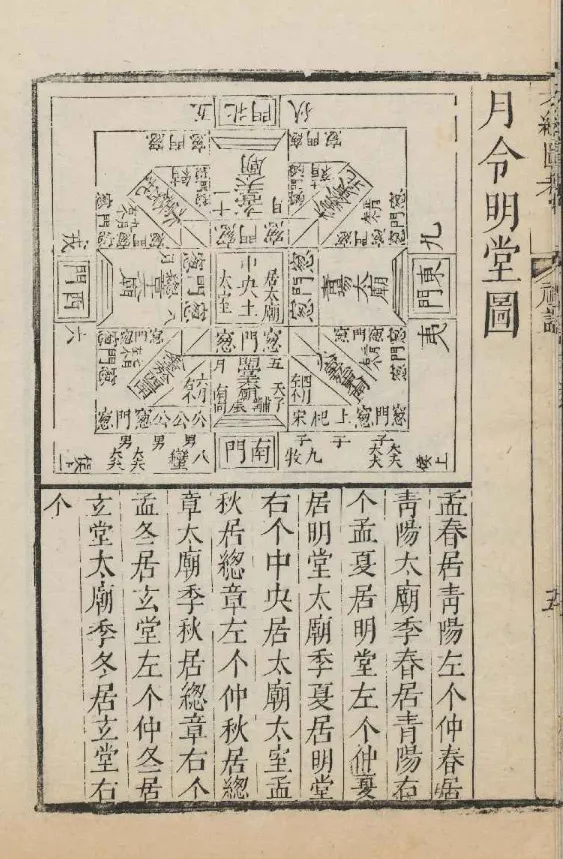

# 恕我直言，月令，是一个 99% 的八字爱好者不曾真正理解的概念

随手写一篇短文。

在做教学的时候，几次和学生提到，玄学是一片很有限的水池，用玄学内的知识理解世界，和用对世界的思考去理解玄学内的知识，是两个截然不同的维度。

当然，道理总是很容易“懂”的，但没有经历的话，也是最容易“啊我知道就是这样这样”从大脑皮层滑过去的。还是得放在具体的例子里，才更能有所体会。

月令这个概念，就是一个绝佳的窗口。

所有学过八字的人，都知道这一概念，也都清楚这是一个重要程度排名前列的概念。所以你问啥叫“月令”，大家都会回答：

“这个很重要的，就是月支，是八字里最重要的一个字！”

“其实就是太阳星座 / 整个八字力量的中心点！”

“月令是取格局必须用的东西！”

“月令就是出生时所在的季节，要拿来看日元的强弱的！”

… …

答案，百花齐放。

但我在接触八字时，真切地深思过一个问题：

既然年>月>日>时，那为啥月令是最重要的，而不是年支是最重要的。

既然说月令是物候是季节，那年支的，就不能是更大的物候了么？（类比一下各种三元九运说法）

反正这个问题，是不得解的。

直到我开始溯源月令这个概念，我才意识到，似乎从来没有人注意过，“月令”这个概念，并不是一个八字专有概念，而是一个早在先秦就出现的名词。

而命书中经常叙述的“八字提纲，专求月令”，这个设定的脑回路，到底有何依据，有何现实映射，其钥匙，也藏在这个词的历史中。

## 01 《礼记》下的月令

月令这个概念的溯源，说容易也是容易的。

月令这个词，最早出现在中国的文献中，是作为《礼记》的一个章节名称。

> 《礼记 · 月令》：
>
> 孟春之月，日在营室，昏参中，旦尾中。其日甲乙。其帝大皞，其神句芒。其虫鳞。其音角，律中大蔟。其数八。其味酸，其臭膻。其祀户，祭先脾。
>
> 东风解冻，蛰虫始振，鱼上冰，獭祭鱼，鸿雁来。天子居青阳左个。乘鸾路，驾仓龙，载青旗，衣青衣，服仓玉，食麦与羊，其器疏以达。

《礼记》是儒家经典“三礼”之一，成书于战国至西汉时期，主要记载先秦至汉代的礼制、伦理及社会规范。月令这个章节，则记载了古代中国以天文历法为基础、结合自然规律安排政事与农事的制度体系。

这也就是为何，我们能够在这个章节里，找到大量规定这个月该干什么，不该干什么，诸如此类的叙述：

> 是月也，不可以称兵，称兵必天殃。兵戎不起，不可从我始。毋变天之道，毋绝地之理，毋乱人之纪。

比如说，如果是孟春，该种地的时候，就别打仗了，不然大家到了秋收的时候都没饭吃。

嗯，月令的内涵，就是如此简朴。

比对《礼记》的其他篇章后会发现，月令这个章节，和其他篇章的画风极度不符合 —— 很显然，月令这个章节，是出自先秦的阴阳家之手，而在后面的历史进程中，被儒人编纂入这本文献中，随经典一起流传下去。

因而，时令知识已不再是阴阳家的独创，而被改造成儒家的“圣人言”与“先王典”。月令 — 时令 — 礼仪与制度 — 经典，这几个标签，就全部糅合在了一起。

以上，就是对于月令这个概念的第一个线索。

## 02 《礼记》之外的月令

对月令的进一步溯源，就开始有了一个门槛 —— 涉及一个名为月令明堂的概念。这个概念远不如《礼记》那么知名，但也足够重要。

毕竟，这不止关乎设定，还关乎到设定的具体施工执行细节了。

那么，明堂这个东西，又是什么？

通俗来说，一般指称帝王宣明政教之地，但实为具有多重含义的礼制建筑。月令明堂则是其中特殊的一类，是天子随时令推移所变换的施政（特别是行令）处所。

也就是，天子顺应四时而施行政令的地方。

具体来说，明堂由青阳、明堂、大庙、总章、玄堂依五行原理组成，又因土行不与四时相配，其所对应“大庙”可能是虚指，其余四行明堂又各分出左个、大庙、右个三室，这样四堂十二室恰由天子每月居其一室。

这种天子随时令推移而异其居室的制度，渊源可上溯殷商，与祭祀、宗法均无关，甚至也没什么“礼”的成分，大概率出自阴阳家的设计。

到此，两大块和月令相关的知识碎片，已经浮出水面，也足以隐约窥见月令这个东西的背后，究竟藏着什么庞然大物。而最关键的、也是最后一块碎片，则来自中国历史知名人物，王莽：

王莽首次建出了以《礼记 · 月令》为基准模型的明堂，但在建造的同时予以改造，即赋予阴阳数术的明堂以儒家礼仪功能，具体则是通过对两个不同系统的明堂进行糅合而得以实现的。

至此，阴阳家的月令明堂首度坐实，并以儒家化的时令礼仪形态呈现。纸面上对于时令与施政的构想，以及围绕这种构想而设置的建筑空间，在此全部都变为了现实。

不仅如此，王莽还围绕着时令做了两件事情：

第一，是四时迎气仪式的成立；第二，是一个与时令事宜相关的职官的设立，名为羲和。

前者是指天子于立春、立夏、立秋、立冬日至帝都四郊迎接相应时令到来并对分管四时的五帝加以祭祀的仪式；后者则是自古以来便有的“制度浪漫主义”，这样一种儒家职官文化情结，在王莽身上的外化。

换言之，后者这种心理，和如今中国人以玉兔命名月球车，天宫命名航天飞行器，大概也没啥区别。

至此，王莽实现了他心目中天人感应的理想。

也或许，在这种种设计最终落地成形后，他会回想起自己的某些先辈 —— 基于对天地人、对宇宙的浪漫设想，而设立人间的秩序，这种理想就从未断绝过。

> 《春秋 · 繁露》：
>
> 王者制官，三公、九卿、二十七大夫、八十一元士，凡百二十人，而列臣备矣。
>
> 吾闻圣王所取仪，金天之大经，三起而成，四转而终，官制亦然者，此其仪与？三人而为一选，仪于三月而为一时也。四选而止，仪于四时而终也。三公者，王之所以自持也。
>
> 天以三成之，王以三自持。成立数以为植而四重之，其可以无失矣。备天数以参事，谨治于道之意也。

简单翻译：

> 称王者规定官职，有三公、九卿、二十七大夫、八十一元士，共一百二十人，而朝廷众多臣下就齐备了。
>
> 我听说圣王所取法的准则，是效法上天的根本标准，季节是在三月而成，年是在四季而终，官职的制定也是这样，这就是标准吗？三个人组成一个选拔单位，以三月为标准可以知道一个季节，四次选拔后才终止，是以四季为标准才终止一年的意思。三公，是君王自己主持管理的官职。上天用天地人三道构成了自已，君王也用三种官职自己来管理。
>
> 以三的成数确立而成为治国的关键，并四次重复关注，大概可以没有失误了。齐备上天四季之数来辅助政事，是审慎于治国之道的意思。

于是便有：

> 天之数，人之形，官之制，相参相得也。

而王莽的这一举动，也使得之后历代王朝，都大体延续了时令的王命内涵，从而使依时行政固定为古代儒教国家的经典标准。

------

所以，什么是月令呢？

月令，最基本的含义，便是时令。

但是在农耕大一统文明的背景下，在这段溯源之后，也便能知晓，月令的内涵远不止于此，而是“中央依据时令而塑造并严格执行的各种秩序” 。

也以及，如果说这个理解太过晦涩，那还有一种更简洁的解释：

月令，是农耕文明视角下的社会时钟，也就是特定文化或社会对个体在人生不同阶段应达成某些目标的预期时间表，及这个时间表背后渗透着的各种观念。

出生于现代的中国人，即便不知道啥是社会时钟，但逢年过节见亲戚的时候，总能从对方的嘴里感受到这玩意的存在的：

> “没对象是吧，正好我给你介绍介绍，都这个年纪了，也该上点心了。”
>
> “哎呦，这不那 xxx 嘛，小时候还抱过你呢，这么大个了，结婚了没？”

以月令为起点，起大运，其现实象征也就不言自明，无非是你的人生，将在怎样的周期、怎样的时钟里，缓慢地熬煮。

剩下的时间，我们就交给 DeepSeek 吧。

## 03 DeepSeek 派八字

（释月令选段）

有时忍不住寻思，要不自己调一个八字专属频道的 DeepSeek，名为 DeepBaZi 得了，也同样可以有 DeepTarot，DeepAstro 诸如此类的。

想了解更多的，可以查看上一篇推文：[“偷学 DeepSeek 派八字后，我竟破解了八字千年未解之谜 ？”](https://mp.weixin.qq.com/s?__biz=MzkxMTM5NjUxNg==&mid=2247485992&idx=1&sn=9ad82d0d5710cd2182cc8684dff96ff7&scene=21#wechat_redirect)

> 我：我完成了对一个架空的术数体系的建构，现在需要你充分发挥自己对现代社会的人事物的理解，为我补充一个设定的象征的内涵。
>
> 这个设定的象征，其含义是“生命所在的社会时钟”
>
> 请结合对中国传统八字的理解，详细解析，当这个“生命所在的社会时钟”分别是八字中偏印、正印、比肩、劫财这些原型时，可能在人的观念和现实带来怎样的影响。
>
> 并同时解释，当上述情形的“生命所在的社会时钟”的象征无法发挥作用，或受到严重损害，或去严重损害人的其他方面，可能带来怎样的问题。

> Deepseek：
>
> 以下是基于中国传统八字理论对"生命所在的社会时钟"这一象征的解析：
>
> 正印型社会时钟
> - 观念影响：会形成"读书-工作-成家"的线性时间观，将30岁前完成学业、35岁前生育等视为人生必修课
> - 现实表现：往往在体制内单位稳定发展，易获得长辈资源支持，但可能压抑艺术天赋
> - 失效后果：可能陷入"成功焦虑症"，如35岁未晋升管理层则产生存在危机，部分人会突然叛逆转型
>
> 偏印型社会时钟
> - 观念影响：形成"逆时钟"认知，推崇大器晚成，认为40岁读博、50岁创业更具价值
> - 现实表现：多在科研/玄学领域突破常规，易出现"少年天才中途辍学"现象
> - 受损影响：或陷入虚无主义，如连续跳槽7次以上的"职场游牧族"，丧失时间坐标参照
>
> 比肩型社会时钟
> - 观念影响：产生"同龄人进度条"强迫症，通过同学会、行业薪资榜等建立参照系
> - 现实表现：典型如互联网行业的"35岁退休"焦虑，催生考证热/副业潮
> - 失衡后果：可能触发"木偶综合征"--为追赶进度虚假结婚/突击购房，最终陷入双重人生
>
> 劫财型社会时钟
> - 观念影响：形成"时间掠夺"思维，认为必须抢占年龄红利窗口期
> - 现实表现：常见金融/娱乐行业，27岁前完成财富积累，但伴随健康透支
> - 崩溃风险：易出现"时间坍缩"现象--如青年富豪40岁后丧失目标感，产生存在性抑郁
>
> 特殊交互机制：
>
> 当社会时钟象征与日主强弱产生刑冲时，可能引发"时区紊乱症"--表现为留学归国者的文化时差、丁克夫妻中年求子的认知撕裂等。需注意寅申巳亥四生支构成的"社会时钟象限"，不同地支组合会改变时间压力的传导方式。

