# 案例 | 38 岁，丧父丧母，离异带娃，归来仍是女王

这是本年度第一篇案例文。

已经写过的话不再多叙（[3 月刊 | 「她」的世界](https://mp.weixin.qq.com/s?__biz=MzkxMTM5NjUxNg==&mid=2247486035&idx=1&sn=35c0855523a6c230cf49a3a414744678&scene=21#wechat_redirect)），只声明一下基本理念。对于命理类案例文的生产，我有我的原则：

第一，只寻找出生时间准确可靠的案例。

第二，只寻找有传记或自述的案例，自传优先，直系亲属与近友作传次之，他人再次。

第三，只用最简洁的技法。

对于这一期，我还附加了两个要求：

第一，只写女性。男性的故事在这个世界已经够多了，反倒是女性的故事，如果不是刻意寻找，我还真没意识到竟然比我预想的还要少。

第二，只用十神。因为我将展现「只用十神推命」可以触及的上限。

## 01 序幕

坊间在解八字时，有一种很常见的思维惯性 —— 这一年好，下一年不好，再下一年好 … … 总之，每一年都必须要贴上一个名为“吉、凶”的标签，否则便不可叙述一个人的人生。

作为一个计算机背景出身的人，我实在是忍不住想挑一个 bug：

有没有一种可能，一个人近十年来最大的幸运，和最大的不幸，都在一年里同时发生？那这种时候，这一年到底是“吉”还是“凶”呢？

本文的主角，正拥有这一戏剧性的人生。我想以她在自传里一贯叙述的害羞的个性，或许不会希望我在此就直接点出她的姓名，那么，姑且让我称她为 A 小姐吧，毕竟这是她名字的第一个字母。

1926 年 12 月 3 日，A 小姐驾驶着自己最心爱的莫里斯小汽车，离开了所有人的视野中。

这起失踪案件震惊了整个英国，大约1万至1万5千名志愿者参与了地毯式的搜索，著名的柯南·道尔（福尔摩斯系列的作者）交给灵媒一只她的手套，以求尽快找到她。有人甚至提前为她举办了一次悼念活动，因为当时坊间曾盛传，她遇害了。

报纸上的新闻沸腾了十多天，扑朔迷离的事情才稍稍显露了冰山一角：

失踪 11 天后，在约克郡的一所水疗中心中，人们找到了她。然而，A 小姐失忆了，这十多天里，她究竟经历了什么事情，最后又如何出现在那里，她一无所知。

这一年，她是全英国最受人瞩目的作家，年轻有为，声名显赫，因为她写出了一部一举奠定其在文学界地位的著作，这部作品，甚至在她一生写完的几十本书中，都被公认为是最成功的作品。

然而这一年，也是她一生中最孤独的日子。这位在德文郡长大的英国女孩，自年幼丧父后，失去了自己的母亲。而陪伴多年的伴侣，则在抛下她一个人独自料理后事几个月后，告知自己出轨一年，并提出离婚。

36 岁，丧父丧母，配偶出轨。最黑暗的人生时刻，在此降临。

## 02 童年

1890 年 9 月 15 日未时，A 小姐降临在英国德文郡一个美国商人的家庭中。

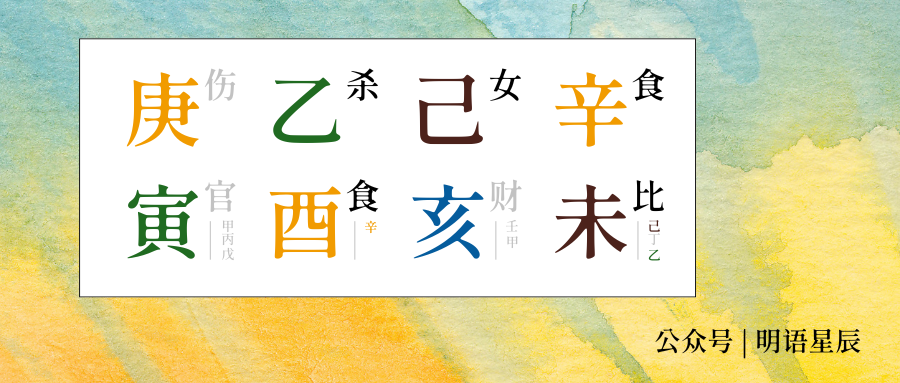

纵观 A 小姐的命盘，最引人注目的莫过于盘上的食伤：

食伤外显，以伤官为根，食神为果，从根到果由偏向正，这个表象主线下，则是食神月令透时的暗藏主线，官杀则是为此奠基的势头（以官载伤，亥未半合拱杀，以杀库载食）

—— 这个女孩注定是一个“长不大的女孩”，年月伤官与七杀的偏神外显，是与生俱来的冒险心性，内在的正官与食神，却是安乐平和的内在品格。

食神泼洒的童心贯穿始终，由此昭示了生命的预言：

“她将在家族的荫蔽下，以非同常规的路径成长（年正官载伤官），由此发展出以个人志趣导向的技艺（月食神载七杀），并以此铸就其生计、社会圈层、与人生的一切作为（日正财，时比肩载食神）”

幸运的原局下，暗藏着阴霾。看她的前两步大运，便知命运埋下了多么凶险的伏笔：

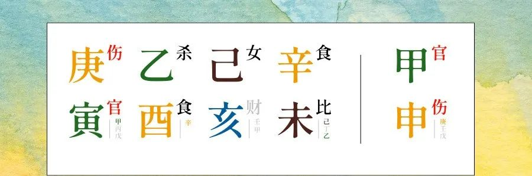

  

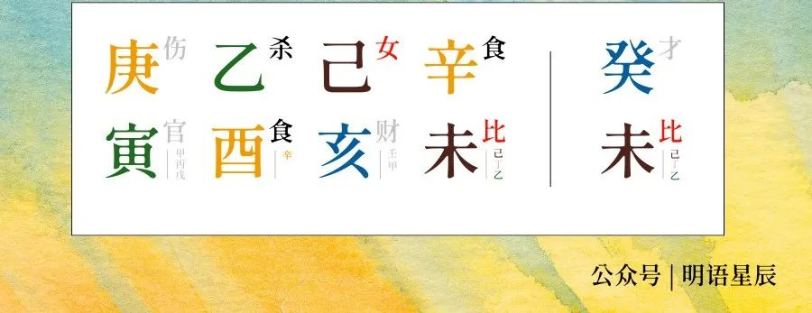

第一步大运，在家庭荫蔽（正官）下，无忧自在地成长（伤官），而家业也在此时逐渐凋零（伤官），第二步大运，独立成家、入世立业（比肩载偏财）。一个女孩在 23 岁之前就走过这样的人生历程，其处境可想而知。

A 小姐的童年也确实如此。她有一位思想前卫的母亲。为了防止孩子的视力受到损害，这位母亲不允许自己的孩子在 8 岁之前接受任何教育。

可惜天资聪颖的 A 小姐并不打算当个乖乖女 —— 在奶妈的帮助下，她 5 岁便能识字读书，从此将阅读作为贯穿一生的习惯。

她的父亲则是一位继承了富裕的家业、亲切且悠闲的男人，正如她在自传里所说：

“回首过去，我感到家庭里充满了欢乐，这要归功于父亲，他为人随和 … … 他没有坏心眼，从不妒忌别人，出奇地慷慨大方，天性开朗温良。”

A 小姐的心灵世界，自幼就充满奇幻的魅力，最典型的例子，莫过于她自童年开始，就将自己的每一栋住宅都取一个名字。

可惜富足的童年并没有持续太久，在自传里，她写道：

“大概在我五岁那年，父亲开始为加重的经济问题而烦恼。” 

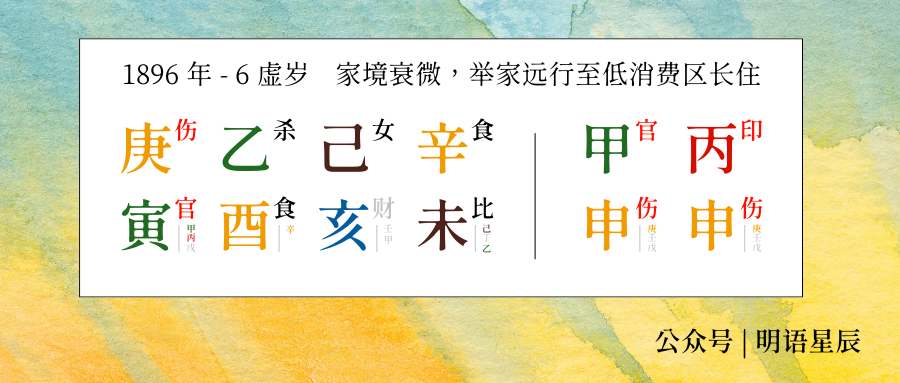

1896 年，正是大运流年伤官伏吟之时，由于经济窘迫，一家人不得不举家外出旅游，到低消费地区长期居住，以节约开销（联想[过往文章里写的伤官原型](https://mp.weixin.qq.com/s?__biz=MzkxMTM5NjUxNg==&mid=2247485755&idx=1&sn=ce239071f7c7f73c6f1e4c7b574eedca&scene=21#wechat_redirect)，不难想象为何会有这样的事情出现）

繁花终有落尽时，纵然得到了丰厚的遗产，因为父亲的经营不善，这些资产最终也消耗殆尽。1901，1902 年，年幼的 A 小姐历经父亲去世，哥哥离家，姐姐出嫁，偌大的房子里，从此只剩一对母女。

生活的困局从未如此鲜明地摆在这个不到 13 岁的女孩面前。然而，或许是原局里与生俱来的乐观主义，她的自传里对此不见任何阴郁，而是在开篇这样写道：

> “我认为，人生最大的幸运，
>
> 莫过于拥有一个幸福的童年。”

## 03 家业

A 小姐的第二、三、四步大运，堪称是一个底层逆袭的爽文历程 

—— 操持家业入世，到获得可靠的生计作为根基，再到从印绶中谋得福禄，然而，对于这个年轻的女孩而言，其中的波折足以让很多人在代入之后，便疲惫不堪。

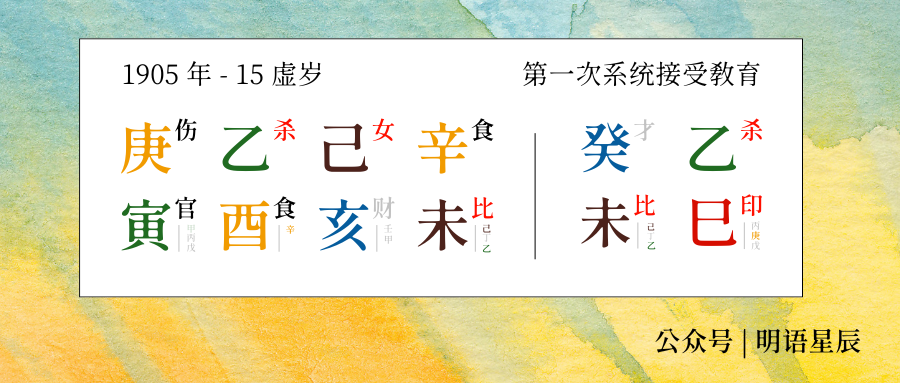

1905 年，这位在教育上异想天开的母亲，终于开始严肃地对待女儿的教育问题，将她送到了巴黎的一所学校学习音乐，这是个在学业中历练技艺的流年（正印承载七杀），恰是大运主题在流年中最典型的一次引动。

往后的几年里，她辗转了多个学校，最后确定，因为演出恐惧症，自己与音乐之路无缘，此前的教育投资也便打了水漂。

1909 年，囿于病情困扰的母亲将女儿带到了埃及，并让女儿在这个陌生的土地踏入社交界，以避免窘迫的家境和女儿害羞的个性，对寻找婚姻带来不利影响。但年轻的 A 小姐尽管把参与舞会作为日常，在很长时间里，却并没有太把婚姻之事放在心上。

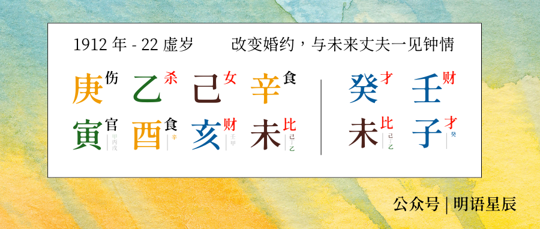

命运与巧合在此又显现了其魅力，大运的最后一年，家业的伏笔以奇妙的方式尽数回收 —— 日支透于流年，正是开花之际，底色却是大运指向的家业（偏财）

这一年，A 小姐偶遇一位名为阿尔奇的军官，两人一见钟情，以至于 A 小姐取消了已有的婚约。两年后，恰逢一战爆发，骨子里流淌着冒险血液的两个年轻人临时决定结婚，随后各自奔赴前途。

战争年代，那个时代里妇女本就狭隘的就业空间，其职业路径更加寥寥无几，A 小姐加入了志愿救护队，在医院中工作，两年后，学习了一个在当时平淡无奇，但却奠定了她小说最鲜明的特色内容之一的技能 —— 配药。

我想，她也从未想过，日后她将在自己的作品里，给大众描绘各种不同毒药的用途。

1918 年，战争结束，A 小姐也怀上了孩子。次年，她和丈夫一同来到伦敦，恰是己未比肩流年，同时引动大运、日柱与时柱，家庭与人丁的主题在此显现：

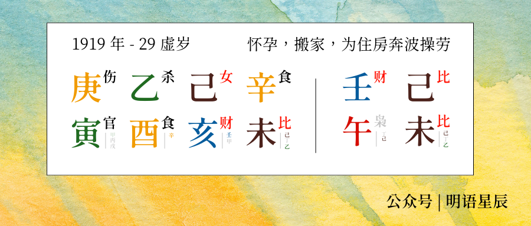

两个未到而立之年的年轻人，彼此互相依靠着，在战后的伦敦立足，没日没夜地为房产、孩子和工作的琐事奔波，最终稍有安定。

此时的 A 小姐在烦心事中把小说给忘到了脑后 —— 她虽然早在业余时间开始创作小说，却曾遭到退稿，而且两年没有音讯。

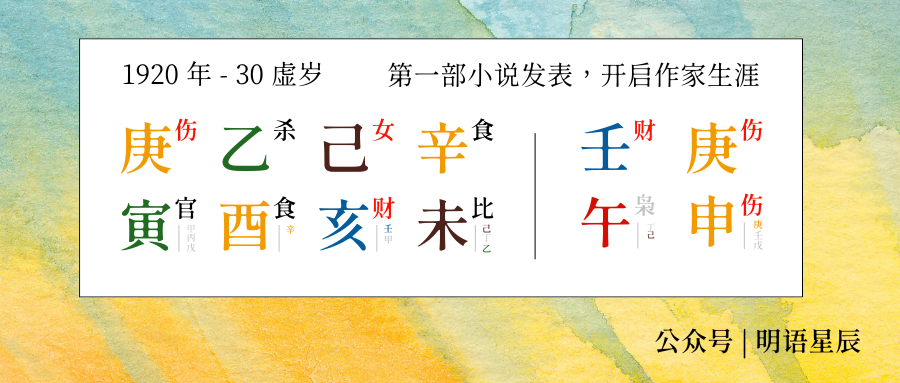

但金子总会发光 —— 1920 年，恰是伤官流年，英华尽泄，此前，她是默默无闻的作家，而此后，她不仅拥有了两千本的销量，还有了在《泰晤士报》上的连载机会。

这位日后被人以“女王”冠名的作家，其职业路途，在此拉开了帷幕。

此刻的她，也不会想到，自己离在文坛中青史留名的时刻，只剩下 6 年；

而距离双亲与配偶的彻底离去，也只剩下了 6 年。

## 04 激流

时间一眨眼就来到了 1922 年，A 小姐一生热爱旅游，足迹遍布世界各地，但在诸多旅游中，她最钟情的莫过于这次出行。在她的自传里，她甚至将这次出行作为了一个章节标题，她这样写道：

> “周游世界是我一生中最激动人心的事情之一，我激动得简直难以相信这是真的 … …”

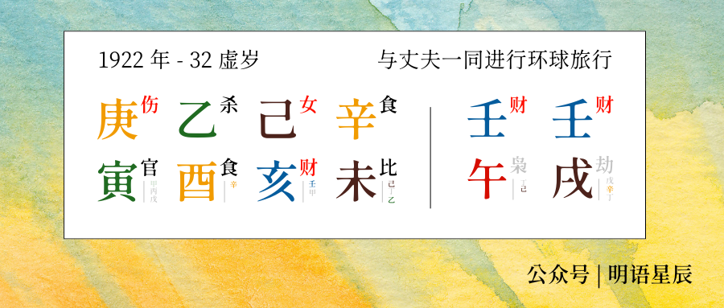

恰逢大运最后一年，这个正财坐劫财的流年，与其说是出行，倒不如说是找个法子高效地花光自己的财产。

事实上也确实如此，这次旅行是这对夫妇以大英帝国博览会先遣巡视团成员的身份周游世界，但路途中也有不小需要自行解决的开销。在尽兴和节制间，他们选择了前者。

于是，两人很不幸地预算超支，经济窘迫，以至于需要减少用餐次数而节约开销：

> “… … 我住得起饭店，但吃饭太贵了。不过我冷不丁想到一个好办法，我可以把早餐当作正餐 … … 回到家本应是愉快的团聚生活的开始，然而丑恶的现实搅碎了这个好梦，我们一贫如洗了 … …”

在这样严峻的现实挑战之下，摆在 A 小姐面前的选择，自然是找一份工作 … …

找个锤子的工作。

这个时代的女人，除去政府与杂货店中的职员，也就剩下护士保姆作为职业选择，竞争激烈，而 A 小姐最终决定当一个操持一切家业的家庭主妇，顺带拿闲暇时间写小说挣点钱。

就这样，未来名扬世界的小说家，继续开始了写作旅途 —— 仅仅只是因为现实太过窘迫。与生俱来的乐观天性让她眼中的世界依然保有光明，她在自传里这样写道：

> “家务都很单调，但当身体充分运动时，精神反而能因此得以放松，让你可以放飞思绪，任意思考和创作。”

就这样，随着书籍的陆续出版，生活逐渐回归惬意，然而亲人的病情，却打破了这一宁静。

1926 年，A 小姐的母亲得了严重的支气管炎，小病出人意料地迅速变成灾难，以至于没等到她赶到，母亲便离开了人世，只留下一栋空荡的住宅。

这是她童年成长之地，如今，她不得不劳心修缮这栋被岁月腐蚀的房子，清理废物，整理物件，以便早已褪色的回忆，在人间还有一丝驻足之处。

如果说失去双亲的痛苦和繁重的琐事让她身心俱疲，丈夫的背叛，则是压垮骆驼的最后一棵稻草。回到家中，丈夫冷酷地告知了自己的出轨，并提出离婚。

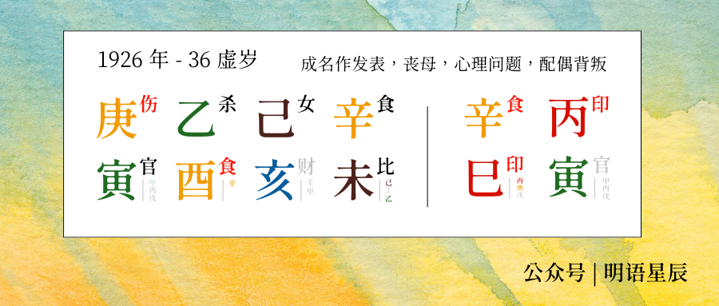

时逢正印大运官印流年，正是功成名就，事业高光之际。然而日支与大运的对冲埋下婚变的伏笔，此刻也一并爆发。

正印合食，既是印绶铸就了福禄，也是与生俱来的快乐天性，第一次被彻底扼住了咽喉。

走出阴影花了不止一年，好在 A 小姐缓过来后，也并不打算死缠烂打。

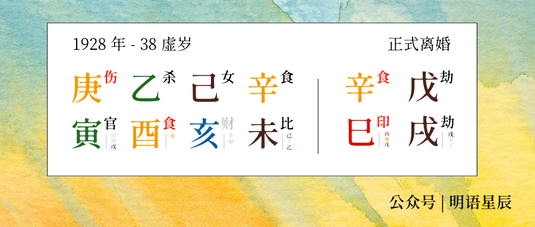

1928 年，随着劫财流年的显现，A 小姐也完成了物理意义的分家 —— 与第一任丈夫正式离婚。次年，被婚姻伤透了心的她选择了旅行散心，由此踏上了东方快车。

在这趟旅途里，她将继续写下传世经典，也将收获一个不合世俗却足够美好的姻缘。

## 05 天明

“你的旅游生活实际上像一个梦，逃离正常生活，置身于一个陌生的世界。”

1929 年，A 小姐踏上东方快车，一路东行，穿过大海与沙漠去往中东，经过乌尔时，三十多年从未对历史感兴趣的她偶然参与考古发掘现场，由此与二任丈夫马克斯·马洛温结缘。

这是一段极不寻常的关系，两人年龄相差 14 岁，一个兴趣广泛、随性而活，一个勤恳认真、醉心科研。多年以后，这位与全英国最著名的小说作家结婚的男人，甚至依然没怎么读过自己妻子的作品。

但或许一段高质量的感情关系中，最重要的并不是让这段关系对上自己预设的各种条条框框。这位骨子里沸腾着冒险血液的女人，又一次遵从自己的心意，缔结了这段不同寻常的姻缘。

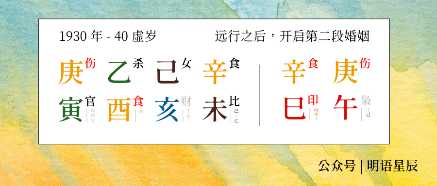

这一年，她 40 岁。与其说，这一年是在背离大运的世俗层面的恩惠（大运正性十神全部转偏），选择在离乡远行（伤官并偏印）逃离创伤，倒不如说是借此机会寻求自我的重构（禄载伤官），由此迎来了新生（巳午未三会，年时借大运流年完成汇聚整合）

余下的日子，顺从这第五步大运的“流落他乡，归于荒野”（伤官坐劫财），她长久地跟随着自己的丈夫在外考古发掘，趁着闲暇时机继续写作。

很快，后续风靡世界几十年的作品陆续问世，二战的爆发也并未挡住她的创作脚步，也没有淡化两人深厚的感情。

虽然因战争不得不和丈夫分离多年，但二人重逢时，两人的对话让人忍俊不禁：

> 他还是那个马克斯！似乎昨天才走，今天又回到了我身边。我们俩重逢了。这时，我闻到一股难闻的煎鱼味，我们俩慌忙跑进屋。
>
> “你到底在做什么东西啊？”马克斯问道。
>
> “腌鲑鱼。”我说，“你最好也吃一条。”随后我们彼此打量了一番。
>
> “马克斯，”我说，“你重了两磅吧？”
>
> “大概吧，你也没瘦啊。”他说。

A 小姐的自传，到此落幕。

写完自传的时间，是 1965 年，前后历时 15 年，眨眼就是 75 岁高龄。这个人生一半时间在外旅游的女人，实则比绝大多数作家都要高产，几乎依然保持着一年一本书的节奏。

她也并非毫不在意死亡 —— 二战期间，考虑到自己或许会在空袭中被炸死，她私下写完了两本书，一本为女儿而作，另一本则为伴侣而作。

这两本书在 1975 年出版，巧合的是，这两本书出版后的不到一年，她也与世长辞，享年 85 岁。

最后的最后，这个八字里食神贯穿一生的女人，在自传的结尾留下了这么一段话，我想，这也足以作为对食神的注解：

> 一个孩子说过：“感谢上帝赐予我丰盛的晚餐。”
>
> 如今，在七十五岁的时候，我能说些什么呢？
>
> “感谢上帝赐予我幸福的一生，给了我深厚的爱。”

---

本文主人公：阿加莎·克里斯蒂

推理小说三巨头之一，推理小说黄金时代的开创者，英国 20 世纪最著名的作家，一生笔耕不辍，所创作的 78 部推理小说以 44 种语言出版，估计售出约 20 亿册，多部小说被不断改编为各类影视作品。

1920 年，发表《斯泰尔斯庄园奇案》，开启推理小说生涯。

1926 年，发表《罗杰疑案》，奠定在推理小说中的先锋地位。

1934 年，发表《东方快车谋杀案》，探讨了法治不健全的情况下的私刑寻仇，人情正义与法理争议之间的重重矛盾，数次被搬上荧幕，至今仍是经典。