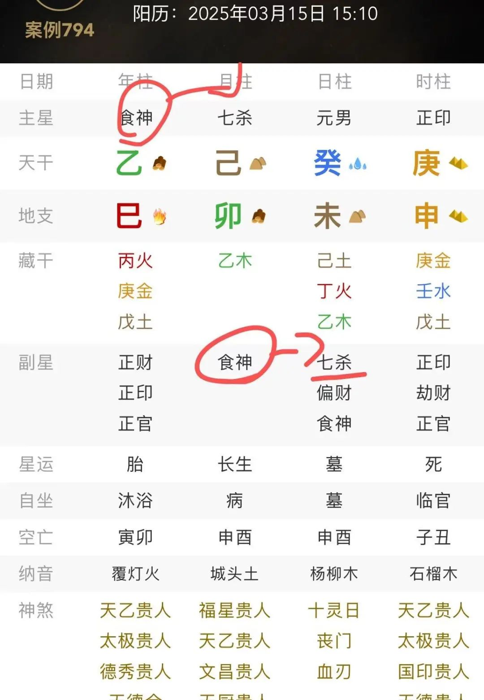

# 十神精讲｜论七杀 （如何化杀为己用；天生的权贵）

大家好，我是网吕；

之前发过很多七杀的文章，但无奈有些朋友看不太懂

[是七杀？是偏官？](https://mp.weixin.qq.com/s?__biz=MzkxMTQ4OTAxMg==&mid=2247487840&idx=2&sn=e6ea34be0facab31e86578d4f66937db&scene=21#wechat_redirect)

[论七杀——如何自查 破解官杀混杂 化为己用](https://mp.weixin.qq.com/s?__biz=MzkxMTQ4OTAxMg==&mid=2247487765&idx=2&sn=253c1fed7b32ada797e6c77273cae7f7&scene=21#wechat_redirect)

[什么是七杀？该怎么避免七杀克己导致运势低迷？](https://mp.weixin.qq.com/s?__biz=MzkxMTQ4OTAxMg==&mid=2247483958&idx=1&sn=58ebdef73d413295879d12b8fdc88a19&scene=21#wechat_redirect)

我这一想也是，基础的七杀文章我还没有发过，那咱们今天就细细聊一聊我眼中的七杀。

简单回顾：

> “十神是术数中的经典理论体系，了解十神对我们学习术数有着至关重要的作用，其对自我认知方面，人际关系方面，人生规划方面都有一定的帮助；
>
> 十神能帮助人们了解自身性格特点和潜在能力。比如，正印代表智慧和学习能力，正印强的人通常在学业和专业领域表现出色；伤官代表表现和自我表达，伤官强的人通常在艺术、演讲等领域有优势。通过分析自身命盘中十神的强弱，可发现自己的天赋与不足，从而有针对性地自我提升。比如七杀旺的人勇敢果断，但要注意控制脾气和冲动。
>
> 且不同的十神体现了不同的人际关系模式。比肩、劫财重视朋友义气，能在朋友困难时出手相助，但自我意识较强，相处中可能会有分歧；食神旺的人善于与人相处，亲和力强，容易结交新朋友；正印旺的人是很好的倾听者和支持者，能给予他人精神上的安慰和鼓励，在人际关系中很受欢迎。了解这些特点，有助于人们在人际交往中更好地理解他人，调整相处方式，提升人际关系。
>
> 并且可启示人们选择适合的人生道路和职业方向。例如，正官代表规范和秩序，适合在有明确规则和层级的环境中发展，如政府机构、大型企业等；偏财象征机会和意外之财，适合从事投资、销售等具有挑战性和不确定性的职业。在人生的不同阶段，十神的变化也能反映出不同时期的机遇和挑战，帮助人们提前规划，把握时机。
>
> 十神理论是我认为术数领域中为数不多的真多伪少的内容。故我认为十神的智慧可以运用到各个领域上去。”

## 一、七杀的阴阳辩证与唯物哲学观

七杀（偏官）

作为四柱命理中的凶神之首，其本质是同性相克之力，具有刚烈、竞争、压迫的特性。（例如庚金是甲木的七杀，例如壬水是丙火的七杀）

从阴阳辩证的角度看，七杀属阳，象征“刚猛之力”，需以阴柔手段（如印星化泄、食伤制衡）调和；

上述还体现了道德经中“柔弱”的体现，阴阳制约，可将七杀化为利己的能量。

所谓偏官，就好比甲木遇见庚金这类情况。阳干见到阳干，阴干见到阴干，就把它叫做偏官，它们不能像阴阳相配那样成为配偶关系。就如同经书中所说：“两个女子不能共同居住在一起，两个男子也不可以并立相处。”

但是现在这个社会，包括现代占卜学，我主张“思辨”，一切都有利有弊，两个男孩，两个女孩，也可以独处，这没什么问题。

所以从唯物辩证法视角，七杀既是矛盾的对立面（压力、危机），也是推动事物发展的动力（激发潜能、成就功业）。

其核心在于“制化”二字：无制则凶险，有制则化权贵。

接下来我的文章，将重点分析我眼中七杀的利与弊。

正因为福祸相依，故你不要觉得你命局中七杀过旺就不好，发挥其利，造福于己。

（哪怕你是身弱之人，你逢七杀也未必是不好的，尽管你不选择制化它，七杀仍会发挥其有利的作用）

经书上说：“人命中有偏官，就好像抱着老虎睡觉，虽然可以借助老虎的威风来震慑其他牲畜，但稍微失去防备，一定会被老虎咬伤而后悔不及，不能不有所顾虑啊。”

### 1、七杀的利与弊：

#### （1）利：

激发斗志，七杀为“压力之神”，能逼迫命主突破舒适区，成就非凡事业（如《滴天髓》云：“煞神最喜身强抗，制伏得宜显功名”）。 

我就是一个七杀格之人。

我绝不甘于平凡过完我这平凡的人生。

不平凡一定是命局中有七杀之人的关键词。

跌宕起伏，说是小说剧情一点不为过。

但我是一个身弱的七杀格人，故在理法中我不喜七杀，但是我却也能通过七杀而得力，因为我善用我的智慧，我的食神，以及印星，认知的改变才是创命的关键，这比你做再多法事都有意义。

（有的人七杀不在月支，而零散的分布在其他柱，那可以结合落柱的时限进行分析，例如年柱代表孩童时期，月柱代表青年时期，日柱代表中年时期，时柱代表晚年时期）

七杀格者，多半是身弱之人

内心会比较敏感的同时

压力很大

睡前胡思乱想

一点小事不断的被拆解

而如果七杀得制者（如杀印相生、食神制杀），多具领导力与决断力，适合军政、企业高层等权威领域，或者进行学术研究。

我接下来会按照原局得制和后天得制两条线进行分析。

原局得制，便是命局中自带食神，自带印星。

以食神为例，下图就是食神制杀；

后天得制，包括大运，流年，流月，流日遇见食神或者是印星。（鼓励以食神制杀，伤官你可以视作食神的高频版；道以“柔和”为主，伤官制七杀略显“刚烈”）

（七杀的吉凶取决于命局整体配置，非单一十神可定，大运流年引动时，需重新评估制化力量（如原局食神制杀，遇印运则制化矛盾）且我们要时刻发挥自己的主观能动性，后天环境与个人选择可改变轨迹如七杀无制者从事军警、外科医生等高压职业，反能化煞为权）

又或者是，你在生产生活之中，在实践中，自己形成印力，或者是食神之力；

简单说，印就是学习力，认知力；食神就是创造力，显化力。

提升知识素养，可以通过广泛阅读、学习，不断丰富自己的知识体系，从而让自己在思考和表达时更有深度和内涵，并且发挥其创造力和天赋，这可以让你在艺术、文学、工作等领域创造出有价值的成果，能让自己的影响力得以彰显。

这是七杀成分多的人，在原局没有之时，首先应该做的；

而且优先顺序是食神>印星；

在观察中发现，想的多做的少的人，也容易焦虑；这并不能将“七杀”化作利己的能量。

但是话接上文，如果我七杀多，我不补印，不去管食神，顺其自然，可以吗？

当然可以了；

无为而治也是命局中的一个方法，但是你需要知道的是，七杀多，无印星，食神之时：

若身旺，自己可能会更有狠劲，脾气更为刚烈，说话更能更于直率；

若身弱，自己可能会变得更胆小，更心事重重。

（但是观察中，部分身弱七杀格可能会在外“胆大”，在外面很有震慑力，实则内核担心，利用外表强硬的面具来伪装自己内核的脆弱）

前者更适合当领导，杀出一条自己的路；后者更有个人防范意识，更能共情他人，更能在人群中有“中和之力”。

七杀，一定是不凡的。

讲真的，你随意去观察一个命局中七杀成分多的人，他一定会有独特的故事，甚至有些故事是难以启齿的。

七杀旺者常处逆境；

但这可反培养出敏锐洞察力与快速反应力

（如《三命通会》言：“七杀如刃，善用者能斩荆棘”）。 

但是我个人会更建议七杀之人“创造”，“显化”；

这会更符合现社会，否则内心的“能量”，不宣泄出去，只会更加疲惫；

但是具体七杀对于你是好是坏，还需要不断细化，比如大运走到能够制伏偏官的运势中，这就不错。但如果遇见魁罡，身旺又遇见羊刃，等等凶神都聚集在一起，大运又走到七杀旺盛的运势中，那么凶险和灾害就多得难以用言语表达了，这是可想而知的。

#### （2）弊：

七杀最恐怖的点，是心理摧残；

事实上，绝大部分的“疾病”，都是由心理因素，不断引起的；

而当七杀无制时，心理会摇摆不定，如心猿意马，慌乱，心如刀绞；

则易招灾祸。

除此之外，七杀克身过重，除了心理之外，也会有一定的实质情况；

例如身体抱恙，或者是口舌官非。

弊端其实就是利端的相反版；

七杀过旺，会让它洞察力强，但是也会多疑、暴戾；

易陷入偏执或极端行为

（如《穷通宝鉴》载：“杀重无制，性如猛虎难驯”）。 

七杀主竞争与对抗，命局失衡时易树敌招怨，导致孤立。 

七杀之人，很容易单打独斗，要不就是看不上别人，要不就是社恐，要不就是懒得维系某个关系，随时想要抽离。

故七杀之凶吉，本质在于命局中“矛盾转化”的条件

——身强可抗杀，身弱需制化。

其存在既是威胁，亦是机遇，符合唯物辩证法的“对立统一律”。

（别说什么身旺的人怎么那么幸运，遇见七杀就好；身旺的人通常情况下，命局中官杀成分少，印星比劫成分多，那才是身旺之人的人生课题）

## 二、一些基础案例分析：

（只思考官杀制化的层面）

### 1、杀印相生格：

条件：七杀透干，印星贴身化杀（如甲木日主见庚杀透，地支藏壬癸印）。 

作用：印星化杀为权，主贵气与学识。

如《滴天髓》云：“杀印相生，功名显达”。此格需身弱杀旺，印星有力，忌财星破印。

 

简单举个例子，乾造壬子、庚戌、甲寅、丙寅。

月令戌土藏辛官，庚杀透干，时支寅木为甲木强根，丙火食神制杀，壬水印星化杀，形成杀、印、食三方制化；

虽然它是偏弱，就是被制化了；

（但个人比较鼓励，一杀一制，或两制，这个命盘中制的成分太多，七杀又太少，可能威慑力，震撼力，不如七杀多者；但是挺好的了，一个七杀透干，就完全够我们使用了，就足够成为一个大人物了）

### 2、食神制杀格：

条件：七杀旺而食神有力，制杀；

作用：食神为“智慧制暴”，主以才略掌权。

需食神与七杀力量均衡，过制则失威，不足则杀反噬。 

目前来看还是比较均衡的，聪明的人会发现命局中正偏财比较多，财星生杀，故三柱食神算作均衡。

（从此点还能引申一个内容，如果一个人七杀少，食神多，其实挺招人烦的，要不就是爱说，但是内容没营养，嘻嘻哈哈的；要不就是太懒，不运动，不健康的“胖“）

### 3、羊刃驾杀格 

条件：日主见羊刃，七杀透干，以刃抗杀。

身弱喜羊刃，身旺忌羊刃，这是最基础的理法之一，更多内容可见

[命理学中什么是羊刃 飞刃 血刃；怎么查；组合后的影响是什么](https://mp.weixin.qq.com/s?__biz=MzkxMTQ4OTAxMg==&mid=2247485081&idx=1&sn=413fc82cfb8da9e0e1eab6ad2af76b1b&scene=21#wechat_redirect) 

另外，天干见劫财，也可以视作羊刃；比如庚金的羊刃是酉，就是因为酉中有辛气；但是羊刃驾杀格必须要求身弱；且同柱不算，比如月支是我的七杀，月干是我的劫财，这种不可以；

最理想的则是月支羊刃。

其他的情况，还是要率先参考印-食神-羊刃这个顺序。

作用：以暴制暴，化凶为权。

需身杀两停，但忌财星生杀或印星生刃。也就是说当你命局中财星成分过多之时，羊刃无用（除非月支见羊刃）；或者是你印星过多之时，还有羊刃，这就代表制化七杀过多，也不太好，此时后天再遇官杀，财星之时为吉。 

举个例子，乾造乙酉、辛巳、庚申、丙戌。

日主庚金坐申金禄位，月干辛金劫财合杀（丙火七杀），另外年支酉也见杀。

但是这个格局不够完美，严格上来说，这个命格中制杀倒没问题，但是不仅依靠的是羊刃，还有印星以及食神。

### 4、弃命从杀格 

条件：日主极其之弱，达到从弱范畴，七杀独旺，无印比帮扶。 

作用：全盘顺杀之势，主大富大贵，但需纯粹无破（如混官、见印比则破格）。 此为阴阳转化的内容，从杀就喜杀了，因为命局中七杀成分太旺了； 

### 5、官杀混杂格：

这个主要看[论七杀——如何自查 破解官杀混杂 化为己用](https://mp.weixin.qq.com/s?__biz=MzkxMTQ4OTAxMg==&mid=2247487765&idx=2&sn=253c1fed7b32ada797e6c77273cae7f7&scene=21#wechat_redirect)

## 三、核心法则

### 1、制化七杀的三重境界；

难易程度按照初级-高级的程度；其中初级是基础，高级需要建立在初级的基础上操作；

初级制杀：以食伤直接克制（如甲木用丙火制庚杀），这是最简单，最实用，最根本的法则；后天如创造力，显化力，表达力。

中级化杀：以印星转化杀性（如壬水化庚杀生甲木）原局层面，印星须通根或得禄，或零散的印星较多，且忌财星破印。

后天层面，将威慑力，权力，转化为智慧，转化为学术能量，但在这个阶段要注意欲望，贪心，身弱者还应注意财盛身衰的问题，要不断的让自己在“财富的积累”与“内心惶恐不安，不踏实”的矛盾中成长。

高级合杀：以羊刃（劫财）或禄神合杀（如乙木用庚金合乙劫）；原局层面，需要月令见羊刃，或者是命局中劫财成分多，若日主有根气，比如庚申日主，丙午日主那就更好了；

后天层面，将威慑力，权力，转化为自己的人格优点，并且培养自己知行合一的境界，不滥用七杀之力，七杀不再可以随意的让自己内心掀起波澜，遇见危险之时不必过度担忧；

反复强调，杀不可以过制，否则跟没有七杀没有区别；

若原局命局中达到高级合杀的这个程度，那也极有可能就是七杀在你命盘中被限制过多，那七杀可能就没啥用了。

此时七杀虽然不再是你的人生课题，但可能印星过旺、比劫过旺、食神过旺会是你崭新的人生课题。

我们要掌握好这个度，这也是阴阳理法中告诉我们的核心内容。

你想要一个什么人生，是那种聪明，有权，有智慧，有威慑力的人生，还是那种安居乐业，潇洒自由，平平淡淡的人生，就得你自己来决定，因为谁也没有办法为你的人生负责任。

你要知道的是，七杀是一种能力；

比如有的孩子，命局中就没啥七杀，但就是不聪明，不机警，一说一骂贼皮实，还在那呵呵呵呵的笑，这种情况，如果你希望其聪明机警，那就可以后天补七杀；反之你觉得“傻傻呼呼”的挺好，啥也不愁，没烦心事，挺好，那你就不用补；

人就是很矛盾的，人总在世界两端不断对抗，向另一端的人说Hi，我要成为你。

我见过正财者，想做偏财的；我见过呆呆的，想变聪明的；我也见过特别聪明，特别累的，跟我说太累了，想的太多，太焦虑了，如果我脑子里能不想那么多东西就好了；

人总是这样的，我都习惯了。

故你想怎么样都可以，你要确定好自己想要的人生，到底是什么。